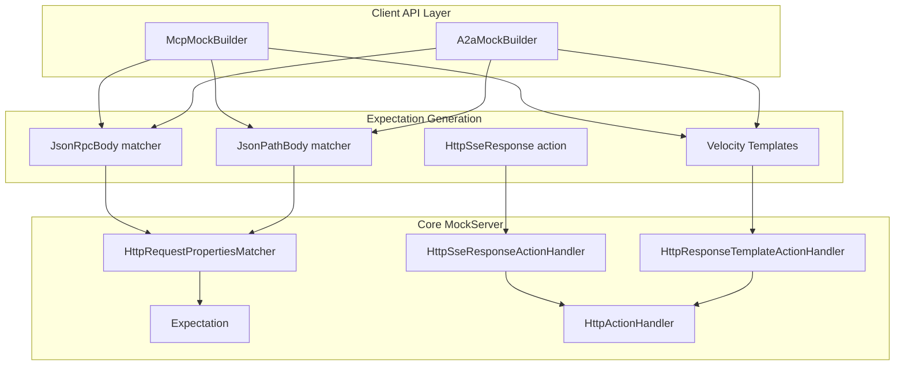
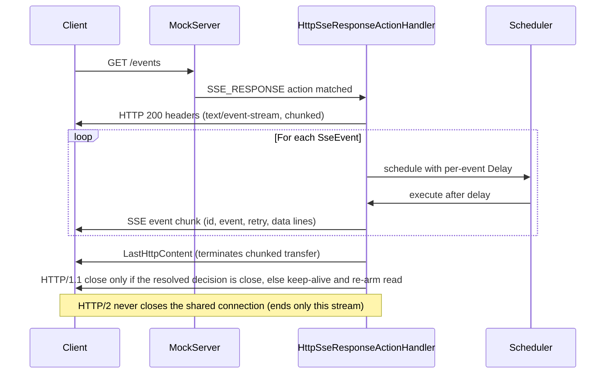
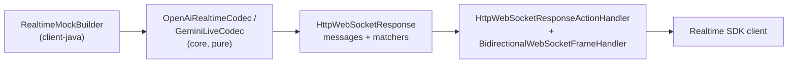
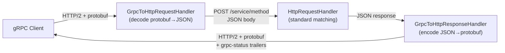
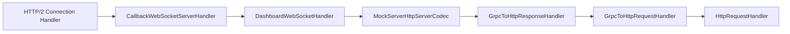
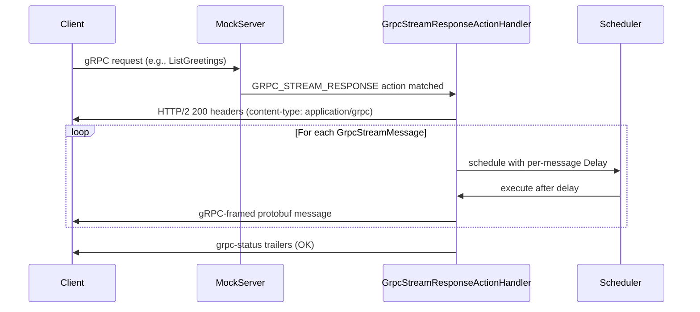
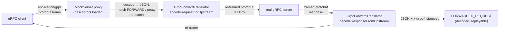
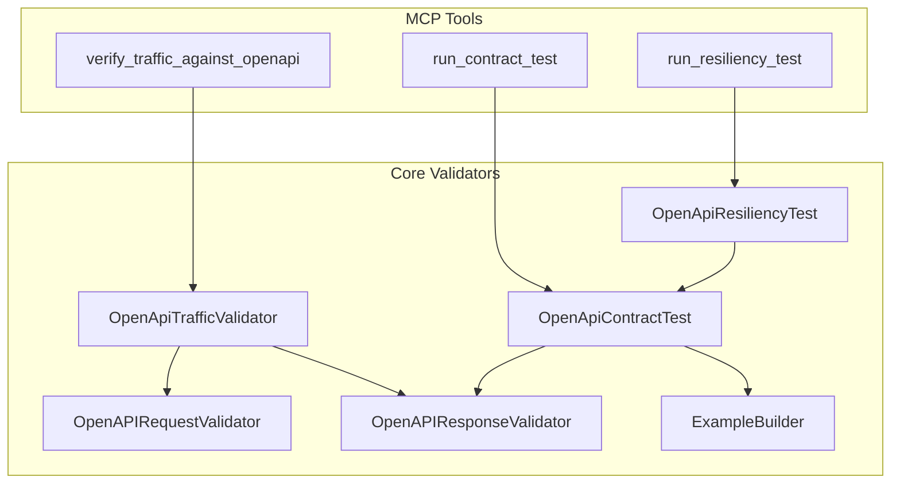
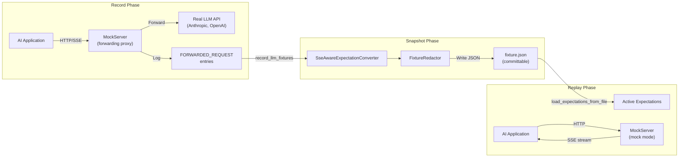

# AI & RPC Protocol Mocking (SSE, WebSocket, JSON-RPC, MCP, A2A, gRPC)

## Overview

MockServer supports mocking AI protocol servers including MCP (Model Context Protocol) and A2A (Agent-to-Agent Protocol). This is distinct from MockServer's own MCP control plane (`/mockserver/mcp`) — these features enable mocking *other people's* MCP and A2A servers for testing.

**MockServer's own MCP control plane** (`/mockserver/mcp`) enforces both authentication and per-tool authorization when `controlPlaneAuthorizationEnabled=true`. `McpToolRegistry` classifies every tool as read or mutate (fail-closed — unclassified tools default to MUTATE), and `McpRequestProcessor` calls `HttpState.controlPlaneToolAuthorized` before executing any `tools/call`. A principal with only the READ role is `403`'d on mutating tools (`create_expectation`, `clear_expectations`, `reset`, etc.). See [tls-and-security.md](tls-and-security.md#control-plane-authentication) for the full authorization model.

## Architecture

### Core Building Blocks

Two primitive building blocks enable all AI protocol mocking:

1. **SSE Streaming Responses** (`HttpSseResponse`) — an `Action` type that streams Server-Sent Events to the client
2. **JSON-RPC Body Matching** (`JsonRpcBody`) — a `Body` matcher that validates JSON-RPC 2.0 method names and optionally validates `params` against a JSON Schema

### Higher-Level Builders

Built on top of the primitives:

- **`McpMockBuilder`** — generates a complete set of `Expectation[]` objects for a mock MCP server
- **`A2aMockBuilder`** — generates a complete set of `Expectation[]` objects for a mock A2A agent

### Layer Architecture



## SSE Streaming Responses

### Model

- **`SseEvent`** (`mockserver-core/src/main/java/org/mockserver/model/SseEvent.java`) — a single SSE event with fields: `event`, `data`, `id`, `retry`, `delay`
- **`HttpSseResponse`** (`mockserver-core/src/main/java/org/mockserver/model/HttpSseResponse.java`) — action type extending `Action<HttpSseResponse>` with `statusCode`, `headers`, a list of `SseEvent` objects, and a `closeConnection` flag

### Action Type

`Action.Type.SSE_RESPONSE` was added to the `Action.Type` enum. `HttpActionHandler` routes requests matching an `HttpSseResponse` action to `HttpSseResponseActionHandler`.

### Handler

`HttpSseResponseActionHandler` (`mockserver-core/src/main/java/org/mockserver/mock/action/http/HttpSseResponseActionHandler.java`) writes the SSE stream directly via Netty's `ChannelHandlerContext`. It:

1. Writes HTTP response headers (`Content-Type: text/event-stream`, `Transfer-Encoding: chunked`, `Cache-Control: no-cache`) plus any custom headers from the action. The `Connection` header now reports the end-of-stream decision that is actually taken (`keep-alive` when the connection will be kept, `close` when it will be closed) rather than always claiming `keep-alive`
2. Recursively schedules each event via `Scheduler`, using the per-event `Delay` if present or executing immediately if not
3. Formats each event per the SSE specification — multi-line `data` values are split into multiple `data:` lines; `id`, `event`, and `retry` fields are written when non-null
4. Writes `LastHttpContent.EMPTY_LAST_CONTENT` to terminate the chunked stream, then resolves whether to close (see below). For an **HTTP/1.1** request it closes the channel only when the decision is to close, and otherwise re-arms the connection read so the client's next request is served. For an **HTTP/2** request the shared multiplexed connection is **never** closed — the terminal frame carries the request's stream id and ends only that stream, so closing the parent channel would GOAWAY every sibling stream (GitHub issue #2641)

The HTTP/1.1 close decision mirrors the non-streaming path (`NettyResponseWriter.writeAndCloseSocket`): an explicit `closeConnection` on the `httpSseResponse` wins; otherwise the request's own keep-alive intent decides (`request.isKeepAlive()`); and `alwaysCloseSocketConnections` forces a close regardless. An **absent** `closeConnection` therefore no longer means "always close" — it honours the client's keep-alive, so a streaming response no longer breaks a connection it advertised as reusable.

> **Remaining inconsistency — an absent `closeConnection` still differs across the streaming actions.**
> Since the issue #2641 fix, SSE (`HttpSseResponseActionHandler`) treats an absent value as
> **keep-alive-aware** (close only if the request itself is not keep-alive, or `alwaysCloseSocketConnections`
> is set). WebSocket (`HttpWebSocketResponseActionHandler`) still treats an absent value as **close**, and
> gRPC streaming (`GrpcStreamResponseActionHandler`) as **don't close**. None of the schemas declares a
> `default`.
>
> **Recommendation (deferred, not yet actioned): normalise WebSocket to match.** SSE and gRPC now both
> hold the stream's connection open by default; only WebSocket still closes on an absent value. Aligning
> WebSocket is deliberately *not* bundled here because it changes server behaviour for existing WebSocket
> users who rely on the current default, so it needs its own change, review and prominent changelog entry.
> Deferring is safe because the dashboard code generator always emits `closeConnection` explicitly, so
> generated snippets do not depend on the default in either direction.

Since T1.2, streaming payloads can be **templated**: setting an optional `templateType` (`VELOCITY`/`MUSTACHE`/`JAVASCRIPT`) on the `httpSseResponse` (or `httpWebSocketResponse`, or per-message on `grpcStreamResponse`) renders each event's `data` (each WebSocket text frame / each gRPC message `json`) as a response template against the triggering request via the shared `StreamTemplateRenderer` — same request/template context as `httpResponseTemplate` (`$!request.body`, `$jsonPath(...)`, built-in helpers, `faker`, `scenario`). Rendering is per event/message and opt-in; with no `templateType` payloads are emitted byte-for-byte unchanged. See *Templated streaming payloads* in [request-processing.md](request-processing.md).



### Serialization

- **`SseEventDTO`** (`mockserver-core/.../serialization/model/SseEventDTO.java`) and **`HttpSseResponseDTO`** (`mockserver-core/.../serialization/model/HttpSseResponseDTO.java`) handle REST API serialization and deserialization
- **`ExpectationDTO`** includes an `httpSseResponse` field mapped to `HttpSseResponseDTO`
- `BodyDTODeserializer` and `StrictBodyDTODeserializer` handle the `JSON_RPC` body type
- `BodyDTO.createDTO()` maps `JsonRpcBody` to `JsonRpcBodyDTO`

## JSON-RPC Body Matching

### Model

**`JsonRpcBody`** (`mockserver-core/src/main/java/org/mockserver/model/JsonRpcBody.java`) extends `Body<String>` with `Body.Type.JSON_RPC`. It has two fields:

| Field | Required | Purpose |
|-------|----------|---------|
| `method` | Yes | Method name to match (exact string or Java regex) |
| `paramsSchema` | No | JSON Schema string; when present, `params` is validated against it |

### Matcher

**`JsonRpcMatcher`** (`mockserver-core/src/main/java/org/mockserver/matchers/JsonRpcMatcher.java`) validates:

1. `jsonrpc` field equals `"2.0"`
2. `method` field matches — first by exact equality, then by `String.matches()` (regex)
3. If `paramsSchema` is set, `params` is validated using `JsonSchemaValidator`; a missing `params` field fails validation
4. Batch requests (JSON arrays) — matches if **any** element in the array satisfies all the above conditions

### Integration Points

- `HttpRequestPropertiesMatcher.buildBodyMatcher()` — added the `JSON_RPC` case to route to `JsonRpcMatcher`
- `BodyDTODeserializer` and `StrictBodyDTODeserializer` — support two JSON representations:
  - Typed: `{"type": "JSON_RPC", "method": "tools/list"}`
  - Wrapped: `{"jsonRpc": {"method": "tools/list"}}`

### Template Object Enhancement

`HttpRequestTemplateObject` (`mockserver-core/.../templates/engine/model/HttpRequestTemplateObject.java`) was extended with three fields extracted from JSON-RPC request bodies:

| Field | Velocity variable | Value |
|-------|-------------------|-------|
| `jsonRpcId` | `$!{request.jsonRpcId}` | String representation of the ID (text nodes use text value; numeric/null use `toString()`) |
| `jsonRpcRawId` | `$!{request.jsonRpcRawId}` | Raw JSON representation — preserves `1` for numbers and `"abc"` for strings; used for embedding directly in JSON response bodies |
| `jsonRpcMethod` | `$!{request.jsonRpcMethod}` | The `method` field value |

Extraction is best-effort: any parse error is silently swallowed, leaving all three fields null.

## WebSocket Mocking

### Model

- **`WebSocketMessage`** (`mockserver-core/.../model/WebSocketMessage.java`) — Single WebSocket message with `text`, `binary`, and `delay` fields
- **`HttpWebSocketResponse`** (`mockserver-core/.../model/HttpWebSocketResponse.java`) — Action type extending `Action<HttpWebSocketResponse>` with `subprotocol`, `messages` list, and `closeConnection` flag

### Action Type

`Action.Type.WEBSOCKET_RESPONSE` was added to the enum. This triggers the `HttpWebSocketResponseActionHandler`.

### Handler

`HttpWebSocketResponseActionHandler` performs the WebSocket handshake using Netty's `WebSocketServerHandshakerFactory`, then sends configured messages as `TextWebSocketFrame` or `BinaryWebSocketFrame`. It:

1. Reconstructs a Netty `FullHttpRequest` from the MockServer `HttpRequest` (preserving headers including `Sec-WebSocket-Key`)
2. Performs the WebSocket handshake
3. Removes HTTP codecs from the pipeline
4. Sends each message with optional per-message delays
5. Optionally sends `CloseWebSocketFrame` and closes the connection

### Usage

```java
mockServerClient.when(
    request().withMethod("GET").withPath("/ws")
).respondWithWebSocket(
    HttpWebSocketResponse.webSocketResponse()
        .withMessage(WebSocketMessage.webSocketMessage("hello"))
        .withMessage(WebSocketMessage.webSocketMessage("world"))
        .withCloseConnection(true)
);
```

### Proxy passthrough (relay to a real upstream)

WebSocket is no longer mock-only. When MockServer is used as a **proxy** and a WebSocket upgrade request matches no
`WEBSOCKET_RESPONSE` expectation (or matches a plain `FORWARD` expectation), MockServer relays the connection through
to the real upstream WebSocket server — completing the upstream `ws`/`wss` handshake, relaying the `101` back to the
client, then relaying frames bidirectionally until either side closes. The relayed frames are recorded (bounded by
`webSocketProxyMaxRecordedFrames`) so `retrieveRecordedRequests` and the dashboard show the traffic. This is
implemented at the proxy/relay layer by `WebSocketProxyRelayHandler`, not the mock action handler — see
[netty-pipeline.md → WebSocket Proxy Passthrough](netty-pipeline.md#websocket-proxy-passthrough).

## Realtime Voice API Mocking (OpenAI Realtime, Gemini Live)

### Outcome

MockServer mocks the two dominant realtime (voice) LLM protocols — the **OpenAI Realtime API** (GA 2025 event
protocol) and the **Google Gemini Live API** (`BidiGenerateContent`) — so an agent/app that speaks them can be
tested fully offline, with no real API and no audio hardware. It is a thin layer over the existing WebSocket mock
primitive: **no new `Action.Type`, DTO, or JSON schema**. A pure event codec generates the provider-correct event
JSON; the Java client `RealtimeMockBuilder` wires that into a single `httpWebSocketResponse` expectation (initial
pushed frame + per-incoming-frame matchers), exactly as A2A streaming reuses `httpSseResponse`.



### Components

| Class | Module | Package | Purpose |
|-------|--------|---------|---------|
| `RealtimeProvider` | core | `org.mockserver.llm.realtime` | `OPENAI_REALTIME` / `GEMINI_LIVE` (separate from the HTTP `Provider` enum) |
| `RealtimeModality` | core | `org.mockserver.llm.realtime` | `AUDIO` (transcript + audio deltas) or `TEXT` |
| `RealtimeTurn` | core | `org.mockserver.llm.realtime` | Provider-neutral scripted assistant turn (text, audio transcript, audio bytes, usage) — the realtime analogue of `Completion` |
| `RealtimeStreamingPhysics` | core | `org.mockserver.llm.realtime` | Deterministic `tokensPerSecond` + time-to-first-token timing (jitter-free WS analogue of `StreamingPhysics`) |
| `RealtimeEvent` | core | `org.mockserver.llm.realtime` | One rendered event frame `{json, delayMillis}` |
| `OpenAiRealtimeCodec` | core | `org.mockserver.llm.realtime` | Pure OpenAI Realtime event codec |
| `GeminiLiveCodec` | core | `org.mockserver.llm.realtime` | Pure Gemini Live event codec |
| `RealtimeMockBuilder` | client-java | `org.mockserver.client` | Builds the `httpWebSocketResponse` expectation |

### How the flow maps onto the WebSocket primitive

The realtime session is inherently request-driven, which is exactly what the WebSocket mock's `matchers` model
(incoming frame → scripted `responses`) provides, plus one connect-time push (`messages`):

- **OpenAI** — `session.created` is pushed on connect (`messages`); matchers answer `session.update` →
  `session.updated`, `conversation.item.create` → `conversation.item.created`, and `response.create` → the full
  scripted response event sequence.
- **Gemini** — nothing is pushed on connect; matchers answer `setup` → `setupComplete` and `clientContent` → the
  scripted `serverContent` chunk stream. Matchers use a DOTALL regex on the distinctive top-level key (`"setup"`,
  `"clientContent"`) / OpenAI `"type"` value.

Because the bidirectional matcher schedules a match's response frames **concurrently** (each with a delay relative
to the match instant), the builder converts the codec's per-event gaps into **monotonically-increasing cumulative
absolute** delays (`RealtimeMockBuilder.toMessages`, `MIN_STEP_MILLIS` floor) so the event stream stays strictly
ordered. The same script answers every matching frame, so a client that repeats `response.create` /
`clientContent` receives the scripted turn each time. `closeConnection` is `false` — the client owns disconnect.

### Protocol coverage matrix (event type → status)

**OpenAI Realtime (server events)**

| Event | Status |
|-------|--------|
| `session.created` (connect push) | ✅ mocked |
| `session.updated` (← `session.update`) | ✅ mocked |
| `conversation.item.created` (← `conversation.item.create`) | ✅ mocked |
| `response.created` | ✅ mocked |
| `response.output_item.added` | ✅ mocked |
| `response.content_part.added` | ✅ mocked |
| `response.output_audio_transcript.delta` / `.done` | ✅ mocked (AUDIO) |
| `response.output_audio.delta` / `.done` | ✅ mocked (AUDIO, silence placeholder bytes) |
| `response.output_text.delta` / `.done` | ✅ mocked (TEXT) |
| `response.content_part.done`, `response.output_item.done` | ✅ mocked |
| `response.done` (with `usage`) | ✅ mocked |
| `input_audio_buffer.*` / server VAD (`speech_started`/`stopped`) | ⛔ deferred |
| `conversation.item.input_audio_transcription.*` | ⛔ deferred |
| function-call output items, `rate_limits.updated`, `error` | ⛔ deferred |

**Gemini Live (server messages)**

| Message | Status |
|---------|--------|
| `setupComplete` (← `setup`) | ✅ mocked |
| `serverContent.modelTurn` text parts (← `clientContent`) | ✅ mocked (TEXT) |
| `serverContent.modelTurn` `inlineData` audio + `outputTranscription` | ✅ mocked (AUDIO, silence placeholder bytes) |
| `serverContent.generationComplete` / `turnComplete` | ✅ mocked |
| `usageMetadata` | ✅ mocked |
| `realtimeInput` / `realtimeInputAcknowledgement` | ⛔ deferred |
| `toolCall` / `toolCallCancellation` / `toolResponse` | ⛔ deferred |
| `goAway`, `sessionResumptionUpdate`, `interrupted` | ⛔ deferred |

Audio bytes are opaque silence placeholders — the fidelity target is the **event protocol**, not audio DSP.

### Usage

```java
import static org.mockserver.llm.realtime.RealtimeTurn.realtimeTurn;

// OpenAI Realtime — point the SDK at ws://localhost:1080/v1/realtime
RealtimeMockBuilder.openAiRealtime()
    .withModel("gpt-realtime")
    .respondingWith(realtimeTurn("The capital of France is Paris.")
        .withInputTokens(20).withOutputTokens(7))
    .applyTo(mockServerClient);

// Gemini Live
RealtimeMockBuilder.geminiLive()
    .respondingWith("Bonjour le monde")
    .applyTo(mockServerClient);
```

## MCP Mock Builder

### Purpose

`McpMockBuilder` generates a complete set of `Expectation[]` objects that make MockServer behave as a mock MCP server. This allows testing MCP clients against a predictable, configurable mock.

### Location

`mockserver-client-java/src/main/java/org/mockserver/client/McpMockBuilder.java`

### Defaults

| Property | Default |
|----------|---------|
| `path` | `/mcp` |
| `serverName` | `MockMCPServer` |
| `serverVersion` | `1.0.0` |
| `protocolVersion` | `2025-06-18` |

### Protocol Version Negotiation (server)

MockServer's own MCP server (`McpRequestProcessor`) advertises and negotiates the **2025-06-18** MCP spec revision, while remaining backward compatible with older clients:

- The client sends its preferred `protocolVersion` in `initialize`. When it is one the server supports (`2025-06-18`, `2025-03-26`, `2024-11-05`) the server **echoes it back**; otherwise (or when omitted) the server replies with its latest, `2025-06-18` (`negotiateProtocolVersion`).
- The negotiated version is stored on the `McpSession` and governs whether version-specific response fields are emitted for that session.
- `Mcp-Session-Id` is emitted on the `initialize` response and required (and echoed) on subsequent requests — already handled by `McpStreamableHttpHandler`.

### 2025-06-18 Capabilities

| Capability | Server (`McpRequestProcessor`) | Mock builder (`McpMockBuilder`) |
|---|---|---|
| Structured tool output (`structuredContent`) | `tools/call` results include `structuredContent` (the raw tool-result object) when the session negotiated 2025-06-18+ | `respondingWithStructured(text, structuredJson)` + `withOutputSchema(schema)` (advertised in `tools/list`) |
| Resource links (`type: resource_link`) | — | `respondingWithResourceLink(uri, name, description, mimeType)` on a `tools/call` result |
| `Mcp-Session-Id` | Emitted on `initialize`, required on subsequent requests | Session handling is the client's responsibility against the mock |

**Deferred (require a server→client push channel):** `elicitation/create` (server-initiated) and the GET SSE server-push stream are not mocked — MockServer's request/response expectation model has no channel to initiate requests to the client. `sampling/createMessage` remains a deterministic mocked completion on the server. JSON-RPC batching (removed in 2025-06-18) is still accepted for back-compat with older clients.

### Generated Expectations

| MCP Method | Request Matcher | Response Type |
|---|---|---|
| `initialize` | `POST {path}` + `JsonRpcBody("initialize")` | Velocity template — echoes `jsonRpcRawId`, returns server info and capabilities |
| `ping` | `POST {path}` + `JsonRpcBody("ping")` | Velocity template — echoes `jsonRpcRawId`, returns `{}` |
| `notifications/initialized` | `POST {path}` + `JsonRpcBody("notifications/initialized")` | Static `HttpResponse` 200 with empty JSON body — **known divergence, see below** |
| `tools/list` | `POST {path}` + `JsonRpcBody("tools/list")` | Velocity template — returns configured tools array |
| `tools/call` (per tool) | `POST {path}` + `JsonPathBody` matching `method == 'tools/call'` and `params.name == '{toolName}'` | Velocity template — returns text content and `isError` flag |
| `resources/list` | `POST {path}` + `JsonRpcBody("resources/list")` | Velocity template — returns configured resources array |
| `resources/read` (per resource) | `POST {path}` + `JsonPathBody` matching `method == 'resources/read'` and `params.uri == '{uri}'` | Velocity template — returns resource `text` and `mimeType` |
| `prompts/list` | `POST {path}` + `JsonRpcBody("prompts/list")` | Velocity template — returns configured prompts array |
| `prompts/get` (per prompt) | `POST {path}` + `JsonPathBody` matching `method == 'prompts/get'` and `params.name == '{promptName}'` | Velocity template — returns messages array |

The `tools/list`, `resources/list`, and `prompts/list` expectations are generated whenever tools, resources, or prompts are registered respectively, or when the corresponding capability flag (`withToolsCapability()`, etc.) is explicitly set.

#### Known divergence: `notifications/initialized`

The mock builders answer `notifications/initialized` with **HTTP 200 and a `{}` body**. MCP 2025-06-18
`basic/transports` requires **202 Accepted with no body**, and MockServer's own MCP *server* endpoint
returns 202 correctly — so the builders diverge from the server in the same repository.

This is unfixed because the expectation is emitted identically by the MCP builders in **all eight client
languages** (Java, Node, Python, Go, Ruby, .NET, PHP, Rust), and **seven of the eight** — every one
except the Java client — carry regression tests asserting the current 200-with-`{}` shape. Correcting one
client alone would relocate the divergence rather than close it, so it is tracked as a single
cross-client unit whose cost is dominated by updating those seven test suites.

**What this means for `run_mcp_contract_test`:** the checker enforces the specification, not MockServer's
behaviour. Pointed at a MockServer *mock* built by these builders, the `notifications/initialized` check
**fails** — correctly. Pointed at MockServer's own MCP endpoint, it passes. Until the builders are
corrected, treat a failure of that one check against builder-generated mocks as this known divergence.

To suppress it in a gate, filter on the **check name** (`notifications/initialized`). Every check the
suite emits enforces a MUST-level requirement, so there is no severity dimension to filter on.

### JSON-RPC ID Echoing

All Velocity templates embed `$!{request.jsonRpcRawId}` as the `id` field in the JSON-RPC response body. This preserves the original ID type (number or string) and ensures correct request-response correlation for MCP clients.

### Usage

```java
McpMockBuilder.mcpMock("/mcp")
    .withServerName("TestMCP")
    .withServerVersion("1.0.0")
    .withTool("get_weather")
        .withDescription("Get weather for a city")
        .respondingWith("72F and sunny")
        .and()
    .withResource("config://app")
        .withName("App Config")
        .withMimeType("application/json")
        .withContent("{\"debug\": true}")
        .and()
    .withPrompt("summarize")
        .withDescription("Summarize text")
        .withArgument("text", "Text to summarize", true)
        .respondingWith("assistant", "Here is your summary.")
        .and()
    .applyTo(mockServerClient);
```

`applyTo(MockServerClient)` calls `client.upsert(build())`. `build()` can also be called directly to obtain the `Expectation[]` array without applying it.

## A2A Mock Builder

### Purpose

`A2aMockBuilder` generates expectations for a mock A2A (Agent-to-Agent Protocol) agent. The A2A protocol uses JSON-RPC 2.0 over HTTP with an Agent Card discovery mechanism (`GET /.well-known/agent.json`).

### Location

`mockserver-client-java/src/main/java/org/mockserver/client/A2aMockBuilder.java`

### Defaults

| Property | Default |
|----------|---------|
| `path` | `/a2a` |
| `agentCardPath` | `/.well-known/agent.json` |
| `agentName` | `MockAgent` |
| `agentDescription` | `A mock A2A agent` |
| `agentVersion` | `1.0.0` |
| `agentUrl` | `http://localhost{path}` (derived) |
| `defaultTaskResponse` | `Task completed successfully` |

### Generated Expectations

| Endpoint | Request Matcher | Response Type |
|---|---|---|
| Agent Card | `GET {agentCardPath}` | Static `HttpResponse` — JSON agent card with name, description, version, url, capabilities, and skills |
| `tasks/send` | `POST {path}` + `JsonRpcBody("tasks/send")` | Velocity template — completed task with default response text |
| `tasks/get` | `POST {path}` + `JsonRpcBody("tasks/get")` | Velocity template — completed task with default response text |
| `tasks/cancel` | `POST {path}` + `JsonRpcBody("tasks/cancel")` | Velocity template — canceled task with `status.state: "canceled"` |
| Custom task handlers (per handler) | `POST {path}` + `JsonPathBody` matching `method == 'tasks/send'` and `params.message.parts[0].text =~ /{pattern}/` | Velocity template — completed or failed task with custom response text |

Custom task handlers are evaluated in registration order. Because MockServer matches expectations in priority/registration order, more specific handlers should be registered before the generic `tasks/send` catch-all.

### Streaming and Push Notifications

Both A2A capabilities are opt-in and additive — by default the agent card still advertises `streaming: false` and `pushNotifications: false`, and `build()` produces the same expectations as before.

| Builder method | Effect |
|---|---|
| `withStreaming()` / `withStreamingMethod(String)` | Agent card advertises `capabilities.streaming: true`. Adds an `httpSseResponse` expectation matching `POST {path}` + `JsonRpcBody({streamingMethod})` (default `message/stream`, legacy `tasks/sendSubscribe`). The SSE stream emits three events, each a JSON-RPC 2.0 response envelope: a `TaskStatusUpdateEvent` with `status.state: working` (`final: false`), a `TaskArtifactUpdateEvent` carrying the default task response text, and a final `TaskStatusUpdateEvent` with `status.state: completed` (`final: true`). The expectation reuses the existing `HttpSseResponse` / `HttpSseResponseActionHandler` SSE infrastructure. |
| `withPushNotifications(webhookUrl)` | Agent card advertises `capabilities.pushNotifications: true`. Adds a `tasks/pushNotificationConfig/set` expectation that echoes the registered config (`{"url": "..."}`), and replaces the generic `tasks/send` expectation with an `HttpOverrideForwardedRequest` that POSTs the completed task (the push payload) to the parsed webhook host/port/scheme/path. The caller's JSON-RPC response is produced by a Velocity *response template* so the request's id is echoed (`$!{request.jsonRpcRawId}`), matching the non-push `tasks/send` contract. |

Because the streaming and push-delivery expectations match `message/stream` / `tasks/send` respectively and are registered before the generic `tasks/send` catch-all (which is omitted when push is configured), they take precedence in registration order.

Notes and limitations:

- **Escaping**: the caller response is Velocity-templated (response text is Velocity-escaped so `$`/`#` render literally), whereas the webhook POST body is a literal request override (JSON-escaped only — no Velocity escaping, which would corrupt `$`/`#`).
- **Custom handlers + push**: push delivery fires only for the generic `tasks/send` catch-all. Custom `onTaskSend(...)` handlers still return a task response to the caller but do not POST to the webhook.
- **Delivery failures are non-fatal-but-visible**: the caller response template renders only when the webhook returns a response; if the webhook is unreachable the caller receives the forward error rather than a synthesised 200.
- **Streaming JSON-RPC id**: the A2A builder's SSE event envelopes use a fixed placeholder id (`"1"`); streaming clients correlate by the stream itself. Since T1.2, `HttpSseResponse` (and `HttpWebSocketResponse` / gRPC `grpcStreamResponse`) support an optional `templateType`, so a hand-authored streaming expectation *can* now template each event/message payload — e.g. echo the request's JSON-RPC id via `$jsonPath.find("$.id")` — against the triggering request. The A2A builder itself still emits static envelopes.

### Usage

```java
A2aMockBuilder.a2aMock("/agent")
    .withAgentName("TranslationAgent")
    .withAgentDescription("Translates text between languages")
    .withSkill("translate")
        .withName("Translation")
        .withDescription("Translates text")
        .withTag("nlp")
        .and()
    .onTaskSend()
        .matchingMessage("translate.*")
        .respondingWith("Bonjour")
        .and()
    .applyTo(mockServerClient);
```

## gRPC Mocking

MockServer supports mocking gRPC services without requiring grpc-java as a dependency. Instead, it uses a pure Netty pipeline approach: gRPC requests are decoded from HTTP/2 + protobuf framing into JSON, routed through the existing matching engine as `POST /<service>/<method>`, and responses are re-encoded back to gRPC framing. This means all existing JSON/JSONPath/JSONSchema matchers work with gRPC automatically.

### Architecture



### Proto Descriptor Infrastructure

gRPC mocking requires proto descriptors so MockServer can convert between protobuf binary and JSON. Three loading mechanisms are supported:

| Mechanism | Config Property | Description |
|-----------|----------------|-------------|
| Descriptor files (`.dsc`/`.desc`) | `grpcDescriptorDirectory` | Directory of pre-compiled descriptor set files |
| Proto source files (`.proto`) | `grpcProtoDirectory` | Directory of `.proto` files compiled at startup via `protoc` |
| Runtime REST API upload | `PUT /mockserver/grpc/descriptors` | Upload descriptor bytes at runtime via client API |

Core classes:

| Class | Module | Purpose |
|-------|--------|---------|
| `GrpcProtoDescriptorStore` | core | Registry of loaded service/method descriptors, provides converters |
| `GrpcProtoFileCompiler` | core | Compiles `.proto` files to descriptors via `protoc` |
| `GrpcJsonMessageConverter` | core | Converts protobuf binary ↔ JSON using `com.google.protobuf.util.JsonFormat` |
| `GrpcFrameCodec` | core | Encodes/decodes the 5-byte gRPC length-prefixed framing |
| `GrpcStatusMapper` | core | Maps between gRPC status codes and names |

### Netty Pipeline Integration

gRPC handlers are conditionally inserted into both h2c (HTTP/2 cleartext) and TLS-negotiated HTTP/2 pipelines when the descriptor store has loaded services:



The handlers are placed after `MockServerHttpServerCodec` so they operate on MockServer model objects. `GrpcToHttpRequestHandler` intercepts inbound `HttpRequest` objects with `content-type: application/grpc`, extracts the service and method from the path, decodes the protobuf body to JSON, and forwards with `x-grpc-service`, `x-grpc-method` headers.

`GrpcToHttpResponseHandler` is an outbound encoder that encodes the JSON body back to protobuf binary with gRPC framing and emits `grpc-status` / `grpc-message` as trailers.

#### Request → response service/method propagation

The `x-grpc-service` / `x-grpc-method` headers that `convertGrpcRequest` sets are on the **request** only — the matching pipeline does not copy internal headers onto the matched response. Resolution order in `GrpcToHttpResponseHandler.encode()` is therefore:

1. **Explicit `x-grpc-service` / `x-grpc-method` response headers** — set by `GrpcForwardTranslator.decodeResponseFromUpstream` on the forward-proxy path, or by a user opting in. These always win.
2. **The per-connection `GrpcPendingRequests` registry** — recorded by `GrpcToHttpRequestHandler.convertGrpcRequest` when it decoded the request, and looked up in `encode()` by the response's HTTP/2 stream id. This is what makes conversion fire for an ordinary mock expectation whose matcher (not response) carries the gRPC headers.

##### Why the record is keyed by stream id

Both handlers are `@ChannelHandler.Sharable`, so this state must live on the channel, never in a field. Since issue #2669 every HTTP/2 stream gets its own child channel, so `ctx.channel()` is already per-stream on HTTP/2 — but the state is still keyed by stream id rather than by a single channel slot, so it stays correct on the one path where a channel carries more than one exchange: gRPC-Web over HTTP/1.1.

| Configuration | Pipeline installed by `PortUnificationHandler` | What `ctx.channel()` is |
|---|---|---|
| HTTP/2 (`h2` / `h2c`, any config) | `switchToHttp2Multiplex` → `Http2MultiplexChildInitializer` | a per-stream child channel |
| HTTP/1.1 (gRPC-Web) | connection pipeline | the connection (but only one exchange is ever in flight) |

A naive single-slot channel attribute would break every concurrent call but one on any pipeline that multiplexes exchanges onto a channel: if all requests are read before any response is written each record overwrites the last, and with two *different* RPCs in flight the mix-up is worse than a dropped conversion — a response can be converted against the other method's output type, yielding a wrong-typed message or a fabricated `grpc-status: 13 INTERNAL`. Keying by stream id (rather than by a single slot) is what makes the `@Sharable` handlers safe regardless of how many exchanges a channel carries.

What actually makes the state safe on each path:

- **HTTP/2** — the record is keyed by `HttpRequest.getStreamId()`, set in `FullHttpRequestToMockServerHttpRequest` only when the protocol really is HTTP/2 (so an HTTP/1.1 client cannot forge it) and copied onto the response by `ResponseWriter.writeResponse`. `encode()` removes the entry for its own stream, so no record is visible to another stream.
- **HTTP/1.1** — there is no stream id and no intra-connection concurrency: exactly one response per request, in order. A single slot is consumed-and-cleared on use, and is additionally discarded when a non-gRPC request arrives on the connection, so a record left by an abandoned gRPC exchange cannot convert an unrelated later response (for example a control-plane JSON response on the same port).
- **Abandoned exchanges** — a drop-connection action, an unreleased request-phase breakpoint, or an exception before the write can leave a record that is never consumed. The registry dies with the connection, and evicts in insertion order beyond `GrpcPendingRequests.MAX_PENDING_STREAMS` so a long-lived HTTP/2 connection cannot accumulate them without bound.

Eviction must never reach a **live** stream: a stream whose record was evicted skips conversion and goes out as raw JSON, silently reintroducing #2419 under load. That is guaranteed structurally rather than assumed — `MAX_PENDING_STREAMS` is *derived* from `PortUnificationHandler.HTTP2_MAX_CONCURRENT_STREAMS` (`× 2`), the `SETTINGS_MAX_CONCURRENT_STREAMS` value MockServer advertises and Netty enforces with `REFUSED_STREAM` (`AbstractHttp2ConnectionHandlerBuilder.enforceMaxActiveStreams` → `connection.remote().maxActiveStreams(...)`). `shouldSizeThePendingBoundAboveTheAdvertisedStreamLimit` in `GrpcToHttpResponseHandlerTest` pins the inequality so the two constants cannot drift, and eviction logs at WARN so the condition is diagnosable if the invariant is ever broken.

That limit is advertised **explicitly** rather than inherited. Netty's default is not stable across versions: 4.1's `Http2Settings.defaultSettings()` sets only `maxHeaderListSize` (no concurrent-stream limit, so RFC 9113 permits unbounded streams), while 4.2 added `maxConcurrentStreams(SMALLEST_MAX_CONCURRENT_STREAMS)` = 100. Depending on that default would make the registry's correctness a silent function of the Netty version. MockServer therefore sets 100 itself on all three HTTP/2 pipeline sites — the same value 4.2 supplies, so behaviour is unchanged.

The HTTP/1.1 slot is **single-shot**. Netty keeps reading after `channelRead` returns, so with HTTP/1.1 pipelining and an asynchronous action a second request can genuinely be decoded before the first response is written. Rather than let the second record overwrite the first — which would convert the *first* response against the *second* request's method, producing a wrong-typed message or a fabricated `grpc-status: 13` — `GrpcPendingRequests.record` marks the slot ambiguous and `consume` then returns `null`, so neither response is converted. Refusing to convert is strictly safer: the response goes out unconverted (the pre-#2419 behaviour, visible and debuggable) rather than silently wrong. The ambiguity is logged at WARN and clears on the next consume, so it cannot wedge the connection.

This is pinned by `shouldRefuseToConvertWhenTheHttp11SlotIsAmbiguous` and `shouldPassPipelinedResponsesThroughUnconvertedRatherThanMisconvert` in `GrpcToHttpResponseHandlerTest`.

##### Only matched, successful responses are converted

A non-2xx response carrying no explicit gRPC status did not come from a matched gRPC expectation — overwhelmingly the 404 `notFoundResponse` produced when nothing matched. Converting it would resolve the absent status to `OK`, let the descriptor example synthesizer invent a schema-valid body, and overwrite the 404 with 200: the server log would say `404 Not Found` while the client received a plausible success. Such responses are instead mapped to a gRPC error via `GrpcStatusMapper.fromHttpTransportStatus`, the gRPC-over-HTTP/2 spec's HTTP-status mapping — 404 becomes `UNIMPLEMENTED`, which is what a real gRPC server returns for an unknown method.

Note this is deliberately **not** `GrpcStatusMapper.fromHttpStatus`, which inverts the gRPC → HTTP rendering carried on `GrpcStatusCode` (404 → `NOT_FOUND`). An explicitly-authored `grpc-status` / `grpc-status-name` still takes precedence over the HTTP status.

The health-check, reflection and chaos paths short-circuit in `channelRead0` **before** `convertGrpcRequest` and write already-framed responses, so they deliberately do not record the attribute — otherwise their bodies would be framed twice.

Before this wiring existed, the documented unary expectation returned raw JSON on a stream the client expected to be framed protobuf (issue #2419). The HTTP/3 path avoids the same trap by capturing service/method from the original request in `Http3GrpcResponseWriter`.

#### `grpc-message` percent-encoding

`grpc-message` is a **Percent-Encoded** field in the gRPC wire specification: ASCII only, with every byte outside `0x20-0x7E` — plus `%` itself — escaped as `%XX` over the value's UTF-8 bytes. Clients percent-*decode* on receipt, so writing the raw string is wrong even for ordinary input.

**The rule: every write of a `grpc-message` value goes through `GrpcStatusMapper.percentEncodeMessage`, exactly once.** That covers the unary encoder, both HTTP/3 frame builders, both bidi handlers, the server-streaming handler, the gRPC-Web trailer frame, and the responses `GrpcToHttpRequestHandler` writes directly (health check, reflection errors, decode errors, chaos faults, the deadline response) — currently 14 call sites, which is why this is stated as a rule rather than an inventory that drifts. Grep for `GRPC_MESSAGE_HEADER` to enumerate them.

Exactly once matters as much as at-all: `convertToGrpcWebResponse` decodes the already-encoded trailer before `buildTrailerFrame` re-encodes it, because encoding twice sends `quota 50%2525 exceeded` for an authored `quota 50% exceeded`. `GrpcForwardTranslator.decodeResponseFromUpstream` applies the inverse, `percentDecodeMessage`, so a message from a real upstream server appears decoded in the log and in verifications and is not double-encoded when re-emitted.

Three distinct failures this prevents:

| Input | Without encoding | Why |
|---|---|---|
| `invalid escape %41 in pattern` | client sees `invalid escape A in pattern` | the client decodes `%41` |
| `paiement refusé` | mojibake on h1/h2; literal `?` on gRPC-Web | Netty's `AsciiString` byte-casts `char & 0xFF`; the gRPC-Web trailer frame is written `US_ASCII` |
| `denied\r\ngrpc-status: 0` | a second `grpc-status` line is injected | the gRPC-Web trailer frame is a CRLF-delimited block |

That last row is a **security** issue, not just conformance: depending on whether the client takes the first or last `grpc-status`, an error can be turned into a success. The outbound mapper's `sanitizeHeaderValue` cannot help — `GrpcToHttpResponseHandler` runs *before* `MockServerHttpServerCodec` on the outbound path (tail→head), so by then the bytes are already inside the body. Trailer names and values are additionally CRLF-stripped in `buildTrailerFrame` as a second layer.

Note grpc-java decodes leniently, so a `%` **not** followed by two hex digits happens to survive unencoded — which is why the round-trip test uses the `%41` form that genuinely corrupts, rather than a bare `%`.

#### Binary metadata (`-bin` keys)

**The contract is WIRE BASE64: the user supplies the already-base64-encoded value, and MockServer passes it through unchanged. There is no encode/decode anywhere, and there must not be.**

The gRPC spec requires the value of any metadata key ending `-bin` to be base64 on the wire. Because base64 is pure ASCII, the value survives every transport site untouched — US-ASCII gRPC-Web trailer frames, `NettyResponseWriter.sanitizeHeaderValue` (which only strips CR/LF), HPACK/QPACK, and JSON serialisation. Pass-through is therefore already correct in both directions, and adding encoding would silently double-encode every existing user. **The header pass-through sites are not bugs and must not be "fixed".**

**The one place pass-through was not enough is matching.** grpc-java encodes outbound binary metadata with `BASE64_ENCODING_OMIT_PADDING` (`io.grpc.internal.TransportFrameUtil.toHttp2Headers`), so the wire value is **unpadded** — `AQIDBA`, never the `AQIDBA==` that `Base64.getEncoder()` produces and that a user naturally writes into an expectation. A padded expectation therefore never matched a real gRPC client, silently: no error, just a 404-shaped `UNIMPLEMENTED`.

`BinaryHeaderValueNormalizer` (mockserver-core, `org.mockserver.matchers`) makes the two spellings compare equal. It is deliberately narrow:

| Scope | Behaviour |
|---|---|
| Header name ends `-bin` (case-insensitive), including exactly `-bin` | padding ignored on both sides |
| Any other header (`x-cabin`, `x-trace`) | unchanged from before this change |
| Query-string / path parameters | unchanged — the flag is set only when the `KeysToMultiValues` is a `Headers` |
| `NottableSchemaString` on either side | skipped entirely; a JSON schema is evaluated against the raw string |
| Value that is not structurally valid padded base64 | returned untouched |

"Structurally valid" means all three of: standard base64 alphabet, one or two trailing `=`, **and a total length that is a multiple of 4**. The length invariant is load-bearing rather than defensive: `+` is both a base64 alphabet character and a regex metacharacter, so alphabet-plus-padding-count alone accepts `A+=` and rewrites it to the regex `A+`, silently broadening an expectation from one literal value to "one or more A". Since matching decides which expectation fires, that is a correctness defect, not a cosmetic one — `shouldNotBroadenARegexMatcherByStrippingItsTrailingPadding` pins it. Note the consequence: a regex is left as written only when it fails this structural test, so the guarantee is "structurally-invalid values are never rewritten", not "regexes are never rewritten".

Wiring: `MultiValueMapMatcher` and `NottableStringMultiMap.multiMap` set a `binaryHeaderNormalization` flag from `instanceof Headers`; it is threaded into `SubSetMatcher.matchesIndexes` (SUB_SET) and `NottableStringMultiMap.matchesValue` (MATCHING_KEY). MATCHING_KEY resolves values through `getAll(matcherKey)`, which flattens across every actual key the matcher key matches, so it collects the **owning actual key** alongside each value — without that the "either key" trigger degenerates to matcher-key-only and the two key-match styles disagree for a regex matcher key.

Design points worth keeping:

- **Both sides are normalised, at the comparison site, triggered by either key.** Deciding from the matcher key alone would not make the comparison asymmetric (the gate governs both normalisations, so both sides would stay raw) — it would just miss the regex-matcher-key case. Asymmetry *would* arise from normalising at map-construction time, where each map sees only its own keys and the request side would lose its padding while the expectation kept it, **breaking** a padded-vs-padded match that works today. That is why the decision lives at the comparison site.
- **The standard alphabet only.** `-` and `_` are excluded because grpc-java decodes with `BaseEncoding.base64()`, which rejects them; keeping the test tight also keeps ordinary hyphenated text (`some-value=`) out of the stripping path.
- **A mismatch is reported against the values as written.** The normalised comparison runs with a `null` `MatchDifference`, and on failure `BinaryHeaderValueNormalizer.matchesIgnoringPadding` adds one difference built from the *originals*, noting that padding was ignored. Otherwise a user who wrote `AQIDBA==` and mistyped the payload would be told the expected value was `AQIDBA` and go hunting for a padding bug that does not exist.
- **Comparison remains case-insensitive**, because `RegexStringMatcher.matchesByStrings` falls back to `equalsIgnoreCase` for all key/value map matching. So `AQIDBA` matches `aqidba` even though they decode to different bytes. This is pre-existing behaviour for every header and is *not* changed here — but it means `-bin` matching is "padding-insensitive **and** case-insensitive", not byte-exact modulo padding. Making it case-sensitive would be a behaviour change to the shared matcher and is deliberately out of scope.

**The return leg is safe and is now asserted rather than inferred.** grpc-java decodes inbound `-bin` values with `BaseEncoding.base64().decode(..)` (`toRawSerializedHeaders`), and Guava's strict decoder accepts *missing* padding as well as present padding. That single property is what makes pass-through work in the response direction, so `BinaryMetadataHeaderMatcherTest` executes it across every length remainder rather than assuming it — if a Guava upgrade ever tightened this, that test goes red before real clients start failing.

Verified end to end against a real grpc-java client in `GrpcUnaryClientIntegrationTest`, driven by an actual `Metadata.Key.of("x-trace-bin", Metadata.BINARY_BYTE_MARSHALLER)`. That test also asserts the recorded request header is literally `AQIDBA`, so the "grpc-java omits padding" premise is demonstrated in the suite rather than trusted.

#### Inbound metadata on HTTP/2 bidi streams

`GrpcBidiRouterHandler.synthesiseBidiRequest` takes the full `Http2Headers` from the opening HEADERS frame and maps every **non-pseudo** header onto the `HttpRequest` it matches with. It previously took only the `:path` and fabricated `content-type`, `x-grpc-service` and `x-grpc-method`, discarding all real inbound metadata — so no metadata matching happened at all on h2 bidi, while HTTP/3 mapped the same headers correctly via `Http3RequestBridge`. `withHeader("x-tenant-id", …)` on a bidi expectation matched over h3 and silently did not over h2.

- Pseudo-headers (`:method`, `:path`, `:scheme`, `:authority`) are skipped — they are already the request's method and path.
- Names and values are built with `string(value, false)`, the convention `FullHttpRequestToMockServerHttpRequest` uses for a *received* message, so a value beginning `!` stays literal instead of being read as a negation.
- The synthesised `content-type` is only added when the inbound frame carried none, so an expectation written against `application/grpc` keeps matching without the header being duplicated.
- The same request is used for the `INBOUND_STREAM` breakpoint lookup, so a breakpoint matcher can match on metadata too.
- Any client-supplied `x-grpc-service` / `x-grpc-method` / `x-grpc-original-content-type` / `x-grpc-client-streaming` is removed by `GrpcDerivedHeaders.strip` (mockserver-core) before the path-derived value is set. `withHeader` **appends**, so without this a client sending `x-grpc-service: evil` left the request carrying `[evil, com.example.GreetingService]`, and SUB_SET header matching would let an expectation qualified by the forged name match a stream for a different service. Routing itself uses the real `:path`, so this is matching integrity rather than a dispatch bypass.

The strip has to sit on **every** exit that sets the derived headers, because a path that forgets it is silently vulnerable while its siblings are fine. `convertGrpcRequest` and `transformGrpcRequest` each have three exits — empty body, one message, many messages — so the set of sites is wider than the two conversion methods suggests:

| Transport | Site |
|---|---|
| HTTP/1.1, HTTP/2 | `GrpcToHttpRequestHandler.convertGrpcRequest` ×3 |
| HTTP/2 bidi | `GrpcBidiRouterHandler.synthesiseBidiRequest` |
| HTTP/3 unary/streaming | `GrpcHttp3Adapter.transformGrpcRequest` ×3 |
| HTTP/3 bidi | `Http3MockServerHandler.tryBeginGrpcBidi` |

`GrpcDerivedHeaderSpoofingTest` asserts each conversion exit on both transports, **on the value list rather than `getFirstHeader`** — the defect leaves `[evil, com.example.GreetingService]`, so a first-value assertion passes while the forged value is still present and still matchable.

The empty-body exit on h1/h2 additionally used to return the request *untouched* — no strip and no derived headers — which also diverged from HTTP/3, where the same request was tagged. It now behaves identically on both, pinned by `shouldTagAnEmptyBodiedRequestIdenticallyOnHttp2AndHttp3`.

The four header names are defined once, in `GrpcDerivedHeaders`; `GrpcForwardTranslator`'s long-standing public constants alias them, and every set site uses the constants. Strip list and set list are therefore provably the same key set rather than two lists of literals that can drift.

#### Deadlines (`grpc-timeout`)

A client's deadline arrives as `grpc-timeout: <1-8 digits><unit>`, parsed by `GrpcTimeout` (units are case-sensitive: `H`ours, `M`inutes, `S`econds, `m`illis, `u`micros, `n`anos — `M` and `m` differ by a factor of 60,000). The header is still passed through as an ordinary request header, so it remains matchable; enforcement is additive.

| Transport | Where scheduled | How the race is resolved |
|---|---|---|
| HTTP/1.1, HTTP/2, gRPC-Web | `GrpcToHttpRequestHandler.scheduleDeadline`, timer held on the `GrpcPendingRequests` record | `claimForDeadline` — whichever of the response and the deadline arrives first wins; both run on the channel event loop |
| HTTP/3 | `Http3GrpcResponseWriter.scheduleDeadline` (each QUIC stream is its own channel) | an `AtomicBoolean completed` |

When the deadline wins, DEADLINE_EXCEEDED trailers are written and the stream id is remembered, so the *late* response — the `Delay` that outran the client — is **dropped** rather than written as a second response onto a stream that already carries terminal trailers. Timers are cancelled when the exchange is answered, when its record is evicted, and on `channelInactive`, so none can outlive its exchange.

This is a behaviour change: previously the client timed out locally while MockServer went on writing to an abandoned stream.

**Mid-stream cancellation.** Streaming RPCs are covered too, via `GrpcStreamDeadline` (mockserver-core), one instance per RPC invocation threaded through the emission recursion. It is deliberately *not* a channel attribute: on any pipeline where one channel carries more than one exchange (gRPC-Web over HTTP/1.1, or the historical HTTP/2 connection-adapter pipeline) a channel-scoped guard would be replaced by the next overlapping RPC — the same error class as the single-slot service/method attribute this change set already had to fix.

| Path | Terminal guard | Deadline writes |
|---|---|---|
| `GrpcStreamResponseActionHandler` (h1/h2 server streaming, gRPC-Web) | `GrpcStreamDeadline.tryTerminate()` CAS, checked in `scheduleMessages`/`writeGrpcFrame` | `DefaultLastHttpContent` trailers |
| `GrpcBidiStreamHandler` (h2 bidi) | `finished` **converted from `volatile boolean` to `AtomicBoolean`** — the previous check-then-set was not atomic, so two terminal paths could each write a terminal HEADERS frame | `writeTrailer(DEADLINE_EXCEEDED, …)` |
| `Http3GrpcResponseWriter` (h3 unary + server streaming) | `AtomicBoolean completed` for unary; for streaming an `AtomicReference<StreamState>` (`IDLE → STREAMING → COMPLETED`), so starting the stream and an elapsed deadline are a *single* atomic transition and the terminal frame shape (trailing vs trailers-only) is chosen from the state the deadline actually observed | trailing or trailers-only HEADERS |
| `Http3GrpcBidiStreamHandler` (h3 bidi) | `finishedGuard` (also converted to `AtomicBoolean`) | `writeErrorTrailer(DEADLINE_EXCEEDED, …)` |

Every emission point additionally checks the guard before writing, because a per-message delay or a breakpoint resume can land after the deadline fired — including `GrpcBidiStreamHandler`'s *initial* HEADERS, which are deferred by the action delay and so can be scheduled to run after the deadline has already terminated the stream. A terminal frame written before those initial HEADERS is emitted as a complete Trailers-Only response (carrying `:status`), since it is then the first frame on the stream. Timers are cancelled on normal completion, on `channelInactive`, and — for the HTTP/3 writers and the server-streaming handler, whose deadlines are not registered in `GrpcPendingRequests` — via a `closeFuture` listener, so none can outlive its stream.

A separate CAS is needed on the streaming entry point specifically because `writeGrpcStreamResponse` is dispatched off the stream's event loop by the scheduler whenever a delay is configured: a plain "check completed, then mark started" pair is not atomic against the deadline, and losing that race put two `:status` HEADERS frames on one stream.

**How this is verified.** The end-to-end real-client test cannot distinguish server-side termination from the client giving up: grpc-java reports `DEADLINE_EXCEEDED` either way, at the same instant. `GrpcStreamDeadlineTest` therefore asserts at handler level on an `EmbeddedChannel` with a manually driven scheduler, where the frames MockServer actually wrote are directly observable — exactly one terminal trailer carrying status 4, and no message frame after it even once the pending 5s message delay elapses.

#### Message size and encoding negotiation

`GrpcFrameCodec.maxMessageSize()` is the single definition of the decoded-message limit (see [`maxGrpcMessageSize`](configuration-reference.md#maxgrpcmessagesize)); `IncrementalGrpcFrameDecoder` reads it from there rather than keeping its own copy. Exceeding it raises a `GrpcException` carrying `RESOURCE_EXHAUSTED`. The status now travels **on the exception** rather than being inferred from the message text, which is what previously collapsed everything except `"unknown gRPC method"` to `INTERNAL`.

The frame's compressed flag says *that* a message is compressed, not *how* — `grpc-encoding` does. It is now read and validated, so an unsupported encoding (`deflate`, `snappy`) returns `UNIMPLEMENTED` with a `grpc-accept-encoding: identity, gzip` response header telling the client what to retry with, instead of failing inside gzip as an opaque `INTERNAL`. `grpc-accept-encoding` is advertised on gRPC responses generally.

#### Trailers-Only on HTTP/2

A body-less gRPC response on HTTP/2 is collapsed into the gRPC **Trailers-Only** form — one end-of-stream HEADERS frame carrying `:status`, `content-type` and `grpc-status`, with no DATA frame and no separate trailing HEADERS frame — by `GrpcToHttpResponseHandler.asTrailersOnlyIfHttp2`. Moving the status into the headers makes the response mapper take its no-trailers branch and emit a `DefaultFullHttpResponse` with empty content, which `HttpToHttp2ConnectionHandler` writes as a single `endStream=true` HEADERS frame.

Gated on the response carrying an HTTP/2 stream id. Trailers-Only is an HTTP/2 concept, and on HTTP/1.1 putting `grpc-status` in the headers is precisely the #2419 defect, so HTTP/1.1 keeps real trailers. HTTP/3 already emitted Trailers-Only; this makes HTTP/2 agree.

**The collapse is also skipped whenever the response still carries a trailer other than `grpc-status`/`grpc-message`** — a user-authored `withTrailer(...)`, or the chaos profile's `customTrailers`. That trailer keeps a separate trailing HEADERS frame alive, so the initial frame would not be end-of-stream: a real client reads it as ordinary headers (where `grpc-status` is ignored) and then finds no status in the terminal frame, failing the call with `UNKNOWN: missing GRPC status` — adding one trailer to an error response destroyed the error. In that case the status stays in the trailers.

#### Trailer contract

Per gRPC-over-HTTP/2 (and HTTP/3), a unary response must deliver `grpc-status` (and `grpc-message`) in a **terminal trailing HEADERS frame**. Only `content-type: application/grpc` is a real header. This holds across every gRPC path in the codebase — `GrpcToHttpResponseHandler`, the direct responses in `GrpcToHttpRequestHandler` (health check, reflection, chaos `buildFaultResponse` including its `customTrailers`), `GrpcStreamResponseActionHandler`, `GrpcBidiStreamHandler`, `GrpcBidiReflectionHandler`, `GrpcHttp3Adapter` and `Http3GrpcResponseWriter`. A chaos fault response carrying `customTrailers` therefore emits real trailers, and so does not take the HTTP/2 Trailers-Only collapse described above.

Trailers are set with `HttpResponse.withTrailer(...)` and written by `MockServerHttpResponseToFullHttpResponse.mapResponseWithTrailers`, which forces chunked transfer-encoding on HTTP/1.1 and rides the trailing HEADERS frame on HTTP/2 / HTTP/3. The chaos `omitGrpcStatus` fault is only a genuine fault simulation because the non-faulted case emits a trailer.

#### User-authored trailing metadata on HTTP/3

The HTTP/3 gRPC writer does not go through that mapper — it builds its frames by hand — and until recently carried only `grpc-status`/`grpc-message`, so **every user-authored trailer was silently dropped over HTTP/3**: `withTrailer(...)` and the chaos profile's `customTrailers` reached an HTTP/1.1 or HTTP/2 client but never an HTTP/3 one. `GrpcHttp3Adapter` now copies them onto the terminal frame in both branches, via the shared `GrpcResponseStatusResolver.passThroughTrailers` (the trailer twin of `passThroughHeaders`):

| Response shape | Frames written | Where the trailing metadata goes |
|---|---|---|
| With a body | initial HEADERS + DATA + trailing HEADERS | the trailing HEADERS frame, alongside `grpc-status` |
| Body-less (Trailers-Only) | one terminal HEADERS frame | that frame, alongside `:status`, `content-type` and `grpc-status` |

Folding the metadata into the Trailers-Only frame is the form gRPC defines (`HTTP-Status Content-Type Trailers`, where `Trailers` includes custom metadata), not a compromise. It is also why HTTP/3 never had the HTTP/2 defect above: the frame is written once with `SHUTDOWN_OUTPUT` and stays terminal, so an added trailer cannot strand `grpc-status` in a non-end-of-stream frame.

`passThroughTrailers` excludes `grpc-status`/`grpc-message`/`grpc-status-name`, so a user-authored trailer cannot override or spoof the status the transport resolved — the same exclusion the HTTP/2 path makes with `remainingTrailers`. It also excludes connection-specific fields, `content-length`/`content-type` and pseudo-header names, which RFC 9114 forbids in a trailer section. Field names are lower-cased with `Locale.ROOT` and CR/LF stripped from values before they reach the frame: HTTP/3 field names must be lower-case and `DefaultHttp3Headers` throws on an upper-case one, so an authored `withTrailer("X-Request-Cost", …)` would otherwise abort the whole response rather than drop one field.

Status resolution lives in **`GrpcResponseStatusResolver` (mockserver-core)** and is shared by every gRPC response path — `GrpcToHttpResponseHandler` (HTTP/1.1, HTTP/2), `GrpcHttp3Adapter` and `Http3GrpcResponseWriter` (HTTP/3). The order is: `grpc-status-name` header → explicit numeric `grpc-status` **header or trailer** → HTTP-status mapping for a non-2xx response (see above) → `OK`.

It is shared rather than reimplemented per transport because the rules are a property of the gRPC contract, not the wire protocol — and duplicating them is exactly how HTTP/3 drifted. Before extraction, HTTP/3 read the status from headers only and defaulted to `"0"`, so an expectation authored with `withTrailer("grpc-status", "5")` (the form the consumer docs recommend) returned `NOT_FOUND` over HTTP/2 but `OK` over HTTP/3, and an unmatched request over HTTP/3 fabricated a success with the 404 body as its payload.

Two further HTTP/3-only gaps are fixed alongside: a unary HTTP/3 response now copies the expectation's own headers onto the initial (or trailers-only) HEADERS frame — previously it emitted only `:status`, `content-type` and `server`, silently dropping `withHeader(...)`, even though HTTP/2 preserved them via `clone()` and the HTTP/3 server-streaming path copied them via `addConfiguredHeaders`. gRPC protocol metadata is excluded from the copy so the transport remains the single source of `grpc-status`.

**Server-streaming must carry the request's stream id too.** `GrpcStreamResponseActionHandler` writes raw Netty objects straight to the channel, bypassing `MockServerHttpResponseToFullHttpResponse`, so nothing stamped `streamId` and the entire stream went to a fresh server-initiated stream — a real gRPC client received **nothing** and hung until its deadline (measured: 0 of 2 messages before, 2 of 2 after). The initial `DefaultHttpResponse` now carries `HttpConversionUtil.ExtensionHeaderNames.STREAM_ID`; Netty's adapter latches that id from the initial `HttpMessage` and reuses it for the subsequent `HttpContent` frames, so setting it once covers the whole stream.

**Direct responses must carry the request's stream id.** Health check, server reflection, chaos faults and request-decode errors are written straight from `GrpcToHttpRequestHandler` rather than through the matching engine, so `ResponseWriter.writeResponse` never stamps `streamId` on them. Without it `HttpToHttp2ConnectionHandler.getStreamId` falls back to `connection().local().incrementAndGetNextStreamId()` and replies on a **fresh server-initiated stream**, so the client's call hangs until deadline. Every direct write funnels through `tagGrpcWebResponse(response, request, grpcWebContentType)`, which stamps the stream id and the gRPC-Web marker together, so a new direct-response path cannot forget one.

A numeric `grpc-status` is emitted **verbatim** (parsed as an integer, so whitespace is normalised, then re-rendered) rather than round-tripped through `GrpcStatusMapper.fromCode`. That lookup is `getOrDefault(code, UNKNOWN)`, so round-tripping would silently rewrite a user simulating a non-standard or future status — `42` would arrive at the client as `2`. The `GrpcStatusCode` enum is used only where a typed status is genuinely required.

`GrpcUnaryClientIntegrationTest` (`mockserver-netty`, test scope) drives this contract with a **real grpc-java client** over h2c using `DynamicMessage` and the loaded descriptor set, so both halves of the contract are verified against an actual client rather than only at handler level. It uses `grpc-netty-shaded` so grpc's bundled Netty 4.1 cannot clash with MockServer's Netty 4.2.

### gRPC-Web Support

gRPC-Web is a variant of gRPC designed for browser clients that cannot use HTTP/2 trailers. MockServer supports gRPC-Web as a translation layer in front of the existing gRPC pipeline:

**Content types:** `application/grpc-web`, `application/grpc-web+proto` (binary), `application/grpc-web-text`, `application/grpc-web-text+proto` (base64-encoded).

**Request path:**
1. `GrpcToHttpRequestHandler` detects gRPC-Web content types and calls `translateGrpcWebRequest()` before any gRPC processing
2. For the `-text` variant, the body is base64-decoded
3. The content-type is replaced with `application/grpc` and the original content-type is stored in `x-grpc-web-content-type` header
4. The translated request passes through the normal gRPC pipeline unchanged

**Response path:**
1. `GrpcToHttpResponseHandler.encode()` checks for the `x-grpc-web-content-type` header on outbound responses
2. If present, `convertToGrpcWebResponse()` re-frames the response: `grpc-status`/`grpc-message` are read from the response **trailers** (falling back to headers), embedded in a trailer frame (flag byte `0x80`) appended to the message body, and then **stripped from both the headers and the trailers** so the status is not also emitted as a real HTTP trailer. Reading trailers first is load-bearing: `GrpcWebTranslator.buildTrailerFrame` defaults a missing status to `"0"`, so a headers-only read would silently report OK on every gRPC-Web error
3. For the `-text` variant, the entire body (message frames + trailer frame) is base64-encoded
4. The response content-type is set to the matching gRPC-Web type

**Pipeline placement:** gRPC handlers are added to the HTTP/1.1 pipeline (in `switchToHttp()`) in addition to the HTTP/2 pipelines, since gRPC-Web works over both HTTP/1.1 and HTTP/2.

**Core class:** `GrpcWebTranslator` (`mockserver-core`, `org.mockserver.grpc`) provides the encoding/decoding utilities (trailer frame construction, base64 handling, content-type detection). The handler modifications in `mockserver-netty` are localized to the existing `GrpcToHttpRequestHandler` and `GrpcToHttpResponseHandler`.

**Content-type discrimination:** `GrpcStatusMapper.isGrpcContentType()` explicitly excludes `application/grpc-*` prefixes (e.g. `application/grpc-web`) so that gRPC-Web requests are not misrouted through the standard gRPC path.

**Connect protocol (unary):** Supported as a convenience layer over plain HTTP — see [Connect Protocol (Unary)](#connect-protocol-unary) below. Connect streaming is not supported.

### Connect Protocol (Unary)

Connect (buf.build Connect) **unary** RPCs are, unlike gRPC, ordinary HTTP `POST` requests to `/package.Service/Method` carrying the request message **directly** (JSON or proto) with `Content-Type: application/json` (or `application/proto`) — there is no gRPC length-prefixed framing and no HTTP/2 trailer envelope. Because they are plain HTTP, **MockServer's normal expectation matching already handles them**: a user can mock a Connect unary call with a standard `httpRequest`/`httpResponse` expectation (body matchers, headers, delays, verification, the dashboard all work unchanged). The Connect support is therefore a thin **convenience + correctness** layer, not a new protocol pipeline — no new `Action.Type`, DTO, JSON schema, or Netty handler, and **real gRPC (`application/grpc`) traffic is completely unaffected** because nothing in the gRPC pipeline is touched.

| Class | Module | Package | Purpose |
|-------|--------|---------|---------|
| `ConnectError` | core | `org.mockserver.grpc.connect` | The Connect error model `{code, message, details}` plus the canonical Connect error-code ↔ HTTP-status mapping (`Code` enum) |
| `ConnectResponse` | core | `org.mockserver.grpc.connect` | Static factory returning a plain `HttpResponse`: `success(json)` (HTTP 200 + `application/json`) and `error(ConnectError)` (mapped non-200 + JSON error envelope) |
| `ConnectUnaryDetector` | core | `org.mockserver.grpc.connect` | Conservative detection of Connect unary requests (POST + `/pkg.Svc/Method` path + JSON/proto, never `application/grpc*`) and optional descriptor-aware request-body validation |

**Connect error code ↔ HTTP status** (Connect codes are the lower-case snake_case forms of the gRPC status names; mapping per the [Connect spec](https://connectrpc.com/docs/protocol#error-codes) / `connectrpc/connect-go` `codeToHTTP`):

| Connect code | HTTP status | Connect code | HTTP status |
|--------------|-------------|--------------|-------------|
| `canceled` | 499 | `aborted` | 409 |
| `unknown` | 500 | `out_of_range` | 400 |
| `invalid_argument` | 400 | `unimplemented` | 501 |
| `deadline_exceeded` | 504 | `internal` | 500 |
| `not_found` | 404 | `unavailable` | 503 |
| `already_exists` | 409 | `data_loss` | 500 |
| `permission_denied` | 403 | `unauthenticated` | 401 |
| `resource_exhausted` | 429 | `failed_precondition` | 400 |

There is no Connect code for gRPC `OK`; a successful unary response is an HTTP 200 with the message body, not an error envelope.

**Usage (Java client):**

```java
// success: HTTP 200, application/json, body is the response message directly
mockServerClient
    .when(request().withMethod("POST").withPath("/pkg.Svc/Method"))
    .respond(ConnectResponse.success("{\"greeting\":\"Hello World\"}"));

// error: HTTP 404, {"code":"not_found","message":"..."}
mockServerClient
    .when(request().withMethod("POST").withPath("/pkg.Svc/Method"))
    .respond(ConnectResponse.error(ConnectError.Code.NOT_FOUND, "greeting not found"));
```

**Deferred:** Connect server/bidi streaming (the `application/connect+json` framed stream), the GET-side unary variant, and request/response compression.

### h2c Detection

`PortUnificationHandler.decode()` includes `isH2cPreface()` which detects the HTTP/2 connection preface (`PRI * HTTP/2.0\r\n\r\nSM\r\n\r\n`) on cleartext connections. When detected, `switchToH2c()` assembles the HTTP/2 pipeline with gRPC handlers, enabling gRPC over plaintext HTTP/2.

### Streaming Support

`GrpcStreamResponse` is an action type for gRPC server streaming (and as a building block for other streaming patterns). It follows the same recursive scheduling pattern as `HttpSseResponse`:

| Class | Module | Purpose |
|-------|--------|---------|
| `GrpcStreamMessage` | core (model) | A single message in a stream: JSON body + optional per-message `Delay` |
| `GrpcStreamResponse` | core (model) | Action containing a list of `GrpcStreamMessage` objects and a `statusCode` |
| `GrpcStreamResponseActionHandler` | core (action) | Recursively schedules messages via `Scheduler`, encodes each to gRPC-framed protobuf, writes `grpc-status` trailers after last message |



### Serialization

- **`GrpcStreamMessageDTO`** and **`GrpcStreamResponseDTO`** handle REST API serialization
- **`ExpectationDTO`** includes a `grpcStreamResponse` field mapped to `GrpcStreamResponseDTO`
- **`grpcStreamResponse.json`** JSON schema is registered in `JsonSchemaExpectationValidator`

### gRPC Fault Injection

`GrpcChaosProfile` (`org.mockserver.model.GrpcChaosProfile`) is a declarative gRPC fault/chaos injection profile. It is stored in a `GrpcChaosRegistry` keyed by gRPC service name and applied by `GrpcToHttpRequestHandler` before normal request conversion. An empty-string key registers a default profile that covers all services without a more-specific override.

**Profile fields:**

| Field | Type | Description |
|-------|------|-------------|
| `errorStatusCode` | String | gRPC status code name (e.g. `"UNAVAILABLE"`, `"DEADLINE_EXCEEDED"`) — one of the 17 `GrpcStatusMapper.GrpcStatusCode` enum names |
| `errorMessage` | String | Optional `grpc-message` trailer value |
| `errorProbability` | Double | 0.0–1.0 probability of fault injection; null/0 = never, 1.0 = always |
| `seed` | Long | Optional seed to make fractional probability reproducible |
| `latencyMs` | Long | Milliseconds of artificial delay before the response; >= 0 |
| `succeedFirst` | Integer | First N calls per service are not eligible for chaos; >= 0 |
| `failRequestCount` | Integer | After `succeedFirst`, the next M calls are eligible; >= 1; null = unlimited |
| `quotaName` | String | Shared rate-limit counter key |
| `quotaLimit` | Integer | Max calls allowed per quota window; >= 1 |
| `quotaWindowMillis` | Long | Fixed-window length in ms; calls over the limit return `RESOURCE_EXHAUSTED`; >= 1 |
| `omitGrpcStatus` | Boolean | When true, the fault response contains no `grpc-status` trailer at all, simulating an incomplete or broken RPC stream. Takes precedence over `corruptGrpcStatus` when both are set. |
| `corruptGrpcStatus` | Boolean | When true (and `omitGrpcStatus` is false), the `grpc-status` trailer is set to the non-numeric value `"malformed"` — a genuine protocol violation (the gRPC spec requires `grpc-status` to be a decimal integer) that tests how clients cope with an unparseable status trailer. |
| `customTrailers` | Map&lt;String,String&gt; | Arbitrary trailer key/value pairs injected on the fault response in addition to (or instead of) the normal status trailers. Applied after `omitGrpcStatus`/`corruptGrpcStatus` — always added regardless of which status variant fires. |
| `abortAfterMessages` | Integer | For client-streaming requests: when the number of decoded gRPC messages in the request body is >= this threshold, inject an `ABORTED` status immediately. The message count is determined by decoding the 5-byte gRPC length-prefixed frames in the request body; >= 1. |

**Trailer-fault precedence in `buildFaultResponse`:** `omitGrpcStatus: true` → no `grpc-status` trailer is written at all; else `corruptGrpcStatus: true` → `grpc-status: malformed` is written (a non-numeric value that violates the gRPC wire spec); else the normal numeric status code is written. All of these are real **trailers**, not headers — which is what makes `omitGrpcStatus` a genuine fault simulation, since the non-faulted case emits a trailer. `customTrailers` are always appended after the status decision, for every fault response. Custom trailer keys and values are validated against CR/LF injection at the model layer and defensively skipped at the handler layer, and again when folded into the gRPC-Web trailer frame.

On the **gRPC-Web** path these trailers (including `customTrailers`) are folded into the in-body trailer frame by `GrpcToHttpResponseHandler.convertToGrpcWebResponse` and the real HTTP trailers are then cleared. This is required, not cosmetic: browser `fetch`/XHR do not expose HTTP trailers, so a trailer left on the response is unreachable by a gRPC-Web client.

Serialization uses `GrpcChaosProfileDTO` (`org.mockserver.serialization.model.GrpcChaosProfileDTO`).

This feature is distinct from `GrpcHealthRegistry` — gRPC fault injection fires on application RPC methods; health-check chaos controls the `grpc.health.v1.Health/Check` serving-status response.

**REST endpoints:**

| Endpoint | Action |
|----------|--------|
| `PUT /mockserver/grpcChaos` | Register, remove, or clear gRPC chaos profiles; supports `ttlMillis` for auto-expiry |
| `GET /mockserver/grpcChaos` | Read all active profiles and TTL countdowns |
| `PATCH /mockserver/grpcChaos` | JSON Merge Patch a single service's profile (preserves TTL) |

See [Service-scoped chaos REST API](#service-scoped-chaos-rest-api) below for the full request/response shapes, which are identical across all three endpoints (substituting `service` for the key field and `GrpcChaosProfile` fields in the `chaos` object).

### Service-Scoped Chaos REST API

Three parallel REST APIs expose service-scoped chaos registration — one for each protocol layer. All three follow the same request/response structure; the differences are the endpoint path, the key field name (`host` vs `service`), and the profile type (`HttpChaosProfile` vs `TcpChaosProfile` vs `GrpcChaosProfile`).

| Protocol | Endpoints | Key field | Profile type |
|----------|-----------|-----------|--------------|
| HTTP | `PUT/GET/PATCH /mockserver/serviceChaos` | `host` | `HttpChaosProfile` (see profile fields in the consumer chaos docs) |
| TCP | `PUT/GET/PATCH /mockserver/tcpChaos` | `host` | `TcpChaosProfile` |
| gRPC | `PUT/GET/PATCH /mockserver/grpcChaos` | `service` | `GrpcChaosProfile` (fields documented above) |

#### PUT — register, remove, or clear

Request body shapes (all fields except `clear`/`host`/`service` are optional):

**Register or replace a profile** — sets or replaces the chaos profile for a single host/service:

```json
{
  "host": "payments.internal:8080",
  "chaos": { "errorStatus": 503, "errorProbability": 0.3 },
  "ttlMillis": 60000
}
```

- `ttlMillis` (optional, `>= 1`) — auto-reverts the registration after this many milliseconds. When the TTL expires the profile is removed and the host returns to normal behaviour.
- Omitting `ttlMillis` registers the profile indefinitely.

**Remove a single host** — omit `chaos` or supply `remove: true`:

```json
{ "host": "payments.internal:8080", "remove": true }
```

**Clear all registrations**:

```json
{ "clear": true }
```

`clear` and `host`/`service` are mutually exclusive.

**Responses** — all 200 with a `status` field:

| Scenario | Response body |
|----------|--------------|
| Registered | `{"status":"registered","host":"...","ttlMillis":60000}` (ttlMillis omitted when no TTL) |
| Removed | `{"status":"removed","host":"..."}` |
| Cleared | `{"status":"cleared"}` |
| Error | 400 `{"error":"<message>"}` |

#### GET — snapshot

Returns all currently registered profiles. For `serviceChaos` the top-level key is `services`; for `tcpChaos` it is `hosts`. A `ttlRemainingMillis` map is included only when at least one TTL-bearing registration exists.

`GET /mockserver/serviceChaos` example response:

```json
{
  "services": {
    "payments.internal:8080": { "errorStatus": 503, "errorProbability": 0.3 }
  },
  "ttlRemainingMillis": {
    "payments.internal:8080": 42310
  }
}
```

`GET /mockserver/tcpChaos` uses `hosts` as the outer key instead of `services`.

`GET /mockserver/grpcChaos` uses `services` and the keys are gRPC service names (e.g. `helloworld.Greeter`); an empty string key is the catch-all default profile.

#### PATCH — merge-patch a single profile

Only the fields present in the `chaos` object are updated; all other fields of the existing profile are preserved. The TTL on the existing registration is also preserved (the PATCH does not reset or remove it).

Request body:

```json
{
  "host": "payments.internal:8080",
  "chaos": { "errorProbability": 0.5 }
}
```

Both `host`/`service` and `chaos` are required. A missing key returns 400.

Response body on success:

```json
{
  "status": "patched",
  "host": "payments.internal:8080",
  "chaos": { "errorStatus": 503, "errorProbability": 0.5 }
}
```

The `chaos` field in the response reflects the merged profile as serialised by the corresponding `*ChaosProfileDTO`.

**Implementation references:** all nine handlers (`handleServiceChaosPut`, `handleServiceChaosPatch`, `handleServiceChaosGet`, `handleTcpChaosPut`, `handleTcpChaosPatch`, `handleTcpChaosGet`, `handleGrpcChaosPut`, `handleGrpcChaosPatch`, `handleGrpcChaosGet`) are in `mockserver/mockserver-core/src/main/java/org/mockserver/mock/HttpState.java` around lines 2070–2503.

### GraphQL-Semantic HTTP Chaos

`HttpChaosProfile` carries four fields for injecting GraphQL-semantic errors into HTTP responses. These fields are part of the broader `HttpChaosProfile` model (documented on the consumer-facing chaos page) but are relevant here because they are specifically designed for testing GraphQL clients.

**New fields (added alongside the existing body-corruption fields):**

| Field | Type | Description |
|-------|------|-------------|
| `graphqlErrors` | Boolean | When `true`, activates GraphQL error injection. The response is rewritten as an HTTP 200 GraphQL error envelope: `{"data":...,"errors":[{"message":...,"extensions":{"code":...}}]}`, with `Content-Type: application/json` and `Content-Length` stripped. |
| `graphqlErrorMessage` | String | The `errors[0].message` value. Defaults to `"simulated GraphQL error"` when `graphqlErrors` is true and this field is unset. |
| `graphqlErrorCode` | String | Optional value placed in `errors[0].extensions.code` (e.g. `"INTERNAL_SERVER_ERROR"`). The `extensions` object is omitted entirely when this field is null. |
| `graphqlNullifyData` | Boolean | When `true` (the default), `data` is set to `null`. When `false`, the handler attempts to parse the original response body as JSON and embed it as the `data` value, enabling partial-success simulation. Falls back to `data: null` if the original body is not valid JSON. |

**Precedence in `applyResponseChaos`:** `graphqlErrors` takes precedence over `truncateBodyAtFraction` and `malformedBody` — when `graphqlErrors` is true, body corruption is skipped because the envelope is the intended body. The slow-response dribble (`slowResponseChunkSize` + `slowResponseChunkDelay`) composes normally with GraphQL injection since it only affects delivery timing. The fault is metered as `fault_type="graphql"`.

**Scope:** GraphQL error injection works on both expectation-level chaos (attached to an `Expectation`) and service-scoped chaos (`ServiceChaosRegistry` / `PUT /mockserver/serviceChaos`). It respects the count window (`succeedFirst` / `failRequestCount`) in the same way as other body-corruption faults.

### gRPC Health Checking Protocol

MockServer auto-responds to `grpc.health.v1.Health/Check` without requiring a proto descriptor. The implementation uses manual protobuf encode/decode so health checks work even when the descriptor store is empty.

**Key classes:**

| Class | Package | Role |
|-------|---------|------|
| `GrpcHealthRegistry` | `org.mockserver.grpc` | Singleton map of service name → `ServingStatus`; falls back to a configurable default (`SERVING`) when no per-service entry exists |
| `GrpcHealthCheckHandler` | `org.mockserver.grpc` | Decodes the gRPC-framed `HealthCheckRequest` (5-byte header + protobuf field 1 varint), looks up `GrpcHealthRegistry`, encodes a gRPC-framed `HealthCheckResponse` |
| `ServingStatus` | `org.mockserver.grpc` | Enum: `UNKNOWN(0)`, `SERVING(1)`, `NOT_SERVING(2)`, `SERVICE_UNKNOWN(3)` |

**Interception point:** `GrpcToHttpRequestHandler` checks whether the request path equals `GrpcHealthCheckHandler.HEALTH_CHECK_PATH` (`/grpc.health.v1.Health/Check`) before performing any descriptor lookup. When matched, the response is written directly and the request never reaches the expectation matching engine.

**Configuration:** `grpcHealthCheckEnabled` (default `true`) controls whether health check interception is active.

**REST endpoints:**

| Endpoint | Action |
|----------|--------|
| `PUT /mockserver/grpc/health` | Set the `ServingStatus` for a named service (`service` + `status` fields) |
| `GET /mockserver/grpc/health` | Read all status overrides plus the global default |

All overrides are cleared on `HttpState.reset()`. An empty `service` string sets the global default. The `GET` response uses `_default` as the key for the global default entry.

### Control Plane REST API

| Endpoint | Action |
|----------|--------|
| `PUT /mockserver/grpc/descriptors` | Upload a compiled proto descriptor set (binary body) |
| `PUT /mockserver/grpc/services` | List all loaded gRPC services and their methods |
| `PUT /mockserver/grpc/clear` | Clear all loaded descriptors and reset the store |

### gRPC Forward Proxy + Record/Replay

MockServer can forward a gRPC call to a real upstream gRPC server and record the decoded exchange, bringing the record-then-mock workflow to gRPC. When a decoded gRPC request (produced by `GrpcToHttpRequestHandler`, i.e. carrying `x-grpc-service`/`x-grpc-method` + a JSON body + `application/grpc`) matches a `FORWARD`-class expectation, or arrives in proxy mode with no matching expectation, the forward path:

1. re-encodes the JSON request body back into gRPC length-prefixed protobuf frames, sets `content-type: application/grpc`, forces HTTP/2, adds `te: trailers`, and strips the internal `x-grpc-*` helper headers so they do not leak upstream;
2. decodes the upstream's gRPC-framed protobuf response back to JSON and re-stamps `x-grpc-service`/`x-grpc-method` (and `grpc-status-name`) onto the response so `GrpcToHttpResponseHandler` re-frames it for the calling client and the logged `FORWARDED_REQUEST` entry carries decoded JSON.



| Class | Module | Purpose |
|-------|--------|---------|
| `GrpcForwardTranslator` | core (`org.mockserver.grpc`) | `encodeRequestForUpstream` (JSON → gRPC-framed protobuf, force HTTP/2) and `decodeResponseFromUpstream` (framed protobuf → JSON + re-stamp headers). Both fail-safe: non-gRPC / unknown-method / error → original message returned unchanged. |

Wiring: the matched `FORWARD`-family path threads the descriptor store into `HttpForwardAction` (`setGrpcDescriptorStore`, set in the `HttpActionHandler` handler getters) and applies the transform once in `HttpForwardAction.sendRequest` (covers all `FORWARD*` action types); the response is decoded via a composed `overrideHttpResponse` so both the client write and the recorded log entry see the decoded JSON. The unmatched/anonymous proxy paths in `HttpActionHandler` apply the same helper (`grpcEncodeForForward` / `grpcDecodeOverride`) around their inline `httpClient.sendRequest` calls.

**Boundaries and requirements:**

- **Descriptors on the proxy are required to decode.** `GrpcToHttpRequestHandler` only converts inbound gRPC to JSON when the descriptor store `hasServices()`. Without descriptors on the proxy the raw `application/grpc` bytes are still forwarded verbatim over HTTP/2 and recorded, but undecoded (binary body, no method JSON).
- **Unary + client-streaming requests** (single JSON object / JSON array body) and **unary + server-streaming responses** (one or more frames) are handled. Full bidirectional streaming forward is out of scope — it is driven by the multiplex bidi pipeline, not the request/response forward path.
- **Transport downgrade.** The re-encoded request is marked HTTP/2; `NettyHttpClient` downgrades a non-secure HTTP/2 request to HTTP/1.1, so a cleartext (h2c) upstream receives the framed `application/grpc` body over HTTP/1.1 (which MockServer-to-MockServer handles, since the gRPC handlers are content-type driven and present on the HTTP/1.1 pipeline). Reach a strict HTTP/2-only gRPC server over TLS (h2 via ALPN).
- **Terminal status from upstream trailers.** Real gRPC servers send `grpc-status`/`grpc-message` in HTTP/2 (or chunked HTTP/1.1) **trailers**, not as headers. `FullHttpResponseToMockServerHttpResponse.setHeaders` folds the upstream `trailingHeaders()` into the response model (only for trailer names not already present as headers), so `decodeResponseFromUpstream` sees the real `grpc-status` and stamps `grpc-status-name` — otherwise a non-OK upstream RPC would be relayed and recorded as OK.
- **`FORWARD_REPLACE` (`httpOverrideForwardedRequest`) ordering with gRPC.** The gRPC response decode is composed *after* any user-supplied `overrideHttpResponse`, so a user override on a gRPC `FORWARD_REPLACE` sees the raw framed protobuf upstream response (not the decoded JSON); the decode-to-JSON + header re-stamp runs last. Overriding the *request* side of `FORWARD_REPLACE` is applied before the gRPC re-encode, so an override that rewrites the JSON body is honoured. Editing the framed bytes directly in an override is not supported.

### Streaming Limitations

- **True client streaming and bidirectional streaming** are supported via a per-stream `GrpcBidiRouterHandler`, installed on the HTTP/2 multiplex pipeline (per-stream child channels — since issue #2669 the only HTTP/2 server pipeline) only when `grpcBidiStreamingEnabled` is on and descriptors are loaded; otherwise every stream takes the re-aggregating child pipeline, which aggregates full messages and bidi actions return 501
- **WAR deployment** returns 501 for `GRPC_STREAM_RESPONSE` actions (no `ChannelHandlerContext` available)
- **Proto reflection** is supported — a `GrpcServerReflectionHandler` (core, with a `GrpcBidiReflectionHandler` on the multiplex path) answers v1 and v1alpha `ServerReflection` requests without a generated stub; descriptors may still be provided via files or API upload

## Module Boundaries

| Component | Module | Package |
|---|---|---|
| `SseEvent`, `HttpSseResponse`, `JsonRpcBody` | `mockserver-core` | `org.mockserver.model` |
| `JsonRpcMatcher` | `mockserver-core` | `org.mockserver.matchers` |
| `HttpSseResponseActionHandler` | `mockserver-core` | `org.mockserver.mock.action.http` |
| `SseEventDTO`, `HttpSseResponseDTO`, `JsonRpcBodyDTO` | `mockserver-core` | `org.mockserver.serialization.model` |
| `HttpRequestTemplateObject` (jsonRpc fields) | `mockserver-core` | `org.mockserver.templates.engine.model` |
| `GrpcStreamMessage`, `GrpcStreamResponse` | `mockserver-core` | `org.mockserver.model` |
| `GrpcFrameCodec`, `GrpcJsonMessageConverter`, `GrpcProtoDescriptorStore`, `GrpcProtoFileCompiler`, `GrpcStatusMapper`, `GrpcWebTranslator`, `GrpcForwardTranslator`, `GrpcException` | `mockserver-core` | `org.mockserver.grpc` |
| `ConnectError`, `ConnectResponse`, `ConnectUnaryDetector` | `mockserver-core` | `org.mockserver.grpc.connect` |
| `GrpcHealthRegistry`, `GrpcHealthCheckHandler`, `ServingStatus` | `mockserver-core` | `org.mockserver.grpc` |
| `GrpcChaosProfile` | `mockserver-core` | `org.mockserver.model` |
| `GrpcChaosRegistry` | `mockserver-core` | `org.mockserver.mock.action.http` |
| `GrpcChaosProfileDTO` | `mockserver-core` | `org.mockserver.serialization.model` |
| `GrpcStreamResponseActionHandler` | `mockserver-core` | `org.mockserver.mock.action.http` |
| `GrpcStreamMessageDTO`, `GrpcStreamResponseDTO` | `mockserver-core` | `org.mockserver.serialization.model` |
| `GrpcToHttpRequestHandler`, `GrpcToHttpResponseHandler` | `mockserver-netty` | `org.mockserver.netty.grpc` |
| `McpMockBuilder`, `A2aMockBuilder`, `RealtimeMockBuilder` | `mockserver-client-java` | `org.mockserver.client` |
| `RealtimeProvider`, `RealtimeModality`, `RealtimeTurn`, `RealtimeStreamingPhysics`, `RealtimeEvent`, `OpenAiRealtimeCodec`, `GeminiLiveCodec` | `mockserver-core` | `org.mockserver.llm.realtime` |

## Test Coverage

| Test Class | Module | Tests | Type |
|---|---|---|---|
| `SseEventTest` | core | 19 | Unit |
| `HttpSseResponseTest` | core | 22 | Unit |
| `JsonRpcBodyTest` | core | 21 | Unit |
| `JsonRpcMatcherTest` | core | 12 | Unit |
| `HttpSseResponseDTOTest` | core | 5 | Unit |
| `JsonRpcBodyDTOTest` | core | 5 | Unit |
| `ExpectationWithSseAndJsonRpcSerializationTest` | core | 4 | Unit |
| `HttpRequestTemplateObjectJsonRpcTest` | core | 11 | Unit |
| `McpMockBuilderTest` | client-java | 12 | Unit |
| `A2aMockBuilderTest` | client-java | 25 | Unit |
| `SseStreamingIntegrationTest` | netty | 9 | Integration |
| `McpMockBuilderIntegrationTest` | netty | 12 | Integration |
| `A2aMockBuilderIntegrationTest` | netty | 13 | Integration |
| `WebSocketMessageTest` | core | 14 | Unit |
| `HttpWebSocketResponseTest` | core | 19 | Unit |
| `WebSocketMessageModelDTOTest` | core | 5 | Unit |
| `HttpWebSocketResponseDTOTest` | core | 5 | Unit |
| `ForwardChainExpectationTest` | client-java | 10 | Unit |
| `WebSocketMockingIntegrationTest` | netty | 6 | Integration |
| `OpenAiRealtimeCodecTest` | core | 11 | Unit |
| `GeminiLiveCodecTest` | core | 6 | Unit |
| `RealtimeMockBuilderTest` | client-java | 4 | Unit |
| `RealtimeMockingIntegrationTest` | netty | 3 | Integration |
| `GrpcFrameCodecTest` | core | 6 | Unit |
| `GrpcJsonMessageConverterTest` | core | 7 | Unit |
| `GrpcProtoDescriptorStoreTest` | core | 7 | Unit |
| `GrpcStatusMapperTest` | core | 9 | Unit |
| `GrpcWebTranslatorTest` | core | 20 | Unit |
| `GrpcForwardTranslatorTest` | core | 13 | Unit |
| `HttpForwardActionHandlerGrpcTest` | core | 3 | Unit |
| `GrpcStreamResponseDTOTest` | core | 3 | Unit |
| `GrpcIntegrationTest` | netty | 11 | Integration |
| `GrpcForwardProxyIntegrationTest` | netty | 3 | Integration |
| `GrpcWebHandlerTest` | netty | 12 | Handler |
| `ConnectErrorTest` | core | 6 | Unit |
| `ConnectResponseTest` | core | 9 | Unit |
| `ConnectUnaryDetectorTest` | core | 10 | Unit |
| `ConnectUnaryIntegrationTest` | netty | 5 | Integration |

## Client Library Support

All four client libraries support the new action types and body matchers:

| Feature | Java | Node.js | Python | Ruby |
|---|---|---|---|---|
| SSE Response (`httpSseResponse`) | `respondWithSse()` | `Expectation.httpSseResponse` | `respond_with_sse()` | `respond_with_sse` |
| WebSocket Response (`httpWebSocketResponse`) | `respondWithWebSocket()` | `Expectation.httpWebSocketResponse` | `respond_with_websocket()` | `respond_with_websocket` |
| JSON-RPC Body (`JSON_RPC`) | `jsonRpc("method")` | `{ type: 'JSON_RPC', method: '...' }` | `Body.json_rpc("method")` | `Body.json_rpc("method")` |
| MCP Mock Builder | `McpMockBuilder.mcpMock()` | N/A (use REST API) | N/A (use REST API) | N/A (use REST API) |
| A2A Mock Builder | `A2aMockBuilder.a2aMock()` | N/A (use REST API) | N/A (use REST API) | N/A (use REST API) |
| gRPC Stream Response (`grpcStreamResponse`) | `respondWithGrpcStream()` | N/A (use REST API) | N/A (use REST API) | N/A (use REST API) |
| gRPC Descriptor Upload | `uploadGrpcDescriptor()` | N/A (use REST API) | N/A (use REST API) | N/A (use REST API) |
| gRPC Services List | `retrieveGrpcServices()` | N/A (use REST API) | N/A (use REST API) | N/A (use REST API) |
| gRPC Descriptors Clear | `clearGrpcDescriptors()` | N/A (use REST API) | N/A (use REST API) | N/A (use REST API) |
| Callback Support | Full (WebSocket) | Full (WebSocket) | Full (WebSocket) | Full (WebSocket) |

## OpenAPI Contract Verification

In addition to mocking AI protocols, MockServer's MCP control plane provides OpenAPI contract verification tools:

### OpenApiTrafficValidator (`mockserver-core`)

Validates recorded request/response pairs against an OpenAPI spec. For each pair, it locates the matching spec operation, validates the request with `OpenAPIRequestValidator`, and validates the response with `OpenAPIResponseValidator`. Exposed via the `verify_traffic_against_openapi` MCP tool.

### OpenApiContractTest (`mockserver-core`)

Builds representative example requests for each operation in an OpenAPI spec (resolving path parameters, query parameters, headers, and request bodies from spec examples and `ExampleBuilder`-generated values), sends them via an injected `Function<HttpRequest, HttpResponse>`, and validates responses with `OpenAPIResponseValidator`. The class is HTTP-client-agnostic; the MCP tool layer wires in the real HTTP transport.

### OpenApiResiliencyTest (`mockserver-core`)

Reuses `OpenApiContractTest.buildExampleRequest()` to generate a valid base request for each operation, then produces a bounded mutation catalogue:

- **Omit required path/query parameter** -- only when the parameter is marked `required`
- **Omit required body field** -- only when the schema lists `required` fields
- **Type violation** -- sends a string where schema expects integer/boolean, or vice versa
- **Numeric boundary violation** -- `minimum-1` and `maximum+1` when schema defines bounds
- **String length violation** -- `minLength-1` and `maxLength+1` when schema defines length constraints
- **Oversized string** -- 10,000-character string for string fields without explicit `maxLength`
- **Malformed JSON body** -- unparseable JSON

Each mutated request is sent via the injected `Function<HttpRequest, HttpResponse>` and the response is classified as `HANDLED` (4xx) or `UNEXPECTED` (5xx, 2xx, connection error). The class is HTTP-client-agnostic like `OpenApiContractTest`. Exposed via the `run_resiliency_test` MCP tool with a 5-second timeout per request.



## Deterministic LLM Record/Replay

### Overview

MockServer supports recording LLM API traffic (Anthropic Claude, OpenAI, MCP servers, etc.) through its forwarding proxy and replaying it deterministically from fixture files. This enables AI application tests that are offline, free (no metered API calls), and reproducible.

### Architecture



### Components

| Class | Module | Purpose |
|-------|--------|---------|
| `FixtureRedactor` | core | Redacts sensitive headers (Authorization, api-key, Cookie, etc.) from expectations before writing to fixture files; operates on copies, never mutates live entries |
| `SseBodyParser` | core | Parses raw `text/event-stream` bytes into `SseEvent` objects; replays captured per-chunk delays when available, falling back to a fixed inter-event delay (50ms default) |
| `SseAwareExpectationConverter` | core | Detects SSE-streamed responses (via `x-mockserver-streamed` header or `text/event-stream` content type) and converts them to `HttpSseResponse` actions; falls back to static response with warning for truncated captures |

### MCP Tools

| Tool | Purpose |
|------|---------|
| `record_llm_fixtures` | Snapshots recorded proxy traffic into a fixture file: retrieves FORWARDED_REQUEST entries, converts SSE responses, redacts secrets, writes to the specified path |
| `load_expectations_from_file` | Loads a fixture file and adds its expectations as active mocks for replay |

### Expectation-authoring and record/replay control tools

So an AI coding agent (Claude Code, Cursor, …) can stand up and drive mocks from the IDE without leaving the MCP protocol, `McpToolRegistry` exposes authoring and control tools that each delegate to the corresponding `HttpState` control-plane operation — there is no separate matching/verification path. The `/mockserver/mode` and `/mockserver/recordings/promote` REST handlers and their MCP tools share the same `HttpState.setMode(...)` / `HttpState.promoteRecordings(...)` methods.

| Tool | Class | Delegates to | Purpose |
|------|-------|--------------|---------|
| `create_expectation` | MUTATE | `HttpState.add` | Create a mock from a simplified method/path/response DSL (plus chaos) |
| `raw_expectation` | MUTATE | `HttpState.add` | Create a mock from the full MockServer expectation JSON (`PUT /mockserver/expectation` schema) |
| `list_expectations` | READ | `HttpState.retrieve` (`ACTIVE_EXPECTATIONS`) | List the active expectations, optionally filtered by method/path, in full JSON incl. id |
| `clear_expectations` | MUTATE | `HttpState.clear` | Clear expectations by request matcher or expectation id |
| `verify_request` | READ | `HttpState.verify` | Verify a request pattern met its `VerificationTimes`; returns pass/fail + closest-match diff |
| `retrieve_recorded_requests` | READ | `HttpState.retrieve` (`REQUESTS`) | Return recorded requests, optionally filtered |
| `retrieve_request_responses` | READ | `HttpState.retrieve` (`REQUEST_RESPONSES`) | Return recorded request/response pairs |
| `set_operating_mode` | MUTATE | `HttpState.setMode` | Switch the high-level mode SIMULATE / SPY / CAPTURE (`PUT /mockserver/mode`) |
| `promote_recordings` | MUTATE | `HttpState.promoteRecordings` | Turn recorded (forwarded) traffic into active mocks with redaction + consolidation + parameterization (`PUT /mockserver/recordings/promote`) |

The read-vs-mutate class drives control-plane authorization: when `controlPlaneAuthorizationEnabled=true`, a MUTATE tool requires the MUTATE role and a READ tool the READ role (see the control-plane note at the top of this page). A typical "record then mock" agent flow is `set_operating_mode SPY` → drive the app so unmatched requests are forwarded and recorded → `promote_recordings` → `list_expectations` to confirm.

### SSE Timing

When the capture records per-chunk timing, the delays are carried on the `x-mockserver-chunk-delays-ms` header (a comma-separated list of millisecond gaps). `SseAwareExpectationConverter` parses that header and replays each SSE event with its captured delay, reproducing the original stream timing. When the header is absent, empty, or malformed, replay falls back to a fixed inter-event delay (50ms default).

### Secret Redaction

The `FixtureRedactor` replaces header values for a configurable set of header names with `***REDACTED***`. Default sensitive headers:
- `Authorization`
- `x-api-key` / `api-key`
- `Cookie` / `Set-Cookie`
- `Proxy-Authorization`

Custom header lists can be provided for application-specific secrets.

### Truncation Handling

When the captured SSE body exceeds `maxStreamingCaptureBytes`, the capture is truncated (`x-mockserver-stream-truncated` header). The converter falls back to a static response with an `x-mockserver-fixture-warning` header explaining the truncation. Increasing `maxStreamingCaptureBytes` ensures full capture.

## Related GitHub Issues

- #2143 — SSE Streaming Support
- #2168 — WebSocket Mocking
- #2115 — Streaming Response Support
- #1936 — gRPC Protocol Support (under #2173 Protocol Extensions)
