# Clustered MockServer State

## Status

**OPT-IN (single-node default unchanged).** The clustered state backend is an optional Maven module (`mockserver-state-infinispan`) that must be placed on the classpath and activated via configuration. All existing single-node deployments continue to use the default `InMemoryStateBackend` with no change in behaviour or performance.

**Consumer guide:** For an operator-facing deployment guide covering the single-node, clustered HA, and persistence-only options with configuration examples and trade-offs, see the [Centralized Deployment](https://www.mock-server.com/mock_server/centralized_deployment.html) page in the consumer documentation (`jekyll-www.mock-server.com/mock_server/centralized_deployment.html`).

**Docker image:** The `-clustered` Docker image variant (`mockserver/mockserver:clustered-<version>`) bundles the Infinispan module and its transitive dependencies. It is built and pushed by the release pipeline (`scripts/release/components/docker.sh`) alongside the base and GraalJS images, multi-arch (linux/amd64 + linux/arm64). The Dockerfile is at `docker/clustered/Dockerfile`. The Helm chart's `clustering.enabled` value assumes this image variant (see `helm/mockserver/values.yaml`).

## Overview

MockServer ships a `StateBackend` SPI that abstracts all shared server state — expectations, scenario states, CRUD entity stores, and blob persistence — behind a pluggable interface. The default implementation (`InMemoryStateBackend`) wraps the same concurrent in-memory data structures that have always existed. An optional second implementation (`InfinispanStateBackend`, in the `mockserver-state-infinispan` module) can replicate that state across a JGroups cluster, enabling multiple MockServer nodes to share the same expectation set.

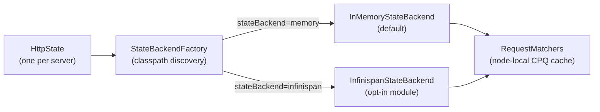

## The StateBackend SPI

Defined in `mockserver-core` at `org.mockserver.state.StateBackend`.

### Interfaces

| Interface | Purpose |
|-----------|---------|
| `StateBackend` | Top-level SPI: factory methods for the four store types, plus `nodeId()` and `close()` |
| `KeyValueStore<V>` | Versioned key-value store with optimistic-concurrency (`compareAndSet`) and `InvalidationListener` support |
| `Versioned<V>` | Value paired with a monotonic version number used by `compareAndSet` |
| `BlobStore` | Binary large-object store for persisted cassettes, fixtures, and snapshots |
| `InvalidationListener` | Callback (`onChanged(key)` / `onCleared()`) fired on remote writes in a clustered backend |
| `ExpectationEntry` | Serializable carrier for an `Expectation` and its sort fields (priority, created, id); the `Expectation` itself is marshalled as JSON inside custom `writeObject`/`readObject` because the domain model is not `Serializable` |

### Store Types

`StateBackend` exposes four stores via its interface:

| Store | Type | Description |
|-------|------|-------------|
| `expectations()` | `KeyValueStore<ExpectationEntry>` | Expectation definitions; keyed by expectation id |
| `scenarioStates()` | `KeyValueStore<String>` | Scenario state strings; keyed by composite `scenarioName+isolation` |
| `crudEntities(namespace)` | `KeyValueStore<ObjectNode>` | Per-namespace CRUD entity stores |
| `blobs()` | `BlobStore` | Persisted expectations, recorded cassettes, and fixture files |

### KeyValueStore Semantics

- `put(key, value)` — last-writer-wins; returns the new version number
- `compareAndSet(key, expectedVersion, value)` — atomic replace (optimistic concurrency)
- `compareAndRemove(key, expectedVersion)` — atomic delete
- `entries()` — streaming snapshot of all entries; iteration order is implementation-defined (unordered for generic stores; sorted by priority for the expectation store)
- `addInvalidationListener(listener)` — registers a callback for any mutation

## Default: InMemoryStateBackend

`InMemoryStateBackend` (in `mockserver-core`) is the default for all single-node deployments. It wraps:

- `InMemoryExpectationKeyValueStore` — backed by the same `CircularPriorityQueue` used before the SPI was introduced, so ordering and eviction behaviour are byte-for-byte identical
- `InMemoryKeyValueStore<String>` — backed by `ConcurrentHashMap` for scenario states
- Per-namespace `InMemoryKeyValueStore<ObjectNode>` for CRUD entities
- `InMemoryBlobStore` or `FilesystemBlobStore` depending on `blobStoreType` configuration

`InvalidationListener` callbacks are registered but are no-ops in the single-node path — they exist purely to satisfy the SPI so that `RequestMatchers` can attach reconcile callbacks without knowing which backend is active.

## InfinispanStateBackend

The `mockserver-state-infinispan` module provides an embedded Infinispan `StateBackend`. Infinispan runs in-process — there is no separate data grid to operate.

### Modes

`InfinispanStateBackend` supports two modes, selected at construction time from the `Configuration`:

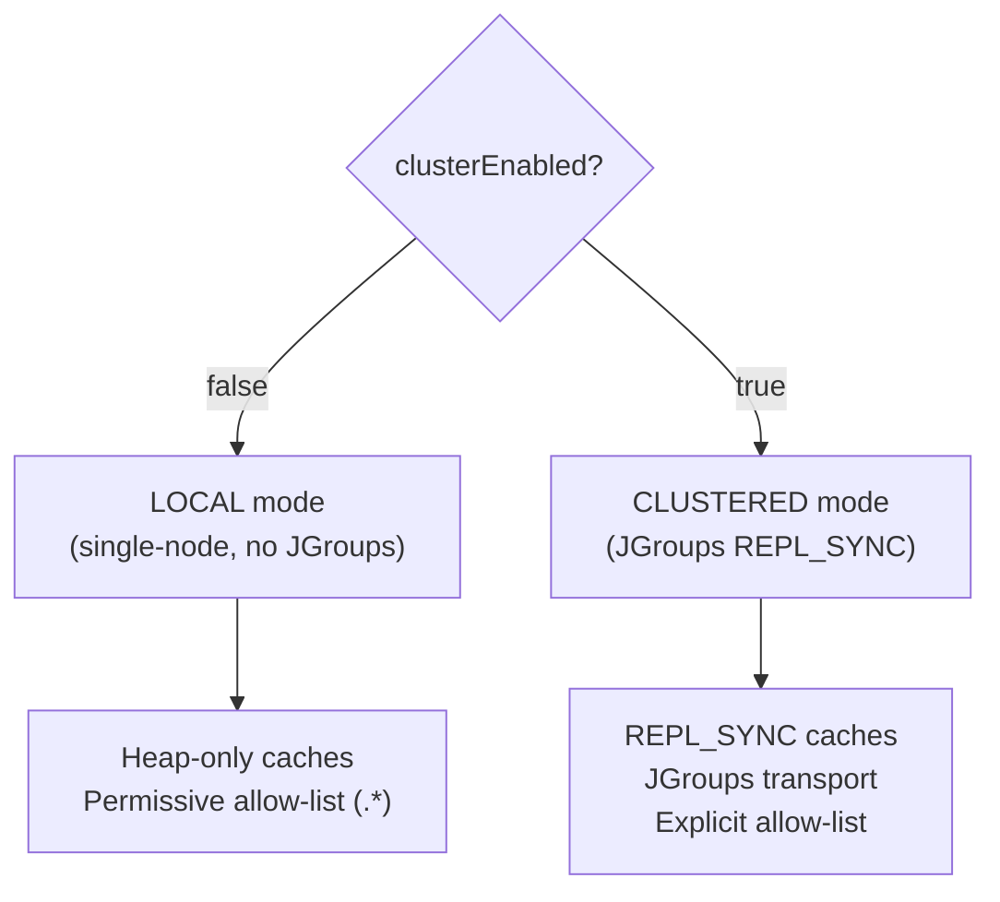

**LOCAL mode** (`clusterEnabled=false`) starts Infinispan with `nonClusteredDefault()` — no JGroups network transport, no serialization over the wire. The allow-list is `".*"` because nothing crosses a network boundary. This mode is functionally equivalent to the default in-memory backend but adds Infinispan on the classpath. It is useful for testing the Infinispan code path without needing multiple nodes.

**CLUSTERED mode** (`clusterEnabled=true`) starts Infinispan with a JGroups transport and `REPL_SYNC` caches, so every write is synchronously replicated to all cluster members before the write call returns.

### Wire Format

The clustered wire format uses Java serialization (`JavaSerializationMarshaller`) rather than ProtoStream. The `Expectation` domain model does not implement `Serializable`, so `ExpectationEntry` uses custom `writeObject`/`readObject` that serialize the expectation as its JSON string via `ExpectationDTO`. This keeps the wire format self-contained and avoids adding `Serializable` to the entire domain graph.

A strict explicit allow-list covers exactly the types that cross the wire:

| Allow-list pattern | Covers |
|--------------------|--------|
| `org\.mockserver\.state\.infinispan\..*` | `VersionedWrapper` (the cache value carrier) |
| `org\.mockserver\.state\..*` | `ExpectationEntry`, `Blob` |
| `org\.mockserver\.mock\..*` | `Expectation` (as JSON, inside `ExpectationEntry`) |
| `org\.mockserver\.model\..*` | `HttpRequest`, `HttpResponse`, etc. |
| `org\.mockserver\.matchers\..*` | `TimeToLive`, `Times` |
| `com\.fasterxml\.jackson\..*` | `ObjectNode` (for CRUD entities) |
| `java\.lang\..*`, `java\.util\..*`, `java\.time\..*` | JDK primitives, collections, time types |
| `\[B` | `byte[]` (for `Blob` data) |

This explicit allow-list resolves the deserialization gadget-chain risk — types from untrusted packages cannot be instantiated through the cluster wire.

### Cross-Node Invalidation

When a remote write arrives on a cluster node, Infinispan fires its internal cache event. An `InfinispanCacheListener` (`@Listener(clustered=true)`) translates this to `InvalidationListener.onChanged(key)` or `InvalidationListener.onCleared()`, which triggers `RequestMatchers.reconcileFromBackend()` on the receiving node.

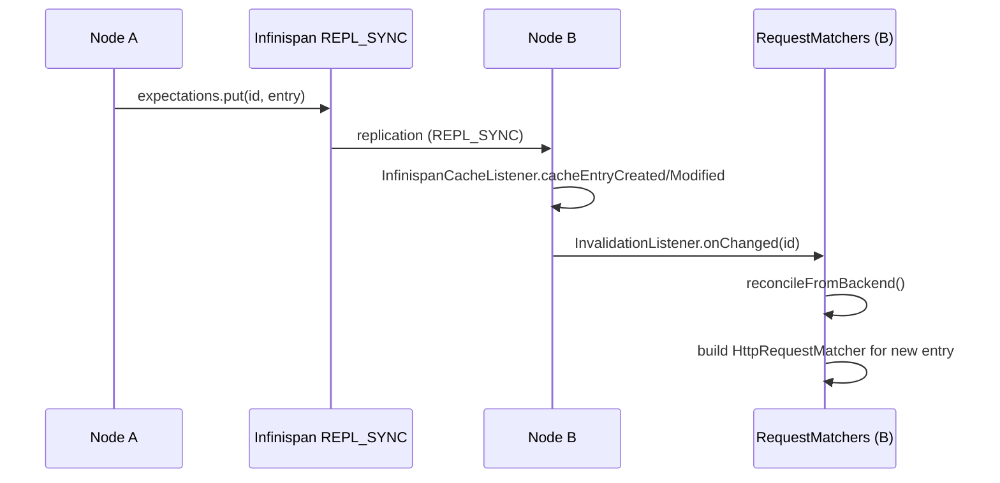

`reconcileFromBackend()` in `RequestMatchers` dispatches on `StateBackend.isClustered()` to one of two implementations:

- **non-clustered fast path — `trimEvictedFromBackend()`** (the in-memory default). All mutations originate locally and the node-local CPQ is already in sync, so the ONLY divergence to reconcile is backend self-eviction past `maxExpectations`: this path does an eviction-only trim and nothing else. It never walks the backend to add/update, keeping registration O(n).
- **clustered scan — `reconcileClusteredScan()`.** Entries can appear or change on other nodes, so this path performs the full three-step diff against the backend:
  1. **Evict** — remove node-local matchers whose id no longer appears in the backend
  2. **Add** — for new backend entries, build a local `HttpRequestMatcher` via `MatcherBuilder`
  3. **Update** — for existing entries whose backend version is strictly newer than the last reconciled version, update the local matcher (preserving runtime state such as `Times` counters) and re-insert its priority key if sort fields changed

The remote-add and remote-update legs of the clustered scan are pinned by `RequestMatchersStateBackendTest.clusteredReconcilePicksUpRemoteAdd` and `reconcileFromBackendPicksUpResponseBodyChange`; the eviction leg that both paths share is covered as described below.

#### Concurrency contract — no lock spans a backend call (issue #2579)

`reconcileFromBackend()` and the node-local mutators (`add`, `update`, `reset`, `removeHttpRequestMatcher`) share the `RequestMatchers` instance monitor to serialize writes to the non-thread-safe node-local structures (the `CircularPriorityQueue` and the `CircularHashMap` request-definition map). The **load-bearing rule is that the monitor is held only for the short, purely in-memory structure mutation — never across a backend call**. Concretely: `add`/`update` release the monitor *before* `expectationBackend.put(...)`, and `reconcileFromBackend()`'s trim/clustered-scan take their `expectationBackend.entries()`/`size()` snapshot *before* acquiring the monitor. This is why `reconcileFromBackend()` is deliberately **not** a `synchronized` method.

This rule exists because the first fix for issue #2579 (reverted commit `98ab5d8de`) violated it: it serialized the mutators on the monitor in a way that held it across `expectationBackend.put`. For the Infinispan backend `put` is a blocking distributed `Cache.compute` round-trip, and the receiving node's own invalidation listener needs the same monitor to make progress — so two nodes deadlocked and `ClusteredTwoNodeTest`/`ClusteredExpectationPersistenceReloadTest` hung to their 60s timeouts. The redesign keeps the mutation atomic with respect to the eviction reconcile **without** blocking on the network under any lock.

Because control-plane `add`s run concurrently (one per connection across the `nioEventLoopThreadCount` Netty worker threads) and insert into the node-local cache before their backend `put` lands, the eviction trim also protects **in-flight adds**: each `add`/`update` registers its id in the reference-counted `addsInFlight` registry before mutating the cache and deregisters it only after the backend write returns, and **both** reconcile paths (`trimEvictedFromBackend` and `reconcileClusteredScan`) exclude those ids from eviction, computing the eviction set from a `cachedIds → protectedIds → backendIds` snapshot taken in exactly that order — the cached ids first and the backend last, never the live cache read last. Without this, one thread's trim would delete another thread's not-yet-persisted matcher, silently dropping a `201`-acknowledged expectation.

**This "both paths" claim is test-enforced per path (issue #2579 follow-up), not just asserted here.** An earlier revision of this section claimed the ordering applied to both siblings while, in the shipped code, only `trimEvictedFromBackend` actually took the snapshot in that order — `reconcileClusteredScan` read the live cache last. The prose masked the divergence, which is how the same drop-a-live-expectation defect reached review twice on the clustered leg. Coverage now pins each leg independently:

| Claim | Enforced by |
|-------|-------------|
| `trimEvictedFromBackend` protects in-flight adds and takes the snapshot `cachedIds → protectedIds → backendIds` | `RequestMatchersConcurrentAddTest.concurrentAddDoesNotDropExpectationWhenTrimRacesAnInFlightPut`, the `concurrentAddsNeverLoseAnAcknowledgedExpectation` hammer, and the `twoConcurrentAddsWhosePutsInterleaveDoNotDeadlock` deadlock guard (all non-clustered) |
| `reconcileClusteredScan` uses the identical ordering — the leg that originally shipped the inverted order | `RequestMatchersConcurrentAddTest.clusteredReconcileDoesNotDropAConcurrentlyAddedExpectation` (parks a clustered reconcile holding a stale backend snapshot while a concurrent `add` lands, and asserts it is not evicted) |
| The behaviours both paths must agree on — add/update/remove backend sync and `maxExpectations` oldest-first eviction (an update NOT moving an entry to the tail) | `RequestMatchersReconcileParityTest`, which runs one set of behavioural assertions against BOTH a non-clustered and a clustered in-memory backend, so a future divergence between the siblings fails its `clustered=true` row. This parameterised parity check is the anti-drift guard that replaces the earlier unverified "applies to both" prose. |
| Full cross-node replication / eviction on a real two-node cluster | `ClusteredTwoNodeTest` and `ClusteredExpectationPersistenceReloadTest` (`mockserver-state-infinispan`) |

### Expectation Reload When a Node Starts

**A node that starts after the fleet already holds expectations restores them from the clustered blob cache, not from the expectations KV cache.** `RequestMatchers.setStateBackend()` does not reconcile, and the Infinispan clustered listener is registered only on the `expectations`, `scenarioStates` and `crud-*` caches for *remote writes* — JGroups state transfer into a joining node fires no such event. So the joining node's node-local matcher cache starts empty even though its replica of the expectations cache is fully populated.

What actually repopulates it is `ExpectationFileSystemPersistence`, when `persistExpectations=true`. Its constructor (invoked from `HttpState`, before any port is bound) calls `reloadPersistedExpectations()`, which reads the persisted expectation document back from `stateBackend.blobs()` and replays it through `RequestMatchers.update(...)`. That read path runs for **every non-`FilesystemBlobStore` blob store**, and `InfinispanStateBackend.blobs()` always returns an `InfinispanBlobStore`, so the clustered case is covered by the same code as S3/GCS/Azure.

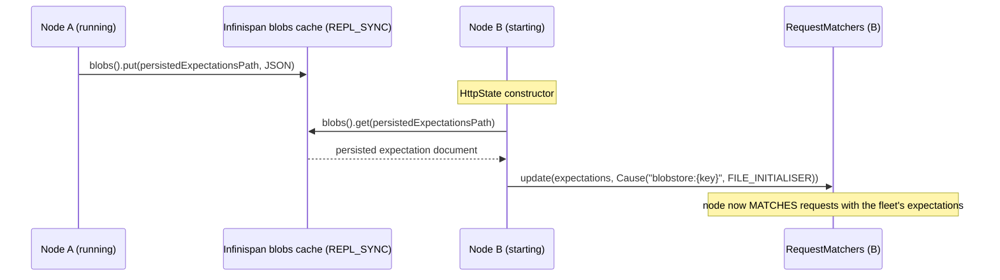

Operational consequences:

| Requirement | Why |
|-------------|-----|
| `persistExpectations=true` on every node | the reload lives in `ExpectationFileSystemPersistence`, which `HttpState` only creates when persistence is enabled |
| Identical absolutely-resolved `persistedExpectationsPath` on every node | the blob key IS that absolute path; a different path silently reads a different (absent) key |
| `blobStoreRestoreTimeoutSeconds > 0` | `0` skips the restore entirely (documented escape hatch); on expiry the node logs a WARN and starts with nothing restored |
| At least one surviving member | the caches are in-process; if the whole fleet stops, the blob goes with it (use a cloud `BlobStore` for durability across a full outage) |

Coverage: `ClusteredExpectationPersistenceReloadTest` (`mockserver-state-infinispan`) forms an in-JVM cluster of a bare "fleet keeper" backend plus a full MockServer node, creates an expectation over the wire, stops that node completely, starts a fresh one against the same cluster and asserts it serves the expectation. Its sibling test sets `blobStoreRestoreTimeoutSeconds=0` and asserts the fresh node does **not** serve it, pinning the fact that no other route (state transfer, stray invalidation, the local file) restores expectations on start.

### Eviction

The expectations cache uses Infinispan's approximate `maxCount` eviction with `EvictionStrategy.REMOVE`, capped at `maxExpectations` (default 1000). When the cache is full, Infinispan evicts the least-recently-used entry. The evicted entry is removed from all cluster nodes (eviction is coordinated by Infinispan), and the `InvalidationListener` fires on each node to reconcile the local matcher cache.

Because eviction is approximate, the node-local `CircularPriorityQueue` (used for iteration order during matching) may briefly contain one more entry than `maxExpectations` between an eviction and the next reconcile cycle.

### Clustered Scenario State Transitions

`ScenarioManager` reads and writes scenario state through the backend's `scenarioStates()` `KeyValueStore<String>`. State transitions (`matchesAndTransition`) use `compareAndSet` for cross-node atomicity: two nodes racing to advance the same scenario from "Started" to "Step1" will produce exactly one winner. The losing node's CAS fails and the transition is retried (if the state still matches) or rejected (if the state has changed).

For the default `InMemoryStateBackend`, this is backed by a `ConcurrentHashMap` with version tracking -- identical single-node behaviour and performance to the pre-clustering implementation. For the clustered `InfinispanStateBackend`, the `scenarioStates` cache is `REPL_SYNC`, so writes are synchronously replicated and reads on any node reflect the latest state.

`ScenarioManager` uses no node-local cache for scenario state; all reads go through `KeyValueStore.get()` and all writes through `put()` or `compareAndSet()`. This read-through design means no `InvalidationListener` is needed for scenario state (unlike expectations, which maintain a node-local compiled-matcher cache).

### CAS Implementation: cache.replace vs cache.compute

**Invariant: `InfinispanKeyValueStore.compareAndSet` MUST use `cache.replace(key, oldValue, newValue)` — NOT `cache.compute()` with a side-channel flag.**

Under `REPL_SYNC`, Infinispan may re-execute a `compute` lambda on conflict/retry. If the lambda records its result into a side-channel (e.g. an `AtomicBoolean`), the retry invocation overwrites the side-channel with the retry's outcome, so the caller observes the retry result rather than the first execution — a false failure even when the first CAS succeeded.

`cache.replace(K, V oldValue, V newValue)` (`InfinispanKeyValueStore.compareAndSet`, `mockserver-state-infinispan`) is a genuine atomic CAS: Infinispan compares the stored value using `equals()` and atomically swaps to `newValue` only if the stored value matches `oldValue`. The boolean return value is the authoritative success indicator.

**Version-carrying wrapper.** Every stored value is wrapped in a `VersionedWrapper<V>` (`mockserver-state-infinispan`) pairing the payload with an explicit `long version`. `VersionedWrapper.equals()` checks both fields — version and value — so a stale-version `replace()` fails even if the payload bytes are identical but the version has advanced. `hashCode()` is consistent with `equals()`. Note that `VersionedWrapper.equals()` **delegates the value comparison to the payload type's own `equals()`** (`Objects.equals(value, that.value)`), so the stored value type must implement structural equality — MockServer stores `String` scenario-state values, which do. This matters in `REPL_SYNC`: a replica receives another node's update as a **deserialized** copy (a different instance), so a `replace(current, updated)` CAS would spuriously fail if the value type fell back to reference equality. (This is also why `put()` uses `compute()` rather than `replace()` — see the `InfinispanKeyValueStore.put()` Javadoc.)

The `compareAndSet` flow in `InfinispanKeyValueStore`:

1. `cache.get(key)` — reads the current `VersionedWrapper<V>` from the node-local replica (no network round-trip)
2. Version mismatch → return `false` immediately
3. Build `updated = new VersionedWrapper<>(value, expectedVersion + 1)`
4. `cache.replace(key, current, updated)` — atomic write; synchronously replicated across the cluster
5. Return the `boolean` result directly

`put()` intentionally uses `cache.compute()` because an unconditional version-incrementing put is idempotent given a deterministic new value — re-execution on retry is safe there.

**Composite keys use a length-prefixed encoding.** Scenario/cross-protocol keys are flattened to a single `String` before they reach the backend store, so a naive `name:state:pattern` join would let a delimiter inside one component collide with a component boundary (e.g. `a:b` + `c` vs `a` + `b:c`). `ScenarioManager.ScenarioKey#toString()` and `CrossProtocolEventBus.backendKey()` avoid this by prefixing each component with its length — `<trigger>|<len>:<name>:<len>:<state>:<len>:<pattern>` — making the encoding lossless and collision-free. `InfinispanKeyValueStore` then stores these as opaque `String` keys (`KeyValueStore<V>` parameterises the value type, not the key). Regression coverage: `CrossProtocolEventBusTest.backendKeyShouldNotCollideWhen…` and `ScenarioManagerCompositeKeyTest`.

## Cluster Status Endpoint

`GET /mockserver/cluster` (control-plane, gated by `controlPlaneRequestAuthenticated`) returns a JSON snapshot of cluster membership and health, backed by the `StateBackend.clusterInfo()` SPI method.

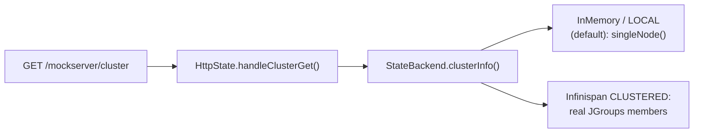

- **SPI method** — `StateBackend.clusterInfo()` returns a `ClusterInfo` record (`clustered`, `nodeId`, `coordinator`, `clusterName`, `members[]`; each `Member` has `id`, `coordinator`, `local`). The interface provides a **default** that returns the degenerate single-node snapshot (`ClusterInfo.singleNode(nodeId())`), so `InMemoryStateBackend` and any other backend compile unchanged.
- **Single-node / in-memory / LOCAL mode** — `clustered=false`, exactly one member (this node), which is its own coordinator. `InfinispanStateBackend` in LOCAL mode (no transport) also falls back to this snapshot.
- **Infinispan CLUSTERED mode** — `InfinispanStateBackend.clusterInfo()` reads `EmbeddedCacheManager.getMembers()`, `getAddress()`, `getCoordinator()`, and `getClusterName()` to report the real fleet, flagging the coordinator and the local node. It is fail-soft: any error degrades to the single-node snapshot rather than failing the endpoint.
- **Metric** — when metrics are enabled, the `mock_server_cluster_members` Prometheus gauge (a `GaugeWithCallback`) reports the live member count at scrape time via a supplier `HttpState` registers (`Metrics.setClusterMemberCountSupplier`), reading `stateBackend.clusterInfo().members().size()`. Defaults to `1` (single local node) when no supplier is set or the supplier fails.

## Factory and Classpath Discovery

`StateBackendFactory` in `mockserver-core` manages backend creation without a compile-time dependency on Infinispan:

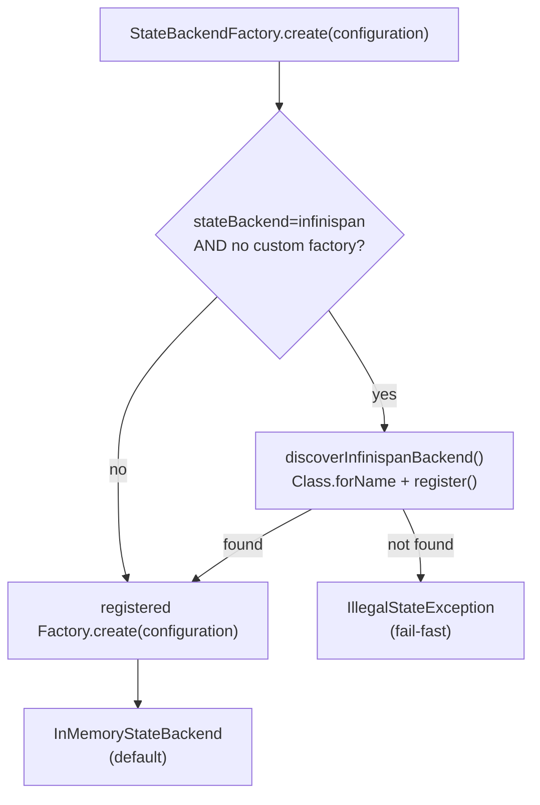

If `stateBackend=infinispan` is configured but `mockserver-state-infinispan` is not on the classpath, `StateBackendFactory` throws `IllegalStateException` immediately at startup rather than silently falling through to the in-memory backend. Falling through would create a split-brain cluster where the operator believes nodes share state but each node is actually isolated.

## Cloud Blob Store Backends

Three optional modules provide cloud-backed `BlobStore` implementations for durable blob storage across cloud providers:

| Module | Blob store type | Cloud SDK | Emulator (Testcontainers) |
|--------|----------------|-----------|---------------------------|
| `mockserver-blob-s3` | `s3` | AWS SDK v2 `S3Client` | adobe/s3mock |
| `mockserver-blob-gcs` | `gcs` | `google-cloud-storage` | fake-gcs-server (`fsouza/fake-gcs-server`) |
| `mockserver-blob-azure` | `azure` | `azure-storage-blob` | Azurite (`mcr.microsoft.com/azure-storage/azurite`) |

### Architecture

Each cloud module follows the same isolation pattern as `mockserver-state-infinispan`:

1. **Zero core dependency** -- `mockserver-core` has no compile-time or runtime dependency on any cloud SDK. The `BlobStore` and `BlobStoreFactory` interfaces are defined in core; cloud modules implement them.
2. **Self-registration via reflection** -- each module provides a `Registrar` class (e.g. `S3BlobStoreRegistrar`) that calls `StateBackendFactory.registerBlobStoreFactory(type, factory)`. When `blobStoreType` is configured to a cloud type, `StateBackendFactory.createBlobStore()` auto-discovers the registrar via `Class.forName()`.
3. **Fail-fast** -- if `blobStoreType=s3` is configured but the S3 module is not on the classpath, `StateBackendFactory` throws `IllegalStateException` with a helpful message rather than silently falling through.

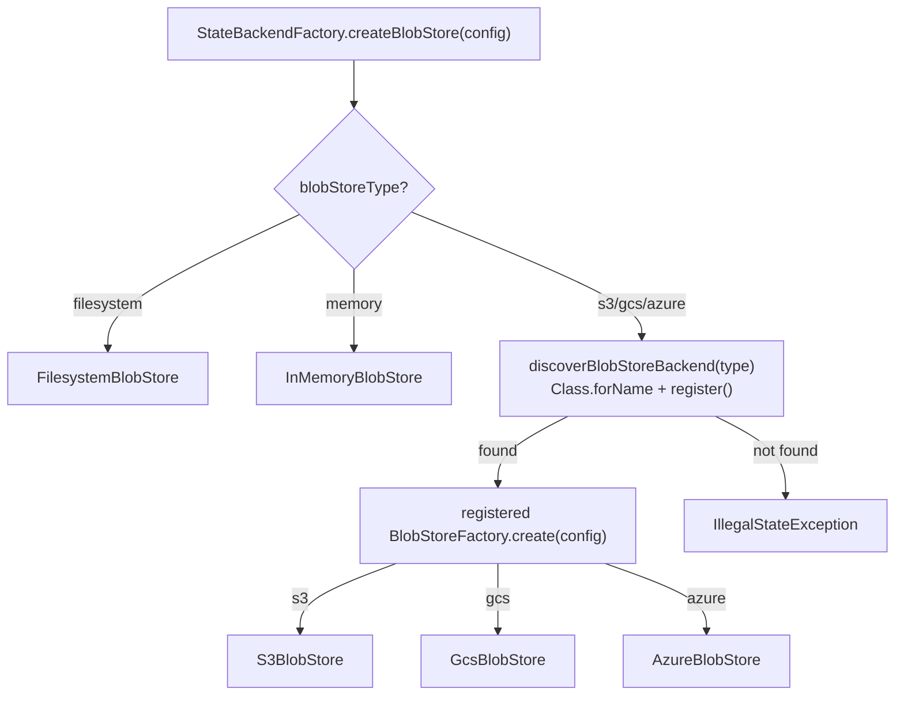

### Shared BlobStore Contract Test

A shared abstract contract test (`BlobStoreContract`) in `mockserver-core`'s test tree exercises the full `BlobStore` SPI (put/get/overwrite/list-by-prefix/delete/missing-key/metadata round-trip/binary data/nested keys) against any implementation. Each cloud module runs this same contract against its emulator via Testcontainers, ensuring behavioral parity across all five blob store implementations (memory, filesystem, S3, GCS, Azure).

### Enabling a Cloud Blob Store

Add the module to the classpath and configure the blob store type plus backend-specific properties:

**S3:**
```
-Dmockserver.blobStoreType=s3
-Dmockserver.blobStoreBucket=my-bucket
-Dmockserver.blobStoreRegion=us-east-1
```

**GCS:**
```
-Dmockserver.blobStoreType=gcs
-Dmockserver.blobStoreBucket=my-bucket
```

**Azure:**
```
-Dmockserver.blobStoreType=azure
-Dmockserver.blobStoreContainer=my-container
-Dmockserver.blobStoreConnectionString=DefaultEndpointsProtocol=https;AccountName=...;AccountKey=...
```

## Configuration Reference

| Property | Env var | Default | Description |
|----------|---------|---------|-------------|
| `mockserver.stateBackend` | `MOCKSERVER_STATE_BACKEND` | `memory` | Backend type: `memory` or `infinispan` |
| `mockserver.blobStoreType` | `MOCKSERVER_BLOB_STORE_TYPE` | `filesystem` | Blob store type: `filesystem` (default), `memory`, `s3`, `gcs`, or `azure` |
| `mockserver.blobStoreBucket` | `MOCKSERVER_BLOB_STORE_BUCKET` | _(empty)_ | S3/GCS bucket name (required for `s3` and `gcs` backends) |
| `mockserver.blobStoreRegion` | `MOCKSERVER_BLOB_STORE_REGION` | _(empty)_ | AWS region for S3 (default: us-east-1 when empty) |
| `mockserver.blobStoreEndpoint` | `MOCKSERVER_BLOB_STORE_ENDPOINT` | _(empty)_ | Endpoint override for S3-compatible (MinIO) or fake-gcs-server |
| `mockserver.blobStoreKeyPrefix` | `MOCKSERVER_BLOB_STORE_KEY_PREFIX` | _(empty)_ | Key/object-name prefix for all cloud blob store objects |
| `mockserver.blobStoreAccessKeyId` | `MOCKSERVER_BLOB_STORE_ACCESS_KEY_ID` | _(empty)_ | Explicit AWS access key (optional; falls back to default chain) |
| `mockserver.blobStoreSecretAccessKey` | `MOCKSERVER_BLOB_STORE_SECRET_ACCESS_KEY` | _(empty)_ | Explicit AWS secret key (optional; falls back to default chain) |
| `mockserver.blobStoreContainer` | `MOCKSERVER_BLOB_STORE_CONTAINER` | _(empty)_ | Azure Blob Storage container name (required for `azure` backend) |
| `mockserver.blobStoreConnectionString` | `MOCKSERVER_BLOB_STORE_CONNECTION_STRING` | _(empty)_ | Azure connection string (required for `azure` backend) |
| `mockserver.blobStoreProjectId` | `MOCKSERVER_BLOB_STORE_PROJECT_ID` | _(empty)_ | GCS project ID (optional; falls back to application default credentials) |
| `mockserver.clusterEnabled` | `MOCKSERVER_CLUSTER_ENABLED` | `false` | Enable JGroups cluster transport (Infinispan CLUSTERED mode) |
| `mockserver.clusterName` | `MOCKSERVER_CLUSTER_NAME` | `mockserver-cluster` | JGroups cluster identifier; all nodes that should share state must use the same value |
| `mockserver.clusterTransportConfig` | `MOCKSERVER_CLUSTER_TRANSPORT_CONFIG` | _(built-in loopback stack)_ | Path to a custom JGroups XML transport configuration; leave empty to use the built-in loopback stack (suitable for embedded tests; use a UDP or TCP stack for production) |
| `mockserver.clusterSharedTimesEnabled` | `MOCKSERVER_CLUSTER_SHARED_TIMES_ENABLED` | `true` | Enforce per-expectation `Times` limits cluster-wide via shared backend CAS (exactly-N across the fleet). Set `false` to fall back to node-local `Times` (no synchronous replicated write on the request worker thread; fleet-wide N becomes approximate). Only relevant when `clusterEnabled=true`. See "Clustered Times Counters". |
| `mockserver.clusterVerifyFanIn` | `MOCKSERVER_CLUSTER_VERIFY_FAN_IN` | `false` | Aggregate `verify`/`retrieve` (REQUESTS/REQUEST_RESPONSES) across cluster members so a verify/retrieve behind a load balancer reflects fleet-wide traffic rather than only the node it hit. Only meaningful in a clustered deployment. See "Clustered Verify/Retrieve Fan-In". |
| `mockserver.clusterVerifyFanInPeers` | `MOCKSERVER_CLUSTER_VERIFY_FAN_IN_PEERS` | _(empty)_ | Comma-separated list of the OTHER nodes' control-plane base URLs (e.g. `http://node-b:1080,http://node-c:1080`) queried during fan-in. Required for fan-in to do anything. |
| `mockserver.clusterFanInPeerAuthToken` | `MOCKSERVER_CLUSTER_FAN_IN_PEER_AUTH_TOKEN` | _(empty)_ | Credential the fan-in peer accessor presents on cross-node queries, sent verbatim as the control-plane `Authorization` header (include the scheme, e.g. `Bearer <jwt>`). Set on every node so an authenticated cluster (control-plane bearer/JWT/OIDC) accepts fan-in queries instead of returning 401/403. Empty (default) = no credential sent (unchanged). All nodes must share the token. See "Clustered Verify/Retrieve Fan-In". **Write-only over the control plane**: `ConfigurationDTO.getClusterFanInPeerAuthToken()` is `@JsonIgnore`-d (its setter `@JsonProperty`-annotated), so `PUT /mockserver/configuration` sets it but `GET /mockserver/configuration` omits it — it grants MUTATE on every peer, so disclosing it to a read-only control-plane principal would be a privilege escalation. Enforced by `ConfigurationDTOCredentialMaskingTest`. |

## Enabling Infinispan

Add the module to the classpath and set the configuration property:

```
-Dmockserver.stateBackend=infinispan
```

For a cluster of two or more nodes, also set:

```
-Dmockserver.clusterEnabled=true
-Dmockserver.clusterName=my-cluster
-Dmockserver.clusterTransportConfig=/path/to/jgroups-udp.xml
```

All nodes must be on the same JGroups network (multicast or unicast depending on the JGroups stack) and use the same `clusterName`.

## Distributed Chaos (G11)

When the state backend is clustered, all three chaos registries (Service/HTTP, TCP, gRPC) replicate their profiles across the fleet. A chaos profile registered via the REST API on node A is automatically visible on node B's hot-path registry without additional configuration.

### How it works

Each chaos registry stores its active profiles in the `StateBackend`'s `crudEntities(namespace)` KV store, using three dedicated namespaces:

| Registry | Backend namespace | Key |
|----------|-------------------|-----|
| `ServiceChaosRegistry` (HTTP) | `chaos-service` | Normalised host (lower-cased, port-stripped) |
| `TcpChaosRegistry` | `chaos-tcp` | Normalised host |
| `GrpcChaosRegistry` | `chaos-grpc` | Normalised service name |

Each value is an `ObjectNode` containing the chaos profile serialized via its DTO (e.g. `HttpChaosProfileDTO`) and the `expiresAtMillis` TTL metadata.

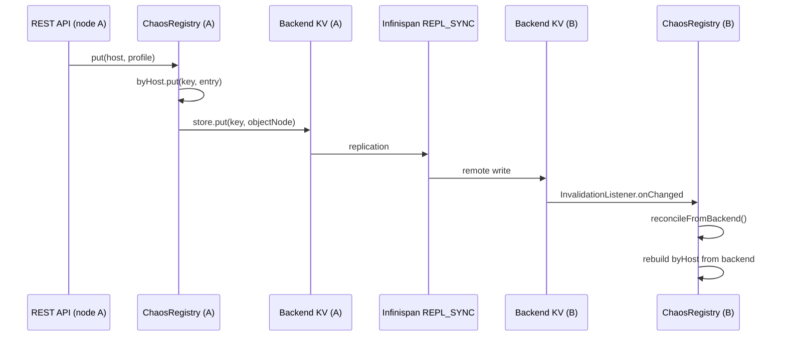

### Node-local fast path

The `get()` method on all registries reads ONLY from the node-local `ConcurrentHashMap` -- there is no backend round-trip on the chaos lookup path during request handling. The backend is consulted only on write-through (mutations) and reconciliation (invalidation callbacks).

### Default / single-node behaviour

When the state backend is not clustered (default `InMemoryStateBackend` or `InfinispanStateBackend` in LOCAL mode), the `setStateBackend()` call on each registry is a no-op. The registries behave exactly as they did before G11 -- purely node-local, no backend interaction, zero overhead on the chaos hot path.

### Wiring in HttpState

`HttpState` wires the chaos backend in its constructor:

1. Calls `setStateBackend(stateBackend)` on each singleton registry (ServiceChaos, TcpChaos, GrpcChaos). This is a no-op when the backend is not clustered.
2. When the backend is clustered, registers a SEPARATE `InvalidationListener` (distinct from the expectations reconcile listener) that calls `reconcileFromBackend()` on all three chaos registries when any remote write is detected.

## Distributed CrossProtocolEventBus (G11 Follow-Up)

When the state backend is clustered, the `CrossProtocolEventBus` replicates its trigger-to-scenario registrations across the fleet. A cross-protocol scenario registered on node A (e.g. "when a DNS query for api.example.com is seen, advance scenario DnsScenario to DnsObserved") becomes effective on all nodes -- any node that observes the matching protocol event will fire the scenario state transition.

### How it works

The event bus stores its active registrations in the `StateBackend`'s `crudEntities("cross-protocol-bus")` KV store. Each registration is keyed by a composite of trigger type, scenario name, target state, and match pattern.

| Field | Backend key component |
|-------|----------------------|
| Trigger | `CrossProtocolTrigger` enum name (e.g. `DNS_QUERY`) |
| Scenario name | The scenario being driven |
| Target state | The state to transition to on match |
| Match pattern | Optional pattern for trigger filtering |

Each value is an `ObjectNode` containing the trigger, scenario name, target state, and match pattern as simple string fields.

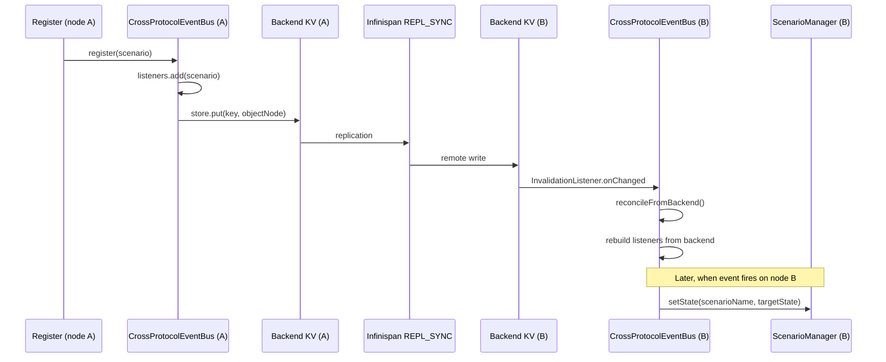

### Node-local fire path

The `fire()` method reads ONLY from the node-local `ConcurrentHashMap` -- there is no backend round-trip on the event-dispatch path during request handling. The backend is consulted only on write-through (register/unregister/reset) and reconciliation (invalidation callbacks).

### Default / single-node behaviour

When the state backend is not clustered (default `InMemoryStateBackend` or `InfinispanStateBackend` in LOCAL mode), the `setStateBackend()` call is a no-op. The bus behaves exactly as it did before -- purely node-local, no backend interaction, zero overhead on the fire path.

### Wiring in HttpState

`HttpState` wires the cross-protocol bus backend in its constructor, following the same pattern as the chaos registries:

1. Calls `CrossProtocolEventBus.getInstance().setStateBackend(stateBackend)`. This is a no-op when the backend is not clustered.
2. When the backend is clustered, registers a SEPARATE `InvalidationListener` (distinct from the expectations and chaos reconcile listeners) that calls `reconcileFromBackend()` on the event bus when any remote write is detected.

## Clustered Times Counters

Per-expectation `Times` match limits (e.g. `Times.exactly(3)`, `Times.once()`) are enforced **cluster-wide** when a clustered backend is active. On a match, the consuming node atomically decrements a shared remaining-count (CAS) *before* serving; if the allotment is already exhausted (another node took the last one) it falls through without serving. So a `Times.exactly(3)` expectation serves exactly 3 times total across the whole fleet — not 3 per node. Unlimited `Times` and the default (non-clustered) path take the node-local fast path with no backend round-trip. See `RequestMatchers.consumeTimesViaBackendCas`.

The shared count lives in a **dedicated counter store** (`StateBackend.sharedTimesCounters()`, keyed by expectation id, value = remaining count), kept **separate from the expectation store on purpose**. A `Times` consume is on the hot request path, and the expectation store's value (`ExpectationEntry`) marshals the *entire* expectation as JSON on every write — so CASing the remaining count there replicated the whole expectation on every single match. Decrementing a dedicated `Integer` instead means a clustered consume ships only the counter across the wire.

**Seeding model.** The counter is **eagerly seeded to N when the expectation is stored** (`add`/`update`, on the control path, *before* the expectation is published so a peer reconciling on its replication already sees the counter). An update-in-place resets the count with a last-writer-wins `put`; switching an expectation to unlimited removes its counter. Seeding eagerly is deliberate: it makes an **absent counter at consume time mean exactly one thing — discarded**, never "not yet seeded".

**Consume and the fail-closed rule.** Each consume `get`s the counter (a node-local replica read, no network) and CAS-decrements it (the only replicated write); the counter only ever decreases from N and a successful CAS is one served match, so the fleet-wide total can never exceed N. An **absent counter is treated as exhausted** and the node does not serve. This **fails closed**: a lost counter can only *under*-serve, never over-serve. Re-seeding an absent counter from the expectation would fail *open* — because Infinispan **memory eviction is node-local and not replicated**, a node that evicts its own replica of a live counter would otherwise resurrect the full N over the decremented value on its peers and serve more than N.

**Counter cache eviction and the under-serve failure mode.** The counter cache is `REPL_SYNC` and **bounded like the expectation cache** (`maxCount = maxExpectations`, `whenFull = REMOVE`); the reconcile-eviction paths drop a counter whenever the backend evicts its expectation, so orphan counters cannot fill the cache. Because eviction can now only *under*-serve, a bounded cache is safe. If the counter cache is nonetheless pushed to its bound and a **live** counter is evicted, that expectation simply stops matching on the affected node(s); a one-shot `WARN` (per expectation id) names `maxExpectations` as the lever. This is the same failure *direction* as node failure and as the legacy path, but it is **not** byte-for-byte equivalent to either — it is an additional, documented, fail-closed degradation under memory pressure.

**Node failure** is unaffected: the counter is decremented only on an actual serve and is fully replicated, so a dead node forfeits no count (nothing is held node-locally) and exactly-N still holds.

A backend that does not implement `sharedTimesCounters()` (returns `null`) transparently falls back to CASing the count on the `ExpectationEntry` itself (the `InMemoryStateBackend` override exists but is only reached by clustered-backend test doubles; the shipped single-node path never calls it).

### Event-loop blocking trade-off and the opt-out

The shared-Times CAS (`consumeTimesViaBackendCas`) runs **synchronously on the Netty request-worker (event-loop) thread**, inside `firstMatchingExpectation`. The backend `get()` reads from the node-local `REPL_SYNC` replica (no network), but each `compareAndSet` is a **synchronous replicated write** — a network round-trip that waits for replication acks from all cluster members. Under cross-node contention on the *same* limited-Times expectation, the CAS loop retries (re-read + re-write) up to a bound, with a **bounded randomised backoff between retries** (`backoffBeforeCasRetry`) so that same-key losers de-synchronise instead of re-colliding:

| | Bound |
|---|---|
| Worst-case replicated writes on the worker thread, per match | `MAX_CAS_RETRIES` = **20** |
| Randomised backoff parks between retries | up to `MAX_CAS_RETRIES - 1`, each ≤ `CAS_BACKOFF_CAP_NANOS` = **1ms** (exponential base 150us, full jitter) |
| Common (uncontended) case | **1** replicated write, **0** backoff |
| `get()` round-trips | **0** (local replica read) |

This is gated narrowly — only when the backend is clustered **and** the expectation has limited `Times`. Unlimited-`Times` and all non-clustered/single-node paths never enter it (byte-for-byte the pre-clustering fast path).

**Contention is real, and backoff is why it still serves.** Do not assume limited-`Times` expectations are low-count or lightly hit: measured on the loopback REPL_SYNC harness (`ClusteredTimesCasLatencyProofTest`, 8 threads on ONE hot key with a `Times.exactly(N)` budget nowhere near exhausted), an *immediate*-retry loop refused ~36% of matches purely from CAS contention at ~7.4 attempts per served match — losers re-read and re-CAS in lock-step and only one made progress per generation. Adding the randomised backoff between retries (and raising `MAX_CAS_RETRIES` to 20, which only helps once retries are productive) de-synchronises the losers so a contended match wins on a later attempt instead of dropping; the drop rate falls sharply while the exactly-N guarantee is untouched (the loop still fails closed on true exhaustion). A latency-sensitive clustered deployment that cannot tolerate replicated writes on the request path can still disable shared-Times enforcement:

```
-Dmockserver.clusterSharedTimesEnabled=false
```

(or `Configuration.clusterSharedTimesEnabled(false)`, env `MOCKSERVER_CLUSTER_SHARED_TIMES_ENABLED=false`). With shared-Times **disabled**, limited-`Times` matching reverts to the **node-local** fast path: each node enforces `Times` independently with no backend round-trip on the worker. The trade-off is that fleet-wide exactly-N becomes **approximate** — a `Times.exactly(3)` expectation may serve up to 3 times *per node* (like the chaos/quota counters below). The property defaults to `true`, preserving the exactly-N guarantee for everyone who does not opt out.

## Clustered Verify/Retrieve Fan-In

**The event log is per-node.** The `StateBackend` replicates expectations, scenario
state, CRUD entities, and blobs across the fleet, but NOT request/response log entries —
each node records only the traffic that reached it. Behind a load balancer, a `verify()`
or `retrieve(REQUESTS/REQUEST_RESPONSES)` therefore sees only one node's slice of the
traffic. This is a silent correctness trap for the HA feature: `verify(exactly(3))` can
pass on every node while the fleet actually served 9 requests.

The **opt-in cluster fan-in** (`clusterVerifyFanIn=true`) closes this gap by aggregating
across cluster members. It is **off by default** — the single-node/per-node behaviour is
unchanged and non-breaking.

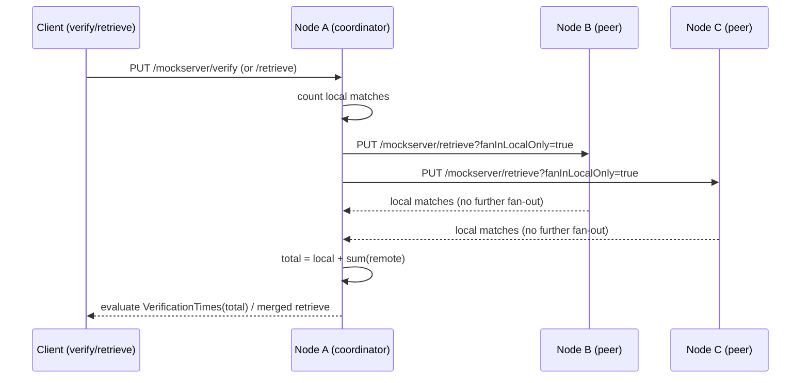

| Aspect | Behaviour |
|--------|-----------|
| **Enable** | `clusterVerifyFanIn=true` **and** a non-empty `clusterVerifyFanInPeers` list (the OTHER nodes' control-plane base URLs). Enabled with no peers = safe no-op. |
| **Peer query** | Each peer is queried via `PUT /mockserver/retrieve?type=…&format=JSON&fanInLocalOnly=true` using the JDK `HttpClient` (`HttpClusterPeerAccessor`). |
| **Non-recursion** | The `fanInLocalOnly=true` marker makes the peer serve ONLY its local log — it never fans out again, so there is no recursion. |
| **Retrieve merge** | `REQUESTS`/`REQUEST_RESPONSES` results are concatenated (local first, then each peer). Applies to all serialization formats since the merge is at the list level. |
| **Verify merge** | Count-based request verification (`exactly`/`atLeast`/`atMost`/`between`) sums each peer's LOCAL match count with the local count, then evaluates `VerificationTimes` against the fleet-wide total (`MockServerEventLog.verify(verification, additionalRemoteMatchCount, …)`). |
| **Unreachable peer** | **Fail-closed** (the safer default): a verify returns a failure naming the unreachable peer(s); a retrieve returns HTTP 502. A partial aggregate is never returned, because silently missing a peer's traffic could turn a real `atMost`/`exactly` violation into a false pass. |
| **Authenticated clusters** | When `clusterFanInPeerAuthToken` is set, each peer query carries it **verbatim** as the control-plane `Authorization` header (e.g. `Bearer <jwt>`), so a cluster with control-plane authentication (bearer / JWT / OIDC) accepts the fan-in query instead of rejecting it with 401/403. All nodes must share the same token / trust. With no token (the default) no credential is sent — unchanged behaviour. Applied in `HttpClusterPeerAccessor` (`configuration.clusterFanInPeerAuthToken()`). |

**Authenticated cross-node fan-in.** On a cluster with control-plane auth enabled, an
unauthenticated peer query would be rejected (401/403) and — because fan-in is fail-closed
— every verify/retrieve would fail. Setting `clusterFanInPeerAuthToken` on every node lets
the peer accessor present a shared control-plane credential so fan-in works on an authed
cluster. The token is sent verbatim, so include the scheme (`Bearer <jwt>`). Because it is
sent on **every** peer query, treat it as a shared cluster secret and prefer TLS between
nodes. **mTLS client-certificate presentation** for peer queries is *not* wired: the JDK
`HttpClient` uses the JVM default trust store for standard TLS to `https://` peers, but a
cluster that requires control-plane **client certificates** (`controlPlaneTLSMutualAuthenticationRequired`)
on peer queries remains a documented boundary — use a bearer/JWT credential instead.

**Deferred boundaries (documented, not implemented):**

- **`verifySequence` ordering** — verifying an ordered sequence of requests across nodes
  requires a global order over per-node logs (**no shared clock across nodes**), so merging
  per-node orderings would be unsound; `verifySequence` stays node-local rather than being
  done wrong.
- **Response-aware verify** (`verify` with an `httpResponse` matcher) and
  **expectationId-based verify** — stay node-local.
- **Live dashboard / log-view fan-in** — the dashboard's traffic views are a **live
  WebSocket push stream** driven directly by each node's local `MockServerEventLog`
  (`DashboardWebSocketHandler` → `retrieveLogEntriesInReverseForUI`), so they show only the
  local node's traffic. Merging a fleet-wide **live** stream hits the same no-shared-clock
  ordering problem as `verifySequence`, so it stays node-local. The **programmatic**
  `retrieve(REQUESTS/REQUEST_RESPONSES)` path that backs dashboard export / one-shot traffic
  queries **does** fan in when enabled (it goes through `HttpState.retrieve`).
- **Rate-limit / chaos-quota counter** clustering — remain node-local (separate follow-ups).

Source: `org.mockserver.cluster.ClusterFanIn`, `org.mockserver.cluster.HttpClusterPeerAccessor`,
`org.mockserver.cluster.ClusterFanInException` (all in `mockserver-core`).

## Limitations and Known Follow-Ups

| Limitation | Detail |
|------------|--------|
| CRUD entity namespace isolation | Each namespace is a separate Infinispan cache defined on demand. The number of distinct CRUD namespaces in use should be small (hundreds, not millions). |
| Cloud blob backends require their module on the classpath | `BlobStore` has built-in `InMemoryBlobStore` and `FilesystemBlobStore` implementations. The S3, GCS, and Azure Blob backends are fully implemented (see "Cloud Blob Store Backends" above) but live in optional modules (`mockserver-blob-s3` / `-gcs` / `-azure`); each must be on the classpath when its `blobStoreType` is selected, otherwise `StateBackendFactory` fails fast. |
| JGroups stack configuration | The built-in loopback stack is suitable for embedded tests only. Production clusters require a UDP or TCP JGroups stack configured via `clusterTransportConfig`. |
| Chaos TTL clock skew | TTL-based auto-expiry uses the node-local controllable clock (`TimeService`). In a clustered deployment, clock advances (via `PUT /mockserver/clock`) are node-local, so a TTL-bearing profile may expire at different wall-clock times on different nodes if their clocks are advanced independently. For production use, rely on the REST API `remove` endpoint rather than TTL for deterministic cross-node cleanup. |
| Expectation byte budget (`maxExpectationsSizeInBytes`) | The opt-in byte budget is enforced by `InMemoryExpectationKeyValueStore` only. Other `StateBackend` implementations inherit the no-op `KeyValueStore.setMaxBytes` default, so on a clustered backend the property is accepted but **does not bound anything** — only the `maxExpectations` count cap applies. Off by default, so this affects only deployments that opt in. |
| Chaos match counters | Per-service gRPC match counters (`incrementMatchCount`) and per-host quota counters remain node-local. A quota limit of 100 on a two-node cluster allows up to 200 total requests. |
| Rate-limit counters (`rateLimit` clause) | v1 of the declarative `rateLimit` expectation clause (`RateLimitRegistry`, `org.mockserver.ratelimit`) is **node-local** — like the chaos quota and gRPC match counters above. A `limit` of 100 on a two-node cluster allows up to 200 total requests. A future clustered mode would enforce the limit fleet-wide via a per-request shared-backend `compareAndSet` (the same mechanism as the clustered `Times` counters — see "Clustered Times Counters"), trading a synchronous replicated write on the request-worker thread for exactly-N across the fleet. Not implemented in v1. |
| Shared-Times CAS on the worker thread | When `clusterSharedTimesEnabled=true` (default), limited-`Times` matching performs up to `MAX_CAS_RETRIES` = 20 synchronous replicated CAS writes on the Netty request-worker thread (worst case, under same-expectation cross-node contention), interleaved with up to 19 randomised backoff parks (each ≤ 1ms) that de-synchronise same-key losers so contended matches are served rather than dropped. Disable via `clusterSharedTimesEnabled=false` to use node-local `Times` (no worker-thread round-trip, but exactly-N becomes approximate — up to N *per node*). See "Clustered Times Counters". |
| Per-node event log (verify/retrieve) | Request/response log entries are NOT replicated by the `StateBackend`, so `verify`/`retrieve` are per-node by default. The opt-in `clusterVerifyFanIn` closes this for count-based request verification and `REQUESTS`/`REQUEST_RESPONSES` retrieve — including on **authenticated** clusters via `clusterFanInPeerAuthToken` (see "Clustered Verify/Retrieve Fan-In"). Still deferred (node-local): `verifySequence` cross-node ordering (no shared clock), response-aware/expectationId verify, the **live** dashboard log-view stream, and mTLS-client-cert peer auth. |
| Per-node dynamic Certificate Authority (TLS trust) | The TLS Certificate Authority is **not** part of the `StateBackend` and is **not** replicated. With the default `dynamicallyCreateCertificateAuthorityCertificate=true`, **each node mints its own, different CA**, so a client that trusts one node's `mockserver-ca.pem` fails TLS validation when the load balancer routes it to another node (an intermittent trust error — that intermittency is the tell). **Do not** use dynamic CA generation in a clustered/multi-replica deployment: supply **one shared CA** to every node via `certificateAuthorityCertificate` + `certificateAuthorityPrivateKey` and set `dynamicallyCreateCertificateAuthorityCertificate=false`. See "Per-Node Dynamic CA (TLS Trust)" below. `StateBackendFactory.create()` logs a WARN when it detects `clusterEnabled=true` together with dynamic CA generation. |

## Per-Node Dynamic CA (TLS Trust)

**The TLS Certificate Authority is node-local and is NOT replicated by the `StateBackend`.** In a clustered/multi-replica deployment with the default `dynamicallyCreateCertificateAuthorityCertificate=true`, every node generates its own distinct CA. A TLS client that imported one node's CA is then rejected the moment the load balancer routes it to a different node. The fix is to give every node **one shared CA** and turn dynamic generation off.

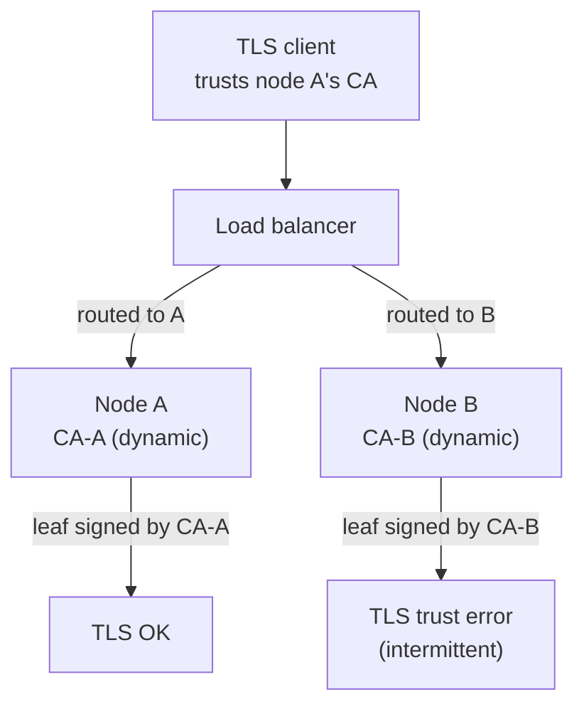

### Why it happens

- Each node runs its own certificate factory against its own local `directoryToSaveDynamicSSLCertificate` (default `.`, the container's ephemeral filesystem), so no CA material is shared between nodes.
- The `StateBackend` replicates expectations, scenario state, CRUD entities, and blobs — but the CA is a TLS-layer concern, outside the state backend entirely. `mockserver-state-infinispan` does not touch certificates.
- The symptom is **intermittent**: requests succeed whenever the load balancer happens to pin the client to the node whose CA it trusts, and fail otherwise. That intermittency is the diagnostic tell.

### The fix: one shared CA on every node

Supply the same CA certificate and private key to every replica and disable dynamic generation:

```
-Dmockserver.dynamicallyCreateCertificateAuthorityCertificate=false
-Dmockserver.certificateAuthorityCertificate=/tls/CertificateAuthorityCertificate.pem
-Dmockserver.certificateAuthorityPrivateKey=/tls/CertificateAuthorityPrivateKey.pem
```

On Kubernetes, mount that CA material from a **Secret** (never a ConfigMap — it holds a private key). The MockServer Helm chart provides `app.tls.*` values that create/mount the Secret and set these properties on every replica; see [docs/infrastructure/helm.md](../infrastructure/helm.md) and the chart README.

### Startup warning

`StateBackendFactory.create()` — the single place every `HttpState` obtains its backend at start up, and the natural home for a cluster-configuration check — logs a WARN when it detects the broken combination (`clusterEnabled=true` **and** `dynamicallyCreateCertificateAuthorityCertificate=true`). Single-node dynamic CA (one node, one CA) and clustered-with-shared-CA both stay silent. See `StateBackendFactory.isClusteredWithDynamicCertificateAuthority`.

## Source Locations

| File | Module | Purpose |
|------|--------|---------|
| `org.mockserver.state.StateBackend` | `mockserver-core` | SPI interface |
| `org.mockserver.state.KeyValueStore` | `mockserver-core` | Versioned KV store abstraction |
| `org.mockserver.state.Versioned` | `mockserver-core` | Value + version carrier |
| `org.mockserver.state.BlobStore` | `mockserver-core` | Blob store abstraction |
| `org.mockserver.state.InvalidationListener` | `mockserver-core` | Change notification callback |
| `org.mockserver.state.ExpectationEntry` | `mockserver-core` | Serializable expectation carrier |
| `org.mockserver.state.ClusterInfo` | `mockserver-core` | Cluster membership/health snapshot for `GET /mockserver/cluster` |
| `org.mockserver.state.InMemoryStateBackend` | `mockserver-core` | Default in-memory implementation |
| `org.mockserver.state.StateBackendFactory` | `mockserver-core` | Pluggable factory with classpath auto-discovery |
| `org.mockserver.mock.RequestMatchers` | `mockserver-core` | Node-local matcher cache; `reconcileFromBackend()` |
| `org.mockserver.mock.action.http.ServiceChaosRegistry` | `mockserver-core` | Fleet-aware HTTP chaos registry (G11) |
| `org.mockserver.mock.action.http.TcpChaosRegistry` | `mockserver-core` | Fleet-aware TCP chaos registry (G11) |
| `org.mockserver.mock.action.http.GrpcChaosRegistry` | `mockserver-core` | Fleet-aware gRPC chaos registry (G11) |
| `org.mockserver.mock.CrossProtocolEventBus` | `mockserver-core` | Fleet-aware cross-protocol event bus (G11 follow-up) |
| `org.mockserver.state.infinispan.InfinispanStateBackend` | `mockserver-state-infinispan` | Infinispan LOCAL/CLUSTERED implementation |
| `org.mockserver.state.infinispan.InfinispanStateBackendRegistrar` | `mockserver-state-infinispan` | Self-registration hook called by `StateBackendFactory` |
| `org.mockserver.state.infinispan.InfinispanCacheListener` | `mockserver-state-infinispan` | Bridges Infinispan cluster events to `InvalidationListener` |
| `org.mockserver.state.infinispan.ClusteredTwoNodeChaosTest` | `mockserver-state-infinispan` | G11 2-node-in-JVM integration test for cross-node chaos replication |
| `org.mockserver.state.infinispan.ClusteredTwoNodeCrossProtocolBusTest` | `mockserver-state-infinispan` | G11 follow-up 2-node-in-JVM integration test for cross-node event bus replication |
