# Event System, Logging & Verification

## Architecture Overview

All events in MockServer -- received requests, matched expectations, forwarded requests, verification results -- flow through a high-performance LMAX Disruptor ring buffer. A single consumer thread serializes all reads and writes, eliminating the need for locks.

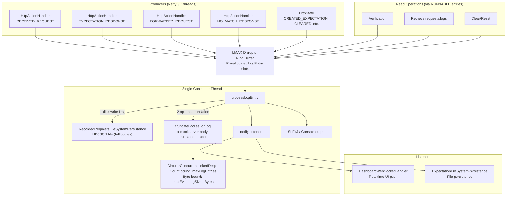

## LMAX Disruptor Integration

### Why Disruptor?

The Disruptor provides:
- **Lock-free publishing**: Multiple Netty I/O threads can publish events without contention
- **Single-writer principle**: One consumer thread processes all events, eliminating data races
- **Pre-allocated objects**: Ring buffer slots are pre-allocated `LogEntry` instances, reducing GC pressure
- **Backpressure**: `tryPublishEvent()` is non-blocking; if the ring buffer is full the event is dropped and counted as `mock_server_dropped_log_events{reason="ring_full"}` (an entry whose bodies would exceed the in-flight byte cap is dropped before publish, as `reason="in_flight_bytes"`; see [memory-management.md](memory-management.md#ring-in-flight-bounding-and-drops))

### Ring Buffer Mechanics

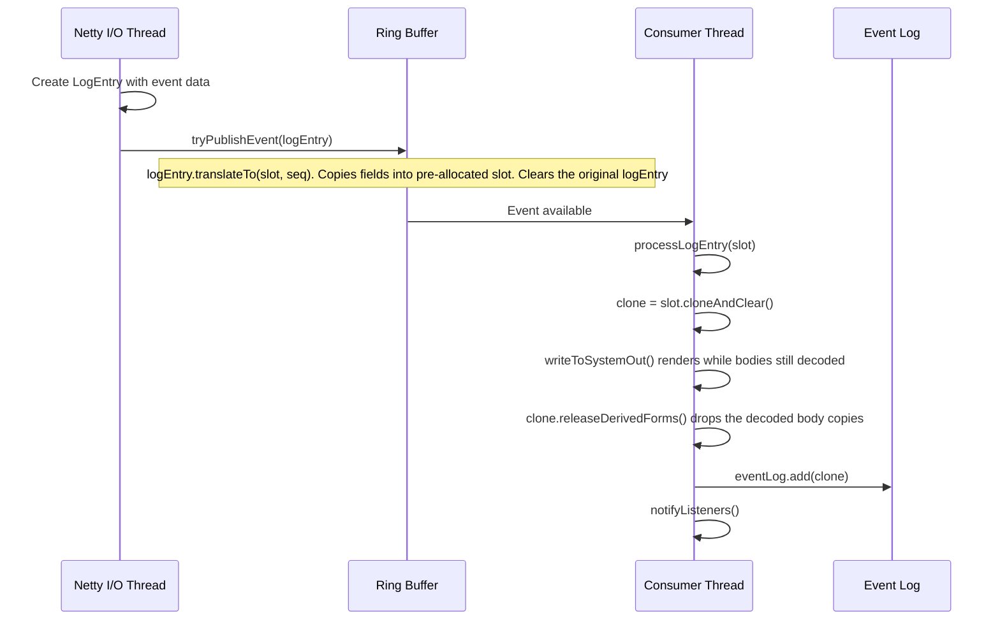

`writeToSystemOut()` runs **before** `releaseDerivedForms()`: rendering a body to stdout decodes it, so doing that first lets the release drop that decode instead of leaving it re-cached on the retained entry (which undid the release at `INFO`, the default level). The release stays **before** `eventLog.add()` so the entry's weight reflects the released body.

### Consumer Wake-ups (`CoalescingWakeWaitStrategy`)

**Producers do not wake the consumer for every entry; control-plane operations still wake it at once.** The ring uses `CoalescingWakeWaitStrategy`, a MockServer-owned `WaitStrategy`, instead of the Disruptor's default `BlockingWaitStrategy`. Below the ceiling the consumer finishes each entry long before the next arrives, so with `BlockingWaitStrategy` nearly every request's first publish paid a futex wake on the Netty worker loop (about 0.7 wakes per request; ~22% of worker-loop CPU samples at the ceiling in the build 502 JFR). Conditional signalling alone (the `LiteBlockingWaitStrategy` idea) does not help, because the consumer really is asleep at almost every first publish; only waking it less often does. Measured locally at `logLevel ERROR` (4 pinned cores, Docker Desktop arm64, JDK 25), coalescing cut container CPU per request by 21–22% at 20k and 40k req/s. At `INFO` the consumer is about half busy rendering every entry and almost never sleeps, so there is no wake cost to save and no measurable change.

| Consumer state | When a producer publishes |
|---|---|
| Running | Nothing — it re-checks the cursor before it next parks |
| Polling: idle under 50 ms, timed park backing off 1 ms → 10 ms | Wakes it only when the backlog reaches `min(256, ringSize / 4)` entries, when the in-flight bytes pass a quarter of the in-flight cap (`add()` calls `wakeConsumer()`), or for a control-plane publish; otherwise the next poll picks the entry up |
| Deep: idle 50 ms or more, parked with no timeout | Always wakes it, so an idle server spends no CPU on the consumer and the first entry after idle is processed at once |

Every `RUNNABLE` (verify, retrieve, clear, reset, drain) is published through `publishControl()`, which calls `wakeConsumer()` after the publish, so control-plane reads see everything published before them with no added latency. Other consumers of the processed log (disk capture, stdout rendering, listeners, which are already debounced by 250 ms) see a data entry at most 10 ms after it is published.

The deep park must never lose a wake-up. The consumer writes its volatile park state, issues `VarHandle.fullFence()`, then reads the cursor; a producer claims its slot with a volatile read-modify-write and only then reads the park state. The fence is load-bearing: `Sequence.get()` is a plain read plus an acquire fence, which on arm64 can be satisfied before the preceding volatile store. Removing it loses wake-ups within seconds in `CoalescingWakeWaitStrategyTest.shouldNeverLoseAWakeUpWhenPublishRacesThePark` on arm64. The strategy supports exactly one consumer thread; a second thread calling `waitFor` fails with `IllegalStateException`, because a producer only ever unparks one thread.

### LogEntry as EventTranslator

`LogEntry` implements LMAX Disruptor's `EventTranslator<LogEntry>` interface. Its `translateTo()` method copies all fields from the source entry into the pre-allocated ring buffer slot, then clears the source. This avoids object allocation in the hot path. It also copies the memoised `estimatedHeapSize`, so the consumer subtracts exactly the weight `add()` counted into the in-flight byte total (see [Ring In-Flight Bounding and Drops](memory-management.md#ring-in-flight-bounding-and-drops)).

### Serialized Read Operations

All read operations (verification, retrieval, clear, reset) are submitted as `RUNNABLE`-type `LogEntry` objects through the same ring buffer. This ensures that:

1. Reads see a consistent snapshot (no concurrent writes during iteration)
2. No locks are needed on the event log data structure
3. Operations are processed in FIFO order

```java
// Example: verify() publishes a RUNNABLE that runs on the consumer thread
disruptor.getRingBuffer().tryPublishEvent(
    new LogEntry()
        .setType(RUNNABLE)
        .setConsumer(() -> {
            // This runs on the single consumer thread
            List<LogEntry> matching = filterLog(predicate);
            future.complete(checkVerification(matching));
        })
);
```

## LogEntry

Each event is represented by a `LogEntry` with 26 possible types, organized into `LogMessageTypeCategory` groups for per-category log level overrides:

| Category Group | Types |
|----------------|-------|
| `MATCHING` | `EXPECTATION_MATCHED`, `EXPECTATION_NOT_MATCHED`, `NO_MATCH_RESPONSE` |
| `REQUEST_LIFECYCLE` | `RECEIVED_REQUEST`, `FORWARDED_REQUEST`, `EXPECTATION_RESPONSE`, `TEMPLATE_GENERATED`, `TEMPLATE_GENERATION_FAILED` |
| `EXPECTATION_MANAGEMENT` | `CREATED_EXPECTATION`, `UPDATED_EXPECTATION`, `REMOVED_EXPECTATION`, `CLEARED` |
| `VERIFICATION` | `VERIFICATION`, `VERIFICATION_FAILED`, `VERIFICATION_PASSED`, `RETRIEVED` |
| `SERVER` | `SERVER_CONFIGURATION`, `AUTHENTICATION_FAILED`, `OPENAPI_RESPONSE_VALIDATION_FAILED` |
| `GENERAL` | `TRACE`, `DEBUG`, `INFO`, `WARN`, `ERROR`, `EXCEPTION` |
| (Internal) | `RUNNABLE` (used to serialize read operations through the ring buffer; excluded from categories) |

Users can override the log level per category or per individual type via the `logLevelOverrides` configuration property (a JSON map). Resolution order: individual type override > category group override > global `logLevel`. Overrides affect stdout/SLF4J output and the dashboard UI only; the event log stores entries based on the global `logLevel` threshold to preserve verification functionality. Note: overrides can only further suppress events that are already generated at the global `logLevel` — they cannot increase verbosity beyond the global threshold because events below the global level are never created or stored.

The `compactLogFormat` configuration property (default `false`) controls log output verbosity for stdout/SLF4J. When enabled, log messages use a compact single-line format showing summary information (e.g., `POST /path`, `200`, expectation ID) instead of full pretty-printed JSON. This only affects console output — the dashboard UI, verification, and REST API log retrieval continue to use the full structured format. The compact formatter is implemented in `StringFormatter.formatCompactLogMessage()` and called via `LogEntry.getCompactMessage()`, which is independent of the cached `getMessage()` used by the REST API.

### Key Fields

| Field | Type | Purpose |
|-------|------|---------|
| `id` | String | UUID (lazy-generated) |
| `correlationId` | String | Groups related entries (e.g., request + response) |
| `type` | LogMessageType | Event type (see above) |
| `httpRequests` | RequestDefinition[] | Associated requests |
| `httpResponse` | HttpResponse | Associated response |
| `expectation` | Expectation | Associated expectation |
| `expectationId` | String | ID of matched expectation |
| `epochTime` | long | Timestamp |
| `messageFormat` | String | Format string with `{}` placeholders |
| `arguments` | Object[] | Arguments for formatting |
| `deleted` | boolean | Soft-delete flag |

### Streamed Response Capture in FORWARDED_REQUEST

When MockServer proxies a streaming response (Server-Sent Events with `Content-Type: text/event-stream`) and `streamingResponsesEnabled` is `true`, the `FORWARDED_REQUEST` log entry is written **after the stream completes** rather than synchronously after `CompletableFuture.get()`. The entry is written from the stream-completion callback in `HttpActionHandler` once `LastHttpContent` arrives.

The `httpResponse` body in the log entry contains the bytes captured by `StreamingBody` (bounded to `maxStreamingCaptureBytes`, default 256 KB). Two additional headers may appear on the logged `httpResponse`:

| Header | Meaning |
|--------|---------|
| `x-mockserver-streamed: true` | Response was relayed incrementally (not buffered) |
| `x-mockserver-stream-truncated: true` | Captured body was truncated at `maxStreamingCaptureBytes`; the client received the full stream |

These headers are present only in the log entry — they are not sent to the client. The full stream always reaches the client regardless of the capture limit.

If the upstream connection closes mid-stream (`channelInactive`), the relay handler still emits a `FORWARDED_REQUEST` entry with the bytes captured so far, flagged with `x-mockserver-stream-truncated: true`.

## Event Log Storage

`CircularConcurrentLinkedDeque<LogEntry>` is a bounded, thread-safe deque. When either bound is reached, the oldest entries are evicted and their `clear()` method is called (releasing references for GC):

- **Count bound** — `maxLogEntries` (default: heap-based formula, up to 250,000).
- **Byte-budget bound** — `maxEventLogSizeInBytes` (on by default: a twentieth of the heap-ceiling budget at `WARN`/`ERROR`/`OFF`, a twelfth at `INFO`/`DEBUG`/`TRACE`; `0` disables it). The deque also tracks a running total of body bytes (`LogEntry.estimatedHeapSize()`) and evicts oldest-first when an incoming entry would push the total over the budget. The bytes waiting in the ring have their own cap, `Configuration.maxEventLogInFlightBytes()`: the larger of this budget and a heap-derived default (a seventh at `WARN`/`ERROR`/`OFF`, a twelfth at `INFO`/`DEBUG`/`TRACE`), so the small `WARN` retention budget, which keeps entries from outliving a young-GC cycle under load, does not make a burst drop events. The divisors are sized for both together. See [memory-management.md](memory-management.md) for the full byte-budget eviction design.

### Filtering Predicates

Static predicates filter log entries for different retrieval operations:

| Predicate | Passes Types |
|-----------|-------------|
| `requestLogPredicate` | `RECEIVED_REQUEST` |
| `requestResponseLogPredicate` | `EXPECTATION_RESPONSE`, `NO_MATCH_RESPONSE`, `FORWARDED_REQUEST` |
| `recordedExpectationLogPredicate` | `FORWARDED_REQUEST` |
| `expectationLogPredicate` | `EXPECTATION_RESPONSE`, `FORWARDED_REQUEST` |
| `notDeletedPredicate` | Any non-deleted entry |

**Filter ordering matters for CPU (issue #2359).** When a retrieve also applies an `HttpRequestMatcher`, the cheap type/not-deleted predicate is applied **before** the matcher. The matcher clones the request and runs full field-by-field matching, so running it first would evaluate it against deleted tombstones and wrong-type entries that are then discarded — making each `/retrieve` cost grow with total log size as the log fills toward `maxLogEntries` (and `clear` at `INFO` only tombstones entries, leaving them in the deque). Keep the predicate filter first when adding or changing a retrieve path. For the same reason, `clear` skips entries already marked deleted rather than re-matching them on every clear.

### Unmatched Request Retrieval

`MockServerEventLog.retrieveUnmatchedRequests(limit, Consumer<List<LogEntry>>)` retrieves the most recent `NO_MATCH_RESPONSE` log entries (requests that matched no expectation). It drains the disruptor first to ensure all pending events are processed, then iterates the event log in reverse order (most recent first) to return up to `limit` entries (capped at 100). This is used by `HttpState.explainUnmatched()` and the MCP `explain_unmatched_requests` tool to provide post-hoc mismatch diagnostics without requiring users to reconstruct the failing request.

### Retrieve Response Size

**A retrieve builds its whole response in memory once, as the bytes the frontend writes, and answers `500` with an explanation when it cannot.** `HttpState.retrieve()` serialises the matching entries through a `Writer` (`SegmentedBytes.writer`) that encodes the text straight into a list of byte arrays, which start at 1 KiB and double up to 1 MiB and are kept rather than joined. The response body is a `StringBody` built from those arrays (`StringBody.fromSegmentedBytes`): Netty wraps them as one composite buffer, the servlets write them in turn, and HTTP/3 wraps them as one data frame, so no `String` of the response and no second copy of its bytes is made. Every format goes this way. `POSTMAN` writes its collection one item at a time through a `JsonGenerator`, and `HAR` converts each entry (with its bodies as text) only as it is written, so neither holds a model of the whole response. `OPENAPI` still builds its document as one Jackson tree, because operations are merged by path and method, and writes that tree into the arrays. The code formats write one expectation at a time and no expectation as a String: `JAVA` writes its code through `JavaCode`, which escapes each body as it is written, and the other languages write the expectation's JSON through a filtering writer (C# doubles each quote, Go escapes it when it holds a backtick, Rust chooses its raw-literal hashes), Go and Rust serialising it once more first to scan for the backtick or the hashes. Plain-text `LOGS` writes each message as `LogEntry.writeMessage` renders it (`StringFormatter.writeLogMessage`), streaming each argument's JSON through a writer that indents its lines; if an argument cannot be serialised as JSON, which the rendered message shows by its fields, the text is built again from the rendered messages. The `BRUNO` zip is written straight into the arrays and answered as a `BinaryBody` built from them (`BinaryBody.fromSegmentedBytes`), which the frontends write the same way. If an `OPENAPI`, `POSTMAN` or `BRUNO` export fails part-way, what was written is discarded and the retrieve answers what the String-built export answered on a failure: a minimal valid OpenAPI document, `{}`, or an empty zip body (the response is built whole before it is sent, so it can). The bytes, content type and redaction are the same as before; `HttpStateRetrieveGoldenTest` pins every type and format to digests recorded from the earlier implementation (with the random OpenAPI operation ids and the zip entries' times replaced first), and `HttpStateRetrieveAllocationTest` bounds what a large retrieve allocates per response byte. The writer encodes as `String.getBytes` does (an unpaired surrogate becomes `?`), keeping a high surrogate that ends one write for the next. Two limits remain:

| Limit | What hits it |
|-------|--------------|
| The heap | While the response is built the JVM holds it once, plus at most one partly filled 1 MiB array, on top of the log itself; serialising a recorded body also decodes it from its stored bytes |
| One buffer | The response holds at most `Integer.MAX_VALUE - 8` bytes (about 2 GB), the most one Netty buffer or one `Content-Length` frame can carry, whatever the heap; `SegmentedBytes` throws `OutOfMemoryError` past it |

Either way an `OutOfMemoryError` is thrown. A serializer's `RuntimeException` message, and the `ERROR` the serializer logs, say only how many values were being written and which one failed (for a log entry, its type and correlation id), through `SerializationFailure`; they never render the values, which would build a second copy of the log just as memory runs short. The other list serializers (requests, responses, request-response pairs, expectations, expectation ids, and the two expectation persistence classes) do the same. `retrieve()` catches the `OutOfMemoryError`, logs it at `ERROR` and answers `500` with a plain-text body that starts `the retrieve response is too large to build in memory`, names the error, and says how to retrieve less: a request matcher that matches fewer requests, clearing the log, keeping less in it (`maxLogEntries`, `maxEventLogSizeInBytes`, `maxLoggedBodyBytes`), or more heap. Every `type` and `format` returns through `retrieve()`, on every frontend (Netty, HTTP/3, the two servlets), so one catch covers them all. Without it an `Error` passes each frontend's `catch (Exception)`; `HttpRequestHandler` (HTTP/1.1 and HTTP/2) then closes the connection with no response.

The response is larger than the bodies it reports, because a byte that is not printable is written as a six-character JSON escape. Since 9.0.0 `LOG_ENTRIES` writes each body once: the entry's own request and response appear in full in `httpRequest`/`httpRequests` and `httpResponse`, and an argument that is that same request or response, or the curl command for the request, is written in `arguments` and in `message` in a compact form (`LogEntry.RedactedView.getSerializedArguments`/`getSerializedMessage`): a request as its method and path (`POST /upload`) and a response as its status code (`201`), as `compactLogFormat` shows them on the console, and the curl command as its request's method and path (`POST /upload`), where the console's compact form shows the start of the command. An argument that is any other request or response is still written in full. The dashboard and the plain-text `LOGS` formats are unchanged: they read `getArguments`/`getMessage`, which still quote the full request. A `RECEIVED_REQUEST` entry whose body is 1 MiB of zero bytes went from about 19 characters of `LOG_ENTRIES` response for each body byte (the body in `httpRequest`, again in `arguments`, and escaped twice in `message`) to about 6, and from 4 to 1.3 for random binary, written as base64. The expectation a forwarded or recorded exchange derives from its own request and response (`setExpectation(request, response)`) is written without their bodies (`getSerializedExpectation`), keeping its id, method, path, headers and status; a real expectation (matched or closest) is written in full. The in-memory expectation, which `RECORDED_EXPECTATIONS` retrieval in the other formats, the dashboard and *Capture as Mock* read, keeps its bodies.

**Encoding long text (`BodyTextEncoder`).** `String.getBytes(charset)` sizes a working array as the text's length times the charset's largest bytes-per-character, in an `int`. On Java 17 a UTF-8 encode of a `String` held as UTF-16 asks for `length * 3` bytes, which is negative past 715,827,882 characters: a `NegativeArraySizeException` whose message is that negative size, although the encoded text would fit. (A `LOG_ENTRIES` retrieve of a large log used to answer exactly that, as `400` with a bare negative number, through the frontends' catch-all.) Every place that encodes a body's text therefore goes through `BodyTextEncoder`: the text bodies (`StringBody`, `JsonBody`, `XmlBody`, `FileBody`), `Body.getRawBytes()` for the bodies that keep no bytes of their own, `HttpRequest.getBodyAsJsonOrXmlString()` and the wire encode in `BodyDecoderEncoder`. Text short enough for the JDK's estimate goes to `getBytes` unchanged; longer text is measured with a `CharsetEncoder` and encoded into an array of exactly that size, giving the same bytes without the worst-case working array; text whose encoding is larger than one array throws `OutOfMemoryError` with the sizes in its message, the error the JDK raises for an array it cannot allocate.

The measured path differs observably from the JDK's only past 715 million characters, which takes gigabytes of heap. So `BodyTextEncoderTest` reaches it by lowering the two limits, `BodyTextEncoderUseTest` replaces the encoder to prove each of those places calls it, and `HttpStateRetrieveOutOfMemoryTest` raises the error from a recorded body rather than by exhausting the heap.

## Verification

### Request Count Verification

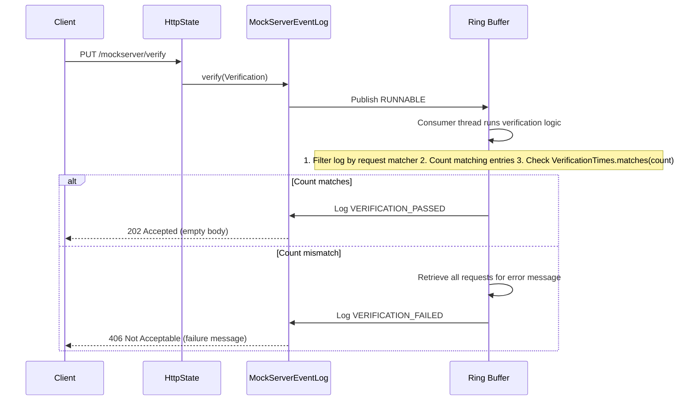

The request matcher (`VerificationDTO.httpRequest`, `VerificationSequenceDTO.httpRequests`) is read by `RequestDefinitionDTODeserializer`, the same polymorphic reader expectations, retrieve and clear use, so an OpenAPI matcher (`specUrlOrPayload` plus optional `operationId`) counts only the recorded requests that match that operation. Binding the field to `HttpRequestDTO` instead silently drops the OpenAPI fields and leaves an empty matcher that counts every request.

#### Server-Side Eventual Verification (`timeout`) — #1713

Both `Verification` and `VerificationSequence` carry an optional `timeout` (milliseconds). When it is
`null`, absent, or `0`, verification is **single-shot**: `MockServerEventLog.verify(...)` evaluates the
event log once and immediately accepts (`202`) or rejects (`406`) — byte-identical to the original
behaviour (no listener, no scheduling). When `timeout > 0`, verification becomes **eventual**: the
server re-evaluates as the log changes until the verification passes or the deadline elapses.

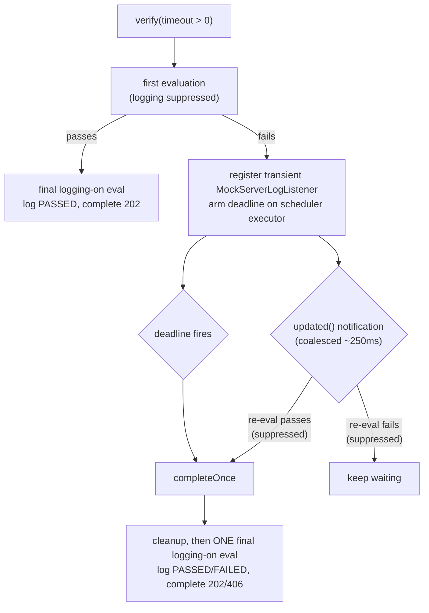

The harness lives in `MockServerEventLog.eventuallyVerify(...)` / `armEventualVerification(...)` and is
shared by request, response, and sequence verification (each supplies a `SingleVerificationEvaluation`
lambda that calls the existing `verifyRequest` / `verifyResponse` / `verifySequenceOnce`, threading a
`logResult` flag).

- **Exactly one logged outcome.** Intermediate re-evaluations during the wait run with
  `logResult = false`, so a failing-and-waiting verify does **not** append a `VERIFICATION_FAILED` entry
  per retry (which would pollute the bounded ring buffer — up to ~`timeout / 250ms` entries — and could
  evict real traffic). Only the winning completion (first pass or the deadline) runs one final
  `logResult = true` evaluation that emits the single `VERIFICATION_PASSED`/`VERIFICATION_FAILED` entry.
  Single-shot (`timeout` null/0) is unchanged: its one evaluation always logs.
- **Single-completion guard.** An `AtomicBoolean` ensures the result consumer is invoked exactly once,
  whether the first passing re-evaluation or the deadline wins the race; the winner re-derives the real
  result (so a request arriving right at the deadline is honoured) in its final logging-on evaluation.
- **No leak.** On completion the transient listener is always unregistered and the deadline
  `ScheduledFuture` is always cancelled (via the same single-completion guard) — before the final
  evaluation runs, so it cannot itself re-trigger the listener.
- **No I/O-thread blocking.** Re-evaluation runs on the coalesced notification path (scheduler
  executor) and the deadline runs on the scheduler — completion is delivered through the existing async
  result consumer, never a blocking sleep on the request thread.
- **Coalesced-notification safe.** Because async listener notifications are debounced (~250 ms), the
  harness also re-runs the evaluation once right after registering the listener, so a passing event that
  arrived between the first evaluation and registration is not missed.
- **Bounded.** The accepted timeout is hard-capped at `MockServerEventLog.MAX_VERIFY_TIMEOUT_MILLIS`
  (60 s) so a client cannot tie up server resources indefinitely. When no scheduled executor is available
  (synchronous `Scheduler`, e.g. WAR/servlet) the eventual path cannot be armed and verification
  degrades gracefully to single-shot.

This is the **server-side** complement to the Java client's existing client-side timeout-aware
`verify(request, times, Duration)` poll (see "Verification in Parallel Testing" below); a non-Java
client can now get eventual semantics by setting `timeout` on the verification JSON instead of polling.

`VerificationTimes` supports:
- `never()` — must not have been received
- `once()` — exactly 1
- `exactly(n)` — exactly n
- `atLeast(n)` — n or more
- `atMost(n)` — n or fewer
- `between(min, max)` — within range

#### Verify by Disposition

`Verification.withDisposition(Disposition)` narrows a request-count verification to only those requests handled with a particular disposition:

| Disposition | Counts log entries of type | Meaning |
|-------------|----------------------------|---------|
| `FORWARDED` | `FORWARDED_REQUEST` | request was forwarded/proxied to an upstream server |
| `MOCKED` | `EXPECTATION_RESPONSE` | request matched an expectation and got a mocked response |
| (unset) | `RECEIVED_REQUEST` | every received request (original behaviour) |

When a disposition is set, `MockServerEventLog.retrieveRequests(Verification, ...)` swaps `requestLogPredicate` for `forwardedRequestLogPredicate` or `mockedRequestLogPredicate` (both exclude `NO_MATCH_RESPONSE`, MockServer's own auto-404). The disposition is serialized as the `disposition` field on the verification JSON (enum `MOCKED`/`FORWARDED`). It applies to the request-count path only — it is ignored for response verification (`httpResponse` set) and expectation-id verification.

#### Soft / Collecting Verify (`verifyAll`)

`MockServerClient.verifyAll(Verification...)` runs every supplied verification client-side and, instead of throwing on the first failure like `verify(...)`, collects all failure messages and throws a single `AssertionError` listing every mismatch. This is purely a client convenience — each verification is still sent through the standard `PUT /mockserver/verify` path; no server change is involved.

### Response Verification

When `Verification.httpResponse` is non-null, the verification switches from the request-only path to a response-aware path that counts matching **request-response pairs** rather than received requests.

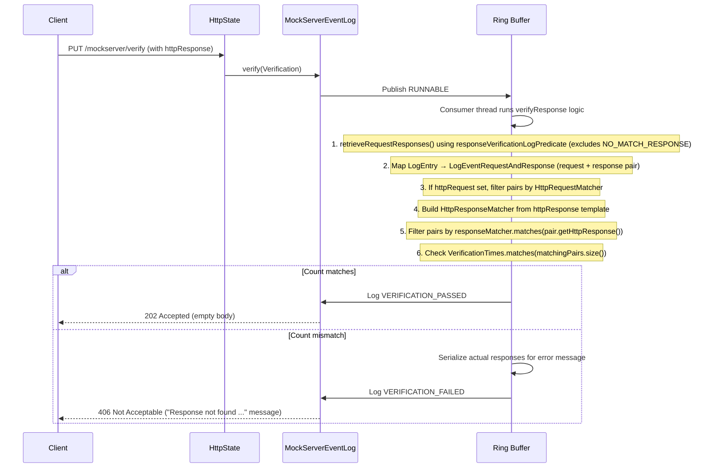

**Dispatch logic** in `MockServerEventLog.verify(Verification, Consumer<String>)`:

```java
if (verification.getHttpResponse() != null) {
    verifyResponse(verification, logCorrelationId, resultConsumer);
} else {
    verifyRequest(verification, logCorrelationId, resultConsumer);
}
```

The `verifyResponse` path uses `responseVerificationLogPredicate` — an alias for `expectationLogPredicate` — which passes only `EXPECTATION_RESPONSE` and `FORWARDED_REQUEST` entries. It deliberately **excludes** `NO_MATCH_RESPONSE` (MockServer's own auto-generated 404 for unmatched requests), so a template such as `response().withStatusCode(404)` does not accidentally count MockServer's own no-match responses. The `requestResponseLogPredicate` used by `/retrieve` is intentionally broader (includes `NO_MATCH_RESPONSE`); the verification predicate is a separate alias so future changes to one do not silently affect the other.

#### Response Matching Semantics

`HttpResponseMatcher` (`mockserver-core/src/main/java/org/mockserver/matchers/HttpResponseMatcher.java`) is a self-contained matcher built from the `HttpResponse` template in a `Verification` or `VerificationSequence`. Every field is optional: an unset field imposes no constraint, so a null template matches any response.

| Field | Matching strategy | Notes |
|-------|-------------------|-------|
| `statusCode` | Exact integer equality | Not used when `statusCodeRange` is set |
| `statusCodeRange` | `StatusCodeMatcher` — class range or numeric operator | See below |
| `reasonPhrase` | `RegexStringMatcher` — string or regex | Respects `matchExactCase` (see below) |
| `headers` | `MultiValueMapMatcher` — subset match, extra response headers allowed | Notted key/value strings supported |
| `cookies` | `HashMapMatcher` — subset match, extra cookies allowed | Same semantics as request cookie matching; notted values supported |
| `body` | `BodyMatching` dispatch — full parity with request body matching | See below |

**Status-code range / operator matching (`statusCodeRange`)** — `StatusCodeMatcher` supports three forms:

- **Exact** (default): when `statusCodeRange` is absent/blank, exact `Integer` equality is used.
- **Class range**: a single digit followed by `XX` (case-insensitive), e.g. `"2XX"` or `"5xx"`, matches the range `[N00, N99]`.
- **Numeric operator**: a leading comparison operator followed by a number, e.g. `">= 400"`, `"> 200"`, `"< 300"`, `"<= 204"`, `"== 201"`. Delegated to `NumericComparisonMatcher`.

When both `statusCode` and `statusCodeRange` are set on the template, `statusCodeRange` takes priority (the matcher is built from it). An unparseable `statusCodeRange` expression is a clean non-match (logged at DEBUG; never throws).

**`matchExactCase` scope** — the `reasonPhrase` matcher honours the `matchExactCase` configuration flag: when `true`, the reason-phrase comparison is case-sensitive. This mirrors the request-side behaviour for method, path, and string-body. Header names/values, cookie names/values, and query parameters are always matched case-insensitively regardless of this flag. The flag has no effect on `statusCode`/`statusCodeRange` (numeric) or on control-plane operations (clear/retrieve).

**Body matching** — response body matching shares `BodyMatching` (`mockserver-core/src/main/java/org/mockserver/matchers/BodyMatching.java`) with request matching. This means:

- All body matcher types are supported: string, regex, sub-string, JSON, JSON Schema, JSONPath, XML, XML Schema, GraphQL, JSON-RPC, binary, multipart.
- The template body is read as a request body matcher: `VerificationDTO.httpResponse` and `VerificationSequenceDTO.httpResponses` are deserialised by `VerificationHttpResponseDTODeserializer`, which parses `body` with the request `BodyDTODeserializer` (so `subString`, `matchType`, `not` and every type survive). A matcher with no content type (regex, JSON path, ...) cannot be an `HttpResponse` body, so it travels wrapped in `ResponseMatchingBody` (`HttpResponse.withBodyMatching(...)` in Java), which `HttpResponseMatcher` unwraps and `Expectation.thenRespond` rejects. The response deserialiser used for expectation actions only knows string, JSON, XML, binary and file bodies, which is why verification must not use it.
- `optional: true` body template matches a response with no body.
- XML and form actual bodies are converted to JSON before JSON-family matching.
- Binary matchers try the decompressed bytes; for response bodies (no compressed-original representation) only one byte array is tried.
- An absent actual body is a clean non-match for JSON/XML matchers (no internal NPE).

**`detailedVerificationFailures` now covers response verification** — when `detailedVerificationFailures` is `true` and a response verification fails, MockServer appends a field-level closest-response diff to the error message. It scores recorded responses by how many fields differ from the template, picks the closest one, and lists the differing fields with expected-vs-found values. This is diagnostic only and never changes the pass/fail result.

**Intentional asymmetries vs. request matching** — features present on the request side that are absent from response matching:

- There is no top-level `not(...)` on a response template. The `HttpResponse` model has no `isNot()` method. Per-field negation (notted header/cookie strings and body `not`) still works.
- `connectionOptions` and HTTP trailers are not matched; they are action-configuration fields, not observable response properties.
- Control-plane operations (clear, retrieve) do not apply `matchExactCase`.

### Sequence Verification

Sequence verification checks that requests were received in a specific order:

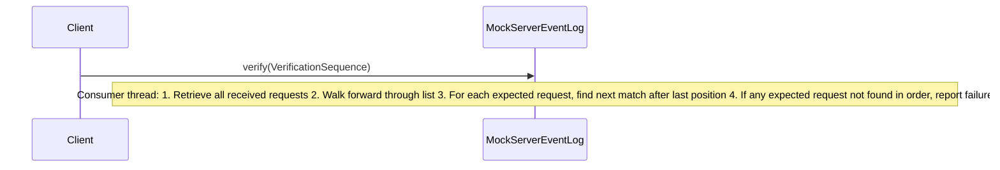

Verification can be done by request matcher or by expectation ID.

**Field-level closest-match diff on sequence failure** — when `detailedVerificationFailures` is enabled (on by default) and a request-matcher sequence step fails to find a match, the failure message appends a `closest match diff:` block for that specific step (via the same `buildClosestMatchDiff` used by single-request verify), naming the differing fields (method/path/headers/body/...) for the closest recorded request. Response-aware sequences append the analogous `buildClosestResponseMatchDiff` for the failing step's response template. The expectation-ID path appends no diff (steps match by recorded expectation id, not request fields). The diff is diagnostic only; when `detailedVerificationFailures` is disabled the legacy message format is unchanged.

**Request matcher count verification** filters `RECEIVED_REQUEST` entries. **Expectation ID verification** retrieves entries matching `expectationLogPredicate` (includes `EXPECTATION_RESPONSE`, `FORWARDED_REQUEST`). **Sequence verification** scans recorded requests in order rather than counting.

#### Response-Aware Sequence Verification

When `VerificationSequence.httpResponses` is non-empty, sequence verification switches to a response-aware path that checks both requests and responses at each step:

1. Validates inputs: an entirely-empty sequence (no expectation IDs, no requests, no responses) is rejected; when both `httpRequests` and `httpResponses` are non-empty they must be the same length, otherwise the sequence is rejected (a mismatched-length sequence previously padded with null and silently passed the unspecified steps — this is no longer allowed).
2. Retrieves all recorded request-response pairs via `retrieveRequestResponses()` using `responseVerificationLogPredicate` (excludes `NO_MATCH_RESPONSE`).
3. Iterates `stepCount = httpResponses.size()` steps; `httpRequests` may be empty (response-only sequence).
4. At each step, creates an `HttpRequestMatcher` from `httpRequests[i]` (if present) and an `HttpResponseMatcher` from `httpResponses[i]`; a null matcher acts as a wildcard for that side.
5. Uses a forward-scanning pointer (`pairLogCounter`) that only advances — order is preserved.
6. A step passes when both matchers match the same `LogEventRequestAndResponse` entry: `requestMatches && responseMatches`.
7. If any step fails to find a match after the previous step's position, the sequence verification fails; the failure message serializes the response side (not the request side) to make the failure actionable.

### Verification in Parallel Testing

**Common issue (#1713):** When running tests in parallel, verification may intermittently fail even though requests were sent successfully.

**Root causes:**

1. **Async application under test** — If your application sends requests asynchronously (e.g., fire-and-forget, background workers), calling `verify()` before the application has actually sent the request will fail. Verification queries are themselves published as `RUNNABLE` events to the same disruptor ring buffer as request recording. Because the Disruptor has a single consumer thread that processes events in FIFO order, a verification query published after a log entry is guaranteed to see that entry. This means: once a request has reached MockServer and been published to the ring buffer, subsequent verification calls will see it.
2. **Log eviction** — The event log is bounded by `maxLogEntries` (default: `min(heap ceiling KB / 8, 250000)`). In high-throughput parallel testing, old entries may be evicted before verification runs, and under sustained load entries can be dropped before they are recorded. An upper-bound verification then fails closed with a message naming which of these happened since the last reset and its remedy (see [memory-management.md](memory-management.md#ring-in-flight-bounding-and-drops)).
3. **Cross-test interference** — If multiple tests share the same MockServer instance, requests from other tests may inflate the count or interfere with sequence verification.

**Solutions:**

- **Increase `maxLogEntries`** if running many parallel tests that generate thousands of requests:
  ```java
  ConfigurationProperties.maxLogEntries(200_000);
  ```
- **Use separate MockServer instances per test** (different ports or separate containers) to isolate event logs
- **Use unique test identifiers** if sharing an instance:
  - Unique paths per test: `/test/{testId}/...`
  - Unique headers or query parameters in matchers
  - Avoid broad matchers like only `path("/api")` in parallel tests
- **Be careful with `clear()` / `reset()`** — they affect all tests sharing the instance
- **Retry verification with backoff** if testing asynchronous systems where you need to wait for the application to send requests. The Java client has this built in via timeout-aware overloads (no external retry helper needed):
  ```java
  // Eventual verification: poll until the request arrives or the timeout expires
  mockServerClient.verify(request, VerificationTimes.once(), Duration.ofSeconds(5));

  // Negative-within-timeout: assert no matching request arrives during the window
  mockServerClient.verifyNever(request, Duration.ofSeconds(2));
  ```
  These poll the standard `PUT /mockserver/verify` endpoint client-side with a 100 ms backoff (`MockServerClient.verify(Verification, Duration)` / `verifyNever(Verification, Duration)`); there is no server-side wait. The equivalent with an external library is:
  ```java
  // Wait for application under test to send request, not for MockServer to process it
  Awaitility.await()
      .atMost(Duration.ofSeconds(5))
      .pollInterval(Duration.ofMillis(100))
      .untilAsserted(() -> mockServerClient.verify(request, VerificationTimes.once()));
  ```
- **Debug by retrieving recorded requests** — if verification fails, check what was actually recorded:
  ```java
  // Retrieves recorded requests (not the full event log)
  HttpRequest[] recorded = mockServerClient.retrieveRecordedRequests(null);
  System.out.println("Recorded requests: " + Arrays.toString(recorded));
  ```

See consumer documentation at [/mock_server/verification.html#how_verification_works](https://www.mock-server.com/mock_server/verification.html#how_verification_works) for user-facing guidance.

## Retrieve Formats (Expectation Code Generation)

`PUT /mockserver/retrieve?type=<scope>&format=<format>` converts recorded or active state into a
chosen representation. The `format` query parameter maps to the `Format` enum
(`mockserver-core/.../model/Format.java`) via `Format.valueOf(param.toUpperCase())`, defaulting to
`JSON`. `HttpState.retrieve()` dispatches on `(scope, format)` in four `switch(format)` blocks —
one per scope: `REQUESTS`, `REQUEST_RESPONSES`, `RECORDED_EXPECTATIONS`, `ACTIVE_EXPECTATIONS`.

| Format | Scopes producing code/output | Content-Type | Generator |
|--------|------------------------------|--------------|-----------|
| `JAVA` | recorded + active expectations | `application/java` | `ExpectationToJavaSerializer` (typed builder DSL) |
| `JAVASCRIPT` | recorded + active expectations | `application/javascript` | `ExpectationToJavaScriptSerializer` |
| `PYTHON` | recorded + active expectations | `text/x-python` | `ExpectationToPythonSerializer` |
| `GO` | recorded + active expectations | `text/x-go` | `ExpectationToGoSerializer` |
| `CSHARP` | recorded + active expectations | `text/x-csharp` | `ExpectationToCSharpSerializer` |
| `RUBY` | recorded + active expectations | `text/x-ruby` | `ExpectationToRubySerializer` |
| `RUST` | recorded + active expectations | `text/x-rust` | `ExpectationToRustSerializer` |
| `PHP` | recorded + active expectations | `application/x-httpd-php` | `ExpectationToPhpSerializer` |
| `JSON` | all | `application/json` | `ExpectationSerializer` / `RequestDefinitionSerializer` |

**Why the non-Java languages are cheap.** Unlike the Java client (which needs the typed builder DSL,
hence the ~20-class `*ToJavaSerializer` family), every other official client accepts an expectation as
a JSON object. So each `ExpectationTo<Lang>Serializer` (all in `org.mockserver.serialization.code`)
reuses the existing JSON serialization (the same `ExpectationSerializer` used for `format=json`) and
wraps each expectation in the language's real upsert call plus an import/instantiation preamble — one
call per expectation. The embedded JSON is byte-identical to `format=json`, so the generated code
round-trips through the real clients.

- **JavaScript**: `const { mockServerClient } = require('mockserver-client');` then one
  `mockServerClient("localhost", 1080).mockAnyResponse(<expectation JSON>);` per expectation.
- **Python**: `import json` / `from mockserver import MockServerClient, Expectation` then one
  `client.upsert(Expectation.from_dict(json.loads("""<expectation JSON>""")));` per expectation.
- **Go**: `mockserver.New("localhost", 1080)` then `json.Unmarshal([]byte(`​`<JSON>`​`), &e); client.Upsert(e)`.
  A Go raw-string (backtick) literal carries the JSON; it falls back to a double-quoted interpreted
  string if the JSON contains a backtick.
- **C#**: `new MockServerClient("localhost", 1080)` then
  `client.Upsert(JsonSerializer.Deserialize<Expectation>(@"<JSON>", jsonOptions));`. The JSON sits in a
  C# verbatim string (`@"..."`, double-quotes doubled).
- **Ruby**: `require 'mockserver-client'` then
  `client.upsert(MockServer::Expectation.from_hash(JSON.parse(<<JSON)));` with the JSON in a heredoc.
- **Rust**: `ClientBuilder::new("localhost", 1080).build()?` then
  `client.upsert(&[serde_json::from_str::<Expectation>(r#"<JSON>"#)?])?;`. The hash count of the raw
  string is bumped if the JSON contains a quote-followed-by-hashes terminator.
- **PHP**: `new MockServerClient('localhost', 1080)` then
  `$client->upsertExpectation(Expectation::fromArray(json_decode(<<<'JSON' ... JSON, true)));`. The JSON
  sits in a nowdoc (no interpolation). The PHP client's `Expectation::fromArray()` factory stores the
  decoded array verbatim and replays it from `toArray()`, so every field round-trips without a typed
  field-by-field inverse.

Each generator escapes the embedded JSON for its language's string literal, so hostile values (quotes,
backslashes, newlines, and the language's own raw-string/heredoc terminator) copy-paste cleanly. These
are all expectation-scope formats; for `REQUESTS`/`REQUEST_RESPONSES` they return a clear "not
supported" message, exactly as `JAVA` does for `REQUEST_RESPONSES`. The dashboard surfaces these via
Library → Export (format dropdown + "Copy as code" button). The same Export tab also offers
**verification code** for the recorded-requests scope in Java, JavaScript, Python, Go, C#, Ruby and
Rust — that code is generated client-side in the dashboard (by `verificationCodegen.ts`) from the
retrieved request JSON, one `verify(...)` per request, rather than by a server-side serializer.

## Record &rarr; Mock (Consolidation, Promotion, HAR Import)

Raw recorded expectations are a verbatim 1:1 dump: `MockServerEventLog.retrieveRecordedExpectations()`
maps every `FORWARDED_REQUEST` log entry (via `LogEntry::getExpectation`) to an exact-match
`Times.once()` expectation. Recording 50 hits to `GET /users/123` therefore yields 50 identical,
brittle expectations. `RecordedExpectationPostProcessor` turns that dump into reusable mocks.

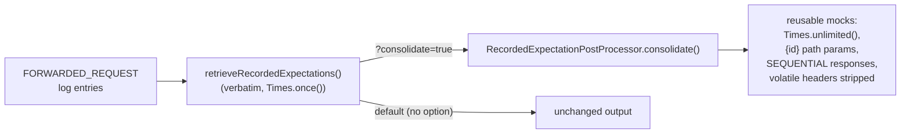

Two engines live in `RecordedExpectationPostProcessor` (both pure functions):

| Method | Behaviour | Trigger |
|--------|-----------|---------|
| `deduplicateAndTemplatize(list, templatizeValues)` | Conservative dedup: preserves recorded `Times`, emits **one expectation per distinct response** (differing responses are *not* merged). | config flags `deduplicateRecordedExpectations` / `templatizeRecordedValues` |
| `consolidate(list, parameterizeValues)` | Record&rarr;mock: **one expectation per request shape**, `Times.unlimited()`, differing responses **sequenced** into a `SEQUENTIAL` list, volatile request headers stripped (reusing `HarImporter.volatileRequestHeaders()`). | `?consolidate=true` retrieve/import query param, or the promote endpoint |

`consolidate` groups eligible exchanges (concrete `HttpResponse` only) by structural signature
(method + templatized path shape + body shape). Where a group spans several concrete ids the varying
`/users/{id}` segments become declared path parameters; a single id keeps its concrete path. Distinct
responses are collected in first-seen order and de-duplicated — identical hits collapse to one
response, differing responses become a `ResponseMode.SEQUENTIAL` multi-response list on a single
expectation. With `parameterizeValues` (`?parameterize=true`) volatile query-parameter, header and
JSON-body leaf values are additionally generalised to regex matchers (same heuristics as
`deduplicateAndTemplatize`).

`HttpState.postProcessRecordedExpectations(list, request)` wires the query parameters into every
`RECORDED_EXPECTATIONS` retrieve format: `?consolidate=true` (and/or `?parameterize=true`) takes
precedence over the config-flag path; with neither present and the flag off, output is byte-for-byte
identical to historical behaviour (non-breaking).

**Promotion (`PUT /mockserver/recordings/promote`).** The server-side equivalent of the MCP
`create_expectations_from_recorded_traffic` tool. It retrieves recorded expectations matching an
optional request-matcher filter (JSON body; empty body = all), **redacts secrets first** (via
`ImportRedaction`, on by default — redacting the raw single-response recordings before consolidation
so responses differing only in a secret collapse and the single-response redactor never flattens a
sequenced list), consolidates/parameterizes them (`?consolidate` / `?parameterize`, both on by
default; `?consolidate=false` promotes verbatim but still upgraded to `Times.unlimited()`), then
**activates** the result via `HttpState.add(...)` and returns it as `201 Created`.

**HAR import.** `PUT /mockserver/import?format=har` already turns a HAR capture into expectations via
`HarImporter` (HAR was previously export-only for the recorded-request path; import has since been
added for HAR/Postman/Pact). `?consolidate=true` / `?parameterize=true` now run the same consolidation
engine over the imported expectations before they are upserted, so a HAR that captured one endpoint
many times collapses into a compact reusable mock set.

**Import ids.** HAR and Postman expectations get ids from `ImportIds.fromRequestMatchers`: the format
prefix (`har`, or `postman-<request name>`) plus the first 12 hex digits of a SHA-256 of the redacted
request matcher, with `-2`, `-3`, ... for a request repeated within one file. Re-importing a file, or
a version whose responses changed, upserts the same ids; a different file adds to what is there. (Ids
were positional, `har-0`, so a second file replaced the first.)

**Redaction preserves multi-response lists.** `FixtureRedactor.redactExpectation` now redacts and
preserves a `SEQUENTIAL`/`WEIGHTED`/`SWITCH` `httpResponses` list (with its `responseMode`,
`responseWeights` and `switchAfter`) instead of silently dropping all but the single
`getHttpResponse()` — required because consolidation can emit sequenced responses that later pass
through the config-driven `redactSecretsInRecordedExpectations` step on the retrieve path.

## Persistence System

### Disk Capture for Recorded Requests (NDJSON)

When `persistRecordedRequestsToDisk` is `true`, every recorded exchange — both `FORWARDED_REQUEST` (proxied) and `EXPECTATION_RESPONSE` (mocked) log entries — is appended to an NDJSON file (one compact JSON object per line) by `RecordedRequestsFileSystemPersistence`, wired in as a per-entry hook on the Disruptor consumer thread plus a flush hook the consumer runs at the end of each batch.

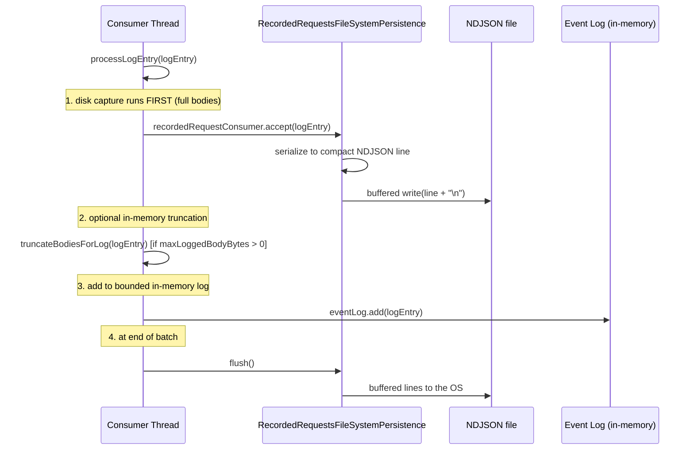

**Key design points:**

- **Disk-before-truncation ordering.** The disk write runs in `processLogEntry` before `truncateBodiesForLog()`, so the NDJSON archive always receives full-fidelity bodies even when `maxLoggedBodyBytes` clips the in-memory copy.
- **Append-only, flushed per batch.** The file is opened with `StandardOpenOption.CREATE | APPEND` behind an 8 KB `BufferedOutputStream`. Lines are flushed when the Disruptor consumer reaches the end of a batch (the ring is momentarily drained), when `stop()` closes the file, and before a `?source=disk` import reads it; with synchronous event processing every recorded entry is flushed as it is written. A line of 8 KB or more bypasses the buffer and reaches the OS as it is written; the buffer otherwise spills whenever it fills. So a crash or OOM-kill loses at most the unflushed buffer (under 8 KB of complete lines) plus a line being written, not the whole session. A hard kill can therefore leave a **truncated mid-JSON final line**, and `RecordedTrafficImporter` **skips (and counts) that malformed line rather than aborting**, so `?format=recording&source=disk` recovers every intact exchange.
- **Write path is a side-channel; reload it explicitly.** Live reads (retrieve, verify, dashboard) query the in-memory `CircularConcurrentLinkedDeque` only, so entries evicted from memory under the byte budget are on disk but not visible until the archive is reloaded. **Re-import** the archive with `PUT /mockserver/import?format=recording` — supply the NDJSON in the request body, or add `?source=disk` (or send an empty body) to read the configured `persistedRecordedRequestsPath`. `RecordedTrafficImporter` parses each line and `MockServerEventLog.importRecordedRequestResponse(...)` re-injects each pair as a `FORWARDED_REQUEST` entry, so it becomes retrievable exactly like an in-memory recording. (A reloaded originally-mocked exchange therefore counts as forwarded under verify-by-disposition — an accepted v1 boundary.)
- **Malformed/truncated lines are skipped, not fatal.** A single unparseable line (the classic crash-truncated last line, or any corruption) is skipped and counted. A disk-full episode can leave malformed lines too — a buffer spill or flush that fails part-way writes part of a line — and these are skipped and counted the same way; the skipped count is returned in the `x-mockserver-recorded-requests-skipped` response header and logged at WARN. The importer only fails (`400`) when the body has non-blank lines but **none** parse (i.e. it is not a recorded-traffic archive at all). An empty/whitespace archive imports **0** exchanges (`201`), not an error.
- **Re-import is idempotent.** Re-injected entries carry `LogEntry.skipRecordedRequestPersistence = true`, so `processLogEntry` does not hand them back to the disk consumer — reloading an archive never appends the reloaded exchanges back to the (possibly same) file.
- **Inert when disabled.** When `persistRecordedRequestsToDisk` is `false`, the `RecordedRequestsFileSystemPersistence` instance has all fields `null` and `append()` / `flush()` / `stop()` are no-ops. The hook (`recordedRequestConsumer`) is not set on `MockServerEventLog`. (Re-import via `PUT /mockserver/import?format=recording` still works with an archive supplied in the request body.)
- **Both mocked and forwarded entries.** The hook is guarded by `logEntry.getType() == FORWARDED_REQUEST || logEntry.getType() == EXPECTATION_RESPONSE` in `processLogEntry`, so the archive is a complete record of served traffic (proxied and mocked). Other event types (RECEIVED_REQUEST, NO_MATCH_RESPONSE, etc.) are not written.

**Format.** Each line is a serialized `HttpRequestAndHttpResponse`, written by the compact (non-pretty) writer of the same `ObjectMapperFactory` configuration `HttpRequestAndHttpResponseSerializer` uses, so a line parses to the same JSON that `PUT /mockserver/retrieve?type=REQUEST_RESPONSES` returns for a single entry, and is exactly what `RecordedTrafficImporter` reads back on re-import. The one place compact output can contain a raw newline is a scalar JSON body written verbatim (`JsonBodyDTOSerializer` uses `writeRawValue`); any whitespace run containing a newline is collapsed to a single space in a linear pass, so every exchange stays one line.

**Redaction.** The persisted archive honours `mockserver.redactSecretsInLog` exactly like the in-memory retrieval/export path — `append()` uses the redaction-aware `LogEntry.getRedactedHttpRequest()` / `getRedactedHttpResponse()` accessors, so secrets are masked on disk by default when redaction is on. Re-import re-masks via `ImportRedaction` (on by default) as a defence-in-depth step, consistent with HAR/Postman import.

**Recommended combo.** Pair disk capture with `maxEventLogSizeInBytes` to get bounded memory and complete session history on disk:

```
persistRecordedRequestsToDisk=true      # full bodies to disk
maxEventLogSizeInBytes=268435456        # 256 MB in-memory byte budget
maxLoggedBodyBytes=0                    # keep in-memory bodies untruncated (budget evicts instead)
```

The launcher `mockserver-ui/scripts/launch-with-llm-capture.sh` uses exactly this combination by default.

**Throughput trade-off.** With `persistRecordedRequestsToDisk` enabled, every recorded exchange — including each mocked `EXPECTATION_RESPONSE`, of which a single streaming LLM/SSE/gRPC request can emit several — is serialised on the single Disruptor consumer thread, the same thread that retains every log entry, so capture cost is paid in ring-drain rate (and, once the ring fills, in dropped log entries, `mock_server_dropped_log_events{reason="ring_full"}`). The line is serialised compactly straight into a reused byte buffer (no pretty-printing, no regex, no `String`), and the flush — one syscall — is paid once per batch rather than per line; under load a batch holds many entries. The price is the durability window above: up to 8 KB of recent complete lines rather than none. `RecordedRequestsPersistenceBenchmark` (in `mockserver-benchmark`) measures the per-exchange cost.

### File Persistence for Expectations

When `configuration.persistExpectations()` is true, `ExpectationFileSystemPersistence` implements `MockServerMatcherListener` and writes all active expectations to a JSON file whenever they change. It also **reads that document back once, on startup**, when the configured blob store is a cloud one — so cloud persistence is symmetric rather than write-only.

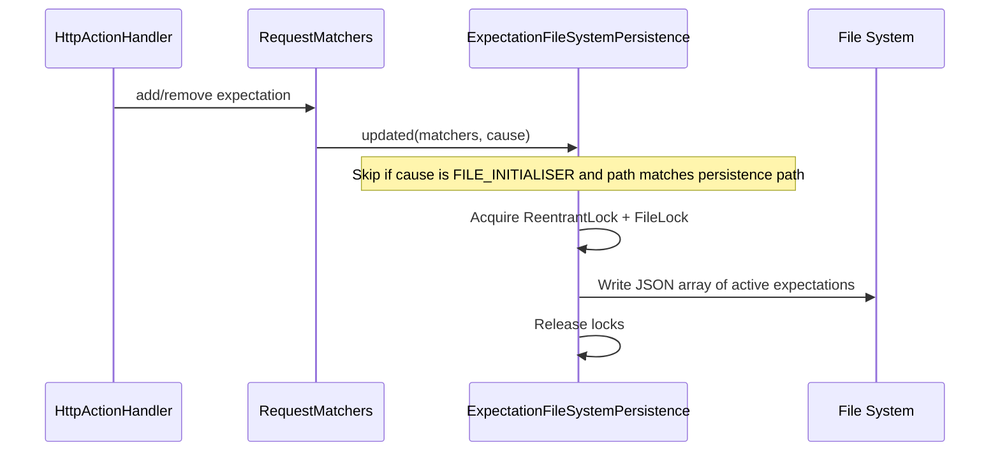

#### Startup restore (cloud blob stores only)

The constructor calls `reloadPersistedExpectations()` **before** `registerListener(this)`, so the restore cannot trigger a redundant write-back of what it just read.

- **Skipped for `FilesystemBlobStore`.** The filesystem case already reloads through the `initializationJsonPath` mechanism (users point `initializationJsonPath` at `persistedExpectationsPath`); restoring here too would load the same local file twice. Every other `BlobStore` — S3, GCS, Azure — has no local-file reload path, so without this read the persisted document is write-only.
- **Bounded by `blobStoreRestoreTimeoutSeconds` (default 10s).** This constructor runs inside `HttpState`, which the netty `LifeCycle` constructor builds **before any listening port is bound**. An unbounded read against an endpoint that drops packets delays startup for the cloud SDK's entire retry budget — measured at ~120s for AWS SDK v2 defaults (4 attempts x a 30s socket timeout) — long enough to fail readiness probes and Testcontainers wait strategies. The read runs on a daemon thread with a `Future.get(timeout)`; on expiry MockServer logs a WARN and starts with no restored expectations. Setting the property to `0` skips the restore entirely.
- **The restore's `Cause` source is prefixed `blobstore:`.** `Cause` has value equality on `(source, type)` and `RequestMatchers.update(expectations, cause)` *removes* every matcher whose source equals the cause but which is absent from the incoming array. `ExpectationInitializerLoader` runs after the persistence (`HttpState` constructs it later) and calls `update(..., new Cause(initializationJsonPath, FILE_INITIALISER))` unconditionally — including with an empty array when the file is blank. Without the prefix, a user who points `initializationJsonPath` at the same absolute path as `persistedExpectationsPath` would have every restored expectation silently deleted. That combination also logs a WARN under a non-filesystem store, since the initializer reads a local file the bucket never populates.
- **The blob key is the FILE NAME of `persistedExpectationsPath`, never the local path.** `BlobKeys.forPersistedFile` keeps the absolute path only for `FilesystemBlobStore` (which interprets the key as a file path); every other store gets the bare file name. An absolute local path is a poor object-store key: it starts with `/`, so a `blobStoreKeyPrefix` ending in `/` (the documented shape, `blobStoreKeyPrefix="mockserver/"`) composed a `//` object name that MinIO rejects with HTTP 400, "Object name contains unsupported characters", and under that prefix shape every cloud write failed. Under the other prefix shapes the write succeeded — a leading `/` is a legal S3 key byte and `get` composed the same key back — but the object name embedded the writing container's local filesystem layout, so an instance started from a different directory silently restored nothing. **This is a BREAKING relocation for existing data:** the old key always embedded the absolute path and the new one never does, so on upgrade the restore misses under every configuration and the next write orphans the old object (see the upgrade note in `persisting_expectations.html`). Restore therefore requires the same bucket, the same `blobStoreKeyPrefix` and the same `persistedExpectationsPath` *file name* — the containing directory no longer matters, so instances started from different working directories now agree. A key miss logs at INFO with the key and that requirement, rather than passing silently.
- **Prefix and key are joined by `BlobKeys.join`, shared by the S3, GCS and Azure stores.** It drops any leading separator, collapses repeated separators, and inserts exactly one separator between prefix and key, so every prefix shape a user can configure (empty, `mockserver`, `mockserver/`, `/mockserver/`) yields the same valid object name.

### File Watcher

When `configuration.watchInitializationJson()` is true, `ExpectationFileWatcher` monitors the initialization JSON and OpenAPI files for changes:

- Uses `FileWatcher` which polls every 5 seconds using a `ScheduledExecutorService`
- Detects changes by comparing file content hashes (`Arrays.hashCode(Files.readAllBytes(path))`)
- On change, reloads expectations via `ExpectationInitializerLoader`

## Observer Pattern

Two observer interfaces drive real-time updates:

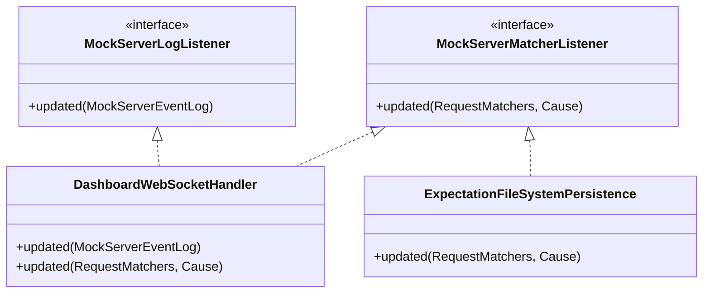

### Notification Flow

- `MockServerEventLogNotifier` (base of `MockServerEventLog`): Notifies `MockServerLogListener` instances when log entries are added
- `MockServerMatcherNotifier` (base of `RequestMatchers`): Notifies `MockServerMatcherListener` instances when expectations change

Notifications are dispatched asynchronously via the `Scheduler` to avoid blocking the Disruptor consumer thread.

#### Coalesced (debounced) asynchronous notifications

`MockServerEventLogNotifier.notifyListeners(notifier, synchronous)` is called on **every** log add
(`processLogEntry`) as well as on stop, reset, and clear. Firing a listener `updated(...)` per add is
expensive: each of the three listeners — `DashboardWebSocketHandler` (WebSocket push),
`MemoryMonitoring` (CSV), and `RecordedExpectationFileSystemPersistence` — does a full retrieve and
re-serialize of state, and the listeners only ever need the *latest* snapshot.

So the **asynchronous** path (`synchronous=false`, the per-add case) is **coalesced**: each call sets a
`dirty` flag and a single scheduled task fires at most one `updated(...)` per **250 ms** debounce window.
A rapid burst of adds therefore collapses into one retrieve+serialize per window instead of one per add.
The task re-arms itself only if more adds arrived while it was running.

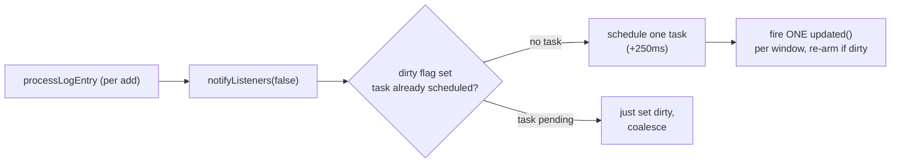

The **synchronous** path (`synchronous=true`, used by stop/clear/reset where ordering and a final flush
matter) stays **immediate** and is never debounced. The debounce uses the `Scheduler`'s
`ScheduledExecutorService` (`scheduler.getExecutorService()`); when that is `null` — the synchronous
`Scheduler` used by WAR/servlet deployments — the notifier falls back to firing immediately so
notifications are never lost.

**Correctness:** debouncing the listener path cannot affect verification or retrieval. Those operations
drain the disruptor (`drainDisruptor()`) and then query the event log directly via a `RUNNABLE` on the
consumer thread; they never wait on `notifyListeners`. On `stop()`, the log fires a final synchronous
notification (flushing latest state) and then calls `stopNotifications()`, which cancels any pending
coalesced task so it cannot leak past shutdown.

## Scheduler

The `Scheduler` manages async task execution with a `ScheduledThreadPoolExecutor`:

| Method | Purpose |
|--------|---------|
| `schedule(Runnable, Delay...)` | Execute after delay |
| `submit(Runnable)` | Execute immediately |
| `submit(HttpForwardActionResult, Runnable)` | Execute when forward result completes |
| `submit(CompletableFuture<BinaryMessage>, Runnable)` | Execute when binary result completes |

Thread names follow the pattern `MockServer-<name><N>`. The pool uses `CallerRunsPolicy` as a backpressure mechanism when saturated.

## Memory Monitoring

`MemoryMonitoring` implements both `MockServerLogListener` and `MockServerMatcherListener` to track JVM memory usage. When `outputMemoryUsageCsv` is enabled, it writes memory statistics to a CSV file every 50 updates. See [Metrics & Monitoring](metrics.md) for full details.

## Control-Plane Audit Log

**TL;DR:** an off-by-default, append-only, bounded, in-memory log of control-plane *mutations* (who/what/when/where/outcome), so MockServer can run as shared infrastructure with accountability. It is **not** data-plane traffic logging and stores **no request headers or bodies** — only redacted, structural metadata.

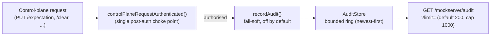

- **Why a separate store.** The audit log is a security/accountability record of *who changed mock state*, with a different lifetime, redaction policy, and retrieval surface from the data-plane event log. It deliberately reuses the proven `DriftStore` shape (a `java.util.concurrent`-locked `ArrayDeque` ring) rather than the Disruptor event log.
- **Fire point.** `HttpState.controlPlaneRequestAuthenticated` is the single choke point every control-plane operation passes through after authentication. It now calls `handler.authenticate(request)` and passes the resulting `AuthenticationResult` into `recordAudit(request, result)` in the success branch, *before* the handler executes (when auth is disabled it synthesises an authenticated-anonymous result). It is wrapped in `try/catch` and swallows all errors (TRACE-logged) so it can never throw into the request path.
- **Off by default.** When `controlPlaneAuditEnabled` is false, `recordAudit` returns immediately and the operation behaves byte-for-byte identically. Reads (GET requests and known read PUTs such as `/retrieve`, `/verify`, `/diff`) are skipped unless `controlPlaneAuditReads` is enabled — by default only mutations (and `reset`) are recorded.
- **Entry schema** (`AuditEntry`, immutable): `epochTimeMs`, `method`, `path` (control-plane path with the **query string dropped**), `operation` (logical name from the path suffix, e.g. `expectation`/`clear`/`reset`/`chaosExperiment`/`loadScenario`), `sourceAddress` (`request.getRemoteAddress()`, `"unknown"` if null), `principal`, `principalSource` (`verified-oidc`/`verified-mtls`/`verified-jwt` when an enriched handler supplied a verified principal, else the best-effort `jwt`/`mtls`/`none`), `outcome` (`AUTHORIZED` for a permitted operation, or `FORBIDDEN` when control-plane authorization — `controlPlaneAuthorizationEnabled` — denied an authenticated principal), `summary` (a fixed description chosen by `HttpState.auditSummary` from the method and operation alone — e.g. `Created or updated expectations`, else `Changed <operation>` / `Read <operation>` / `Deleted <operation>` — never a header, query value, or body).
- **Verified principal preferred; best-effort fallback.** When the configured `AuthenticationHandler` returns an `AuthenticationResult` carrying a verified principal (e.g. `OidcAuthenticationHandler` → `principalSource=verified-oidc`, principal = the signature-verified `sub`), that principal/source is recorded. Otherwise — auth disabled, or a legacy boolean-only handler — audit falls back to the **UNVERIFIED** best-effort extraction: from `Authorization: Bearer <jwt>` the payload segment is base64url-decoded and `sub` is read with **no signature verification** (`principalSource=jwt`); else the mTLS client-certificate subject CN (`principalSource=mtls`); else `anonymous`/`none`. The raw token is never stored, and any parse failure yields `anonymous`/`none`.
- **Redaction (by omission).** Entries carry no headers and no body, and the path has its query string stripped — so there is no credential-bearing free text to scrub. The `summary` is a fixed description chosen from the method and operation alone (`HttpState.auditSummary`), so safety is still by omission rather than active redaction. If a `summary` derived from a header, query value or body is ever added, scrub it through `FixtureRedactor.defaultSensitiveHeaders()` + `REDACTED_PLACEHOLDER` at that point.
- **Reset clears the audit log but keeps its own `reset` entry.** A `PUT /mockserver/reset` records its `reset` audit entry, `reset()` clears the store, and the route then re-adds that entry (handed over from `recordAudit` through a thread-local, as the route runs on the same thread), so the emptied log still shows who reset it and when. It is still an off-by-default, best-effort, in-memory log, not a tamper-evident compliance log: a reset erases every earlier entry. `HttpState.reset()` called directly (tests, the MCP `reset` tool) clears without re-adding.
- **Capacity.** The `AuditStore` singleton reads `controlPlaneAuditMaxEntries` (default 1000) **once at construction** — a fixed-capacity ring, like `DriftStore`. `HttpState.reset()` clears it alongside `DriftStore`.
- **Durable NDJSON file sink (optional).** Because the in-memory ring is bounded and is wiped by the very `reset` it records, an optional durable sink can persist the trail. Set `auditLogFile` to a path and every recorded `AuditEntry` is *also* appended — as one compact JSON object per line (newline-delimited JSON) — by `AuditFileSink`, a **separate writer** that only *observes* the same entry `recordAudit` hands the ring. The ring is unchanged: `AuditFileSink` never reads or mutates it, honouring the `AuditEntry` contract that the in-memory store must never "become a sink". The path is resolved once, on the first entry written (fixed thereafter, like the ring's capacity), and missing parent directories are created; the file is opened append-only (survives restart and `reset`). It flushes per line and is thread-safe. All open/write failures are fail-soft: a single WARN is logged and the sink self-disables — request handling and the in-memory ring are never affected. Rotation is out of scope (append-only growth); use external log rotation. Empty default = off, behaviour unchanged.

**Deferred (not in v1):** tamper-evidence; process-signal control of auditing. (Verified-principal / external-IdP integration shipped in Tier 1.5-A via `OidcAuthenticationHandler` — an OIDC-verified `sub` is recorded with `principalSource=verified-oidc`. Coarse control-plane authorization — Tier 1.5-A Wave 2 — now populates `outcome=FORBIDDEN` for denied operations; FORBIDDEN denials are always recorded when auditing is enabled, even for reads, whereas AUTHORIZED reads honour `controlPlaneAuditReads`.)

## Class Reference

| Class | File | Role |
|-------|------|------|
| `MockServerEventLog` | `mockserver-core/.../log/MockServerEventLog.java` | Central event log with Disruptor ring buffer |
| `AuditStore` | `mockserver-core/.../mock/audit/AuditStore.java` | Bounded, append-only ring of control-plane audit entries (singleton; off by default) |
| `AuditEntry` | `mockserver-core/.../mock/audit/AuditEntry.java` | Immutable, redacted control-plane mutation record (no headers/bodies) |
| `LogEntry` | `mockserver-core/.../log/model/LogEntry.java` | Event data object, implements `EventTranslator` |
| `MockServerLogger` | `mockserver-core/.../logging/MockServerLogger.java` | Logging facade, routes to event log |
| `Scheduler` | `mockserver-core/.../scheduler/Scheduler.java` | Async task execution |
| `CircularConcurrentLinkedDeque` | `mockserver-core/.../collections/CircularConcurrentLinkedDeque.java` | Bounded event store |
| `CircularPriorityQueue` | `mockserver-core/.../collections/CircularPriorityQueue.java` | Priority-sorted expectation store |
| `Verification` | `mockserver-core/.../verify/Verification.java` | Request count verification |
| `VerificationSequence` | `mockserver-core/.../verify/VerificationSequence.java` | Ordered sequence verification |
| `VerificationTimes` | `mockserver-core/.../verify/VerificationTimes.java` | Expected count constraints |
| `HttpResponseMatcher` | `mockserver-core/.../matchers/HttpResponseMatcher.java` | Response matcher for response verification (status, headers, body) |
| `BodyMatcherBuilder` | `mockserver-core/.../matchers/BodyMatcherBuilder.java` | Factory for body matchers, shared by request and response matching |
| `ExpectationFileSystemPersistence` | `mockserver-core/.../persistence/ExpectationFileSystemPersistence.java` | Write expectations to disk |
| `RecordedRequestsFileSystemPersistence` | `mockserver-core/.../persistence/RecordedRequestsFileSystemPersistence.java` | Append-only NDJSON disk capture for recorded exchanges (forwarded + mocked) |
| `RecordedTrafficImporter` | `mockserver-core/.../imports/RecordedTrafficImporter.java` | Parse a persisted NDJSON archive back into `HttpRequestAndHttpResponse` pairs for re-import (`PUT /mockserver/import?format=recording`) |
| `ExpectationFileWatcher` | `mockserver-core/.../persistence/ExpectationFileWatcher.java` | Monitor initialization files |
| `FileWatcher` | `mockserver-core/.../persistence/FileWatcher.java` | Low-level file polling |
| `MockServerEventLogNotifier` | `mockserver-core/.../mock/listeners/MockServerEventLogNotifier.java` | Observer pattern base for log |
| `MockServerMatcherNotifier` | `mockserver-core/.../mock/listeners/MockServerMatcherNotifier.java` | Observer pattern base for matchers |

## LLM Action Types and Event Logging

LLM action types (`LLM_RESPONSE`) participate in the standard expectation matching and event logging pipeline. When an `httpLlmResponse` expectation matches, the handler produces the response and the event is logged as `EXPECTATION_RESPONSE` through the Disruptor ring buffer, exactly like any other response action.

The streaming path for LLM responses delegates to `HttpSseResponseActionHandler`, which emits events through the existing SSE handler infrastructure. SSE events are logged and streamed to the dashboard via the WebSocket observer, enabling real-time visibility of LLM mock responses.

Conversation-aware matchers (`LlmConversationMatcher`) evaluate during the normal matching pipeline in `HttpRequestPropertiesMatcher`. Parse failures on the request body are fail-closed (no match) and logged at DEBUG level. Oversize bodies exceeding `maxLlmConversationBodySize` are also fail-closed and logged at INFO level.

See [LLM Mocking](llm-mocking.md) for the complete architecture.

## Custom Log Event Listener

A programmatic callback can be registered to receive every log event processed by MockServer. This is useful for integrating MockServer logging into custom monitoring, alerting, or debugging systems.

The listener is set via `Configuration.logEventListener(Consumer<LogEntry> listener)` or the convenience method `ClientAndServer.setLogEventListener(Consumer<LogEntry> listener)`.

Implementation details:
- The listener reference is stored as a `volatile Consumer<LogEntry>` on `MockServerLogger`
- It is invoked synchronously on the Disruptor consumer thread (the same thread that processes all log events)
- A slow listener will slow down all log event processing — keep the callback fast
- The listener receives the full `LogEntry` object including type, timestamp, message, and associated HTTP objects
- Setting the listener to `null` removes it
- The listener is wired in `LifeCycle` constructor, which passes the `Configuration.logEventListener()` to `MockServerLogger`

## Traffic Diff

The traffic diff feature provides field-by-field comparison of two `HttpRequest` objects, enabling regression testing by comparing recorded HTTP sessions.

### Components

- **`FieldDiff`** (`org.mockserver.mock.diff.FieldDiff`) -- a data class representing a single field-level difference. Each diff has a `field` name, optional `expectedValue` and `actualValue`, and a `DiffType` (`ADDED`, `REMOVED`, `CHANGED`, `EQUAL`). Extends `ObjectWithReflectiveEqualsHashCodeToString` for standard equals/hashCode/toString support.

- **`TrafficDiffEngine`** (`org.mockserver.mock.diff.TrafficDiffEngine`) -- compares two `HttpRequest` objects and returns `List<FieldDiff>`. Diffed fields include:
  - `method` -- HTTP method comparison
  - `path` -- request path comparison
  - `body` -- body string comparison
  - `header.<key>` -- per-header comparison (case-insensitive keys, multi-value joined with commas)
  - `queryParam.<key>` -- per-query-parameter comparison (case-insensitive keys)
  - `cookie.<key>` -- per-cookie comparison (case-insensitive keys)

### API Endpoint

`PUT /mockserver/diff` accepts a JSON body with `expected` and `actual` fields, each containing a serialized `HttpRequest`. Returns a JSON response with `diffCount`, `identical` (boolean), and a `diffs` array of `FieldDiff` objects.

Example request:
```json
{
  "expected": { "method": "GET", "path": "/api/users" },
  "actual": { "method": "POST", "path": "/api/users" }
}
```

Example response:
```json
{
  "diffCount": 1,
  "identical": false,
  "diffs": [
    { "field": "method", "expectedValue": "GET", "actualValue": "POST", "diffType": "CHANGED" }
  ]
}
```
