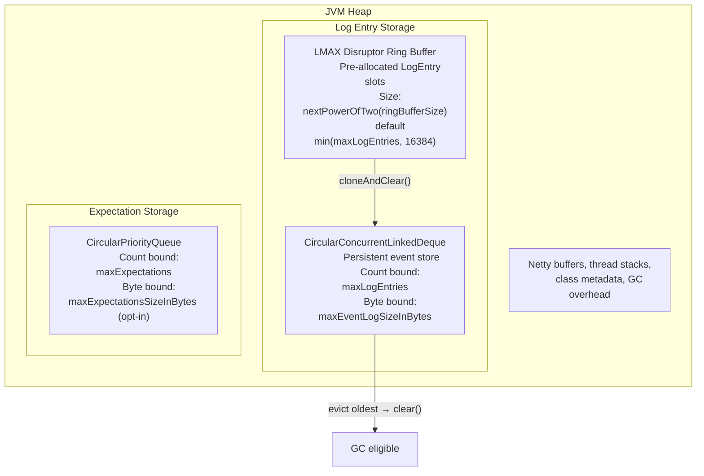
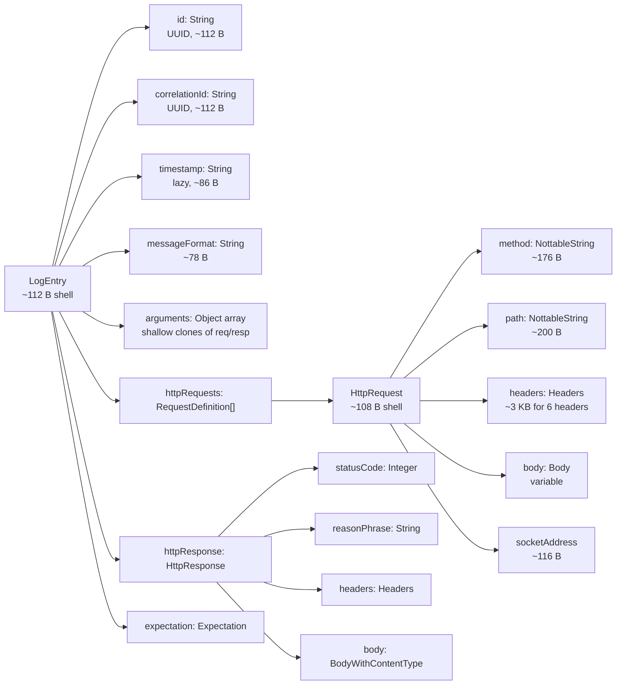

# Memory Management

This document covers how MockServer manages memory for log entries and expectations, how default limits are calculated, and how to tune them for your workload.

## Overview

MockServer stores two main categories of data in memory:

1. **Log entries** — recorded requests, matched expectations, forwarded requests, verification results, and operational log messages
2. **Expectations** — request matchers and their associated response/forward actions

Both are stored in bounded circular data structures that evict the oldest entries when full. The default size limits are computed dynamically based on available JVM heap memory.



## Default Limit Calculation

Both `maxLogEntries` and `maxExpectations` are computed from the JVM heap **ceiling** (`-Xmx`), a value fixed for the JVM's lifetime. The derived default is therefore a constant: every store constructed in the JVM gets the same capacity, and it does not vary with how much heap happened to be in use when the property was first read. (Before this was fixed, the default was derived from the *momentary free heap* — see [Timing Sensitivity](#timing-sensitivity) — which, combined with the JVM-wide caching of resolved defaults, let an unrelated heavy fixture running before the first store was constructed silently shrink the capacity of every store for the rest of the JVM.)

### Formula

```
heapAvailableInKB = maxHeap / 1024 - 20480      (maxHeap is the heap ceiling, -Xmx)

maxLogEntries          = min(heapAvailableInKB / 8, 100000)          (entry-count bound)
maxExpectations        = min(heapAvailableInKB / 10, 15000)
maxEventLogSizeInBytes = (heapAvailableInKB / 12) * 1024 at INFO/DEBUG/TRACE   (event-log byte bound; 0 when heap ceiling undefined)
                       = (heapAvailableInKB / 8)  * 1024 at WARN/ERROR/OFF
```

`maxLogEntries` and `maxEventLogSizeInBytes` are two independent bounds on the **same** event log — a count cap and a byte cap. Whichever is reached first evicts (see [Byte-Budget Eviction](#byte-budget-eviction-maxeventlogsizeinbytes)). The byte cap is derived from the same heap ceiling as the count cap; the divisor is log-level-aware (one-twelfth at `INFO`/`DEBUG`/`TRACE`, one-eighth at `WARN`/`ERROR`/`OFF`), chosen so REAL retained heap lands at about a quarter of the ceiling at either level despite the higher per-entry cost at rendering levels (see the [Formula](#formula) below). It is **on by default** so a workload with large bodies cannot exhaust the heap through a count-bounded log that cannot see entry size. Set `mockserver.maxEventLogSizeInBytes=0` to disable it and bound the log by count only.

| Parameter | Value | Purpose |
|-----------|-------|---------|
| Base memory reservation | 20 MB (20,480 KB) | Reserved for JVM internals, Netty buffers, thread stacks |
| Per-log-entry estimate | 8 KB | Estimated heap cost per stored log entry (see [analysis below](#per-log-entry-type-estimates)) |
| Per-expectation estimate | 10 KB | Estimated heap cost per stored expectation including matcher (see [analysis below](#expectation-memory-analysis)) |
| Log entry hard cap | 100,000 | Upper bound regardless of heap |
| Expectation hard cap | 15,000 | Upper bound regardless of heap |

### Source Code

| Component | File | Method |
|-----------|------|--------|
| Heap available probe | `ConfigurationProperties.java` | `heapAvailableInKB()` |
| Undefined-max-robust heap calc | `ConfigurationProperties.java` | `computeHeapAvailableInKB(long, long)` |
| Heap-based default with floor | `ConfigurationProperties.java` | `heapBasedDefaultOrFloor(long, long, int, int)` |
| `maxLogEntries()` default | `ConfigurationProperties.java` | `maxLogEntries()` |
| `maxExpectations()` default | `ConfigurationProperties.java` | `maxExpectations()` |
| Ring buffer sizing | `Configuration.java` | `ringBufferSize()` (resolves field → property → `min(maxLogEntries, 16384)`) |
| Ring buffer default resolution | `ConfigurationProperties.java` | `resolveRingBufferSize(int)` |
| `maxEventLogSizeInBytes()` default | `ConfigurationProperties.java` | `defaultMaxEventLogSizeInBytes(long, Level)` |
| Level-aware rendering check | `ConfigurationProperties.java` | `rendersEveryLogEntry(Level)` |
| Heap measurement | `MemoryMonitoring.java` | `getJVMMemory()` |

### Example: Default Limits by Heap Size

The table below shows the computed defaults for different JVM heap configurations. Because the derivation uses the heap ceiling (`-Xmx`) and not the momentary free heap, these figures depend only on `-Xmx` — they are the same whether the property is first read at a clean start or after a heavy fixture has run.

| Max Heap (`-Xmx`) | Available KB (ceiling − 20 MB) | Default `maxLogEntries` | Default `maxExpectations` |
|--------------------|-------------------------------|------------------------|--------------------------|
| 64 MB | 45,056 | 5,632 | 4,505 |
| 128 MB | 110,592 | 13,824 | 11,059 |
| 256 MB | 241,664 | 30,208 | 15,000 (capped) |
| 512 MB | 503,808 | 62,976 | 15,000 (capped) |
| 1 GB | 1,028,096 | 100,000 (capped) | 15,000 (capped) |
| 2 GB | 2,076,672 | 100,000 (capped) | 15,000 (capped) |
| 4 GB | 4,173,824 | 100,000 (capped) | 15,000 (capped) |

With the default Docker image (no `-Xmx` set, JVM defaults to ~256 MB), users get roughly **30,000 log entries**.

#### Log entries per request — budget for the expectation count, not a constant

A request does **not** cost a fixed 2-3 entries. The floor is 2-3 (`RECEIVED_REQUEST` + `EXPECTATION_MATCHED` + `EXPECTATION_RESPONSE`), but the matching scan in `RequestMatchers` also emits **one `EXPECTATION_NOT_MATCHED` entry at `INFO` for every expectation it evaluates before finding a match** (`HttpRequestPropertiesMatcher`). `INFO` is the default level, so this is on unless the level is raised.

The scan runs in sorted order and short-circuits at the first match, so the real cost per request is:

| Case | Entries per request |
|------|--------------------|
| Matches the first expectation evaluated | ~3 |
| Matches the k-th expectation evaluated | ~k + 2 |
| Matches nothing (N expectations) | ~N + 3 (N misses + `RECEIVED_REQUEST` + `NO_MATCH_RESPONSE` + the closest-match diagnostic) — or ~N + 2 when the closest-match diagnostic does not fire |

The closest-match diagnostic is the one entry worth being precise about, because it is easy to miscount in either direction. `RequestMatchers` emits exactly **one** additional `EXPECTATION_NOT_MATCHED` summary ("closest expectation matched X/Y fields"), and only when `matchedExpectation == null && closestMatchExpectation != null` at `INFO`. Its numerator is computed by re-evaluating the closest matcher without fail-fast, and that re-evaluation calls `suppressMatchResultLogging()` — so the re-evaluation itself emits nothing. That suppression is what keeps the summary from being *duplicated*; it does not remove the summary. So: one extra entry when a closest match is identified, none when there are no expectations, none below `INFO`.

With N expectations loaded, budget **up to ~N+2 entries per request**, not 2-3. A suite with 200 expectations whose requests mostly match late can burn ~200 entries per request, exhausting a 20,000-entry log in ~100 requests rather than the ~7,000-10,000 a flat 2-3 estimate implies.

Two mitigations reduce the multiplier at scale but do not remove it: above a size threshold the scan narrows to a `(method, exact-path)` candidate bucket rather than the full list, and raising the log level above `INFO` suppresses the not-matched entries entirely.

**Why this matters beyond memory:** under-sizing `maxLogEntries` causes eviction, and eviction silently destroys the evidence that verifications reason about. `verify(never())` and `verify(atMost(n))` cannot distinguish "never happened" from "evicted", so MockServer now **fails** such verifications once the log has evicted rather than passing them on an incomplete record (see [event-system.md](event-system.md) and the `failVerificationOnEvictedLog` property). Sizing this correctly is therefore a correctness concern, not only a memory one.

### Dev Mode Override

When `devMode` is enabled (`--dev` CLI flag, `-Dmockserver.devMode=true`, or `MOCKSERVER_DEV_MODE=true`), `maxLogEntries` and `maxExpectations` default to **1,000** instead of the heap-based formula above. This reduces memory usage for laptop and test-suite workloads. If either property is explicitly set (via system property, environment variable, or properties file), the explicit value takes precedence over the dev-mode default. See [configuration-reference.md](configuration-reference.md) for the full property definition.

### Shared Heap Pool

Both `maxLogEntries` and `maxExpectations` are calculated independently from the same available heap. In the worst case (both buffers completely full with average-sized entries), the combined memory usage could exceed the available heap. In practice this is mitigated by:

- The circular eviction means buffers rarely fill completely — older entries are GC'd as new ones arrive
- Most users have far fewer expectations than the cap allows
- The JVM's garbage collector reclaims memory from evicted entries promptly

On small heaps (< 256 MB), if you have both a large number of expectations AND high request volume, set explicit values for both properties rather than relying on the computed defaults.

### Timing Sensitivity

`heapAvailableInKB()` derives its budget from the heap **ceiling** (`-Xmx`), which is fixed for the JVM's lifetime, so the computed default does **not** depend on when the property is first read or on allocation history.

This was previously a real defect. The budget used to be `(maxHeap − usedHeap)`, i.e. the *momentary free heap* at first read. Because the resolved default is cached JVM-wide with no reset path, whatever the free heap looked like at that first read froze the capacity for **every** store in the JVM. A test suite whose first MockServer start happened after a heavy fixture silently got a small store for every instance — for example, at `-Xmx1g` holding ~645 MB before the first read drove the frozen `maxLogEntries` down from 100,000 to ~45,957, and a later allocation could not raise it. Under-sizing the log is not merely a memory concern: the ring overwrites silently, so a later `verify` can stop finding what it should. Sizing off the ceiling removes this dependence on allocation ordering entirely.

Note the change moves the basis from "size to currently-free heap" to "size to the heap the JVM is allowed" — the default now over-provisions slightly relative to free memory on a heavily-used small heap, deterministically. Deployments that need a smaller store set `mockserver.maxLogEntries` / `mockserver.maxExpectations` explicitly (which is unaffected by this change and always wins).

### Undefined Heap Max (JMX `getMax()` = -1)

The JMX spec allows `MemoryUsage.getMax()` to return **-1 (undefined)**. In some environments the aggregated heap-pool max reports as `-1`/`0` — verified on a **GraalVM native image** of the shaded jar, and possible in exotic JVM/WAR setups. Left unguarded, `max / 1024 - 20480` would then be a large **negative** number, driving `maxExpectations`/`maxLogEntries` to `<= 0` — so the expectation store and log ring buffer silently drop everything (`PUT /mockserver/expectation` returns 201 but the expectation never matches; "Log event ring buffer full" at startup).

`heapAvailableInKB()` is therefore robust to an undefined heap max (see `computeHeapAvailableInKB(...)`):

1. When the aggregated JMX heap max is `<= 0`, it falls back to `Runtime.maxMemory()` for the ceiling. (`Runtime.maxMemory()` may be `Long.MAX_VALUE` when the heap is unbounded — the result stays non-negative and the very large value is clamped by the `min(..., cap)` in the callers.)
2. When neither JMX nor `Runtime` yields a usable ceiling, it returns `0`.
3. The result is **floored at 0** — never negative.

The getters then apply a lower bound so a `0` heap-derived value still yields a functional store (see `heapBasedDefaultOrFloor(...)`): when `min(heapAvailableInKB / perEntryKB, cap)` computes to `<= 0`, the default falls back to the **dev-mode default** (1,000) for that property rather than `0`. Explicitly setting `mockserver.maxExpectations` / `mockserver.maxLogEntries` always overrides this.

## Log Entry Memory Analysis

### LogEntry Object Graph

Each `LogEntry` holds references to the HTTP request, response, expectation, and formatting data associated with an event.



### Field-Level Size Estimates

#### LogEntry Shell (~112 bytes)

| Field | Type | Bytes | Notes |
|-------|------|-------|-------|
| Object header | — | 16 | |
| `hashCode` | `int` | 4 | |
| `id` | `String` ref | 4 | UUID string allocated separately (~112 B) |
| `correlationId` | `String` ref | 4 | UUID string (~112 B) |
| `port` | `Integer` ref | 4 | Boxed int (16 B when non-null) |
| `logLevel` | `Level` ref | 4 | Enum singleton |
| `alwaysLog` | `boolean` | 1 | |
| `epochTime` | `long` | 8 | |
| `timestamp` | `String` ref | 4 | Lazy, ~86 B when materialised |
| `type` | `LogMessageType` ref | 4 | Enum singleton |
| `httpRequests` | `RequestDefinition[]` ref | 4 | |
| `httpUpdatedRequests` | `RequestDefinition[]` ref | 4 | Lazy shallow clone |
| `httpResponse` | `HttpResponse` ref | 4 | |
| `httpUpdatedResponse` | `HttpResponse` ref | 4 | Lazy shallow clone |
| `httpError` | `HttpError` ref | 4 | Usually null |
| `expectation` | `Expectation` ref | 4 | |
| `expectationId` | `String` ref | 4 | UUID (~112 B) |
| `throwable` | `Throwable` ref | 4 | Usually null |
| `consumer` | `Runnable` ref | 4 | Always null in stored entries |
| `deleted` | `boolean` | 1 | |
| `messageFormat` | `String` ref | 4 | ~78 B |
| `message` | `String` ref | 4 | Lazy |
| `arguments` | `Object[]` ref | 4 | |
| `because` | `String` ref | 4 | Usually null |
| *(padding)* | — | ~4 | Alignment |

#### HttpRequest (~3.5-5 KB typical)

| Component | Typical Size | Notes |
|-----------|-------------|-------|
| HttpRequest shell (19 fields) | ~108 B | Inherits from `Not` → `ObjectWithJsonToString` |
| `method` (NottableString) | ~176 B | e.g., "GET" — NottableString + value String + json String |
| `path` (NottableString) | ~200 B | e.g., "/api/users" |
| `headers` (Headers + Guava LinkedHashMultimap) | ~3,000 B | 6 typical headers (Host, Content-Type, Accept, User-Agent, Content-Length, Connection) |
| `body` (StringBody, if present) | 0-2,000 B | Null for GET; ~630 B for 100-char JSON; ~1,800 B for 500-char JSON |
| `socketAddress` | ~116 B | host String + port Integer + scheme enum |
| `localAddress` / `remoteAddress` | ~140 B | Two short strings |
| `keepAlive` / `secure` | ~32 B | Two boxed Booleans |
| **Total (GET, no body)** | **~3,800 B** | |
| **Total (POST, 200-char body)** | **~4,700 B** | |

#### NottableString (~176-284 bytes each)

Each `NottableString` wraps a value with optional negation and regex support:

| Component | Bytes |
|-----------|-------|
| Object header + 5 fields | ~48 B |
| `value` String (short, e.g., 3-15 chars) | ~64-100 B |
| `json` String (same content) | ~64-100 B |
| **Total (short value like "GET")** | **~176 B** |
| **Total (medium value like "application/json")** | **~250 B** |

#### Headers (~500 bytes per header pair)

Each header is a key-value pair of `NottableString` objects stored in a Guava `LinkedHashMultimap`:

| Component | Per-Header Bytes |
|-----------|-----------------|
| Key NottableString | ~176 B |
| Value NottableString | ~240 B |
| Multimap entry overhead | ~64 B |
| **Total per header** | **~480 B** |

The `Headers` object itself adds ~232 B of overhead (shell + multimap base structure).

#### HttpResponse (~3.5 KB typical)

| Component | Typical Size | Notes |
|-----------|-------------|-------|
| HttpResponse shell (8 fields) | ~76 B | Inherits from `Action` |
| `statusCode` (Integer) | ~16 B | Boxed int |
| `reasonPhrase` (String) | ~44 B | e.g., "OK" |
| `body` (StringBody) | ~630-1,800 B | 100-500 char JSON body |
| `headers` (Headers) | ~2,600 B | 5 typical response headers |
| **Total (200-char JSON body)** | **~3,400 B** | |

#### StringBody (~630 bytes for 100-char body)

| Component | Bytes |
|-----------|-------|
| StringBody shell (inherits 4 levels) | ~72 B |
| `value` String | ~240 B (100 chars × 2 bytes + 40 B overhead) |
| `rawBytes` byte array | ~116 B (100 bytes + 16 B header) |
| `contentType` MediaType | ~200 B |
| **Total (100-char body)** | **~630 B** |
| **Total (500-char body)** | **~1,800 B** |
| **Total (2 KB body)** | **~4,700 B** |

### Per Log Entry Type Estimates

Each log entry type populates a different subset of fields. These estimates assume a typical HTTP request with 6 headers and a small-to-medium JSON body.

| Log Entry Type | Typical Memory | What It Stores |
|---------------|----------------|----------------|
| `RECEIVED_REQUEST` (GET) | **~4.2 KB** | LogEntry shell + strings + HttpRequest |
| `RECEIVED_REQUEST` (POST, 200-char body) | **~5.2 KB** | As above + request body |
| `EXPECTATION_MATCHED` | **~7.8 KB** | LogEntry + HttpRequest + Expectation ref (shared, not copied) |
| `EXPECTATION_RESPONSE` | **~7.9 KB** | LogEntry + HttpRequest + HttpResponse |
| `FORWARDED_REQUEST` | **~10.2 KB** | LogEntry + HttpRequest + HttpResponse + Expectation wrapper |
| `NO_MATCH_RESPONSE` | **~6.5 KB** | LogEntry + HttpRequest + 404 response |
| `CREATED_EXPECTATION` | **~4.9 KB** | LogEntry + expectation definition |
| `INFO` / `WARN` / `ERROR` | **~0.5 KB** | LogEntry shell + message format + arguments |

### Per HTTP Transaction Memory

Each inbound HTTP request generates **2-3 log entries**:

| Scenario | Log Entries Created | Total Memory |
|----------|-------------------|-------------|
| GET matched to expectation | RECEIVED_REQUEST + EXPECTATION_MATCHED + EXPECTATION_RESPONSE | ~20 KB |
| POST matched to expectation | RECEIVED_REQUEST + EXPECTATION_MATCHED + EXPECTATION_RESPONSE | ~22 KB |
| Proxied/forwarded request | RECEIVED_REQUEST + FORWARDED_REQUEST | ~14 KB |
| No match (404) | RECEIVED_REQUEST + NO_MATCH_RESPONSE | ~11 KB |

### Arguments Array and Shallow Clones

The `arguments` field in `LogEntry` stores objects used for message formatting. When `setArguments()` is called with `HttpRequest` or `HttpResponse` objects, it creates **shallow clones** with updated body representations (`LogEntryBody`). These shallow clones share the same `headers`, `cookies`, `pathParameters`, and `queryStringParameters` references as the originals — only the body wrapper is replaced. This adds approximately **200-400 bytes** per clone rather than duplicating the entire request/response.

### Byte-Budget Eviction (`maxEventLogSizeInBytes`)

The `CircularConcurrentLinkedDeque` supports a second, independent bound: a **body-byte budget** supplied via the `maxEventLogSizeInBytes` configuration property. It is **on by default**, derived from the heap ceiling with a log-level-aware divisor (`(heapAvailableInKB / 12) * 1024` at `INFO`/`DEBUG`/`TRACE`; `(heapAvailableInKB / 8) * 1024` at `WARN`/`ERROR`/`OFF`); it is `0` (disabled) only when the heap ceiling is undefined (e.g. a GraalVM native image), and can be set to `0` explicitly to bound the log by entry count alone. The fractional budget leaves headroom for the expectation store, in-flight Netty buffers and JVM overhead while still bounding the body memory the count cap cannot see.

### Why it exists

`maxLogEntries` caps the *number* of log entries, not their *size*. When each entry holds a large body — for example, an LLM exchange with a multi-hundred-kilobyte tool schema or conversation context — a few thousand entries can exhaust the heap even though the count is low. The byte budget provides a size-based safety valve that the count bound cannot express.

### How it works

On construction, `MockServerEventLog` passes `maxEventLogSizeInBytes` and `LogEntry::estimatedHeapSize` (the weigher) to the 4-argument `CircularConcurrentLinkedDeque` constructor:

```java
this.eventLog = new CircularConcurrentLinkedDeque<>(
    configuration.maxLogEntries(),
    configuration.maxEventLogSizeInBytes(),
    LogEntry::estimatedHeapSize,
    LogEntry::clear);
```

On every `add()`, `evictExcessElements(weight)` runs two passes:
1. **Count pass** — evict oldest until `count < maxSize` (existing count bound).
2. **Byte pass** — when `maxBytes > 0` and a weigher is set, evict oldest until `totalBytes + incomingWeight <= maxBytes`.

A running `AtomicLong totalBytes` tracks the sum of all retained entry weights, updated on every insert and eviction. A single element whose weight alone exceeds `maxBytes` is still admitted — the byte loop stops when the deque is empty rather than rejecting the incoming entry.

### `LogEntry.estimatedHeapSize()`

The weigher used by the byte budget. Returns a **materially honest estimate** — not a precise object-graph walk — of the bytes this entry retains on the heap, counting the terms that actually dominate a retained entry rather than raw body bytes alone:

```java
public long estimatedHeapSize() {
    // per HTTP message (each httpRequests[*] and the httpResponse):
    //   getBodyAsRawBytes().length
    //   + header name/value chars + ~64 B per header value
    //   + ~1.15 KB structural overhead (model object, method/path/status, Body/Headers wrappers)
    // + ~0.9 KB per-entry overhead (LogEntry graph, id/timestamp strings, arrays, deque node)
    //   charged only when the entry carries at least one HTTP message
}
```

The value is computed lazily and cached (`-1` until first call) so the weight is identical at add-time and at evict-time. All counted terms are stable once the entry is built (bodies, headers and the fixed overheads do not change), so the value never changes after first computation — the deque relies on add-time weight matching evict-time weight exactly. It deliberately excludes the lazily-derived `httpUpdated*` copies and the rendered `arguments` (both transient, rebuilt at render time), and — importantly — the memoized `message` string (see below). A **pure diagnostic entry with no request/response** retains almost none of this graph and stays weightless, so the ring in-flight bound keeps ignoring the overwhelming majority of small control entries.

The constants were calibrated against a HotSpot **live** (retained-only) heap dump of a filled event log, read with `HprofHisto`. At a non-rendering level this brings the estimate to **within a few percent of the real retained heap** — measured at **~1.0×** the weigher total at `WARN` on 20,000 retained ~1 KB-body entries **for a body retained once** (was ~2.6× before the weigher counted structural overhead). **That figure does not generalise, and a 2026-09-19 re-measurement replaced it as the sizing basis** — see the multiples below: a decoded JSON/XML/text body is retained TWICE (the decoded `String` and the raw `byte[]`, both held by `JsonBody`/`XmlBody`/`StringBody`) and counted once, so the real multiple is ~2.0× at `WARN` for the text workloads a byte budget exists to bound. ~1.0× is the binary-body case.

**Why the default budget is still tighter at rendering levels.** The one large term the weigher does *not* count is the formatted `message`. At `INFO`/`DEBUG`/`TRACE`, `MockServerEventLog.processLogEntry()` calls `writeToSystemOut()`, which calls `entry.getMessage()` and stores the formatted string on the entry for its whole life in the deque; for a JSON-body workload that message embeds the request body as text, so it is roughly 1.5× the raw body bytes. The weigher cannot count it: it is materialized *after* the weight is first computed and memoized, and it is present only at rendering levels — counting it would either double-count against the level-aware divisor or make the weight depend on when the entry happened to be rendered, breaking the add==evict invariant. So per **counted** byte, a rendering-level entry retains more real heap. Re-measured 2026-09-19 on live heaps (`jmap -histo:live`, marginal cost per body byte): **3.02–3.04×** at `INFO` against **2.01–2.02×** at `WARN` — the text body retained twice, plus the message embedding it a third time. The asymmetry between the levels is therefore **1.5×**, not the 2× an earlier pairing assumed, which is why the rendering divisor is 1.5× the non-rendering one (one-twelfth against one-eighth) rather than double it. That equalizes real retained heap at ~a quarter of the ceiling regardless of verbosity. At `WARN`, most `INFO`-level request/response entries are never written to system-out (the `isEnabled(INFO, WARN)` guard returns false), so `getMessage()` is not called and no message is memoised.

**Behaviour change — an EXPLICITLY SET budget now retains fewer entries.** Before this honest accounting the weigher counted only body bytes, so it under-counted real retention by ~2.6× at `WARN` and ~4.8× at `INFO`. Now that it counts body + headers + structure, the running total reaches the same budget **sooner**, so a given explicit `maxEventLogSizeInBytes` retains fewer entries — the bound doing what it claims. This applies to a value you set yourself; the heap-derived DEFAULT was re-derived against the honest weigher (2026-09-19) and is sized from measurement rather than inherited from the old multiples. Size against the retained multiple, not the budget alone: the budget is the dial (`WARN` ≈ 2.0×, `INFO` ≈ 3.0× counted), and the multiple is what the heap sees. Raise `maxEventLogSizeInBytes` if you relied on the old (larger) retention for a given budget. The **same budget also bounds the ring buffer's in-flight backlog** (see [Ring In-Flight Bounding and Drops](#ring-in-flight-bounding-and-drops)), so tightening it at rendering levels constrains both the deque and the ring simultaneously.

### Body truncation (`maxLoggedBodyBytes`)

`maxLoggedBodyBytes` is a secondary in-memory valve (default 0 = unlimited). When set to a positive value, `MockServerEventLog.truncateBodiesForLog()` replaces the request and/or response body in the (already-cloned) log entry with a truncated copy before the entry is added to the deque. A `x-mockserver-body-truncated: <originalLength>` header marks the truncated copy.

Key ordering guarantee: disk capture (when `persistRecordedRequestsToDisk` is enabled) runs **before** truncation in `processLogEntry`, so the NDJSON archive always receives the full body regardless of `maxLoggedBodyBytes`. The archive captures both forwarded and mocked exchanges and outlives ring-buffer (`maxLogEntries` / `maxEventLogSizeInBytes`) eviction and process restarts; evicted entries can be brought back into the queryable in-memory log via `PUT /mockserver/import?format=recording` (`?source=disk` to read the configured path). See [event-system.md](event-system.md) for the disk-capture and re-import paths.

**Verification impact:** setting `maxLoggedBodyBytes` breaks verification against request or response body content. A verify call that matches on body returns 406 against a truncated log entry where the full body would return 202. Verification by path, method, and header is not affected. The truncation is visible in the retrieved entry and in the dashboard via the `x-mockserver-body-truncated: <originalLength>` header on the stored copy. This is by design — truncation is an intentional trade-off to reduce deque body footprint, not a silent loss.

**Does not prevent ring-backlog drops.** `truncateBodiesForLog()` runs in the LMAX Disruptor consumer, downstream of the ring. The body is already in the ring at full size before truncation can run, so truncation does not reduce the ring's in-flight byte contribution. The ring's in-flight backlog is bounded instead by the `maxEventLogSizeInBytes` budget (see [Ring In-Flight Bounding and Drops](#ring-in-flight-bounding-and-drops)).

The byte-budget weigher measures the (possibly truncated) body bytes, so truncation reduces the weight contributed to `totalBytes`.

### Ring In-Flight Bounding and Drops

The `maxEventLogSizeInBytes` budget applies in two places: the deque (retained entries) and the ring buffer's in-flight backlog (published but not yet processed entries). The ring is bounded separately because the deque budget alone cannot see it — at `INFO`, the single consumer formats every entry to system-out and is slow enough that the ring can back up and hold many full bodies before any eviction or truncation downstream can run.

**Mechanism.** `MockServerEventLog.add()` maintains an `AtomicLong inFlightBytes` counter: incremented by `LogEntry.estimatedHeapSize()` on a successful ring publish, decremented by the same amount in `processLogEntry()` when the entry is consumed. Before each publish, `wouldExceedInFlightBudget()` checks whether `inFlight + incomingWeight > maxEventLogSizeInBytes`. If it would exceed the budget (and something is already in flight — a single oversized body is always admitted into an empty backlog, mirroring the deque's one-oversized-element rule), the entry is **dropped** rather than published.

**Drops are announced, not silent.**

- A once-only `WARN` is logged on the first drop for each cause (ring full or in-flight byte budget), naming the budget, the current value, and remedies cheapest-first.
- The `mock_server_dropped_log_events` Prometheus counter increments on every drop (never reset — mirrors a Prometheus counter's monotonic semantics).
- A separate `droppedLogEventsSinceLogReset` counter tracks drops since the last `reset()` or `clear(null)` — this is the **taint** that the fail-closed verify path reads.

**Fail-closed verification.** `droppedLogEventsSinceLogReset > 0` is treated identically to a deque eviction for the purposes of upper-bound verification. A `verify` with `never()`, `atMost(n)`, `exactly(n)`, `once()`, or `between(a,b)` will **fail** once this counter is non-zero, because a dropped entry cannot be found even if the event actually happened. `atLeast(n)` and the bare `verify(request)` (which is `atLeast(1)`) are unaffected — they require presence, not absence.

**Clearing the taint.** `reset()` and `clear(null)` reset `droppedLogEventsSinceLogReset` to zero and re-arm both warn-once latches (`droppedLogEventWarned`, `inFlightBytesDropWarned`), so a suite that clears or resets between tests starts each test with a clean slate. A filtered `clear(request)` deliberately does not reset the taint, since removing some entries says nothing about the evidence already lost by prior drops.

**Budget is recomputed per `applyConfigurationCapacity()`.** When `PUT /mockserver/configuration` changes `maxEventLogSizeInBytes` at runtime, `applyConfigurationCapacity()` updates `maxInFlightBytes` alongside the deque's `maxBytes`, so both bounds track the new value. A shrink applies to every subsequent publish; it cannot evict what is already in the ring (the ring is not resizable).

## Eviction and GC

When the `CircularConcurrentLinkedDeque` reaches capacity (count or byte budget):

1. The oldest `LogEntry` is removed from the deque via an internal `pollAndEvict()`
2. `totalBytes` is decremented by the evicted entry's weight (before the callback, in case the callback clears the entry)
3. The `onEvictCallback` calls `LogEntry.clear()`, which nulls all reference fields
4. All child objects (HttpRequest, HttpResponse, Strings, etc.) become eligible for garbage collection
5. The `LogEntry` object itself is also GC-eligible (it is fully removed from the deque)

The LMAX Disruptor ring buffer pre-allocates `LogEntry` slots separately. Data is copied into ring buffer slots via `translateTo()`, then the consumer calls `cloneAndClear()` — creating a new `LogEntry` for persistent storage and clearing the ring buffer slot. Ring buffer slots do not contribute to persistent memory usage.

**O(1) capacity check (CPU).** The eviction check on every insert uses an internal `AtomicInteger` size counter, not `ConcurrentLinkedDeque.size()` (which is O(n) — it walks the whole list). This matters because the check runs on the hot path for every log entry: with the O(n) call, once the log was full each insert cost ~`O(maxLogEntries)` and CPU climbed as the log filled (GitHub issue #2329). With the counter, insert/evict/`size()` are O(1). If you change `CircularConcurrentLinkedDeque`, keep all mutators updating the counter (see its javadoc) so `size()` stays accurate.

**Eviction is announced once per server.** Eviction is silent by nature — an entry dropped is a `verify` that later fails to match — so `MockServerEventLog` emits a single WARN the first time the log evicts (latched per log instance via an `AtomicBoolean`, reset on `clear()`/`reset()`, so a busy recording proxy does not emit thousands of lines a second, and the string work stays off the steady-state path). The guard on the non-evicting hot path is one volatile read (`eventLog.getEvictedCount() > 0`), which short-circuits before any message is built. The message (`buildEvictionWarning`) names **which bound was hit** — the deque tracks byte-driven versus count-driven evictions (`getByteEvictedCount()`) — states its current value, and orders remedies cheapest-first, tailored to the bound:

- **Count bound hit:** the cheapest safe lever is to record less — lowering the log level drops the per-non-matching-expectation `EXPECTATION_NOT_MATCHED` diagnostics and cuts entries retained per request, and does **not** affect what `verify` can find, because `RECEIVED_REQUEST`/`EXPECTATION_RESPONSE`/`FORWARDED_REQUEST` (the types verification reads) are added to the log at **every** level (see `MockServerLogger.logEvent`). Then raise `maxLogEntries`, then clear/reset.
- **Byte bound hit:** the dominant cost is body bytes, which live on the always-retained entry types, so lowering the level will **not** free them — the message points at `maxLoggedBodyBytes` (truncate bodies) and `maxEventLogSizeInBytes` (raise/disable the budget) instead.

This complements `failVerificationOnEvictedLog` (default `true`), which makes upper-bound verifications (`never()`, `atMost(n)`, `exactly(n)`, `once()`, `between(a,b)`) **fail** rather than pass on discarded evidence — that failure message is likewise bound-aware. The two together cover both halves of the eviction hazard: the WARN flags coverage loss at the moment it begins, and the fail-closed verify flags it again at the point a specific verification is undermined.

**Clearing expectations does NOT clear the log.** `PUT /mockserver/clear?type=EXPECTATIONS` only clears stored expectations; the request/event log is independent and keeps its entries (bounded by `maxLogEntries` and `maxEventLogSizeInBytes`). To free the log, use `PUT /mockserver/clear?type=LOG` (or `?type=ALL`), or `PUT /mockserver/reset` (clears both). Long-running, high-throughput servers should either lower `maxLogEntries`, set a byte budget, or periodically clear the log.

## Expectation Memory Analysis

Stored expectations are heavier than they first appear because each expectation creates a matcher wrapper with sub-matchers for every field.

### Objects Per Stored Expectation

| Component | Typical Size | Notes |
|-----------|-------------|-------|
| `Expectation` shell | ~400 B | id, times, timeToLive, priority, 10 action refs |
| `HttpRequest` (matcher definition) | ~400-600 B | Usually just method + path, fewer headers than a real request |
| `HttpResponse` (response action) | ~500 B - 50+ KB | **Dominated by response body size** |
| `HttpRequestPropertiesMatcher` | ~900-1,200 B | Wrapper with sub-matchers for each field |
| Container overhead (CircularPriorityQueue) | ~350 B | ConcurrentLinkedQueue + ConcurrentSkipListSet + ConcurrentHashMap entries |
| **Total (simple, small response body)** | **~3.5 KB** | |
| **Total (medium, 2 KB response body)** | **~6-7 KB** | |
| **Total (large, 10 KB response body)** | **~15-20 KB** | |
| **Total (very large, 50 KB response body)** | **~55-75 KB** | |

The 75 KB per-expectation estimate in the default formula targets the worst case (large response bodies). For most workloads with small responses, it is 10-20x too conservative.

### Byte-Budget Eviction (`maxExpectationsSizeInBytes`)

`CircularPriorityQueue` supports an optional second bound alongside `maxExpectations`: a byte budget on the total estimated heap the stored expectations retain, weighed by `Expectation.estimatedHeapSize()`. It exists because the count cap cannot see how large an expectation is — and the dominant term is not the raw body but the **parsed JSON matcher tree**: `JsonStringMatcher.matcherJsonNode` is parsed once (lazily, on first match) and held for the expectation's life, typically 12-25x the raw JSON. `estimatedHeapSize()` estimates this from the raw bytes and body type (both fixed when the expectation is built), so the weight is stable between add-time and evict-time and never forces a parse.

Unlike the event log's byte budget, this one is **off by default (`0`) and opt-in**. Expectations are user-configured state, not observational data: evicting a log entry loses history, but evicting an expectation removes a mock the user deliberately registered. So MockServer never evicts expectations by size unless an operator sets `maxExpectationsSizeInBytes`. When set, whichever of `maxExpectations` or the byte budget is reached first evicts the oldest, lowest-priority expectations, announced once per server in the log. A reasonable starting point is about an eighth of the JVM heap (leaving room for the event log, Netty buffers and the working set).

## How the Estimates Were Chosen

The per-entry estimates (8 KB for log entries, 10 KB for expectations) are based on the field-level analysis in the sections above. They target the **realistic weighted average** for typical API mocking workloads (small-to-medium JSON bodies, a handful of headers), with a modest safety margin.

| Metric | Estimate Used | Realistic Average | Worst Case |
|--------|--------------|-------------------|------------|
| Per log entry | 8 KB | 6-8 KB | 30+ KB (large bodies) |
| Per expectation | 10 KB | 3.5-7 KB | 75+ KB (huge response bodies) |

For workloads with very large request/response bodies (>10 KB), the automatic defaults may over-provision. Users with such workloads should set explicit values using the tuning guide below, and monitor memory via `outputMemoryUsageCsv`.

**History:** Prior to this change, the estimates were 80 KB per log entry and 75 KB per expectation — values that were 10-16x too conservative for typical workloads, resulting in unnecessarily low limits and unexpected log eviction (GitHub issue [#1285](https://github.com/mock-server/mockserver-monorepo/issues/1285)).

## Tuning Guide

### Configuration Properties

| Property | System Property | Environment Variable | Default |
|----------|----------------|---------------------|---------|
| Max log entries | `mockserver.maxLogEntries` | `MOCKSERVER_MAX_LOG_ENTRIES` | `min(heapAvailableKB / 8, 100000)` |
| Max event log size (bytes) | `mockserver.maxEventLogSizeInBytes` | `MOCKSERVER_MAX_EVENT_LOG_SIZE_IN_BYTES` | `(heapAvailableKB / 12) * 1024` at `INFO`/`DEBUG`/`TRACE`; `(heapAvailableKB / 8) * 1024` at `WARN`/`ERROR`/`OFF` (see formula above; `0` only when heap ceiling is undefined) |
| Max logged body bytes | `mockserver.maxLoggedBodyBytes` | `MOCKSERVER_MAX_LOGGED_BODY_BYTES` | `0` (unlimited) |
| Ring buffer size | `mockserver.ringBufferSize` | `MOCKSERVER_RING_BUFFER_SIZE` | `min(maxLogEntries, 16384)` (rounded up to a power of two) |
| Max expectations | `mockserver.maxExpectations` | `MOCKSERVER_MAX_EXPECTATIONS` | `min(heapAvailableKB / 10, 15000)` |

Properties are resolved in this order (first match wins):

1. In-memory property cache (set programmatically)
2. Java system property (`-Dmockserver.maxLogEntries=...`)
3. Properties file (`mockserver.properties`)
4. Environment variable (`MOCKSERVER_MAX_LOG_ENTRIES`)
5. Computed default

### Choosing Values

**Step 1: Estimate your per-entry memory**

| Your workload | Estimated per-entry size | Entries per HTTP request |
|---------------|------------------------|------------------------|
| Small API responses (< 1 KB bodies) | 5-8 KB | 2-3 |
| Medium API responses (1-5 KB bodies) | 8-15 KB | 2-3 |
| Large API responses (5-50 KB bodies) | 15-50 KB | 2-3 |
| Proxy mode (request + response stored) | 10-30 KB | 2 |

**Step 2: Calculate how many entries your heap can support**

```
available_heap_MB = Xmx - (estimated_used_heap_MB + 50 MB safety margin)
entries = (available_heap_MB * 1024) / per_entry_KB
```

**Step 3: Account for entries per HTTP request**

```
http_requests_retained = entries / entries_per_request
```

### Examples

**Docker container, 256 MB heap, small API mocking:**
```
available = 256 - (80 + 50) = 126 MB = 129,024 KB
per_entry = 8 KB (typical small API)
max_log_entries = 129,024 / 8 = ~16,000
http_requests_retained = 16,000 / 3 = ~5,300
```

Set: `MOCKSERVER_MAX_LOG_ENTRIES=16000`

**Docker container, 512 MB heap, medium API responses:**
```
available = 512 - (150 + 50) = 312 MB = 319,488 KB
per_entry = 12 KB
max_log_entries = 319,488 / 12 = ~26,000
```

Set: `MOCKSERVER_MAX_LOG_ENTRIES=26000`

**Large test suite, 2 GB heap, needs to retain all requests:**
```
available = 2048 - (400 + 50) = 1,598 MB = 1,636,352 KB
per_entry = 8 KB
max_log_entries = 1,636,352 / 8 = ~204,000
```

Set: `MOCKSERVER_MAX_LOG_ENTRIES=200000`

### Memory Monitoring

Enable CSV memory tracking to observe actual memory usage under your workload:

```properties
mockserver.outputMemoryUsageCsv=true
mockserver.memoryUsageCsvDirectory=/tmp/mockserver-metrics
```

This writes a `memoryUsage_YYYY-MM-DD.csv` file every 50 log or expectation updates with columns including `eventLogSize`, `maxLogEntries`, `heapUsed`, and `heapMaxAllowed`. Use this to validate that your `maxLogEntries` setting is appropriate for your heap size.

### Ring Buffer Sizing

The LMAX Disruptor ring buffer is the **in-flight** buffer between the producing Netty I/O threads and
the single consumer thread. It is **decoupled** from `maxLogEntries` (which bounds the separate retained
event history in the `CircularConcurrentLinkedDeque`). The ring only needs to absorb short *bursts* of
log events, not hold the full retained history, so it has its own knob, `ringBufferSize`.

Its size is computed as the next power of two greater than the resolved `ringBufferSize`, which defaults
to `min(maxLogEntries, 16384)`:

| maxLogEntries | Resolved ringBufferSize (default) | Ring Buffer Size (power of two) | Ring Buffer Memory (empty LogEntry shells) |
|---------------|-----------------------------------|---------------------------------|-------------------------------------------|
| 1,000 | 1,000 | 1,024 | ~115 KB |
| 5,000 | 5,000 | 8,192 | ~920 KB |
| 10,000 | 10,000 | 16,384 | ~1.8 MB |
| 50,000 | 16,384 (capped) | 32,768 | ~3.7 MB |
| 100,000 | 16,384 (capped) | 32,768 | ~3.7 MB |

Before this decoupling, `maxLogEntries=100000` forced a 131,072-slot ring (~14.7 MB of empty `LogEntry`
shells) purely as a side effect of retention sizing; the default 16,384 ceiling caps that at ~3.7 MB
while leaving small deployments (maxLogEntries ≤ 16,384) unchanged.

The ring buffer pre-allocates `LogEntry` objects (just the shells, ~112 bytes each). These are reused via
`translateTo()` / `cloneAndClear()` and do not hold persistent data. The ring buffer memory is a fixed
overhead that does not grow with request volume.

#### Why a separate `ringBufferSize` knob?

The ring buffer absorbs the **rate gap** between producers and the single consumer thread — it must be
large enough that bursts of concurrent log writes do not overflow it (an overflow drops the event and
increments `mock_server_dropped_log_events`; see [event-system.md](event-system.md)). That gap is a
function of *throughput*, not of *how long you retain history*. Slaving the ring to `maxLogEntries`
therefore over-provisioned the ring for high-retention/low-burst deployments.

- **Default `min(maxLogEntries, 16384)`** — small deployments keep their previous ring exactly; large
  retention settings stop inflating the ring.
- **Raise it** only if you observe dropped log events (`mock_server_dropped_log_events` non-zero and
  growing) under sustained extreme load.
- **Lower it** to shave fixed memory if you have a low-throughput, high-retention workload.

Configure it via `mockserver.ringBufferSize`, the `MOCKSERVER_RING_BUFFER_SIZE` environment variable, or
`Configuration.ringBufferSize(int)`. The value is rounded up to the next power of two (a Disruptor
requirement). The `nextPowerOfTwo()` method in `Configuration.java` supports values up to
`2^30 = 1,073,741,824`.
