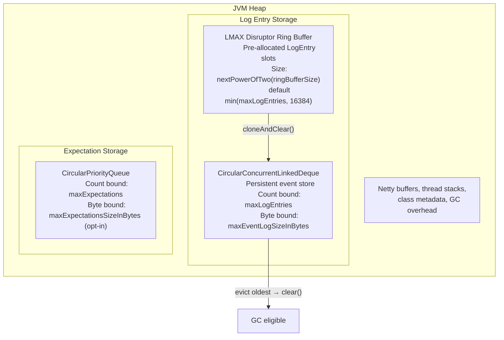
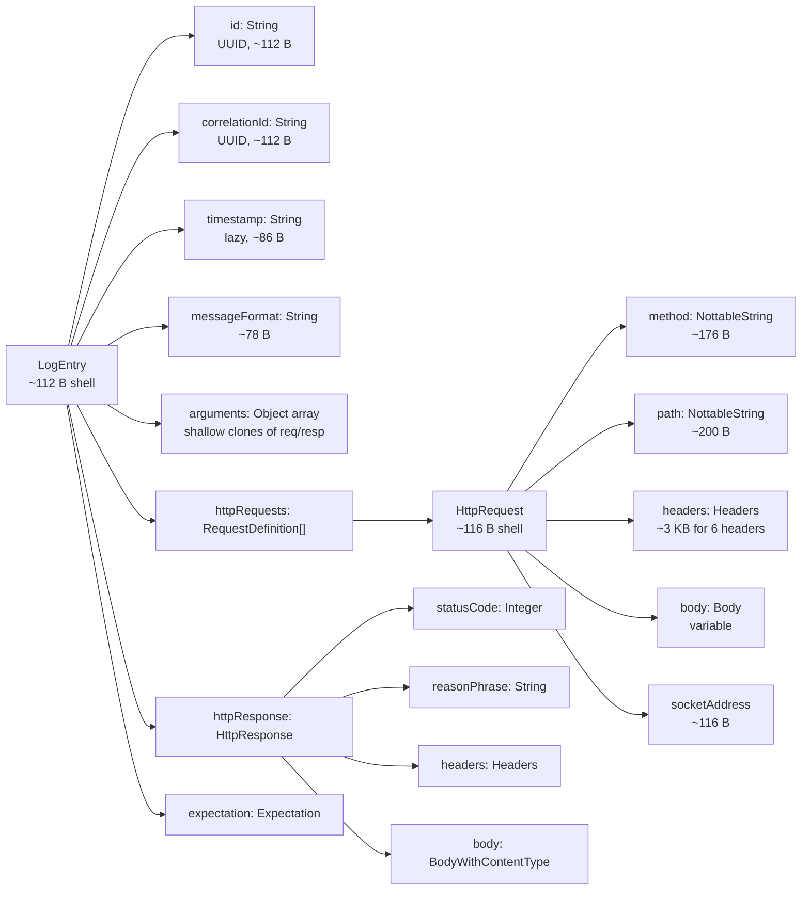

# Memory Management

This document covers how MockServer manages memory for log entries and expectations, how default limits are calculated, and how to tune them for your workload.

## Overview

MockServer stores two main categories of data in memory:

1. **Log entries** — recorded requests, matched expectations, forwarded requests, verification results, and operational log messages
2. **Expectations** — request matchers and their associated response/forward actions

Both are stored in bounded circular data structures that evict the oldest entries when full. The default size limits are computed dynamically based on available JVM heap memory.


```mermaid
graph TB
    subgraph "JVM Heap"
        subgraph "Log Entry Storage"
            RB["LMAX Disruptor Ring Buffer
            Pre-allocated LogEntry slots
            Size: nextPowerOfTwo(ringBufferSize)
            default min(maxLogEntries, 16384)"]
            EL["CircularConcurrentLinkedDeque
            Persistent event store
            Count bound: maxLogEntries
            Byte bound: maxEventLogSizeInBytes"]
        end
        subgraph "Expectation Storage"
            PQ["CircularPriorityQueue
            Count bound: maxExpectations
            Byte bound: maxExpectationsSizeInBytes (opt-in)"]
        end
        OTHER["Netty buffers, thread stacks,
        class metadata, GC overhead"]
    end

    RB -->|"cloneAndClear()"| EL
    EL -->|"evict oldest → clear()"| GC[GC eligible]
```

## Default Limit Calculation

Both `maxLogEntries` and `maxExpectations` are computed from the JVM heap **ceiling** (`-Xmx`), a value fixed for the JVM's lifetime. The derived default is therefore a constant: every store constructed in the JVM gets the same capacity, and it does not vary with how much heap happened to be in use when the property was first read. (Before this was fixed, the default was derived from the *momentary free heap* — see [Timing Sensitivity](#timing-sensitivity) — which, combined with the JVM-wide caching of resolved defaults, let an unrelated heavy fixture running before the first store was constructed silently shrink the capacity of every store for the rest of the JVM.)

### Formula

```
heapAvailableInKB = maxHeap / 1024 - 20480      (maxHeap is the heap ceiling the JVM reports, see below)

maxLogEntries          = min(heapAvailableInKB / 8, 250000)          (entry-count bound)
maxExpectations        = min(heapAvailableInKB / 10, 15000)
maxEventLogSizeInBytes = (heapAvailableInKB / 12) * 1024 at INFO/DEBUG/TRACE   (retained-entry byte bound; 0 when heap ceiling undefined)
                       = (heapAvailableInKB / 20) * 1024 at WARN/ERROR/OFF
in-flight byte cap     = max(maxEventLogSizeInBytes, (heapAvailableInKB / 12) * 1024) at INFO/DEBUG/TRACE   (ring backlog; 0 when maxEventLogSizeInBytes is 0)
                       = max(maxEventLogSizeInBytes, (heapAvailableInKB / 7)  * 1024) at WARN/ERROR/OFF
```

`maxLogEntries` and `maxEventLogSizeInBytes` are two independent bounds on the **same** event log — a count cap and a byte cap. Whichever is reached first evicts (see [Byte-Budget Eviction](#byte-budget-eviction-maxeventlogsizeinbytes)). The byte cap is derived from the same heap ceiling as the count cap, with a log-level-aware divisor: one-twentieth at `WARN`/`ERROR`/`OFF`, so retained entries do not outlive a young-GC cycle under load (see [Retention and young-GC promotion](#retention-and-young-gc-promotion)), and one-twelfth at `INFO`/`DEBUG`/`TRACE`. Entries still waiting in the ring are bounded by a separate in-flight cap that is never smaller than the retention budget (one-seventh at `WARN`/`ERROR`/`OFF`, one-twelfth at `INFO`/`DEBUG`/`TRACE` by default), so a small retention budget does not drop events during a burst. Together they keep the whole log at or below about a quarter of the ceiling at either level, even while overloaded (see [Validation at the current divisors](#validation-at-the-current-divisors)). It is **on by default** so a workload with large bodies cannot exhaust the heap through a count-bounded log that cannot see entry size. Set `mockserver.maxEventLogSizeInBytes=0` to disable it and bound the log by count only.

| Parameter | Value | Purpose |
|-----------|-------|---------|
| Base memory reservation | 20 MB (20,480 KB) | Reserved for JVM internals, Netty buffers, thread stacks |
| Per-log-entry estimate | 8 KB | Estimated heap cost per stored log entry (see [analysis below](#per-log-entry-type-estimates)) |
| Per-expectation estimate | 10 KB | Estimated heap cost per stored expectation including matcher (see [analysis below](#expectation-memory-analysis)) |
| Log entry hard cap | 250,000 | Upper bound regardless of heap |
| Expectation hard cap | 15,000 | Upper bound regardless of heap |

### Source Code

| Component | File | Method |
|-----------|------|--------|
| Heap available probe | `ConfigurationProperties.java` | `heapAvailableInKB()` |
| Undefined-max-robust heap calc | `ConfigurationProperties.java` | `computeHeapAvailableInKB(long, long)` |
| Heap-based default with floor | `ConfigurationProperties.java` | `heapBasedDefaultOrFloor(long, long, int, int)` |
| `maxLogEntries()` default | `ConfigurationProperties.java` | `maxLogEntries()` |
| `maxExpectations()` default | `ConfigurationProperties.java` | `maxExpectations()` |
| Ring buffer sizing | `Configuration.java` | `ringBufferSize()` (resolves field → property → `min(maxLogEntries, 16384)`) |
| Ring buffer default resolution | `ConfigurationProperties.java` | `resolveRingBufferSize(int)` |
| `maxEventLogSizeInBytes()` default | `ConfigurationProperties.java` | `defaultMaxEventLogSizeInBytes(long, Level)` |
| Level-aware rendering check | `ConfigurationProperties.java` | `rendersEveryLogEntry(Level)` |
| Heap ceiling source | `ConfigurationProperties.java` | `heapAvailableInKB()` (`MemoryMXBean` heap max and `Runtime.maxMemory()`) |

### Example: Default Limits by Heap Size

The table below shows the computed defaults for different JVM heap configurations. Because the derivation uses the heap ceiling (`-Xmx`) and not the momentary free heap, these figures depend only on `-Xmx` — they are the same whether the property is first read at a clean start or after a heavy fixture has run.

| Max Heap (`-Xmx`) | Available KB (ceiling − 20 MB) | Default `maxLogEntries` | Default `maxExpectations` | Default `maxEventLogSizeInBytes` at `WARN`/`ERROR`/`OFF` (÷20) | Default `maxEventLogSizeInBytes` at `INFO`/`DEBUG`/`TRACE` (÷12) | Default in-flight cap at `WARN`/`ERROR`/`OFF` (÷7) | Default in-flight cap at `INFO`/`DEBUG`/`TRACE` (÷12) |
|---|---|---|---|---|---|---|---|
| 64 MB | 45,056 | 5,632 | 4,505 | 2,306,048 (2.2 MiB) | 3,844,096 (3.7 MiB) | 6,590,464 (6.3 MiB) | 3,844,096 (3.7 MiB) |
| 128 MB | 110,592 | 13,824 | 11,059 | 5,661,696 (5.4 MiB) | 9,437,184 (9.0 MiB) | 16,177,152 (15.4 MiB) | 9,437,184 (9.0 MiB) |
| 256 MB | 241,664 | 30,208 | 15,000 (capped) | 12,372,992 (11.8 MiB) | 20,621,312 (19.7 MiB) | 35,351,552 (33.7 MiB) | 20,621,312 (19.7 MiB) |
| 512 MB | 503,808 | 62,976 | 15,000 (capped) | 25,794,560 (24.6 MiB) | 42,991,616 (41.0 MiB) | 73,699,328 (70.3 MiB) | 42,991,616 (41.0 MiB) |
| 1 GB | 1,028,096 | 128,512 | 15,000 (capped) | 52,637,696 (50.2 MiB) | 87,730,176 (83.7 MiB) | 150,394,880 (143.4 MiB) | 87,730,176 (83.7 MiB) |
| 2 GB | 2,076,672 | 250,000 (capped) | 15,000 (capped) | 106,324,992 (101.4 MiB) | 177,209,344 (169.0 MiB) | 303,787,008 (289.7 MiB) | 177,209,344 (169.0 MiB) |
| 4 GB | 4,173,824 | 250,000 (capped) | 15,000 (capped) | 213,699,584 (203.8 MiB) | 356,165,632 (339.7 MiB) | 610,570,240 (582.3 MiB) | 356,165,632 (339.7 MiB) |

The Docker images size the heap at 45% of the container memory limit (`-XX:MaxRAMPercentage=45.0`, unless `-Xmx` is set), so a 512 MiB, 1 GiB, 2 GiB or 4 GiB container gets a 232 MiB, 462 MiB, 922 MiB or 1,844 MiB heap, giving `maxLogEntries` of 27,136, 56,576, 115,456 or 233,472 — roughly **27,000 log entries** at the 512 MiB floor (768 MiB for a `-clustered` node with the Infinispan backend) — and an `INFO` `maxEventLogSizeInBytes` of 17.7, 36.8, 75.2 or 152.0 MiB. See [docker.md → Heap Cap](../infrastructure/docker.md#heap-cap).

#### Log entries per request — budget for the expectation count, not a constant

A request does **not** cost a fixed 2-3 entries. The floor is 2-3 (`RECEIVED_REQUEST` + `EXPECTATION_MATCHED` + `EXPECTATION_RESPONSE`), but the matching scan in `RequestMatchers` also emits **one `EXPECTATION_NOT_MATCHED` entry at `INFO` for every expectation it evaluates before finding a match** (`HttpRequestPropertiesMatcher`). `INFO` is the default level, so this is on unless the level is raised.

The scan runs in sorted order and short-circuits at the first match, so the real cost per request is:

| Case | Entries per request |
|------|--------------------|
| Matches the first expectation evaluated | ~3 |
| Matches the k-th expectation evaluated | ~k + 2 |
| Matches nothing (N expectations) | ~N + 3 (N misses + `RECEIVED_REQUEST` + `NO_MATCH_RESPONSE` + the closest-match diagnostic) — or ~N + 2 when the closest-match diagnostic does not fire |

The closest-match diagnostic is the one entry worth being precise about, because it is easy to miscount in either direction. `RequestMatchers` emits exactly **one** additional `EXPECTATION_NOT_MATCHED` summary ("closest expectation matched X/Y fields"), and only when `matchedExpectation == null && closestMatchExpectation != null` at `INFO`. Its numerator is computed by re-evaluating the closest matcher without fail-fast, and that re-evaluation calls `suppressMatchResultLogging()` — so the re-evaluation itself emits nothing. That suppression is what keeps the summary from being *duplicated*; it does not remove the summary. So: one extra entry when a closest match is identified, none when there are no expectations, none below `INFO`.

With N expectations loaded, budget **up to ~N+2 entries per request**, not 2-3. A suite with 200 expectations whose requests mostly match late can burn ~200 entries per request, exhausting a 20,000-entry log in ~100 requests rather than the ~7,000-10,000 a flat 2-3 estimate implies.

Two mitigations reduce the multiplier at scale but do not remove it: above a size threshold the scan narrows to a `(method, exact-path)` candidate bucket rather than the full list, and raising the log level above `INFO` suppresses the not-matched entries entirely.

**Why this matters beyond memory:** under-sizing `maxLogEntries` causes eviction, and eviction silently destroys the evidence that verifications reason about. `verify(never())` and `verify(atMost(n))` cannot distinguish "never happened" from "evicted", so MockServer now **fails** such verifications once the log has evicted rather than passing them on an incomplete record (see [event-system.md](event-system.md) and the `failVerificationOnEvictedLog` property). Sizing this correctly is therefore a correctness concern, not only a memory one.

### Dev Mode Override

When `devMode` is enabled (`--dev` CLI flag, `-Dmockserver.devMode=true`, or `MOCKSERVER_DEV_MODE=true`), `maxLogEntries` and `maxExpectations` default to **1,000** instead of the heap-based formula above. This reduces memory usage for laptop and test-suite workloads. If either property is explicitly set (via system property, environment variable, or properties file), the explicit value takes precedence over the dev-mode default. See [configuration-reference.md](configuration-reference.md) for the full property definition.

### Shared Heap Pool

Both `maxLogEntries` and `maxExpectations` are calculated independently from the same available heap. In the worst case (both buffers completely full with average-sized entries), the combined memory usage could exceed the available heap. In practice this is mitigated by:

- The circular eviction means buffers rarely fill completely — older entries are GC'd as new ones arrive
- Most users have far fewer expectations than the cap allows
- The JVM's garbage collector reclaims memory from evicted entries promptly

On small heaps (< 256 MB), if you have both a large number of expectations AND high request volume, set explicit values for both properties rather than relying on the computed defaults.

### Netty Buffer Memory

Network buffers live outside the stores above, in Netty's pooled allocator. All request/response traffic — including HTTP/2 stream channels, the CONNECT/SOCKS relay and HTTP/3 request streams — uses the same `PooledByteBufAllocator` (see [netty-pipeline.md → ByteBuf Allocator](netty-pipeline.md#bytebuf-allocator)). Before this was pinned, HTTP/2 stream channels used Netty 4.2's adaptive allocator, so an HTTP/2 workload kept two separate buffer pools. Measured with the equivalent JVM-wide setting (`-Dio.netty.allocator.type=pooled`), a single pooled allocator lowered the HTTP/2 benchmark's maximum heap by about 34 MB with throughput and latency unchanged.

#### Direct-memory limit

**Whenever MockServer runs as its own process via the CLI (the jar, the Docker images, the forked Maven
plugin and the launchers), Netty's direct
memory is capped at a quarter of the maximum heap, at least 64 MiB and never more than the heap.** So the
heap plus Netty's buffers can reach 1.25× the heap rather than 2×: at a 232 MiB heap (a 512 MiB container
at the images' 45%) the cap is 64 MiB, and at 462 MiB (1 GiB) it is 115 MiB.

| Setting | Effect |
|---------|--------|
| Nothing set (default) | `org.mockserver.cli.Main` sets Netty's property to `max(64 MiB, heap / 4)`, capped at the heap, in its first static initialiser — Netty reads the property once, when it first initialises. Start-up logs a line starting `netty direct memory limit` at `INFO`, with the limit and whether it is the default or explicit |
| `-Dio.netty.maxDirectMemory=<bytes>` | Used as given; MockServer does not override it. `-1` restores Netty's own default (the JVM limit below). The shaded jar's relocated Netty reads `shaded_package.io.netty.maxDirectMemory` (shade rewrites the literal), so MockServer copies a user's value to that name; the plain name is built at runtime so shade cannot rewrite it (`assert-shaded-direct-memory-property.sh` checks the shaded jar) |
| `-XX:MaxDirectMemorySize=<size>` (command line or `JAVA_TOOL_OPTIONS`) | Netty uses it; MockServer does not set a limit of its own |
| Embedded (`ClientAndServer`, JUnit, Spring) | Unchanged: the process is the test JVM's, not MockServer's |

**Why.** Netty's limit otherwise defaults to the JVM's `MaxDirectMemorySize`, which defaults to the
maximum heap, and nothing stops a workload filling both. Measured Netty direct use under small-body load
stays near 8 MiB (two pooled arenas of 4 MiB chunks on one core); what grows it is buffers held per
connection. The dominant case — every slow reader holding a direct copy of its whole response — is
removed by `PacedLargeWriteHandler` (see
[netty-pipeline.md → Outbound Buffering and Backpressure](netty-pipeline.md#outbound-buffering-and-backpressure)).
The cap covers what remains, and each of these holds a whole body in direct memory until it is done:

- request bodies being aggregated (each connection holds its partial body, up to `maxRequestBodySize`);
- forwarded and proxied responses being aggregated (up to `maxResponseBodySize`, 50 MiB by default);
- responses relayed through a CONNECT/SOCKS tunnel, aggregated on the loopback leg before being written
  to the client.

Every server and forward-client aggregator is built by `HttpObjectAggregators`, which sizes the
aggregator's component limit to `max(1,024, maxContentLength / 1 KiB)` (10,240 for the 10 MiB request
limit, 51,200 for the 50 MiB response limit). Past its limit a `CompositeByteBuf` consolidates everything so
far into one new direct buffer, so with Netty's default of 1,024 collecting a large body briefly needed
about twice its size: a 49 MiB forward failed at a 64 MiB cap and fits now
(`DirectMemoryLimitForwardIntegrationTest`). The limit is not unbounded because each component costs about
110 bytes of heap, and a client can send one-byte chunks: unbounded, 1.5 million of them (9 MB on the wire)
pinned 163 MB of heap. A body whose chunks average under 1 KiB still reaches the limit
(`HttpObjectAggregatorsTest`); there the aggregator merges only the chunks added since its last merge. All of
these aggregators are `CoalescingHttpObjectAggregator`s in `mergeNewComponentsOnly` mode: the HTTP/1.1 server's, the
forward client's HTTP/1.1 one and its own HTTP/2 stream's, and both legs of the CONNECT relay. Netty's consolidation of the whole body each time copied about N² / (2 × limit) bytes
for a body of one-byte chunks: about 5.4 GB for a 10 MiB request and 26.8 GB for a 50 MiB forwarded response. Now
each byte is copied once, plus the whole body again each time half the limit is merged components, which happens
only at limits below about 2 MiB (1.5× the body for one-byte chunks at 1 MiB). The merged components count as one
towards the limit, as the single component Netty's consolidation leaves does, so each merge falls on the chunk where
Netty would have copied the whole body and copies at most that: for any mix of chunk sizes the merges never copy
more than Netty's consolidations, and the copies that free mostly unused reads (below) add at most the body again
to what is copied and one read to what is held (`MergeNewComponentsOnlyNettyDifferentialTest`). Counting each merged component
instead let the merges drift earlier than Netty's, and a 10 MiB-limit body that turned from one-byte to
1,000-byte chunks just before Netty's third consolidation was copied 10.3 MB where Netty copied 31 KB. A merge
releases every chunk it covers, so what is held at once stays within twice the body, the old worst case, plus the
framing of socket reads still holding unmerged chunks (`Http1ChunkComponentLimitTest`).

These aggregators deliberately do not copy runs of tiny chunks into blocks as HTTP/2 streams do (below). A chunk
is a slice of a socket read, and the read stays allocated while any chunk in it is held, so where larger chunks keep
the reads alive a block copy only adds memory. Measured through the real HTTP/1.1 codec, with reads of 64 KiB:
blocks held up to 2.9× the body at a 10 MiB limit (64 chunks of 1,023 bytes and a 1 KiB chunk, then four times 15
one-byte chunks and a 1 KiB chunk, repeated), against 1.1× for Netty's aggregator and for merging alone. The
worst case left is the component heap itself: about 1.2 MB per HTTP/1.1 connection at the 10 MiB
`maxRequestBodySize` (10,240 components, plus up to 1,023 merged ones, × ~110 B). The chunks a body holds from a
read it uses under half of are merged when it moves on to the next read (see **Read buffers a body pins** below), so
padding each read with a chunk extension no longer pins it. Where a merge at the limit leaves part of a read's tiny
chunks unmerged, that part is copied again: a body of one-byte chunks in 64 KiB reads is copied about 1.06 times,
not once (`Http1ChunkComponentLimitTest`).

**HTTP/2 and HTTP/3 request streams** get a tenth of that limit, never below 1,024
(`HttpObjectAggregators.streamComponentLimit`: 1,024 at the 10 MiB default, 6,553 at 64 MiB), because one
connection carries up to 100 concurrent streams (`HTTP2_MAX_CONCURRENT_STREAMS`; for HTTP/3,
`http3InitialMaxStreamsBidirectional`, default 100). A connection's worst case is therefore about 11 MB
(100 × 1,024 × ~110 B) on either protocol at the default, instead of ~110 MB; above 10 MiB it is
100 × `maxRequestBodySize` / 10 KiB × ~110 B, ten times the HTTP/1.1 figure. The total grows with the number
of connections, which only `maxInboundConnections` caps (off by default — see [Connection Memory](#connection-memory)).

- **HTTP/2** — each DATA frame becomes one component. The divisor stays below 16, so a full body in
  16 KiB frames (HTTP/2's default maximum frame size) fits without a copy at any `maxRequestBodySize`: 4,096
  frames at 64 MiB stay 4,096 components (`Http2StreamComponentLimitTest`). The stream aggregator is a
  `CoalescingHttpObjectAggregator` (`HttpObjectAggregators.streamHttpObjectAggregator`). Without it a body of
  one-byte frames was consolidated whole every 1,024 frames, about N² / 2,048 bytes of copying (53.7 GB for
  10 MiB). It now:
  - keeps the first 64 components, every frame of 1 KiB or more, and any run of fewer than 16 consecutive
    frames under 1 KiB (a frame cut short by the flow-control window, say) as they arrive, uncopied;
  - at the 16th frame of a run, copies the run into the free tail of the current 16 KiB block (a new one
    once it is full; the current block is kept when a larger frame interrupts the run), so each such byte is
    copied into a block once, a body of one-byte frames needs one component per 16 KiB, and at most one block per stream is
    part-used (at most 16 KiB unused);
  - once the body passes the limit, at the same frame where Netty would have consolidated the whole body,
    merges only the components added since its last merge (the HTTP/3 rule below), so the merges copy each
    byte at most once more. For this it replaces the aggregator's composite buffer with one that has no limit
    of its own (one extra empty composite per request, about 170 bytes of heap).

  Bytes copied, old → new (`CoalescingHttpObjectAggregatorTest`, and a counting allocator over the same
  aggregators at the 10 MiB default): 10 MiB in one-byte frames 53.7 GB → 10 MiB; in 100-byte frames
  538 MB → 10 MiB; in 1 KiB frames 47 MB → 10 MiB; 8 KiB frames, 16 KiB frames, 16 KiB frames with a
  16,383-byte frame every fourth, and one byte alternating with 16 KiB are unchanged (8.4 MB, 0, 0, 8.4 MB:
  the first merge copies the body so far, as Netty's consolidation did). Mixes of runs and larger frames cost
  more, for two reasons: the first merge still copies the whole body so far, and with fewer components it comes
  later, at a larger body; and bytes copied into a block are copied again when a merge covers them. Across 270
  mixes (runs of 15–32 frames of 1, 100 or 1,023 bytes between 1,023-byte, 1 KiB or 16 KiB frames, at 256 KiB
  to 64 MiB limits) at most 1.8× the body is copied, against up to 160× (and 5,120× for one-byte frames) before,
  and the most held at once (body pieces, blocks and merged copies) is at most 2.0× the body, the old worst
  case; 44 of those mixes peak higher than before (for example 1.83× against 1.00× for runs of 31 one-byte
  frames between 16 KiB frames at a 1 MiB limit). `CoalescingHttpObjectAggregatorTest` bounds copying and the
  peak to twice the body plus one block for runs of 100-byte frames between 1 KiB frames, and the blocks and
  merged copies to the body plus 32 KiB for runs of one-byte frames between 1 KiB frames at a 512 KiB limit. These
  peaks count each frame as a buffer of its own.

  **Through the real connection codec** a DATA frame is a retained slice of the read it arrived in, so the read stays
  allocated while any frame in it, from any stream, is held, and the frame decoder joins a frame cut by a read
  into a buffer grown in powers of two. Measured with `Http2ConnectionMemoryHarness` (`Http2FrameCodec` with
  production's settings, `Http2MultiplexHandler`, the real stream chain, a client honouring flow control, reads
  sized by Netty's adaptive read allocator, and every read, decoder buffer, block and merge counted, capacity growth
  included; `Http2StreamPeakHeldMeasurement` prints the table on demand):
  - an upload in 16 KiB frames, copied by nothing, holds 1.5–1.75× its size under every aggregator; one whose every
    fourth frame the flow-control window cuts a byte short holds 1.6–1.7× under Netty's aggregator and 1.4–1.5×
    under the others, which copy 0.18–0.25× of it (the decoder joins a frame cut by a read into a buffer twice its
    size, under half used when that frame is the short one, so it is copied: see **Read buffers a body pins**);
  - across 70 combinations of 19 uploads (one and four streams of 1-, 100- and 1,023-byte frames, mixes, a 16 KiB-
    frame stream sharing reads with tiny-frame streams, 256 KiB to 10 MiB per stream) with reads of 64 B to 64 KiB,
    the blocks peak at 2.8× the body (runs of one-byte frames between 16 KiB frames), merging alone
    (`mergeNewComponentsOnly`) at 2.0× and Netty's aggregator at 5.3×;
  - the blocks and the copying of mostly unused reads (below) free the reads small frames pin: 1.0–1.1× against
    2.5–3.0× for 1,023-byte frames, 1.1–1.3× against 1.6–5.3× beside a 16 KiB-frame stream, 1.1–1.6× against
    1.8–1.9× for runs of 100-byte frames between 1 KiB frames. They hold more than Netty's aggregator where larger
    frames of the same stream keep their buffers at least half used, and so kept, while the runs of one-byte frames
    between them are copied into blocks: 2.8× against 1.5× for runs of 31 one-byte frames between 16 KiB frames (a
    16 KiB frame cut by a read is joined into a 32 KiB buffer), 1.6–2.0× against 1.5–1.6× for runs of 15 one-byte
    frames between 1 KiB frames at reads of 16 KiB or less. Copying is at most 1.8× the body (1,023-byte frames then
    runs of one-byte frames, at reads of 1 KiB or less);
  - merging alone holds slightly more than Netty's aggregator in four of the 70 combinations (at most 2.0× against
    1.5×, runs of one-byte frames between 16 KiB frames at 64-byte reads), and copies a 10 MiB body of one-byte
    frames 8.3–10.2× (the whole-body restart every 512 merges, about every 512 KiB, at the stream limit), against
    1.0× for the blocks. So streams keep the blocks. The pooled allocator, its live buffers' capacities sampled at every
    allocation, gave the same peaks at 64 KiB reads before that copy (66 of 69 rows identical, the other 3 within 0.2%); that counts
    each buffer's requested capacity, not the pool's size-class rounding.

  These figures are for cleartext h2c: over TLS a DATA frame is a slice of `SslHandler`'s output buffers instead of
  the reads, which the copy below checks the same way (it unwraps to whatever buffer a frame slices) but which was not
  measured. `Http2StreamPeakHeldTest` pins both sides through the codec.

  The forward client's streams the upstream opens (below) coalesce the same way.

**Read buffers a body pins** (plan item 67). A piece of a body is usually a slice of a socket read, of a decoder's
cumulation, or of `SslHandler`'s output, and the whole buffer stays allocated while any slice of it is held. A client
can put each small piece of a body in a read filled with other, completed, requests (HTTP/2), or pad each chunk-size
line with a chunk extension (HTTP/1.1), up to 8,192 bytes since plan item 74 and unbounded until then. Before this
fix, 1,100 HTTP/2 frames of 1 KiB, each in its own read of about 32 KiB, held 29 MB for a 1.1 MB body, 11,000 one-byte
chunks with 60 KiB extensions held 671 MB (measured on the bare codec, before item 74's limit), and a connection's
streams could hold about 100 × 1,025 × 64 KiB ≈ 6.3 GiB (6.7 GB), held while the streams stay open. Every
`CoalescingHttpObjectAggregator` (HTTP/2 streams, the forward client's HTTP/1.1 and HTTP/2 streams, the HTTP/1.1
server and both legs of the CONNECT relay) now counts, per buffer, the
pieces and bytes it holds; when a body moves on to a new buffer, the pieces it holds from the previous one are copied
into buffers of their own if they are under half that buffer, and so are the pieces left of a buffer once a block
copy takes some of them leaves it under half used (a read held just over half by a 1 B, a 1,039 B and fifteen
1,023-byte frames, whose run of 16 the next read completes, otherwise stayed pinned at 1,040 B used: 2.6× the body
through the codec, against 1.75× under Netty's aggregator). On an HTTP/2 stream, pieces just before the one that
arrived go into the stream's current block instead (a new block is no larger than the body so far, up to 16 KiB), so
a later run copy does not copy them again and a short body is not given a whole block. Every buffer a body pins is
then at least half used,
except the one it is reading and one part-used block, so it holds at most about twice its body plus one read and
16 KiB, and briefly a further copy while a merge at the component limit is made. The one it is reading can be the
frame decoder's buffer that joins a frame cut by a read, grown in powers of two to hold it. A body whose pieces fill
their reads is never copied. Each buffer is counted under what it unwraps to, as its slices are: the allocator returns
a buffer Netty's leak detector samples (one in 128 at the default level, every one at `paranoid`) inside a wrapper
that a composite's components unwrap past (`CoalescingHttpObjectAggregatorLeakAwareBufferTest`). Measured through the real codecs (`Http2StreamPeakHeldTest`, `Http1ChunkPinningTest`):

| Shape | Netty's aggregator | Now |
|---|---|---|
| 1,100 HTTP/2 frames of 1 KiB, one per ~32 KiB read | 29 MB | 1.25 MB |
| 15 one-byte frames and one of 1 KiB, one per read | 28 MB | 0.20 MB |
| 20 streams × 100 frames of 4,097 B, one per read | 54 MB | 8.9 MB |
| 20 streams × 60 one-byte frames, one per read, no other traffic | 84 KB (6.7× the wire) | 9.2 KB (0.74×) |
| 11,000 one-byte HTTP/1.1 chunks, 60 KiB extensions (bare codec, before item 74's limit) | 671 MB | 0.24 MB |
| an upload in 16 KiB frames | 1.5–1.75× | the same, never copied |
| 16 KiB frames, every fourth a byte short (the window) | 1.6–1.7× | 1.4–1.5×, copying 0.18–0.25× |
| a 1 B, a 1,039 B and 15 frames of 1,023 B, repeated | 1.75× | 1.02× |

The cost is a copy of the pieces of mostly unused reads: concurrent uploads whose frames each take a small share of
the reads (50 streams of 1,000- or 4,097-byte frames) are copied about once and hold 1.03–1.09× their bodies instead of
1.5–1.7×, and streams of small frames copy up to about 1.8× their bodies in all. On an HTTP/1.1 upload whose chunks fill
their reads aggregation allocates the same and takes 3–10% longer (`Http1ChunkedAggregationBenchmark`, unpooled
heap, 3 forks, two rounds per side); where every HTTP/2 frame takes a small share of a separate buffer every frame is
copied once, 2.1× (1 B frames) to 7.6× (16 KiB frames) the aggregation time of a body that copies nothing
(`Http2StreamAggregationBenchmark`, which wraps each frame in a buffer of its own over one array). What the decoder
itself buffers for a chunk-size line is bounded separately: see [Chunk-size lines and trailers](#chunk-size-lines-and-trailers).

- **HTTP/3** — Netty hands a request body over in pieces of about one QUIC packet (about 1.1 KiB on
  loopback) whatever DATA frame size the client sent, so one component per piece would reach the limit at
  about 1.1 MiB, and `CompositeByteBuf`'s own consolidation copies the whole body each time it does (about
  four times an 8 MiB body in total). Instead
  `Http3RequestBridge.accumulateBody` keeps the first 64 pieces as they are, then copies each piece under
  16 KiB into 16 KiB blocks and keeps larger pieces as they are, so each byte is copied at most once and a
  body of tiny pieces needs one component per 16 KiB. Only pieces alternating between tiny and 16 KiB or more
  still reach the limit; `limitComponents` then merges the components added since its last merge. Measured
  at the default (`Http3BodyComponentLimitTest`, bytes allocated for copies, unused block space included):
  1.0× the body for an 8 MiB upload in 1,156-byte pieces and for 10 MiB of one-byte pieces, 1.7× for 10 MiB
  alternating one byte and 16 KiB. That last pattern also keeps up to one partly used 16 KiB block per large
  piece, so it can hold about twice its size. A body of fewer than 64 pieces, or of pieces of 16 KiB or more,
  is not copied.
- **Forward client** — its own request stream keeps the HTTP/1.1 limit, because a forward connection carries
  one request at a time (a pooled connection returns to the pool only when its stream ends), and merges only new
  components past it, without blocks, as its HTTP/1.1 aggregator does. The upstream
  can also open streams of its own (a server that answers on a new stream, as MockServer's older HTTP/2 server
  did), and each gets a response aggregator. The client advertises `SETTINGS_MAX_CONCURRENT_STREAMS` 1, so the
  upstream can open only one at a time, and it gets the per-stream limit
  (`Http2ForwardStreamChildInitializer.isPeerInitiated`): a forward connection holds at most one full-limit
  aggregator and one per-stream one (`Http2ForwardStreamComponentLimitTest`).

Two places still copy as they grow:
the relay's HTTP/2 legs, where Netty's `InboundHttp2ToHttpAdapter` writes DATA frames into one growing
buffer (requests, and responses of declared length: a streamed response is relayed frame by frame and never held), and `ByteToMessageDecoder` cumulation, which stays small because the HTTP decoder consumes it as it reads.

**What happens at the cap.** An allocation that would pass it throws `OutOfDirectMemoryError`, and the
connection that made the allocation is closed. That is whichever connection needed a buffer next, not
necessarily the one holding the memory. The process keeps serving. The `exceptionCaught` handlers of the
HTTP/1.1 pipeline, `HttpRequestHandler` (also the HTTP/2 stream children), the MCP handler, the
CONNECT/SOCKS relay and the forward client log it at `ERROR` as `direct memory limit
(io.netty.maxDirectMemory) reached - raise it with … - closing connection <channel> - <Netty's message>` (`ExceptionHandling.directMemoryLimitReached`).
What a client sees:

| Where the allocation failed | What the client sees |
|------|------|
| Forward client, collecting the upstream response | `502` for that request (two concurrent 49 MiB forwards at 64 MiB: both `502`, both upstream connections closed) |
| Its own connection, reading a request body | The connection closes mid-upload (the write fails or is reset) |
| Its own connection, writing a response | That response is not sent in full (not measured; pacing keeps each write to a 32 KiB slice) |

Without the cap the same load grows the process until the kernel kills the container. The fix for a
workload that needs more is `-XX:MaxDirectMemorySize` or `-Dio.netty.maxDirectMemory`. Measured at
`--memory=512m`, one core, 50% heap, with 40 clients each sending 6 MiB of an 8 MiB upload and stalling:
see [the evidence below](#direct-memory-evidence).

**Pooled arena count.** Netty sizes its default number of direct arenas as `min(2 × cores,
maxDirectMemory / 24 MiB)`, so a lower limit can mean fewer arenas: 2 at 64 MiB, 4 at 115 MiB, 9 at
230 MiB. On one or two cores this changes nothing; on a 6-core, 2 GiB container (922 MiB heap, 230 MiB
cap) it is 9 arenas rather than 12, still more than the 5 worker event loops that allocate most buffers.

**Not covered.** Native memory that is not a Netty buffer: TLS state inside BoringSSL (`netty-tcnative`),
thread stacks, and the JDK's own temporary direct buffers, which stay under the JVM's
`MaxDirectMemorySize`. Those grow with the number of connections, which is capped only when `maxInboundConnections` is set.

#### Direct-memory evidence

Measured 2026-09-30 on Docker Desktop (Apple silicon): `eclipse-temurin:25-jdk`, one CPU,
`-XX:+UseZGC -XX:MaxRAMPercentage=50`, the jar-with-dependencies built before and after the change,
`maxLoggedBodyBytes=4096` so logged bodies do not confound the heap. Direct memory is NMT's `Other`
category; `anon` is the container's unreclaimable memory from `memory.stat`. Two loads, each held 30 s:
40 clients requesting an 8 MiB body and not reading (download), and 40 clients sending 6 MiB of an 8 MiB
upload and stalling (upload).

| Load | Limit | Before: direct / anon | After: direct / anon | After: outcome |
|------|-------|-----------------------|----------------------|----------------|
| Download | 512 MiB | killed by the kernel (exit 137) | 20 / 193 MiB | all 40 bodies delivered intact |
| Download | 1 GiB | 340 / 521 MiB | 20 / 203 MiB | all 40 bodies delivered intact |
| Upload | 512 MiB | 256 / 409 MiB (container at 507–511 of 512 MiB) | 64 / 239 MiB | 31 of 40 connections closed at the cap |
| Upload | 1 GiB | 260 / 431 MiB | 128 / 298 MiB | 20 of 40 connections closed at the cap |

Before, the upload at 512 MiB survived only because the heap was nearly empty (86 MiB committed); with a
full heap the same direct growth would not fit. The download direct figure after the change (20 MiB) is
the pooled chunks left from loading the 11 MiB expectation, not per-connection buffering.

#### Decompressed bodies

**A compressed request, or an aggregated upstream response, cannot make MockServer allocate more than its
body-size limit for it, plus one decoder buffer. A streamed upstream response cannot make MockServer hold
more than the same limit of decoded bytes not yet written to the client: past it the stream is aborted.**

| Body | Decompressor | Total bounded by |
|---|---|---|
| Request, every inbound protocol (HTTP/1.1, HTTP/2, HTTP/3) and the relay's streaming scan | `MockServerHttpContentDecompressor` | `maxRequestBodySize` (`413`) |
| Forwarded response, HTTP/1.1 and HTTP/2 (`HttpClientInitializer`, `Http2ForwardStreamChildInitializer`) | `BoundedZstdHttpContentDecompressor` | `maxResponseBodySize` (`502`) |
| MockServer's own response on the CONNECT relay's loopback, HTTP/1.1 / HTTP/2 (`RelayConnectHandler`) | `BoundedZstdHttpContentDecompressor` / `BoundedZstdDecompressorFrameListener` | `maxRequestBodySize` |
| Streamed response (`text/event-stream`, or a client that asked to stream) | the forward client's or the relay's, as above | bytes not yet written to the client: `maxResponseBodySize` (forward) or `maxRequestBodySize` (relay), then the stream is aborted |

Both limits are read as at least 1 byte (`Configuration` and `ConfigurationProperties` clamp them), so
every consumer sees the same positive limit. An aggregator refuses every body at a limit of 0 and cannot be
built with a negative one; the bounds on bodies that are not aggregated (`DownstreamProxyRelayHandler`'s
bounded form, the HTTP/3 request cap and its decompressor, `SnappyBlockOrFrameDecoder`) also refuse a
non-empty body at 0, and the relay's streaming scan reads no more than the first decoded piece, so a caller
that passes a raw value instead of the accessor cannot leave one unbounded. Only `StreamingBody` reads zero or less as "no bound", for bodies built
without one.

Each decoder passes its output on in pieces as it produces it, and the aggregator after it refuses the
body once the decompressed size passes the limit: a 256 MiB zstd bomb (8 KiB on the wire) gets `413` over
HTTP/1.1 and HTTP/2 at `-Xmx256m`, and a 1 GiB zstd response bomb forwarded at `-Xmx256m` gets `502` at a
heap peak of 108 MiB.

For `zstd` one piece is at most 64 KiB (`BoundedZstdHttpContentDecompressor.ZSTD_MAX_ALLOCATION`, which all
four decompressors share). Netty's `ZstdDecoder(0)`, which `HttpContentDecompressor`'s and
`DelegatingDecompressorFrameListener`'s defaults use, allocates whatever content size the frame header
declares as one buffer, so before this bound a 17-byte body declaring 1.5 GiB threw `OutOfMemoryError` at
`-Xmx256m`, as a request over HTTP/1.1 and HTTP/2 and as an upstream response proxied through the CLI.
The response decompressors differ from Netty's only for `zstd`: a response's `snappy` is still decoded by
Netty's framing-only `SnappyFrameDecoder`, and the other codings size their buffers from the input they
have received. On requests a raw Snappy block is also accepted, and its declared size is checked against
`maxRequestBodySize` before it is allocated. `zstd` is decoded only where zstd-jni is on the classpath, as
it is in the shaded jar and the images (through `kafka-clients`).

**Streamed responses.** A streamed response is not aggregated, and a decoder decompresses everything one
upstream read delivered before read pacing (auto-read off, a read per completed write) can act: one read
of `zstd` (about 32,000:1, so 2 GiB of zeros is about 64 KiB, one ordinary read) decodes to about 2 GiB,
and of `gzip` (about 1,000:1) to about 64 MiB. Before the bound each decoded piece was copied and queued
for the client at once, so a 256 MiB zstd stream (8 KiB on the wire) exhausted a 256 MiB heap. Now every
decoded piece counts from the moment it is relayed until the client write that carries it completes
(`StreamingBody.addChunk` to `chunkWritten`, including pieces pending before the writer subscribes; in the
CONNECT relay's HTTP/1.1 loopback, `DownstreamProxyRelayHandler` counts the same way, and pauses the
loopback's reads (below); before, that loopback read as fast as MockServer wrote, so a slow proxy client of
a long stream queued all of it). The bound is the
limit the same response would have had aggregated: `maxResponseBodySize` (50 MiB by default) for a
forwarded stream over HTTP/1.1 or HTTP/2, `maxRequestBodySize` (10 MiB) in the relay loopback, which only
decodes MockServer's own responses. When a piece would pass it, MockServer logs a `WARN`, closes the
upstream connection or stream, drops what is queued and ends the client's response without its last chunk
(HTTP/1.1: the connection closes; HTTP/2 and HTTP/3: the stream is reset), so the client sees an
incomplete response rather than a complete short one. The rest of the read that passed the bound is still
decoded, and released piece by piece: the same CPU an aggregated response spends past its limit.

Read demand follows the backlog, so a legitimate stream is not affected: `chunkWritten` requests the next
upstream read only once the unwritten bytes have drained to min(64 KiB, limit / 4) (`subscribe` applies
the same test after draining what arrived before it, so a first read that decodes to more than the
watermark is written before a second is requested), and the relay loopback
stops reading above min(256 KiB, limit / 2) unwritten and resumes at half that (it no longer reads after
every completed write while paused). A slow client therefore holds back the upstream, however many chunks
one read holds, and the backlog passes the limit only when what arrives in one read (one upstream read
forward; the read in progress when the relay paused) decodes to more than the limit less that watermark.
Such a stream, a decompression bomb or an extremely compressible one, is aborted; raise the limit for it.
While MockServer withholds reads the upstream connection is quiet by MockServer's choice, so the stream
idle timeout (`streamIdleTimeoutSeconds`) ignores an idle event while `StreamingBody.isAwaitingClient()`
(more than the watermark waits for the client) and applies only while MockServer is reading. A client that
stops reading therefore keeps its stream, holding at most the limit, until it reads on, disconnects or
trips `responseWriteStallTimeoutMillis`, as a client of an aggregated response keeps up to its limit; write
completions were rejected as the idle timeout's progress signal because TCP frees a slow reader's send buffer
in bursts that can be further apart than the timeout.
Only a subscribed body can be awaiting its client: a streamed response that is replaced or dropped before
it is written (a chaos error, rate limit or quota, a forward fallback) has nothing to take
its bytes, so its upstream is reclaimed by the idle timeout as before, and a breakpoint `CLOSE` closes the
upstream at once (`StreamingBody.closeUpstream()`). The bound abort, the idle timeout and an upstream that
closes, fails or sends invalid framing mid-stream all end the client's response without its terminating
chunk; a body that the upstream delimits by closing its connection still ends normally. When the client
has gone, the writer closes the upstream instead of reading the rest of the stream into nothing.
`responseWriteStallTimeoutMillis` (default 60 s) reclaims a client that stops reading, for streamed and
aggregated responses alike: it ends the response incomplete, and the writer's close listener closes a streamed
response's upstream — see [netty-pipeline.md](netty-pipeline.md#response-write-stall-timeout).

A per-read decode limit was rejected. Netty's `ZstdDecoder` decodes a whole cumulation in one `decode`
call with no way to pause it (its removal is deferred until the call returns), and feeding the decoder
smaller slices does not bound its output, because one zstd block of a few bytes decodes to 128 KiB (a
1 KiB slice can decode to about 32 MiB). A demand-driven decode stage would mean holding compressed input
across reads on every streamed response; the queue bound is one counter per stream on the path that
already exists.

**Not covered.** A zstd decoder's window is native memory allocated by zstd-jni, outside the heap and the
direct-memory cap; Netty accepts windows up to 128 MiB (`Window_Log` 27). The streamed bound is per stream,
as an aggregated response's limit is per response, so concurrent streams each hold up to it.

#### Chunk-size lines and trailers

**A chunked HTTP/1.1 request cannot make the decoder buffer more than about 8 KiB of chunk framing.** A chunk-size line with its chunk extensions, or the trailer section, is rejected with `400` and the connection closed once more than 8,192 bytes of it are waiting to be decoded; the decoder holds at most that plus the socket reads either side. Before, both were bounded only by `maxInitialLineLength` and `maxHeaderSize`, which defaulted to `Integer.MAX_VALUE`. The mechanism and its exact edges are in [netty-pipeline.md → Chunk-size line limit](netty-pipeline.md#chunk-size-line-limit).

**The request line and the header section are bounded by default.** `maxInitialLineLength` defaults to 64 KiB and `maxHeaderSize` to 256 KiB (they were `Integer.MAX_VALUE`, so a client that never ended either was held without limit); an HTTP/1.1 request over either is refused with `414` or `431` and the connection closed. `maxHeaderSize` is also the header list limit of HTTP/2 and HTTP/3 (they were limited to Netty's 8,192 bytes whatever it was set to), counted after HPACK or QPACK decoding: each of an HTTP/2 connection's 100 streams can hold up to `maxHeaderSize` of decoded headers, 25 MiB at the default against the 1,000 MiB of bodies the same streams can hold (the size as the protocol counts it, not a heap bound: many tiny fields cost a few times their counted size in heap), and a header block that decodes far past the limit is refused without its fields being kept. See [netty-pipeline.md → Request line and header limits](netty-pipeline.md#request-line-and-header-limits).

**An upstream's response headers are bounded by the same property.** The forward client reads a response's headers and trailers up to `maxHeaderSize` (it read 8,192 bytes whatever the property was set to), so each upstream connection can hold one response's decoded headers and trailers of up to that size, and over HTTP/2 an encoded header block of up to a quarter more; a legacy HTTP/2 upstream can open one stream of its own, which doubles it. A header block that decodes far past the limit is refused without its fields being kept, as for requests. The WebSocket proxy relay reads an upstream's handshake response headers up to the same limit, one response per relayed connection. The number of upstream connections follows the forwards in flight plus the pool's idle connections. See [netty-pipeline.md → Upstream response headers](netty-pipeline.md#upstream-response-headers).

### Connection Memory

Every open client connection costs memory whether or not it carries traffic: kernel socket buffers (about 3.9 KiB per idle connection measured in a 512 MiB container, charged to the container's memory cgroup but outside the JVM heap) plus the channel, its pipeline and per-connection state on the heap. None of the heap-derived limits above bound it, so many idle keep-alive connections can push a container towards its memory limit on their own. Two properties bound it: `inboundConnectionIdleTimeoutMillis` (default 5 minutes) closes connections that are idle with nothing in progress, and `maxInboundConnections` (default off) caps how many are held at once; `mock_server_inbound_connections_open` shows the live count. See [netty-pipeline.md → Inbound Connection Bounds](netty-pipeline.md#inbound-connection-bounds).

### Timing Sensitivity

`heapAvailableInKB()` derives its budget from the heap **ceiling** (`-Xmx`), which is fixed for the JVM's lifetime, so the computed default does **not** depend on when the property is first read or on allocation history.

This was previously a real defect. The budget used to be `(maxHeap − usedHeap)`, i.e. the *momentary free heap* at first read. Because the resolved default is cached JVM-wide with no reset path, whatever the free heap looked like at that first read froze the capacity for **every** store in the JVM. A test suite whose first MockServer start happened after a heavy fixture silently got a small store for every instance — for example, at `-Xmx1g` holding ~645 MB before the first read drove the frozen `maxLogEntries` down from 100,000 (the cap at the time) to ~45,957, and a later allocation could not raise it. Under-sizing the log is not merely a memory concern: the ring overwrites silently, so a later `verify` can stop finding what it should. Sizing off the ceiling removes this dependence on allocation ordering entirely.

Note the change moves the basis from "size to currently-free heap" to "size to the heap the JVM is allowed" — the default now over-provisions slightly relative to free memory on a heavily-used small heap, deterministically. Deployments that need a smaller store set `mockserver.maxLogEntries` / `mockserver.maxExpectations` explicitly (which is unaffected by this change and always wins).

### How the Heap Ceiling Is Read

`heapAvailableInKB()` takes the ceiling from the **whole-heap** figures the JVM reports:
`ManagementFactory.getMemoryMXBean().getHeapMemoryUsage().getMax()` and `Runtime.maxMemory()`. When both
are defined it uses the smaller. On HotSpot both return the collector's own `max_capacity()`, so they
are equal. The "smaller wins" rule is there so that a source that over-reports cannot inflate the defaults.

It must **never sum the heap memory pools** (`MemoryPoolMXBean`), because pools can overlap. Generational
ZGC (JDK 21 with `+ZGenerational`, and plain `+UseZGC` on JDK 23+) reports the full `-Xmx` as the max of
**both** its young and old pools. Summing the pools therefore doubled the ceiling and every default
derived from it. The Docker images default to ZGC on JDK 25+, so they were affected. So was any user who
ran generational ZGC themselves. The same rule applies to the heap columns of the memory-usage CSV
(`MemoryMonitoring`): `heapMaxAllowed` / `heapCommitted` / `heapUsed` / `heapInitialAllocation` come from
the `MemoryMXBean`. Only the non-heap columns still sum pools.

Measured at `-Xmx1g` (heap ceiling in bytes; eclipse-temurin 21/25 in Docker and a local JDK 17):

| Collector | Summed pool max (old basis) | Whole-heap max (current basis) | `heapAvailableInKB` old → new |
|-----------|----------------------------|--------------------------------|-------------------------------|
| G1 | 1,073,741,822 (Eden/Survivor report `-1`) | 1,073,741,824 | 1,028,095 → 1,028,096 |
| ZGC, non-generational (JDK 17/21) | 1,073,741,824 | 1,073,741,824 | unchanged |
| ZGC, generational (JDK 21 `+ZGenerational`, JDK 25) | **2,147,483,648** | 1,073,741,824 | **2,076,672 → 1,028,096** |
| Shenandoah | 1,073,741,824 | 1,073,741,824 | unchanged |
| Serial | 1,037,959,168 | 1,037,959,168 | unchanged |
| Parallel | 1,048,576,000–1,068,498,944 (depends on CPU count) | 954,728,448 | ~1,003,520–1,022,976 → 911,872 |

Under Parallel the pool sum counts one survivor space that the collector's own ceiling excludes, so the
Parallel defaults drop by about 9–11%. This is a correction in the conservative direction.

### Undefined Heap Max (JMX `getMax()` = -1)

The JMX spec allows `MemoryUsage.getMax()` to return **-1 (undefined)**. In some environments the JMX heap max reports as `-1`/`0` — verified on a **GraalVM native image** of the shaded jar, and possible in exotic JVM/WAR setups. Left unguarded, `max / 1024 - 20480` would then be a large **negative** number, driving `maxExpectations`/`maxLogEntries` to `<= 0` — so the expectation store and log ring buffer silently drop everything (`PUT /mockserver/expectation` returns 201 but the expectation never matches; "Log event ring buffer full" at startup).

`heapAvailableInKB()` is therefore robust to an undefined heap max (see `computeHeapAvailableInKB(...)`):

1. When the JMX heap max is `<= 0`, it falls back to `Runtime.maxMemory()` for the ceiling (and vice versa). (`Runtime.maxMemory()` may be `Long.MAX_VALUE` when the heap is unbounded — the result stays non-negative and the very large value is clamped by the `min(..., cap)` in the callers.)
2. When neither JMX nor `Runtime` yields a usable ceiling, it returns `0`.
3. The result is **floored at 0** — never negative.

The getters then apply a lower bound so a `0` heap-derived value still yields a functional store (see `heapBasedDefaultOrFloor(...)`): when `min(heapAvailableInKB / perEntryKB, cap)` computes to `<= 0`, the default falls back to the **dev-mode default** (1,000) for that property rather than `0`. Explicitly setting `mockserver.maxExpectations` / `mockserver.maxLogEntries` always overrides this.

## Log Entry Memory Analysis

### LogEntry Object Graph

Each `LogEntry` holds references to the HTTP request, response, expectation, and formatting data associated with an event.


```mermaid
graph LR
    LE["LogEntry
    ~112 B shell"]
    LE --> ID["id: String
    UUID, ~112 B"]
    LE --> CID["correlationId: String
    UUID, ~112 B"]
    LE --> TS["timestamp: String
    lazy, ~86 B"]
    LE --> MF["messageFormat: String
    ~78 B"]
    LE --> ARGS["arguments: Object array
    shallow clones of req/resp"]
    LE --> REQ["httpRequests: RequestDefinition[]"]
    LE --> RESP[httpResponse: HttpResponse]
    LE --> EXP[expectation: Expectation]

    REQ --> HR["HttpRequest
    ~116 B shell"]
    HR --> METHOD["method: NottableString
    ~176 B"]
    HR --> PATH["path: NottableString
    ~200 B"]
    HR --> HDRS["headers: Headers
    ~3 KB for 6 headers"]
    HR --> BODY["body: Body
    variable"]
    HR --> SA["socketAddress
    ~116 B"]

    RESP --> SC[statusCode: Integer]
    RESP --> RP[reasonPhrase: String]
    RESP --> RHDRS[headers: Headers]
    RESP --> RBODY[body: BodyWithContentType]
```

### Field-Level Size Estimates

#### LogEntry Shell (~112 bytes)

| Field | Type | Bytes | Notes |
|-------|------|-------|-------|
| Object header | — | 16 | |
| `hashCode` | `int` | 4 | |
| `id` | `String` ref | 4 | UUID string allocated separately (~112 B) |
| `correlationId` | `String` ref | 4 | UUID string (~112 B) |
| `port` | `Integer` ref | 4 | Boxed int (16 B when non-null) |
| `logLevel` | `Level` ref | 4 | Enum singleton |
| `alwaysLog` | `boolean` | 1 | |
| `epochTime` | `long` | 8 | |
| `timestamp` | `String` ref | 4 | Lazy, ~86 B when materialised |
| `type` | `LogMessageType` ref | 4 | Enum singleton |
| `httpRequests` | `RequestDefinition[]` ref | 4 | |
| `httpUpdatedRequests` | `RequestDefinition[]` ref | 4 | Lazy shallow clone |
| `httpResponse` | `HttpResponse` ref | 4 | |
| `httpUpdatedResponse` | `HttpResponse` ref | 4 | Lazy shallow clone |
| `httpError` | `HttpError` ref | 4 | Usually null |
| `expectation` | `Expectation` ref | 4 | |
| `expectationId` | `String` ref | 4 | UUID (~112 B) |
| `throwable` | `Throwable` ref | 4 | Usually null |
| `consumer` | `Runnable` ref | 4 | Always null in stored entries |
| `deleted` | `boolean` | 1 | |
| `messageFormat` | `String` ref | 4 | ~78 B |
| `message` | `String` ref | 4 | Lazy |
| `arguments` | `Object[]` ref | 4 | |
| `because` | `String` ref | 4 | Usually null |
| *(padding)* | — | ~4 | Alignment |

#### HttpRequest (~3.5-5 KB typical)

| Component | Typical Size | Notes |
|-----------|-------------|-------|
| HttpRequest shell (19 fields) | ~116 B | Inherits from `Not` → `ObjectWithJsonToString`; includes 8 B for the two transient references `markBodyAsReceived()` sets (null unless the request arrived with a `Content-Encoding`) |
| `method` (NottableString) | ~176 B | e.g., "GET" — NottableString + value String + json String |
| `path` (NottableString) | ~200 B | e.g., "/api/users" |
| `headers` (Headers + Guava LinkedHashMultimap) | ~3,000 B | 6 typical headers (Host, Content-Type, Accept, User-Agent, Content-Length, Connection) |
| `body` (StringBody, if present) | 0-2,000 B | Null for GET; ~630 B for 100-char JSON; ~1,800 B for 500-char JSON |
| `socketAddress` | ~116 B | host String + port Integer + scheme enum |
| `localAddress` / `remoteAddress` | ~140 B | Two short strings |
| `keepAlive` / `secure` | ~32 B | Two boxed Booleans |
| **Total (GET, no body)** | **~3,800 B** | |
| **Total (POST, 200-char body)** | **~4,700 B** | |

#### NottableString (~176-284 bytes each)

Each `NottableString` wraps a value with optional negation and regex support:

| Component | Bytes |
|-----------|-------|
| Object header + 5 fields | ~48 B |
| `value` String (short, e.g., 3-15 chars) | ~64-100 B |
| `json` String (same content) | ~64-100 B |
| **Total (short value like "GET")** | **~176 B** |
| **Total (medium value like "application/json")** | **~250 B** |

#### Headers (~500 bytes per header pair)

Each header is a key-value pair of `NottableString` objects stored in a Guava `LinkedHashMultimap`:

| Component | Per-Header Bytes |
|-----------|-----------------|
| Key NottableString | ~176 B |
| Value NottableString | ~240 B |
| Multimap entry overhead | ~64 B |
| **Total per header** | **~480 B** |

The `Headers` object itself adds ~232 B of overhead (shell + multimap base structure).

#### HttpResponse (~3.5 KB typical)

| Component | Typical Size | Notes |
|-----------|-------------|-------|
| HttpResponse shell (8 fields) | ~76 B | Inherits from `Action` |
| `statusCode` (Integer) | ~16 B | Boxed int |
| `reasonPhrase` (String) | ~44 B | e.g., "OK" |
| `body` (StringBody) | ~630-1,800 B | 100-500 char JSON body |
| `headers` (Headers) | ~2,600 B | 5 typical response headers |
| **Total (200-char JSON body)** | **~3,400 B** | |

#### StringBody (~630 bytes for 100-char body)

| Component | Bytes |
|-----------|-------|
| StringBody shell (inherits 4 levels) | ~72 B |
| `value` String | ~240 B (100 chars × 2 bytes + 40 B overhead) |
| `rawBytes` byte array | ~116 B (100 bytes + 16 B header) |
| `contentType` MediaType | ~200 B |
| **Total (100-char body)** | **~630 B** |
| **Total (500-char body)** | **~1,800 B** |
| **Total (2 KB body)** | **~4,700 B** |

### Per Log Entry Type Estimates

Each log entry type populates a different subset of fields. These estimates assume a typical HTTP request with 6 headers and a small-to-medium JSON body.

| Log Entry Type | Typical Memory | What It Stores |
|---------------|----------------|----------------|
| `RECEIVED_REQUEST` (GET) | **~4.2 KB** | LogEntry shell + strings + HttpRequest |
| `RECEIVED_REQUEST` (POST, 200-char body) | **~5.2 KB** | As above + request body |
| `EXPECTATION_MATCHED` | **~7.8 KB** | LogEntry + HttpRequest + Expectation ref (shared, not copied) |
| `EXPECTATION_RESPONSE` | **~7.9 KB** | LogEntry + HttpRequest + HttpResponse |
| `FORWARDED_REQUEST` | **~10.2 KB** | LogEntry + HttpRequest + HttpResponse + Expectation wrapper |
| `NO_MATCH_RESPONSE` | **~6.5 KB** | LogEntry + HttpRequest + 404 response |
| `CREATED_EXPECTATION` | **~4.9 KB** | LogEntry + expectation definition |
| `INFO` / `WARN` / `ERROR` | **~0.5 KB** | LogEntry shell + message format + arguments |

### Per HTTP Transaction Memory

Each inbound HTTP request generates **2-3 log entries**:

| Scenario | Log Entries Created | Total Memory |
|----------|-------------------|-------------|
| GET matched to expectation | RECEIVED_REQUEST + EXPECTATION_MATCHED + EXPECTATION_RESPONSE | ~20 KB |
| POST matched to expectation | RECEIVED_REQUEST + EXPECTATION_MATCHED + EXPECTATION_RESPONSE | ~22 KB |
| Proxied/forwarded request | RECEIVED_REQUEST + FORWARDED_REQUEST | ~14 KB |
| No match (404) | RECEIVED_REQUEST + NO_MATCH_RESPONSE | ~11 KB |

### Arguments Array and Shallow Clones

The `arguments` field in `LogEntry` stores the objects used for message formatting **as references**, not rendered copies. An `HttpRequest`/`HttpResponse` argument is the same object the entry already holds in `httpRequests`/`httpResponse`; its body is converted to a `LogEntryBody` (a shallow clone sharing headers, cookies and parameters) only at render time, in `getArguments()`, and the clone is discarded after use. An argument that is itself derived from the entry's request, such as the curl command on a `FORWARDED_REQUEST` entry, is stored as a `DeferredLogArgument` and rendered at the same points, so the arguments array adds only a few small objects per entry.

### Header sharing across a connection's requests

**Outcome: a retained request no longer holds its own copy of a header it repeats from the previous request on the same connection.** With a typical API client over HTTP/1.1 (ten headers, eight repeated on every request) a bodiless request retains **3,744 → 1,953 bytes (−48%)**; with a curl-like client (three headers) **2,000 → 1,536 bytes (−23%)**; over HTTP/2 **2,921 → 2,096 bytes (−28%)**. `-XX:+UseStringDeduplication` was measured as the no-code alternative and recovers only about a third as much over HTTP/1.1 and almost nothing over HTTP/2, so it is not a default.

| Retained per bodiless request (ZGC, `WARN`) | HTTP/1.1, 10 headers (8 repeated) | HTTP/1.1, 3 headers | HTTP/2, 10 headers | HTTP/2, 3 headers |
|---|---|---|---|---|
| Before | 3,744 B | 2,000 B | 2,921 B | 1,952 B |
| `-XX:+UseStringDeduplication` | 3,064 B (−18%) | 1,856 B (−7%) | 2,870 B (−2%) | not run |
| Header sharing | 1,953 B (−48%) | 1,536 B (−23%) | 2,096 B (−28%) | 1,617 B (−17%) |
| Both | 1,921 B (−49%) | 1,504 B (−25%) | not run | not run |

HTTP/2 starts lower and gains less because netty's `AsciiString` caches its `toString()`, so a header the client's HPACK encoder indexed already reached the model as one shared `String`; only the `NottableString` wrapper was per request. That is also why deduplication does almost nothing for HTTP/2.

**How it works.** `FullHttpRequestToMockServerHttpRequest` keeps the header name and value wrappers (`NottableString`) of the previous request it mapped. When the header at position *i* has the same name, or the same value, as position *i* of that request (an exact, case-sensitive character comparison), the earlier wrapper is reused instead of a new wrapper, `String` and `byte[]`. What netty hands the mapper depends on the protocol: netty's HTTP/1.1 decoder produces `String` values and `AsciiString` names — a shared constant for `Host`, `Accept`, `Connection`, `Content-Type` and `Content-Length` spelled exactly so, otherwise a fresh instance per request — and HTTP/2 produces `AsciiString` names and values, the same instance on every request for a header the client's HPACK encoder indexed. So the memo also keeps each received `AsciiString` and compares it with `AsciiString.equals`, which returns at once on the same instance and otherwise compares length, cached hash and then the bytes in bulk, rather than char by char; a `String` is compared with `String.equals`. Some HTTP/2 clients — Go's, and so gRPC-Go and k6 — send their headers in a different order on every request, so on an HTTP/2 request, when the position does not match, an `AsciiString` is also looked up by identity among all of the previous request's headers: the same HPACK instance is the same text. Anything that differs, including a case-only difference, gets its own wrapper exactly as before, so header order, case, multiplicity and every retrieve format are unchanged.

- **Why it is safe to share.** `NottableString` is immutable (its only non-final fields are lazily compiled regex patterns, published through `volatile`), and every derived form (`withStyle`, `withSchemaType`, …) returns a copy. The `Headers` container is never shared; only the wrappers inside it are.
- **Thread confinement.** One mapper exists per HTTP/1.1 channel and per HTTP/2 connection, and all of a connection's streams run on its event loop (see [netty-pipeline.md](netty-pipeline.md)), so the memo is only touched by one thread and needs no synchronisation.
- **Bound.** The memo covers the first 64 header positions and holds only the most recent request; slots a shorter request did not use are cleared. It is double-buffered — the previous request is read while the current one is recorded, then the two swap and the buffer swapped out is emptied — so a reordered header cannot find a slot the current request has already overwritten, and the request before last is never held. Each open connection therefore keeps up to eight small arrays (names and values, previous and current, wrapper and received `AsciiString`), sized to its largest request up to 64 headers, and keeps its last request's header text alive after the event log has evicted it. The arrays are allocated on first use — the current pair when the first request is mapped, the other pair on the second — so a mapper that maps one request (a connection closed after one request, or the per-call mapper of the early-response path) allocates four of them, not eight.
- **The byte weigher over-counts shared headers.** `LogEntry.estimatedHeapSize()` still charges `HEADER_ENTRY_OVERHEAD_BYTES` plus the characters for every header value, so an entry whose repeated headers are shared is weighed above what it newly retains. A given `maxEventLogSizeInBytes` therefore still holds the same number of entries as before, but they now occupy less heap: in the runs below, real retained heap per counted byte fell from 0.73× to 0.38× over HTTP/1.1 and from 0.54× to 0.39× over HTTP/2 with ten headers, and from 0.86× to 0.66× and 0.75× to 0.62× with three. So for header-heavy bodiless keep-alive traffic the log reaches its budget, and starts evicting, while holding about 40% of the budget in real heap — about twice as early as before, and about 2.6 times as early as the memory now requires. Its 0.38× is below every `WARN` multiple of the body-carrying profiles in [Re-measured multiples](#re-measured-multiples-2026-09-28) (0.50–0.80×). That is the safe direction: it evicts earlier than necessary, never later. Traffic with sizeable bodies is barely affected, because the body dominates both the weight and the heap.
- **Why not `-XX:+UseStringDeduplication`.** It deduplicates only the `byte[]` behind equal `String`s, not the `String` or `NottableString` objects around it, and only once a string has survived long enough to be a candidate. It is also a JVM flag, so it cannot help the many users who run the jar with their own options. With sharing in place it adds only ~30 bytes per request.

**Method.** Each variant started a fresh server (JDK 25, `-XX:+UseZGC -Xmx512m -Xms512m`, `logLevel=WARN`, `maxLogEntries=400000`, `maxEventLogSizeInBytes=0` so nothing is evicted), created one expectation, warmed up with 5,000 requests and reset. k6 then sent 40,000 matched GET requests over 8 keep-alive connections, each with `Host`, k6's `User-Agent` and the profile's headers (the 10-header profile adds `Accept`, `Accept-Encoding`, `Accept-Language`, a ~250-character `Authorization` bearer token, `X-Client-Version`, `X-Tenant-Id`, and a per-request `traceparent` and `X-Request-Id`). The HTTP/2 runs used TLS with ALPN `h2` (k6's Go client, which orders headers differently on every request, so they also exercise the identity lookup). After forced GCs, `jcmd GC.class_histogram` was taken with the log full (H1) and after `PUT /mockserver/reset` (H2); the table shows (H1 − H2) ÷ 40,000. Repeat runs reproduced each figure to the byte.

**Cost.** In `InboundHeaderSharingBenchmark` (one mapper, ten headers; on demand only, not part of the per-merge allocation gate) the decode allocates **1,976 → 1,496 bytes** per request when eight headers repeat and **1,984 → 1,824 bytes** when every value changes (the names are still shared); `InboundDecodeBenchmark` allocates 40 bytes less per request at 16 KB and 256 KB bodies (its 1 KB baseline is bimodal, so no change is claimed there). The mapper itself does slightly more work, because it compares each header with the previous request's: in three interleaved runs its time per request was unchanged over HTTP/2 when eight headers repeat, about 40–60 ns (9–13%) slower over HTTP/1.1, and 50–130 ns slower in the worst case, where every one of the ten values changes but shares a long prefix with the one before. Headers that change position cost more (`values=reordered`, the order reversed on every other request): about 80 ns per request with ten headers and 0.8 µs with 64 over HTTP/1.1, where only the positional comparison runs, and about 140 ns with ten and 2.1 µs with 64 over HTTP/2, where each miss also scans the previous request's headers by identity — against 0.45–0.5 µs and 3.6–5.4 µs for the whole mapping before. The scan is bounded by the previous request's header count, so it is quadratic only up to 64 headers, and it runs only for HTTP/2: over HTTP/1.1 the only repeated `AsciiString` instances are the five decoder constants, which are already shared, and values are `String`s, so the scan could never find anything there. End to end that does not show: a 40-second sustained k6 load (10-header profile, three interleaved runs of each) served 35,239 req/s at 51.0 µs of server CPU per request before and 35,805 req/s at 49.7 µs after, within run-to-run noise. The same method found no measurable throughput or CPU cost for `-XX:+UseStringDeduplication` either.

### Byte-Budget Eviction (`maxEventLogSizeInBytes`)

The `CircularConcurrentLinkedDeque` supports a second, independent bound: a **body-byte budget** supplied via the `maxEventLogSizeInBytes` configuration property. It is **on by default**, derived from the heap ceiling with a log-level-aware divisor (`(heapAvailableInKB / 12) * 1024` at `INFO`/`DEBUG`/`TRACE`; `(heapAvailableInKB / 20) * 1024` at `WARN`/`ERROR`/`OFF`); it is `0` (disabled) only when the heap ceiling is undefined (e.g. a GraalVM native image), and can be set to `0` explicitly to bound the log by entry count alone. The fractional budget leaves headroom for the expectation store, in-flight Netty buffers and JVM overhead while still bounding the body memory the count cap cannot see.

### Why it exists

`maxLogEntries` caps the *number* of log entries, not their *size*. When each entry holds a large body — for example, an LLM exchange with a multi-hundred-kilobyte tool schema or conversation context — a few thousand entries can exhaust the heap even though the count is low. The byte budget provides a size-based safety valve that the count bound cannot express.

### How it works

On construction, `MockServerEventLog` passes `maxEventLogSizeInBytes` and `LogEntry::estimatedHeapSize` (the weigher) to the 4-argument `CircularConcurrentLinkedDeque` constructor:

```java
this.eventLog = new CircularConcurrentLinkedDeque<>(
    configuration.maxLogEntries(),
    configuration.maxEventLogSizeInBytes(),
    LogEntry::estimatedHeapSize,
    LogEntry::clear);
```

On every `add()`, `evictExcessElements(weight)` runs two passes:
1. **Count pass** — evict oldest until `count < maxSize` (existing count bound).
2. **Byte pass** — when `maxBytes > 0` and a weigher is set, evict oldest until `totalBytes + incomingWeight <= maxBytes`.

A running `AtomicLong totalBytes` tracks the sum of all retained entry weights, updated on every insert and eviction. A single element whose weight alone exceeds `maxBytes` is still admitted — the byte loop stops when the deque is empty rather than rejecting the incoming entry.

### `LogEntry.estimatedHeapSize()`

The weigher used by the byte budget. Returns a **materially honest estimate** — not a precise object-graph walk — of the bytes this entry retains on the heap, counting the terms that actually dominate a retained entry rather than raw body bytes alone:

```java
public long estimatedHeapSize() {
    // per HTTP message (each httpRequests[*] and the httpResponse):
    //   getBodyAsRawBytes().length
    //   + header name/value chars + ~64 B per header value
    //   + ~1.15 KB structural overhead (model object, method/path/status, Body/Headers wrappers)
    // + ~0.9 KB per-entry overhead (LogEntry graph, id/timestamp strings, arrays, deque node)
    //   charged only when the entry carries at least one HTTP message
}
```

The value is computed lazily and cached (`-1` until first call) so the weight is identical at add-time and at evict-time. All counted terms are stable once the entry is built (bodies, headers and the fixed overheads do not change), so the value never changes after first computation — the deque relies on add-time weight matching evict-time weight exactly. It deliberately excludes the lazily-derived `httpUpdated*` copies and the rendered `arguments` (both transient, rebuilt at render time), and — importantly — the memoized `message` string (see below). A **pure diagnostic entry with no request/response** retains almost none of this graph and stays weightless, so the ring in-flight bound keeps ignoring the overwhelming majority of small control entries.

**A retained entry must not regain an uncounted copy after it is weighed.** The weight is memoised when the entry enters the deque, after `releaseDerivedForms()` has dropped each text body's decoded `String`. Two paths used to re-attach a copy afterwards, and both are closed:

- **The curl argument.** A `FORWARDED_REQUEST` entry rendered its curl command eagerly into a `String` argument, which copied the request body. It is now a `DeferredLogArgument` that renders from the request the entry already retains, wherever the `String` used to appear (`getArguments`, `getMessage`, `getCompactMessage`), so log text, retrieve output and the dashboard are unchanged. `equals` compares the rendered value; `hashCode` leaves the arguments out, so hashing never renders one.
- **The post-log response write.** A response is logged before it is written, so the consumer can retain and release its entry first. The write (`BodyDecoderEncoder.bodyToBytes`) then decoded and cached the body's `String` again, on the retained response. Readers that can run after retention now read through `Body.getValueWithoutCaching()` / `toStringWithoutCaching()`, which return a cached `String` if present and otherwise decode without caching: the response write, `HttpRequestToCurlSerializer`, and `LogEntry.updateBody` (retrieve and dashboard rendering).

Other readers of retained bodies still read through `getValue()` and re-attach the decoded `String` to the entries they touch — body matching during a `verify` or `retrieve` whose request matcher has a body, and the model serializers behind a JSON `retrieve` of requests or expectations. That copy is not counted, and it stays until the entry is evicted.

The constants were calibrated against a HotSpot **live** (retained-only) heap dump of a filled event log, read with `HprofHisto`. At a non-rendering level this brings the estimate to **within a few percent of the real retained heap** — measured at **~1.0×** the weigher total at `WARN` on 20,000 retained ~1 KB-body entries **for a body retained once** (was ~2.6× before the weigher counted structural overhead). **That figure does not generalise, and a 2026-09-19 re-measurement replaced it as the sizing basis** — see the multiples below: a decoded JSON/XML/text body is retained TWICE (the decoded `String` and the raw `byte[]`, both held by `JsonBody`/`XmlBody`/`StringBody`) and counted once, so the real multiple is ~2.0× at `WARN` for the text workloads a byte budget exists to bound. ~1.0× is the binary-body case.

**Why the in-flight cap is tighter at rendering levels.** The one large term the weigher does *not* count is the formatted `message`. At `INFO`/`DEBUG`/`TRACE`, `MockServerEventLog.processLogEntry()` calls `writeToSystemOut()`, which calls `entry.getMessage()` and stores the formatted string on the entry for its whole life in the deque; for a JSON-body workload that message embeds the request body as text, so it is roughly 1.5× the raw body bytes. The weigher cannot count it: it is materialized *after* the weight is first computed and memoized, and it is present only at rendering levels — counting it would either double-count against the level-aware divisor or make the weight depend on when the entry happened to be rendered, breaking the add==evict invariant. So per **counted** byte, a rendering-level entry retains more real heap. Re-measured 2026-09-19 on live heaps (`jmap -histo:live`, marginal cost per body byte): **3.02–3.04×** at `INFO` against **2.01–2.02×** at `WARN` — the text body retained twice, plus the message embedding it a third time. That 1.5× asymmetry was the basis of the earlier `/12` against `/8` pairing. The in-flight divisors (`/12` against `/7`) are set from the 2026-09-28 measurements below, which count the ring backlog as well as the retained entries; they keep the whole log at or below about a quarter of the ceiling regardless of verbosity, even while overloaded (see [Validation at the current divisors](#validation-at-the-current-divisors)). The retention divisors no longer follow that ordering: `WARN` retention is `/20` for a GC reason, not a heap one (see [Retention and young-GC promotion](#retention-and-young-gc-promotion)), while `INFO` retention stays at `/12`, because the entry-lifetime rule behind `/20` cannot set a rendering-level default (see the same section). At `WARN`, most `INFO`-level request/response entries are never written to system-out (the `isEnabled(INFO, WARN)` guard returns false), so `getMessage()` is not called and no message is memoised.

**The 2026-09-19 multiples above are superseded; see [Re-measured multiples (2026-09-28)](#re-measured-multiples-2026-09-28).** They predate the derived-form release (`b413de937`) and the render-before-release ordering (`33d0034df`). They were also recorded "per body byte". The budget bounds *counted* bytes, and a mocked exchange charges its request body to both of its entries.

**Behaviour change — an EXPLICITLY SET budget now retains fewer entries.** Before this honest accounting the weigher counted only body bytes, so it under-counted real retention by ~2.6× at `WARN` and ~4.8× at `INFO`. Now that it counts body + headers + structure, the running total reaches the same budget **sooner**, so a given explicit `maxEventLogSizeInBytes` retains fewer entries — the bound doing what it claims. This applies to a value you set yourself; the heap-derived DEFAULT was re-derived against the honest weigher (2026-09-19) and is sized from measurement rather than inherited from the old multiples. Size against the retained multiple, not the budget alone: the budget is the dial, and the multiple is what the heap sees (see [Re-measured multiples](#re-measured-multiples-2026-09-28) for the current figures by workload and level). Raise `maxEventLogSizeInBytes` if you relied on the old (larger) retention for a given budget. An explicit budget also sets a floor under the ring buffer's in-flight cap: the cap is the larger of the budget and the heap-derived in-flight default (see [Ring In-Flight Bounding and Drops](#ring-in-flight-bounding-and-drops)), so raising the budget raises both, and lowering it below the default lowers only retention.

#### Re-measured multiples (2026-09-28)

**Outcome: with every uncounted copy found by this measurement closed (item 1) and both defects fixed (items 2 and 3), the retained entries hold 0.50–0.80× their counted bytes at `WARN` and 1.04–2.03× at `INFO` once the log has drained, under both G1 and generational ZGC.** These figures alone would have allowed much looser divisors. They leave out the ring backlog, which the in-flight cap bounds separately and which fills at the same time as the retained log whenever the consumer lags. [Validation at the current divisors](#validation-at-the-current-divisors) measures the two together and sets the divisors from that.

1. **Fixed: forward-proxy and templated-echo entries retained two copies the weigher could not see.** The `FORWARDED_REQUEST` entry kept its curl command as a `String` in `arguments`, copying the request body, and a response `StringBody.value` was decoded again after the entry was weighed and released, because `HttpActionHandler` logs the exchange *before* `responseWriter.writeResponse(...)`. The curl argument is now rendered on read and the post-write copy reads without caching (see above). Before the fix proxy traffic retained 1.18–1.24× at `WARN` and 2.27–2.30× at `INFO`.
2. **Fixed in `03abda7e7`: the heap ceiling was doubled under generational ZGC.** `heapAvailableInKB()` used to sum `getMax()` over the heap memory pools, and generational ZGC reports `-Xmx` for both of its generations (see [How the Heap Ceiling Is Read](#how-the-heap-ceiling-is-read)). **The first round of generational-ZGC runs (before item 1 was fixed) was taken with that doubled ceiling**: the budget was 265.8 MB at `WARN` and 177.2 MB at `INFO` instead of 131.6 MB and 87.7 MB (at the `/8` and `/12` divisors then in force), so the log held about twice as many entries. The multiples do not depend on the budget's size, so they are unaffected. But the share of the heap was: with the doubled budget, proxy traffic retained 31% of the true ceiling at `WARN` and 39% at `INFO`, above the quarter target. Re-run on master at `03abda7e7` under generational ZGC, the budget (at the `/8` and `/12` divisors then in force) is 131.6 MB and 87.7 MB, the multiples are 0.56 and 1.24 (`WARN`) and 1.68 and 2.29 (`INFO`) for json10k and proxy10k, and proxy traffic retains 15.5% (`WARN`) and 19.1% (`INFO`). That matches G1.
3. **Fixed in `cbfceae1a`: the in-flight byte counter drifted upward.** `translateTo` did not carry the publish-time weight into the ring slot, so the decrement was recomputed. It came out smaller once a sibling entry sharing the request had released the decoded body. After load at `-Xmx1g`, 56–106 MB of phantom in-flight bytes remained at `WARN` (budget 131.6 MB), surviving `reset()`. At `INFO` with 10 KB JSON bodies they reached 95% of the 87.7 MB budget within about 3,400 requests, after which nearly every request/response entry was dropped. **The drift affected the in-flight counter and drops, not retained bytes.** The `WARN` multiples below were taken on the drifting master but had no drops, and they match the drift-fixed runs exactly. The `INFO` multiples were taken on a copy patched with the same one-line fix. On master at `cbfceae1a` the in-flight counter returns to 0 after load. The drops that remain at `INFO` under 8 flooding clients (about 2,900–4,600 per run) are genuine ring-backlog drops, because the consumer renders every entry.

Real retained heap per counted byte, after the two uncounted copies above were closed. Each run fills the log of a fresh `-Xmx1g` server to its default budget with unique request bodies and divides the drop in live heap when the log is reset (`jcmd GC.class_histogram`, H1 − H2) by `mock_server_event_log_retained_bytes`. Collectors: JDK 17 G1 and JDK 25 generational ZGC. Figures in brackets are the same run before the fix, where they differ materially (>0.05).

| Profile | `WARN` G1 | `WARN` gen-ZGC | `INFO` G1 | `INFO` gen-ZGC |
|---|---|---|---|---|
| json1k | 0.64 | 0.80 | 1.04 | 1.15 |
| json10k | 0.53 | 0.56 | 1.60 | 1.70 |
| json100k | 0.50 | 0.51 | 1.84 | 1.82 |
| text10k | 0.53 | 0.56 | 1.30 | 1.33 |
| echo10k (templated response echoing the body) | 0.68 (0.93) | 0.71 (0.93) | 1.77 | 1.81 |
| proxy10k (forward proxy to an echoing upstream) | 0.69 (1.18) | 0.71 (1.24) | 2.00 (2.27) | 2.03 (2.30) |

The worst case is now 0.80× at `WARN` (small bodies under ZGC, whose uncompressed references make the fixed per-entry structure larger) and 2.03× at `INFO` (proxy traffic, whose memoised message embeds the response, the request and the curl command; since 9.0.0 that message is no longer retained, see [Rendered message no longer retained](#rendered-message-no-longer-retained-900)). At `INFO` the fix changes echo traffic only slightly: the consumer renders every entry and lags the writer, so the write usually runs before the release. They were measured before per-connection header sharing, which lowers them over keep-alive connections, most for small bodies with many repeated headers (see [Header sharing across a connection's requests](#header-sharing-across-a-connections-requests)); the worst cases above remain upper bounds. These multiples were measured at the `/8` and `/12` divisors then in force, where the worst case retained about 10% (`WARN`) and 17% (`INFO`) of the heap ceiling once drained. The `INFO` runs of echo10k and text10k under both collectors, and of json100k under generational ZGC, stopped short of the budget because the ring backlog dropped entries. Drops can raise the multiple of mocked and proxied traffic, because they split request/response pairs that share one counted request body (see [Drops raise the multiple](#drops-raise-the-multiple)); runs with drops can read higher than a drop-free run of the same profile.

**Method.** The same harness measured every column; the pre-fix runs used a master jar built at `0c97981e7` without the UI, and the fixed columns a jar with the item-1 fix applied. Each run started a fresh server with `-Xmx1g -Xms1g`, `metricsEnabled=true` and the level under test. Collectors: JDK 17 G1 (the `java -jar` default) and JDK 25 generational ZGC (the collector the main Docker images run on JDK 26, via `JAVA_TOOL_OPTIONS=-XX:+UseZGC`). Each run created one expectation, warmed up with 300 requests, then called `reset` and re-created the expectation. It took a baseline histogram H0, then drove 8 client threads of unique request bodies. It kept going until `mock_server_event_log_retained_bytes` reached 93% of `mock_server_event_log_max_retained_bytes`, then sent 40% more to turn the log over. Once the ring had drained, it took H1 and read the gauges, then called `PUT /mockserver/reset` and took H2. Every histogram is `jcmd <pid> GC.class_histogram`, which runs a full GC and so counts live objects only. JFR cannot attribute retained heap under ZGC.

- **Isolation.** Event-log retention is the drop in total live heap when the log is reset: H1 − H2. That cancels warm caches, JIT/class metadata and Netty pools. The difference from the pre-load baseline (H1 − H0) agrees to within 0.002× in every run. In the H1 − H2 difference, at least 96% of the bytes are log-entry classes: `byte[]`, `String`, `NottableString`, `LogEntry`, `HttpRequest`/`HttpResponse`, `*Body`, `Headers` and the deque nodes.
- **Denominator.** The multiple is (H1 − H2) ÷ `mock_server_event_log_retained_bytes`.
- **Attribution.** A live `GC.heap_dump` was walked from the large `byte[]` to their referrers. This split the proxy case into `StringBody.rawBytes` (counted), `LogEntry.arguments` → the curl `String` (not counted), and `HttpResponse.body` → `StringBody.value` (not counted, on about 81% of responses).
- **The drift and `INFO`.** At `0c97981e7` the drift stopped most `INFO` runs from filling the log, so `INFO` was also run on a copy patched only to carry the add-time weight into the ring slot. That patch is the same change later committed as `cbfceae1a`. The multiples are unchanged by the patch: identical at `WARN`, and within 0.05 at `INFO`, where both were measured.
- **Confirmation after the fixes.** json10k and proxy10k were re-run at both levels under both collectors on master at `03abda7e7`, which includes both fixes. Every multiple is within 0.05 of the table.

Profiles: `json1k`/`json10k`/`json100k` are unique JSON request bodies with a static `{"ok":true}` response. `text10k` is `text/plain` with the same static response. `echo10k` is `text/plain` with a Mustache template that echoes the body, giving a unique response. `proxy10k` is `text/plain` forwarded through MockServer as an HTTP proxy to a second instance that echoes the body. Some `INFO` runs stopped at 50–87% full because genuine ring-backlog drops set in, and those drops can push their multiples up, as explained under [Validation at the current divisors](#validation-at-the-current-divisors).

#### Rendered message no longer retained (9.0.0)

**Outcome: at `INFO` a retained entry that quotes a request or response now holds what it holds at `WARN`, so the `INFO` column above overstates the current multiples.** The `INFO` excess in that table was the rendered message, memoised on the entry when the consumer wrote it to the console (`LogEntry.messageFor`) and never counted by the weigher. An entry whose arguments include a request, a response, a curl command, an expectation or a collection no longer memoises its message: the console write renders it once (`MockServerLogger.writeToSystemOut` passes the rendered text on rather than rendering it twice) and a later read, such as a plain `LOGS` retrieve, renders it again. Messages with only text arguments are still memoised.

Measured in process (single thread, JDK 17, `-XX:+UseSerialGC`, one `RECEIVED_REQUEST` entry per request taken through the `processLogEntry` steps; heap after GC per retained entry):

| Body, no `Content-Type` | Weigher | `WARN` | `INFO` before | `INFO` after |
|---|---|---|---|---|
| 1 MiB of zero bytes | 1,049,383 B | 1,038,942 B | 7,299,222 B (7.0x) | 1,007,486 B (1.0x) |
| 1 MiB of 7-bit random bytes | 1,049,383 B | 1,038,942 B | 3,216,589 B (3.1x) | 1,007,485 B (1.0x) |
| 1 MiB of random bytes (binary) | 1,049,383 B | 1,038,958 B | 2,405,885 B (2.3x) | 1,007,501 B (1.0x) |
| 4 KiB of zero bytes | 4,900 B | 4,947 B | 29,804 B (6.1x) | 4,947 B (1.0x) |
| 64 B of zero bytes | 866 B | 915 B | 1,572 B (1.8x) | 916 B (1.1x) |

The load-measured `INFO` column above was not re-run (it needs the perf rig). The divisors are left as they are, which is the safe direction: the log now reaches its budget holding less heap than they assume.

#### Validation at the current divisors

**Outcome: the in-flight divisors are `/7` at `WARN`/`ERROR`/`OFF` and `/12` at `INFO`/`DEBUG`/`TRACE`, set so the whole log — retained entries plus the ring backlog — stays at about a quarter of the heap ceiling or less, even while overloaded.** The measurements below were taken when one budget bounded both sites, so retention used the same divisors. Retention at `WARN` is now `/20`, which only lowers the share: 0.974 ÷ 20 + 0.704 ÷ 7 is about 15% of the ceiling. They are sized on conservative composite bounds: the largest drained-deque multiple plus the largest ring multiple seen at each level, taken from different runs. That gives 1.68× the budget at `WARN` (0.974 + 0.704) and 3.04× at `INFO` (2.314 + 0.724). The whole log could then reach about 24% of the ceiling at `WARN` (1.68 ÷ 7) and 25.3% at `INFO` (3.04 ÷ 12). The largest sums measured in a single run are 1.63 (`WARN`) and 3.00 (`INFO`). At the current divisors, overloaded runs held 19.7–22.9% of the ceiling at `WARN` and 23.6–24.2% at `INFO`. Overload was measured with json100k and proxy10k traffic only; small-body and echo traffic were not run under overload.

**Why the ring backlog must be counted.** Two byte bounds apply: the retention budget to the retained deque, and the in-flight cap to the bytes of entries published to the ring but not yet processed (see [Ring In-Flight Bounding and Drops](#ring-in-flight-bounding-and-drops)). Whenever the consumer lags, both fill at once, so the log can hold the retention budget plus the in-flight cap in counted bytes. The consumer lags at `INFO` under sustained load, because it renders every entry. It also lags at any level when it does slow work per entry, such as disk capture (`persistRecordedRequestsToDisk`), which serialises, writes and flushes each exchange on the consumer thread. Ring entries have not reached `releaseDerivedForms()` yet, so their real cost per counted byte is measured separately. Sizing from the drained deque alone would have allowed `/4` and `/10`. Those measured 41% and 30% of the ceiling for the whole log while overloaded.

**Method.** This extends the harness from [Re-measured multiples](#re-measured-multiples-2026-09-28).
- After filling the log, 8 clients keep sending for 60 s. At 20, 40 and 55 s into that window the harness takes `jcmd GC.class_histogram` (a full GC, live objects only) and subtracts the idle baseline H0.
- That difference is the whole log at the moment of overload: deque, ring backlog and the handful of requests in flight. The table shows the largest of the three samples.
- The drained-deque multiple is H1 − H2 after the ring has drained, as before. The ring-backlog multiple is (whole log − drained deque) ÷ the in-flight bytes gauge at the same moment.
- `INFO` runs use default settings. `WARN` runs turn on disk capture to make the consumer lag, since no `WARN` run without it built a backlog. Disk capture writes `FORWARDED_REQUEST` and `EXPECTATION_RESPONSE` entries (`MockServerEventLog.processLogEntry`), so both profiles are captured, but only proxy10k made the consumer lag. Their drained multiples include the pairing effect of the drops (see [Drops raise the multiple](#drops-raise-the-multiple)). Compare them with the drop-free 0.69 baseline only after correcting for pairing.
- Collectors are JDK 17 G1 and JDK 25 generational ZGC, at `-Xmx256m` and `-Xmx1g`.
- These runs were taken at `/4` and `/10`. The multiples are per counted byte, so they carry over approximately (within about 0.05 drained and 0.08 ring between the two divisor pairs measured).

Each cell: drained-deque multiple, ring-backlog multiple, whole log as a share of the ceiling, whole live heap as a share of `-Xmx`, at the peak. In these tables "ceiling" means `heapAvailableInKB` (`-Xmx` less 20 MiB), the same base the budget is taken from.

| Heap | Level | Profile | G1 | Generational ZGC |
|---|---|---|---|---|
| 256 MiB | `INFO` | json100k | 2.25, 0.62, 28.7%, 35.1% | 2.31, 0.69, 29.9%, 38.7% |
| 256 MiB | `INFO` | proxy10k | 2.14, 0.72, 28.6%, 33.9% | 2.17, 0.72, 29.0%, 36.5% |
| 256 MiB | `WARN` + disk capture | proxy10k | 0.85, 0.57, 35.6%, 40.4% | 0.93, 0.70, 40.8%, 47.5% |
| 256 MiB | `WARN` + disk capture | json100k | 0.50, no backlog, 13.2%, 20.8% | 0.51, no backlog, 13.1%, 23.1% |
| 1 GiB | `INFO` | json100k | 2.25, 0.61, 28.7%, 30.3% | 2.27, 0.62, 28.8%, 31.1% |
| 1 GiB | `INFO` | proxy10k | 2.14, 0.67, 28.2%, 29.5% | 2.17, 0.70, 28.7%, 30.7% |
| 1 GiB | `WARN` + disk capture | proxy10k | 0.83, 0.57, 34.9%, 36.1% | 0.90, 0.66, 38.8%, 40.5% |
| 1 GiB | `WARN` + disk capture | json100k | 0.50, no backlog, 12.7%, 14.6% | 0.51, no backlog, 12.8%, 15.3% |

- **Deriving the divisors.** The whole log as a share of the ceiling is about (k_deque + k_ring) ÷ divisor, and each run agrees with that to within a point. For example, the 256 MiB ZGC `WARN` proxy run gives (0.93 + 0.70) ÷ 4 = 41% against 40.8% measured, and the 256 MiB ZGC `INFO` json100k run gives (2.31 + 0.69) ÷ 10 = 30% against 29.9%.
  - The composite `WARN` bound is 1.68: 0.974 (the `/7` confirmation run below) plus 0.704 (the 256 MiB ZGC run above), both proxy traffic with disk capture.
  - The composite `INFO` bound is 3.04: 2.314 (json100k, ZGC, 256 MiB) plus 0.724 (proxy10k, ZGC, 256 MiB).
  - Holding the composite to a quarter needs a divisor of at least 6.7 at `WARN`, so `/7` gives about 24%. At `INFO` it needs 12.2, so `/12` gives 25.3%, about a quarter.
- **Heap size makes little difference.** Between 256 MiB and 1 GiB the drained-deque multiples agree within 0.05 and the ring multiples within 0.07; the largest gap is ZGC `INFO` json100k, 0.69 against 0.62. Filling without sustained overload reproduces the drained multiples in [Re-measured multiples](#re-measured-multiples-2026-09-28) within 0.05. The one exception is ZGC `INFO` json100k at 256 MiB, 1.95 against 1.82, where that fill dropped 1,415 entries.
- **Nothing failed.** No run ran out of memory or stalled an allocation under ZGC. Under G1 there was no full GC beyond the three the histograms force. At `/4` and `/10` the largest heap after GC was 212 MiB of 256 MiB and 822 MiB of 1 GiB (ZGC, `WARN` with disk capture, proxy10k).
- **Drops.** Once the ring holds a full budget, new entries are dropped. Per overloaded run that was about 70,000–76,000 for `INFO` json100k, 870,000–910,000 for `INFO` proxy10k, and 470,000–680,000 for `WARN` proxy10k with disk capture.
- **Drops, not disk capture, explain the higher drained `WARN` multiple.** The overloaded `WARN` proxy runs drained at 0.82–0.97×, against 0.69–0.71× in the drop-free fills without capture. No capture-on proxy run was drop-free, so the two cannot be compared directly. The capture-on json100k runs had no drops, and they drained at 0.503 (G1) and 0.507 (ZGC), the same as the capture-off json100k fills. After correcting for pairing (next section) the capture-on runs sit close to the capture-off drop-free baseline: within about 0.007 under G1 and 0.023 under ZGC. That is consistent with disk capture adding no uncounted copy.

#### Drops raise the multiple

A mocked or proxied exchange writes a request entry (`RECEIVED_REQUEST` or `FORWARDED_REQUEST`) and a response entry that share one `HttpRequest`, and the weigher charges that request's body to both. When the consumer falls behind, the ring drops entries once its in-flight bytes reach the in-flight cap. A dropped partner leaves its survivor holding the request alone. Less of the counted total is then shared, and the real heap per counted byte rises.

In an overloaded json100k run, 203 of 236 retained entries held their own `HttpRequest`. After a fill with fewer drops the figure was 126 of 235. That is why the drained `INFO` multiple rises from 1.82–2.03× after a fill to 2.13–2.31× under overload. It is also why the `WARN` proxy multiple rises from 0.69× towards 1.0×. It stayed below 1.0× in every measured run, but a log whose pairs are almost all broken could exceed it.

**A pairing model.** Take the pairing ratio (unique `HttpRequest` + `HttpResponse`) ÷ (`LogEntry` + `HttpResponse`), with instance counts taken from the H1 − H2 histogram. The offset is the drained multiple minus that ratio.
- **`WARN` proxy10k: the model fits.** The offset is 0.019 under G1 and 0.046 under ZGC in every drop-free capture-off run. It is 0.025–0.026 (G1) and 0.063–0.069 (ZGC) in the six overloaded capture-on runs.
- **`INFO` json100k: the model fits under comparable overload.** The offset is 1.405–1.415 across the seven overloaded runs, but 1.32–1.35 after the fills, which dropped fewer entries. The response term does little here: json100k's responses are an 11-byte `{"ok":true}`, and only 3–13 of 197–1,008 retained entries (at most about 3%) were responses. For this profile the model mostly tracks how many entries hold their own request.
- **`INFO` proxy10k: not validated.** The offset is 1.14–1.19 overloaded against 1.24–1.30 after the fills, a gap of about 0.1.

**Confirmation at `/7` and `/12`.** These are the same overload runs at `-Xmx256m`, with the budget set to what `/7` and `/12` give at that heap (33.7 MiB and 19.7 MiB). Same cell layout as above.

| Level | Profile | Collector | Result |
|---|---|---|---|
| `WARN` + disk capture | proxy10k | generational ZGC | 0.97, 0.63, 22.9%, 31.0% |
| `WARN` + disk capture | proxy10k | G1 | 0.82, 0.55, 19.7%, 25.8% |
| `INFO` | json100k | generational ZGC | 2.31, 0.62, 24.2%, 33.5% |
| `INFO` | proxy10k | G1 | 2.14, 0.70, 23.6%, 29.4% |

No run ran out of memory or stalled, and the largest heap after GC was 186 MiB of 256 MiB. The ZGC `WARN` run's drained multiple (0.974) is the highest seen at `WARN`, and it is the drained figure in the composite `WARN` bound.

#### Retention and young-GC promotion

**Outcome: at `WARN`/`ERROR`/`OFF` the default retention budget is a twentieth of the ceiling, not a seventh, because at a seventh retained entries outlive the young-GC interval under load and are promoted. That drives back-to-back major ZGC collections and caps healthy throughput below what the CPU allows.** The cost is history: where the byte budget is the binding bound, the log keeps about a third as many entries for `verify`, `retrieve` and the dashboard. On large heaps with small bodies `maxLogEntries` (capped at 250,000) can bind first, so the loss is smaller: with ~1.3 KB entries the byte budget binds below roughly a 6 GiB heap at `WARN`, and at 4 GB the log keeps about 64% as many entries as at `/7`. Setting `maxEventLogSizeInBytes` restores more.

- **The rule.** An entry is promoted when it is still retained after a young collection. Its lifetime is the retained entries divided by the eviction rate. Measured in bytes allocated, an entry lives about 2.6 times the budget at every request rate. A young cycle allocates about 100–120 MB at a 462 MB heap and 190–360 MB at 922 MB. Across 28 rig rungs a lifetime of at most 0.83 young intervals gave at most 5 MB/s of promotion, and 1.43 or more gave 7–44 MB/s.
- **The evidence.** On a 2-core, 1 GB container (462 MiB heap) the default (`/7`, 66 MB) budget promoted 8–44 MB/s and stalled allocations from about 33k rps; a 4 MB budget promoted at most 1.3 MB/s, with the knee CPU-bound at 41–44k. The same 66 MB budget in a 2 GB container (about a 922 MiB heap) did not loop. The runs were recorded under item 51 of the performance plan, removed when the item closed: see the history of `docs/plans/performance-programme.md`.
- **Dose-response (2 cores, 1 GB container, 462 MiB heap).** No loop at 4, 16 or 32 MB (promotion at most 1.4, 1.5 and 4.4 MB/s; lifetime ratio up to 0.19, 0.73 and 1.15), so the loop starts between 32 and 66 MB, about 40 MB by extrapolation. Below the loop the knee still falls about one rung per doubling of the budget, because each young cycle marks the live retained entries: the highest rung with p50 ≤ 1 ms was 41.2k, 38.3k and 35.6k, against 30.8k at 66 MB. Saturated throughput did not move (42.1–44.1k). Heap/20 there is 23 MB, below the loop with at least 1.6× margin, so its expected knee is about 35.6–38.3k rather than 41k (interpolated, pending rig confirmation).
- **Why the in-flight cap is separate.** The 4 MB run dropped 795–28,566 log events per rung, because the in-flight cap was the same budget and a burst filled it. The in-flight cap therefore keeps its own default (`/7`), so cutting retention does not cut what a burst may hold while it waits to be recorded.
- **`INFO`/`DEBUG`/`TRACE` keeps `/12`.** The entry-lifetime rule cannot set the default at a rendering level: rendering makes promotion structural there, so a smaller budget would cost history without removing it. `/12` keeps the whole log at about 25% of the ceiling. An `INFO` tail regression seen on the rig (closed as item 40 of the performance plan; see its history) came from a harness that forced a 256 MiB budget on the `INFO` server, not from the `/12` default.

### Body truncation (`maxLoggedBodyBytes`)

`maxLoggedBodyBytes` is a secondary in-memory valve (default 0 = unlimited). When set to a positive value, `MockServerEventLog.truncateBodiesForLog()` replaces the request and/or response body in the (already-cloned) log entry with a truncated copy before the entry is added to the deque. A `x-mockserver-body-truncated: <originalLength>` header marks the truncated copy. The entry's arguments that quote the request or response, and the curl command for the request, are pointed at the truncated copy too (`LogEntry.replaceQuoted`); before 9.0.0 they kept the original, so the whole body stayed reachable from the entry and the valve bounded only the `httpRequest`/`httpResponse` fields. Everything else the entry quotes is bounded the same way (`LogEntry.boundQuotedBodies`): the real expectation it names (a closest match), each expectation, request or response argument (a quoted expectation clone, an action, the curl command for another request) gets bodies cut to `maxLoggedBodyBytes`, and the matcher's `because` and any text argument longer than that are cut with a "(N more characters not logged)" suffix. Cut copies are shared per original within an entry, so a named expectation and its quoted clone keep one copy, which the weigher charges with the named expectation; the weigher also charges the `because` length. Before this, a not-matched or removed-expectation entry kept the expectation's whole bodies, and a `because` quoting them, after the expectation itself was removed (`EventLogTruncatedBodyRetentionIntegrationTest` walks every object a retained entry reaches).

Key ordering guarantee: disk capture (when `persistRecordedRequestsToDisk` is enabled) runs **before** truncation in `processLogEntry`, so the NDJSON archive always receives the full body regardless of `maxLoggedBodyBytes`. The archive captures both forwarded and mocked exchanges and outlives ring-buffer (`maxLogEntries` / `maxEventLogSizeInBytes`) eviction and process restarts; evicted entries can be brought back into the queryable in-memory log via `PUT /mockserver/import?format=recording` (`?source=disk` to read the configured path). See [event-system.md](event-system.md) for the disk-capture and re-import paths.

**Verification impact:** setting `maxLoggedBodyBytes` breaks verification against request or response body content. A verify call that matches on body returns 406 against a truncated log entry where the full body would return 202. Verification by path, method, and header is not affected. The truncation is visible in the retrieved entry and in the dashboard via the `x-mockserver-body-truncated: <originalLength>` header on the stored copy. This is by design — truncation is an intentional trade-off to reduce deque body footprint, not a silent loss.

**Does not prevent ring-backlog drops.** `truncateBodiesForLog()` runs in the LMAX Disruptor consumer, downstream of the ring. The body is already in the ring at full size before truncation can run, so truncation does not reduce the ring's in-flight byte contribution. The ring's in-flight backlog is bounded instead by the in-flight cap (see [Ring In-Flight Bounding and Drops](#ring-in-flight-bounding-and-drops)).

The byte-budget weigher measures the (possibly truncated) body bytes, so truncation reduces the weight contributed to `totalBytes`.

### Ring In-Flight Bounding and Drops

Two byte bounds apply to the event log: `maxEventLogSizeInBytes` to the deque (retained entries), and the in-flight cap to the ring buffer's backlog (published but not yet processed entries). The in-flight cap (`Configuration.maxEventLogInFlightBytes()`) is derived, not a property of its own: the larger of `maxEventLogSizeInBytes` and a heap-derived default (`(heapAvailableInKB / 7) * 1024` at `WARN`/`ERROR`/`OFF`, `/12` at `INFO`/`DEBUG`/`TRACE`), and `0` (disabled) when `maxEventLogSizeInBytes` is `0`. Taking the larger means a small retention budget, default or explicit, never makes a burst drop events, while a budget set above the default still raises the cap. The ring is bounded separately because the deque budget alone cannot see it — at `INFO`, the single consumer formats every entry to system-out and is slow enough that the ring can back up and hold many full bodies before any eviction or truncation downstream can run.

**Mechanism.** `MockServerEventLog.add()` maintains an `AtomicLong inFlightBytes` counter: incremented by `LogEntry.estimatedHeapSize()` on a successful ring publish, decremented by the same amount in `processLogEntry()` when the entry is consumed. The decrement must use the publish-time weight, not a recompute: `translateTo()` carries the memoised weight into the ring slot, because a sibling entry sharing the same `HttpRequest` (a mocked exchange logs both `RECEIVED_REQUEST` and `EXPECTATION_RESPONSE`) may already have released the body's decoded String, and a recompute would then be smaller and leave phantom in-flight bytes that eventually drop every new entry. The counter returns to exactly `0` whenever the ring is idle; `reset()` does not zero it, because producers publish lock-free and zeroing would race an in-progress publish. Before each publish, `wouldExceedInFlightBudget()` checks whether `inFlight + incomingWeight` exceeds the in-flight cap. If it would exceed the cap (and something is already in flight — a single oversized body is always admitted into an empty backlog, mirroring the deque's one-oversized-element rule), the entry is **dropped** rather than published.

**Drops are announced, not silent.**

- A once-only `WARN` is logged on the first drop for each cause, with that cause's remedy: for a full ring, lower the log level (a bigger `ringBufferSize` only absorbs bursts); for the in-flight byte budget, which it names, lower the log level or, with heap to spare, raise `maxEventLogSizeInBytes` above that budget (not `maxLoggedBodyBytes`, which truncates only after the backlog).
- The `mock_server_dropped_log_events` Prometheus counter increments on every drop, labelled `reason="ring_full"` or `reason="in_flight_bytes"` (never reset — mirrors a Prometheus counter's monotonic semantics); `getDroppedLogEventCount(DropReason)` keeps the same per-reason totals with metrics off. See [metrics.md](metrics.md#dropped-log-events-counter).
- Two further counters, `ringFullDroppedSinceLogReset` and `inFlightBytesDroppedSinceLogReset`, track drops for each cause since the last `reset()` or `clear(null)` — this is the **taint** that the fail-closed verify path reads.

**Fail-closed verification.** Either taint counter above zero is treated identically to a deque eviction for the purposes of upper-bound verification. A `verify` with `never()`, `atMost(n)`, `exactly(n)`, `once()`, or `between(a,b)` will **fail** once one is non-zero, because a dropped entry cannot be found even if the event actually happened. `atLeast(n)` and the bare `verify(request)` (which is `atLeast(1)`) are unaffected — they require presence, not absence. `verifySequence` asserts no upper bound, so it is unaffected too.

**The failure names what happened since the last reset.** `upperBoundUnprovableAfterEviction` builds the message from the two taint counters and the deque's count- and byte-driven eviction counts (`getEvictedCount()`, `getByteEvictedCount()`), so it lists only the causes that occurred since the last `reset()` / `clear(null)`, each with its count and its remedy, then the two remedies common to all (reset the log between tests, or `failVerificationOnEvictedLog=false`). The lifetime per-reason totals are not used: they would blame a cause from before the reset.

| Cause since the last reset | Message says | Remedy given |
|---|---|---|
| Ring-full drops | `N log events were DROPPED before being recorded because the ring buffer was full` | lower the log level; a larger `ringBufferSize` only absorbs short bursts |
| In-flight byte drops | `N log events were DROPPED … exceeded the in-flight byte budget of B bytes` | lower the log level or raise `maxEventLogSizeInBytes` (not `maxLoggedBodyBytes`, which truncates only after the backlog) |
| Eviction, count bound | `N recorded entries were EVICTED after the log reached its maximum number of entries (maxLogEntries=…)` | raise `maxLogEntries`, or lower the log level |
| Eviction, byte bound | `… its maximum size in bytes (maxEventLogSizeInBytes=…)` | raise `maxEventLogSizeInBytes`, or set `maxLoggedBodyBytes` to truncate large bodies |

The `VERIFICATION_FAILED` log entry (shown in the dashboard) ends `because the event log has dropped log events`, `evicted entries`, or `dropped log events and evicted entries` to match, followed by a second argument: the same counts and bounds as a map, holding only the causes that occurred. The REST `406` body and every client's assertion message carry the full message unchanged.

| Cause | Fields in the entry's argument |
|---|---|
| Ring-full drops | `droppedRingFull` |
| In-flight byte drops | `droppedInFlightBytes`, `inFlightBytesBudget` |
| Eviction, count bound | `evictedAtMaxLogEntries`, `maxLogEntries` |
| Eviction, byte bound | `evictedAtMaxEventLogSizeInBytes`, `maxEventLogSizeInBytes` |

The map is passed as an argument, not concatenated into the format, so the text log prints it after the sentence and the dashboard receives it as a JSON message part, which it renders as one line per cause with that cause's remedy (see [dashboard-ui.md](dashboard-ui.md#failed-verification-on-an-incomplete-event-log)). The remedy wording is the dashboard's own, kept in step with the message by hand. The field names and the entry's text are pinned on both sides by `mockserver-ui/src/__fixtures__/incompleteLogVerificationFailure.json`.

**Clearing the taint.** `reset()` and `clear(null)` reset both taint counters to zero (`clearDropTaint()`) and re-arm both warn-once latches (`droppedLogEventWarned`, `inFlightBytesDropWarned`), so a suite that clears or resets between tests starts each test with a clean slate. A filtered `clear(request)` deliberately does not reset the taint, since removing some entries says nothing about the evidence already lost by prior drops.

**Budget is recomputed per `applyConfigurationCapacity()`.** When `PUT /mockserver/configuration` changes `maxEventLogSizeInBytes` at runtime, `applyConfigurationCapacity()` sets the deque's `maxBytes` to it and re-derives `maxInFlightBytes` from it, so both bounds track the new value. A shrink applies to every subsequent publish; it cannot evict what is already in the ring (the ring is not resizable).

**Coalesced consumer wake-ups keep a small steady backlog.** The consumer is not woken for every entry (see [Consumer Wake-ups](event-system.md#consumer-wake-ups-coalescingwakewaitstrategy)): below the ceiling up to 10 ms of entries, typically around `min(256, ringSize / 4)` (the backlog at which a producer wakes the consumer, not a limit), can wait in the ring, so `mock_server_event_log_ring_occupancy` and `..._in_flight_bytes` read above zero on a healthy server under load and return to zero within 10 ms of traffic stopping. A publish that takes the in-flight bytes past a quarter of the in-flight cap wakes the consumer immediately, so coalescing cannot cause an in-flight byte-budget drop that prompt processing would have avoided.

**At `INFO`, the consumer itself can be the bottleneck, not just the two byte bounds.** A perf-programme daily run (build 607) logged at `INFO` dropped about 71% of its ~29.9M log events (none at `ERROR`, same run); we estimate this is consistent with the single consumer thread saturating around 8–10k requests/second on a 6-core SUT with the harness's four seeded expectations, where the request matches the last one (about six log entries per request: a diagnostic against each of the first three, the match, and the recorded request/response — more expectations checked before a match means more entries, so the onset rate is lower with more of them). The run's deque byte budget (`maxEventLogSizeInBytes`) did bind (`binding=bytes`, `bytes_utilisation=1`, `bound_reached=true`, 8,575,671 entries evicted) — eviction, not dropping, which `verify` and retrieval already treat as a loss. The in-flight cap could not plausibly bind during the small-body sweep where almost all the drops fell: 16,384 ring slots at a few KB each is far below that cap. That run predates the per-cause counter (`reason` label, added under item 76 of the performance plan), so its split between ring exhaustion and the in-flight cap is modelled from aggregate counts, not measured per rung (see the git history of `docs/plans/performance-programme.md`, closed 2026-10-09: items 40, 75 and 76, which covered the image-heap baseline shift, the per-rung signal and the per-cause counter, are all closed and removed from the plan). Perf builds 653 (scheduled) and 654 (manual), both on 2026-10-10, since confirmed the per-rung signal: at `INFO`, drops start at the 8,000 req/s rung, and about 99.7% of them are from ring exhaustion.

## Eviction and GC

When the `CircularConcurrentLinkedDeque` reaches capacity (count or byte budget):

1. The oldest `LogEntry` is removed from the deque via an internal `pollAndEvict()`
2. `totalBytes` is decremented by the evicted entry's weight (before the callback, in case the callback clears the entry)
3. The `onEvictCallback` calls `LogEntry.clear()`, which nulls all reference fields
4. All child objects (HttpRequest, HttpResponse, Strings, etc.) become eligible for garbage collection
5. The `LogEntry` object itself is also GC-eligible (it is fully removed from the deque)

The LMAX Disruptor ring buffer pre-allocates `LogEntry` slots separately. Data is copied into ring buffer slots via `translateTo()`, then the consumer calls `cloneAndClear()` — creating a new `LogEntry` for persistent storage and clearing the ring buffer slot. Ring buffer slots do not contribute to persistent memory usage.

**O(1) capacity check (CPU).** The eviction check on every insert uses an internal `AtomicInteger` size counter, not `ConcurrentLinkedDeque.size()` (which is O(n) — it walks the whole list). This matters because the check runs on the hot path for every log entry: with the O(n) call, once the log was full each insert cost ~`O(maxLogEntries)` and CPU climbed as the log filled (GitHub issue #2329). With the counter, insert/evict/`size()` are O(1). If you change `CircularConcurrentLinkedDeque`, keep all mutators updating the counter (see its javadoc) so `size()` stays accurate.

**Eviction is announced once per server.** Eviction is silent by nature — an entry dropped is a `verify` that later fails to match — so `MockServerEventLog` emits a single WARN the first time the log evicts (latched per log instance via an `AtomicBoolean`, reset on `clear()`/`reset()`, so a busy recording proxy does not emit thousands of lines a second, and the string work stays off the steady-state path). The non-evicting hot path pays two volatile reads (the deque's eviction count and the count already reported to the `mock_server_evicted_log_entries` counter, which advances by the number of entries evicted — see [metrics.md](metrics.md#evicted-log-entries-counter)); no message is built unless the latch is armed. The message (`buildEvictionWarning`) names **which bound was hit** — the deque tracks byte-driven versus count-driven evictions (`getByteEvictedCount()`) — states its current value, and orders remedies cheapest-first, tailored to the bound:

- **Count bound hit:** the cheapest safe lever is to record less — lowering the log level drops the per-non-matching-expectation `EXPECTATION_NOT_MATCHED` diagnostics and cuts entries retained per request, and does **not** affect what `verify` can find, because `RECEIVED_REQUEST`/`EXPECTATION_RESPONSE`/`FORWARDED_REQUEST` (the types verification reads) are added to the log at **every** level (see `MockServerLogger.logEvent`). Then raise `maxLogEntries`, then clear/reset.
- **Byte bound hit:** the dominant cost is body bytes, which live on the always-retained entry types, so lowering the level will **not** free them — the message points at `maxLoggedBodyBytes` (truncate bodies) and `maxEventLogSizeInBytes` (raise/disable the budget) instead.

This complements `failVerificationOnEvictedLog` (default `true`), which makes upper-bound verifications (`never()`, `atMost(n)`, `exactly(n)`, `once()`, `between(a,b)`) **fail** rather than pass on discarded evidence — that failure message is likewise bound-aware, and names drops separately from evictions (see [Ring In-Flight Bounding and Drops](#ring-in-flight-bounding-and-drops)). The two together cover both halves of the eviction hazard: the WARN flags coverage loss at the moment it begins, and the fail-closed verify flags it again at the point a specific verification is undermined.

**A stopped server is not kept by process-wide registrations.** A starting server registers itself in
process-wide places: the live-state gauge readers in `Metrics` (expectations, event-log ring, expectation
bytes, cluster members, scheduler queues), the scenario manager of `CrossProtocolEventBus`, and, once it
has served a request, its request sender in `LoadScenarioOrchestrator` and `DriftAlertNotifier`. Each of
these refers back to the server's `HttpState`, and so to its whole event log and expectation store. On
`stop()` the server unregisters each of them, so a stopped server that nothing else references is
collected; a registration made since by another server in the same JVM is left alone. Each place is a
`MostRecentRegistration`: it keeps the registrations of the servers still running, in the order they
registered, uses the most recent, and when the one in use is unregistered goes back to the most recent of
the others instead of to none. So when a newer server stops, an older one still running gets its gauges,
its scenario state (captures, the `scenario` template helper, cross-protocol triggers) and its load and
drift-alert sender back without first accepting a new connection (`RunningServerKeepsItsRegistrationsTest`).
The registrations not in use are held weakly, so a server that is never stopped does not stay in those lists
once nothing else refers to it, and the fallback skips ones already collected. (An `HttpState` dropped without `stop()`
is still kept by its own event-log thread, which only `stop()` ends; `AbandonedHttpStateIsCollectedTest`
checks that, once that thread has ended, no process-wide registration keeps it.) A constructor that throws
part way leaves its caller nothing to stop, so it does the same release itself before rethrowing: it ends
the event-log thread, removes the registrations it had made and closes what it had opened, but does not
reset the process-wide AsyncAPI connections, which it never started (`HttpStateFailedConstructionTest`).
Tests in every module stop each `HttpState` they construct, and `HttpStateStoppedGuardTest` (in core,
scanning every module's test sources) fails the build when one does not. The in-flight reader given to `PreemptionSimulator` reads a counter, not the server, so
it holds nothing. `StoppedServerIsCollectedTest` guards this for the default in-memory state backend. With
a clustered backend the three chaos registries and the cross-protocol bus also hold a store of that backend,
which reaches the server through the invalidation listeners the server registered on it; each holds it in a
`MostRecentRegistration` too, so `stop()` lets go of it and an older clustered server still running gets
its own store back (`StoppedClusteredServerIsCollectedTest` in `mockserver-state-infinispan`).
The JSON schema validators compile each schema once per JVM, with a logger of their own, and hand each
caller a validator that logs to the caller's logger, so neither the first server's log nor the server is
kept by them (`JsonSchemaValidatorLoggerTest`). The load-scenario orchestrator keeps its most recent run for
status after it ends; when the server whose sender that run used stops, the run is let go
(`LoadScenarioOrchestratorTest`). An `HttpState` given a new request sender unregisters the one it replaced,
so after `stop()` the load-scenario and drift-alert senders cannot fall back to it, and once stopped it registers
none, as when a connection's first request arrives during the stop (`HttpStateRequestSenderTest`).
The tests' `EchoServer` upstream stops its own event log, and with it that log's thread, when it is stopped
(`EchoServerStopTest`).

In `mockserver-netty`'s unit-test fork, `ClearInlineMocksAfterEachTestClass` (a surefire listener set in
that module's pom) clears Mockito's inline mocks after each test class: a handler mocked into a real
pipeline records invocations whose arguments reach the mock itself, so Mockito would otherwise keep it, its
channel and the stopped server behind it until the fork ends.

**Clearing expectations does NOT clear the log.** `PUT /mockserver/clear?type=EXPECTATIONS` only clears stored expectations; the request/event log is independent and keeps its entries (bounded by `maxLogEntries` and `maxEventLogSizeInBytes`). To free the log, use `PUT /mockserver/clear?type=LOG` (or `?type=ALL`), or `PUT /mockserver/reset` (clears both). Long-running, high-throughput servers should either lower `maxLogEntries`, set a byte budget, or periodically clear the log.

## Expectation Memory Analysis

Stored expectations are heavier than they first appear because each expectation creates a matcher wrapper with sub-matchers for every field.

### Objects Per Stored Expectation

| Component | Typical Size | Notes |
|-----------|-------------|-------|
| `Expectation` shell | ~400 B | id, times, timeToLive, priority, 10 action refs |
| `HttpRequest` (matcher definition) | ~400-600 B | Usually just method + path, fewer headers than a real request |
| `HttpResponse` (response action) | ~500 B - 50+ KB | **Dominated by response body size** |
| `HttpRequestPropertiesMatcher` | ~900-1,200 B | Wrapper with sub-matchers for each field |
| Container overhead (CircularPriorityQueue) | ~350 B | ConcurrentLinkedQueue + ConcurrentSkipListSet + ConcurrentHashMap entries |
| **Total (simple, small response body)** | **~3.5 KB** | |
| **Total (medium, 2 KB response body)** | **~6-7 KB** | |
| **Total (large, 10 KB response body)** | **~15-20 KB** | |
| **Total (very large, 50 KB response body)** | **~55-75 KB** | |

The 75 KB per-expectation estimate in the default formula targets the worst case (large response bodies). For most workloads with small responses, it is 10-20x too conservative.

### Byte-Budget Eviction (`maxExpectationsSizeInBytes`)

`CircularPriorityQueue` supports an optional second bound alongside `maxExpectations`: a byte budget on the total estimated heap the stored expectations retain, weighed by `Expectation.estimatedHeapSize()`. It exists because the count cap cannot see how large an expectation is — and the dominant term is not the raw body but the **parsed JSON matcher tree**: `JsonStringMatcher.matcherJsonNode` is parsed once (lazily, on first match) and held for the expectation's life, typically 12-25x the raw JSON. `estimatedHeapSize()` estimates this from the raw bytes and body type (both fixed when the expectation is built), so the weight is stable between add-time and evict-time and never forces a parse.

Unlike the event log's byte budget, this one is **off by default (`0`) and opt-in**. Expectations are user-configured state, not observational data: evicting a log entry loses history, but evicting an expectation removes a mock the user deliberately registered. So MockServer never evicts expectations by size unless an operator sets `maxExpectationsSizeInBytes`. When set, whichever of `maxExpectations` or the byte budget is reached first evicts the oldest, lowest-priority expectations, announced once per server in the log. A reasonable starting point is about an eighth of the JVM heap (leaving room for the event log, Netty buffers and the working set).

### Removed-Expectation Definitions (verify / retrieve / clear by id)

An expectation id must stay resolvable after the expectation is gone: verifying a `Times.exactly(2)` expectation by id once it has served both responses is a documented, integration-tested feature (`AbstractControlPlaneIntegrationTest.shouldVerifyReceivedRequestsByExpectationId`), and `retrieve` / `clear` accept an id the same way. `RequestMatchers.retrieveRequestDefinitions` therefore resolves an id in this order: the live store (`httpRequestMatchers`), the backend (an expectation live on another cluster node), then `RetiredRequestDefinitions` — the request definitions of **removed** expectations only.

| Aspect | Behaviour |
|--------|-----------|
| What is kept | The `RequestDefinition` of an expectation removed by Times exhaustion, TTL expiry or an explicit clear (not the response, action or matcher) |
| Not kept | Live expectations (resolved from the store, so nothing is duplicated) and expectations **evicted** by `maxExpectations` / `maxExpectationsSizeInBytes` (unchanged: an evicted id does not resolve) |
| Count bound | `maxExpectations`, resized with it on `PUT /mockserver/configuration` |
| Byte bound | `heapAvailableInKB * 1024 / 16` (a sixteenth of the heap-ceiling budget), or 16 MB when the JVM reports no heap ceiling; weighed by `Expectation.estimatedRequestDefinitionHeapSize()` (body, headers, fixed overhead — no matcher-tree term, since no matcher remains) |
| Eviction | Longest-removed first; the most recently removed definition is kept even if it alone exceeds the byte budget |
| Cleared by | `reset`; re-adding an id drops its retired copy |

**Why bytes and not only count.** The previous `CircularHashMap<String, RequestDefinition>` was sized to `maxExpectations` and held every definition ever added until reset, with no byte bound: a suite that churns through times-limited expectations with large request bodies kept up to `maxExpectations` of them (15,000 at the default cap, e.g. 15,000 x 1 MB) after the expectations themselves were gone. **Rejected alternative:** dropping the definition on removal — it breaks verify-by-id for a used-up expectation. **Rejected alternative:** keeping it only while the event log still references the id — verification matches the definition against logged requests, not log entries tagged with the id, so there is no reference to track.

## OpenAI Responses Store

`OpenAiResponsesStore` keeps each non-streamed `OPENAI_RESPONSES` turn so a later request can chain to it with `previous_response_id` or fetch it with `GET /v1/responses/{id}`. It is bounded **by count only**: 10,000 responses, least recently used evicted first, with no byte budget. It is not covered by `maxLogEntries`, `maxExpectations` or their byte budgets.

| Aspect | Behaviour |
|--------|-----------|
| What an entry holds | The encoded response body (one JSON string) and the decoded conversation up to that turn |
| What drives its size | The body echoes the request's `tools`, `instructions` and `metadata`, so an entry is at least as large as the tool definitions the client sent with that turn |
| Count bound | 10,000 (`OpenAiResponsesStore.MAX_RESPONSES`), not configurable |
| Byte bound | None |
| Not stored | A turn whose request sets `store:false`, and streamed turns |
| Cleared by | `reset` |

Before the echo was added the stored body held little more than the completion's own text and tool calls. An agent that sends, say, 50 KB of tool definitions on every turn now retains about 50 KB per stored turn, which is about 500 MB if the store fills to its cap. A byte budget is tracked as item 19 of [llm-provider-wire-shapes.md](../plans/llm-provider-wire-shapes.md); until then, a long-running mock for such an agent should `reset` between runs or have the client send `store:false`.

## How the Estimates Were Chosen

The per-entry estimates (8 KB for log entries, 10 KB for expectations) are based on the field-level analysis in the sections above. They target the **realistic weighted average** for typical API mocking workloads (small-to-medium JSON bodies, a handful of headers), with a modest safety margin.

| Metric | Estimate Used | Realistic Average | Worst Case |
|--------|--------------|-------------------|------------|
| Per log entry | 8 KB | 6-8 KB | 30+ KB (large bodies) |
| Per expectation | 10 KB | 3.5-7 KB | 75+ KB (huge response bodies) |

For workloads with very large request/response bodies (>10 KB), the automatic defaults may over-provision. Users with such workloads should set explicit values using the tuning guide below, and monitor memory via `outputMemoryUsageCsv`.

**History:** Prior to this change, the estimates were 80 KB per log entry and 75 KB per expectation — values that were 10-16x too conservative for typical workloads, resulting in unnecessarily low limits and unexpected log eviction (GitHub issue [#1285](https://github.com/mock-server/mockserver-monorepo/issues/1285)).

## Tuning Guide

### Configuration Properties

| Property | System Property | Environment Variable | Default |
|----------|----------------|---------------------|---------|
| Max log entries | `mockserver.maxLogEntries` | `MOCKSERVER_MAX_LOG_ENTRIES` | `min(heapAvailableKB / 8, 250000)` |
| Max event log size (bytes) | `mockserver.maxEventLogSizeInBytes` | `MOCKSERVER_MAX_EVENT_LOG_SIZE_IN_BYTES` | `(heapAvailableKB / 12) * 1024` at `INFO`/`DEBUG`/`TRACE`; `(heapAvailableKB / 20) * 1024` at `WARN`/`ERROR`/`OFF` (see formula above; `0` only when heap ceiling is undefined). Also sets a floor under the derived in-flight cap |
| Max logged body bytes | `mockserver.maxLoggedBodyBytes` | `MOCKSERVER_MAX_LOGGED_BODY_BYTES` | `0` (unlimited) |
| Ring buffer size | `mockserver.ringBufferSize` | `MOCKSERVER_RING_BUFFER_SIZE` | `min(maxLogEntries, 16384)` (rounded up to a power of two) |
| Max expectations | `mockserver.maxExpectations` | `MOCKSERVER_MAX_EXPECTATIONS` | `min(heapAvailableKB / 10, 15000)` |
| Max pending delayed responses | `mockserver.maxPendingDelayedResponses` | `MOCKSERVER_MAX_PENDING_DELAYED_RESPONSES` | `min(heapAvailableKB / 64, 100000)`; `0` = unbounded |
| Max queued template actions | `mockserver.maxQueuedTemplateActions` | `MOCKSERVER_MAX_QUEUED_TEMPLATE_ACTIONS` | `min(heapAvailableKB / 64, 100000)`; `0` = unbounded |

The last two bound transient, not retained, memory: requests held while waiting for a delay or a template
thread, each with its request, response writer and channel. The 64 KB per entry is an unmeasured,
deliberately pessimistic estimate chosen so the bound holds well under the heap ceiling for ordinary
request sizes; a request with a large body retains more. The 1,000 floor applies only when the JVM reports
no heap ceiling. Delayed side actions and WebSocket bidi reply frames each have their own budget of the same
size, so the worst case is bounded delayed tasks up to three times `maxPendingDelayedResponses` (plus the frames
of one reply set, which is admitted whole), plus up to `maxQueuedTemplateActions` queued renders, plus one
timed transition per scenario, plus the delays that are counted but not bounded (chained SSE/WebSocket/gRPC
messages and close-socket delays, one per stream or connection). Over a limit a request is answered `503`
instead of being held, and a WebSocket reply set is refused whole by closing the socket with `1013` (see
[request-processing.md](request-processing.md#overload-bounds-on-delayed-and-templated-actions)).

Two per-connection bounds use backpressure instead of a limit, by pausing the connection's reads so TCP flow
control slows the client: a WebSocket bidi connection with more than 128 delayed reply sets pending, and a
connection under TCP chaos latency or bandwidth with more than 64 KiB of inbound data queued. Neither is
configurable; each holds at most its threshold plus what one socket read (64 KiB) decodes to.

Properties are resolved in this order (first match wins):

1. In-memory property cache (set programmatically)
2. Java system property (`-Dmockserver.maxLogEntries=...`)
3. Properties file (`mockserver.properties`)
4. Environment variable (`MOCKSERVER_MAX_LOG_ENTRIES`)
5. Computed default

### Choosing Values

**Step 1: Estimate your per-entry memory**

| Your workload | Estimated per-entry size | Entries per HTTP request |
|---------------|------------------------|------------------------|
| Small API responses (< 1 KB bodies) | 5-8 KB | 2-3 |
| Medium API responses (1-5 KB bodies) | 8-15 KB | 2-3 |
| Large API responses (5-50 KB bodies) | 15-50 KB | 2-3 |
| Proxy mode (request + response stored) | 10-30 KB | 2 |

**Step 2: Calculate how many entries your heap can support**

```
available_heap_MB = Xmx - (estimated_used_heap_MB + 50 MB safety margin)
entries = (available_heap_MB * 1024) / per_entry_KB
```

**Step 3: Account for entries per HTTP request**

```
http_requests_retained = entries / entries_per_request
```

**Step 4: Leave room to read the log back**

A `retrieve` builds its whole response in memory, once, as the bytes it writes (since 9.0.0; before, it also held the serialiser's buffers and a `String` of it), and the response is several times the size of the bodies it reports (see [Retrieve Response Size](event-system.md#retrieve-response-size)). A log that fits the heap can still be too large to retrieve in one call: MockServer then answers `500` with `the retrieve response is too large to build in memory`. Retrieve with a request matcher, or cap what each entry keeps with `maxLoggedBodyBytes`, rather than sizing the heap for a whole-log retrieve.

### Examples

**Docker container, 256 MB heap, small API mocking:**
```
available = 256 - (80 + 50) = 126 MB = 129,024 KB
per_entry = 8 KB (typical small API)
max_log_entries = 129,024 / 8 = ~16,000
http_requests_retained = 16,000 / 3 = ~5,300
```

Set: `MOCKSERVER_MAX_LOG_ENTRIES=16000`

**Docker container, 512 MB heap, medium API responses:**
```
available = 512 - (150 + 50) = 312 MB = 319,488 KB
per_entry = 12 KB
max_log_entries = 319,488 / 12 = ~26,000
```

Set: `MOCKSERVER_MAX_LOG_ENTRIES=26000`

**Large test suite, 2 GB heap, needs to retain all requests:**
```
available = 2048 - (400 + 50) = 1,598 MB = 1,636,352 KB
per_entry = 8 KB
max_log_entries = 1,636,352 / 8 = ~204,000
```

Set: `MOCKSERVER_MAX_LOG_ENTRIES=200000`

### Memory Monitoring

Enable CSV memory tracking to observe actual memory usage under your workload:

```properties
mockserver.outputMemoryUsageCsv=true
mockserver.memoryUsageCsvDirectory=/tmp/mockserver-metrics
```

This writes a `memoryUsage_YYYY-MM-DD.csv` file every 50 log or expectation updates with columns including `eventLogSize`, `maxLogEntries`, `heapUsed`, and `heapMaxAllowed`. Use this to validate that your `maxLogEntries` setting is appropriate for your heap size.

### Ring Buffer Sizing

The LMAX Disruptor ring buffer is the **in-flight** buffer between the producing Netty I/O threads and
the single consumer thread. It is **decoupled** from `maxLogEntries` (which bounds the separate retained
event history in the `CircularConcurrentLinkedDeque`). The ring only needs to absorb short *bursts* of
log events, not hold the full retained history, so it has its own knob, `ringBufferSize`.

Its size is computed as the next power of two greater than the resolved `ringBufferSize`, which defaults
to `min(maxLogEntries, 16384)`:

| maxLogEntries | Resolved ringBufferSize (default) | Ring Buffer Size (power of two) | Ring Buffer Memory (empty LogEntry shells) |
|---------------|-----------------------------------|---------------------------------|-------------------------------------------|
| 1,000 | 1,000 | 1,024 | ~115 KB |
| 5,000 | 5,000 | 8,192 | ~920 KB |
| 10,000 | 10,000 | 16,384 | ~1.8 MB |
| 50,000 | 16,384 (capped) | 16,384 | ~1.8 MB |
| 250,000 | 16,384 (capped) | 16,384 | ~1.8 MB |

Before this decoupling, `maxLogEntries=250000` forced a 262,144-slot ring (~29 MB of empty `LogEntry`
shells) purely as a side effect of retention sizing; the default 16,384 ceiling caps that at ~1.8 MB
while leaving small deployments (maxLogEntries ≤ 16,384) unchanged.

The ring buffer pre-allocates `LogEntry` objects (just the shells, ~112 bytes each). These are reused via
`translateTo()` / `cloneAndClear()` and do not hold persistent data. The ring buffer memory is a fixed
overhead that does not grow with request volume.

#### Why a separate `ringBufferSize` knob?

The ring buffer absorbs the **rate gap** between producers and the single consumer thread — it must be
large enough that bursts of concurrent log writes do not overflow it (an overflow drops the event and
increments `mock_server_dropped_log_events{reason="ring_full"}`; see [event-system.md](event-system.md)). That gap is a
function of *throughput*, not of *how long you retain history*. Slaving the ring to `maxLogEntries`
therefore over-provisioned the ring for high-retention/low-burst deployments.

- **Default `min(maxLogEntries, 16384)`** — small deployments keep their previous ring exactly; large
  retention settings stop inflating the ring.
- **Raise it** only to absorb short bursts (`mock_server_dropped_log_events{reason="ring_full"}` rising
  in spikes). Sustained ring-full drops at `INFO` mean the single consumer cannot keep up at any ring
  size; lower the log level instead.
- **Lower it** to shave fixed memory if you have a low-throughput, high-retention workload.

Configure it via `mockserver.ringBufferSize`, the `MOCKSERVER_RING_BUFFER_SIZE` environment variable, or
`Configuration.ringBufferSize(int)`. The value is rounded up to the next power of two (a Disruptor
requirement). The `nextPowerOfTwo()` method in `Configuration.java` supports values up to
`2^30 = 1,073,741,824`.
