# Request Processing, Mocking & Proxying

## How Mocking and Proxying Work Together

MockServer operates in two modes simultaneously on every request:

1. **Mock mode**: Matches incoming requests against registered expectations and returns configured responses
2. **Proxy mode**: Forwards unmatched requests to their original destination (when the channel has `PROXYING=true`)

The decision is made per-request in `HttpActionHandler.processAction()`:

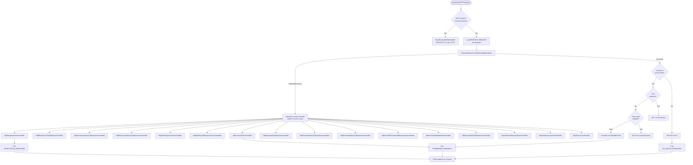

### Injected-vs-real latency timing

Every response's `httpResponse.timing` block (`org.mockserver.model.Timing`) records how long the exchange took, split so the dashboard can distinguish latency **MockServer injected** from **real** processing/upstream time. Proxied responses already carry the real `connectionTimeInMillis` / `timeToFirstByteInMillis` / `totalTimeInMillis` measured by `NettyHttpClient`. Three additive fields attribute the injected portion at its natural site: `injectedChaosLatencyMillis` (a chaos-profile latency fault — set in `HttpActionHandler.writeResponseActionResponse` for mock responses and `writeForwardActionResponse` for forwarded ones), `injectedDelayMillis` (the matched action's configured `delay`), and `breakpointHeldMillis` (time held at a response-phase breakpoint). Mock-served responses — which previously had no timing block — now get a minimal one (measured `totalTimeInMillis` plus the injected fields) **only when MockServer actually injected latency** (a chaos fault, a configured delay, or a breakpoint hold); a plain mock with no injection is left without a timing block so its serialised form — and therefore recorded log messages and retrieved responses — is unchanged. When present, the UI derives "real" time as total minus the injected sum. Measurement overhead is a few `System.nanoTime()` deltas and one `Timing` object per response; injected values are sampled once from the `Delay` (exact for static delays, an independent draw for distribution delays). The fields are additive and serialise via the existing `HttpResponseSerializer`, so older clients simply ignore them. Deferred: breakpoint-hold timing is captured only on the mock response path; the forward-path breakpoints (which already surface real upstream timing) do not yet record it.

## HttpState -- The Control Plane Brain

`HttpState` (`mockserver-core/.../mock/HttpState.java`) is the central orchestrator. It owns:

- `RequestMatchers` -- active expectation collection
- `MockServerEventLog` -- event log (Disruptor-backed)
- `WebSocketClientRegistry` -- callback WebSocket clients
- `Scheduler` -- async task execution
- All serializers for JSON parsing

### Control Plane REST API

`HttpState.handle()` processes PUT requests to control-plane endpoints and returns `true` if handled:

| Endpoint | Action |
|----------|--------|
| `PUT /mockserver/expectation` | Deserialize + add/update expectations |
| `PUT /mockserver/openapi` | Convert OpenAPI spec to expectations (idempotent/incremental sync) |
| `PUT /mockserver/wsdl` | Convert a WSDL 1.1 document (SOAP 1.1/1.2) to expectations |
| `PUT /mockserver/pact` | Export active response expectations as a Pact v3 consumer contract (`?consumer=&provider=`) |
| `PUT /mockserver/pact/verify` | Verify that active expectations satisfy a Pact v3 contract (202 all-pass / 406 failures) |
| `PUT/GET /mockserver/mode` | Get/set the operating mode (`?mode=SIMULATE\|SPY\|CAPTURE`) — toggles proxy-on-no-match for record/spy workflows |
| `PUT /mockserver/clear` | Clear expectations and/or logs by request matcher |
| `PUT /mockserver/reset` | Reset all state (expectations, logs, WebSocket registry) |
| `PUT /mockserver/retrieve` | Retrieve requests, responses, logs, or active expectations |
| `PUT /mockserver/verify` | Verify request count against `VerificationTimes` |
| `PUT /mockserver/verifySequence` | Verify ordered sequence of requests |
| `PUT /mockserver/grpc/descriptors` | Upload a compiled proto descriptor set (binary body) |
| `PUT /mockserver/grpc/services` | List all loaded gRPC services and their methods |
| `PUT /mockserver/grpc/clear` | Clear all loaded gRPC descriptors and reset the store |
| `PUT /mockserver/files/store` | Store a file in the in-memory file store |
| `PUT /mockserver/files/retrieve` | Retrieve a stored file by name |
| `PUT /mockserver/files/list` | List all stored file names |
| `PUT /mockserver/files/delete` | Delete a stored file by name |
| `PUT /mockserver/debugMismatch` | Compare a request against all active expectations and return per-field diffs |
| `PUT /mockserver/explainUnmatched` | Retrieve recent unmatched requests with ranked closest-expectation diagnostics and remediation hints |
| `PUT /mockserver/replay` | Re-issue a recorded request to its target and return the upstream response (see [Request Replay](#request-replay)) |
| `PUT/GET/DELETE /mockserver/chaosExperiment` | Start, query, or stop a scheduled multi-stage chaos experiment (see [docs/code/chaos.md](chaos.md)) |
| `PUT /mockserver/trafficValidate` | Validate recorded traffic (all `REQUEST_RESPONSES` from the event log) against an OpenAPI spec supplied in the request body as `{"spec": "<url|path|inline>"}`. Returns a per-pair conformance report in the same shape as `/contractTest`. The `spec` URL host is checked against the same SSRF policy enforced by the forward/replay/contract-test paths before the parser fetches it. Subject to control-plane authentication. |

All control-plane requests go through `controlPlaneRequestAuthenticated()` which enforces mTLS and/or JWT authentication if configured.

#### WSDL Expectation Generation

`PUT /mockserver/wsdl` accepts a raw WSDL 1.1 XML document and generates one `Expectation` per SOAP operation found across all service/port bindings. Implementation is in `WsdlExpectationGenerator` (`mockserver-core/.../mock/wsdl/`). For each operation it builds a `POST` request matcher targeting the path from `soap:address` (or `soap12:address`) and matches on the `SOAPAction` header (SOAP 1.1), the `content-type` `action` parameter (SOAP 1.2), or an XPath body check when no SOAP action is declared. The response is a skeleton SOAP envelope with a `<{Operation}Response/>` element in the WSDL target namespace. The WSDL is parsed through `StringToXmlDocumentParser` with DOCTYPE and external entity resolution disabled (XXE-safe). Returns 201 with the generated expectations as JSON.

#### Pact Contract Export

`PUT /mockserver/pact` (with optional `?consumer=NAME&provider=NAME` query parameters) exports the currently active response expectations as a Pact v3 consumer contract JSON. Implementation is in `PactExporter` (`mockserver-core/.../mock/pact/`). Only expectations with a concrete `HttpRequest` matcher and an `HttpResponse` (or `HttpResponses`) action are included; expectations with notted method/path matchers are skipped; notted header and query-parameter values are dropped from the exported interaction. JSON bodies are embedded as structured nodes. The `consumer` and `provider` parameters default to `"consumer"` and `"provider"` when not supplied. Returns 200 with the Pact JSON.

Non-literal matchers are translated into a Pact v3 interaction-level `matchingRules` object, split across `matchingRules.request` / `matchingRules.response` and keyed by category — `path` / `query` (`$.name[i]`) / `header` (`$['Name'][i]`) / `body`. The `path`/`query`/`header` categories are the inverse of the `PactImporter` mapping, so those rules round-trip back into matchers on import; `body`-category rules (`jsonSchema`/`xpath`) are exported for external Pact consumers but the importer rebuilds the body matcher from the example body only (it does not re-read body rules):

| MockServer matcher | Pact rule |
|--------------------|-----------|
| path/query/header value MockServer treats as a regex (contains a regex metacharacter) | `{"match":"regex","regex":"<value>"}` |
| `schemaString(...)` (`NottableSchemaString`) param/header | `{"match":"type"}` (or `integer`/`number`/`boolean` per the schema `type`) |
| `jsonSchema(...)` body (`JsonSchemaBody`) | one `{"match":"type"}` per top-level schema property keyed `$.field` (a single `$` rule for a scalar schema); the schema text is not written to the `body` example field |
| `xpath(...)` body (`XPathBody`) | body-category `{"match":"regex"}` keyed by the XPath expression; no `body` example field |

The mapping is additive: an interaction whose matchers are all literal emits no `matchingRules` object and exports byte-identically to before. Optional and blank matcher values yield no rule (the example value is kept as-is).

#### Pact Contract Verification

`PUT /mockserver/pact/verify` takes a Pact v3 contract JSON as the request body and verifies that MockServer's currently-active expectations satisfy each interaction. Implementation is in `PactVerifier` (`mockserver-core/.../mock/pact/`). For each interaction, the verifier builds an `HttpRequest` from the interaction's request fields, finds matching expectations via `RequestMatchers.retrieveExpectationsMatchingRequest()` (read-only forward matching — no side effects on times/scenarios), and compares the matched expectation's response against the interaction's expected response: status code must be equal, headers use subset matching (each Pact header must be present but extra MockServer headers are allowed), and bodies are compared structurally as JSON when both parse as JSON, otherwise as strings. Only expectations with a static `HttpResponse` (or first of `HttpResponses`) action are verifiable; forward/callback/template actions fail with reason "unverifiable (non-static action)". Returns 202 with `{"verified":true,...}` when all interactions pass, 406 with `{"verified":false,...}` when any fail, or 400 on malformed/empty input.

#### Operating Mode (SIMULATE / SPY / CAPTURE)

`PUT /mockserver/mode?mode=SIMULATE|SPY|CAPTURE` switches the server's operating mode at runtime. `GET /mockserver/mode` returns the current mode as `{"mode":"...","proxyUnmatchedRequests":true|false}`. Implementation is in `MockMode` (`mockserver-core/.../mock/MockMode.java`). The three modes are: **SIMULATE** (default) — match expectations, return 404 on no match; **SPY** — match expectations, forward unmatched requests to the real upstream and record; **CAPTURE** — forward and record all traffic (useful with no expectations defined). SPY and CAPTURE both enable `attemptToProxyIfNoMatchingExpectation`. Recorded interactions are retrieved via the existing `PUT /mockserver/retrieve?type=RECORDED_EXPECTATIONS` endpoint.

#### MCP list_mock_tools

The `list_mock_tools` MCP tool (registered in `McpToolRegistry.registerListMockTools()`, `mockserver-netty/.../mcp/`) generates MCP tool definitions from the currently active response expectations by delegating to `McpToolSchemaGenerator` (`mockserver-core/.../mock/mcp/`). It takes no parameters and returns `{"tools":[...],"count":N}`. Each expectation with a concrete (non-notted) method and path and a response action becomes one tool: the name is derived from `METHOD_path` in lower snake_case (deduplicated and capped at 64 characters), the `inputSchema` exposes query parameters and an optional `body` property, and a `_mockserver` annotation records the target method, path, and expectation ID.

### Retrieve, Clear & Format Enums

The retrieve and clear endpoints accept type parameters:

**`RetrieveType`** (query parameter `?type=`):

| Value | Description |
|-------|-------------|
| `REQUESTS` | Received requests matching the filter |
| `REQUEST_RESPONSES` | Request/response pairs |
| `RECORDED_EXPECTATIONS` | Expectations recorded from proxy forwarding (supports `?consolidate=true` / `?parameterize=true` — see [Record-to-Expectations](#record-to-expectations-rest--consolidation--promotion)) |
| `ACTIVE_EXPECTATIONS` | Currently active expectations |
| `LOGS` | Log messages |

**`Format`** (query parameter `?format=`):

| Value | Description |
|-------|-------------|
| `JSON` | Standard JSON serialization |
| `JAVA` | Generated Java client API code (via `ExpectationToJavaSerializer`) |
| `LOG_ENTRIES` | Raw log entry format |
| `HAR` | HTTP Archive (HAR) export |
| `OPENAPI` | OpenAPI spec export (applies to `ACTIVE_EXPECTATIONS`) |
| `POSTMAN` | Postman collection export (applies to `ACTIVE_EXPECTATIONS`) |
| `BRUNO` | Bruno request collection export (applies to `ACTIVE_EXPECTATIONS`) |
| `CURL` | cURL command(s) reproducing recorded requests (applies to `REQUESTS` / `REQUEST_RESPONSES`) |

**`ClearType`** (query parameter `?type=`):

| Value | Description |
|-------|-------------|
| `EXPECTATIONS` | Clear expectations only |
| `LOG` | Clear logs only |
| `ALL` | Clear both expectations and logs (default) |

Clear also supports clearing by `ExpectationId` (not just `RequestDefinition`).

**Retrieve by `ExpectationId`.** `PUT /mockserver/retrieve` accepts an `ExpectationId` body (`{"id": "..."}`) in
place of a `RequestDefinition`, the same as clear and verify. `HttpState.retrieve()` and `HttpState.clear()` share
`parseExpectationId(body)`, which attempts `ExpectationIdSerializer.deserialize` and returns null when the body is not
an id — the two forms are unambiguous because both JSON schemas set `additionalProperties: false` and only
`expectationId.json` allows (and requires) `id`. **Order matters:** the id must be parsed *before* the body is handed
to `RequestDefinitionSerializer`, which rejects `{"id": "..."}` on schema validation.

The id is then resolved to that expectation's request definition via `resolveExpectationId(...)` and used as the
filter, so `REQUESTS`, `REQUEST_RESPONSES`, `RECORDED_EXPECTATIONS` and `LOGS` are filtered exactly as
`verify(ExpectationId)` filters them; an unknown id throws `IllegalArgumentException("No expectation found with id ...")`
from `RequestMatchers.retrieveRequestDefinitions`, surfacing as a 400.

`ACTIVE_EXPECTATIONS` is the exception: it filters on the **id itself** (`retrieveActiveExpectations(null)` then a
`getId()` filter), not on the resolved request definition. Matching by request definition would return every *other*
expectation whose matcher also matches that request, and would miss expectations (OpenAPI, JSON-schema or regex
matchers) whose own request definition does not match their own matcher.

### Pre-HttpRequestHandler Routes

Before a request reaches `HttpRequestHandler`, the Netty pipeline may intercept it at an earlier stage:

| Route | Handler | Description |
|-------|---------|-------------|
| `/mockserver/mcp` | `McpStreamableHttpHandler` | MCP (Model Context Protocol) server endpoint (Streamable HTTP transport with JSON-RPC 2.0). Intercepted in the pipeline before `MockServerHttpServerCodec`. Only active when `mcpEnabled=true`. Methods dispatched by `McpRequestProcessor`: `initialize`, `ping`, `tools/list`, `tools/call`, `resources/list`, `resources/read`, `prompts/list`, `prompts/get` (built-in prompts from `McpPromptRegistry`, `{{argument}}` substitution) and `sampling/createMessage` (returns a mocked completion: `role`/`content`/`model`/`stopReason`). The `prompts` and `sampling` capabilities are advertised in the `initialize` result. |
| `/_mockserver_callback_websocket` | `CallbackWebSocketServerHandler` | WebSocket upgrade for object/closure callbacks |

### gRPC Built-in Services (in GrpcToHttpRequestHandler)

`GrpcToHttpRequestHandler` intercepts gRPC requests before they reach the normal expectation-matching pipeline. The following built-in gRPC services are handled directly without user-defined expectations:

| Path | Handler | Description |
|------|---------|-------------|
| `/grpc.health.v1.Health/Check` | `GrpcHealthCheckHandler` | Health check (returns serving status from `GrpcHealthRegistry`) |
| `/grpc.reflection.v1.ServerReflection/ServerReflectionInfo` | `GrpcServerReflectionHandler` | Server Reflection v1 (lists services, resolves symbols/files from loaded descriptors) |
| `/grpc.reflection.v1alpha.ServerReflection/ServerReflectionInfo` | `GrpcServerReflectionHandler` | Server Reflection v1alpha (same behaviour as v1) |

**Server Reflection** enables tools like `grpcurl list` and `grpcurl describe` to introspect the gRPC services loaded into MockServer without a local proto file. The handler decodes `ServerReflectionRequest` messages and responds with service listings, file descriptors by symbol, or file descriptors by filename. It uses `CodedInputStream`/`CodedOutputStream` for manual protobuf encoding (no generated reflection stubs).

**Limitation:** The current gRPC path in MockServer is buffered-unary -- each HTTP/2 request carries exactly one gRPC message. Server Reflection therefore handles a single `ServerReflectionRequest` per HTTP/2 request, which is sufficient for `grpcurl list`, single symbol lookups, and file lookups. Fully-interactive bidi-streaming reflection (a long-lived stream with multiple back-and-forth messages) is not supported by the buffered pipeline.

### Non-Control-Plane Routes (in HttpRequestHandler)

| Route | Method | Handler |
|-------|--------|---------|
| `/mockserver/status` | PUT | Returns port binding JSON (bound ports, version, group/artifact id, and `gitHash` when built from a git checkout) |
| Liveness path | GET | Returns port binding JSON |
| `/mockserver/bind` | PUT | Dynamically bind additional ports |
| `/mockserver/stop` | PUT | Graceful shutdown |
| `/mockserver/dashboard` | GET | `DashboardHandler.renderDashboard()` |
| `/mockserver/metrics` | GET | `MetricsHandler` (Prometheus) |
| CONNECT method | - | HTTP CONNECT tunnel setup |
| Everything else | - | `HttpActionHandler.processAction()` |

### Control-Plane Failures: 400 or 500

When handling a control-plane request throws and no endpoint-specific `catch` answers it, every frontend
(`HttpRequestHandler` for HTTP/1.1 and HTTP/2, `Http3MockServerHandler`, `MockServerServlet`, `ProxyServlet`) and the
scheduler-run `/llm/optimisationReport` and `/llm/diffRuns` answer through `ControlPlaneFailureResponse` (core):

| Thrown | Status | Body | Log |
|--------|--------|------|-----|
| `IllegalArgumentException` (every deserializer reports unreadable or schema-invalid JSON this way), `UnsupportedOperationException`, a Jackson `JsonProcessingException` other than a write failure (`StreamWriteException`) or `InvalidDefinitionException` | `400` | the exception's message, `text/plain` | one `ERROR` entry with the message |
| anything else, `Error`s included | `500` | `unexpected error processing request, see the MockServer log for correlation id: <id>`, `text/plain` | one `ERROR` entry with the stack trace under that correlation id |

The same catch-all in `HttpRequestHandler` also answers a fault on the data-plane path outside `processAction`'s own
`catch` (`CONNECT` set-up, the data-plane authentication gate, the TLS-required check), so those are a `500` too.
`processAction`'s own `catch` (`HttpRequestHandler` for HTTP/1.1 and HTTP/2, both `Http3MockServerHandler` paths) and
the servlets' `catch` for a data-plane request (one that reached `processAction`, or whose decoding failed on a path
that is not a control-plane path, `HttpState.isControlPlanePathCandidate`) answer
every exception as the `500` row does, whatever its class, with the same body and log entry, but written as a mock
response (`ControlPlaneFailureResponse.dataPlaneFailureResponse`), so it carries CORS headers only when
`enableCORSForAllResponses` is on and no `version` header; on the gRPC-over-HTTP/3 path
the answer is the gRPC `INTERNAL` status carrying that message, and an HTTP/3 stream already answered is not answered again.
The correlation id is the request's log correlation id (set by `HttpState.handle`), or a new one when the failure came
before it was set. Before 9.0.0 the catch-all answered every exception `400` with its bare message (an exception
without one gave an empty body) and an `Error` closed the connection with no response. The Java client raises a
`500` as a `ClientException` whatever the call passed as `throwClientException`, as it raises a `400` as an
`IllegalArgumentException`.

Endpoints that catch their own exceptions (`HttpState`'s identity providers, import, promote recordings, baseline
compare, Pact, CRUD, gRPC, WASM, files, clock, chaos, load scenarios, scenarios, cassettes, breakpoint matchers,
diagnostics, contract test, traffic validation, replay and AsyncAPI routes, and the Netty `PUT /mockserver/configuration`
route) apply the same split. A client error by `ControlPlaneFailureResponse.isClientError`, plus an invalid gRPC
descriptor set (a protobuf `InvalidProtocolBufferException` or `DescriptorValidationException` among the causes), keeps
the endpoint's `400` and its own message format. Anything else is answered `500` through
`ControlPlaneFailureResponse.writeUnexpectedFailure` (text endpoints) or `HttpState.unexpectedFailure` (JSON endpoints,
`{"error": "<the same generic message>"}`), logged once with the stack trace. An endpoint that reads no input (for
example `PUT /mockserver/files/list`, `PUT /mockserver/grpc/services`, `GET /mockserver/wasm/modules`, and the `GET`
status routes for the clock, proxy configuration, service, TCP and gRPC chaos, gRPC health, chaos experiments and
their history, load scenarios, preemption, cluster, drift and audit, plus `DELETE /mockserver/chaosExperiment`)
answers every exception `500`; drift and audit read only a `limit` whose parse errors fall back to the default. When
the JSON body describing a caller's error cannot itself be written, the error builders (`serviceChaosError`,
`loadScenarioError`, `sloError` and the rest) answer `500` the same way rather than `400` with a fixed message.
`AsyncApiControlPlaneImpl.load` reports a spec or broker configuration it cannot read as an
`IllegalArgumentException`, so only a failure after that, such as a broker connection, is a `500`.

Loading an OpenAPI spec may fetch a URL with blocking I/O, so no spec load runs on, or is waited for by, the
event loop of the request that needs it. When the URL is served by the same MockServer, the fetch's connection can be
served by the very loop that is waiting for it, and the request stalls until the fetch times out (every time with
`nioEventLoopThreadCount(1)`). One exception remains: a streaming validation-proxy response is validated in the
streaming body's completion listener (`HttpActionHandler.validateProxyResponse`), on whichever thread ends the
stream, typically the upstream connection's event loop. The spec was loaded when the request was validated, so this
fetches only if it has expired from the parser's cache since; that thread is then blocked for the fetch.

| Entry point | Off-loop mechanism |
|-------------|--------------------|
| `PUT /mockserver/openapi`, `PUT /mockserver/loadScenario/generateFromOpenAPI` | `HttpState.handle` dispatches the request on the scheduler's executor (`dispatchOffTheEventLoop`), which writes the response; `handle` returns `true` at once |
| `PUT /mockserver/expectation`, `/retrieve`, `/clear`, `/verify`, `/verifySequence`, `/breakpoint/matcher`, `/recordings/promote` whose body contains `specUrlOrPayload` (an OpenAPI request matcher) | The same dispatch; without that field these run inline as before |
| `PUT /mockserver/contractTest`, `PUT /mockserver/trafficValidate` | Their own run is submitted to the executor (`runOffTheEventLoop`), and on Netty the calling thread is released at once rather than waiting for it; a servlet still waits for the run (`releaseCallerWhenOffloaded`) |
| `httpForwardValidateAction` | The action is submitted to the scheduler before it is scheduled, since an undelayed `Scheduler.schedule` runs inline |
| OpenAPI-backed mock with `validateRequestsAgainstOpenApiSpec` or `openAPIResponseValidation` on | `dispatchPrimaryAction` runs on the scheduler (response validation loads the spec again once it has left the parser's cache) |
| Validation proxy, MCP tools, dashboard rendering | Already off the loop: the scheduler, the MCP executor and the dashboard's own executor |

A synchronous `Scheduler` has no executor, so with one this work runs on the calling thread
(`HttpState.runOffTheEventLoop`). A servlet deployment (`handle(..., warDeployment=true)`) builds an asynchronous
`Scheduler` but has no `AsyncContext`, so it dispatches inline and waits for any offloaded run: the servlet commits
its response as soon as `handle` returns. Data-plane dispatch is `synchronous` on a servlet, so the scheduler runs
those submissions inline. Work moved to the executor keeps the receiving port
(`HttpState.getPort()`) for the events it logs. `OpenApiSelfServedSpecFetchIntegrationTest` (mockserver-netty) runs
each entry point against a single-event-loop server serving its own spec; `HttpStateOpenAPISpecLoadThreadTest`
(mockserver-core) checks that `handle` returns while the spec fetch is held.

## Expectation Matching

### RequestMatchers

Expectations are stored in a `CircularPriorityQueue` sorted by priority (highest first), then creation time (earliest first). The `firstMatchingExpectation()` method accepts an `HttpRequest` and iterates in sort order, returning the first match.

When no expectation matches, the method logs a **closest match summary** identifying the expectation with the fewest field differences, along with a match score (e.g., "matched 8/12 fields"). This helps users quickly identify which expectation was closest to matching.

`HttpState` obtains its `RequestMatchers` through `ExpectationStoreFactory` (a small SPI/registry) rather than constructing it directly. By default the factory returns the standard in-memory `RequestMatchers` (zero behaviour change). This is the **clustered-state seam**: an optional backend can register a factory returning a clustering-aware `RequestMatchers` so a fleet of MockServer instances shares expectations. The optional `mockserver-state-infinispan` module implements this with an embedded Infinispan data-grid backend; activate it by setting `stateBackend=infinispan`. See [Clustered State](clustered-state.md) for full details.

Every comparison runs against a `MatchDifference` context, but detailed field-level differences are **recorded only when they will be read**: when `detailedMatchFailures` is on (the default) *and* INFO logging is enabled — the levels that consume them (the per-field "because" text in the `EXPECTATION_NOT_MATCHED` entry and the closest-match selection, both INFO-gated; TRACE implies INFO). At WARN/ERROR/OFF, or with `detailedMatchFailures` off, a single reusable `MatchDifference` serves the whole scan and records nothing, so a large no-match scan does not allocate a per-candidate context and difference map that nothing would read (the tracked perf baseline runs at ERROR). The `MatchFailureHints` utility adds actionable suggestions for common mistakes (trailing slashes, Content-Type charset mismatches, unescaped regex metacharacters). Read-only diagnostics (`explainUnmatched`, `debugMismatch`, verification, drift) build their own detailed `MatchDifference` independently, so they are unaffected by the serving-path log level.

#### Request body parsed once per scan

A scan over the expectations (`firstMatchingExpectation`, `findClosestMatchHint`, `peekFirstMatchingExpectation`, `retrieveExpectationsMatchingRequest`) parses a JSON request body once, not once per JSON or JSONPath expectation. Each scan opens a `ParsedBodyCache` scope on the `HttpRequest` (the cache itself is created only when a JSON matcher first asks for it) and detaches and empties it in a `finally`, so nothing parsed outlives the scan — the request object itself may be retained by the event log.

- **Scope and ownership.** The cache is bound to the thread that opened it. A nested scan on that thread reuses it; another thread matching the same request object parses for itself. Entries are keyed on the body text, so a different body is re-parsed rather than served stale.
- **What is shared.** `JsonStringMatcher` shares the Jackson tree; `JsonPathMatcher` shares the json-smart document (the provider Jayway defaults to — its `Collection` results are what the matcher tests). A JSONPath that mentions `append` never reads the shared document, because Jayway's `append()` writes to the document it reads.
- **Why not a thread-local.** The previous per-thread cache kept the last body and its tree on every matching thread for the life of the JVM, surviving `reset`. XML is deliberately not shared: a DOM `Document` is mutable, and an earlier per-request DOM cache (`92b1c8f79`) was reverted. `StringToXmlDocumentParser` instead reuses one hardened `DocumentBuilderFactory` per namespace mode and builds a fresh `DocumentBuilder` and `Document` per parse (the JDK factory's `newDocumentBuilder()` only reads its configuration).
- **Evidence.** `BodyParseDifferentialTest` pins verdicts, differences and log entries for a JSON/JSONPath/XPath corpus against digests captured before the change; `ParsedBodyCacheTest` asserts one parse per scan and an empty, detached cache afterwards.

#### Mutator serialization — concurrent control-plane writes (issue #2579)

Control-plane mutations do **not** run under an external single-writer lock: `PUT /mockserver/expectation` executes `RequestMatchers.add` on the connection's Netty worker thread, and there are `nioEventLoopThreadCount` of them, so multiple adds genuinely race. `RequestMatchers` keeps its node-local cache correct with two internal mechanisms:

- **Short in-memory critical sections.** Each mutator (`add`, `update`, `reset`, `removeHttpRequestMatcher`) mutates the non-thread-safe `CircularPriorityQueue` (and the matcher cache) only inside a `synchronized(this)` block; the removed-expectation definition history (`RetiredRequestDefinitions`) is self-synchronized and calls nothing outside itself. Each block is purely in-memory and — this is the invariant — contains **no backend call, no listener notification and no blocking I/O**. `add`/`update` therefore release the monitor *before* writing `expectationBackend`, so a slow (clustered) backend write never stalls another thread's mutation. Holding the monitor across `expectationBackend.put` is exactly what deadlocked the clustered backend in the reverted first fix (`98ab5d8de`); see [Clustered State → Concurrency contract](clustered-state.md).
- **In-flight-add protection for the eviction trim.** After writing the backend, `add` runs an eviction reconcile (`trimEvictedFromBackend`) that deletes cached ids missing from a backend snapshot. Before this was hardened, one thread's trim could observe another thread's just-inserted matcher *before* its backend write landed, mis-classify it as evicted and delete it — silently dropping a `201`-acknowledged expectation. Each mutator now registers its id in the reference-counted `addsInFlight` registry before touching the cache and deregisters it only after the backend write returns; both the trim and the clustered reconcile take their snapshots in the order `cachedIds → protectedIds(=addsInFlight) → backendIds` (cached ids first, backend last) and evict only `cachedIds − backendIds − protectedIds`, which provably cannot drop an in-flight add.

The **read / matching** path (`firstMatchingExpectation`, `firstMatchingEarlyExpectation`, the `retrieve*` family and `size()`) is deliberately **not** synchronized — it relies on the queue's eventually-consistent `toSortedList()` snapshot — so request throughput is unaffected by control-plane writes. The snapshot is cached and tagged with a generation number that every mutation bumps after changing the store and before notifying the mutation listener. A read serves the cached list only if its tag matches the current generation, so a list that a reader built before a concurrent mutation, and published after it, is never served once that mutation has returned.

#### CandidateIndex — matching acceleration for large expectation sets

For small expectation sets the full sorted list is always scanned (O(n)). When the expectation count reaches or exceeds `candidateIndexThreshold` (default 64), `RequestMatchers` delegates to `CandidateIndex` (`mockserver-core/.../mock/CandidateIndex.java`) to narrow the scan to a **candidate set** for the incoming request. The matched expectation is byte-for-byte identical to the full linear scan result because:

1. An expectation is placed in a `(method, path)` bucket **only** when both its method and path are plain literal equality matchers — non-null, non-blank, non-notted, non-optional, non-schema, regex-metacharacter-free, and pure-ASCII. Any expectation that does not meet every criterion (regex, notted, optional, blank, schema/OpenAPI string, path-parameter rewrite, or non-`HttpRequest` definition) goes in the **fallthrough** list instead.
2. The candidate set for a request is `bucket(method+path) ∪ fallthrough`. Any expectation outside this set is in a different literal bucket and provably cannot match the request.
3. Candidates are evaluated in the **same global priority/insertion sort order** as the full scan, so the first match among candidates equals the first match of the full scan.

Additional correctness constraints:

- **Case-insensitive mode** (`matchExactCase=false`, the default): bucket keys are folded with `toLowerCase(ROOT)`. However, a non-ASCII request method or path cannot be safely narrowed by fold-based bucketing (e.g. Turkish dotted-I U+0130 changes length under `toLowerCase`), so such requests fall back to the full authoritative scan.
- **Blank method/path on the request** (only constructible programmatically): falls back to the full scan because a blank request component matches the method/path criterion of every expectation.
- **Closest-match reconciliation on a miss**: when the index was used, nothing matched and INFO/DEBUG is enabled, `fullScanClosestMatchAndLazyRemoval` walks the full sorted list so the closest-match entry and the namespace-skip count cover every expectation, not only the candidates. It **does not evaluate the candidates again**, so the walk adds no second `EXPECTATION_NOT_MATCHED` / `EXPECTATION_MATCHED` entry for them (re-evaluating them also doubled the miss cost at INFO when every expectation shares one bucket). `RequestMatchersUnmatchedDiagnosticsTest` and `RequestMatchersUnmatchedDiagnosticsStoreChangeTest` pin this.
  - *Candidates* are recognised by identity, through a set built from the candidate list, not by sort key: another thread can re-key an expectation's priority at any time, including during the walk. The set is the only extra allocation, and only on this INFO miss path; the matched path never reaches this code.
  - *Stand-in*: the narrowed scan's closest candidate (the first candidate with the fewest failures) stands in for all candidates. It is offered where the walk reaches its own matcher or, if that matcher is no longer in the store, at the position of its scan-time sort key. A candidate can leave the store between the scans, e.g. when its lazy removal, scheduled by the narrowed scan, completes on the scheduler pool first (inline in tests that use a synchronous `Scheduler`).
  - *Store changes*: each expectation is evaluated at most once per request, except one deleted and re-created with the same id during the request; an expectation present for the whole request is evaluated exactly once, unless the namespace gate excludes it. Changes made before the walk takes its snapshot are reflected in it; changes made during the walk may not be. With a store that does not change during the request, an indexed miss emits the same set of entries as the un-indexed scan, candidates' entries first.
- **Incremental (per-mutation) maintenance**: the index is maintained as the store changes — `onAdded`/`onRemoved` update one bucket in O(1), driven by a mutation listener `RequestMatchers` wires onto the backing `CircularPriorityQueue` (`RequestMatchers.java:236`), so add, remove, in-place update, priority re-key, overflow eviction and reset all reach it. **A read never rebuilds.** This replaced an earlier generation-driven rebuild-on-read-after-any-mutation design, which was O(n) per request under churn and, being `synchronized`, serialised concurrent readers so it got worse with more cores — and churn is produced by the serving path itself, since `once()` / limited-`Times` matchers schedule their own lazy removal. Measured at 15,000 expectations, the churn-versus-static penalty went from **8,168x to 1.03x** in time and **~13,000x to 1.06x** in allocation. The only rebuild left is a one-off reconciliation when a read observes a live `matchExactCase` change.

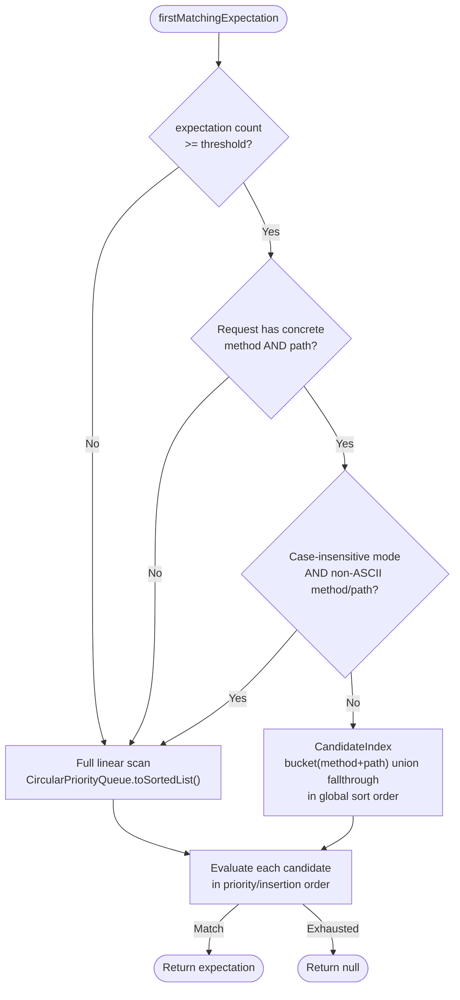

##### `clear` uses the index too — via a second, path-only dimension

`RequestMatchers.clear(RequestDefinition)` used to run a full match against **every** registered
expectation, and a per-test teardown typically does three of them. It now asks the index for a
candidate set (`CandidateIndex.clearCandidates`), falling back to the untouched full scan whenever
narrowing would be unsound. Narrowing can only ever *shrink* the set, and only where the excluded
matchers provably could not match — everything not bucketed sits in a fallthrough that is always
unioned in — so the failure mode being designed against, **silent under-removal**, cannot arise from
a missing bucket.

A clear is served from one of two dimensions:

| clear shape | served from |
|---|---|
| literal method AND literal path | the `(method, path)` bucket ∪ fallthrough (the same dimension matching uses) |
| literal path, no method (or a non-literal one) | a **path-only** bucket ∪ a path-only fallthrough |

The path-only dimension exists because the common teardown shape — and the one the measurement
actually used — names a path without a method, which the `(method, path)` buckets cannot serve.

Two constraints are easy to get backwards:

- **A clear is always case-insensitive**, whatever `matchExactCase` says: `HttpRequestPropertiesMatcher`
  computes `caseSensitive = !controlPlaneMatcher && matchExactCase()`, and a clear is a control-plane
  matcher. So narrowing is only sound from a case-insensitively folded index, which exists exactly
  when `matchExactCase` is **off** (the default). With it on, the full scan runs.
- **A regex-path clear legitimately spans many literal buckets** (clearing `/a.*` must remove `/a1`
  and `/a2`), and **a literal clear must also remove a regex expectation that covers it**. The first
  falls back to the full scan; the second works because regex-path expectations live in the
  fallthrough.

Measured candidate-enumeration cost at 15,000 expectations: **1,585 µs → 0.2 µs**, and flat across
store size rather than linear.

### Expectation Namespacing (Multi-Tenancy)

**Outcome:** multiple teams or test-suites can share one MockServer instance without their expectations colliding, by partitioning expectations into named namespaces (tenants). The feature is **additive and backward-compatible** — with no namespace ever set, behaviour is exactly as before.

An expectation carries an optional `namespace` (a.k.a. tenant) string (`Expectation.withNamespace(...)`, `null` = the global namespace). A request declares its namespace via a configurable request header (`matchNamespaceHeader`, default `X-MockServer-Namespace`; env `MOCKSERVER_MATCH_NAMESPACE_HEADER`).

**Matching rule** (`RequestMatchers.matchesNamespace`, applied as a pre-filter in `firstMatchingExpectation` / `firstMatchingEarlyExpectation` before each candidate is matched):

| Request namespace `T` (from header) | Expectation namespace | Eligible to match? |
|-------------------------------------|-----------------------|--------------------|
| any (incl. absent) | `null` (global) | yes |
| `T` | `T` | yes |
| `T` | other (`≠ T`) | no |
| absent | non-null | **no** |

**No-header default decision — Option A (true isolation):** a request with no namespace header sees only global (null-namespace) expectations, never any tenant's. This is the least-surprising, safest default: isolation holds by construction, so a client that forgets the header (or a stray request) can never accidentally hit another tenant's mocks; shared infrastructure stubs are explicitly placed in the global namespace. (Option B — no-header sees everything — was rejected: it makes isolation opt-out and lets a forgotten header silently leak cross-tenant matches.)

The namespace header does **not** participate in normal header matching: matching is unchanged except for the extra pre-filter skip. Existing expectations only match headers they explicitly declare, and the MockServer-specific namespace header is not one of them, so a request carrying it still matches a global expectation exactly as before. The header is not stripped.

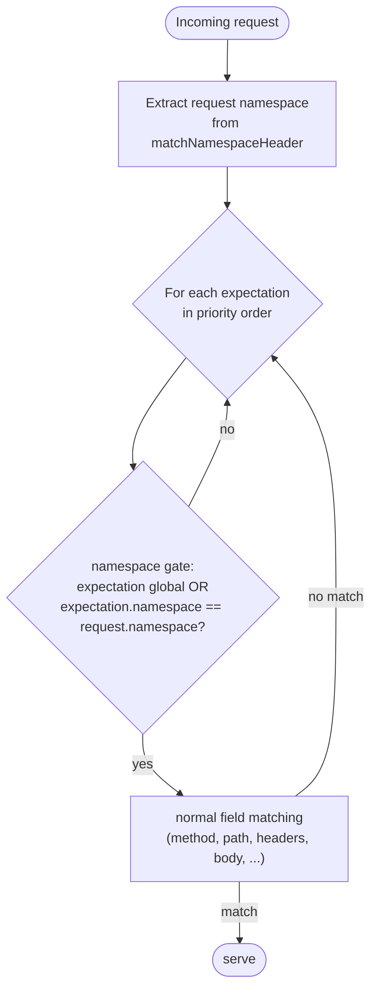

**Scoped control-plane operations** (`HttpState.resolveNamespaceFilter` reads the `?namespace=T` query parameter, falling back to the `matchNamespaceHeader` header on the control-plane request):

- `PUT /mockserver/clear?type=expectations&namespace=T` (and `?type=all&namespace=T`) removes **only** namespace `T`'s expectations via `RequestMatchers.clearByNamespace(...)`, leaving other tenants' and global expectations intact. A blank namespace is a no-op (it never clears global expectations). Because the event log is not namespaced, a namespace-scoped `all` clear deliberately leaves the request log untouched.
- `PUT /mockserver/retrieve?type=active_expectations&namespace=T` returns only namespace `T`'s expectations plus global ones (other tenants hidden).
- `PUT /mockserver/reset` with no namespace stays a full reset (unchanged semantics).

All of the matching/clearing logic lives in `mockserver-core` (`Expectation`, `ExpectationDTO`, `RequestMatchers`, `HttpState`, `Configuration`/`ConfigurationProperties`); the Netty layer needs no change because it already passes all request headers through. The `namespace` field round-trips through `ExpectationDTO`, the expectation JSON Schema (`expectation.json`), the embedded OpenAPI model, and the Java-code serializer.

### Debug Mismatch Endpoint

The `PUT /mockserver/debugMismatch` endpoint (implemented in `HttpState.debugMismatch()`) provides programmatic access to match analysis. It accepts a `RequestDefinition` body and returns structured JSON showing per-expectation, per-field match results ranked by closeness (fewest differing fields first), with the closest match highlighted and actionable `remediation` hints for each mismatched field. The MCP `debug_request_mismatch` tool delegates to this same implementation and adds ranking/remediation post-processing. The Java client exposes this via `MockServerClient.debugMismatch(RequestDefinition)`.

### Explain Unmatched Endpoint

The `PUT /mockserver/explainUnmatched` endpoint (implemented in `HttpState.explainUnmatched()`) provides a post-hoc diagnostic for requests that have already been received and returned 404. It retrieves recent `NO_MATCH_RESPONSE` log entries from `MockServerEventLog.retrieveUnmatchedRequests()`, and for each, computes ranked closest-expectation diagnostics using `MatchDifference` with `MismatchRemediation` hints. The optional request body accepts `{"limit": N}` (default 10, max 100). The MCP `explain_unmatched_requests` tool and `mockserver://unmatched` resource both delegate to this implementation.

### Request Replay

`PUT /mockserver/replay` re-issues a previously recorded or proxied request to its upstream target and returns the upstream response through the control plane. The primary use case is the Traffic-view **Replay** button in the dashboard, which lets a developer resend a captured request to see whether the real service has changed behaviour. The Java client exposes this as `MockServerClient.replay(HttpRequest)`.

**Architecture:** The feature is split across two modules to avoid a circular dependency. `HttpState` (in `mockserver-core`) defines the endpoint and holds a `Function<HttpRequest, CompletableFuture<HttpResponse>> replayHandler` field. `HttpRequestHandler` (in `mockserver-netty`) wires the handler at startup: `httpState.setReplayHandler(req -> httpActionHandler.getHttpClient().sendRequest(req))`. The WAR deployment does not wire this handler; calling the endpoint from a WAR returns 501.

**Target resolution:** The host is resolved from `socketAddress.host` (if set in the JSON) or the `Host` header, mirroring the normal forward path.

**Safety hardening:**

| Check | Behaviour on failure |
|-------|---------------------|
| Body too large (request > 10 MB) | 413 Payload Too Large |
| Upstream response too large (> 10 MB) | 502 with error message |
| Target host blocked by SSRF policy (`InetAddressValidator.validateForwardTarget`) | 403 Forbidden |
| No handler wired (WAR deployment) | 501 Not Implemented |
| Upstream connection error / timeout | 502 Bad Gateway |

The 10 MB cap (`REPLAY_MAX_BODY_SIZE`) is applied to both the outbound request body and the returned upstream response body to prevent OOM from materializing and JSON-serializing an unbounded body.

The endpoint goes through `controlPlaneRequestAuthenticated()` — mTLS / JWT restrictions apply.

### Record-to-Expectations (MCP)

The `create_expectations_from_recorded_traffic` MCP tool converts `FORWARDED_REQUEST` log entries into active mock expectations. It reuses the existing `RECORDED_EXPECTATIONS` retrieve mechanism (`MockServerEventLog.retrieveRecordedExpectations()` which filters for `FORWARDED_REQUEST` entries and maps them to `Expectation` objects via `LogEntry.getExpectation()`). The tool deserializes the retrieved expectations, upgrades them from `Times.once()` to `Times.unlimited()` for persistent mocking, and adds them via `HttpState.add()`. Optional `method` and `path` parameters filter the recorded traffic, and `preview=true` returns the expectations as JSON without activating them.

### Record-to-Expectations (REST) — Consolidation & Promotion

`PUT /mockserver/recordings/promote` is the REST equivalent of the MCP tool above. It takes an optional request-matcher filter in the JSON body (empty body = all recorded traffic), **redacts secrets first** (`ImportRedaction`, on by default), **consolidates/parameterizes** the recorded traffic (`RecordedExpectationPostProcessor.consolidate()`; `?consolidate` / `?parameterize`, both on by default — `?consolidate=false` promotes verbatim but still upgraded to `Times.unlimited()`), then **activates** the result via `HttpState.add()` and returns it as `201 Created`.

Unlike the raw MCP tool (a verbatim 1:1 dump — 50 hits to `GET /users/123` become 50 brittle `Times.once()` expectations), `consolidate()` collapses exchanges by request shape into a single `Times.unlimited()` expectation, infers `/users/{id}` path parameters from varying id segments, strips volatile request headers (reusing `HarImporter.volatileRequestHeaders()`), and sequences differing responses for the same request shape into one `ResponseMode.SEQUENTIAL` multi-response expectation. The same engine is exposed on the retrieve path (`?type=RECORDED_EXPECTATIONS&consolidate=true[&parameterize=true]`) and on HAR import (`?format=har&consolidate=true`); see [event-system.md → Record &rarr; Mock](event-system.md#record--mock-consolidation-promotion-har-import) for the full model. Default retrieve output (no query parameter, config flag off) is unchanged.

**Transport headers never become matchers.** `MockServerEventLog.retrieveRecordedExpectations` maps each `FORWARDED_REQUEST` entry through `TransportHeaderFilter.withoutTransportHeaders` (`mockserver-core/.../filters/TransportHeaderFilter.java`), so every surface that turns recorded traffic into expectations (retrieve `RECORDED_EXPECTATIONS` in every format, verbatim or consolidated promote, the MCP `record_llm_fixtures` cassette and `create_expectations_from_recorded_traffic` tools, and `persistRecordedExpectations`) drops `Content-Length`, the RFC 9110 hop-by-hop headers (`Connection` and any header it nominates, `Keep-Alive`, `TE`, `Trailer`, `Transfer-Encoding`, `Upgrade`) and every `Proxy-*` header. `Host` is kept, so recordings of two upstreams that share a path stay distinct in `RECORDED_EXPECTATIONS` output, cassettes and persisted recordings. Promotion (`HttpState.promoteRecordings`, behind `PUT /mockserver/recordings/promote`, the dashboard's Promote to Mocks and the `promote_recordings` MCP tool) and the `create_expectations_from_recorded_traffic` MCP tool (preview included) also drop `Host` (`withoutTransportHeaders(expectation, true)`), verbatim or consolidated, because a promoted mock serves applications that call MockServer directly with their own `Host`; consolidation dropped it already, via `HarImporter.volatileRequestHeaders()`. A clone is returned, so the log entry and the `REQUESTS` / `REQUEST_RESPONSES` views keep every header. `RecordedExpectationPostProcessor.consolidate` applies the same transport rule on top of the HAR set, so a consolidated HAR import drops them too. Without it a mock promoted from `curl -x` traffic required `Proxy-Connection`, and a cassette recorded by one client pinned its `Connection` and `content-length`, so another client got a 404.

### Migration Importers (WireMock / Mountebank / Mockoon)

**Outcome.** `PUT /mockserver/import` converts a competitor mock tool's stub definitions into MockServer expectations in one request, so a team can migrate off a stagnating tool without hand-rewriting stubs. Three formats join the existing HAR/Postman/Pact importers, each selected by `?format=` or auto-detected from the JSON shape, and each surfacing a **structured warning per unmappable construct** so nothing is silently dropped.

| `?format=` | Importer (`org.mockserver.imports`) | Source shape (auto-detect key) |
|-----------|-------------------------------------|--------------------------------|
| `wiremock` | `WireMockImporter` | single stub, `mappings[]`, or bare array (`mappings`, `request.urlPath/urlPattern`, `response.jsonBody/fault`) |
| `mountebank` | `MountebankImporter` | imposter, `imposters[]`, or bare array (`imposters`, or `protocol`+`stubs`) |
| `mockoon` | `MockoonImporter` | environment export (`routes[]`) |

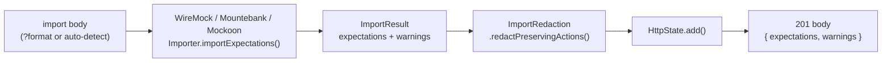

**Model.** Each importer returns an `ImportResult` (`List<Expectation>` + `List<ImportWarning>`); an `ImportWarning` carries `item` (source locator, e.g. `stub[2]`), `construct` (the foreign construct), and `detail`. The three new formats return their result body as `{ "expectations": [...], "warnings": [...] }` (the legacy HAR/Postman/Pact formats keep returning a bare expectation array). `HttpState` handles all six formats in the same `PUT /mockserver/import` branch.

**Redaction.** The migration importers redact through `ImportRedaction.redactPreservingActions(...)` rather than the shared `ImportRedaction.redact(...)`. The wholesale `redact(...)` (used by HAR/Postman) rebuilds each expectation through `FixtureRedactor.redact(...)`, which only carries over *response* actions and resets `Times`/`TimeToLive` — lossy for the migration importers, which also emit `httpForward` (proxy), `httpError` (fault), sequential/random multi-responses, and `Times` (Mountebank `repeat`). `redactPreservingActions(...)` redacts the request and each response individually via the granular `FixtureRedactor.redactRequestDefinition`/`redactResponseObject` clones and re-attaches them to a rebuilt expectation that keeps the original action type, `Times`, `TimeToLive`, priority, id, scenario state, and response mode.

**Coverage & boundaries.** The mappings are documented per importer in the Javadoc of each class and in the [Importing Expectations](https://www.mock-server.com/mock_server/importing_expectations.html) consumer page. Notable boundaries reported as warnings rather than dropped: WireMock `matchesXPath`/`equalToXml`, `delayDistribution`, response `transformers`; Mountebank `tcp`/`smtp` imposters, `and`/`or`/`not` compound predicates, JavaScript `inject`; Mockoon `crud` route type, cookie/path rule targets, `null`/`empty_array` rule operators, and `OR`-combined rules (only the first rule maps).

### LLM Record/Replay (MCP)

The `record_llm_fixtures` MCP tool extends the record-to-expectations workflow for LLM/MCP traffic. After retrieving `RECORDED_EXPECTATIONS`, it applies two additional processing steps:

1. **SSE-aware conversion** (`SseAwareExpectationConverter`) -- detects streaming responses (via `x-mockserver-streamed` header or `text/event-stream` content type) and converts them from static `HttpResponse` to `HttpSseResponse` actions by parsing the captured SSE body into `SseEvent` objects. Truncated captures fall back to static responses with a warning header.

2. **Secret redaction** (`FixtureRedactor`) -- replaces sensitive header values (Authorization, api-key, Cookie, etc.) with `***REDACTED***` so fixture files are safe to commit to version control.

The redacted, SSE-aware expectations are serialized to a JSON file that can be loaded with `load_expectations_from_file` or via `initializationJsonPath` for deterministic replay.

### OpenAPI Contract Verification (MCP)

Two MCP tools provide OpenAPI contract verification:

- **`verify_traffic_against_openapi`** (passive) — retrieves recorded `REQUEST_RESPONSES` from the event log, then validates each request/response pair against an OpenAPI spec using `OpenApiTrafficValidator` (which delegates to `OpenAPIRequestValidator` and `OpenAPIResponseValidator`). Returns a structured per-pair conformance report with request and response validation errors.

- **`run_contract_test`** (active) — parses the OpenAPI spec, builds example requests for each operation using `OpenApiContractTest` (path parameters resolved from spec examples/schema defaults, query parameters, headers, and request bodies generated via `ExampleBuilder`), sends them to a specified base URL via `java.net.HttpURLConnection`, and validates each response with `OpenAPIResponseValidator`. Returns per-operation pass/fail results.

All three tools are registered in `McpToolRegistry` and support filtering (by method/path for traffic verification, by operationId for contract and resiliency tests). The two active tools, and `run_mcp_contract_test`, apply `forwardProxyBlockPrivateNetworks` to the base URL's host before sending and again for each request (see [tls-and-security.md](tls-and-security.md#forward-target-ssrf-validation)).

- **`run_resiliency_test`** (active, negative) -- parses the OpenAPI spec, builds valid example requests using `OpenApiContractTest.buildExampleRequest()`, then generates a bounded mutation catalogue per operation using `OpenApiResiliencyTest` (omitting required fields, type violations, numeric/string boundary violations, oversized strings, malformed JSON). Each mutated request is sent to the target service via `java.net.HttpURLConnection` with a 5-second timeout. Responses are classified as `HANDLED` (4xx) or `UNEXPECTED` (5xx, 2xx, connection error). Returns per-mutation results and per-operation/overall summaries.

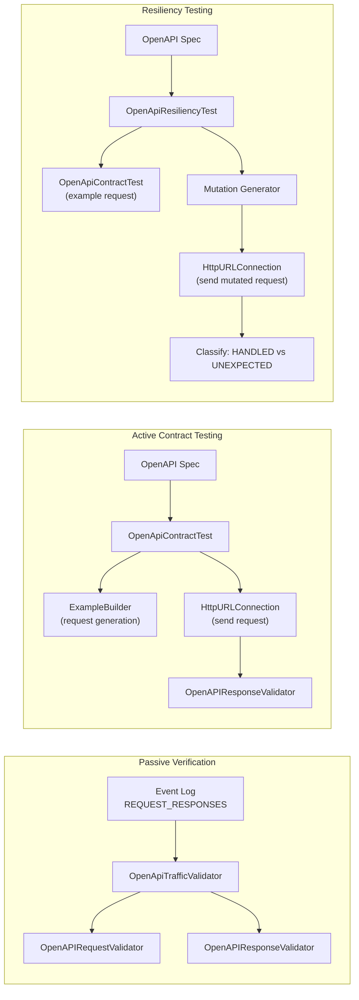

### Correlation ID Retrieval

All log entries for a single incoming HTTP request share the same `correlationId` (a UUID assigned in `HttpState.handle()`). The `PUT /mockserver/retrieve?type=LOGS&correlationId=<id>` endpoint retrieves all log entries for a specific correlation ID, enabling request-to-match-attempts correlation. The Java client exposes this via `MockServerClient.retrieveLogsByCorrelationId(String)`, and the dedicated MCP `retrieve_logs` tool (as well as the generic `raw_retrieve` tool) supports a `correlationId` parameter.

### Typed Log Entry Retrieval

The `LOGS` retrieve type now supports `format=LOG_ENTRIES` to return structured `LogEntry[]` JSON instead of plain text. This enables typed programmatic access to log entries in the Java client:

- `MockServerClient.retrieveLogEntries(RequestDefinition)` — returns `LogEntry[]` matching a request pattern
- `MockServerClient.retrieveLogEntriesByCorrelationId(String)` — returns `LogEntry[]` for a specific correlation ID
- `MockServerClient.retrieveLogEntries(RequestDefinition, long, long)` — time-filtered variant using epoch milliseconds

Deserialization is handled by `LogEntrySerializer.deserializeArray()` using Jackson's `ObjectMapper.readValue()` directly against the `LogEntry` class. Fields that survive the round-trip: `logLevel`, `epochTime`, `timestamp`, `type`, `correlationId`, `port`, `expectationId`, `messageFormat`, `arguments`, `because`. An argument that is the entry's own request or response arrives as its compact string (`GET /path`, `200`), so `getMessage()` re-rendered on the client quotes it in that form; the full request is in the JSON's `httpRequest`, which is not deserialized. Fields serialized by the custom `LogEntrySerializer` but NOT deserialized (returned as `null`): `httpRequest`, `httpResponse`, `httpError`, `expectation`, `throwable` — their setters are `@JsonIgnore` because the types (`RequestDefinition`, `Expectation`) lack default constructors needed for Jackson deserialization.

> **Recorded-request retrieval and `rawBytes` serialization.** `RequestDefinitionSerializer.retrieveRequests(...)` serializes the recorded `HttpRequest` list using `objectWriter.withAttribute("emitRawBytes", Boolean.TRUE)`. The body serializers `JsonBodySerializer` and `JsonBodyDTOSerializer` gate emission of the base64 `rawBytes` field on this per-call Jackson `SerializerProvider` attribute; the attribute is absent on the normal write path so raw bytes are never emitted there. This ensures that a request body whose on-wire bytes differ from the canonical JSON representation (for example, a body with unconventional whitespace) round-trips faithfully when retrieved via `PUT /mockserver/retrieve?type=REQUESTS`.

> **Mock response body encoding (double-gzip prevention).** `MockServerHttpResponseToFullHttpResponse.getBody()` writes the mock response body bytes verbatim to the wire. Unlike the forward path — where the inbound decompressor decodes a `Content-Encoding` body, so a forwarded request is sent as its original wire bytes or, if changed, encoded again (see [Bodies with a Content-Encoding](#bodies-with-a-content-encoding)) — a mock response is never re-encoded. The `Content-Encoding` header is emitted as-is from the expectation, giving callers byte-level control over the response body with no risk of double-compression (issue #2375).

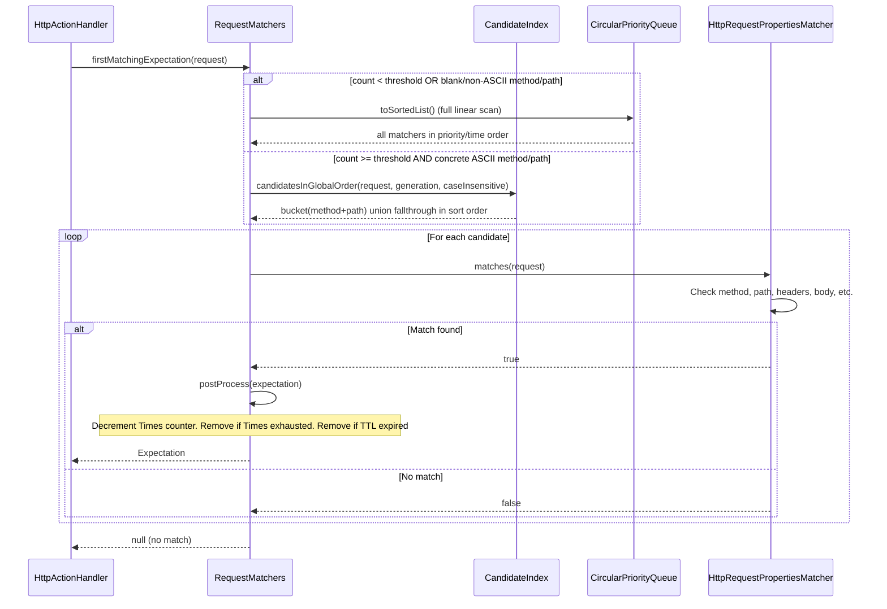

### Protocol Matching and Verification

`HttpRequestPropertiesMatcher` matches on the **negotiated protocol** a request arrived over, exposed
as the `org.mockserver.model.Protocol` enum (`HTTP_1_1`, `HTTP_2`, `HTTP_3` — `HTTP_3` is experimental).
An expectation built with `request().withProtocol(Protocol.HTTP_2)` only matches requests negotiated
over HTTP/2; the same field on a `verify(...)` request asserts how a recorded request arrived. Protocol
is **optional**: a `null` expectation protocol matches a request regardless of the request's protocol
(`protocolMatcher` is built from `null` and the `ExactStringMatcher` treats that as match-any), so
existing expectations that do not specify a protocol are unaffected.

How the request's protocol is tagged (server-trusted, not client-supplied):

| Arrival path | Tagged as | Where |
|--------------|-----------|-------|
| HTTP/1.1 (TCP) | `HTTP_1_1` (or `null` for mocking) | `FullHttpRequestToMockServerHttpRequest` |
| HTTP/2 via ALPN (`h2`) | `HTTP_2` | ALPN negotiation in `PortUnificationHandler` |
| HTTP/2 cleartext (`h2c`) | `HTTP_2` | `PortUnificationHandler` sets a trusted negotiated-protocol channel attribute (the `Upgrade` header alone is not trusted) |
| HTTP/3 over QUIC (`h3`) | `HTTP_3` | `Http3RequestBridge.toHttpRequest` — the `h3` ALPN identifier is always trusted, so there is no header-spoofing concern |

The `protocol` field round-trips through `HttpRequestDTO`, the request serializers
(`HttpRequestSerializer` / `HttpRequestDTOSerializer`), `RequestDefinitionDTODeserializer`, the request
JSON Schema (`protocol.json`), and the embedded OpenAPI model — and through the **pretty-printed
retrieval DTO** (`HttpRequestPrettyPrintedDTO`), so a request retrieved via
`retrieveRecordedRequests(...)` carries the protocol it arrived over for HTTP/2 and HTTP/3 alike.

### Post-Processing

After a match, `postProcess()`:
1. Decrements the `Times` counter
2. Checks if `Times` is exhausted → removes expectation
3. Checks if `TimeToLive` has expired → removes expectation
4. Notifies `MockServerMatcherListener`s of the change

## Action Types

Each `Expectation` binds a request matcher to exactly one action. There are 19 action types across two categories:

### Response Actions

| Type | Handler | Description |
|------|---------|-------------|
| `RESPONSE` | `HttpResponseActionHandler` | Returns a static `HttpResponse`. When the response body is a `FileBody` it is materialised — the file is read and its contents returned — verbatim when no `templateType` is set, or rendered as a template against the request when it carries a `templateType` (`VELOCITY`/`MUSTACHE`). Materialisation of a `FileBody` produced by *any* response path (callbacks, response templates, forward `responseOverride`) is centralised in `FileBodyMaterialiser`, invoked from the write funnels — see [Templated response body files](#templated-response-body-files-filebody--templatetype) |
| `RESPONSE_TEMPLATE` | `HttpResponseTemplateActionHandler` | Evaluates a template (Velocity/Mustache/JavaScript) to generate the response. The template text may be supplied inline (`template`) or loaded from a file (`templateFile`); inline takes precedence — see `HttpTemplate.getTemplateContent()`. If the rendered output is not a valid `HttpResponse` (fails JSON-schema validation, or throws while transforming), `HttpTemplateOutputDeserializer` logs a request-correlated `TEMPLATE_GENERATION_FAILED` event carrying the validation error and the offending rendered output, and the action degrades to a `404 Not Found` (unchanged client semantics — the failure is surfaced in the log, not swallowed as a success-looking `EXPECTATION_RESPONSE`) |
| `RESPONSE_CLASS_CALLBACK` | `HttpResponseClassCallbackActionHandler` | Loads a Java class implementing `ExpectationResponseCallback`, invokes `handle(request)` |
| `RESPONSE_OBJECT_CALLBACK` | `HttpResponseObjectCallbackActionHandler` | Sends request to a WebSocket-connected client, awaits response callback |
| `SSE_RESPONSE` | `HttpSseResponseActionHandler` | Streams Server-Sent Events with per-event delays, optional `closeConnection` flag. An optional `templateType` (`VELOCITY`/`MUSTACHE`/`JAVASCRIPT`) renders each event's `data` payload as a response template per event — see *Templated streaming payloads* below |
| `WEBSOCKET_RESPONSE` | `HttpWebSocketResponseActionHandler` | Upgrades to WebSocket and sends a sequence of `WebSocketMessage` frames with per-message delays. An optional `templateType` renders each text frame per message (binary frames are never templated). When subprotocol is `graphql-transport-ws`/`graphql-ws` with a `graphqlSubscriptionFilter`, installs `GraphQLSubscriptionHandler` for the graphql-transport-ws protocol state machine |
| `GRPC_STREAM_RESPONSE` | `GrpcStreamResponseActionHandler` | Streams gRPC-framed protobuf messages with per-message delays and grpc-status trailers (Netty only; returns 501 in WAR). A per-message `templateType` renders the message `json` as a response template before protobuf encoding |
| `GRPC_BIDI_RESPONSE` | `GrpcBidiRouterHandler` / `GrpcBidiStreamHandler` | Bidirectional gRPC streaming via the multiplex pipeline (requires `grpcBidiStreamingEnabled=true`; returns 501 otherwise or in WAR) |
| `BINARY_RESPONSE` | (inline in `BinaryRequestProxyingHandler`) | Returns raw binary bytes when a `BinaryRequestDefinition` matches |
| `DNS_RESPONSE` | (inline in `DnsRequestHandler`) | Returns DNS response records when a `DnsRequestDefinition` matches a UDP DNS query |

> **Concurrent writes to a shared `HttpResponse` are not safe** — writing from multiple threads simultaneously tears `KeysToMultiValues` header arrays (NPE / AIOOBE). In practice this is not reachable: the mock path clones the stored response per request before writing (`ResponseWriter.addConnectionHeader`), control-plane responses are built per request, and the dashboard communicates via WebSocket frames rather than shared response objects. `ResponseWriterConcurrencySafetyTest` guards the per-request-clone invariant on the mock path.

### Forward Actions

| Type | Handler | Description |
|------|---------|-------------|
| `FORWARD` | `HttpForwardActionHandler` | Forwards to a specified host:port:scheme. The connect path receives an `InetSocketAddress.createUnresolved` address so Netty's event-loop resolver performs DNS lookup off the calling thread rather than blocking it. |
| `FORWARD_TEMPLATE` | `HttpForwardTemplateActionHandler` | Template generates the forwarding request |
| `FORWARD_CLASS_CALLBACK` | `HttpForwardClassCallbackActionHandler` | Java class modifies the request before forwarding |
| `FORWARD_OBJECT_CALLBACK` | `HttpForwardObjectCallbackActionHandler` | WebSocket client modifies request before forwarding |
| `FORWARD_REPLACE` | `HttpOverrideForwardedRequestActionHandler` | Applies request/response overrides and modifiers |
| `FORWARD_VALIDATE` | `HttpForwardValidateActionHandler` | Forwards and validates request/response against an OpenAPI spec |
| `FORWARD_WITH_FALLBACK` | `HttpForwardWithFallbackActionHandler` | Forwards to upstream; returns a fallback mock response on 5xx or timeout |

Every forward action sends through `HttpForwardAction.sendRequest`, which first applies `forwardProxyBlockPrivateNetworks` (`InetAddressValidator.validateForwardTarget`) to the destination and answers a refused one with `502` (see [tls-and-security.md](tls-and-security.md#forward-target-ssrf-validation)).

### Forward with Fallback

The `FORWARD_WITH_FALLBACK` action combines MockServer's proxy and mock capabilities: it
forwards the request to a real upstream service, but if the upstream returns a status code
matching the fallback criteria (default: 500-599) or the connection fails/times out, a
pre-configured fallback response is returned instead of the error.

This is useful for resilience testing and development against partially-available services:
the mock provides a reliable baseline while the upstream is flaky or under development.

Configuration via `HttpForwardWithFallback`:
- `httpForward` -- the upstream target (host, port, scheme)
- `fallbackResponse` -- the mock response to return when fallback triggers
- `fallbackOnStatusCodes` -- list of status codes that trigger fallback (default: 500-599)
- `fallbackOnTimeout` -- whether to fall back on connection errors/timeouts (default: true)

> **An absent `fallbackOnTimeout` is not the same as `false`.**
> `HttpForwardWithFallbackActionHandler` reads it as
> `action.getFallbackOnTimeout() == null || action.getFallbackOnTimeout()`, so **absent means
> `true`** — and no schema declares a `default`, so the handler is the only authority. A client
> that omits the field to mean "off" gets fallback anyway. Anything generating or round-tripping
> this action must emit the value explicitly rather than omitting it when false; the dashboard
> code generator did the latter and produced snippets that contradicted the UI selection.
> This is the same asymmetry as `closeConnection` on the streaming actions (see
> [ai-protocol-mocking.md](ai-protocol-mocking.md)).

### Forward Retry & Per-Upstream Circuit Breaker

All matched FORWARD-class actions (`FORWARD`, `FORWARD_TEMPLATE`, `FORWARD_CLASS_CALLBACK`, `FORWARD_REPLACE`, `FORWARD_VALIDATE`, `FORWARD_WITH_FALLBACK`, `FORWARD_OBJECT_CALLBACK`) funnel through `HttpForwardAction.sendRequest(...)`, the single place that calls `NettyHttpClient`. Two **opt-in, default-off** resilience controls wrap that call so existing behaviour (forward exactly once, always attempt) is byte-for-byte unchanged unless configured.

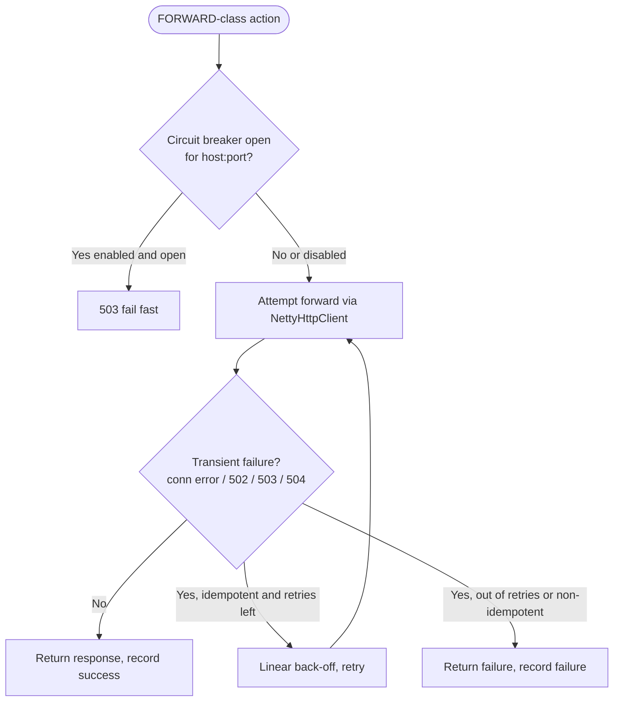

- **Retry** (`ForwardRetryPolicy`, config `forwardProxyRetryCount` / `forwardProxyRetryBackoffMillis`): re-issues the upstream call up to *N* times when an attempt is a transient failure — a connection-level exception or an upstream **502/503/504**. Only **idempotent** methods (GET, HEAD, OPTIONS, PUT, DELETE, TRACE) are retried; POST/PATCH are never retried so a request is never executed twice. Retries are chained asynchronously off the response future (never blocking the event loop) with a linear back-off (`backoff × attemptNumber`). Default `forwardProxyRetryCount=0` = forward exactly once.
- **Circuit breaker** (`ForwardCircuitBreaker`, config `forwardProxyCircuitBreakerEnabled` + threshold/window): a process-wide singleton keyed by upstream `host:port`. After `forwardProxyCircuitBreakerFailureThreshold` consecutive failures the breaker trips **open** and `sendRequest` fails fast with a 503 (no upstream attempt) for `forwardProxyCircuitBreakerWindowMillis`; then **half-open** admits a single trial request — a success closes it, a failure re-opens it. The retry policy and breaker compose: a request's final outcome (after any retries) feeds `recordSuccess`/`recordFailure`, or `recordNeutral` when it says nothing about the upstream's health (a configuration error, a header-limit refusal, or an upstream proxy that could not be reached): that leaves the state and the failure count as they were and only frees a half-open trial, so the next request probes the upstream. A target `forwardProxyBlockPrivateNetworks` refuses is turned away before the breaker is consulted, so it is not counted either and takes no trial. The open-upstream count is exported as the `mock_server_upstream_circuit_open` gauge (see [metrics.md](metrics.md)) and reset on `HttpState.reset()`.

The unmatched speculative-proxy path (`HttpActionHandler`, which calls `NettyHttpClient` directly) is intentionally **not** wrapped by these controls; they apply to matched forward expectations. Self-loopback relay and the HTTP/2/HTTP/3 forward paths are unaffected (the breaker only keys on a resolvable host, and retry only engages for idempotent methods when explicitly configured).

### Forward Upstream Protocol Selection (HTTP/1.1 vs HTTP/2)

`HttpForwardAction.sendRequest(...)` chooses the protocol used for the **upstream** forward connection:

- **Default (`forwardProxyHttp2Enabled=false`)** — the forwarded request's protocol is nulled, so `NettyHttpClient` uses HTTP/1.1 for every forward regardless of the inbound request's protocol. This is the historical behaviour and is byte-identical to before the property existed.
- **Opt-in (`forwardProxyHttp2Enabled=true`)** — the **inbound request's protocol is preserved** on the forwarded request. An HTTP/2 inbound request is therefore forwarded to the upstream as HTTP/2; an inbound request with no protocol marker still forwards as HTTP/1.1.

HTTP/2 upstream forwarding relies on the existing HTTP/2 client stack: `NettyHttpClient` only flows HTTP/2 over **TLS with ALPN** (via `HttpClientInitializer` / `HttpOrHttp2Initializer`). A non-secure HTTP/2 forward is automatically **downgraded to HTTP/1.1** by `NettyHttpClient`, so there is no h2c (cleartext / prior-knowledge) forward path. HTTP/2 forward connections **are pooled and reused** (`HttpForwardConnectionPool`, keyed by host/port/scheme/protocol so HTTP/1.1 and HTTP/2 channels never mix): after a stream completes its parent connection is returned to the pool and the next forward to the same upstream opens a fresh stream on it (`HttpClientHandler#tryReleaseHttp2ParentToPool`, gated by `NettyHttpClient.POOL_KEEP_PARENT`) instead of opening — and closing — a new TCP/TLS connection per request. This matters most for a client that negotiated HTTP/2 in an HTTPS CONNECT (MITM) tunnel: without it every forwarded request churned an upstream connection and could exhaust ephemeral ports under sustained load. The pool reuses one parent per in-flight request (a fresh stream each), so concurrency is bounded by the pool size rather than by cross-stream multiplexing. An HTTP/2 parent is only returned to the pool when the upstream answered on our own **client-initiated (odd) stream** — plain HTTP/2. Some servers (notably MockServer's own legacy connection-adapter HTTP/2 server) answer on a **server-initiated (even) stream**; the multiplex forward client tolerates that only for a fresh connection per request, so a response seen on an even stream leaves the parent unpooled (closed after the one response, the historical behaviour) rather than desynchronising a reused connection. A pooled connection can be closed by the upstream (idle timeout, GOAWAY, restart) after it is acquired; an idempotent request (GET, HEAD, PUT, DELETE, OPTIONS, TRACE) that fails on a **reused** connection before any response byte is retried once on a fresh connection, while a non-idempotent request fails as before so it is never sent twice. **Limitations:** streaming (SSE) forwards remain excluded from pooling on all protocols. An upstream's response headers and trailers are read up to `maxHeaderSize` on every protocol, and a larger response fails the forward with a `502` that says so: see [netty-pipeline.md → Upstream response headers](netty-pipeline.md#upstream-response-headers).

### Host Header Auto-Adjustment

When forwarding requests via `FORWARD_REPLACE` or `FORWARD_TEMPLATE` actions, MockServer can automatically adjust the `Host` header to match the target server. This is controlled by the `forwardAdjustHostHeader` configuration property (default: `true`).

This prevents HTTP 421 "Misdirected Request" errors that occur when the target server validates the Host header against its own server name. The adjustment uses the `socketAddress` on the request to compute the correct Host value. If an explicit Host header is provided in the request override, it is always preserved.

The `FORWARD` action type (`HttpForwardActionHandler`) has always adjusted the Host header to match the forward target; this behaviour is unchanged.

### Error Action

| Type | Handler | Description |
|------|---------|-------------|
| `ERROR` | `HttpErrorActionHandler` | Writes raw bytes and/or drops the connection. On HTTP/1.1, when the connection stays open, it fires `HttpExchangeEndedEvent` so the exchange tracker and transport timer end the exchange the raw bytes (or the missing response) stood in for. Before it writes raw bytes it fires `RawResponseBytesEvent` with their length, which lets a CONNECT/SOCKS relay hand them to its client as they are (see [netty-pipeline.md](netty-pipeline.md#raw-bytes-responses-through-a-tunnel)) |

### LLM Response Action

| Type | Handler | Description |
|------|---------|-------------|
| `LLM_RESPONSE` | `HttpLlmResponseActionHandler` | Encodes a provider-correct LLM response from a high-level `Completion` |

`HttpLlmResponseActionHandler` routes to the appropriate `ProviderCodec` based on the `HttpLlmResponse.provider` field. For non-streaming completions, the codec produces an `HttpResponse` directly. For streaming completions, the codec produces a `List<SseEvent>` via `StreamingPhysicsExpander`, which is then handed to `HttpSseResponseActionHandler` for delivery.

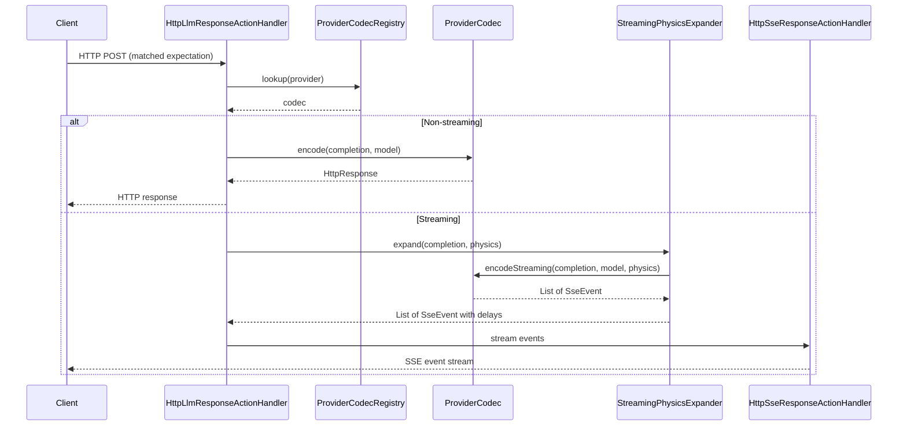

See [LLM Mocking](llm-mocking.md) for the full architecture.

### Sequential/Cycling Response Dispatch

When an expectation is configured with `httpResponses` (a list of `HttpResponse` objects) instead of a single `httpResponse`, each match returns the next response in the list. The selection is controlled by `responseMode`:

- **`SEQUENTIAL`** (default): Returns responses in order, cycling back to the first after the last. Uses `(matchCount - 1) % size` because `matchCount` is incremented in `consumeMatch()` before `getPrimaryAction()` is called.
- **`RANDOM`**: Returns a random response from the list on each match (uniform probability).
- **`WEIGHTED`**: Returns a response chosen probabilistically by relative weight. Weights are supplied via the index-aligned `responseWeights` list on the expectation (e.g. `[90, 10]` selects the first response ~90% of the time and the second ~10%). A missing or non-positive weight defaults to `1`; if the total effective weight is non-positive, selection falls back to uniform random. Implemented as cumulative-weight selection in `Expectation.selectWeightedResponse()`.
- **`SWITCH`** (lightweight per-expectation hit-count branching): Serves the first response for the first `switchAfter` matches, then advances one index in `httpResponses` for every further block of `switchAfter` matches, clamping at the last response. The common two-response case serves the first response for `switchAfter` calls and the second for every call after — "respond differently after the Nth call" for a single expectation without a full scenario. The `switchAfter` integer is a serialized field (defaults to `1` when unset, i.e. advance on each call); it is ignored outside `SWITCH` mode. Implemented as `index = min((matchCount - 1) / switchAfter, size - 1)` in `Expectation.selectSwitchedResponse(...)`. For complex multi-endpoint flows a full scenario (`scenarioName`/`scenarioState`) remains the right tool; `SWITCH` is the minimal single-expectation option.

The cycling/selection logic is in `Expectation.getPrimaryAction()` -> `selectFromResponses()`. The `matchCount` is tracked per-expectation via an `AtomicInteger` and is runtime-only state (`@JsonIgnore`). `responseWeights` and `switchAfter` are serialized fields that round-trip in expectation JSON; weights are ignored unless `responseMode` is `WEIGHTED`, and `switchAfter` is ignored unless `responseMode` is `SWITCH`.

**Force a variant per request (`x-mockserver-response-index`):** an incoming request may carry the `x-mockserver-response-index` header (0-based; `Expectation.FORCE_RESPONSE_INDEX_HEADER`) to force which `httpResponses` entry it is served, overriding `responseMode` for that one request. Selection resolves via the `Expectation.getPrimaryAction(Integer)` overload: a valid in-bounds index (per `isForcedResponseServe`) returns that exact response with **peek semantics** — the request is still a real match (it consumes a `Times` unit and increments `matchCount`), but it does **not** advance the response-sequence rotation.

The rotation position lives on its own counter, `rotationCount`, separate from `matchCount`. At **match time** (`consumeMatch(Integer)` / `consumeMatchLocally(Integer)`, called from `RequestMatchers` which has the request in hand), a NORMAL request advances `rotationCount` and snapshots it into a per-thread `lastRotationSnapshot`; a FORCED request increments only `matchCount` and snapshots the *un-advanced* `rotationCount`. `selectFromResponses()` derives both `SEQUENTIAL` and `SWITCH` positions from that thread-local snapshot. Because a forced request never touches `rotationCount`, the collision-free invariant (each normal match gets a distinct, monotonic position snapshotted at match time) holds unconditionally under concurrency — `AtomicInteger.incrementAndGet()` guarantees each caller sees a different value, so no two normal matches can receive the same sequence position. There is no resolution-time compensation read that could race normal traffic. No dedicated concurrency test currently pins this property; `MockServerMatcherSequentialResponsesTest` covers single-threaded behaviour only. Invalid, non-integer, or out-of-bounds values are ignored (normal selection applies) — never an error — and single-response expectations ignore the header.

The control header is **not** stripped from the request object during dispatch (that object is shared with the `RECEIVED_REQUEST` log entry, which stores requests by reference, so mutating it would non-deterministically drop the header from recordings). Instead it is filtered out only when the outbound forward/proxy request is built, in `MockServerHttpRequestToFullHttpRequest.setHeader` (and, for WebSocket passthrough, in `WebSocketProxyRelayHandler.isSuppressedRelayHeader`) (alongside the hop-by-hop header filter). **Recorded traffic therefore deterministically retains the header, and forwarded/proxied upstream requests never carry it.** Matching is unaffected because the header is still present on the request throughout matching and action resolution.

### Rate Limiting (`rateLimit` clause)

An expectation may carry a declarative, protocol-agnostic `rateLimit` clause (a sibling of `chaos` — see [docs/code/domain-model.md](domain-model.md)). When a matched expectation is over-limit for the current window, MockServer returns a deterministic `errorStatus` (default `429`) response — carrying `Retry-After`, `X-RateLimit-Limit`, `X-RateLimit-Remaining` (`0`), and `X-RateLimit-Reset` (unix seconds) — **instead of** the normal response; within the limit the normal response is returned unchanged. An expectation without a `rateLimit` clause behaves and serializes byte-for-byte identically to before.

`dispatchPrimaryAction()` reads `expectation.getRateLimit()` once per matched request and threads it into the single write path (`writeResponseActionResponse` for `RESPONSE` / `RESPONSE_TEMPLATE` / `RESPONSE_CLASS_CALLBACK`, and `writeForwardActionResponse` for the `FORWARD` family). The check `rateLimitResponseOrNull(rateLimit, expectationId)` calls `RateLimitRegistry.getInstance().tryAcquire(...)` — which **mutates** registry state — so it runs **exactly once** per matched request, in the write path only. The **streaming** response actions — `SSE_RESPONSE`, `GRPC_STREAM_RESPONSE`, and `WEBSOCKET_RESPONSE` — are also gated: the same `rateLimitResponseOrNull(rateLimit, expectationId)` check runs once per matched request at the top of each stream case, so an over-limit request receives the synthetic `429` (via `writeResponseActionResponse`) **instead of** opening the stream; within the limit the stream proceeds unchanged. Still deferred (these thread `null` and so are NOT gated by the general `rateLimit` clause): the matched-expectation `LLM_RESPONSE` (which has its own token-based TPM/TPD limiter — see [docs/code/llm-mocking.md](llm-mocking.md)), the object-callback response action, and the anonymous/unmatched proxy-pass paths.

Precedence inside the write path (highest first): connection-drop chaos → **`rateLimit` (429)** → chaos `quota` (`HttpQuotaRegistry`) → probabilistic chaos `error` → real-response chaos (truncate/malformed/slow). The rate-limit gate is checked before the chaos quota and before the probabilistic chaos error, so a configured `rateLimit` deterministically wins.

The counter is keyed by `rateLimit.name` (or, when `name` is omitted, the expectation id), so expectations sharing a `name` share one counter. Two algorithms are supported: `FIXED_WINDOW` (`limit` per `windowMillis`) and `TOKEN_BUCKET` (`burst` capacity refilling at `refillPerSecond`). State lives in the node-local `RateLimitRegistry` (`org.mockserver.ratelimit`), is cleared on `HttpState.reset()`, and is bounded by `rateLimitMaxNamedQuotas` (fail-open on a new key once the cap is reached). v1 is node-local; see [docs/code/clustered-state.md](clustered-state.md) for the clustering trade-off.

### RecoverAfter Selection (Fail-Then-Succeed)

When a matched RESPONSE action carries a `recoverAfter` clause (`HttpResponse.getRecoverAfter()`, see [domain-model.md](domain-model.md#recoverafter-retrybackoff-recovery)), the dispatcher chooses between the failure response and the configured success response *before* the response is materialised. The helper is `HttpActionHandler.selectRecoveryResponse(action, expectation, request, capturedMatchCount)`:

- It is applied in the `dispatchPrimaryAction` RESPONSE case (the selected response replaces `(HttpResponse) action` in the `getHttpResponseActionHandler().handle(...)` call) **and** in the early-action RESPONSE path of `processEarlyAction` (respond-before-body), so both dispatch routes behave identically.
- Selection is a pure function of the 1-based attempt `n`: by default `n = capturedMatchCount` (already in scope, captured before scheduling to avoid races). When `recoverAfter.idempotencyHeader` is set and present on the request, `n = RecoveryAttemptRegistry.getInstance().nextAttempt(expectation.getId(), headerValue)`; when the header is configured but absent, it falls back to `capturedMatchCount`. The keyed registry is incremented **only** on the keyed path, so the default path adds no new state or overhead.
- When `n <= failTimes` the failure response is served — the configured `failResponse`, or a default `503 Service Unavailable` when none is configured. Otherwise the configured response is returned unchanged (identity). A `null`/`<= 0` `failTimes`, or a `null` `recoverAfter`, returns the action unchanged, so a response without the clause is byte-for-byte unaffected.
- Selection is independent of `Times` (a failing attempt does not consume an extra `Times` use) and runs before the chaos/breakpoint pipeline inside `dispatchMockResponseWithBreakpoint` / `writeResponseActionResponse`, so it composes with chaos faults applied to whichever response was selected.

**Scope — the `RESPONSE` action only.** `recoverAfter` is a field on `HttpResponse`, and `selectRecoveryResponse` is interposed only in the `case RESPONSE` arm (both the early-response branch and the main dispatch path). `RESPONSE_TEMPLATE` (`HttpTemplate`) and `RESPONSE_CLASS_CALLBACK` (`HttpClassCallback`) carry no `HttpResponse`, so they cannot express the clause and are never passed through `selectRecoveryResponse`. It is likewise **not expressible on the `FORWARD` family**: those actions carry no `HttpResponse`, and the six `dispatchForwardWithBreakpoint(...)` call sites never consult `selectRecoveryResponse`. "Fail N forward attempts then forward for real" is deliberately deferred (it overlaps the forward-path `HttpChaosProfile` fault surface and would be an M–L cross-cutting change across the forward action models) — see the decision record at [docs/code/decisions/recover-after-is-response-only.md](decisions/recover-after-is-response-only.md).

`RecoveryAttemptRegistry` is a node-local singleton keyed `expectationId + NUL + keyValue` (a NUL separator avoids collisions because the client-settable expectation id can contain a space). It is a **bounded** registry — a synchronized access-ordered `LinkedHashMap<String, AtomicInteger>` that evicts the least-recently-used key once 10,000 keys are held (mirroring `DnsIntentRegistry`), so client-supplied idempotency-key values (typically fresh UUIDs) cannot exhaust the heap; an evicted key restarts its failure window at attempt 1, matching `reset()` semantics. It is cleared in `HttpState.reset()` alongside the other action-state registries.

### Before & After Actions

An expectation can carry two optional ordered lists of side-effect actions, both using the same `AfterAction` type (exactly one of `httpRequest`, `httpClassCallback`, or `httpObjectCallback`, plus an optional `Delay`):

- **`afterActions`** — executed *after* the primary response is sent. Dispatched fire-and-forget via `HttpActionHandler.dispatchSideAction(...)` from `expectationPostProcessor` (which also runs `HttpState.postProcess`). Responses are discarded and failures are only logged, so they never alter or delay the client response.
- **`beforeActions`** — executed *before* the primary response and able to gate it. When an expectation has `beforeActions`, `processAction` wraps `runBeforeActions(...)` plus `dispatchPrimaryAction(...)` in `scheduler.submit(runnable, synchronous)` so any blocking wait runs off the event loop (async) or inline (synchronous), mirroring forward-action threading.

`runBeforeActions` iterates the list applying three optional per-action controls that are meaningful only here (after-actions ignore them):

- `blocking` (default `true` when null) — whether the response waits for the action.
- `timeout` (a `Delay`; falls back to `configuration.maxSocketTimeoutInMillis()`) — max wait for a blocking action.
- `failurePolicy` (`FAIL_FAST` or `BEST_EFFORT`, default `BEST_EFFORT`) — outcome when a blocking action fails or times out.

Only `httpRequest` (webhook) before-actions can actually block: they are sent via the synchronous `httpClient.sendRequest(req, timeoutMillis, MILLISECONDS)` (throws on error/timeout). On failure, `FAIL_FAST` writes a `502` (`badGatewayResponse().withBody("before-action failed: ...")`) and `runBeforeActions` returns `false` so the primary action is skipped; `BEST_EFFORT` logs and continues. Non-blocking before-actions and callback before-actions are dispatched fire-and-forget via `dispatchSideAction` (a WARN is logged if `blocking=true` is set on a callback). When `runBeforeActions` returns `false`, `expectationPostProcessor.run()` is still invoked (it is idempotent via `compareAndSet`) so matcher state — `responseInProgress`, `times` exhaustion — is cleaned up and after-actions still fire after the `502`. Webhook fields support `{$request.*}` runtime expressions, resolved against the triggering request via `OpenApiRuntimeExpressionResolver`.

#### Unified Ordered Steps

When an expectation has `steps` (a `List<ExpectationStep>`), the dispatch pipeline is:

1. **Pre-responder steps** — extracted by `Expectation.getPreResponderSteps()`, dispatched by `HttpActionHandler.runStepsPreResponder()`. Each step follows the same blocking/timeout/failurePolicy semantics as before-actions. Webhook steps can block; callback and forward side-effect steps are fire-and-forget.
2. **Responder step** — the single step with `responder = true`. Its action is resolved via `Expectation.resolveStepAction()` and dispatched through the existing `dispatchPrimaryAction()` path (the normal action-type switch).
3. **Post-responder steps** — extracted by `Expectation.getPostResponderSteps()`, dispatched by `HttpActionHandler.dispatchPostResponderSteps()` as fire-and-forget side-effects via `dispatchStepSideEffect()`.

Steps and `beforeActions`/`afterActions` are independent: when `steps` is present it determines the pre/post pipeline ordering. Any existing `afterActions` still fire after the steps pipeline completes (from `expectationPostProcessor`). Validation is enforced at upsert time in `HttpState.add()` via `Expectation.validateSteps()`.

### Template Engines

Three template engines are supported for `RESPONSE_TEMPLATE` and `FORWARD_TEMPLATE`:

| Engine | Class | Template Variable |
|--------|-------|-------------------|
| Velocity | `VelocityTemplateEngine` | `$request` |
| Mustache | `MustacheTemplateEngine` | `request` (with `#jsonPath` and `#xPath` lambdas) |
| JavaScript | `JavaScriptTemplateEngine` | `request` (GraalJS / GraalVM Polyglot — see note below) |

> **JavaScript requires the optional GraalJS engine.** Velocity and Mustache are always available, but the GraalVM Polyglot (`org.graalvm.polyglot:polyglot` + `js`) dependency is `<optional>true</optional>` and is **not** bundled in the standard netty jar-with-dependencies or Docker image (`POLYGLOT_AVAILABLE=false` there). If a `JAVASCRIPT` template is actually used without GraalJS on the classpath, `JavaScriptTemplateEngine` **fails loudly** with a clear `RuntimeException` ("JavaScript response templates require the GraalJS engine, which is not on the classpath...") instead of silently degrading. Add the dependency, or run the `graaljs` Docker image variant, to enable it.

All engines receive built-in dynamic variables from `TemplateFunctions.BUILT_IN_FUNCTIONS` (`now`, `now_epoch`, `now_iso_8601`, `uuid`, `rand_int`, `rand_bytes`, etc.) and five helper objects from `TemplateFunctions.BUILT_IN_HELPERS`:

| Helper | Variable | Description |
|--------|----------|-------------|
| `JwtTemplateHelper` | `jwt` | Generate signed JWTs (`jwt.generate()`, `jwt.generate(claims)`) and JWKS (`jwt.jwks()`) for OAuth2/OIDC testing |
| `StringTemplateHelper` | `strings` | String manipulation: `trim`, `capitalize`, `uppercase`, `lowercase`, `urlEncode`, `urlDecode`, `base64Encode`, `base64Decode`, `substringBefore`, `substringAfter`, `length`, `contains`, `replace` |
| `JsonTemplateHelper` | `jsonTransform` | JSON manipulation: `merge`, `sort`, `arrayAdd`, `remove`, `prettyPrint`, `field`, `size` |
| `DateTemplateHelper` | `dates` | Date/time arithmetic: `format(pattern)`, `plusSeconds/Minutes/Hours/Days`, `minusSeconds/Minutes/Hours/Days`, `epochSeconds`, `epochMillis`, `epochSecondsPlus/Minus` |
| `MathTemplateHelper` | `calc` | Math operations: `randomInt(min,max)`, `randomDouble()`, `abs`, `min`, `max`, `round(value,scale)`, `format(value,pattern)`, `ceil`, `floor` |

Helper objects are registered as template context variables, so methods are called directly (e.g., Velocity: `$strings.uppercase($!request.method)`, JavaScript: `dates.plusHours(1)`, Mustache: `{{ jwt }}`).

#### Templates loaded from a file

The template text for `RESPONSE_TEMPLATE` and `FORWARD_TEMPLATE` can be stored in an external file instead of being embedded inline in the expectation. Set `templateFile` (a classpath-or-filesystem path resolved by `FileReader.readFileFromClassPathOrPath`) on the `httpResponseTemplate` / `httpForwardTemplate`. `HttpTemplate.getTemplateContent()` returns the inline `template` when present, otherwise reads `templateFile`; the action handlers and `HttpOverrideForwardedRequestActionHandler` all call `getTemplateContent()`. This keeps the full template machinery (rendering an `HttpResponseDTO`/`HttpRequestDTO`) while letting large templates live outside the expectation JSON.

#### Templated response body files (`FileBody` + `templateType`)

A response body that is a `FileBody` is **materialised** — the referenced file is read and its contents become the body — so the file *contents*, not the file *path* string, reach the wire. A `templateType` of `VELOCITY` or `MUSTACHE` renders the file through `TemplateEngine.renderTemplate(...)` (raw text render — no `HttpResponseDTO` deserialization) against the request, preserving the declared content type; with no `templateType` (or an unsupported one such as `JAVASCRIPT`) the file is served verbatim — a text content type yields the decoded string, a binary or absent content type yields the raw bytes intact so images/PDFs/archives are not charset-corrupted. This differs from `RESPONSE_TEMPLATE`: the file is just the **body** payload, while the surrounding status code, headers, etc. come from the response. `JAVASCRIPT` is intentionally **not** supported for body-file templating (JS templates return structured objects, not text) — use `RESPONSE_TEMPLATE` with a JavaScript template for that.

The materialisation logic lives in a single shared component, `FileBodyMaterialiser` (`mock/action/http/`, constructed with the `Configuration` + `MockServerLogger`, caching the Velocity/Mustache engines). It is invoked from the two response-write funnels in `HttpActionHandler` — `writeResponseActionResponse` (the static `RESPONSE`, object-callback, class-callback, response-template and SSE paths) and `writeForwardActionResponse` (the forward `responseOverride`) — so a `FileBody` produced by **any** of those five producers, and the shared WAR/servlet path, serves the file contents. It is idempotent for the static path: `HttpResponseActionHandler.handle` has already replaced the `FileBody` with a `String`/`Binary` body, so by the funnel it is no longer a `FileBody` and is not read twice. The request is only available on the primary/secondary `RESPONSE` dispatch paths, so `HttpResponseActionHandler`'s no-request `handle(httpResponse)` overload leaves a *templated* `FileBody` untouched (it must not template without a request); the funnels always pass the request. A missing/unreadable file throws a typed `FileBodyException` (`org.mockserver.file`) that the funnels turn into a clean, logged `500` whose body does not leak the path.

The same `FileBodyMaterialiser` also backs **request** matching: `BodyMatcherBuilder`'s `FILE` case reads the file verbatim and matches the request body against its exact contents (an `ExactStringMatcher` for a text content type, a `BinaryMatcher` otherwise) — previously there was no `FILE` case, so a `FileBody` request matcher was silently ignored.

#### Templated streaming payloads (SSE / WebSocket / gRPC stream + `templateType`)

Streaming responses can render each pushed payload from a response template instead of a fixed string. Set an optional `templateType` (`VELOCITY`, `MUSTACHE` or `JAVASCRIPT`) on `httpSseResponse` / `httpWebSocketResponse` (action-level, applies to every event/message), or per-message on a gRPC `grpcStreamResponse` message. The shared `StreamTemplateRenderer` (`mock/action/http/`) renders each payload against the **triggering request** using exactly the same engines and request/template context (`request.*`, `jsonPath`, the built-in helpers, `faker`, `scenario`) as `HttpResponseTemplateActionHandler`, and caches the engines lazily per handler instance:

- **SSE** — `HttpSseResponseActionHandler` renders each `SseEvent`'s `data` payload just before the event is written, producing a rendered copy so a reused expectation renders freshly per request (the stored event is never mutated).
- **WebSocket** — `HttpWebSocketResponseActionHandler` renders each text `WebSocketMessage` before the frame is written (and before stream-frame breakpoint interception, so breakpoints observe the rendered bytes). Binary frames are never templated.
- **gRPC server-stream** — `GrpcStreamResponseActionHandler` renders the message `json` against the request before protobuf encoding when the message carries a `templateType`.

Text-based engines (Velocity/Mustache) render the payload directly via `renderTemplate(...)`. JavaScript uses `TemplateEngine.renderTemplateText(...)` (new): the JS engine executes the template's `handle(request)` function and coerces the return value to text (a returned string is used verbatim, any other value is `JSON.stringify`'d) — this is what makes JS usable for a text fragment, since the response-object `renderTemplate` path is unsupported for JS. When `templateType` is absent every payload is emitted byte-for-byte unchanged (opt-in, non-breaking). If a `JAVASCRIPT` template is requested without GraalJS on the classpath, rendering fails loudly with the same clear `RuntimeException` as the response-template path rather than degrading silently. (Reactive WebSocket responses — matcher-triggered `matchers` responses and GraphQL-subscription `next` payloads — are not yet templated; only the eager `messages` list is.)

> **GraalJS per-request isolation is a hard invariant.** A fresh GraalJS `Context` is created per render (try-with-resources, closed on every path). An earlier attempt to cache the `Context` on a per-thread basis hung the core Surefire fork at its 1800 s timeout deterministically for several builds; the root cause was a concurrency stall on a shape that reused a per-thread `Context`. The current shape does not reuse `Context`s, which is why a shared process-wide `Engine` could be introduced safely. Any change that shares or reuses a `Context` between requests re-enters that failure mode and also breaks realm isolation (cross-request data leakage). Additionally, the GraalVM class filter is per-`Context`, not per-`Engine`; moving filtering onto the shared `Engine` would break a per-server security boundary tied to a published security advisory. A Velocity `ToolContext` is also created fresh per render because `$json`/`$xml` hold per-request parse state; sharing it is a data-leak defect, not an optimisation.

### Generating a response body from an inline JSON Schema

A static `RESPONSE` with **no explicit body** can set `generateFromSchema` to a plain (inline) JSON Schema. When `HttpResponseActionHandler.handle(...)` sees an unset body and a non-blank `generateFromSchema`, it delegates to `JsonSchemaResponseSynthesizer`, which wraps the inline schema in a minimal OpenAPI document, parses it with the same `OpenAPIParser` used for full specs (so typed swagger `Schema` subclasses, `$ref`, `allOf` and OpenAPI 3.1 type arrays are produced), and runs the existing `ExampleBuilder`/`SampleDataGenerator` engine — no example-generation logic is reimplemented. The generated body is set as a JSON `StringBody`. An explicit body always wins (the schema path only fills an unset body), and this synthesis does not depend on the request, so it also runs on the no-request `handle(httpResponse)` overload (unlike GraphQL synthesis below, which requires the request query). A schema that cannot be parsed (`JsonSchemaResponseSynthesisException`) is logged at WARN and leaves the body unset rather than failing the request.

## WebSocket Object Callbacks

For `RESPONSE_OBJECT_CALLBACK` and `FORWARD_OBJECT_CALLBACK`, the callback runs on the client side:

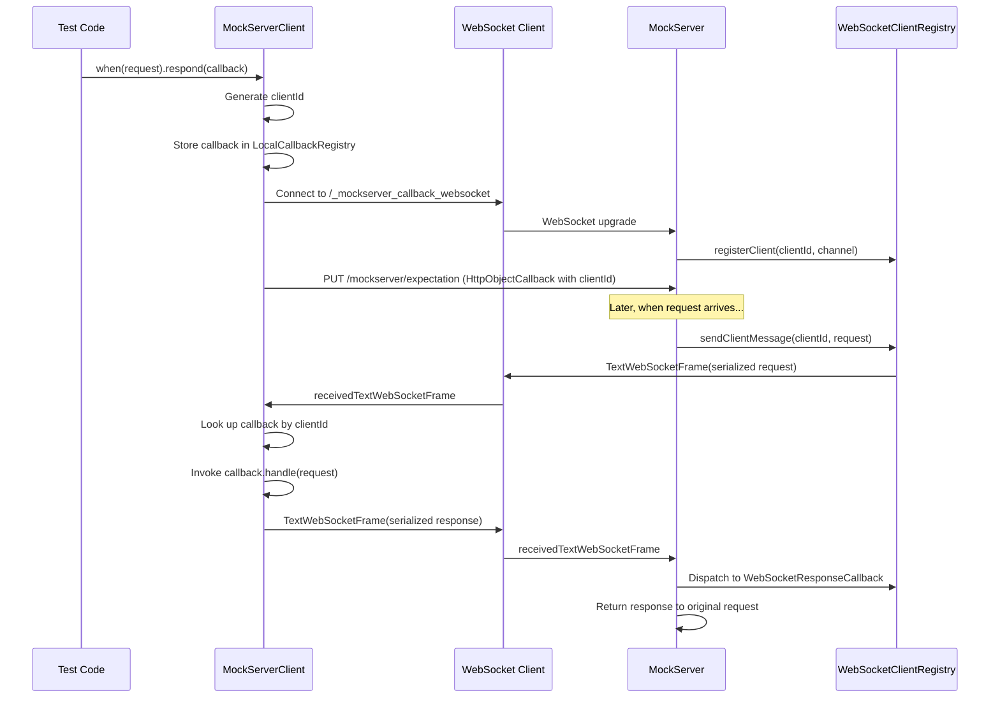

## Global Response Delay

The `globalResponseDelayMillis` configuration property adds a fixed delay to all matched expectation responses. The delay is **additive** — it combines with any per-action delay. Implementation:

- `HttpActionHandler.combineWithGlobalDelay(Delay actionDelay)` returns a `Delay[]` passed as varargs to `Scheduler.schedule()`
- `Scheduler.sampleCombinedDelayMillis()` sums all delay samples
- Only applies to the primary response path (not after-actions or secondary actions)
- Only applies when an expectation matches (unmatched/proxied requests are not delayed)

## Overload Bounds on Delayed and Templated Actions

**A matched request that must wait — for a delay, or for a template thread — is admitted only while fewer
than a configured number are already waiting; over the limit it is answered at once with
`503 Service Unavailable` (`Retry-After: 1`).** Each waiting task holds its request, response writer and
channel, so before these bounds a sustained arrival rate against a delayed or templated expectation grew
the scheduler and template queues, and the heap, without limit. Within the limits nothing changes: delays,
ordering and threads are exactly as before.

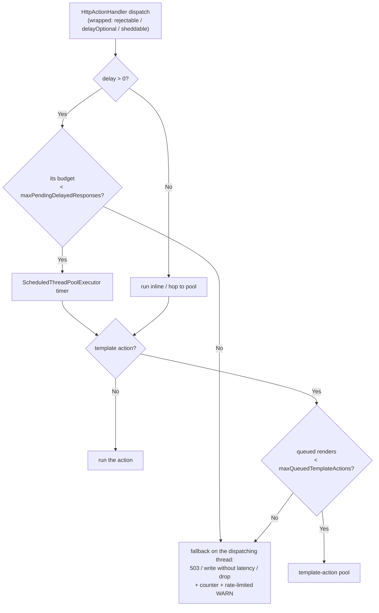

| Wrapper | Used for | Budget | Over the limit | Metric `reason` |
|---------|----------|--------|----------------|-----------------|
| `Scheduler.rejectable(task, onRejected)` | Every request dispatch that can carry a delay: the delayed write in `writeResponseActionResponse` (all mock-response actions), each action type's action/global delay (callbacks, the forward family, SSE, LLM, WebSocket, gRPC streaming, `error`), templates | Delayed responses (`maxPendingDelayedResponses`) | `503`, expectation post-processed | `delayed_responses` |
| same, template stage | Response/forward template renders waiting for a thread | Template queue (`maxQueuedTemplateActions`) | `503` | `template_actions` |
| `Scheduler.delayOptional(write)` | Chaos latency on an already-forwarded response | Delayed responses | The upstream response is written at once, without the latency | `delay_skipped` |
| `Scheduler.sheddable(task)` | Delayed fire-and-forget side actions: after-actions and non-blocking before-actions, secondary actions, step side effects | Delayed side actions (its own budget, same limit) | Dropped | `side_actions` |
| `Scheduler.scheduleReplySet(...)` | WebSocket bidi reply sets (one per matched inbound frame); per connection, reads also pause while more than 128 delayed sets are pending | WebSocket reply frames (its own budget, same limit), admitted or refused a whole set at a time | The WebSocket is closed with status `1013` (Try Again Later); no frame of the set is sent | `websocket_replies` |
| `Scheduler.scheduleCancellable(...)` | Control-plane timed scenario transitions | One per scenario: a re-`PUT` cancels the one it replaces, which leaves the queue at once | Always admitted | — |
| none | Chained per-message SSE/WebSocket/gRPC delays and close-socket delays (one per stream or connection) | Not bounded; counted in `mock_server_pending_delayed_tasks` only | Always admitted | — |

Defaults for both properties are the heap ceiling / 64 KB, capped at 100,000; the 1,000 floor applies only
when the JVM reports no heap ceiling. `0` removes a limit.

Admission is a compare-and-set on each budget's counter (`Scheduler.tryAdmit`): a refused task never
raises the counter, so refusals cannot inflate `mock_server_pending_delayed_tasks` or the `get*Count`
readers, and concurrent refusals cannot make a free slot look full. A budget's count still exceeds its
limit by design when a multi-frame WebSocket reply set is admitted below it.

**Rationale for the choices.**

- *Admission control, not an event-loop timer.* Moving delays to `eventLoop().schedule` or a
  `HashedWheelTimer` was rejected: Netty's scheduled-task queue is an unbounded binary heap like
  `ScheduledThreadPoolExecutor`'s `DelayedWorkQueue`, and `HashedWheelTimer` is unbounded unless given
  `maxPendingTimeouts`, so neither bounds anything by itself. The memory is in the closure each entry
  retains, whatever holds it. An event-loop timer would also run the fire-time work (event logging, OpenAPI
  response validation, breakpoint matching) on the I/O thread, and `CallerRunsPolicy` for a full template
  queue would render on the worker event loop — the stall the template-action pool exists to prevent.
- *Chaos latency on a forwarded response degrades instead of refusing.* By the time it applies the upstream
  request has been sent; a 503 would invite a client retry that repeats a non-idempotent upstream call, and
  for a streaming upstream the response writer would never subscribe, leaving the upstream connection open.
- *Side actions are shed on their own budget.* No client waits for them, so dropping one under overload
  (as drift analysis already does) is the least harmful outcome, and a separate budget means a webhook
  backlog can never make an unrelated mock answer 503. The worst case held is therefore bounded delayed
  tasks up to three times `maxPendingDelayedResponses` (responses, side actions, WebSocket reply frames —
  the last plus the frames of one set, since a set is admitted whole), plus up to `maxQueuedTemplateActions`
  queued renders, plus one timed transition per scenario, plus the per-stream delays in the last row.
- *WebSocket bidi replies are backpressured, then refused whole, never shed.* A client is waiting for the
  whole reply set (a realtime LLM turn, for example), so dropping frames at a budget boundary would deliver
  a partial reply silently. The first bound is per connection: while more than 128 reply sets with a delayed
  frame are pending on it, the connection stops reading, so TCP flow control slows the client instead of
  its sets piling up; reading resumes at 64. The frames decoded from the socket read that crossed the
  threshold are still processed, so a connection can exceed it by one read's worth (at most 64 KiB of
  input). The global backstop admits a set only while fewer than `maxPendingDelayedResponses` reply frames
  are waiting (its own budget, so a WebSocket flood cannot 503 an HTTP mock) and otherwise closes the socket
  with `1013` (Try Again Later), sending no frame of the refused set. The threshold is a constant, not a
  property: pausing only slows a client that has more than 128 replies outstanding, and the global bound is
  already configurable.
- *A reply set is one chain, not one task per frame.* Its frames are sent in order of their delay (each
  measured from the match, as before), keeping configured order among equal delays, one after another on a
  single chain that holds one scheduler task at a time. Scheduled independently, frames with equal delays
  could run on different pool threads and reach the socket out of order.
- *Admission counters, not bounded queues,* so both limits resize at runtime
  (`Scheduler.applyConfigurationCapacity()`, called from `HttpState.applyConfigurationUpdate`) at the cost
  of one increment and one compare per delayed dispatch. Undelayed dispatches allocate no wrapper
  (`HttpActionHandler.rejectableIfDelayed`, and the empty-delay check in `writeResponseActionResponse`);
  templates are always wrapped because the queue bound applies without a delay.

**What a refused request has already done.** Refusal happens at dispatch, after matching, so for a request
answered `503`: the expectation's match was counted (a `Times.once()` expectation refused once is used up);
when the refusal is of the delayed write, the rate-limit token was taken and chaos fault metrics were
counted; and no `EXPECTATION_RESPONSE` entry is logged for it (the request itself is logged as received).
Refusals are reported by `mock_server_overload_rejections` (only when `metricsEnabled`), by
`Scheduler.getOverloadRejectionCount(reason)` (always), and by a WARN at most every 10 seconds per reason
carrying the count since the previous line and the running total — so rejections after the last line are
not logged until the next one.

In synchronous (WAR/servlet) mode delays sleep on the request thread, nothing is queued and no bound applies.

**Pausing reads.** Several handlers pause a connection's reads: pending WebSocket replies, a TCP chaos
latency queue, a parked inbound breakpoint frame, WebSocket relay backpressure, the connection delay, the
queue of binary messages waiting to be forwarded and a binary relay's two connections (each while the other
cannot take more). They all go through `ChannelReadPause`, a per-channel hold
count: auto-read turns off with the first hold and back on only when the last is released, so one holder
finishing cannot resume reads another still needs paused.
The first hold also installs a gate at the head of the pipeline that drops read requests while any hold
remains. Without it, turning auto-read off did not stop reading: a decoder that saw no complete message, or
the `HttpContentDecompressor` left in a WebSocket pipeline after the upgrade, calls `ctx.read()` after every
read while auto-read is off, which kept draining the socket. A paused connection counts as busy, so the idle
timeout never closes it.

**Other executors on the request path** and whether each is bounded:

| Executor / queue | Work | Bounded by |
|------------------|------|-----------|
| Shared scheduler, undelayed tasks | Forward continuations, lazy `once()` removal, before-actions, undelayed side actions | Not admission-bounded — must-run work that cannot be answered with a 503. Each belongs to a request already being served, so they are bounded by the requests in flight (open connections x HTTP/2 streams, capped by `maxInboundConnections` when set), and a forward continuation waits at most `maxFutureTimeout`; tracked by `mock_server_scheduler_queued_tasks` |
| Shared scheduler, drift analysis | Best-effort forwarded-response drift analysis | Self-bounded to `max(16, 4 x actionHandlerThreadCount)`; excess dropped and counted |
| `ScenarioManager` timed transitions (`scheduleCancellable`) | One delayed transition per scenario from `PUT /mockserver/scenario` carrying `transitionAfterMs` | One queued task per scenario: a later `PUT` with a transition cancels the pending one, and the scheduler's remove-on-cancel policy frees its queue slot at once. A `PUT` without a transition leaves a pending one in place (it fires only if the state still matches) |
| Local-callback pool | Class callbacks | No queue (`SynchronousQueue`); threads deliberately unbounded to avoid the recursive loopback self-deadlock ([optimisation-safety.md](optimisation-safety.md) hazard 5). Its delay stage is bounded above |
| JavaScript watchdog (`PolyglotRunner`) | Template timeout | One per in-flight JavaScript render, so bounded by the template pool |
| `MatchingTimeoutExecutor`, `WasmRuntime` | Regex/XPath matching, WASM rules | `SynchronousQueue` with a thread cap and `AbortPolicy` |
| Breakpoint timeout schedulers | Held-exchange timeouts | `breakpointMaxHeld` |
| `LoadScenarioOrchestrator` scheduler | VU pacing and think time | One pending task per virtual user (`loadGenerationMaxVirtualUsers`) |
| `ForwardRetryPolicy` backoff (`CompletableFuture.delayedExecutor`) | Forward retries | In-flight forwards x `forwardProxyRetryCount` |
| `ChaosExperimentOrchestrator` scheduler | Experiment stage timers | Control plane, one per experiment stage |
| WebSocket bidi replies (`WebSocketReplySender`) | Delayed reply frames to each inbound frame | Per connection by pausing reads above 128 pending sets; globally by `maxPendingDelayedResponses` reply frames, refusing a whole set with close `1013`; see the rationale above |
| `TcpChaosHandler` (`eventLoop().schedule`) | TCP latency/bandwidth fault injection | Per connection: inbound reads wait in one FIFO queue with one timer, and the connection stops reading while more than 64 KiB is queued (resuming at 32 KiB), so at most 64 KiB plus one socket read is held; queued buffers are released on close |

## Proxy Forwarding

When no expectation matches and the channel is in proxy mode, `HttpActionHandler` forwards via `NettyHttpClient`:

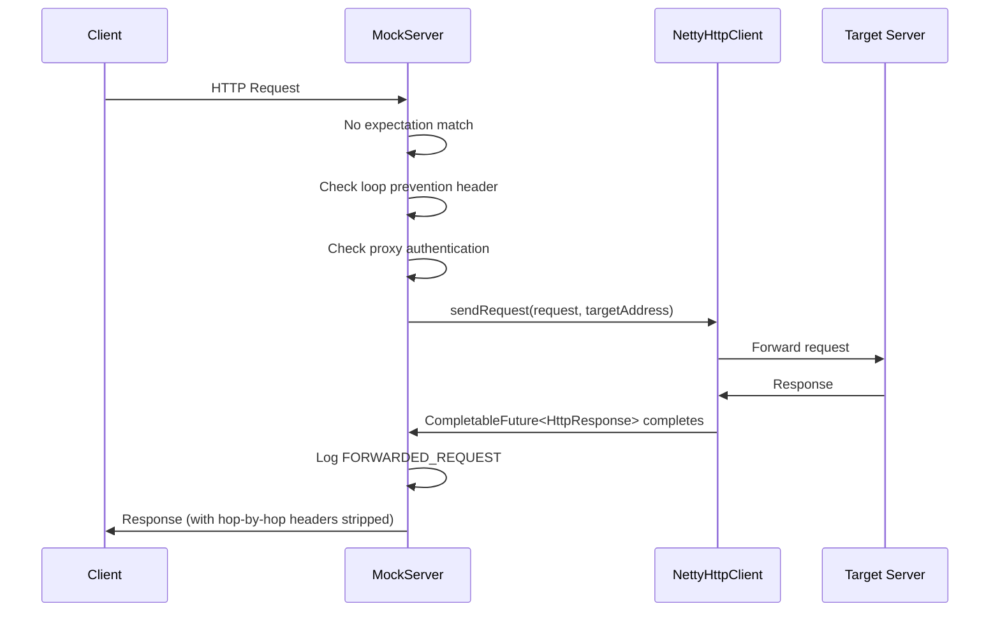

### How a Failed Connect Is Reported

An HTTP request sent through `NettyHttpClient.connectFresh` (every HTTP forward, and the Java client), or a
binary message forwarded on a connection of its own (`sendRequest(BinaryMessage, …)`, which gates its channel
the same way), whose connect attempt fails (`Connection refused: …`, `connection timed out after … ms`,
`UnknownHostException`) fails with that reason, and not with the generic `Channel handler removed
before valid response has been received` that the failed channel's teardown produces. The generic
exception is still what a channel reports when it is the channel itself that failed: the table below.

`connectFresh` gives each new channel its own future as the `RESPONSE_FUTURE` attribute the client
handlers complete, and relays it to the request's future only from the connect listener's success
branch. A channel that failed to connect is closed and its handlers removed all the same, which
completes that channel future with the generic `SocketConnectionException`. Netty can finish that
teardown before the calling thread has attached its listener to the connect future, so if the handlers
completed the request's future directly the teardown would sometimes be reported in place of the cause.

| Case | What the request fails with |
|---|---|
| Connect refused, timed out, or host unresolvable | the connect cause |
| The channel's pipeline could not be built (for example the client TLS context cannot be created from `forwardProxyPrivateKey` / `forwardProxyCertificateChain`, or a proxy handler cannot be constructed) | `ClientConfigurationException`, a `SocketConnectionException` whose cause is the initialisation error |
| TLS handshake fails on a connected channel (untrusted certificate, host name mismatch, an upstream that does not speak TLS, handshake timeout) | `SocketConnectionException` whose cause is the handshake's `SSLException` |
| The upstream closes the connection during the handshake | `SocketConnectionException` whose cause is an `SSLHandshakeException` saying `upstream closed the connection during the TLS handshake` (Netty reports it as a `ClosedChannelException` with a suppressed `SSLHandshakeException`; `ExceptionHandling.upstreamHandshakeFailure`) |
| An HTTP/2 connection error with a request in flight | `SocketConnectionException` whose cause is the `Http2Exception` |
| A TLS fault on an established HTTP/2 connection with a request in flight | the `DecoderException` itself, which Netty's `Http2MultiplexHandler` passes to the active streams when its cause is an `SSLException`; otherwise `SocketConnectionException` whose cause is the `SSLException` |
| Binary forward (`sendRequest(BinaryMessage, …)`) | as above, and so does its `onRequestSent` callback: the connect cause, or `ClientConfigurationException` for a pipeline that cannot be built; a failed TLS handshake as for an HTTP forward, from the handshake's event in `HttpClientHandler`, with the handshake bounded by `socketConnectionTimeoutInMillis`; with `forwardBinaryRequestsWithoutWaitingForResponse` a message that was never sent fails instead of completing empty |

`HttpClientInitializer.initChannel` catches a failure to build the pipeline, fails the channel's
`RESPONSE_FUTURE` with a `ClientConfigurationException` and closes the channel, so Netty's
`ChannelInitializer` no longer logs it. The connect then fails on the closed channel with a
`ClosedChannelException`, and `connectFresh` reports the channel's outcome in its place. A failed handshake,
an HTTP/2 connection error and a TLS fault are raised in handlers after `HttpClientConnectionErrorHandler`,
which never sees them: `HttpOrHttp2Initializer` (from the handshake's `SslHandshakeCompletionEvent`, which is
all Netty reports for a timeout or a close during the handshake; on a binary forward, `HttpClientHandler`) and `Http2ForwardConnectionExceptionHandler` fail the waiting request with
them before the connection closes, and for an exception it does not recognise the HTTP/2 handler does the same
before it closes the connection (see
[netty-pipeline.md](netty-pipeline.md#exceptions-on-a-connection-to-an-upstream)). An `SSLException` that a
non-TLS I/O failure caused (Netty's `failure when writing TLS control frames` when a proxy refuses the tunnel
or the connection closes) is left to that failure, which
reaches the request through `HttpClientConnectionErrorHandler` as before (`ExceptionHandling.tlsFailure`).

Each is wrapped in the `SocketConnectionException` the request failed with before, so a caller that catches it
(the Java client's `hasStarted` and `isRunning`, for example) still does, and a request on a reused pooled
connection is still sent again on a new one. The message names the upstream and the cause, bounded by
`ExceptionHandling.boundedFaultDescription` (Netty's hex dump of a non-TLS answer becomes its byte count).

### How a Failed Forward Is Answered

`HttpActionHandler` asks `upstreamFailureReason` first, before its connection-failure branch, for an
expectation's forward (`handleExceptionDuringForwardingRequest`), an unmatched proxied request
(`handleUnmatchedForwardFailure`) and a request sent through a proxy-pass mapping (`handleProxyPassFailure`), all
through `returnedUpstreamFailureReason`. For the four reasons it names, the request is logged once at `ERROR`, with
the request and the bounded cause, and the client gets a `502` whose body is the reason:

| Cause | `502` body |
|---|---|
| Configuration error | `connection to the upstream could not be set up: RuntimeException: Exception creating SSL context for client` |
| TLS (any `SSLException` in the cause chain) | `TLS with the upstream failed: SSLHandshakeException: PKIX path building failed: …`; with OpenSSL, whose message is `General OpenSslEngine problem`, the root cause follows: `…; caused by CertificateException: No subject alternative names present` |
| HTTP/2 error (any `Http2Exception` in the cause chain) | `HTTP/2 error from the upstream: PROTOCOL_ERROR: Frame of type 0 must be associated with a stream.` |
| HTTP/1.1 response that could not be decoded (`UndecodableResponseException`) | `response from the upstream could not be decoded: IllegalArgumentException: No colon found` |
| Anything else | as before: no body; a connection failure is logged at `TRACE` on the first two routes, and at `INFO` as `proxy pass forwarding failed for <target>: ...` on a proxy-pass mapping |

The body holds only text from the TLS, HTTP/2, set-up or decoding code, bounded as a log entry's fault is (each
message cut at 256 characters, a non-TLS answer shown as its byte count); for a configuration error only the
top-level message, because a deeper cause may quote a configured file. Header values and body bytes are never
quoted, though an HTTP/2 message or the decoder's can name a header (`invalid header name [...]`), and the
decoder's can quote the first word of a status line that is not HTTP (`invalid version format: ...`). The connection-level entry that
`HttpOrHttp2Initializer` or `Http2ForwardConnectionExceptionHandler` logs is then `DEBUG`; it stays `WARN` when
no request is waiting (an idle pooled connection), where it is the only record. For an expectation's forward the scheduler's
`INFO` entry for a failed response future, which repeats the exception's message, is skipped for these
reasons, and a proxy-pass mapping never writes it, so the `ERROR` is the request's one entry.

With `redactSecretsInLog` on, the request's credential values are masked in each message before it is cut, for
the reason (in the entry, the `502` body and its `INFO` entry) and for the cause the entry attaches
(`LogEntry.credentialScrub` and the scrub overloads of the `ExceptionHandling` bound helpers). The render-time
redaction matches whole values only, so a credential cut at character 256 would otherwise keep its first part.

A configuration error or an undecodable response is not a transient failure: `ForwardRetryPolicy.isTransientFailure`
is false for it, so it is not retried. The circuit breaker records a configuration error, like a header-limit
refusal, as neither a success nor a failure (`recordNeutral`), and an undecodable response as a success, since the
upstream answered. A TLS or HTTP/2 failure counts as a failure.

An upstream proxy (`forwardHttpProxy`, `forwardHttpsProxy` or `forwardSocksProxy`) that cannot be reached is a
configuration problem too. When the forward client's connection to the proxy fails (its name does not resolve, it
refuses the connection, or the connect times out), `NettyHttpClient.connectFresh` fails the request with
`UpstreamProxyUnreachableException` wrapping the connect failure, and logs one `WARN` per proxy address for the
client's lifetime. For `forwardHttpsProxy` and `forwardSocksProxy` Netty's `ProxyHandler` redirects the connect to the
proxy, so the connect future reports only the proxy; a failure the proxy reports after it accepted the connection (a
`CONNECT` answered with a non-200 status, a SOCKS failure reply, the proxy closing the tunnel before answering, or its
handshake timing out) is the target's, as before, since some proxies close rather than answer when they cannot reach
the target. The wrapper is neutral for the breaker and not retried, and reads as its cause (`getMessage` and
`toString` are the cause's), so every route answers and logs the failure exactly as before. Only the HTTP forward
client's connections are classified: the per-message binary forward and a client that is not the forward client
(`forwardProxyClient` false) fail with the connect failure itself.

### Streaming Forward Path

When the upstream response is a streaming response, and `streamingResponsesEnabled` is `true` (default), MockServer relays chunks incrementally rather than buffering the entire body. A response is treated as streaming when **either** its `Content-Type` is `text/event-stream` **or** the forwarded request declared streaming intent (`Accept: text/event-stream`, or a JSON body with `"stream": true`) — the latter (`EXPECT_STREAMING_RESPONSE`) covers content-type-less streaming backends such as the OpenAI Codex endpoint, and is threaded onto the HTTP/1.1 forward, HTTP/2 forward (parent → per-stream child), and transparent CONNECT-relay loopback paths alike (see [netty-pipeline.md](netty-pipeline.md#streamingawarehttpobjectaggregator)). Ordinary chunked responses without either signal are aggregated normally.

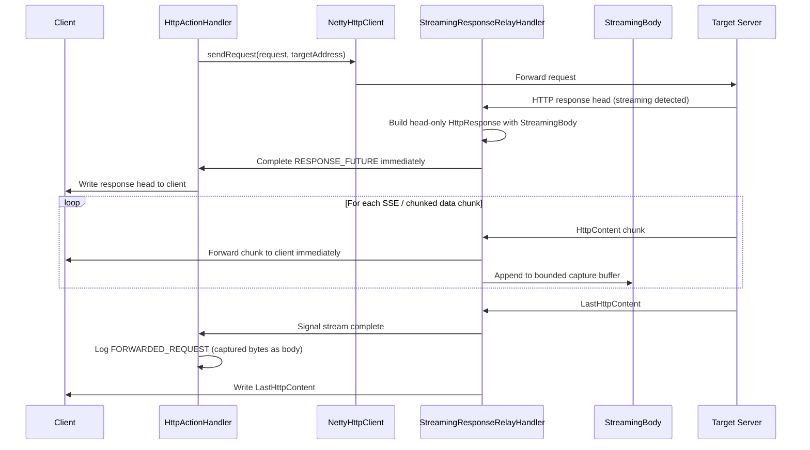

A forwarded LLM response relayed this way is also read for its token usage as it passes:
`HttpActionHandler` registers an `LlmStreamUsageScanner` with `StreamingBody.observeChunks` before the
response is written. The observer sees every chunk on arrival (including chunks that arrived before
the writer subscribed, and past the capture limit), holds at most a few KiB, and cannot affect the
relay: an observer that throws is dropped. See
[Proxied LLM usage and cost](llm-mocking.md#proxied-llm-usage-and-cost).

Key behavioural points:

- The `CompletableFuture<HttpResponse>` completes at **response-head time** (not after the full body is received), so the global socket timeout (`maxSocketTimeoutInMillis`) no longer applies to the streamed portion. A per-stream `IdleStateHandler` enforces `streamIdleTimeoutSeconds` instead, while MockServer is reading the upstream: `StreamIdleTimeoutHandler` ignores an idle event while more than the read watermark waits for the client (`StreamingBody.isAwaitingClient()`), because reads are then withheld on purpose, so a slow or paused client keeps its stream. A body nothing has subscribed to (a streamed response replaced or dropped before it was written) is never awaiting a client, so its upstream still times out; a breakpoint `CLOSE` closes the upstream directly. An upstream that closes, fails, or sends invalid framing mid-stream also ends the client's response without its terminating chunk (`StreamAbortedException`; `StreamedResponseDecoderResultGuard` turns a codec's failed decoder result into that abort before a decompressor can replace it with a clean end), while a body the upstream delimits by closing its connection still ends normally. When the client has gone, the writer closes the upstream (`StreamingBody.closeUpstream()`). A stream that times out fails with `StreamingBody.IdleTimeoutException` and, like a bound abort, ends the client's response without its terminating chunk (HTTP/2, HTTP/3: reset).
- The full stream reaches the client unless it is aborted (next point). The capture buffer is bounded to `maxStreamingCaptureBytes` (default 256 KB). When exceeded, the logged body is truncated and the `FORWARDED_REQUEST` log entry carries `x-mockserver-stream-truncated: true`.
- The decoded bytes relayed but not yet written to the client are bounded by `maxResponseBodySize`, the limit the same response would have had aggregated: a decoder expands one upstream read at once (one read of `zstd` can decode to about 2 GiB), so read pacing alone cannot bound them. When a chunk would pass the bound, `StreamingBody` fails with `UnwrittenBytesLimitExceededException`, `StreamingResponseRelayHandler` logs a `WARN` and closes the upstream, and the writer closes the client's connection (HTTP/2, HTTP/3: resets the stream) without the terminating chunk, so the client sees an incomplete response. `chunkWritten` requests the next upstream read only once the backlog has drained to min(64 KiB, bound / 4) (as does `subscribe`, for chunks that arrived before it), so a slow client gets backpressure however many chunks a read holds, and only a single read that decodes to more than the bound is aborted; the time a slow client spends draining does not count towards the stream idle timeout (previous point). The CONNECT relay's HTTP/1.1 loopback applies the same bound with `maxRequestBodySize`, stopping its reads above min(256 KiB, bound / 2) unwritten until the backlog halves; raw bytes (an `error()` action's `responseBytes`) count toward that pause but not toward the bound. See [memory-management.md](memory-management.md#decompressed-bodies).
- Non-streaming responses are unaffected — `StreamingAwareHttpObjectAggregator` detects the response type and delegates to the standard `HttpObjectAggregator` path for non-streaming responses.
- `FORWARD_REPLACE` (`overrideHttpResponse`) disables streaming **only when the response modification needs the full response body**: a body/schema response override, a JSON body patch/merge-patch modifier, or a response template. In those cases `HttpOverrideForwardedRequestActionHandler` passes `disableStreaming=true` through `HttpForwardAction.sendRequest` to `NettyHttpClient.sendRequest`, which sets the `DISABLE_RESPONSE_STREAMING` channel attribute; `StreamingAwareHttpObjectAggregator.channelRead` then always delegates to the standard `HttpObjectAggregator` path so the response is fully aggregated regardless of `streamingResponsesEnabled`. A **header-only** modification (status / headers / cookies with no body change — decided by `HttpOverrideForwardedRequestActionHandler.isHeaderOnlyResponseModification`) is instead applied to the streamed response **head** while the body chunks are relayed untouched, so streaming is preserved — e.g. adding a CORS or trace header to an SSE / LLM upstream no longer breaks the stream.
- WAR deployments (`ctx == null`) always use the buffered path.

### Bodies with No Content-Type

A body that arrives with no `Content-Type` is forwarded byte-identical on every path, because the
decoder keeps its raw bytes whenever a String view could not reproduce them.

| Received bytes | Decoded as | Matchers and control plane read | Retrieve requests / request-responses show | Dashboard and log entries show |
|---|---|---|---|---|
| Valid UTF-8 (JSON, text, …) | `StringBody` (no content type), raw bytes kept | the UTF-8 text | the text, as before | the text, as before |
| Not valid UTF-8 (binary, Latin-1 text, …) | `BinaryBody` (no content type), raw bytes kept | the lenient UTF-8 decode (malformed bytes become U+FFFD), as before | `{"type":"BINARY","base64Bytes":…}` with no `contentType` | a base64 string (the log-entry body rendering); with `redactSecretsInLog` on it is redacted first, see below |

The rule lives in `BodyDecoderEncoder.bytesToBody`, which every inbound request (HTTP/1.1, HTTP/2,
servlet) and every forwarded or proxied upstream response goes through; the HTTP/3 request bridge
calls it for every body too. The streamed-response capture
(`HttpActionHandler.setCapturedStreamingBody`) uses a similar but looser sniff for display only: it also
rejects control bytes and tolerates one replacement character from a truncated tail, which a
byte-identical forward cannot. Previously every such body became a
`StringBody` decoded as UTF-8, and `bodyToBytes` re-encoded that String on the way out, so each
malformed byte turned into U+FFFD (three bytes): 1,000,000 random bytes left MockServer as ~1.8–2 MB,
and the String copies cost two to three times the body in heap.

`bodyToBytes` needed no change: a `BinaryBody` is written from its raw bytes, and a valid-UTF-8
String re-encodes to exactly the bytes it was decoded from.

**Matching and the data-plane readers do not change.** The readers below interpret an inbound,
forwarded or recorded body as text through `HttpRequest.getBodyAsText()` /
`HttpResponse.getBodyAsText()` (both delegate to `BinaryBody.matchableString`). For a `BinaryBody` that
has no content type of its own, on a message with no `Content-Type` header, that returns the lenient
UTF-8 text such a body was always read as; any other body, including a user-authored
`binary(bytes, MediaType.PNG)`, keeps its usual string form:

- request and response body matching (`BodyMatching`), LLM conversation matching and every LLM codec's
  decode, the embeddings and rerank request readers, `LlmProviderSniffer` and the LLM optimisation reports;
- secret redaction (`FixtureRedactor`, behind `redactSecretsInLog` and the fixture exports): both the
  field masking and the fail-closed "unparseable body" check, and the collection of body-field values
  that are scrubbed from log messages. On every log surface — retrieve of requests and
  request-responses, the JSON log-entry retrieve (`LogEntrySerializer`), the dashboard
  (`DashboardLogEntryDTO`), and log messages and their arguments (console included) — `LogEntry` redacts
  a `BinaryBody` *before* `updateBody` renders it as base64, since base64 would hide its fields; other
  bodies are rendered first so a JSON body keeps its tree form. With redaction on and body fields
  configured, a JSON-parseable body the redactor rewrites comes back as text (the masked JSON), not as
  base64 or the `BINARY` shape;
- the control-plane endpoints (expectations, GraphQL, AsyncAPI, Pact, configuration, bind) and the
  built-in CRUD, OIDC, SCIM and SAML handlers, and the HTTP/3 MCP endpoint (which then reads the body
  exactly as the TCP MCP path's raw UTF-8 decode does);
- OpenAPI request/response validation and runtime expressions, GraphQL response synthesis, breakpoint
  response conditions, response body patches (`HttpResponseModifier`), drift and diff analysis, load
  response extraction, the curl rendering of a request, and the OpenAPI/Postman/Pact exports of
  recorded traffic.

The request matcher checks for a `BinaryBody` before looking up the `Content-Type` header, so other
bodies keep their exact previous cost; during a matching scan the lenient decode is done once and
shared by every candidate expectation through the scan-scoped `ParsedBodyCache`, so nothing is
retained on the logged request. Response matching reads a user-defined `binary(bytes)` response with
no content type and no `Content-Type` header the same way (as lenient text rather than base64).

**The exceptions are callbacks, templates, WASM and the log/HAR renderings**, which keep a binary
body's usual form (base64): `HttpRequest.getBodyAsString()` in Java callbacks, the `request.body`
template value, the body handed to WASM response shapers, the body shown in log messages
(`LogEntry.updateBody`) and HAR exports (which mark it `encoding: base64`). Code generation
(`HttpResponseToJavaSerializer`) and user-authored template bodies also keep base64, since a binary
body there was written by the user. `LlmPromptRedactor.redactBodyForPrompt` omits every `BINARY` body
from the stub-generation prompt, so a non-UTF-8 body with no `Content-Type` is now left out of that
prompt where it used to be sent as lossy text — the safe direction for a body that may hold secrets.
A body whose `Content-Type` declares JSON or XML without a charset is still decoded as UTF-8; if its
bytes are not valid UTF-8 they are still re-encoded lossily (out of scope: that content is malformed
for its declared type).

### Bodies with a Content-Encoding

A request body sent with a `Content-Encoding` is forwarded as the exact bytes the client sent, on
HTTP/1.1, HTTP/2 and HTTP/3, sent directly or through a CONNECT or SOCKS tunnel, unless MockServer changed
it; a changed body is encoded in its coding again.

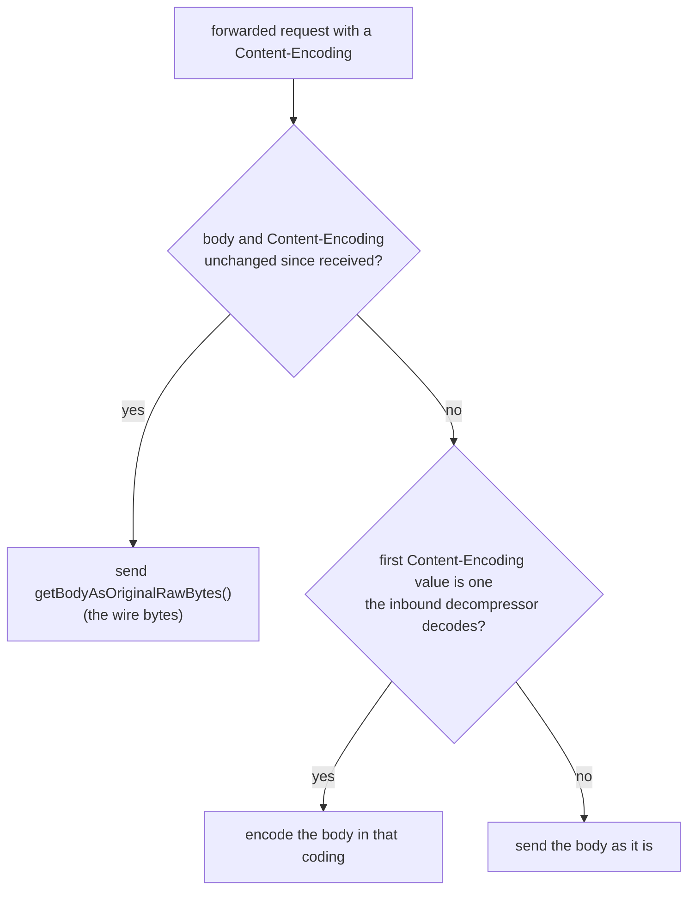

| First `Content-Encoding` value | Decoded on the way in | Forwarded unchanged | Forwarded after an override, template or callback changed the body |
|---|---|---|---|
| `gzip`, `x-gzip`, `deflate`, `x-deflate` | yes | wire bytes | gzip / zlib of the new body |
| `snappy` (raw block, as Prometheus remote-write sends, or framing format) | yes | wire bytes | the new body as a raw block, or framed if the original was framed |
| `zstd`, `br` | when zstd-jni / Brotli4j load (zstd-jni ships in the jar through `kafka-clients`) | wire bytes | the new body in that coding, when the library loads |
| a coding list in one value (`gzip, br`), `identity`, unknown | no | wire bytes | the body as it is, never encoded again |

Only the first value counts, because that is the one Netty's decompressor reads: with two
`Content-Encoding` headers the body is decoded (and, if changed, encoded again) by the first.

**How "unchanged" is known.** The transports call `HttpRequest.markBodyAsReceived()` on a request that
arrived with a `Content-Encoding`: `FullHttpRequestToMockServerHttpRequest` for HTTP/1.1 and HTTP/2,
`Http3MockServerHandler` for HTTP/3 (from the `content-encoding` flag `Http3RequestBridge.parseHeaders`
sets in its one pass over the headers), and `HttpServletRequestToMockServerHttpRequestDecoder` for the
WAR, whose container never decompresses. It records the body instance and the `Content-Encoding`
values, and records nothing for a request without a body or a `Content-Encoding`. `isBodyAsReceived()`
holds while both are the same, compared by identity for the body, so any `withBody` ends it; it is false
for an unmarked request before any header is looked up, and the forward path reads the
`Content-Encoding` header of an unmarked request only once, with no allocation. The record is transient
(not serialised, compared or logged), and `clone()` / `shallowClone()` carry it, so an override that
leaves the body alone still forwards the wire bytes. A request rebuilt from JSON (a template, a
callback, a replay) is never marked, so its body is encoded from its decoded form rather than trusting
a serialised original body.

**CONNECT and SOCKS tunnels.** `RelayConnectHandler` decodes the tunnelled client's HTTP and relays
each request to MockServer over a loopback connection. It no longer decompresses that request: on
HTTP/1.1 it installs no decompressor, and on HTTP/2 it uses `InboundHttp2ToHttpAdapter` without a
`DelegatingDecompressorFrameListener`. The request reaches MockServer still in its coding, with its
`Content-Encoding`, and is decompressed and marked there like any other, so a tunnelled request is
matched, recorded and forwarded exactly as a direct one. (Before, the relay decompressed with Netty's
decompressor and dropped the header, so a tunnelled gzip body reached the upstream decompressed and a
raw-block Snappy body was rejected.) The relay's response side, which decompresses MockServer's
responses on their way back to the client, is unchanged.

The relay still needs the decoded body for one thing: `UpstreamProxyRelayHandler` asks
`StreamingAwareHttpObjectAggregator.requestExpectsStreamingResponse` whether a JSON body says
`"stream": true`, so a streamed response with no `text/event-stream` content type (the OpenAI Codex
backend) is relayed as it arrives rather than buffered. For a body with a `Content-Encoding` that check
runs `MockServerHttpContentDecompressor` over the compressed bytes in 1 KiB slices, scanning each decoded
piece (with a 256-character overlap, so a match split between pieces is found) and stopping at the first
match, at `maxRequestBodySize` decoded bytes, or at a decoding error. The decoded pieces are released as
they are scanned and the relayed bytes are never changed, so memory stays at one slice's output and the
whole body is still searched, as it was when the relay decompressed it. Choosing to decode a bounded
prefix was rejected because coding CLIs send `"stream": true` after a long message history; signalling
from MockServer's side of the loopback was rejected because it needs a new internal header that must never
reach a client. (Streaming of tunnelled responses is an HTTP/1.1-tunnel feature: the HTTP/2 loopback
aggregates every response, compressed request or not.)

When the relay cannot pass a response on (it fails to decode, is larger than `maxRequestBodySize`, or
MockServer resets the stream), the tunnelled client is answered at once: over HTTP/2 its stream is reset
(with MockServer's own error code, `REFUSED_STREAM` when the request never reached MockServer, otherwise
`INTERNAL_ERROR`) and its other streams carry on; over HTTP/1.1 it gets a `502`, or, once a streamed
response's head has gone, a closed connection. See
[netty-pipeline.md](netty-pipeline.md#relay-failure-signalling).

**Why a coding list is not encoded.** `MockServerHttpContentDecompressor`, like Netty's decompressor,
compares the trimmed first value whole, so it never decodes a list in one value; a body under one is
still in it, whether it came off the wire or was supplied by an override. Encoding it again was the old
substring match's bug (`gzip, br` was gzipped a second time). `BodyContentEncodingEncoder` encodes
exactly the codings the decompressor decodes, so a decoded body can always be encoded again, and
nothing claims a coding MockServer cannot produce. A user who supplies an unencoded body under a
coding list gets it forwarded unencoded: MockServer cannot tell it from an encoded one.

**Raw Snappy blocks.** Netty's `SnappyFrameDecoder` accepts only the framing format and rejected a
remote-write body ("…tag before STREAM_IDENTIFIER"), closing the HTTP/1.1 connection, resetting the
HTTP/2 stream or closing the HTTP/3 stream, so a remote-write receiver could not be mocked.
`SnappyBlockOrFrameDecoder` hands a body that starts with the framing format's stream identifier to
`SnappyFrameDecoder` and decodes anything else as one block once the body ends. A block's varint
preamble declares its decoded size, and before decoding it is refused as corrupt if that size is over
`maxRequestBodySize`, or over 22 times the block's own length (Snappy writes at most 64 bytes per 3-byte
element, so a short body cannot hold more). Netty's decoder reserves the whole declared size as soon as
it reads the preamble, so these checks are what bound the allocation. The output buffer is capped at the
declared size, so a block that decodes past it is refused too. A remote-write receiver is therefore
limited by `maxRequestBodySize`, but an oversized block is refused like a corrupt body rather than
answered 413. A body re-encoded as `snappy` uses the raw block format (`SnappyBlock`, the same
snappy-java call MockServer's own remote-write exporter makes) unless the original body was framed.

### Accept-Encoding on a forwarded request

A forwarded or proxied request carries the client's own `Accept-Encoding` upstream, less the codings
MockServer cannot decode, so whatever coding the upstream picks is one the forward client decodes
before the response is recorded, matched and relayed. Until 9.0.0 every outbound request said
`Accept-Encoding: gzip,deflate`, whatever the client sent.

| Client sent | Upstream receives |
|---|---|
| no `Accept-Encoding` | none |
| `compress, zstd;q=0.9, gzip;q=0.5` | `zstd;q=0.9, gzip;q=0.5` (`zstd` only when zstd-jni loads) |
| `gzip;q=1.0, *;q=0.1` | `gzip;q=1.0, deflate;q=0.1, zstd;q=0.1, identity;q=0.1` (`br`, `zstd` only when their library loads) |
| `compress`, `gzip;q=0`, an empty value | `identity` |

`ForwardedAcceptEncoding.forwarded` builds the value, and `MockServerHttpRequestToFullHttpRequest`
sets it, so it applies wherever a request leaves through `NettyHttpClient`: the forward and
override actions, callbacks, proxying (HTTP proxy, CONNECT and SOCKS tunnels through the loopback, and
an HTTP/2 upstream, whose stream codec turns the same request into frames), streamed responses, and
MockServer's own outbound calls (the Java client, LLM completions), which send whatever their request
model holds, so a request with no `Accept-Encoding` no longer gains one. It keeps the elements
in order with their parameters, joins several fields into one, keeps `identity` and every coding
`BoundedZstdHttpContentDecompressor.decodes` accepts (so `x-gzip`, `x-deflate` and `snappy` too), and
replaces `*` with the registered codings it covers (`gzip`, `deflate`, `br`, `zstd`, `identity`) that
are decoded and not named elsewhere (`x-gzip` and `x-deflate` count as naming `gzip` and `deflate`). When no
element left has a q-value above zero it sends `identity`, so `compress, *;q=0` still gets `identity`. An
`Accept-Encoding` set by a forward override (`forwardOverriddenRequest`) is filtered the same way, since the
overridden request goes through the same mapper.

**No `Accept-Encoding`, none sent.** RFC 9110 section 12.5.3 reads a missing field as "no preference",
while `identity` alone says only an unencoded response is acceptable; sending nothing keeps the client's
request as it was. An upstream may then use any coding: one MockServer decodes is decoded as usual, and
one it does not is relayed still encoded with its `Content-Encoding` and recorded encoded, which the
client, having stated no preference, accepts.

**What the client gets back.** Unchanged: a body in a coding MockServer decodes reaches the client and
the recording decoded, without `Content-Encoding` and with its length adjusted, and the upstream's
`Vary` is relayed as is. Identity is acceptable to every client that did not send `identity;q=0`, so
the response is not encoded again for the client.

**WebSocket upgrades** are relayed by `WebSocketProxyRelayHandler`, which already sends the client's
handshake headers as they came (`Accept-Encoding` included) and never relays or records the body of a
refused handshake, so it is unchanged.

### ProxyPass (Reverse Proxy)

The `proxyPass` configuration property allows MockServer to act as a reverse proxy, mapping incoming path prefixes to upstream servers with automatic path rewriting. This is evaluated in `HttpActionHandler.handleProxyPass()` after expectation matching and CORS, but before the speculative proxy attempt.

Each mapping specifies a `pathPrefix` (e.g. `/api/`), a `targetUri` (e.g. `https://backend:8443/services/`), and an optional `preserveHost` flag. When a request path starts with the prefix, the path is rewritten (prefix stripped, target path prepended) and forwarded to the target host:port. The Host header is adjusted to match the target unless `preserveHost` is true.

### Non-Proxy Hosts

The `noProxyHosts` configuration property (comma-separated list) has two uses, both through `NoProxyHostsUtils.isHostOnNoProxyList()`:

- **Upstream proxy bypass** (`NettyHttpClient`): a destination on the list is connected to directly, never through `forwardHttpProxy`, `forwardHttpsProxy` or `forwardSocksProxy`, as `no_proxy` works for curl and `http.nonProxyHosts` for the JVM. This covers HTTP requests (forwards, proxied requests, webhooks) and per-message binary forwarding.
- **Speculative proxying** (`HttpActionHandler`): a request that matches no expectation and whose Host header is on the list gets a 404 instead of being proxied to that host.

An entry is a host name, matched exactly (`example.com`); a domain suffix, `*.internal.corp` or `.internal.corp`, matching the domain itself and every name under it; or an IP address (`192.168.1.1`, `::1`), compared as an address, so `::1` and `0:0:0:0:0:0:0:1` match. Matching ignores case and the port. No name is looked up: an IP-address entry matches only a destination given as that address, never a name that resolves to it.

`NettyHttpClient.upstreamProxiesFor` decides once per request which proxies apply: all those configured, or none for a listed destination. The destination is the `remoteAddress` the caller passes (its host string, a name or an IP literal), or, when that is null, the request's socket address or Host header, read without a lookup. The chosen set drives everything that depends on a proxy: whether the request goes to `forwardHttpProxy` (and gets an absolute-form URI and `Proxy-Authorization`), whether `HttpClientInitializer` adds the `CONNECT` or SOCKS5 handler, whether the bootstrap uses `NoopAddressResolverGroup`, and whether the connection may be pooled. `sendsThroughHttpProxy`, which `forwardProxyBlockPrivateNetworks` uses to decide whether to check the Host header too, makes the same decision. A direct connection to a listed host is checked by `forwardProxyBlockPrivateNetworks` like any direct connection. The single-connection binary relay is unchanged: with any upstream proxy configured, every binary connection still falls back to per-message forwarding, which then honours the list.

### Destination Name Resolution Through an Upstream Proxy

When a connection is tunnelled through an upstream proxy (`forwardHttpsProxy` for a secure request, otherwise `forwardSocksProxy`; `HttpClientInitializer.tunnelProxy` decides, and adds the matching `HttpConnectProxyHandler` or `Socks5ProxyHandler`), `NettyHttpClient` keeps the destination unresolved (`SocketAddresses.unresolvedUnlessIpLiteral`) and connects with Netty's `NoopAddressResolverGroup`, so the tunnel handler sends the proxy the name and the proxy resolves it. Without the no-op resolver Netty's default resolver looks an unresolved address up on the event loop before the tunnel handler sees it, which fails where only the proxy can resolve external names. An IP-literal destination is sent as an address. The CONNECT tunnel's destination (`PortUnificationHandler`, `PROXIED_` message) and the circuit breaker's key are also built without a lookup. With no tunnel proxy, or for a destination on `noProxyHosts`, the destination is resolved where MockServer runs.

`forwardProxyBlockPrivateNetworks` is checked on every forward and proxy route (every forward action, the unmatched-proxy route including `proxyRemoteHost` and `proxyPassMappings`, per-message and single-connection binary forwarding, the WebSocket relay) on the target name before the request reaches `NettyHttpClient`'s connect, by a lookup where MockServer runs, so deferring resolution does not bypass it: a name that does not resolve locally is refused, and a name that does is vetted by its local answer, although the proxy resolves it again to connect. A request sent through `forwardHttpProxy` also has its Host header checked, as that proxy is sent it as the URI. Without an upstream proxy the forward client checks the destination again itself, resolving it once, and connects to that address, so the name is not looked up a second time. See [tls-and-security.md](tls-and-security.md#forward-target-ssrf-validation).

Since the CONNECT tunnel's destination is no longer resolved, an IP-address `noProxyHosts` entry does not match a clear request tunnelled to MockServer by host name, so that request goes through the upstream proxy; a host-name entry matches.

### Validation Proxy (OpenAPI Contract Validation on Forwarded Traffic)

When `validateProxyOpenAPISpec` is set (to an OpenAPI spec URL, file path, or inline JSON/YAML), MockServer validates every forwarded/proxied request and its upstream response against the spec. This applies to both the unmatched proxy forward path and the ProxyPass reverse-proxy path. Request violations are logged as `OPENAPI_REQUEST_VALIDATION_FAILED` and response violations as `OPENAPI_RESPONSE_VALIDATION_FAILED` log entries.

By default, validation is **report-only**: traffic flows unmodified and violations are only logged. When `validateProxyEnforce` is set to `true`, non-conformant requests are rejected with a **400** status code before they reach the upstream, and non-conformant **buffered** (non-streaming) upstream responses are replaced with a **502**.

**Streaming response limitation:** For streaming responses the body is written to the client as it arrives, before validation can inspect the complete body. In enforce mode, streaming responses are therefore validated in **report-only** fashion (violations logged but not blocked) even when `validateProxyEnforce=true`. Non-streaming responses are fully enforced.

The validation uses `OpenAPIRequestValidator` for requests and `OpenAPIResponseValidator` for responses (response-only, avoiding the double request validation that `OpenApiTrafficValidator` would perform). Both validation phases run off the Netty event loop (inside the scheduler thread pool) to avoid blocking I/O threads on cold-cache OpenAPI spec parsing or JSON-schema validation.

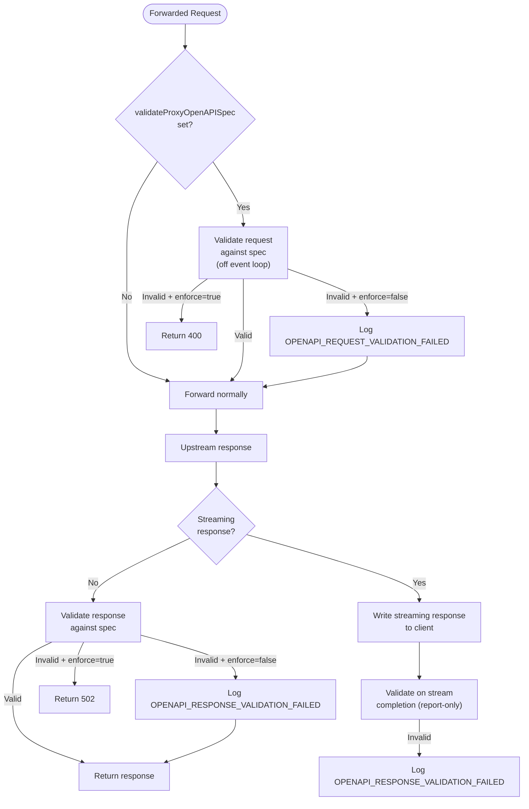

| Configuration Property | Type | Default | Description |
|----------------------|------|---------|-------------|
| `validateProxyOpenAPISpec` | String | `""` (disabled) | OpenAPI spec URL, file path, or inline payload to validate forwarded traffic against |
| `validateProxyEnforce` | Boolean | `false` | When true, block non-conformant traffic (400 for bad requests, 502 for bad non-streaming responses). Streaming responses are validated report-only. |

### OpenAPI Request Validation on the Mock Path

The validation proxy above only validates **forwarded** traffic. By default a request matched by an
OpenAPI-backed **mock** expectation (`Expectation.when(specUrlOrPayload, operationId)` / `openAPI(...)`) is
**not** revalidated against the spec — the expectation matcher already screens the request, but it matches the
request body loosely (a `jsonSchema` body matcher built with `withOptional`), so a malformed request that still
matches the operation is served the mock response.

When `validateRequestsAgainstOpenApiSpec` is set to `true`, MockServer additionally validates each matched
request against the spec the matched expectation was built from, **after the match but before the action is
dispatched** (in `HttpActionHandler.dispatchPrimaryAction`). A request that violates the spec is rejected with a
**400** describing the violations and logged as `OPENAPI_REQUEST_VALIDATION_FAILED`, instead of serving the mock
response. The check only applies when the matched expectation's request definition is an `OpenAPIDefinition`
carrying a `specUrlOrPayload`; for plain `HttpRequest`-backed expectations it is a no-op. Validation uses
`OpenAPIRequestValidator` and runs off the Netty event loop (inside `scheduler.submit`), mirroring the
validation-proxy request path. The flag is **off by default and fully back-compatible**.

| Configuration Property | Type | Default | Description |
|----------------------|------|---------|-------------|
| `validateRequestsAgainstOpenApiSpec` | Boolean | `false` | When true, requests matched by an OpenAPI-backed mock that violate the spec are rejected with a 400 instead of serving the mock response. OpenAPI-backed expectations only. |

### Loop Prevention

To prevent infinite forwarding loops (where MockServer forwards to itself), an `x-forwarded-by` header with a unique per-instance value (`MockServer_<UUID>`) is added to forwarded requests. If an incoming request already has this header with the matching value, it is identified as a loop and returned with a 404.

### Proxy Authentication

HTTP proxy requests can require Basic authentication. The `HttpRequestHandler` checks the `Proxy-Authorization` header against configured credentials. On failure, it returns 407 with a `Proxy-Authenticate: Basic` header.

## WAR Deployment (Servlet Mode)

`MockServerServlet` and `ProxyServlet` bridge the Servlet API to the same core processing:

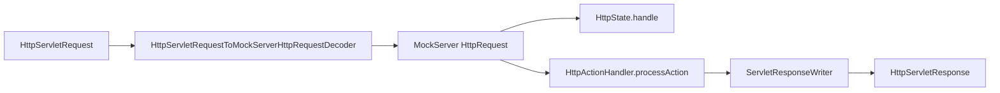

The only difference between the two servlets is a single boolean flag: `ProxyServlet` passes `proxyRequest=true` to `processAction()`, enabling forwarding of unmatched requests.

**WAR limitations**: WebSocket callbacks, dynamic port binding, and server stop are not supported.

## Startup Initialisation

`HttpState` performs several initialisation steps in its constructor:

| Step | Condition | Class |
|------|-----------|-------|
| File persistence | `configuration.persistExpectations()` | `ExpectationFileSystemPersistence` |
| Expectation loading | `initializationJsonPath`, `initializationOpenAPIPath`, or `initializationClass` set | `ExpectationInitializerLoader` |
| JSON file watching | `watchInitializationJson` enabled | `ExpectationFileWatcher` |
| Memory monitoring | `outputMemoryUsageCsv` enabled | `MemoryMonitoring` |

### Loop Prevention Header

MockServer adds an `x-forwarded-by` header to forwarded requests to prevent infinite loops. The header name is fixed (`x-forwarded-by`); the value is generated per server instance using the pattern `MockServer_<UUID>`. If an incoming request already contains this header with the matching value, it is identified as a loop and returned with a 404.

## CRUD Simulation

The CRUD simulation feature allows auto-generating stateful REST endpoints from a data model definition. Registered via `PUT /mockserver/crud`, it creates 5 endpoints (GET list, GET by ID, POST, PUT, DELETE) backed by an in-memory data store.

### Architecture

CRUD requests are intercepted in `HttpActionHandler.processAction()` **before** normal expectation matching. The dispatch chain is:

1. `CrudDispatcher.dispatch(request)` checks if the request path matches any registered CRUD basePath
2. If matched, delegates to the appropriate `CrudActionHandler` method based on HTTP method and path structure
3. If no CRUD match, falls through to normal expectation matching

### List query parameters (pagination / sorting / filtering)

The GET-list endpoint accepts optional query parameters, parsed and applied by `CrudListQuery` in the order **filter → sort → paginate**. When none are supplied the response body is byte-for-byte the legacy full array (and no pagination headers are added).

| Parameter | Meaning |
|-----------|---------|
| `filterField` + `filterValue` | keep only items whose `filterField` (dot-separated path, e.g. `address.city`) equals `filterValue` (case-insensitive); both must be supplied together (400 otherwise) |
| `sortBy` + `sortOrder` | sort by a dot-separated path, case-insensitive; `sortOrder` is `ascending`/`asc` (default) or `descending`/`desc` (400 otherwise); items missing the sort field sort last; stable |
| `page` + `size` | 0-based `page` (default 0) and page `size` (default: all); `size` ≤ 0 means no limit; a non-integer `page`/`size` or a negative `page` is a 400 |

When any list parameter is active the response adds `X-Total-Count` (total after filtering, before pagination), `X-Page`, and (when `size` is set) `X-Page-Size` headers; the body remains a plain JSON array of the page's items. This is the generic CRUD store's own query surface and is independent of the SCIM list callback's `startIndex`/`count`/`sortBy`/`filter` implementation.

### Key Classes

| Class | Location | Purpose |
|-------|----------|---------|
| `CrudExpectationsDefinition` | `mockserver-core/.../model/` | POJO model for the CRUD definition (basePath, idField, idStrategy, initialData) |
| `CrudDataStore` | `mockserver-core/.../mock/crud/` | Thread-safe in-memory store using ConcurrentHashMap + ConcurrentLinkedDeque |
| `CrudActionHandler` | `mockserver-core/.../mock/crud/` | Handles CRUD operations, produces HttpResponse objects |
| `CrudListQuery` | `mockserver-core/.../mock/crud/` | Parses + applies the GET-list pagination / sorting / filtering query params |
| `CrudDispatcher` | `mockserver-core/.../mock/crud/` | Routes requests to the correct handler based on path and method |

### Thread Safety

`CrudDataStore` uses `ConcurrentHashMap` for data storage and `ConcurrentLinkedDeque` for insertion order tracking. The `AtomicLong` counter handles auto-increment ID generation. All operations are individually thread-safe.

### Reset Behaviour

`CrudDispatcher.reset()` is called during `HttpState.reset()`, clearing all CRUD registrations.

## Binary Mock Processing

When `BinaryRequestProxyingHandler` receives raw bytes on a channel that is in proxy mode (a remote address is set on it), the bytes are forwarded to the upstream server and, by default, expectations are not consulted (with `forwardBinaryRequestsMatchExpectations` they can be: see [Binary expectations on a proxied connection](#binary-expectations-on-a-proxied-connection)). Otherwise it looks for a matching expectation via `HttpState.firstMatchingExpectation(BinaryRequestDefinition)`. A matched expectation is post-processed (`HttpState.postProcess`), so one used up by its `Times` is removed at once; until 9.0.0 it stayed listed as active until a later message matched it again. If a match is found with a `BinaryResponse` action, the handler writes the response bytes to the channel, after the response's `delay` if it has one (see [Delayed binary replies](#delayed-binary-replies)); a response with no data, or an empty array, is for a message that has no reply, so nothing is written and the connection stays open (the two mean the same: an empty array is not serialised, so `binaryResponse(new byte[0])` sent by the Java client is stored with null data, while raw JSON with `"binaryData": ""` is stored as an empty array; either is retrieved without `binaryData`). If no match is found, the "unknown message format" text is written and the channel closed. What one read loop delivers is one message: see [One Read Loop Is One Message](netty-pipeline.md#one-read-loop-is-one-message); with `binaryMessageFraming` set to `POSTGRESQL`, `MYSQL`, `REDIS` or `LENGTH_PREFIX` a message is exactly one message of that protocol instead, however it was read, up to `maxRequestBodySize` bytes: see [Named-Protocol Framing](netty-pipeline.md#named-protocol-framing). Forwarding without waiting for a response calls `NettyHttpClient`'s 5-argument `sendRequest` overload directly, which bypasses a subclass's override of the 4-argument overload — accepted and documented, see [decisions/binary-proxying-nowait-sendrequest-override.md](decisions/binary-proxying-nowait-sendrequest-override.md).

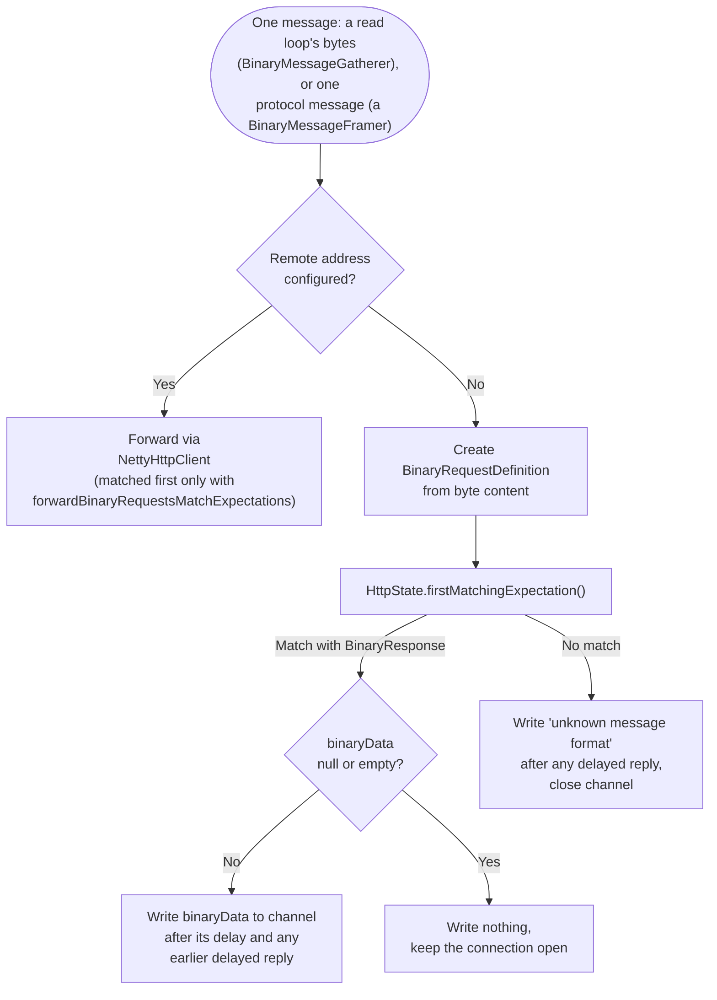

**Forwarding has two modes.** By default (`forwardBinaryRequestsUseSingleConnection`, on since 9.0.0) the connection's first message opens one upstream connection that is kept for the connection's life (`BinaryRelay`, connected by `NettyHttpClient.connectBinaryRelay`), every message is written to it, and whatever the upstream sends is written back as it arrives; a client that turns TLS on part way through (PostgreSQL's `SSLRequest`) has that upstream connection upgraded to TLS too, and a client that is TLS from its first byte gets an upstream connection that is TLS from its first byte. The upstream connection is made directly, or tunnelled through `forwardSocksProxy` or `forwardHttpsProxy` (`CONNECT`) when the target goes through one (`noProxyHosts` applies). With the setting `false`, and for a connection the relay does not carry (one whose only upstream proxy is `forwardHttpProxy`), each message is forwarded on an upstream connection of its own (`NettyHttpClient.sendRequest(BinaryMessage, ...)`), as in 8.0.0; `forwardBinaryRequestsWithoutWaitingForResponse`, deprecated, applies only there. The mode is chosen by the first statement of `BinaryRequestProxyingHandler.sendMessage`, once per connection, at its first message; see [netty-pipeline.md](netty-pipeline.md#one-upstream-connection-for-a-binary-connection) for the relay's backpressure, close and hand-back rules.

**A binary message's log entries show at most its first `maxLoggedBodyBytes` bytes (default 0: every byte).** Each entry that quotes a message or an upstream's response (the received record, "no matching binary expectation", "unknown message format" with its hex and its UTF-8 text, the mocked and forwarded response entries, `BinaryRelay`'s entries, a failed forward's, and `NettyHttpClient`'s DEBUG "sending bytes hex") shows the first `maxLoggedBodyBytes` bytes followed by `...(<length> bytes, only the first <n> logged, maxLoggedBodyBytes)`, as a body cut by the same setting keeps its first bytes and records its whole length. The cut is made as the entry is built (`StringFormatter.hexDumpForLog`, `formatBytes(byte[], int)`, `utf8ForLog`), so the whole dump is never made. The `binaryProxyListener` is not a log and still gets every byte.

**A failed forward is logged once.** `NettyHttpClient.sendRequest(BinaryMessage, ...)` logs no failure, except a `forwardProxyBlockPrivateNetworks` refusal, which the client logs and the handler does not: for any other failure its caller has the failed future and the message's correlation id, and `BinaryRequestProxyingHandler.logFailedForward` writes the one entry as it closes the client connection, at INFO for a header-limit refusal (the refusal itself is the WARN) and at WARN otherwise. A failure of the upstream connection (`ExceptionHandling.upstreamConnectionFailure`: an `IOException`, `SocketConnectionException`, `SocketCommunicationException` or `TimeoutException` among its causes) is named without a stack trace, as an HTTP forward's is; any other failure keeps its bounded stack trace. `BinaryRelay`'s connect failure follows the same rule.

### Delayed binary replies

**A `BinaryResponse`'s `delay` holds its reply back, and every later reply MockServer writes on the same connection waits behind it.** `BinaryLocalReplies` (one per connection, a channel attribute, used only on the connection's event loop) writes a reply at once when nothing waits and it has no delay; otherwise it queues it with a due time of the message's handling plus the sampled delay (`Delay.sampleValueMillis()`, so distributions apply) and writes each queued reply once it is due and every reply before it has been written, on an event-loop timer (`ctx.executor().schedule`). Nothing blocks a thread.

| Concern | Rule |
|---------|------|
| Order | Replies are written in the order of the messages they answer: a shorter delay, or none, waits behind an earlier longer one. Each delay counts from its own message, not from the reply before it |
| No match | The "unknown message format" text is queued too, and the connection closes after it is written; messages read while it waits are not answered (`BinaryLocalReplies.closing`) |
| Close | `channelInactive` and `handlerRemoved` call `BinaryLocalReplies.discard`, which cancels the timer and drops what waits; buffers are made only at the write, so nothing is left to release |
| Backpressure | More than `MAX_WAITING_REPLIES` (64) waiting stops reads (one `ChannelReadPause` hold), released once all are written or on discard |
| Expectation state | Post-processed when the message is matched, before the delay, as without one |
| No data | Nothing to write, so nothing to delay or order |
| Relayed connection | The reply is delayed the same way; `BinaryRelay.answeredLocally` runs after the write. Upstream responses are not held behind a delayed reply, except behind a `FORWARD_AND_REPLACE` replacement, which the relay writes in the upstream's order |

### Binary expectations on a proxied connection

With `forwardBinaryRequestsMatchExpectations` (default `false`), a message on a connection that `BinaryRelay` carries on one upstream connection is matched first, in `BinaryRequestProxyingHandler.answeredByExpectation`. A match with a `BinaryResponse` is answered by the same `replyFromExpectation` used without a target, and the message is **not forwarded**; anything else goes to `sendMessage` unchanged. The cost with the setting on and no binary expectation registered is one emptiness check (`HttpState.hasBinaryExpectations()`, an id set kept off the expectation store's mutation listener like the `respondBeforeBody` one). The relay's own rules for answered messages (no listener call, the ordering WARN, the client-not-writable hold) are in [netty-pipeline.md](netty-pipeline.md#binary-expectations-on-a-relayed-connection).

| Case | Result |
|------|--------|
| Setting off | Expectations not consulted, as in 8.0.0 |
| Setting on, connection forwarded one message per upstream connection (`forwardBinaryRequestsUseSingleConnection=false`, or the relay hands it back) | Not consulted; one WARN per connection |
| Matched, `BinaryResponse` with data (`upstream` absent or `ANSWER_ONLY`) | Written to the client; event log as without a target (`FORWARDED_REQUEST`, "returning binary mock response") |
| Matched, `BinaryResponse` without data (`ANSWER_ONLY`) | Nothing written, nothing forwarded |
| Matched, `upstream` `ANSWER_AND_FORWARD`, reply tracked | Answered as `ANSWER_ONLY`, then forwarded with `UpstreamReply.drop()`: the upstream's reply is dropped |
| Matched, `upstream` `FORWARD_AND_REPLACE`, reply tracked | Post-processed, logged ("to write binary mock response ... in place of its response"), forwarded with `UpstreamReply.replaceWith(data, sampled delay)`; nothing is written until the upstream's reply has ended |
| Matched, `ANSWER_AND_FORWARD` or `FORWARD_AND_REPLACE`, reply not tracked (`BinaryRelay.tracksReplies` false: RAW framing, or tracking given up) | Answered as `ANSWER_ONLY`; one WARN per connection |
| Matched, any other action | Post-processed, then forwarded, with a WARN |
| Not matched | Forwarded; the matcher pass adds its usual `EXPECTATION_NOT_MATCHED` entries |

`BinaryResponse.upstream` picks what happens upstream. The two modes that forward need to know where the upstream's reply to one message ends, which only a protocol's framing tells: with `binaryMessageFraming=POSTGRESQL` the relay follows the backend messages (`PostgresqlReplies`, [netty-pipeline.md](netty-pipeline.md#dropped-and-replaced-upstream-replies)). Without a target (plain mocking) the field is ignored and a match is `ANSWER_ONLY`.

## DNS Mock Processing

DNS queries arrive via UDP on a separate `DatagramChannel` bound by `MockServer.bindDnsPort()`. The `DnsRequestHandler` decodes the query, creates a `DnsRequestDefinition`, and matches it against expectations.

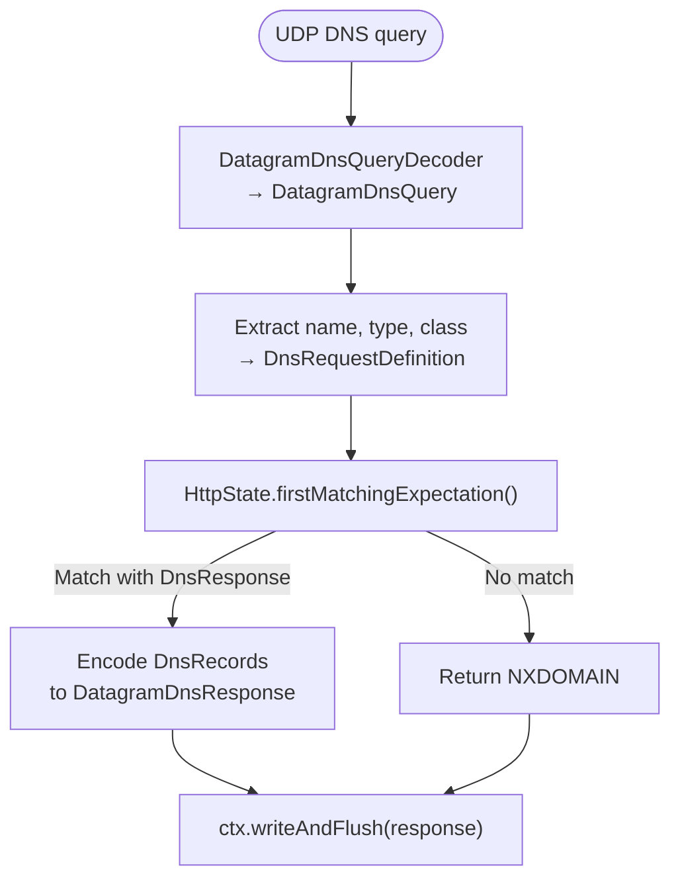

Supported DNS record types: A, AAAA, CNAME, MX, SRV, TXT, PTR. The DNS server is disabled by default (`dnsEnabled=false`) and must be explicitly enabled.

## OpenAPI Callback Support

When expectations are generated from an OpenAPI specification (via `PUT /mockserver/openapi` or `initializationOpenAPIPath`), MockServer now automatically processes `callbacks` defined on operations.

For each callback in the OpenAPI spec, `OpenAPIConverter.buildAfterActions()`:
1. Extracts the callback URL expression (e.g., `{$request.body#/callbackUrl}`)
2. Resolves the HTTP method from the callback operation
3. Extracts the request body schema and generates an example body
4. Creates an `AfterAction` with a `HttpForward`-style webhook that fires after the main response

Runtime expressions in callback URLs (e.g., `{$request.body#/callbackUrl}`) are preserved verbatim at spec-conversion time and resolved at callback fire-time by `OpenApiRuntimeExpressionResolver.resolve()`. The resolver is called in `HttpActionHandler.dispatchAfterAction()` and supports:

- `{$request.body#/<json-pointer>}` — JSON Pointer into the triggering request body (via Jackson `JsonNode.at()`)
- `{$request.query.<name>}` — query parameter value from the triggering request
- `{$request.header.<name>}` — header value from the triggering request
- `{$request.path.<name>}` — path parameter (best-effort; requires path parameters to be populated)
- `{$request.method}` — HTTP method of the triggering request
- `{$url}` — reconstructed URL of the triggering request

Unresolvable expressions (unknown format, missing values) are replaced with empty string. Response-based expressions (`{$response.body#/...}`, `{$response.header.*}`) are out of scope because the response object is not available at after-action dispatch time — these are also replaced with empty string.

The resolver guarantees a **strict no-op** when the after-action request contains no `{$...}` expressions: the original instance is returned without cloning or allocation. This ensures zero overhead for the vast majority of after-actions (plain webhooks).

Static callback URLs are used as-is (parsed into path + Host header at conversion time).

Remaining limitations:
- Only `post`, `put`, `patch`, `get`, and `delete` callback methods are supported
- Callback request bodies use the first available media type schema
- Response-based expressions are not resolved (response not available at dispatch time)

## Incremental OpenAPI Sync

The `PUT /mockserver/openapi` endpoint performs **idempotent, incremental synchronization** when re-importing an OpenAPI specification. Each generated expectation receives a stable, deterministic id of the form `openapi:<specKey>:<operationId>` (with `:<n>` appended only to disambiguate multiple expectations for the same operation, e.g. different response codes).

The `specKey` is derived from the parsed `info.title` field of the OpenAPI spec (lowercased, non-alphanumeric characters replaced with `_`). If the title is blank, a short hex hash of the raw spec payload/URL is used instead.

When the endpoint processes an import:

1. `OpenAPIConverter.buildExpectations()` generates expectations with stable ids
2. `HttpState.add(OpenAPIExpectation)` identifies the namespace prefixes (e.g. `openapi:swagger_petstore:`) covered by the new expectations
3. Existing expectations whose id starts with a covered prefix but is **not** in the new id set are **pruned** (removed)
4. The new expectations are upserted (added or updated in place by id)

This means:
- **Re-importing the same spec** is a no-op (same ids, same content)
- **Adding an operation** to the spec creates a new expectation without affecting existing ones
- **Removing an operation** from the spec prunes the corresponding expectation
- **Other specs and manually created expectations** are never affected (different namespace or no `openapi:` prefix)

The prune logic is encapsulated in `OpenApiSyncPlanner.idsToPrune()` for testability.

## Detailed Verification Failures (Diff Mode)

When `mockserver.detailedVerificationFailures` is enabled (default: `true`), verification failure messages include a "closest match diff" section showing exactly which fields of the closest matching request differed from the expected request.

### How It Works

In `MockServerEventLog.verify()`, after determining verification failed:
1. Creates an `HttpRequestPropertiesMatcher` for the verification request definition
2. Tests each received request against it with `detailedMatchFailures=true`
3. Identifies the closest match (fewest diff fields)
4. Appends formatted diff using `MatchDifferenceFormatter`

### 404 Closest Match Logging

When no expectation matches and a 404 is returned, `HttpActionHandler.returnNotFound()` calls `HttpState.findClosestMatchDiff()` to find the closest matching expectation's diff details and logs them at DEBUG level. By default the 404 response body is not modified to avoid breaking client assertions.

### Client-Visible Match Feedback (Opt-In)

When `attachMismatchDiagnosticToResponse` is enabled (default: `false`), unmatched 404 responses include diagnostic information to help test authors understand why their mock didn't match:

- **Header** `x-mockserver-closest-match`: lists the fields that differed (e.g., `fields differ: method, path`) or `no expectations configured` when no expectations exist.
- **Body**: a JSON object with `matchedFieldCount`, `totalFieldCount`, and a `differences` map keyed by field name, each containing an array of diff descriptions.

This reuses the existing `findClosestMatchDiff()` and `MatchDifferenceFormatter` infrastructure -- no new matcher logic is introduced. The diagnostic is only attached when the property is explicitly set to `true`; when off (the default), the response is byte-for-byte identical to previous behaviour.

### Key Classes

| Class | Location | Purpose |
|-------|----------|---------|
| `MatchDifferenceFormatter` | `mockserver-core/.../matchers/` | Formats `MatchDifference` maps into human-readable text |
| `MatchDifference` | `mockserver-core/.../matchers/` | Stores per-field match failure details (pre-existing) |
| `MatchFailureHints` | `mockserver-core/.../matchers/` | Generates actionable suggestions for common mismatches (pre-existing) |
| `MismatchRemediation` | `mockserver-core/.../matchers/` | Produces one-line remediation hints from `MatchDifference.Field` and diff messages (e.g., "use method POST not GET", "add trailing slash") |
