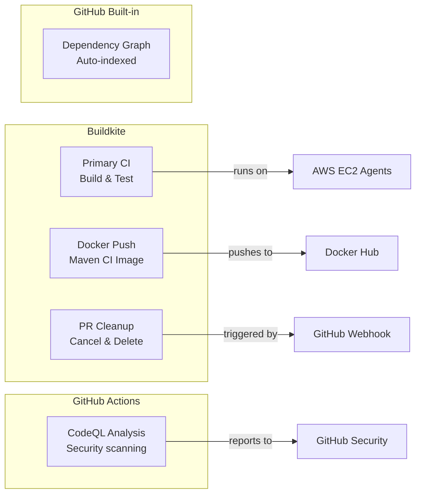
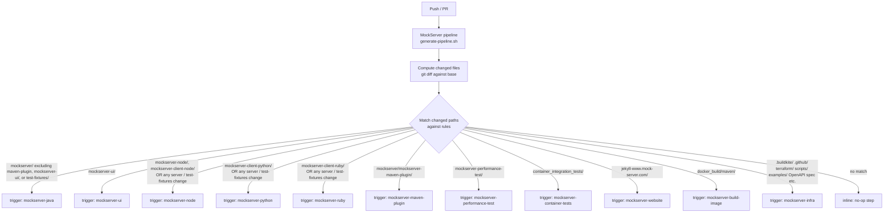
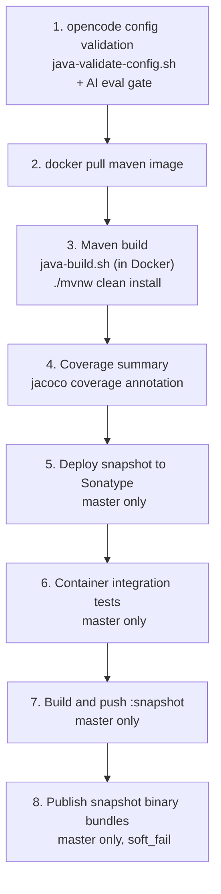
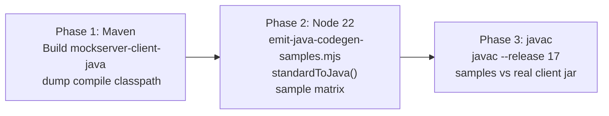
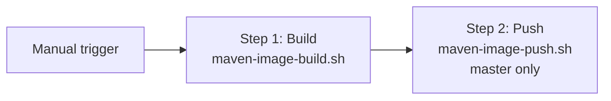
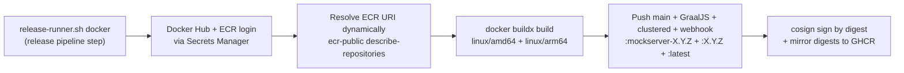
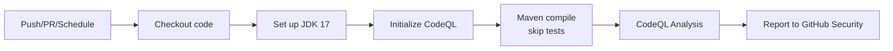
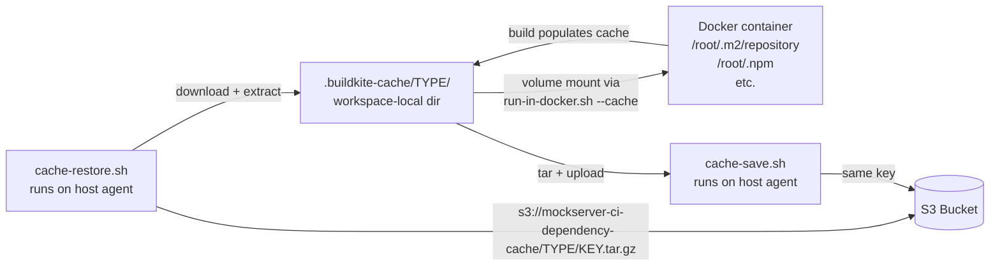

# CI/CD

## Overview

MockServer uses two CI/CD systems:



### CI Security Model

All custom CI pipelines run on Buildkite with self-managed EC2 agents. This keeps secrets (API tokens, Docker Hub credentials, AWS credentials) within the Buildkite/AWS boundary and avoids exposing them as GitHub Actions secrets.

**Principle:** Use Buildkite for any pipeline that needs secrets or performs actions. Use GitHub Actions only for read-only analysis that requires no secrets (e.g., CodeQL). Use Buildkite Pipeline Triggers to react to GitHub events without giving GitHub access to CI credentials.

| Concern | Approach |
|---|---|
| Build & test | Buildkite (EC2 agents, secrets in AWS Secrets Manager) for in-repo branches; **fork PRs** build & test on GitHub Actions (`pr-tests.yml`, secret-free, read-only token) since Buildkite must not run fork code |
| Docker push | Buildkite (Docker Hub credentials in AWS Secrets Manager) |
| GitHub event reactions | Buildkite Pipeline Triggers (GitHub webhook → Buildkite, no secrets in GitHub) |
| Security scanning | GitHub Actions CodeQL (read-only, no secrets needed) |
| Dependency graph | GitHub built-in (auto-indexed from manifests, no workflow needed) |

## Buildkite Pipelines

The monorepo uses a path-based pipeline orchestrator that dynamically triggers separate child pipelines based on changed files. Each child pipeline appears individually in the Buildkite dashboard, giving per-project visibility. Three agent queues are used:

| Queue | Instance Types | Purpose |
|-------|---------------|---------|
| `default` | `c5.2xlarge`, `c5a.2xlarge`, `m5.2xlarge` | Build and test workloads (Maven, Docker, k3d) |
| `trigger` | `t3.small`, `t3a.small`, `t3.micro` | Trigger polling jobs (`sleep` + `curl` loops) |
| `release` | Same as `default` | Release pipeline steps that access release secrets |
| `perf` | `c5.4xlarge` | Daily performance-regression benchmarks (k6 + JMH); scale-to-zero, max 1, 100% on-demand |

Trigger jobs (which poll child builds via the Buildkite API) run on cheap `trigger` queue instances to avoid starving build agents. See [Agent Starvation](#agent-starvation-from-script-based-triggers-resolved) for background.

### Pipeline Orchestrator

**File:** `.buildkite/scripts/generate-pipeline.sh`

The orchestrator runs as the first step of every build (via the main "MockServer" pipeline). It determines which files changed since the last successful build and emits command steps that call `trigger-pipeline.sh` to create child builds via the Buildkite API. For PRs, it diffs against the merge-base. For pushes to master, it queries the Buildkite API for the last successful build's commit SHA and diffs against it — this ensures that batch pushes with multiple commits correctly trigger all affected pipelines. If the base commit cannot be determined (API failure, first build, shallow clone), the orchestrator conservatively triggers all pipelines.



#### Client Conformance Triggering

Client pipelines trigger on **their own directory OR any server / `test-fixtures/`
change** (`trigger_client_if_changed` in `generate-pipeline.sh`). A server change
alters the wire format every client library encodes against, and `test-fixtures/`
is the shared parity corpus each client round-trips — so gating clients purely on
their own directory meant wire-format drift shipped with **zero** non-Java
verification, and editing the parity corpus triggered no build at all.
`mockserver/mockserver-maven-plugin/` is excluded: it has its own pipeline and does
not define the wire format.

#### Gates That Must Fail Closed

Several suites previously reported green while executing nothing. A skip is
indistinguishable from a pass, so these gates now fail loudly instead:

| Gate | Failure mode removed | Mechanism |
|------|---------------------|-----------|
| Cloud blob-store contract suites | `Assume` Docker guard skipped them on 100% of builds (`java-build.sh` never passed `-s`) | Own socket-enabled step (`java-cloud-store-test.sh`) + `assert-suite-ran.sh` asserts non-skipped tests actually ran |
| `container_integration_tests` | A test script crashing before `logTestResult` left no record; `EXIT_CODE` is only set from a non-empty fail log, so a total harness crash exited 0 | `test()` records unaccounted-for non-zero exits; the summary fails when nothing at all was recorded |
| Go / .NET / PHP client integration | Skipped silently without `MOCKSERVER_URL` (never set in CI) | Dedicated steps run a live server built from HEAD (`with-mockserver.sh`); `MOCKSERVER_REQUIRE_SERVER=true` turns any skip into a hard failure |
| Rust client integration | Entirely `#[ignore]`d; CI never passed `-- --ignored` | `rust-integration-test.sh` passes `-- --ignored` against a live server |
| Node client tests | A hand-maintained 7-file list while the suite had 15 | Test files are **discovered by glob**, in CI, `npm test`, and `test:coverage` alike |
| Go / .NET / Rust testcontainers | `soft_fail: true` made failures green | `soft_fail` removed |
| Transparent-proxy end-to-end suites | Named `*EndToEndIT`, matching neither Surefire (`**/*Test.java`) nor Failsafe (`**/*IntegrationTest.java`), so `SoOriginalDstEndToEndIntegrationTest`, `TproxyEndToEndIntegrationTest` and `EbpfOriginalDestinationEndToEndIntegrationTest` never ran on any build | Renamed to `*EndToEndIntegrationTest` so Failsafe collects them; opt-in step (`java-transparent-proxy-test.sh`, `RUN_TRANSPARENT_PROXY_E2E=true`) runs them under the Docker socket and asserts via `assert-suite-ran.sh` that they executed — see below |

**Why the transparent-proxy end-to-end suites are opt-in, not run by default:**
Unlike the cloud/async Docker-gated suites — which reach the daemon through
docker-java over the mounted socket — these three shell out to the **`docker` CLI**
to build and run a **sibling** container, and need real kernel privilege inside it
(`--cap-add=NET_ADMIN` for SO_ORIGINAL_DST/TPROXY, `--privileged` for eBPF). Two
facts about the current agents make them unable to pass today: the maven CI image
(`docker_build/maven/Dockerfile`) ships **no `docker` CLI binary**, and the
elastic-ci-stack agents run dockerd with **user-namespace remapping**, which
rejects `--privileged` outright. Under those conditions every suite SKIPS, and a
fail-closed `assert-suite-ran.sh` over skip-only suites would turn the pipeline
**permanently red without testing anything** — the exact ordering trap
`DockerAvailability`'s javadoc warns about ("a fail-closed assertion is only safe
once the suite can actually pass"). So `java-transparent-proxy-test.sh` defaults to
a **loud, expanded notice** that the suites were not executed (making the untested
state visible rather than a silent green), and runs + asserts them only when
`RUN_TRANSPARENT_PROXY_E2E=true` on an agent with the docker CLI, the socket, and
NET_ADMIN/`--privileged` support. The suites themselves skip cleanly (never error)
when the daemon refuses the privileged container, via
`DockerCliTestSupport.containerStartRejected(...)`.

**Why the cloud suites are a separate step, not `-s` on `java-build.sh`:**
`run-in-docker.sh` withholds the Docker socket from PR builds and `exit 0`s the
step when one is requested. Adding `-s` to the main build would therefore make the
**entire Java reactor** silently exit 0 on every PR build — trading a narrow false
positive for a total one. The split keeps the main build socket-free and confines
the PR-build socket skip to the three cloud modules, where it is announced in the
log rather than hidden behind an `Assume`.

The `mockserver-infra` pipeline (`pipeline-infra.yml`) runs lightweight validation
steps in Docker: opencode config lint, the **AI eval gate**, shell-script lint,
Dockerfile sync, Helm chart validation, and **API-collection validation**. The collection step
(`collections-validate.sh`) regenerates the Postman and Bruno collections from the
OpenAPI spec and fails if the committed `examples/postman/**` or `examples/bruno/**`
have drifted — so `examples/` and `jekyll-www.mock-server.com/mockserver-openapi.yaml`
also route to this pipeline.

### Buildkite Pipelines

All pipelines are managed via Terraform in `terraform/buildkite-pipelines/pipelines.tf`. Only the main orchestrator pipeline triggers from GitHub webhooks; all child pipelines have `trigger_mode = "none"` and are triggered by the orchestrator.

| Pipeline (Buildkite slug) | Pipeline File | Trigger | What It Builds |
|---|---|---|---|
| `mockserver` | `pipeline.yml` | GitHub push/PR | Orchestrator — triggers child pipelines |
| `mockserver-java` | `pipeline-java.yml` | Orchestrator | Full Maven build and test |
| `mockserver-ui` | `pipeline-ui.yml` | Orchestrator | UI lint, typecheck, test, build |
| `mockserver-node` | `pipeline-node.yml` | Orchestrator | Node.js lint and typecheck |
| `mockserver-python` | `pipeline-python.yml` | Orchestrator | Python unit + integration tests (builds MockServer image from HEAD) |
| `mockserver-ruby` | `pipeline-ruby.yml` | Orchestrator | Ruby unit + integration tests (builds MockServer image from HEAD) |
| `mockserver-maven-plugin` | `pipeline-maven-plugin.yml` | Orchestrator | Maven plugin build and test |
| `mockserver-performance-test` | `pipeline-perf-test.yml` | Orchestrator | Perf test script validation |
| `mockserver-container-tests` | `pipeline-container-tests.yml` | Orchestrator | Shell script validation + k3d Helm integration tests (builds the `-clustered` + webhook images from tree-built jar artifacts) |
| `mockserver-website` | `pipeline-website.yml` | Orchestrator | Jekyll site build |
| `mockserver-infra` | `pipeline-infra.yml` | Orchestrator | Infrastructure validation |
| `mockserver-build-image` | `docker-push-maven.yml` | Orchestrator + Manual | Build/push maven CI image |
| `mockserver-release` | `release-pipeline.yml` | Manual | Automated release pipeline (TOTP, Maven Central, maven-plugin, Docker Hub + ECR Public, npm, Helm, Javadoc, SwaggerHub, website, JSON Schema, PyPI, RubyGems, GitHub Release, optional versioned site) |
| `mockserver-cleanup` | `pipeline-cleanup.yml` | GitHub webhook + scheduled | Clean up builds for closed PRs |
| `mockserver-perf-regression` | `pipeline-perf-test.yml` | Daily Buildkite schedule (04:00 UTC) | Daily performance-regression pipeline — guard + k6 run + JMH microbench + rolling-baseline compare |

A single commit can trigger multiple child pipelines if it changes files in multiple areas. For example, a commit touching both `mockserver/` and `mockserver-ui/` triggers both `mockserver-java` and `mockserver-ui` pipelines.

All pipelines have `cancel_intermediate_builds` and `skip_intermediate_builds` enabled, but cancellation of **running** builds is scoped to non-master branches via `cancel_intermediate_builds_branch_filter = "!master"` (set uniformly in `terraform/buildkite-pipelines/pipelines.tf`). When a new build arrives for the same **feature/PR** branch (e.g. Dependabot rebases a PR), Buildkite cancels the running build to save agent VMs, and native trigger steps cancel the child builds too. On **master**, running builds are never cancelled: they always run to completion and report true pass/fail. Cancelling a master build mid-run would (a) leave that commit untested and (b) surface as a misleading failure on the parent pipeline whose trigger step was waiting on the cancelled child. Queued (not-yet-started) builds are still skipped on all branches — those report as "skipped" (neutral), not red.

### Closed PR Build Cleanup

**File:** `.buildkite/pipeline-cleanup.yml`

When a PR is closed or merged, its Buildkite builds are no longer needed. The cleanup pipeline cancels any running builds and deletes all builds for the closed PR's branch across all child pipelines. This keeps the Buildkite dashboard clean — only builds for open PRs and master are visible.

The cleanup pipeline operates in two modes:

1. **Webhook-triggered (primary):** A Buildkite Pipeline Trigger receives GitHub `pull_request:closed` webhooks directly. The webhook payload is available to the build step via `buildkite-agent meta-data get buildkite:webhook`. This provides immediate cleanup when a PR is closed.
2. **Scheduled sweep (safety net):** A daily cron schedule sweeps all pipelines for builds on branches whose PRs are no longer open on GitHub. This catches anything missed by the webhook.

#### Why Buildkite Pipeline Triggers instead of GitHub Actions

Buildkite Pipeline Triggers can receive GitHub webhooks directly with HMAC-SHA256 signature verification. This avoids storing a Buildkite API token as a GitHub Actions secret, keeping all CI credentials within the Buildkite/AWS boundary:

| Approach | Secrets exposed to GitHub | Event-driven | Complexity |
|---|---|---|---|
| **Buildkite Pipeline Trigger** | None (webhook URL only) | Yes | Low |
| GitHub Actions workflow | Buildkite API token | Yes | Low |
| AWS Lambda webhook receiver | None | Yes | High |
| Buildkite scheduled sweep only | None | No (polling) | Low |

#### Setup

Steps 1 and 4 are managed by Terraform (`terraform/buildkite-pipelines/pipelines.tf`). Steps 2 and 3 require manual setup because Buildkite Pipeline Triggers don't have a Terraform resource yet (the feature is in public preview).

1. **Pipeline + schedule** (Terraform): Run `terraform apply` in `terraform/buildkite-pipelines/` to create the `mockserver-cleanup` pipeline and its daily schedule.
2. **Pipeline Trigger** (Buildkite UI): Go to the [cleanup pipeline settings](https://buildkite.com/mockserver/mockserver-cleanup/settings) → Triggers → New Trigger → GitHub:
   - Description: `GitHub PR closed/merged`
   - Branch: `master`, Commit: `HEAD`
   - Security: check "Validate webhook deliveries", enter a secret (`openssl rand -hex 32`)
   - Copy the trigger URL (`https://webhook.buildkite.com/deliver/bktr_...`)
3. **GitHub webhook** (GitHub UI): Go to [repo webhook settings](https://github.com/mock-server/mockserver-monorepo/settings/hooks) → Add webhook:
   - Payload URL: paste the Buildkite trigger URL from step 2
   - Content type: `application/json`
   - Secret: same as step 2
   - Events: select "Let me select individual events" → check only "Pull requests"
4. **Daily schedule** (Terraform): Created automatically by step 1 — runs at 06:00 UTC daily as a safety net.

### Performance Regression Pipeline

**File:** `.buildkite/pipeline-perf-test.yml`

**Trigger:** Daily Buildkite schedule at 04:00 UTC (`build.source == 'schedule'`), or via the Buildkite UI (`build.source == 'ui'`). Not triggered by the path-based orchestrator.

**Purpose:** Catch performance regressions automatically without requiring manual perf runs after every commit. The pipeline is notify-only — it never fails a build, only annotates.

#### Commit-guard dynamic-dispatch pattern

The pipeline's first step (`perf-test-guard.sh`, `trigger` queue) implements a "daily but only if there's something new" gate:

1. Calls `last_perf_run_commit` (in `lib/last-successful-commit.sh`) — resolves the commit the heavy regression run *last actually executed against*, by reading the most recent `perf_regression_ran_commit` Buildkite build meta-data (set by `perf-test-run.sh`) via the Buildkite API (token in AWS Secrets Manager `mockserver-build/buildkite-api-token`). This is deliberately distinct from the sibling `last_successful_commit` (last *passed build*, used by `generate-pipeline.sh`): the perf-test pipeline passes on its lint step on every push, so "last passed build" would almost always be `HEAD` and the guard would skip forever.
2. If `HEAD` equals the last run commit, annotates "skipped" and exits 0 — no compute is consumed.
3. Otherwise (new commit, or no prior run recorded) uses `buildkite-agent pipeline upload` to dynamically inject the run, microbench, HTTP/2-multiplex, and compare steps into the running build. These steps target the `perf` agent queue (c5.4xlarge, on-demand).

This pattern avoids a fixed multi-step pipeline definition (which would always run all steps) while keeping the guard cheap on the `trigger` queue.

#### Steps

| Step script | Queue | What it does |
|---|---|---|
| `perf-test-guard.sh` | `trigger` | Commit guard + dynamic step upload |
| `perf-test-run.sh` | `perf` | k6 regression.js (HTTP + HTTPS/H2) + growth.js + background sampler; uploads `perf-result.json` |
| `perf-test-microbench.sh` | `perf` | JMH MatchingBenchmark with `-prof gc`; uploads `perf-microbench.json` |
| `perf-test-h2multiplex.sh` | `perf` | HTTP/2 multiplex benchmark (issue #2669): N=1,10,100 concurrent streams over one h2c connection; runs the harness `selftest` then the sweep; uploads `perf-h2-multiplex.json`. Notify-only, **no threshold** (recorded for trend only); a non-zero exit is a harness self-validation failure (bad measurement), not a slowdown |
| `perf-test-compare.sh` | `perf` | Merge artifacts + S3 persist + rolling median+MAD compare + Buildkite annotation |

See [Performance Tuning](../operations/performance-tuning.md#performance-regression-pipeline) for the full description of behaviours, thresholds, result schema, and how to re-baseline.

### CI Build Pipeline

**File:** `.buildkite/pipeline-java.yml`

Triggered by the orchestrator when files change in `mockserver/` or `mockserver-ui/`. The pipeline has multiple sequential phases separated by `- wait` directives:



#### Step 1: Validate Config

Runs `.buildkite/scripts/steps/java-validate-config.sh` to lint opencode configuration files.

Alongside it, `.buildkite/scripts/steps/validate-ai-evals.sh` runs the AI-component
eval harness with `STRICT=1` (see [AI Eval Gate](#ai-eval-gate) below).

#### Step 2: Update Docker Image

Pulls the latest `mockserver/mockserver:maven` build image to ensure the CI environment is current.

#### Step 3: Build

Runs `.buildkite/scripts/steps/java-build.sh`, which executes the full Maven build inside the `mockserver/mockserver:maven` Docker image via `run-in-docker.sh`:

- Volume-mounts the repository into the container
- Passes the `BUILDKITE_BRANCH` environment variable
- Executes `scripts/buildkite_quick_build.sh` which runs `./mvnw clean install`
- Memory limit: 7 GB
- Collects build artifacts: `.log` files, the **failing** tests' reports plus their console output (`mockserver/target/failed-tests/**`, curated by `java-collect-failures.sh`), the jacoco coverage XML and HTML tarball, and the shaded JAR. Per-class `TEST-*.xml` for passing classes are **not** uploaded — only failing-test artefacts appear in the build's artefact list, keeping it small (one `TEST-*.xml` per class otherwise produced ~650 artefacts that cluttered the list). A pass/fail summary is still printed at the end of the build log.

#### Step 4: Coverage Summary

Runs `.buildkite/scripts/steps/java-summarize.sh` to add a jacoco line-coverage annotation (and a link to download the `jacoco-html-reports.tar.gz` artefact) to the Buildkite build page. Runs with `continue_on_failure: true` / `soft_fail: true` so it never reddens the build. A separate diff-coverage gate (`diff-coverage.sh`, also `soft_fail`) annotates new-code coverage. The previous `junit-annotate` per-test-annotation step was removed along with the per-class `TEST-*.xml` upload it depended on; the end-of-log pass/fail summary and the failing-test artefacts cover failure triage instead.

#### Steps 5–8: Master-Only Steps

On `master` only, four additional steps run sequentially:

- **Deploy snapshot:** `.buildkite/scripts/steps/java-deploy-snapshot.sh` — publishes SNAPSHOT artifacts to Sonatype
- **Container integration tests:** `.buildkite/scripts/steps/container-tests-run.sh` — runs Docker Compose and Helm integration tests
- **Build and push :snapshot:** `.buildkite/scripts/steps/java-docker-push-snapshot.sh` — builds and pushes the `:snapshot` and `:mockserver-snapshot` Docker images (`:latest` is only pushed during releases)
- **Publish snapshot binary bundles** (`soft_fail`): `.buildkite/scripts/steps/java-publish-snapshot-bundles.sh` — builds JVM-less binary bundles for all platforms (linux/x86_64, linux/aarch64, darwin/x86_64, darwin/aarch64, windows/x86_64) using `scripts/build-all-bundles.sh` and uploads them to `s3://aws-binaries-mockserver/mockserver-<POM_VERSION>/`, served at `https://downloads.mock-server.com/mockserver-<POM_VERSION>/...`. Each master build overwrites the previous snapshot bundles. This provides working download URLs for the Go/.NET/Rust/Ruby/Python binary client launchers between releases. **No GitHub token is required** — the upload uses the agent's IAM instance role; the default-queue role needs `s3:PutObject` on `arn:aws:s3:::aws-binaries-mockserver/*` (provisioned via Terraform in `terraform/buildkite-agents/`). Releases still use GitHub Releases (via the release pipeline). The `jlink` cross-build needs JDK 21, which this step **bootstraps on demand** (downloads Temurin 21 for the host and passes it via `JAVA_HOME` to `build-all-bundles.sh` for that one invocation) — the **Maven build keeps running on JDK 17**, so the Java-17 floor is still enforced and this step never changes the Maven JDK. Master-only (`if: build.branch == 'master'`) and `soft_fail: true`, so **PR builds never publish** and bundle-build failures never redden master.

#### Client-Codegen Fidelity Gate

**Script:** `.buildkite/scripts/steps/ui-java-codegen-compile.sh`

**Trigger:** Path-gated to the `mockserver-java` pipeline — fires on any change under `mockserver/` (including `mockserver-client-java/`) or `mockserver-ui/`.

**Problem it solves:** The dashboard's "Java" language tab (`mockserver-ui/src/lib/standardCodegen.ts → standardToJava`) emits fluent MockServer client code. TypeScript string-assertion tests verify the emitted shape, but cannot catch a renamed or removed method on `MockServerClient` or the `org.mockserver.model.*` builders — the generated Java would ship broken silently.

**Three-phase approach:**



Each phase runs inside its own Docker image via `run-in-docker.sh`. Set `CODEGEN_COMPILE_USE_DOCKER=false` to run the same commands against host toolchains for local validation.

| Phase | Image | What it does |
|-------|-------|-------------|
| 1 | `mockserver/mockserver:maven` | `./mvnw install -pl mockserver-client-java -am -DskipTests -T 1C` then `dependency:build-classpath` to a file |
| 2 | `node:22` | Runs `mockserver-ui/scripts/emit-java-codegen-samples.mjs` — no `npm ci` needed; `standardCodegen.ts` is dependency-free |
| 3 | `mockserver/mockserver:maven` | `javac --release 17` on all emitted `.java` files against the Phase 1 classpath |

A **coverage floor** asserts at least 23 emitted samples — a regression that silently shrinks the emitter output fails loudly rather than passing with reduced coverage.

**Companion test:** `mockserver-ui/src/__tests__/fixtureCoverage.test.ts` is a Vitest meta-test that verifies the canonical fixture set at `test-fixtures/expectations/` collectively exercises every top-level key in the server `expectation.json` schema, every `ACTION_FAMILY_KEY`, every `StandardActionType`, and every `BodyMatcherType`. Adding a new server feature without a covering fixture fails CI until a fixture is added.

**Ratchet ledger:** `test-fixtures/expectations/known-gaps.json` tracks accepted per-language JSON-path gaps in the cross-language round-trip fidelity tests. A stale entry (one that no longer excuses any diff) fails CI — the ratchet re-arms as client models are completed. This file conflicts on every rebase when multiple worktrees are active; always resolve from `origin/master` after a rebase.

### AI Eval Gate

**File:** `.buildkite/scripts/steps/validate-ai-evals.sh` (runs in both `pipeline-infra.yml` and `pipeline-java.yml`)

Runs the AI-component eval harness (`.opencode/evals/run-evals.sh`) with `STRICT=1`.
`STRICT` is what makes it a gate: without it the runner counts a fixture with no
recorded baseline as `PENDING` and still exits 0 — which is exactly how the suite
sat at "5 fixtures, 0 baselines, OK" until commit `aff5730a0`.

Enforced mechanically:

| Condition | Exit |
|---|:--:|
| A fixture has no committed `.result` baseline | 1 |
| A committed baseline disagrees with the fixture's `expected_verdict` | 1 |
| A fixture is malformed (bad frontmatter, `id` ≠ filename stem, invalid verdict, `FLAG` on a review agent) | 2 |
| A `.result` is orphaned (its fixture was deleted or renamed) | 2 |
| The corpus drops below the `MIN_TASKS` floor, or is empty | 2 |

Buildkite is path-filtered, so this runs on builds that trigger `mockserver-infra`
or `mockserver-java` rather than literally every build. All AI-component paths —
`.opencode/`, `.claude/`, `AGENTS.md`, `CLAUDE.md`, `opencode.jsonc` — route to the
infra pipeline, so any change that could move a verdict does run the gate. It is
duplicated into the java pipeline for the same reason the opencode config lint is:
consistency with that precedent, not extra coverage (AI-component paths never
trigger the java pipeline on their own).

**What this gate does not do (1): it cannot detect a laundered baseline.** Both
`expected_verdict` and `.result` are committed, so editing them together to match a
degraded agent passes silently. That is why `.opencode/evals/**` is an enumerated
control path requiring `review-final` and explicit approval.

**What this gate does not do (2): it does not re-invoke the agents.** Buildkite has no
model credentials, and a live agent run is neither cheap nor deterministic.
Recording a baseline stays an agent-in-the-loop step performed locally
(`.opencode/evals/README.md`). So CI proves the corpus is **complete and
self-consistent**; it does not prove the agents still behave that way today. The
behavioural check is the local commit-workflow gate on AI-component changes
(`.opencode/rules/evaluation-harness.md`).

### Spot Resilience (agent-lost auto-retry)

The `default` agent queue is a mix of on-demand and Spot instances (see [aws-infrastructure.md](aws-infrastructure.md#scaling-behaviour)). When AWS reclaims a Spot instance mid-build, the Buildkite agent is lost and the running job ends with **exit status `-1`** (or `255`) — an infrastructure kill, not a test failure. The Maven build runs 15–25 minutes, so a reclaim part-way through used to fail the whole build and require a manual re-run (~2 Spot evictions/day were observed).

Two complementary mitigations:

- **`automatic_retry` on agent-lost** — the long, non-`soft_fail` command steps (`:maven: build`, deploy snapshot, container integration tests, build-and-push `:snapshot`) declare `retry.automatic` for `exit_status: -1` and `255` (`limit: 2`). A Spot reclaim silently re-queues the job onto a fresh agent instead of reddening the build. **Real test failures exit `1` and are NOT retried**, so this never masks genuine breakage.
- **Higher on-demand ratio** — the default queue's `on_demand_percentage` was raised from 20% to 60% so a long build is much less likely to land on a Spot instance in the first place (the on-demand base capacity of 1 is unchanged).

### Transient Maven Central Resilience

A single transient failure from `repo.maven.apache.org` (a `Connection reset` / timeout / 5xx while resolving one artifact or plugin) used to redden a whole multi-module build — including builds that had already passed every test, and child pipelines (python/ruby/node/UI) that only touch Maven to build the mockserver jar before their own language tests. Three complementary, defence-in-depth mechanisms address it. They are layered deliberately: each covers a failure window the others do not.

| Layer | Mechanism | Bridges | Where |
|-------|-----------|---------|-------|
| In-Maven retry | `aether.connector.http.retryHandler.count=5` + `requestSentEnabled=true` + `connectionMaxTtl=120` | A sub-second blip: immediate in-process retries of the failed transfer | `mockserver/.mvn/maven.config` (every reactor-rooted Maven invocation inherits it) |
| Warm local repo | Restore the S3 `maven` dependency cache before the jar build so most resolutions never touch Central at all | Everything already cached (the common case) | `cache-restore.sh maven` in the java, maven-plugin, **python, ruby, node and UI** pipelines; `build-local-mockserver-image.sh` now mounts `--cache maven` |
| Step re-run | Buildkite `retry.automatic` on a dedicated **sentinel exit code 42** | A longer outage window (minutes): the whole step is re-queued and re-run later | `run-in-docker.sh` remaps transient failures to 42 (CI only); **jar-only** steps opt in with `- exit_status: 42` (`limit: 2`) |

**Why the native-transport property names, not `maven.wagon.http.*`.** Maven 3.9 defaults to the native Maven Resolver HTTP transport, which **ignores** the legacy `maven.wagon.http.*` properties — setting those would be a silent no-op (a false-green). The `aether.connector.http.*` keys are the ones the native transport reads (verified: with them a `Connection reset` is retried the configured number of times; without them the resolver's default of 3 immediate retries applies). Note the native default is already 3 **immediate, no-backoff** retries, which is why a sub-second blip can still slip through and why the warm cache and step-retry layers matter more than the raised count.

**Why a sentinel exit code for the Buildkite retry.** Buildkite `retry.automatic` matches only on exit status, and a transient Central failure exits `1` — the **same** code as a genuine test/compile failure — so retrying on `1` would silently retry real regressions into green. Instead, `run-in-docker.sh` inspects the build output on failure and, **only** when it sees a Maven *resolution* phrase (`Could not transfer artifact` / `Failed to read artifact descriptor` / `Could not resolve dependencies` …) **and** a *network* cause (`Connection reset` / timeout / 5xx) on the same line, remaps the exit to `42`. That precision is load-bearing:

- A test that itself logs `Connection reset` (many MockServer tests do) carries no resolution phrase on that line → **not** remapped.
- A genuine missing-artifact / 404 (`Could not find artifact`, no network cause) → **not** remapped, so a real dependency bug stays red.
- The remap is **CI-only** (`BUILDKITE=true`); local `run-in-docker.sh` keeps its original `exec` semantics and real exit code.

**What a retry can and cannot mask.** It CAN mask (by re-running, up to `limit: 2`) a transient-infra window that outlasts Maven's own in-process retries. It CANNOT mask a test, compile, or asset regression on the steps that opt in: each of those steps isolates a `-DskipTests` Maven resolution in its **own** `run-in-docker.sh` invocation, separate from the invocation that runs the tests (the jar build, then a distinct pytest/rspec/Playwright/etc. run) — so a real test failure occurs in an invocation whose log carries no Maven-resolution line, exits `1`, and can never reach `42`. It also cannot mask a Central outage longer than the retries — that still ends red after the cap.

**Why the java `:maven: build` step is deliberately NOT opted in.** That step runs `clean install` — dependency resolution AND the entire unit + Failsafe reactor — in one classified `run-in-docker.sh` invocation. Under the default `-T 1C` fail-fast reactor a transient transfer line in one module can co-occur in the same log with a genuine test failure in another, so the "never reach 42" invariant would NOT hold there and a 42-retry could re-run a real (flaky) test failure. The java reactor build therefore relies only on layers 1 and 2 (in-Maven retry + the warm maven cache it restores at the top of its pipeline, which it is also the sole saver of). Only steps whose Maven work is a pure `-DskipTests` jar build, isolated from their tests, carry the step-retry.

**Coverage and limits.** The sentinel is produced centrally in `run-in-docker.sh`, so it covers every Maven build that runs through it. Maven invocations that bypass `run-in-docker.sh` (host `mvn` in `perf-test-microbench.sh`, and the host-`mvnw` fallbacks in `docker-build-verify.sh` / `verify-tcnative-stamp.sh`) do not get the step-retry, but still benefit from the in-Maven retry layer. The `maven` cache key is the hash of every `mockserver/**/pom.xml`, so a **dependency bump changes the key and forces a cold (cache-miss) build** — meaning the warm-cache layer does *not* help the very Dependabot PRs that most often trigger the transient, which is precisely why the in-Maven retry and step-retry layers exist alongside it. Client pipelines restore the maven cache **read-only**; the java and maven-plugin pipelines remain the sole savers.

### Python and Ruby Client Integration Tests

**Files:** `.buildkite/scripts/steps/python-integration-test.sh`, `.buildkite/scripts/steps/ruby-integration-test.sh`

These pipelines run independently from the Java pipeline and do not have access to Java build artifacts. To test against the HEAD-built MockServer (not a stale `:snapshot` from Docker Hub), both scripts source a shared helper:

- **Helper:** `.buildkite/scripts/build-local-mockserver-image.sh` — builds the `mockserver-netty-no-dependencies` shaded JAR from the Maven reactor (skipped if the JAR already exists), copies it into `docker/local/`, and runs `docker build` to produce a local image tagged `mockserver-under-test:local` (configurable via `MOCKSERVER_IMAGE` env var).

The test fixtures (`conftest.py` for Python, `integration_spec.rb` for Ruby) also respect the `MOCKSERVER_IMAGE` env var when launching a container in standalone/local mode.

### Maven CI Image Push Pipeline

**File:** `.buildkite/docker-push-maven.yml`

**Trigger:** Manual (via Buildkite UI or API)

Builds and pushes `mockserver/mockserver:maven` — the Docker image used by the CI build pipeline. Run this when:
- `docker_build/maven/Dockerfile` or `docker_build/maven/settings.xml` change
- Monthly, to pick up base OS security updates
- After upgrading Maven or JDK versions



The pipeline has two steps separated by a `- wait` directive:

1. **Build:** `.buildkite/scripts/steps/maven-image-build.sh` builds the `mockserver/mockserver:maven` image
2. **Push** (master only): `.buildkite/scripts/steps/maven-image-push.sh` authenticates to Docker Hub via AWS Secrets Manager (`mockserver-build/dockerhub`) and pushes the image

### Release Image Push (Docker step of the release pipeline)

**Script:** `scripts/release/components/docker.sh`, invoked as the `:docker: Docker Image` step of `release-pipeline.yml` (`release-runner.sh docker`).

**Trigger:** Runs automatically as part of the `mockserver-release` pipeline — there is no separate manual image pipeline.

**Queue:** `release` — needs `mockserver-release/cosign-key` (image signing) and the release-scoped Docker Hub / ECR push credentials.

Builds and pushes the production MockServer Docker images as multi-arch images (`linux/amd64` + `linux/arm64` via QEMU). Four image variants are published: main, GraalJS, clustered, and webhook. After push, each image is cosign-signed by digest, and the same digests are mirrored to GHCR.

The `RELEASE_VERSION` / tag is derived from the release pipeline context.

Tags pushed per image:
- `mockserver/mockserver:mockserver-X.Y.Z` + `:X.Y.Z` + `:latest` (main, GraalJS, clustered variants)
- `mockserver/mockserver-webhook:mockserver-X.Y.Z` + `:X.Y.Z` (admission webhook)
- Same tags to ECR Public (URI resolved dynamically via `aws ecr-public describe-repositories`) and mirrored to GHCR



The ECR repository URI is resolved at runtime via `aws ecr-public describe-repositories` rather than hardcoded — the registry alias is AWS-assigned and must not be hardcoded (`scripts/release/components/docker.sh`).

### Release Pipeline Security

#### File-based secrets (no `-e` in docker run)

All release scripts that run toolchains inside Docker containers (`scripts/release/components/maven-central.sh`, `maven-plugin.sh`, `helm.sh`, `docker.sh`) write secrets to `0600` files under `.tmp/` and read them from inside the container via mounted volume, rather than passing them as `docker run -e VAR=value`. Environment variables are readable from `/proc/1/environ` and via `docker inspect`; file-based secrets under `.tmp/` are not.

| Secret | File pattern | Removed from container via |
|--------|-------------|---------------------------|
| GPG key (base64) | `.tmp/gpg-key.$PID` | `trap` cleanup function on EXIT |
| GPG passphrase | `.tmp/gpg-passphrase.$PID` | same trap |
| Sonatype credentials | `.tmp/sonatype-creds.$PID` (username\npassword) | same trap |
| GHCR token | `.tmp/ghcr-creds.$PID` (username\ntoken) | `trap ... EXIT` in helm.sh |
| cosign key | `.tmp/cosign-key.$PID` | removed after signing |
| cosign password | `.tmp/cosign-pw.$PID` | removed after signing |
| Sonatype netrc | `.tmp/sonatype-netrc.$PID` | `trap ... EXIT` in polling loop |

Curl calls to the Sonatype Central Portal API use `--netrc-file` rather than `Authorization: Basic <base64>` in a shell variable, so credentials are not held in the shell environment across the 30-minute polling loop.

#### TOTP tolerance window (by design)

The TOTP verification step (`release-verify-totp.sh`) accepts ±5 minutes of clock skew (`TOTP_TOLERANCE_WINDOWS=10`). This is intentional — release-queue agents scale to zero, so the agent that runs the verifier cold-starts after the operator enters the code in the Buildkite block step. The Lambda autoscaler poll, EC2 spot acquisition, and agent bootstrap together take up to ~2.5 minutes. A standard ±1-window tolerance would produce false rejections on every cold-start without adding security, because the `allowed_teams: ["release-managers"]` gate on the block step is the primary access control.

To change this behaviour: either pre-warm the release queue or move TOTP validation into the block step itself (which runs in the Buildkite control plane, not on an agent).

#### Docker image cosign signing

After pushing release images to Docker Hub and ECR, the release pipeline cosign-signs each image digest using the same key infrastructure as Helm chart signing (`mockserver-release/cosign-key` in Secrets Manager). Signing is by digest so the signature binds to the exact manifest content, not a mutable tag.

Signing is strictly non-fatal: if the cosign key is absent or the binary is not installed, the images remain published and the release continues. The guard is:

```bash
if aws secretsmanager describe-secret --secret-id mockserver-release/cosign-key; then
  # sign
fi
```

See [Docker image verification](docker.md#verifying-image-signatures) for how to verify a signed image.

### Build Docker Image

The `mockserver/mockserver:maven` image is defined in `docker_build/maven/Dockerfile`:

- Base: Ubuntu 24.04 (Noble)
- JDK: OpenJDK 17
- Maven: 3.9.16 (manually installed from Apache)
- Dependencies: Pre-fetched by running a throwaway build during image creation
- Corporate CA: Optional certificate injection for TLS proxy environments (see [Docker](docker.md#maven-ci-image))
- Global Maven settings: `docker_build/maven/settings.xml` is copied to `conf/settings.xml`. It
  deliberately declares **no** repositories. These settings apply to every Maven process in the
  container — including the child builds started by `maven-invoker-plugin`, whose own `-s <settings>`
  replaces the *user* settings but not the global ones. Adding a snapshot repository here therefore
  makes the *whole* CI build reach over the network for MockServer's own artifacts, which can fail a
  build with a `403`/timeout in an unrelated module, and lets a previously published snapshot win
  whenever a locally installed one is older; see
  [Build System → The build never resolves from the snapshot repository](../operations/build-system.md#the-build-never-resolves-from-the-snapshot-repository).

Changes to `docker_build/maven/settings.xml` only reach CI once the `docker-push-maven` pipeline
rebuilds and pushes the image.

### Docker Registry Authentication

Docker push pipelines authenticate to two registries:

**Docker Hub** — credentials stored in AWS Secrets Manager (`mockserver-build/dockerhub`):

```json
{"username": "...", "token": "..."}
```

The shared script `.buildkite/scripts/docker-login.sh` fetches the secret and runs `docker login`.

**AWS ECR Public** — authenticated via IAM instance role (no stored credentials needed):

The shared script `.buildkite/scripts/ecr-login.sh` runs `aws ecr-public get-login-password --region us-east-1 | docker login --username AWS --password-stdin public.ecr.aws`.

Buildkite agent EC2 instances have IAM permissions for both Docker Hub secret access and ECR Public push (via `managed_policy_arns` in `terraform/buildkite-agents/main.tf`).

All Docker push scripts call both login scripts and push tags to both registries in a single `docker buildx build` command.

### Managing Buildkite Pipelines

Pipelines are managed via Terraform in `terraform/buildkite-pipelines/`. The Terraform stack includes all 15 pipelines (orchestrator, 11 child pipelines, 2 Docker image push pipelines, and 1 release pipeline), each pointing to `mock-server/mockserver-monorepo.git`. To add a new pipeline:

1. Create the pipeline YAML in `.buildkite/`
2. Add an entry to `local.pipelines` in `terraform/buildkite-pipelines/pipelines.tf`
3. Add a `trigger_if_changed` call in `.buildkite/scripts/generate-pipeline.sh`
4. Run `terraform apply` in `terraform/buildkite-pipelines/`

The Buildkite API token is stored in AWS Secrets Manager (`mockserver-build/buildkite-api-token`) and is used by the Terraform Buildkite provider for pipeline management.

### Checking build status from the command line

Use `scripts/ci/bk-pipeline-status.sh` to query (or watch) a pipeline build instead of hand-writing `bk`/`curl` calls each time. It wraps the **reliable** `bk build list` / `bk job log` commands — preferred over `bk auth token` + `curl` to the REST API and over the Secrets Manager tokens, because only the locally-authenticated `bk` CLI dependably has both build-state and `read_build_logs` scope, and it needs no AWS SSO session.

```bash
scripts/ci/bk-pipeline-status.sh -p mockserver-java -c <commitSha>          # one-shot status
scripts/ci/bk-pipeline-status.sh -p mockserver-java -c <commitSha> --watch  # poll until terminal
scripts/ci/bk-pipeline-status.sh -p mockserver-java -b <number> --logs      # tail the failing job log
scripts/ci/bk-pipeline-status.sh -p mockserver-java -b <number> \
  --grep 'BUILD FAILURE|<<< (FAILURE|ERROR)|npm error'                       # find the failure in the whole log
```

It prints `build#<n> <commit> build=<state> <job>=<state> exit=<code>` and exits `0` (passed) / `2` (failed) / `3` (timeout). For continuous watching, drive it with the agent Monitor tool in `--watch` mode (see the `build-monitor` skill).

## GitHub Actions

Several workflows run on GitHub Actions (CodeQL, Maven dependency submission, scheduled hygiene jobs such as certificate-expiry, and issue/label automation). The security-relevant ones are described below.

### CodeQL Security Analysis

**File:** `.github/workflows/codeql-analysis.yml`

**Triggers:**
- Push to `master`
- Pull requests targeting `master`
- Weekly schedule: Tuesdays at 22:00 UTC

**Languages scanned:** Java, JavaScript, Python, Ruby

**Process:**



The workflow:
1. Checks out the repository
2. Sets up JDK 17 (Temurin distribution)
3. Initializes CodeQL for Java, JavaScript, Python, and Ruby
4. For Java: Runs `./mvnw clean compile -DskipTests -Dmaven.javadoc.skip=true` (CodeQL autobuild)
5. For JavaScript, Python, and Ruby: Analyzes source files directly (no build required)
6. Performs CodeQL static analysis to detect security vulnerabilities
7. Uploads results to GitHub Security tab

**Results:** Vulnerabilities appear in the repository's Security tab under "Code scanning alerts".

### Maven Dependency Submission

**File:** `.github/workflows/dependency-submission.yml`

Dependabot vulnerability **alerts** are computed from the dependency graph submitted to GitHub — for Maven, an *accurate transitive* graph requires **dependency submission** (a workflow that resolves the tree and POSTs it), not static manifest indexing. GitHub's managed Maven auto-submission only discovers a project at the **repository root**, so after the Java project moved into `mockserver/` it silently stopped and the graph froze at a pre-move snapshot (phantom Spring advisories, missed `log4j`/`jsoup` pins). This explicit workflow restores accurate submission for the monorepo layout, covering the `mockserver/` reactor and the separate `mockserver-maven-plugin` build under distinct correlators.

The full rationale, the two-project coverage table, the cost/trigger design, and the recommendation on the (now inert) managed submission live in **[docs/operations/security.md → Maven Dependency Graph Submission](../operations/security.md#maven-dependency-graph-submission)** — the authoritative home, since alerting is a security concern.

**Triggers:** push to `master` touching `mockserver/**/pom.xml`, plus `workflow_dispatch`.

**Note:** an earlier `dependency-submission.yml` was removed on the belief that the built-in graph gave equivalent coverage. That belief was wrong for a non-root Maven project and is what let the graph go stale — see the security.md section above.

### Dependabot auto-merge

**File:** `.github/workflows/dependabot-auto-merge.yml`

**Bottom line:** minor/patch Dependabot PRs are merged automatically once **every check that actually exists on the PR head commit has genuinely passed** — read live from **both** GitHub check APIs, never from a maintained list. Anything ambiguous fails closed and the PR is left for a human.

**Why not GitHub-native auto-merge?** Native auto-merge waits only on the branch-protection **required-status-check list**. In this repo Buildkite and both Snyk scans are **not** required checks (see [Pull requests from external forks](#pull-requests-from-external-forks) — a docs-only change can merge on green CodeQL alone). So native auto-merge would merge a Dependabot PR the moment its *required* checks were green while Buildkite or a Snyk scan was still pending or **red** — and any newly-added check is invisible to it until someone remembers to add it to the required list. That silent under-coverage is the exact class of miss this repo has shipped before. **Do not replace this workflow with native auto-merge or `gh pr merge --auto`.**

**The defining property — read the checks that exist, not a list.** The two GitHub APIs report **disjoint** sets and both must be aggregated:

| API | Endpoint | What it carries here (verified on PR #2562's head) |
|---|---|---|
| Check Runs | `GET /commits/{sha}/check-runs` | 6 runs — CodeQL, the four `Analyze (*)` language runs, and the fork-only `Build & test full reactor` (which is `skipped` on in-repo branches) |
| Commit Statuses | `GET /commits/{sha}/status` | 3 statuses — `buildkite/mockserver` and **both** Snyk scans |

A workflow reading only check-runs would see 6 green and merge **while missing the build and the vulnerability scanner entirely**. This workflow aggregates all **9** signals and requires every one to be green.

**Fail-closed decision matrix.** The job refuses (and logs *why*) on any of:

- author is not `dependabot[bot]`; PR not `open`; PR is a draft;
- head repo ≠ base repo (a **fork** — never merged, never mergeable via this path);
- the PR matches none of the three accepted classes — a `*-minor-and-patch-*` group branch (path A), a distroless **digest** branch whose PR title is also Dependabot's digest-bump shape (path B), or a Dependabot **security** update whose body carries the security-fix footer and whose title parses to a single **within-major** version bump (path C) — see major exclusion, digest handling, and security handling below;
- `mergeable` is not `true` (unknown/conflicting), or `mergeable_state` is `dirty`/`behind`/`blocked`/`unknown`;
- **zero** checks found on the head commit (the empty-set trap — silence is never success);
- any check-run not `completed`, or with conclusion `failure`/`cancelled`/`timed_out`/`action_required`/`stale`/`startup_failure`/null/**any unrecognised value**;
- any commit status whose state is not `success` (i.e. `pending`/`failure`/`error`/unrecognised);
- no successful check at all (e.g. everything `skipped`); or any API call erroring.

`skipped` and `neutral` check-run conclusions are treated as **non-blocking** (GitHub itself treats them as non-failing), because the fork-only `Build & test full reactor` check is legitimately `skipped` on every in-repo branch — treating `skipped` as a failure would merge nothing. Requiredness cannot be read without the branch-protection list this workflow deliberately avoids, so it defers to GitHub's own non-failing treatment of `skipped`/`neutral` while still requiring at least one genuine `success`.

**Why that leniency is safe, and the assumption it rests on.** It can only ever apply to *check runs*. `buildkite/mockserver` and both Snyk scans are **commit statuses**, and the legacy Commit Status API has only four states — `error`, `failure`, `pending`, `success`. There is no `skipped` or `neutral` for a status to report, so the build and the vulnerability scanners are structurally incapable of reaching the non-blocking path: they either pass or they refuse the merge. That is why no allowlist of required contexts is needed — naming them would reintroduce exactly the maintained list that made native auto-merge unsafe.

**If Buildkite or Snyk ever migrates to the Checks API** (for example by installing Snyk's GitHub App in checks mode), this reasoning stops holding: a `skipped` or `neutral` from them would become non-blocking, and the workflow would be able to merge past the build or a vulnerability scan. Revisit the leniency if either ever stops reporting as a commit status. The `Reported as` column in the table above is the thing to check.

**One residual gap, recorded rather than fixed.** The workflow gates only checks that have already posted; it cannot tell "this context does not apply" from "this context has not reported yet". It relies on Buildkite and Snyk registering their `pending` status within seconds of a push, well before the slower CodeQL runs complete — so any sweep that sees a green check-run also sees those statuses (as `pending`, which refuses). A future check that reports much faster than Buildkite could in principle open that window.

**Majors are excluded structurally, not by parsing.** `.github/dependabot.yml` groups `minor`+`patch` into `*-minor-and-patch` groups for every ecosystem; **majors are excluded from every group's `update-types`**, so a major arrives as an **ungrouped single-dependency** branch (e.g. `dependabot/maven/mockserver/com.graphql-java-graphql-java-27.0.0`) that does not match `^dependabot/.+-minor-and-patch-[0-9a-f]+$`. This is **spoof-resistant** because the head branch lives **in this repository** and is created by **Dependabot alone**: a PR author cannot cause Dependabot to name a major-bump branch after a minor/patch group, and the fork gate independently rejects any branch not in this repo. Group membership is therefore a *structural* signal, not a parsed version string — and being conservative (declining an eligible PR) is always the safe failure direction. Verified against this repo's real Dependabot history: genuine minors group here (`grafana/k6` 2.0.0→2.1.0 landed as a `docker-minor-and-patch` group PR) while majors and tag bumps do not (`eclipse-temurin` 17→25→26 and `ubuntu` 24.04→25.10 all arrived ungrouped, on non-hex-tailed branches).

**Docker digest bumps are the second accepted class — matched directly, not by grouping.** Six of the ten open Dependabot PRs are Docker **digest** bumps — a new image SHA on an *unchanged* tag, titled `bump distroless/java17 from <old-sha> to <new-sha>` (the shas backticked), on ungrouped branches like `dependabot/docker/docker/clustered/distroless/java17-90003c9`. A digest has no semver, so it belongs to no `*-minor-and-patch` group and was refused. **Dependabot's grouping of digest updates is inconsistent** — a distroless digest once landed *inside* the `docker-minor-and-patch` group (`dependabot/docker/docker/docker-minor-and-patch-9bdcecea1d`, "across 6 directories with 1 update"), yet the current six arrive one-per-directory and ungrouped — so digests cannot be caught by grouping alone. They are matched **directly** instead, by a second branch regex plus a title check, on **two independent Dependabot-generated signals that must both hold**:

| # | Signal | Regex | What it rules out |
|---|---|---|---|
| 1 | Branch is a **distroless** image path with a hex-sha tail | `^dependabot/docker/.+/distroless/[a-z0-9._-]+-[0-9a-f]{7,}$` | Any non-distroless image; any version tail (`ubuntu-25.10`, `eclipse-temurin-26-jdk-noble` — dots / non-hex end the string) |
| 2 | PR **title** is Dependabot's digest-bump shape | `bump [^ ]+ from .[0-9a-f]{7,}. to .[0-9a-f]{7,}.` | Any version bump — its title reads `from 24.04 to 25.10` / `from 17-jdk-noble to 25-jdk-noble`, bare versions with no hex-sha tokens |

**Why this is scoped to distroless, and why that makes majors impossible.** The distroless runtime bases (`gcr.io/distroless/java17`, `gcr.io/distroless/java-base-debian12`) are pinned on **non-semver tags** (`nonroot` / `debug-nonroot` / `latest`). Across the **dozens** of distroless PRs in this repo's history, **every one is a digest bump and not one is a version or tag change** — it is the single image class that can only ever move by digest. Dependabot bumps tags and digests, never the image *repository name*, so `gcr.io/distroless/java17` can never silently become `.../java21` (that is a manual Dockerfile edit, reviewed as such). The semver-tagged images in the same directories (`alpine`, `ubuntu`, `eclipse-temurin`, `grafana/k6`) are deliberately **not** matched: their minor/patch stay in `docker-minor-and-patch`, their majors arrive ungrouped and are refused, and their own digest bumps stay ungrouped and are refused too — a deliberate choice of **safety over completeness**, because a rule broad enough to catch their digest bumps could not reliably tell a bare-hex digest tail from a bare-numeric version tail.

**Why the two-signal AND, and how it fails safe.** Requiring both the branch shape **and** the digest-bump title means a version bump can never be admitted even if a branch somehow shared the digest shape: a title like `from 1.2.3 to 2.0.0` fails signal 2 and the PR is refused. Both signals are generated by Dependabot, not the PR author, and the branch (signal 1) is immutable and base-repo-only, so neither can be forged from a fork. And the failure direction is always conservative: anything the two signals don't jointly confirm is **refused**, so the worst case is "a digest PR is left for a human", never "a major auto-merged".

**Security fixes are the third accepted class — bounded by an EXPLICIT semver check, not by grouping.** Dependabot **security** updates match neither path A nor path B: every `groups:` entry in `.github/dependabot.yml` omits `applies-to:`, which **defaults to `version-updates`**, so a security fix is raised **ungrouped** (e.g. `dependabot/npm_and_yarn/mockserver-ui/fflate-0.4.9`) or inside GitHub's own auto-created `npm_and_yarn` security group — never on a `*-minor-and-patch-<sha>` branch. Left unhandled they sit open indefinitely (this shipped: #2640/#2645/#2646/#2647 were fully green yet unmerged for days). **Grouping cannot fix this**: GitHub's docs are explicit that "`update-types` only affects version updates, not security updates", so `update-types: [minor, patch]` is **silently ignored** on an `applies-to: security-updates` group — a security group named `*-minor-and-patch` would let a **major** security bump auto-merge under path A, the exact failure Rule 6d exists to reject. Path C therefore derives its major-exclusion from an **explicit semver comparison of the title versions**, on **two independent Dependabot-generated signals that must both hold**:

| # | Signal | How it is checked | What it rules out |
|---|---|---|---|
| 1 | PR **body** carries Dependabot's security-fix footer | body contains `You can disable automated security fix PRs` | Every ordinary version-update PR (verified absent on grouped version PRs #2628/#2630) — so a non-security ungrouped PR cannot reach path C |
| 2 | PR **title** is a single **within-major** version bump | `bump <name> from <X> to <Y>` with **dotted-numeric** X, Y (`VERSION_PAIR_REGEX`); **exactly one** such pair; and `major(X) == major(Y)` (and, when major is `0`, `minor(X) == minor(Y)` — a 0.x minor is breaking under semver) | A major bump (`3.1.5 → 4.0.0`); a breaking 0.x-minor (`0.4.8 → 0.5.0`); a multi-dependency grouped security title (`… group across 3 directories with 5 updates`) that carries no single parseable pair; and a digest bump, whose backticked hex shas are not dotted numerics |

**Why the title/body parse is trustworthy, and how it fails safe.** Both signals are **Dependabot-generated text on a base-repo branch** — the same trust level as path B's digest title — because the author gate has already proven the author is `dependabot[bot]` and the fork gate has proven the head branch lives in this repo, so a PR author can forge neither. The major bound is computed **explicitly** (`major(X) == major(Y)`), not inferred from a branch name, and every unparseable or cross-major case is **refused**, so the worst case is "a security PR is left for a human", never "a major auto-merged".

**Recommended guard (control change — land separately; do not self-edit the guard).** Add a rule to `.buildkite/scripts/steps/check-false-green-guards.sh` that parses `GROUP_BRANCH_REGEX`, `DIGEST_BRANCH_REGEX`, `DIGEST_TITLE_REGEX`, `VERSION_PAIR_REGEX` and `SECURITY_BODY_MARKER` out of `dependabot-auto-merge.yml` and **fails the build** unless the acceptance invariants still hold — concretely:

- `DIGEST_BRANCH_REGEX` is **anchored (`^…$`)**, is confined to the **`dependabot/docker/`** prefix, contains the literal path segment **`/distroless/`**, and ends in a **`[0-9a-f]{N,}` run with `N >= 7`** (so it can only match a hex-sha tail, never a dotted or alphabetic version); **and**
- `DIGEST_TITLE_REGEX` requires a **`[0-9a-f]{7,}` hex run on both the `from` and `to` side** (so a bare-version title cannot satisfy it); **and**
- the acceptance is a **two-signal AND** — the workflow must refuse a `DIGEST_BRANCH_REGEX` branch whose title fails `DIGEST_TITLE_REGEX` (assert the `title` fail-closed branch is present); **and**
- every Dependabot group whose name ends `-minor-and-patch` still declares `update-types` that is a non-empty subset of `{minor, patch}` (never `major`, never absent — an absent `update-types` groups *all* magnitudes) **(Rule 6d)**; **and**
- **path C keeps its explicit semver major-exclusion (Rule 6e)** — `VERSION_PAIR_REGEX` still requires a **dotted-numeric** (non-hex, non-wildcard) version on both sides, and path C's acceptance block still contains **both** the major comparison (`if [ "$from_major" != "$to_major" ]`) **and** the 0.x-minor comparison (`if [ "$from_minor" != "$to_minor" ]`), **each carrying a live `return 1` inside that comparison's own `if … fi`** (bound to that specific `if`, so C1's `npairs` refuse cannot cover a gutted major/minor check). Rule 6e is a textual tripwire: it verifies each refuse is present and bound to its comparison, not that it is reachable or that the branch polarity is correct — an unreachable or `else`-swapped refuse is a conspicuous rewrite left to diff review.

This turns the dangerous edits — dropping the `/distroless/` scope, lowering the hex-run floor so a version tail can match, removing the title cross-check, adding `major` to a minor/patch group, or gutting path C's major/0.x-minor refusal so a major security bump would auto-merge — into hard build failures rather than silently-shippable changes. The branch↔contents invariant is stated where both artefacts can be checked against each other: the regex-definition comment in `dependabot-auto-merge.yml` cross-references this section, and this section names the exact files and fields.

**Security posture (all load-bearing — do not weaken):**

| Property | Setting | Why |
|---|---|---|
| Trigger | `schedule` (every 3h) + `workflow_dispatch`; **never** `pull_request`/`pull_request_target` | No PR-authored input ever reaches the job. A sweep is inherently self-retrying and carries the lowest attack surface; dependency bumps need not merge within seconds. |
| PR code | **no `actions/checkout`**, no PR ref fetched | This runs with write permissions in base-repo context; it never executes PR code. State is read via the API; the merge is by PR number. |
| Actions | **none** (uses `gh` in a `run:` step) | Nothing third-party to compromise or SHA-drift; trivially satisfies `allowed_actions: selected`. |
| Token | workflow `permissions: {}`; job `contents: write` + `pull-requests: write`; token from `github.token` | Least privilege at job level only; no `secrets.*` reference. |
| Merge | `gh pr merge --squash --delete-branch` | Keeps `master` linear per `AGENTS.md`. |

**Trialling / going live.** `dry_run` defaults **ON** (env `DEFAULT_DRY_RUN: 'true'`), so scheduled runs log their decision (`DRY-RUN: would squash-merge …`) and merge nothing. `workflow_dispatch` exposes a `dry_run` toggle and an optional single-`pr` input to evaluate one PR. To enable live merging on the schedule, flip `DEFAULT_DRY_RUN` to `'false'`. Watch it decide correctly first.

### PR Tests (fork-safe)

**File:** `.github/workflows/pr-tests.yml`

**Why it exists:** Buildkite does not build fork PRs (next section), so community PRs
had **no automated test signal at all** — the contributor could not tell whether
their change worked and reviewers had nothing to look at. This workflow gives fork
PRs a real test signal in an environment with **nothing worth stealing**.

**Security model (all points load-bearing — do not weaken):**

| Property | Setting | Why |
|---|---|---|
| Trigger | `on: pull_request` (+ `workflow_dispatch`) — **never** `pull_request_target` | `pull_request` runs fork code with a read-only token in the fork's context and **no repo secrets**. `pull_request_target` would run untrusted code in the base-repo context **with** secrets — the classic credential-leak vector. |
| Secrets | none referenced; no `environment:` | Nothing for a malicious PR to exfiltrate. |
| Token | workflow `permissions: {}`; job `contents: read` only | Least privilege; the repo default is already `read`. |
| Actions | `actions/checkout`, `actions/setup-java`, `actions/upload-artifact` — GitHub-owned, **SHA-pinned** with version comments | Passes the repo's `allowed_actions: selected` / `github_owned_allowed: true` / `verified_allowed: false` policy. |

**What it runs:** the full Maven reactor `clean install` (Surefire unit tests **and**
Failsafe integration tests) plus the standalone `examples/java` build — the same
build Buildkite runs for in-repo branches, via the same flags as
`scripts/buildkite_quick_build.sh` (plus `-fae` so every module's failures are
collected, not just the first). GitHub-hosted Ubuntu runners have Docker, so the
Docker-gated Testcontainers suites **genuinely execute**: the cloud blob-store
contract suites run against **local emulator containers** (MinIO for S3,
fake-gcs-server for GCS, Azurite for Azure — all with well-known dev credentials,
no cloud accounts), and the async broker suites run against local
Kafka/RabbitMQ/Mosquitto containers. Failing tests are summarised in the log by the
reused `java-collect-failures.sh` collector and uploaded as a `failed-tests`
artifact so the contributor can see **which test failed and why** without maintainer
help.

Because those Docker-gated suites are guarded by
`Assume.assumeTrue(DockerAvailability.isAvailable(…))`, a runner image with an
unusable Docker daemon would report them **SKIPPED** while Maven still exits 0 — a
silent false green covering far less than it appears to. To close that, the workflow
runs Buildkite's own `assert-suite-ran.sh` (unmodified) over the same report globs its
`java-cloud-store-test.sh` / `java-async-broker-test.sh` steps assert, turning a skip
into a loud failure; it runs even after a test failure so a Docker-less run cannot
slip through green.

**What it does NOT run** (each genuinely cannot work on a hosted runner — not merely
"too slow"):
- The **privileged transparent-proxy end-to-end suites** (`SoOriginalDstEndToEndIntegrationTest`,
  `TproxyEndToEndIntegrationTest`, `EbpfOriginalDestinationEndToEndIntegrationTest`),
  which need the `docker` CLI to build a `--cap-add=NET_ADMIN`/`--privileged` sibling
  container — behaviour a GitHub-hosted runner cannot be relied on to support. Note
  that `RUN_TRANSPARENT_PROXY_E2E` does **not** keep them out of this build: it is a
  Buildkite **shell-step** gate only (`.buildkite/scripts/steps/java-transparent-proxy-test.sh`),
  and nothing in Maven or the test code reads it. Their only code-level gate is
  `DockerCliTestSupport.isDockerAvailable()` (a `docker info` probe), which is **true**
  on `ubuntu-latest`, so a plain `mvn install` would otherwise run them here. They are
  therefore excluded **explicitly**, by name, via `-Dfailsafe.excludesFile` in the
  reactor build step — a POM-`<includes>`-preserving exclude that drops only those
  three classes and no other integration test (deliberately **not** `-Dit.test=!…`,
  which overrides the POM includes/excludes wholesale). They remain covered by
  Buildkite's privileged transparent-proxy step for in-repo branches.
- The **client-language pipelines** (Node/Python/Ruby/Go/.NET/Rust/PHP), the **UI**
  build, the **k3d/Helm** container-integration tests, **Docker image** builds, and
  snapshot/release **publishing** — those live in Buildkite or need
  credentials/privileged tooling. A fork PR touching those areas still needs the
  maintainer fork-CI trigger below.

**Runtime & scope:** ~1.5–3h on a 4-core hosted runner (Testcontainers image pulls
included); `timeout-minutes: 240` is generous headroom under GitHub's 6h job cap, so
a single job (no matrix) is appropriate — slow-but-complete feedback is the explicit
goal.

**Fork-only gating:** the job is guarded by
`if: github.event_name == 'workflow_dispatch' || github.event.pull_request.head.repo.fork == true`,
so it runs on **fork PRs and manual dispatch only**. In-repo branch PRs already get
the full Buildkite pipeline, so running this expensive suite on them too would double
the compute for no new signal; `workflow_dispatch` keeps a way to smoke-test the
workflow so we still notice if it breaks.

**Cache safety:** `setup-java`'s `cache: 'maven'` is safe for fork PRs. GitHub scopes
a cache written by a `pull_request` run to that PR's ref, and PR runs cannot write to
the base/default-branch scope, so a fork PR **cannot poison the cache `master`
restores** — a fork run only reads `master`'s cache (public dependency jars) and
writes its own.

**First-time-contributor approval:** the repo's fork-PR approval policy is
`first_time_contributors` (`gh api repos/.../actions/permissions/fork-pr-contributor-approval`),
so a brand-new contributor's workflow run requires one-click maintainer approval
before it starts. That is defence-in-depth against CI-minute abuse — even though the
workflow is secret-free, the approval gate stops an anonymous PR from burning runner
minutes. `all` (require approval for every outside collaborator) is the more
conservative option if abuse ever becomes a problem.

### Pull requests from external forks

PRs from a third-party **fork** (`isCrossRepository: true`) do not get the full pipeline automatically, unlike in-repo branches (e.g. Dependabot, which pushes to branches inside this repo and therefore builds normally). Three things differ:

- **Buildkite does not build fork PRs — and must not.** The orchestrator triggers from GitHub webhooks scoped to this repository's branches, and `build_pull_request_forks` is `false`, so a fork PR never gets a `buildkite/mockserver` status. **Do not "helpfully" enable it.** Buildkite agents run on EC2 with IAM roles, mount the Docker socket, and can read AWS Secrets Manager — the Sonatype, Docker Hub, PyPI/RubyGems, npm, SwaggerHub, and website credentials, the **GPG signing key**, the GitHub token, and the release TOTP seed. Building an outside contributor's code there would run arbitrary code with access to every publish credential and the signing key. Keeping fork builds off is the control that prevents that; the fork-safe test signal is provided instead by the secret-free **[PR Tests](#pr-tests-fork-safe)** GitHub Actions workflow above.
- **`pr-tests` (GitHub Actions) gives fork PRs their test signal.** It runs the full reactor build and test suite with no secrets and a read-only token (see [PR Tests (fork-safe)](#pr-tests-fork-safe)), so a fork PR shows a `PR Tests` check with real pass/fail feedback in addition to Snyk and CodeQL.
- **CodeQL and `pr-tests` require manual approval for first-time contributors.** A first-time contributor's Actions runs land in the `action_required` state (GitHub's fork-contributor gate) and will not start until a maintainer approves them.

To drive a fork PR green so it can be merged:

```bash
# 1. Approve the pending CodeQL (GitHub Actions) run
RUN_ID=$(gh run list --repo mock-server/mockserver-monorepo --branch <fork-branch> \
  --json databaseId,headSha --jq '.[]|select(.headSha=="<PR_HEAD_SHA>")|.databaseId' | head -1)
gh api -X POST "repos/mock-server/mockserver-monorepo/actions/runs/$RUN_ID/approve"

# 2. Trigger Buildkite by pushing the PR's exact head SHA to a throwaway in-repo branch.
#    Buildkite reports the buildkite/mockserver commit status keyed to the SHA, which
#    GitHub then surfaces on the fork PR (same commit) — making it mergeable.
git push origin <PR_HEAD_SHA>:refs/heads/ci/pr-<NNNN>-verify
# ... wait for the build, then clean up:
git push origin --delete ci/pr-<NNNN>-verify
```

To push fixes to a fork PR branch, the PR must have `maintainerCanModify: true`; then
`git push git@github.com:<fork-owner>/<repo>.git <local-ref>:<branch> --force-with-lease=<branch>:<old-sha>`.
(Note: git remotes are repo-global and shared across worktrees, so re-`set-url` a reused `fork` remote before pushing to a different owner.)

`mergeStateStatus: UNSTABLE` means mergeable with non-required checks pending/failing; `BLOCKED` means a **required** check is failing. Buildkite is not configured as a hard-required check, so a docs-only fork change can merge on green CodeQL without waiting for the ~20-minute Buildkite integration suite.

## Build Agent Infrastructure

See [AWS Infrastructure](aws-infrastructure.md) for details on the Buildkite agent EC2 instances, AutoScaling Group, and Lambda-based autoscaler.

## Buildkite CLI Access

The Buildkite CLI (`bk`) provides authenticated access to builds, pipelines, and agents from the terminal. It uses browser-based OAuth login (similar to `aws sso login`) — no long-lived API tokens to manage.

### Install

```bash
brew tap buildkite/buildkite
brew install buildkite/buildkite/bk
```

Or download a binary from the [GitHub releases page](https://github.com/buildkite/cli/releases).

### Authenticate

```bash
bk auth login
```

This opens a browser window for OAuth login to Buildkite (similar to `aws sso login`). Once authenticated, the CLI stores credentials in the macOS keychain. No API token creation or manual secret management required.

After login, select the organization:

```bash
bk auth switch mockserver
```

### Verify

```bash
bk auth status
```

### Common Operations

The `bk` CLI uses `-p {pipeline}` for pipeline selection. The organization is set globally via `bk auth switch`.

```bash
# List recent builds
bk build list -p mockserver

# View a specific build
bk build view 3292 -p mockserver

# View a build as JSON
bk build view 3292 -p mockserver --json

# Cancel a build
bk build cancel 3292 -p mockserver -y

# Rebuild (retrigger) a build
bk build rebuild 3292 -p mockserver -y

# List agents (across all pipelines in the org)
bk agent list

# List agents as JSON
bk agent list --json
```

### REST API Token (via CLI)

The `bk` CLI can extract its OAuth token for use with the REST API:

```bash
TOKEN=$(bk auth token)
curl -sH "Authorization: Bearer $TOKEN" \
  "https://api.buildkite.com/v2/organizations/mockserver/pipelines/mockserver/builds/3292"
```

This avoids creating and managing separate API tokens. The token is the same OAuth token created by `bk auth login`.

> **Reading build logs requires the `bk` CLI token — not the Secrets Manager API tokens.** The Buildkite API tokens in Secrets Manager (`mockserver-build/buildkite-api-token` and `-readonly`) are scoped for build state, triggering, and retrying jobs, but **lack the `read_build_logs` scope**, so `/jobs/<id>/log` returns `"doesn't have the read_build_logs scope"`. Use `bk auth token` (above) or `bk api` with the locally-authenticated CLI:
>
> ```bash
> bk api "pipelines/mockserver-release/builds/<N>/jobs/<JOB_ID>/log" \
>   | python3 -c "import sys,json; print(json.load(sys.stdin).get('content',''))"
> ```
>
> The `chrome-devtools` MCP browser cannot read the UI either — it is a separate browser profile that is not logged into Buildkite.

### Opencode Integration

Once `bk` is installed and authenticated, opencode agents can use it directly for build operations (cancel, rebuild, inspect) without needing a separate API token. The `bk` CLI is the recommended approach.

**Note:** `bk auth login` requires an interactive TTY (browser OAuth flow), so it must be run by the user in a separate terminal before opencode can use `bk` commands. If the agent detects `bk` is not authenticated, it will prompt the user to run `bk auth login` manually.

## Agent Starvation from Script-Based Triggers (Resolved)

### Problem

The orchestrator emits `command` steps that run `trigger-pipeline.sh`, which creates a child build via the Buildkite API and then **polls until completion** (up to 2 hours). Each polling trigger job occupies an agent slot while doing essentially nothing — just `sleep 30` + `curl` in a loop.

When multiple commits land on `master` in quick succession (e.g. from concurrent opencode sessions), each parent build triggers ~6 child pipelines, and each trigger job holds an agent:

| Concurrent parent builds | Trigger jobs (agents blocked polling) | Agents remaining for actual work |
|---|---|---|
| 1 | ~6 | 4 of 10 |
| 2 | ~12 | 0 of 10 (starvation) |
| 3 | ~18 | 0 of 10 (starvation, queued jobs can't start) |

Cancel intermediate (running) builds is set to `!master` (disabled on master) on **every** pipeline because cancelling on master drops legitimate builds and shows misleading failures. This filter is now applied uniformly in Terraform (`terraform/buildkite-pipelines/pipelines.tf`). Previously several child pipelines (`mockserver-container-tests`, `mockserver-performance-test`, `mockserver-infra`, the per-client and release pipelines) had empty filters — so a fresh master commit cancelled the previous still-running build before it could report, which was especially disruptive for the long-running container-tests (~20m) and performance-test pipelines. The parent pipeline's trigger jobs still hold a (cheap, `trigger`-queue) agent while waiting on children.

### Why Not Native Trigger Steps

Buildkite's native `trigger` step type would solve this — it doesn't consume an agent. However, native triggers cannot be used because PR build authorisation requires the script-based approach (the trigger script passes PR metadata and handles auth that native triggers don't support).

### Options Investigated

#### Option A: Separate Agent Pool for Triggers (Recommended)

Add a second, cheap agent stack on small instances (e.g. `t3.small` or `t3.micro`) dedicated to the `trigger` queue. Trigger jobs run on tiny instances while real work runs on the existing `default` queue.

| Property | `default` queue (current) | `trigger` queue (new) |
|---|---|---|
| Instance types | `c5.2xlarge`, `c5a.2xlarge`, `m5.2xlarge` | `t3.small`, `t3.micro` |
| Cost per instance (spot) | ~$0.06–0.12/hr | ~$0.004–0.008/hr |
| Max instances | 10 | 10–15 |
| Agents per instance | 1 | 3–5 (trigger jobs are idle polling) |
| Workload | Maven builds, Docker, k3d tests | `sleep` + `curl` polling loops |
| Memory needs | 7–16 GB | <256 MB |

**Pros:**
- Completely eliminates agent starvation — trigger jobs never compete with real work
- Very low cost (~$0.04/hr for 10 trigger agents vs ~$1/hr for 10 build agents)
- Simple Terraform change (add a third `module "buildkite_trigger_stack"` block)
- No pipeline YAML or script changes needed — only update `generate-pipeline.sh` to emit `agents: { queue: trigger }` for trigger steps

**Cons:**
- Adds a third ASG/Lambda scaler to manage
- Small increase in baseline infrastructure complexity

**Implementation:**

1. Add Terraform module in `terraform/buildkite-agents/main.tf`:
   ```hcl
   module "buildkite_trigger_stack" {
     source  = "buildkite/elastic-ci-stack-for-aws/buildkite"
     version = "~> 0.7.0"

     stack_name            = "buildkite-mockserver-trigger"
     buildkite_agent_token = var.buildkite_agent_token
     buildkite_queue       = "trigger"

      instance_types          = "t3.small,t3a.small,t3.micro"
      min_size                = 0
      max_size                = 4
      on_demand_percentage    = 0
      on_demand_base_capacity = 0

      agents_per_instance         = 4
      associate_public_ip_address = true
      managed_policy_arns         = [aws_iam_policy.read_buildkite_api_token.arn]
   }
   ```

2. Update `generate-pipeline.sh` to target the `trigger` queue:
   ```bash
   STEPS="${STEPS}  - label: \":pipeline: ${label}\"
       command: \".buildkite/scripts/trigger-pipeline.sh ${pipeline_slug} '${label}'\"
       timeout_in_minutes: 120
       agents:
         queue: trigger
   "
   ```

#### Option B: Concurrency Groups on Trigger Steps

Add `concurrency: 1` and `concurrency_group: "trigger/<pipeline-slug>"` to each trigger step. This ensures only one trigger job per child pipeline runs at a time — when build #4051 is already polling `mockserver-java`, build #4052's `mockserver-java` trigger queues instead of grabbing another agent.

**Pros:**
- No infrastructure changes — purely a pipeline YAML change
- Reduces worst-case agent consumption from N×6 to 6 (one per child pipeline)

**Cons:**
- Builds become serialised — build #4052 can't start `mockserver-java` until #4051 finishes
- Still wastes 6 expensive agents on polling (just caps it at 6 instead of unlimited)
- Increases total build wall-clock time for master

#### Option C: Increase Max Agents

Raise `max_size` from 10 to 20+ to accommodate concurrent builds.

**Pros:**
- Simple — change one number in `terraform.tfvars`
- No pipeline changes needed

**Cons:**
- Doubles cost during burst periods (~$1.20/hr → ~$2.40/hr with c5.2xlarge)
- Doesn't fix the root cause — trigger jobs still waste expensive instances
- Cost scales linearly with concurrency

#### Option D: Cancel Intermediate Builds on Master

Enable `cancel_running_branch_builds` for master (remove `!master` filter).

**Pros:**
- Frees agents immediately when a newer commit arrives
- No infrastructure cost increase

**Cons:**
- **Drops legitimate builds** — if commit A contains a real bug and commit B arrives, commit A's build is cancelled before it finishes, so the bug is never tested against commit A's code
- Current `trigger-pipeline.sh` has `cancel_child_build` trap logic that would also cancel child builds mid-run
- Not suitable for master where every commit should be validated

#### Option E: Hybrid — Cheap Trigger Pool + Concurrency Groups

Combine Options A and B: run triggers on cheap instances AND limit concurrency per child pipeline. This provides both cost efficiency and prevents runaway concurrent builds.

**Pros:**
- Best of both approaches
- Trigger agents are cheap, AND concurrency is bounded

**Cons:**
- Most complex to implement
- Serialisation delays from concurrency groups may not be worth it if the cheap pool has enough capacity

### Resolution

**Option A (Separate Agent Pool) has been implemented.** Trigger steps now target `queue: trigger` in `generate-pipeline.sh`, and a dedicated `buildkite-mockserver-trigger` stack runs on cheap `t3.small`/`t3a.small`/`t3.micro` instances with 4 agents per instance. This cleanly separates polling from building — trigger jobs never compete with real work for `default` queue agents.

**Terraform:** `terraform/buildkite-agents/main.tf` — `module "buildkite_trigger_stack"`
**Pipeline:** `.buildkite/scripts/generate-pipeline.sh` — `agents: { queue: trigger }`

If concurrent master builds remain a problem, Option E (adding concurrency groups) can be layered on top.

## Dependency Caching

Each pipeline caches its dependency manager's artifacts in S3, keyed on lockfile hashes, to avoid re-downloading dependencies on every ephemeral agent. The cache is fail-safe by design -- every failure mode (missing bucket, missing credentials, non-root agent, corrupt tarball, empty cache) results in a clean no-op (exit 0) and a cold build proceeds normally.

### Architecture



### How It Works

1. **Cache restore** (pipeline step, `soft_fail: true`): `cache-restore.sh <type>` computes a SHA-256 key from the relevant lockfiles, downloads `s3://mockserver-ci-dependency-cache/<type>/<key>.tar.gz`, and extracts it into `$BUILDKITE_BUILD_CHECKOUT_PATH/.buildkite-cache/<type>/`. If anything fails, it exits 0.

2. **Build** (existing step): `run-in-docker.sh --cache <type>` volume-mounts the workspace-local cache directory into the Docker container at the tool's default cache path (e.g., `/root/.m2/repository` for Maven, `/root/.npm` for npm). If the directory is empty (cache miss), the build starts with a cold cache -- no different from before caching was enabled.

3. **Cache save** (pipeline step, `soft_fail: true`): `cache-save.sh <type>` tars the populated cache directory and uploads it to S3 with the same key. If the key already exists in S3 (cache hit on a previous build), the upload is skipped.

### Cache Types and Keys

| Type | Lockfiles hashed | Container mount target |
|------|-----------------|----------------------|
| `maven` | All `pom.xml` files in `mockserver/` | `/root/.m2/repository` |
| `npm` | `package-lock.json` + `package.json` from `mockserver-ui/`, `mockserver-client-node/`, `mockserver-node/` | `/root/.npm` |
| `pip` | `pyproject.toml`, `setup.cfg`, `requirements.txt` from `mockserver-client-python/` | `/root/.cache/pip` |
| `bundler` | `Gemfile` + `Gemfile.lock` from `mockserver-client-ruby/`, `jekyll-www.mock-server.com/` | `/usr/local/bundle/cache` |

### Fail-Safe Design

The previous caching attempt (reverted) broke builds by writing to `/var/cache` (requires root) and bridging state across ephemeral agents via host volumes. This redesign avoids both problems:

- **No root-owned host paths**: caches live under the workspace checkout directory, which the `buildkite-agent` user always owns
- **No cross-agent state**: each job downloads its own cache from S3; no host-volume bridge between jobs
- **`set -uo pipefail` without `set -e`**: errors are handled inline, never propagated
- **`soft_fail: true`**: pipeline-level safety net -- even if the script somehow exits non-zero, the build continues
- **Credential check up-front**: `aws sts get-caller-identity` is tested before any S3 operation; if it fails, the script bails immediately with exit 0
- **Idempotent keys**: cache key is a pure function of lockfile content; same deps = same key = upload skipped

### Activation

The S3 bucket and IAM policy are defined in `terraform/buildkite-agents/dependency-cache.tf`, and `aws_iam_policy.dependency_cache` is **attached** to the `default` and `release` queues in `main.tf` — see the `managed_policy_arns` lists. The pipelines wire it up with `cache-restore.sh` / `cache-save.sh` steps, so the cache is live: the `maven`, `npm`, `pip` and `bundler` caches restore and save on the queues that own them.

> **Note:** the header comment in `dependency-cache.tf` still describes the policy as "DETACHED / reverted" from an earlier iteration; that comment is stale — the policy is attached in `main.tf` today. Treat the `managed_policy_arns` attachments (and live AWS state) as authoritative.

**Save ownership.** The `maven` cache is *saved* only by the `mockserver-java` and `mockserver-maven-plugin` pipelines (they build the full reactor, so their `~/.m2` is the canonical superset). The `python`, `ruby`, `node` and `ui` pipelines restore the `maven` cache **read-only** — they build only a jar subset, so letting them save would risk overwriting the full cache with a partial one under the same key.

Until the IAM policy is re-attached, the cache scripts will detect missing credentials and no-op gracefully. No pipeline will break.

## Local CI Simulation

To run the Buildkite build locally:

```bash
# Using the same Docker image as CI
scripts/local_buildkite_build.sh

# Or directly
docker run -v $(pwd):/build/mockserver \
  -w /build/mockserver \
  -a stdout -a stderr \
  mockserver/mockserver:maven \
  /build/mockserver/scripts/buildkite_quick_build.sh
```
