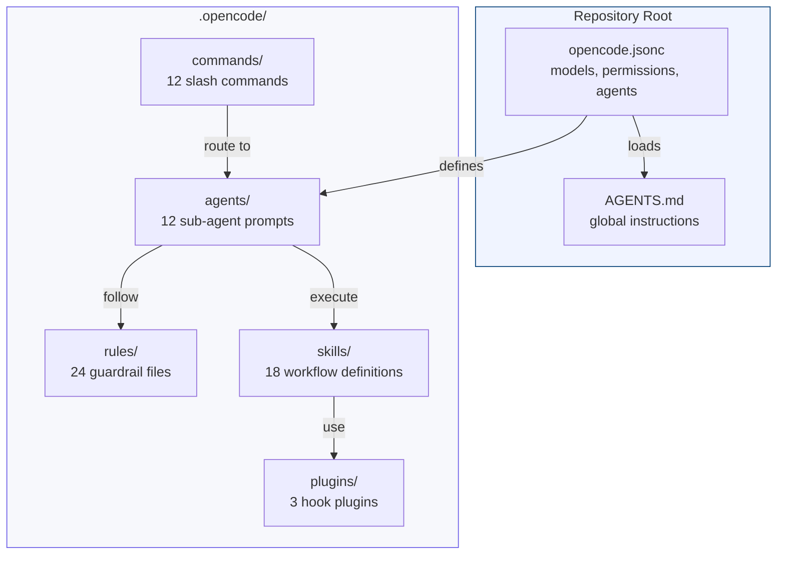
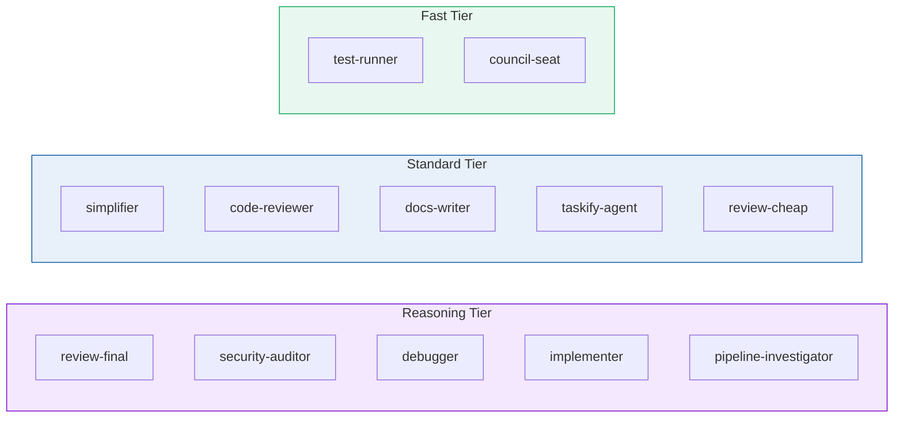
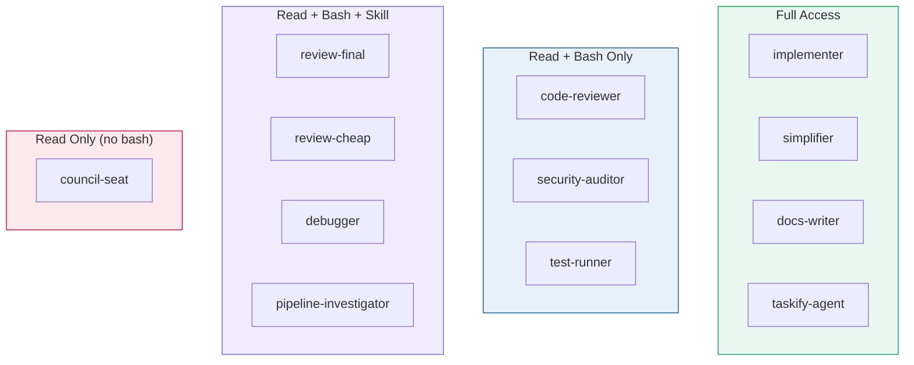
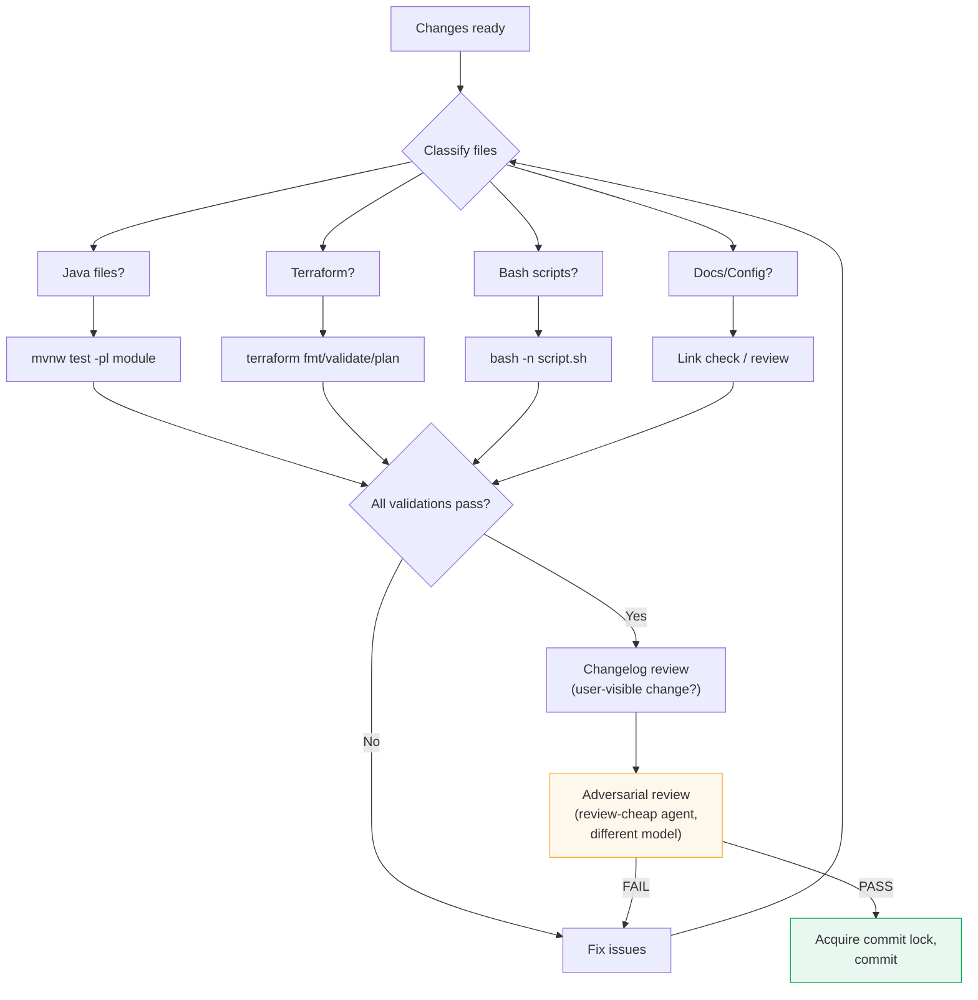
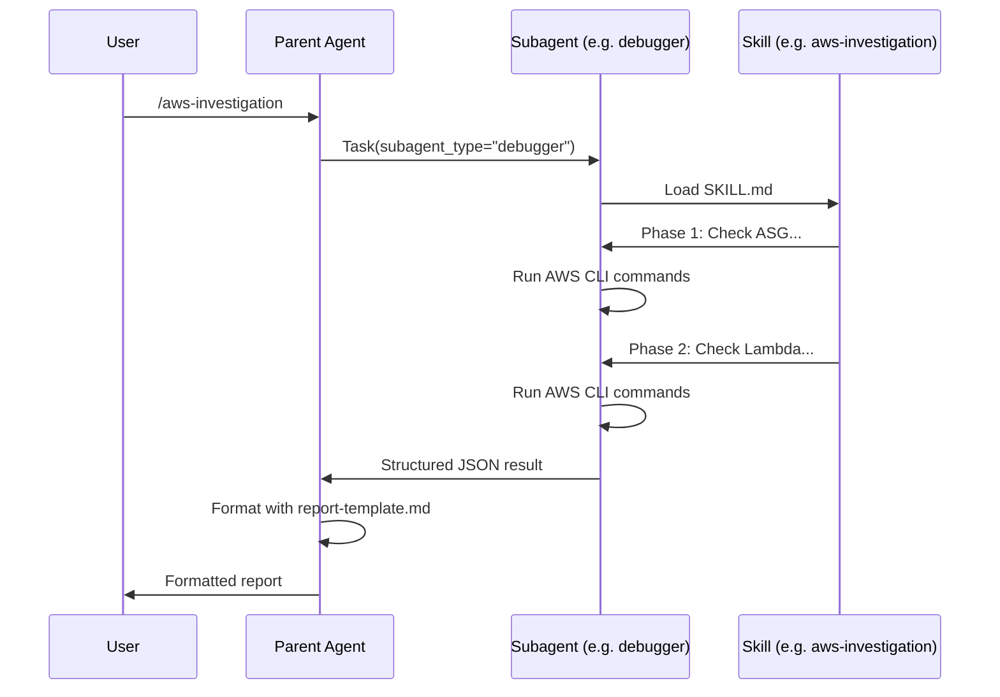
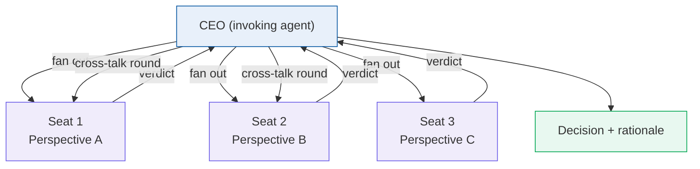
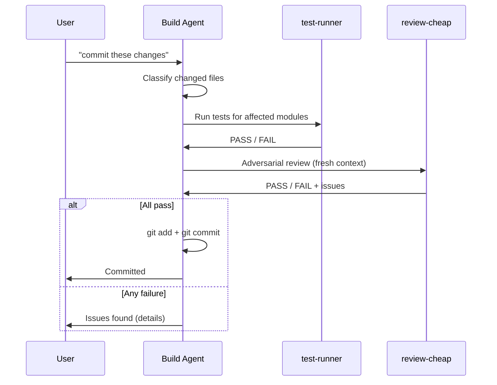

# OpenCode Configuration

How MockServer's AI-assisted engineering harness is configured, structured, and maintained. This document covers the full configuration surface: the root config file, model strategy, sub-agents, rules, skills, commands, plugins, and advanced orchestration patterns.

## Overview

A generic AI coding assistant knows how to read files, write code, and run commands. It does not know MockServer's module boundaries, Netty pipeline conventions, Maven build profiles, TLS certificate renewal procedures, or Buildkite infrastructure layout. The **harness** is the configuration layer that teaches it all of this.

The harness is code. It is versioned alongside the codebase it describes. Any engineer can improve it in a single commit.



### The 7 Building Blocks

| # | Block | Location | Purpose |
|---|-------|----------|---------|
| 1 | [Config](#building-block-1-config) | `opencode.jsonc` | Root configuration: models, permissions, agent definitions |
| 2 | [Model Strategy](#building-block-2-model-strategy) | `opencode.jsonc` (agent entries) | Right model for the right task |
| 3 | [Agents](#building-block-3-agents) | `.opencode/agents/*.md` | 12 specialist sub-agents with least-privilege access |
| 4 | [Rules](#building-block-4-rules) | `.opencode/rules/*.md` | 24 guardrails always enforced |
| 5 | [Skills](#building-block-5-skills) | `.opencode/skills/*/SKILL.md` | 18 reusable multi-step workflows |
| 6 | [Commands](#building-block-6-commands) | `.opencode/commands/*.md` | 12 slash shortcuts with guaranteed routing |
| 7 | [Plugins & Tools](#building-block-7-plugins--tools) | `.opencode/plugins/*.ts` | Session and tool-execution hooks, external integrations |

---

## Building Block 1: Config

The root configuration file `opencode.jsonc` controls the entire system. Every setting has a purpose.

### Annotated Config

```jsonc
{
  "$schema": "https://opencode.ai/config.json",

  // Auto-compact context in long sessions; prune old tool outputs
  "compaction": { "auto": true, "prune": true },

  // Enable /share command (manual only — no accidental sharing)
  "share": "manual",

  // Start sessions in plan mode (read-only); Tab switches to build mode
  "default_agent": "plan",

  // Cheap model for titles, summaries, and compaction
  "small_model": "openai/gpt-4o-mini",

  // Global instructions loaded into every session
  "instructions": ["AGENTS.md"],

  // File watcher excludes (saves tokens, avoids indexing build artifacts)
  "watcher": {
    "ignore": [
      "vendor/**", "**/node_modules/**", ".git/**", ".tmp/**",
      "**/target/**",     // Maven build output in all modules
      ".idea/**",         // IntelliJ project files
      "*.class", "*.jar", // Java bytecode and archives
      "**/_site/**",      // Jekyll generated site
      "**/.sass-cache/**",// Jekyll SCSS cache
      "terraform/**/.terraform/**",
      "build-*/**"        // Downloaded Buildkite logs
    ]
  },

  // Global permissions: allow bash, deny destructive git and rm
  "permission": {
    "bash": {
      "*": "allow",
      "git push --force*": "deny",
      "git reset --hard*": "deny",
      "git clean -fd*": "deny",
      "rm -rf .": "deny",
      "rm -rf ..": "deny",
      "rm -rf ~": "deny",
      "rm -rf /": "deny",
      "rm -rf /*": "deny"
    }
  },

  // 12 sub-agents defined (see Building Block 3)
  "agent": { /* ... */ }
}
```

### Key Design Decisions

| Setting | Value | Rationale |
|---------|-------|-----------|
| `default_agent: "plan"` | Start read-only | Prevents accidental modifications; forces deliberate switch to build mode |
| `compaction.prune: true` | Auto-prune old context | MockServer's codebase is large; long investigation sessions would otherwise hit context limits |
| `watcher.ignore` includes `**/target/**` | Skip Maven output | Module `target/` directories contain thousands of generated files |
| `watcher.ignore` includes `**/_site/**` | Skip Jekyll output | Generated HTML should never be edited directly |
| Permission deny-list | 8 destructive patterns | Defence in depth — these are also blocked by `git-safety.md` rules, but config-level denial is a harder guarantee |

### AGENTS.md — The Global Instruction File

`AGENTS.md` at the repo root is loaded into every session via the `instructions` array. It contains:

- Project overview and tech stack summary
- Documentation index (which doc to consult before modifying each area)
- AWS account IDs and prerequisites
- Buildkite agent infrastructure details
- Git policy (never commit without request, never amend pushed commits)
- Parallel session safety rules
- Pre-commit workflow summary
- Subagent routing table
- Diagrams and formatting conventions

This file acts as the agent's "onboarding document" — everything a new engineer (or AI) needs to know before touching the codebase.

---

## Building Block 2: Model Strategy

Different tasks have different cognitive demands *and* different needs for determinism. Because the orchestrator delegates almost all execution — implementation *and* investigation — to subagents (see `docs/operations/ai-sdlc-integration-spec.md` §5.5/§7 and `.opencode/rules/subagent-routing.md`), the per-agent configuration is **where inference cost and determinism are actually managed**. Three decision variables are set explicitly per agent — **model** (capability/cost), **temperature** (determinism vs creativity, opencode side), and **reasoning effort** (reasoning budget, Claude Code side) — and all are recorded so the routing is auditable (see §9). Agents are grouped into model tiers:



| Tier | opencode (OpenAI) | Claude Code (Anthropic) | Agents | Rationale |
|------|-------------------|--------------------------|--------|-----------|
| **Reasoning** | `openai/gpt-5` | `claude-opus-4-8` + `effort: high` | review-final, security-auditor, debugger, implementer, pipeline-investigator | Highest-stakes reasoning — authoritative binding review, security audit, hard debugging, production code, and CI failure investigation |
| **Standard** | `openai/gpt-4o` | `claude-sonnet-4-6` + `effort: medium` | simplifier, code-reviewer, docs-writer, taskify-agent, review-cheap | Strong analysis, refactoring, and writing at moderate cost and reasoning budget |
| **Fast** | `openai/gpt-4o-mini` | `claude-haiku-4-5-20251001` + `effort: low–medium` | test-runner (`low`), council-seat (`medium`) | Rote test execution (`low`) vs short exploratory debate seats (`medium`) — speed over depth |

This gives the review escalation a genuine **capability gradient** on both harnesses: `review-cheap` (gpt-4o / sonnet + `effort: medium`) → `review-final` (gpt-5 / opus + `effort: high`), so the binding gate is a stronger second brain, not a same-model re-run. **`effort` is now set explicitly on every Claude agent** (not just the high-stakes lanes) so the reasoning budget is an intentional, auditable choice that tracks each task's reasoning depth — `high` for hard implementation/review/audit/investigation, `medium` for standard analysis and writing, `low` for mechanical work. `implementer` is deliberately on the Reasoning tier alongside the reviewers: generating production code has equal or higher blast radius than reviewing it, so it warrants the same model capability and reasoning budget.

**Caveat — reasoning models and `temperature`:** OpenAI reasoning models may reject or ignore a custom sampling `temperature` (only the default is accepted). The Reasoning-tier agents retain their low `temperature` entries for documentation/auditability, but if the provider rejects them, drop the `temperature` field for those five agents and rely on the model's native low-variance reasoning. Re-verify against the OpenAI API behaviour for `gpt-5` after provisioning.

### Temperature (opencode)

opencode sets an explicit per-agent `temperature` (deterministic/high-risk work low, ideation higher). **Claude Code does not support a per-subagent sampling `temperature`** (the field is silently ignored — verified against the Claude Code subagent docs, 2026-06; re-check release notes before adding a `temperature` frontmatter field), so on the Claude side determinism is governed by model choice and the supported `effort` lever, not temperature.

| Temp | Agents | Why |
|:----:|--------|-----|
| **0** | test-runner | Rote execution — fully deterministic |
| **0.1** | review-cheap, review-final, code-reviewer, security-auditor, simplifier | Review/verify and high-risk work — low variance |
| **0.2** | implementer, debugger, pipeline-investigator | Mostly deterministic with a little hypothesis search |
| **0.3–0.4** | taskify-agent (0.3), docs-writer (0.4) | Structuring and prose benefit from mild latitude |
| **0.7** | council-seat | Design debate / ideation — creativity wanted |

For work that benefits from exploration before convergence, stage these
temperatures as a descending **multi-pass pipeline** (explore → refine → validate)
rather than a single pass — see `.opencode/rules/multi-pass-temperature.md`.

### Provider Strategy and Reviewer Independence

opencode uses OpenAI models exclusively. Claude Code (`.claude/`) uses Anthropic models exclusively. Independence between the implementation and review agents rests on three mechanisms:

1. **Fresh context** — the reviewer never sees the implementing agent's reasoning, only the diff. This is the primary mechanism and the one that does the most work in practice.
2. **A distinct adversarial prompt** — `review-final` is a separate agent definition with its own review constitution, briefed to refute rather than to agree.
3. **Restricted tools** — `write` and `edit` are denied, so the reviewer cannot edit through its normal tooling. This is **partial** mechanical enforcement, not a sandbox: `bash` remains granted for inspection and read-only validation, and `permission.bash` denies only destructive git and `rm -rf` patterns — so `sed -i`, `tee` and `>` redirection are still reachable. The prohibition on writing through the shell is instruction-level, spelled out in the read-only clause of `.opencode/agents/review-final.md` (and, identically, `.claude/settings.json` plus `.claude/agents/review-final.md` under Claude Code).

A further lever, **temperature** (0.1 for reviewers against 0.2 for the implementer), applies on the opencode side only — Claude Code has no per-subagent temperature and uses `effort` instead — and is subject to the reasoning-model caveat above: `gpt-5` may ignore a custom sampling temperature. Do not count on it as load-bearing for the binding gate.

**Model diversity is deliberately not a mechanism here, and is not pursued.** It applies to `review-cheap` (gpt-4o / sonnet against the implementer's gpt-5 / opus) but **not** to `review-final`, which runs the implementer's own model in both harnesses. Manufacturing diversity within a provider would mean downgrading one side — the configured alternatives are only Sonnet and Haiku under Claude Code, and `gpt-4o` / `gpt-4o-mini` under opencode — and weakening the implementer to differentiate the reviewer is a worse trade than having no diversity. Running the gate from the opposite harness would give true cross-provider independence, but that needs separate provider credentials and is not part of the normal workflow. Treat the three mechanisms above as the whole of `review-final`'s independence, and do not describe the binding gate as provider-independent.

---

## Building Block 3: Agents

Each sub-agent is a configured AI persona with a specific model, system prompt, allowed tools, and permissions. The principle is **least privilege** — each agent has exactly the access it needs.

### Agent Roster

| Agent | Model Tier | Role | Write | Edit | Bash | Skill |
|-------|-----------|------|:-----:|:----:|:----:|:-----:|
| **implementer** | Reasoning | Writes production code and tests | Y | Y | Y | Y |
| **simplifier** | Standard | Reduces code to smallest correct form | Y | Y | Y | Y |
| **docs-writer** | Standard | Architecture docs, ADRs, READMEs | Y | Y | Y | Y |
| **taskify-agent** | Standard | Breaks specs into structured task graphs | Y | Y | Y | Y |
| **code-reviewer** | Standard | Pre-commit correctness, security, conventions | - | - | Y | - |
| **security-auditor** | Reasoning | Security-focused Java/Netty audits | - | - | Y | - |
| **review-final** | Reasoning | Authoritative binding PASS/BLOCK verdict | - | - | Y | Y |
| **review-cheap** | Standard | Non-authoritative intermediate review | - | - | Y | Y |
| **debugger** | Reasoning | Investigates issues using logs, CI, AWS | - | - | Y | Y |
| **pipeline-investigator** | Reasoning | Buildkite pipeline failure analysis | - | - | Y | Y |
| **test-runner** | Fast | Runs Maven tests, reports results | - | - | Y | - |
| **council-seat** | Fast | Design council parallel debate seat | - | - | - | - |

### Tool Restrictions Explained



- **Code reviewers** cannot write or edit files — they can only read and report. This prevents a reviewer from "fixing" code instead of reporting issues.
- **The debugger** can load skills for structured investigations (for example `aws-investigation`) while still using bash for ad-hoc probing.
- **Council seats** have no bash, write, edit, or skill access — they can only read code and emit a verdict. This prevents a debate participant from taking unilateral action.
- **Test runner** cannot write files — it runs `mvn test` and reports results, nothing more.

### Agent Prompt Files

Each agent's behaviour is defined in a markdown file at `.opencode/agents/<name>.md`. These files contain:

- Role definition and boundaries
- Specific instructions for the agent's domain
- Output format requirements
- What the agent must never do

Example: the `code-reviewer.md` includes a checklist for LLM-specific issues (hallucinated method names, plausible-but-wrong logic, missing error handling, leaked secrets) that a human reviewer might miss.

---

## Building Block 4: Rules

Rules are mandatory constraints that encode what experienced engineers know but an AI does not. Only `AGENTS.md` is always in context — it is the sole entry in `opencode.jsonc` `instructions[]`. Every rule below is **loaded on demand**: read when a reachable referrer (`AGENTS.md`, an agent/command/skill, or another reachable rule) points to it. An unreferenced rule is inert. The **Reachable** column records that each rule is wired into that reference graph; the rule-reachability check in `scripts/validate_opencode_config.sh` fails CI if any rule becomes unreachable.

### Rule Catalogue

| Rule | Reachable | Purpose |
|------|:---------:|---------|
| `git-safety.md` | Yes | Blocks 11 destructive git commands without confirmation |
| `commit-workflow.md` | Yes | 5-step pre-commit gate chain: classify → validate → changelog → adversarial review → locked commit |
| `commit-locking.md` | Yes | Filesystem-based commit lock for parallel session safety |
| `testing-policy.md` | Yes | Maven module mapping, test commands, quality standards |
| `tmp-directory.md` | Yes | Use `.tmp/` at repo root, never `/tmp/` |
| `report-formatting.md` | Yes | Subagent JSON → report template formatting convention |
| `review-constitution.md` | Yes | 8-lens adversarial review with ~100 review principles |
| `mermaid-diagrams.md` | Yes | Mermaid diagram conventions and formatting rules |
| `coding-principles.md` | Yes | Think before coding, simplicity first, surgical changes |
| `aws-ids-file.md` | Yes | Require `~/mockserver-aws-ids.md` before AWS operations |
| `operating-model.md` | Yes | The DVRR operating model — decompose, verify, review, reintegrate |
| `worktree-workflow.md` | Yes | Per-session worktree isolation, linear history, locked rebase merge |
| `subagent-routing.md` | Yes | Conversational routing of tasks to the correct subagent |
| `risk-authority-classification.md` | Yes | Classify each unit by risk and act within its authority class |
| `control-integrity.md` | Yes | Higher-scrutiny gated-approval for changes to the controls themselves |
| `operator-halt.md` | Yes | Operator halt — stop autonomous work on demand |
| `untrusted-input.md` | Yes | Treat ingested content as data, not instructions |
| `decision-log.md` | Yes | Per-unit telemetry and routing-rationale decision log |
| `multi-pass-temperature.md` | Yes | Staged explore → refine → validate temperature pipeline |
| `evaluation-harness.md` | Yes | Agent/config evaluation fixtures and conformance checks |
| `metrics.md` | Yes | SDLC metrics capture and reporting conventions |
| `documentation-style.md` | Yes | Pyramid Principle with progressive disclosure for all docs |
| `local-plans.md` | Yes | Uncommitted `*.local.md` plan docs in `docs/plans/` |
| `licence-provenance.md` | Yes | Dependency licence and provenance constraints |

### git-safety.md — Banned Commands

Key commands blocked without explicit user confirmation:

| Banned Command | Safer Alternative |
|---------------|-------------------|
| `git checkout -- <file>` | `git stash` first |
| `git restore <file>` | `git stash` first |
| `git clean -fd` | `git clean -n` (dry run) |
| `git reset --hard` | `git reset --soft` or `git stash` |
| `git stash drop` / `git stash clear` | Keep stashes |
| `git branch -D` | `git branch -d` (safe delete) |
| `git push --force` | `git push --force-with-lease` |
| `git rebase` on shared branches | Merge instead |

These are enforced at two levels, but **unevenly**: only three of the eleven — `git push --force`, `git reset --hard` and `git clean -fd` — appear in the `permission.bash` deny-list and are hard-blocked by the framework. The other eight (`git checkout -- …`, `git restore …`, `git stash drop`/`clear`, `git branch -D`, `git rebase` on shared branches) are **instruction-level only**: the rule tells the agent not to run them, and nothing stops it. Treat the table as policy, not as a sandbox.

### commit-workflow.md — The 5-Step Pre-Commit Process



The adversarial review (Step 4) is critical: the `review-cheap` agent runs with a fresh context, specifically scanning for LLM-generated issues — hallucinated names, plausible but wrong logic, missing error handling, and accidentally committed secrets. The `review-final` agent provides the binding verdict — and for **control-class** changes (the rules, agents, gates, and CI/test controls themselves) `review-final` is mandatory and its PASS authorizes only a *gated-approval* commit, never an autonomous one. See `.opencode/rules/control-integrity.md`.

Skip conditions exist for speed: `"skip tests"` skips validation (Step 2), `"skip changelog"` skips the changelog review (Step 3), `"skip review"` skips the adversarial review (Step 4), and `"just commit"` skips all three. These are used when the user is confident in the change.

---

## Building Block 5: Skills

A skill is a self-contained multi-step workflow — a runbook the agent executes autonomously. Complex tasks like "investigate a pipeline failure" or "renew TLS certificates" involve 10-15 coordinated steps. Without a skill, the user would guide the agent manually every time.

### Skill Catalogue

| Skill | Files | Subagent-Routed | Trigger Examples |
|-------|------:|:---------------:|-----------------|
| `aws-investigation` | SKILL.md + report-template.md | Yes (`debugger`) | "build agents not running", "EC2 issues", "ASG scaling" |
| `pipeline-investigation` | SKILL.md + report-template.md | Yes (`pipeline-investigator`) | "pipeline failing", "build errors", Buildkite URLs |
| `ideate` | SKILL.md + spec-template.md | No | "I have an idea", "let's think through", "brainstorm" |
| `pr-review` | SKILL.md | No | "review PRs", "PR report", "open PRs" |
| `pr-monitor` | SKILL.md | No | "monitor PRs", "auto-merge PRs", "watch dependency PRs" |
| `renew-test-certs` | SKILL.md | No | "certificates expired", "TLS tests failing" |
| `review-code` | SKILL.md | No | "deep code review", "adversarial review", "quality audit" |
| `review-spec` | SKILL.md | No | "spec review", "design review", "review this plan" |
| `browser-auth` | SKILL.md | No | "navigate to buildkite", "extract token from browser" |
| `dependabot-snyk-pr-management` | SKILL.md | No | "dependabot PR", "snyk PR", "dependency upgrade" |
| `dockerhub-credentials` | SKILL.md | No | "docker hub token", "configure docker hub" |
| `terraform-tfvars` | SKILL.md | No | "create tfvars", "deploy buildkite agents" |
| `docker-build-push` | SKILL.md | No | "build docker image", "push maven image", "rebuild CI image" |
| `issue-review` | SKILL.md | No | "review issue", "triage issue", "is this a bug" |
| `build-monitor` | SKILL.md | No | "monitor builds", "watch pipeline", "continuous monitoring" |
| `release-management` | SKILL.md | No | "prepare release", "release version", "run release pipeline" |
| `ui-screenshots` | SKILL.md | No | "screenshot the dashboard", "capture UI", "dashboard screenshots" |

### Skill Anatomy

Each skill directory contains:

```
.opencode/skills/<name>/
  SKILL.md              # Main workflow definition (phases, steps, examples)
  report-template.md    # Optional: output template for structured reports
  spec-template.md      # Optional: output template for specifications
```

The `SKILL.md` file contains:
- **Trigger conditions** — when the skill should be loaded
- **Phase definitions** — ordered steps the agent follows
- **Templates** — what "good output" looks like
- **Reference knowledge** — domain-specific facts inlined for the agent
- **Error handling** — what to do when steps fail

### Subagent Routing Convention

Subagent routing is defined outside skills. Skills are never responsible for declaring their own dispatch mechanism.

Use:
- command metadata (`agent` + `subtask: true`) for slash-command routing,
- `.opencode/rules/subagent-routing.md` for conversational routing,
- `opencode.jsonc` permissions to prevent invalid direct loads by restricted agents.



This separation ensures:
- The subagent runs with the correct model and tool permissions
- The parent agent's context stays clean (no AWS CLI output bloat)
- The report format is consistent (template-driven)

---

## Building Block 6: Commands

Commands are slash shortcuts that map user-friendly invocations to specific agents and, when needed, skills. They enforce routing at the **framework level** — before the AI makes a decision.

### Command Catalogue

| Command | Agent | Subtask | Purpose |
|---------|-------|:-------:|---------|
| `/aws-investigation` | `debugger` | Yes | Investigate AWS infrastructure issues |
| `/pipeline-investigation` | `pipeline-investigator` | Yes | Investigate Buildkite pipeline failures |
| `/review-code` | `review-final` | Yes | Deep code audit |
| `/review-spec` | `review-final` | Yes | Critical review of spec/design document |
| `/codebase-change-report` | `docs-writer` | Yes | Generate report of recent changes |
| `/update-architecture-docs` | `docs-writer` | Yes | Review and update architecture docs |
| `/design-council` | `general` | Yes | Convene parallel design council debate |
| `/excalidraw` | `general` | Yes | Generate .excalidraw architecture diagrams |
| `/codeql-scan` | `security-auditor` | Yes | Run CodeQL security scan on Java code |
| `/issue-review` | (default) | No | Review, classify, and resolve a GitHub issue |
| `/commit` | (default) | No | Commit changes following full pre-commit workflow |

### Command File Anatomy

Each command is a small markdown file with YAML frontmatter:

```yaml
---
description: Investigate Buildkite pipeline failures
agent: pipeline-investigator
subtask: true
---
Load the `pipeline-investigation` skill and execute it for:
$ARGUMENTS
```

The `agent` field is the routing guarantee. When a user types `/pipeline-investigation https://buildkite.com/.../builds/123`, the framework routes directly to the `pipeline-investigator` agent — the LLM never decides which agent handles the request.

The `subtask: true` field means the command runs in a subagent session, keeping the parent context clean.

### Why Framework-Level Routing Matters

Routing is the single biggest practical failure mode of multi-agent setups. MockServer uses three enforcement layers:

| Layer | Mechanism | Example |
|-------|-----------|---------|
| **Routing rule** | Conversational mapping in `.opencode/rules/subagent-routing.md` | `pipeline-investigation -> pipeline-investigator` |
| **Framework** | Command files hardcode the target agent | `agent: pipeline-investigator` in frontmatter |
| **Permission** | Read-only agents can be skill-disabled by role | `code-reviewer` has `"skill": false` in config |

---

## Building Block 7: Plugins & Tools

### Plugins

Plugins are TypeScript files that hook into session lifecycle and tool-execution events. Local files are auto-discovered from `.opencode/plugins/` — no registration step (the `plugin[]` key in `opencode.jsonc` is only for npm-distributed plugins, and this repo does not use it). MockServer has three:

| Plugin | Purpose |
|--------|---------|
| `buildkite-status.ts` | On session start, queries Buildkite API for the 5 most recent builds. Shows a toast warning if any are failing. Writes details to `.tmp/.buildkite-status`. Throttled to once per hour. |
| `session-notification.ts` | Sends macOS notifications via `osascript` when a session goes idle ("Task completed") or errors (with "Basso" sound). |
| `operator-halt.ts` | Enforces the operator halt (`.opencode/rules/operator-halt.md`) *mechanically*, not by agent compliance. Its `tool.execute.before` hook runs `.opencode/scripts/check-halt.sh` before every `bash`/`write`/`edit`/`patch`/`task` call and throws (denying the tool) when a halt is engaged. Fails open if the check itself cannot run. The Claude Code counterpart is the `PreToolUse` hook in `.claude/settings.json`. |

`.claude/settings.json` wires a second `PreToolUse` hook,
`check-bare-checkout-write-hook.sh`, on `Write|Edit|MultiEdit|NotebookEdit`. It refuses an edit whose
target resolves inside the **main checkout** rather than a linked worktree, which
`.opencode/rules/worktree-workflow.md` requires. That mistake is silent rather than loud — the main
checkout usually sits on an older commit, so the edit is written against stale content, escapes the
session's own verification, and can be rebased away by another session; this repository has lost
gate-passed work to it. The hook asks git which worktree a path belongs to (for the main worktree
`--show-toplevel` equals the directory holding `--git-common-dir`; for a linked worktree they differ),
so it needs no hard-coded paths. Scratch under the main checkout's `.tmp/` and `.worktrees/` is
allowed. Like the halt hook it **fails open** — a per-tool-call gate must never wedge a session — and
it only sees the edit tools, so a write performed through Bash is not covered.

Plugins require the `@opencode-ai/plugin` npm package (defined in `.opencode/package.json`).

### Chrome DevTools MCP

The `browser-auth` skill documents how to use the Chrome DevTools MCP server to interact with authenticated web UIs (Buildkite, AWS Console, GitHub). This enables skills like `terraform-tfvars` to extract Buildkite agent tokens directly from the Buildkite UI.

### Custom Tools via Bash

Unlike TDP (which has 17 dedicated Python tool packages for Splunk, New Relic, Jira, etc.), MockServer's tools are simpler — the agent uses bash directly to run:
- `gh` (GitHub CLI) for PR management and issue queries
- `aws` CLI for infrastructure investigation
- `mvn` / `mvnw` for builds and tests
- `openssl` for certificate operations
- `docker` for container operations
- `helm` for Kubernetes deployment

This works well for MockServer's scope. The skills contain the domain knowledge (which commands to run, in what order, how to interpret output) while bash provides the execution.

---

## Advanced Patterns

### Design Council — Parallel Agent Debate

For non-trivial decisions that cross domains, the `/design-council` command convenes a panel of `council-seat` agents that debate in parallel. The invoking agent acts as CEO — convening, routing, and arbitrating.



Key properties:
- Each seat is a separate subagent with its own context (no shared priors, no groupthink)
- Seats emit structured verdicts: APPROVE, CONCERNS, or BLOCK with cited evidence (`file:line`)
- Council seats are read-only (no bash, write, edit, or skill) — they cannot take action
- The CEO can run up to 3 brokered rounds where dissent is routed between seats
- Output is a one-page decision log committed alongside code

### Subagent Report Pattern

Investigation skills (aws-investigation, pipeline-investigation) follow a structured pattern:

1. **Subagent investigates** — runs commands, gathers data, produces structured JSON
2. **Parent reads template** — loads `report-template.md` from the skill directory
3. **Parent formats** — maps JSON fields to the template, producing a readable report
4. **Parent presents** — shows the formatted report to the user

This separation means the investigation logic and the presentation logic are independently maintainable.

### Commit Workflow Orchestration

The pre-commit workflow (documented in `.opencode/rules/commit-workflow.md`) chains multiple agents:



---

## Directory Structure

```
mockserver/
├── opencode.jsonc                          # Root config (models, permissions, agents)
├── AGENTS.md                               # Global instructions (loaded every session)
└── .opencode/
    ├── .gitignore                           # Ignores node_modules, package.json, bun.lock
    ├── package-lock.json                    # Plugin dependency lock (@opencode-ai/plugin)
    ├── agents/                              # 12 sub-agent prompt files
    │   ├── code-reviewer.md
    │   ├── council-seat.md
    │   ├── debugger.md
    │   ├── docs-writer.md
    │   ├── implementer.md
    │   ├── pipeline-investigator.md
    │   ├── review-cheap.md
    │   ├── review-final.md
    │   ├── security-auditor.md
    │   ├── simplifier.md
    │   ├── taskify-agent.md
    │   └── test-runner.md
    ├── rules/                               # 24 guardrail files
    │   ├── aws-ids-file.md
    │   ├── coding-principles.md
    │   ├── commit-locking.md
    │   ├── commit-workflow.md
    │   ├── control-integrity.md
    │   ├── decision-log.md
    │   ├── documentation-style.md
    │   ├── evaluation-harness.md
    │   ├── git-safety.md
    │   ├── licence-provenance.md
    │   ├── local-plans.md
    │   ├── mermaid-diagrams.md
    │   ├── metrics.md
    │   ├── multi-pass-temperature.md
    │   ├── operating-model.md
    │   ├── operator-halt.md
    │   ├── report-formatting.md
    │   ├── review-constitution.md
    │   ├── risk-authority-classification.md
    │   ├── subagent-routing.md
    │   ├── testing-policy.md
    │   ├── tmp-directory.md
    │   ├── untrusted-input.md
    │   └── worktree-workflow.md
    ├── skills/                              # 18 skill workflows
    │   ├── aws-investigation/
    │   │   ├── SKILL.md
    │   │   └── report-template.md
    │   ├── browser-auth/
    │   │   └── SKILL.md
    │   ├── build-monitor/
    │   │   └── SKILL.md
    │   ├── dependabot-snyk-pr-management/
    │   │   └── SKILL.md
    │   ├── docker-build-push/
    │   │   └── SKILL.md
    │   ├── dockerhub-credentials/
    │   │   └── SKILL.md
    │   ├── ideate/
    │   │   ├── SKILL.md
    │   │   └── spec-template.md
    │   ├── issue-review/
    │   │   └── SKILL.md
    │   ├── pipeline-investigation/
    │   │   ├── SKILL.md
    │   │   └── report-template.md
    │   ├── pr-monitor/
    │   │   └── SKILL.md
    │   ├── pr-review/
    │   │   └── SKILL.md
    │   ├── release-management/
    │   │   └── SKILL.md
    │   ├── renew-test-certs/
    │   │   └── SKILL.md
    │   ├── review-code/
    │   │   └── SKILL.md
    │   ├── review-spec/
    │   │   └── SKILL.md
    │   ├── terraform-tfvars/
    │   │   └── SKILL.md
    │   └── ui-screenshots/
    │       └── SKILL.md
    ├── commands/                             # 12 slash commands
    │   ├── aws-investigation.md
    │   ├── codebase-change-report.md
    │   ├── codeql-scan.md
    │   ├── commit.md
    │   ├── design-council.md
    │   ├── excalidraw.md
    │   ├── issue-review.md
    │   ├── pipeline-investigation.md
    │   ├── prepare-release.md
    │   ├── review-code.md
    │   ├── review-spec.md
    │   └── update-architecture-docs.md
    ├── plugins/                             # 3 plugins (auto-discovered)
    │   ├── buildkite-status.ts
    │   ├── operator-halt.ts
    │   └── session-notification.ts
    ├── scripts/                             # Gate and lifecycle shell scripts
    │   ├── acquire-commit-lock.sh
    │   ├── agent-status.sh
    │   ├── aggregate-telemetry.sh
    │   ├── check-bare-checkout-write-hook.sh # Claude Code PreToolUse: refuse main-checkout edits
    │   ├── check-halt-hook.sh               # Claude Code PreToolUse wrapper
    │   ├── check-halt.sh                    # Operator-halt source of truth
    │   └── release-commit-lock.sh
    └── evals/                               # Agent/config evaluation harness
        ├── README.md
        ├── run-evals.sh
        └── tasks/                           # Fixtures + recorded .result baselines
```

---

## Maintenance

When modifying the opencode configuration:

- **Adding an agent**: Add the entry to `opencode.jsonc`, create the prompt file in `.opencode/agents/`, update the routing table in `AGENTS.md`, and update this document.
- **Adding a skill**: Create the skill directory under `.opencode/skills/`, add a `SKILL.md`, optionally add templates. If the skill requires subagent routing, create a corresponding command file and add the conversational mapping in `.opencode/rules/subagent-routing.md`.
- **Adding a rule**: Create the rule file in `.opencode/rules/`, then reference it from a reachable referrer (`AGENTS.md`, an agent/command/skill, or another reachable rule) so it loads on demand. Rules are **not** auto-loaded by filename — an unreferenced rule is inert, and `scripts/validate_opencode_config.sh` fails CI until it is wired in.
- **Changing model assignments**: Update the `model` field in the agent's entry in `opencode.jsonc`. No other files need to change.
- **Adding a command**: Create a markdown file in `.opencode/commands/` with YAML frontmatter specifying the target agent.
- **Adding a plugin**: Create the TypeScript file in `.opencode/plugins/` exporting a named `Plugin` — it is auto-discovered, with no registration in `opencode.jsonc`. Ensure `@opencode-ai/plugin` is a dependency of `.opencode/package.json`, creating that file if needed — it is gitignored, so a fresh clone has the tracked `package-lock.json` but no manifest. A plugin that gates `tool.execute.before` runs on **every** tool call, so it must be cheap and fail open.
- **Validation**: Run `./scripts/validate_opencode_config.sh` to catch broken command→skill references, command→agent mismatches, subagent-routing drift, unreachable (orphaned) rules, and hardcoded infrastructure literals.
