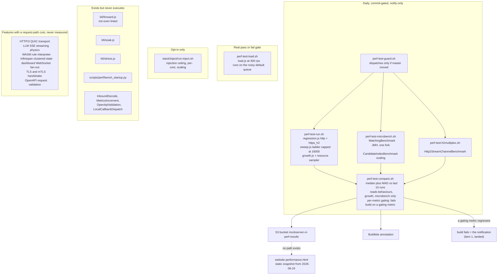
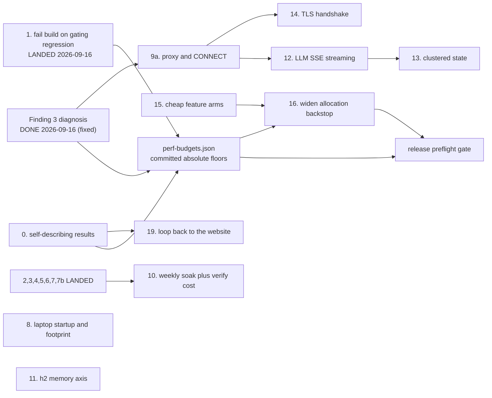
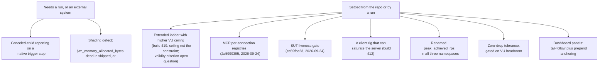

# Performance Programme

**Status: the programme is essentially complete, and this file is now its residue.** Every
acceptance row has been executed, the G1-G11 gap sweep is closed, and the four things
[What survives this plan](#what-survives-this-plan) names have all reached their destinations.
What is left is listed in ["What remains"](#what-remains): a short list of small pieces, six of
which cannot be settled from the repo at all because they need a run on real hardware or an
external system to report something. **Delete this file when that list is empty.**

Originally written 2026-09-16 against `master`
at `b98d18f0c`. **Revised 2026-09-16 against `master` at `a984a8c3a`** after a second
read-only audit that checked the first audit's load-bearing claims against the code and
against the repo's own stored results. Two of those claims were wrong; see
[Corrections to the first audit](#corrections-to-the-first-audit).

**The only two places in this document that claim progress are the status header above and the
["What remains"](#what-remains) table at the end, and they are kept in agreement.** A stale
progress note beside a current one is worse than none — a reader cannot tell which to believe.

Per repo convention, the change that finishes this work **deletes this file in the same
commit** — it is written to be consumed and removed, not to persist. The parts that deserve
to outlive it are named in [What survives this plan](#what-survives-this-plan) at the end;
move those before deleting.

## Bottom line

MockServer's performance harness is better than its reputation, narrower than its claims,
and **less trustworthy than the first audit concluded**. It measures one dimension in one
deployment profile continuously — response latency on the local-match hot path, on a
six-core pinned central server. Almost everything else is either measured once and
published, or never measured at all. The one signal the first audit called good had a
four-orders-of-magnitude internal contradiction in the repo's own published data; that has
now been **diagnosed and fixed** — it was a client-side rig artefact (see Finding 3).

Five things a reader needs before anything else:

1. **The daily latency signal was measuring the rig, not the server — now fixed
   (2026-09-16).** The committed `perf-result.json` recorded, from a single run, a sweep p95
   of **0.279 ms at 16,000 req/s** and a regression-scenario p95 of **1,014 ms at 200 req/s**;
   both could not describe the same server. Finding 3 shows the regression tail was a
   client-side VU-allocation connection storm and fixes `regression.js` (stagger + a fixed
   equal VU pool + warm-every-path + a settle exclusion), verified to still catch a real
   slowdown. See
   [Finding 3](#finding-3-the-daily-latency-percentiles-and-the-sweep-disagree-by-four-orders-of-magnitude).
2. **Proxying is effectively unmeasured**, despite being half of what MockServer is. The
   daily run measures a forward *action* at 200 req/s. `HttpConnectHandler`, the SOCKS
   handlers, the relay handlers, transparent proxying, binary proxying and the HTTP/2
   relay have never been benchmarked at any rate by any harness.
3. **The laptop / per-test-method profile has no measurement at all** — and the profile's
   dominant code path is not the one the proposed startup measurement covers. Users run
   MockServer **in-JVM** via `MockServerExtension` and `ClientAndServer.startClientAndServer`,
   not via `docker run`.
4. **Several checks that look like gates cannot fail for the reason they claim.** The one
   real pass/fail load gate runs at 300 req/s against a server measured at ~32,000 req/s,
   on the Spot `default` queue.
5. **The run metadata cannot support the provenance the programme depends on.** The
   published run records `"instance_type": ""`, and the result schema has no field for heap,
   GC, JVM options or log level. Several proposed mechanisms — the hardware-invalidation
   rule, the ratchet, the website provenance line — cannot be built until that is fixed.

The infrastructure needed to fix most of this already exists and is well built. This
programme is mostly about **pointing existing harnesses at unmeasured things**, **making the
existing measurements say what they are**, and **closing the loop back to the website** —
not new infrastructure.

## The mandate this serves

From the repo owner, verbatim:

> For the work on performance I want to ensure we're considering: scale; performance of
> request/response handling **and proxying**; CPU and memory growth and efficiency; and
> start up time; as well as how small the CPU and memory can be for low volume scenarios.
> I want MockServer to behave well when run **per test method on a user's laptop across
> lots of parallel tests**, as well as behave well when run as part of a **heavily loaded
> central deployment used by many pipelines or consumers**, and when run as part of a
> **performance test**.
>
> The plan should include consideration of how we can **maintain the goals, re-assess, and
> constantly improve** in the face of other changes flowing into the project.
>
> I want to make sure any performance improvements are **fully tested to confirm they work
> correctly**.

That is **six dimensions** across **three deployment profiles**, plus a correctness
obligation that has its own section
([Proving a performance change is still correct](#proving-a-performance-change-is-still-correct)).

| | Dimension |
|---|---|
| D1 | Scale — throughput ceiling, connection ceiling, how capacity grows with cores and instances |
| D2 | Request/response handling — latency and cost of matching and responding |
| D3 | **Proxying** — forwarding, CONNECT tunnelling, SOCKS, relaying. A different cost profile from matching a local expectation |
| D4 | CPU and memory **growth** over time and **efficiency** under load |
| D5 | Startup time |
| D6 | The CPU and memory **floor** — how small MockServer can be for low-volume use |

| | Profile |
|---|---|
| **L** | Per test method on a laptop, many instances in parallel. Short-lived, near-idle, dozens at once |
| **C** | Heavily loaded central deployment serving many pipelines and consumers. Long-lived, saturated |
| **P** | Inside someone else's performance test — either serving load, or generating it via Load Scenarios |

**On the scope of "request/response handling".** The first audit read D2 narrowly, as the
local-match hot path, and explicitly deferred HTTP/3, LLM mocking, async messaging, WASM
rules and the dashboard. That was defensible as a first cut and is **no longer defensible as
a final one**. The owner asked for MockServer to behave well in a heavily loaded central
deployment; a central deployment is precisely where a customer streams SSE from a mocked
LLM, where the dashboard is left open on someone's second monitor, where state is clustered
across instances, and where a hundred pipelines each hold a TLS connection. Those are
request/response handling. See [Feature surfaces the first audit
excluded](#feature-surfaces-the-first-audit-excluded), which adds five of them to the
programme and names the five it deliberately leaves out.

## How to read the numbers in this document

**Every figure below is dated and version-stamped.** That is deliberate: the whole failure
mode this programme addresses is figures going stale silently. If you are reading this
months later, treat any undated number as untrustworthy and any dated number as history,
not as current state. Re-measure before you rely on it.

Analysis date: **2026-09-16**, `master` at `a984a8c3a`. Where a claim below could not be
verified by reading code or stored results, it is marked **unverified** rather than dropped,
because an unverified claim someone can go and check is more useful than a silent gap.

## Corrections to the first audit

The first audit was written from a read-only pass over harnesses, scripts, stored results
and the website. It measured nothing, so its claims about what a harness *does* were
inferences. This revision re-checked the load-bearing ones.

**Verified correct, no change:**

| Claim | How verified |
|---|---|
| The CI sweep ladder stops at 16,000 | `perf-test-run.sh:162` sets `K6_SWEEP_RATES` default `500,1000,2000,4000,8000,16000` |
| `forward.js` is in no step and no lint list | `perf-test-lint.sh` inspects `smoke, load, stress, soak, regression, growth, sweep`. No pipeline step references `forward.js` |
| `-Xshare:auto` means a broken archive degrades silently | `docker/Dockerfile:164` and `docker/local/Dockerfile:102` pass `-XX:SharedArchiveFile` with no `-Xshare:on`. The Dockerfile comment at line 161 *states this outcome explicitly* — the repo already knows, and ships it anyway. The build check is `ls -l /mockserver.jsa` (line 120). **Now also measured — see Finding 4** |
| `nioEventLoopThreadCount` is a fixed 5; `actionHandlerThreadCount` is `max(5, availableProcessors)` | `ConfigurationProperties.java:2223-2237`. Note `availableProcessors()` **is** cgroup-aware on modern JVMs, so the "sizes off the whole machine" gloss is right for a bare JVM and wrong for a CPU-limited container. The laptop profile is the bare-JVM case, so the concern stands where it matters |
| Published figures were taken at `logLevel=ERROR` while the shipped default is `INFO` | `perf-test-run.sh:85` and `perf-test-load.sh:32` set `MOCKSERVER_LOG_LEVEL=ERROR`; `ConfigurationProperties.java:52` `DEFAULT_LOG_LEVEL = "INFO"`. The run **also** sets `MOCKSERVER_DISABLE_SYSTEM_OUT=true`, a second non-default the first audit missed |
| `PERF_NOTIFY_WEBHOOK` is a silent no-op (at audit time) | `perf-test-compare.sh` guarded the `curl` on `[ -n "${PERF_NOTIFY_WEBHOOK:-}" ]` with no else branch. Not set in any terraform file. **Since removed by item 1** — the webhook is gone; a gating regression now fails the build instead |
| The compare step never reads `.sweep` or `.h2_multiplex` | Confirmed in the `metrics` jq: it reads `.behaviours`, `.growth`, `.microbench` only |
| A new behaviour key is picked up by compare with zero script changes | Confirmed: `metrics` does `(.behaviours // {}) \| to_entries[]`. Item 9a's design is sound |
| The `perf` queue is a single on-demand `c5.4xlarge`, max 1, scale to zero | `terraform/buildkite-agents/variables.tf:79-94` |

**Wrong, and the correction matters:**

1. **`throughput_rps` is not arithmetically pinned.** The first audit said the value is
   "~200 by construction" and the metric "structurally cannot fail". The arithmetic is as
   described — `count / durationSec` from a `constant-arrival-rate` executor — but `count`
   is *completed* requests, and k6 drops iterations when its VU pool cannot keep up. The
   repo's own published run records `throughput_rps` of **191.8, 183.8, 191.8, 191.3,
   186.1, 177.7, 185.9, 185.3** across the eight behaviours. `forward_https_h2` at 177.7 is
   **below** the 180 that a 10-percent `dir:"down"` rule would trip against a nominal 200.
   So the metric moves, has moved, and is already losing 4 to 11 percent of offered load at
   200 req/s.

   The correct diagnosis is worse than the original one, not better: `throughput_rps` is an
   **unlabelled dropped-iteration counter** presented as a throughput measurement. It cannot
   distinguish "the server got slower" from "k6 ran out of VUs", and the run records
   `dropped_iterations` nowhere. **This changed item 5**: the answer was not to delete the
   metric, it was to record what it is actually detecting — done in `19686f9f1`, and the
   shortfall it was detecting is now **explained and fixed** (Finding 3, 2026-09-16): the same
   tied-up VU pool that produced the latency tail. After the harness fix the light-path
   `delivery_ratio` reads ~1.00 with zero `dropped_iterations`.

2. **`regression.js` is now a trustworthy continuous signal (fixed 2026-09-16).** In the
   published run its p95/p99 were between 1,012 ms and 2,154 ms at 200 req/s per behaviour —
   a client-side rig artefact, now diagnosed and fixed (light-path p99 collapses from
   ~1,900-3,000 ms to single-digit/low-double-digit ms, drops to zero). See
   [Finding 3](#finding-3-the-daily-latency-percentiles-and-the-sweep-disagree-by-four-orders-of-magnitude).
   The JMH `alloc_bytes_per_op` backstop remains the strongest *absolute* signal; the k6
   latency percentiles are now sound as a *relative* change detector.

3. **The acceptance table now carries a REFUTED premise (item 9a), on measurement.** The
   9a control "disable forward pooling; the CONNECT behaviour moves" describes something that
   cannot happen: the CONNECT tunnel is architecturally unreachable from the forward pool
   (`RelayConnectHandler` connects a fresh per-tunnel `Bootstrap`, never `NettyHttpClient`/the
   pool), so `forwardConnectionPoolEnabled` moves only the absolute-URI arm (measured 1→150
   connections), not CONNECT (~30 vs ~49, unmoved). The pooling lever is still guarded — by
   item 3 on the absolute-URI path (gating `forward.error_rate` 0.997, exit 99) — 9a simply
   named the wrong arm. Recorded so nobody re-attempts it; full evidence in the 9a row below.

**Could not verify:**

- **That the published run used ZGC with an 8 GB heap.** The result schema records
  `agent.instance_type`, `agent.queue`, the cpusets and the image. It does **not** record
  heap, GC, `JAVA_TOOL_OPTIONS`, `PERF_SERVER_JAVA_OPTS` or log level. The claim may be true
  from build logs; it is not recoverable from the artefact. That gap is itself a finding —
  it is [item 0](#0-make-a-result-self-describing-before-anything-compares-them).
- ~~**What causes the 1-second regression p95.**~~ **Settled (2026-09-16):** a client-side
  VU-allocation connection storm — see Finding 3 for the diagnosis, fix and evidence.
- **Whether `alloc_bytes_per_op` really is agent-independent.** Still open, still one cheap
  experiment.

### What actually runs pre-merge

The first audit asserted merge-blocking for a check without checking where its step is wired.
That produced a recommendation that reads as a PR gate and is not one. The topology, verified
2026-09-16, so nobody has to infer it again:

- **Exactly one pipeline has `trigger = "code"`**: the orchestrator, `.buildkite/pipeline.yml`.
  Every other entry in `terraform/buildkite-pipelines/pipelines.tf` is `trigger = "none"`, and
  the `provider_settings` block derives `build_branches`, `build_pull_requests` and
  `publish_commit_status` from that flag — so no other pipeline builds a PR directly or
  reports a commit status of its own.
- The orchestrator's `generate-pipeline.sh` dispatches sub-pipelines by changed path, passing
  the **PR branch**, and `trigger-pipeline.sh` polls each triggered build to completion — so a
  sub-pipeline failure **does** fail the PR.

| Where a step lives | Runs pre-merge? | Blocks the PR? | Covers which changes |
|---|---|---|---|
| `pipeline-java.yml`, **no `if:`** | Yes | Yes | Path-filtered: `mockserver/`, `mockserver-ui/`, `test-fixtures/` |
| `pipeline-java.yml`, `if: build.branch == 'master'` | No | Blocks the **master build** post-merge | **Source-agnostic** — every master build |
| `pipeline-container-tests.yml` | Yes | Yes, via the orchestrator | Path-filtered: `container_integration_tests/`, `docker/` |
| `pipeline-perf-test.yml` | No | No — not a PR gate; schedule/UI triggered. Its own build fails on a *gating* regression (item 1), but that is the daily build, not the PR | Commit-guarded daily |

Two consequences the rest of this document depends on:

1. **"Merge-blocking" is a property of wiring, not of a check.** Any gating claim in this plan
   must name the pipeline file, the step label and the branch condition. That is now an
   acceptance criterion.
2. **Pre-merge does not imply broader.** Every pre-merge path in this repo is path-filtered by
   the orchestrator; the master-gated steps are the only source-agnostic ones. See the gating
   rule in [Feedback latency](#feedback-latency-what-should-block-a-merge).

## The model: what the measurement system is today



A regression on a **gating** metric now fails the build (the solid `redbuild` edge —
item 1), and that red build is the notification. A regression on a notify-only metric still
reaches only the annotation, as does every measured number that reaches S3 and stops (the
remaining dotted edge). The `never` box is the part the first audit left out.

## Coverage map

Status vocabulary: **continuous** = runs on a schedule and is compared; **once** = measured
by hand at a point in time and never since; **dark** = the code exists but nothing runs it;
**none** = never measured.

| Dim | Profile | Status | What exists | Cadence | Threshold |
|---|---|---|---|---|---|
| D1 Scale | L | none | — | — | — |
| D1 | C | continuous | Knee ladder. **Extended to 64,000 in `19686f9f1`** — it previously stopped at 16,000, below saturation, so the ceiling could not move the number | daily | `rig_valid_peak_achieved_rps`, `dir:"down"`, validity-gated |
| D1 | C | once | Published knee: p50 0.19 ms at 32,000 offered / 31,751 achieved; peak achieved 36,324 at 48,000 offered, where p50 had already risen to 23.1 ms. **2026-06-24, build #64, commit `15f4dcf50`, pre-8.0.0, instance type not recorded** | one-off | — |
| D1 | C | none | Connection-count ceiling; keep-alive pool limits; max concurrent connections | — | — |
| D1 | C | continuous | HTTP/2 streams per connection, N = 1, 10, 100 over one h2c connection | daily | **none by design** — variance unknown; a threshold would be guessing |
| D1 | P | opt-in | Injection ceiling, per-core sweep, aggregate scaling N = 1 to 6 | opt-in | none |
| D1 | all | none | req/s **per core for the serving path** — the per-core curve that exists measures the *injector* | — | — |
| D2 Req/resp | L | none | — | — | — |
| D2 | C | continuous, **sound (Finding 3 fixed 2026-09-16)** | p50/p95/p99 per behaviour over HTTP and HTTPS+H2 at 200 rps | daily | median + MAD, 10% floor. The old ~1 s p95 was a client rig artefact, now fixed (stagger + equal VU pool + warm-every-path + settle exclusion); attach the budget notify-only for 10 runs first per open question 9 |
| D2 | C | continuous | p95 < 25 ms, p99 < 100 ms at **300 rps** against a server measured near 32,000 | daily | real gate, ~100x headroom, on the Spot `default` queue |
| D2 | C | continuous | Matcher time/op and `gc.alloc.rate.norm`, **one JMH fork** | daily | median + MAD, 5% floor — the strongest absolute backstop |
| D2 | C | dark | Inbound decode allocation; metrics contention; OpenAPI validation cache; callback dispatch hop | never run | — |
| D2 | C | none | **Template engine cost by engine** — the `template` op exercises Velocity only | — | — |
| D2 | C | none | **TLS and mTLS handshake cost** — connections are reused per VU, so handshake is amortised out of every number | — | — |
| D2 | C | **continuous** | **ByteBuf leak detection at `paranoid`, gated at `verify`** — landed `a1158a104`. Found a production leak on its first run | every `mockserver-netty` build | **fails the module**; `-Dmockserver.failOnNettyLeak=false` downgrades |
| D2 | P | dark | Stress past the knee; sustained soak | **lint-only — nothing runs them** | — |
| **D3 Proxy** | all | continuous (partial) | Forward **action** latency at 200 rps | daily | median + MAD |
| **D3** | C | **continuous** | Forward connection-pool exhaustion at 1,500 rps. **Wired in `19686f9f1`** — it had never executed and was not even linted | daily | `forward_guard.error_rate`; infra failure now announces itself |
| **D3** | all | continuous | **CONNECT tunnel** — `proxy.js` `forward_connect` arm, landed with item 9a. Notify-only under the `behaviours.*` budgets; the row below is what remains uncovered | daily | notify-only `behaviours.forward_connect_proxy.*` |
| **D3** | C | **continuous** | **SOCKS4/5 handshake** codec cost (`SocksHandshakeBenchmark`, item 9b) + **CONNECT/relay HTTP/1.1 byte cost** (`RelayByteCopyBenchmark`, item 9c) — JMH, daily microbench step's promoted set | daily | notify-only `microbench_extra.*.{time_per_op,alloc_bytes_per_op}` |
| **D3** | all | **none** | transparent proxy; raw/opaque CONNECT-tunnel byte pumping; SSE/HTTP/2 relay legs; upstream-proxy chaining; proxy MITM TLS | — | — |
| D4 CPU | L | none | Idle-instance CPU floor | — | — |
| D4 | C | continuous | CPU start/end/peak/ratio over a 6-minute growth run | daily | ratio vs median + MAD, floor 1.30 |
| D4 Memory | L | none | Per-instance RSS; idle heap floor; whether the documented `-Xmx512m` sidecar recipe works | — | the 512 MB recipe is **prose only, never measured** |
| D4 | C | continuous | **Live-set floor ratio AND absolute `live_set_bytes`**, SUT bounded to 2g so GC cycles. Landed `19686f9f1` | daily | ratio floor 1.30; absolute budgeted |
| D4 | C | unit-only | Ring-buffer bound | every build | **asserted in unit tests; never demonstrated in a live process under load** |
| D4 | C | none | Long-running steady state over hours | — | — |
| D4 | C | **none** | **Per-connection memory after the 8.0.0 HTTP/2 multiplex change** | — | see Finding 2 |
| D4 | C | **none** | **Event-log verification query cost at high log occupancy** — the central-deployment pattern, unmeasured at any occupancy | — | — |
| D5 Startup | L | **once** | Docker 855 ms to **566 ms** with AppCDS; fat jar 919 to 804 ms; first-request warmup 230 ms to 5-11 ms; `-aot` about 580 ms. **2026-07-02, 7.3.1-SNAPSHOT, arm64 Mac, median of 5** | **by hand, once** | — |
| D5 | L | **none** | **In-JVM start via `ClientAndServer.startClientAndServer`** — what `MockServerExtension` actually does, and what a laptop user pays per test class | — | — |
| D5 | L | **continuous** | Whether the AppCDS archive actually maps. Landed `bb3c41246`. **Silent degradation confirmed by experiment 2026-09-16** — corrupted archive, container healthy, `bad magic number` and nothing else | every master build, post-merge | **boolean, blocking** — not a PR gate, deliberately |
| D5 | C | **none** | Startup with a large `initializationJsonPath` — a central deployment boots from one | — | — |
| D6 Floor | L | none | Minimum viable heap; idle thread count. `nioEventLoopThreadCount` is a **fixed 5**; `actionHandlerThreadCount` is `max(5, cores)` | — | **designed and documented, never measured** |
| D6 | L | none | N parallel instances: port pressure, aggregate threads, aggregate RSS, GC interference | — | — |
| D6 | L | **none** | **Dev mode.** `mockserver.devMode` exists specifically for this profile and nobody knows what it saves | — | — |
| **NEW D2, D4** | C, P | **none** | **LLM / SSE streaming.** Per-token delays are scheduled onto a `max(5, cores)` pool; under saturation scheduler-thread starvation delays per-token emission (fidelity drift) and the `writeAndFlush` each task hands off loads the shared event loops a concurrent `match` uses (see item 12 — the original `CallerRunsPolicy`-on-the-event-loop claim was measured wrong) | — | — |
| **NEW D1, D2** | C | continuous (bridge only) | **HTTP/3 / QUIC.** `Http3RequestBridgeBenchmark` A/Bs the HTTP/3 and HTTP/2 request bridges in one run (item 20a); it runs in the daily microbench step's promoted set. The **transport itself is still unmeasured** — no end-to-end HTTP/3 ladder exists (20b, deferred on 20a's answer) | daily | notify-only `microbench_extra.*` wildcards (`time_per_op`, `alloc_bytes_per_op`), no gating flag |
| **NEW D1, D2, D4** | C | **none** | **Clustered state** (`StateBackend`, Infinispan) — the feature built for the exact profile the owner named | — | — |
| **NEW D2** | C | **none** | **WASM rule bodies** — a per-request interpreter on the matching path when used | — | — |
| **NEW D2, D4** | C | **none** | **Dashboard WebSocket fan-out** while serving traffic | — | — |

## Trustworthiness: which numbers would catch a regression tomorrow

Three grades: **measured continuously** (runs and is compared), **measured once and
published** (a historical fact, not a current one), and **asserted in prose**. Then the
sharper question: *could this check pass while the thing it measures had regressed?*

| Check | Would a regression be caught? |
|---|---|
| `regression.js` latency percentiles | **Now trustworthy (Finding 3 fixed 2026-09-16).** Median + MAD over 10 runs with a 10% floor is a sound *method*; the published p95 of 1,014 ms was a client-side VU-allocation connection storm, not the server. Fixed (stagger + equal `preAllocatedVUs==maxVUs` + warm-every-path + settle exclusion), and verified to still move with a real +25 ms server delay so the exclusion does not hide regressions. Safe to budget — notify-only for 10 runs first (open question 9) |
| `regression.js` `throughput_rps` | **It fired for the wrong reason — now understood.** A dropped-iteration counter in disguise: it fell when k6's VU pool was tied up, conflating server slowdown with client starvation. Published values 177.7 to 191.8 against a nominal 200. Labelled with `offered_rps` and a delivery ratio (`19686f9f1`); the shortfall it detected is the **same** tied-up pool as the latency tail, now fixed (Finding 3) — post-fix light-path `delivery_ratio` reads ~1.00. Keep it un-budgeted (it is a client-health gate, not a server throughput measure — use the sweep for peak throughput) |
| `MatchingBenchmark` | **Yes for allocation, weakly for time.** `gc.alloc.rate.norm` is a real absolute backstop. `time_per_op` runs `-f 1` — a **single JMH fork** — so inter-fork JIT variance is never sampled and the measured dispersion understates the real one. It was also **silently dark 2026-09-12 to 2026-09-16** |
| `load.js` CI gate | **Barely.** 300 rps against a server measured near 32,000; a p95 gate of 25 ms against a sweep p50 of 0.19 ms. A 50x throughput regression passes. It runs on the Spot `default` queue, so its noise floor is worse than its sensitivity |
| `sweep.js` knee | **Now yes, previously no.** The ladder reached only 16,000 where the server is comfortable. Extended to 64,000 with `rig_valid_peak_achieved_rps` budgeted (`19686f9f1`) |
| `sweep.js` — was the **client** the bottleneck? | **Now asserted, previously unknown.** k6's own CPU and dropped iterations are captured per rung and a compromised rung is excluded and named. Before this, the published "~36,000 req/s on six cores" was not proven to be MockServer's ceiling rather than a six-core k6's |
| `growth.js` heap | **Now yes, previously weakly.** Was last-instantaneous over first-instantaneous — a point on the GC saw-tooth — with the SUT unbounded on a 32 GB box where GC barely cycled. Now the live-set floor plus a budgeted absolute, bounded to 2g (`19686f9f1`) |
| Ring-buffer bound | The **bound** is enforced in unit tests. Its behaviour **under sustained load in a live process** is asserted in prose, never demonstrated |
| ByteBuf leaks | **Yes, newly.** Paranoid detection gated at `verify` (`a1158a104`). Configured nowhere before, so Netty ran at ~1% sampling and gated nothing |
| `Http2StreamChannelBenchmark` | **No, by explicit and correct design** — recorded, no threshold, because run-to-run variance is unknown |
| Run provenance | **Insufficient to compare runs at all.** Every stored run carries `"instance_type": ""` — `curl -s` exits zero on an empty body so the fallback never fired. Fixed in `19686f9f1`; the rest of the `config` block is item 0. No heap, GC, JVM-options or log-level field exists |
| Published website figures | **No.** `perf-test-compare.sh` writes to S3 and stops. Nothing regenerates the committed chart data |
| Published *methodology* claims | The page states soak and stress are part of how MockServer is tested. **Neither has ever been executed by CI** |
| Startup figures | **No.** No CI step runs `scripts/perf/` |

### Finding 1: the published figures are a stale customer-facing claim

`performance.html` asserts that a single six-core instance holds sub-millisecond median
latency to 32,000 req/s and saturates near 36,000. The backing data records
`timestamp_utc: 2026-06-24T23:12:13Z`, `build_number: 64`, `commit: 15f4dcf50`,
`agent.instance_type: ""` — **the hardware is not recorded** — and predates 8.0.0.

Three caveats the page does not state:

- The run is believed to have used **ZGC with an 8 GB heap**, not the default configuration.
  **Unverified** — the schema has no field for it, so the claim cannot be checked from the
  artefact. That is item 0.
- Every CI perf run sets `MOCKSERVER_LOG_LEVEL=ERROR` **and** `MOCKSERVER_DISABLE_SYSTEM_OUT=true`.
  The shipped default log level is `INFO`, and the site's own tuning guidance says INFO-level
  per-matcher diagnostics are "the single largest matching-path allocation". The headline
  figures are **not default-configuration figures**, and the page does not say so.
- **Never publish a throughput ceiling without the latency measured at it.** The headline
  "saturates near 36,000" is the peak *achieved* rung — and the curve turns over above it:

  | Offered | Achieved | p50 | p95 |
  |---:|---:|---:|---:|
  | 16,000 | 16,000.1 | 0.159 ms | 0.279 ms |
  | 32,000 | 31,751.2 | 0.194 ms | 4.14 ms |
  | 48,000 | **36,323.8** | **23.119 ms** | **125.136 ms** |
  | 64,000 | 30,870.7 | 97.355 ms | 170.664 ms |
  | 80,000 | 33,040.9 | 112.646 ms | 181.170 ms |

  At the published peak, p50 has risen 119x and p95 30x against the rung below, and 64,000
  offered returns **less** than 48,000 did. 36,324 req/s is the top of an overload curve on
  the way down, not a healthy operating ceiling. A reader sizing a deployment from it will
  provision for 36,000 and get 23 ms medians. Publish `healthy_ceiling_rps` — highest rung
  where achieved is within 5% of offered **and** latency stays within a stated multiple of
  the flat part, which on this data is **32,000 at p50 0.194 ms** — with `rig_valid_peak_achieved_rps`
  beside it, explicitly labelled as degraded.

### Finding 2: the 8.0.0 HTTP/2 multiplex change is unverified

The 8.0.0 changelog records, about issue #2669:

> Users driving very large numbers of concurrent streams over a single connection may notice
> different memory and throughput characteristics, since each stream now has its own
> lightweight channel.

An explicit, self-declared change to per-connection memory and throughput, in the area that
matters most to the central-deployment profile. **Nothing has been re-measured since.** The
benchmark added alongside it sweeps streams-per-connection but has no memory axis and no
threshold, and the published figures predate the change entirely. This is the single most
concrete reason to re-baseline.

### Finding 3: the daily latency percentiles and the sweep disagree by four orders of magnitude

> **RESOLVED — 2026-09-16.** The `regression.js` tail was a **client-side rig
> artefact**, not server latency, and the harness has been fixed so the measured
> percentiles describe the server.
>
> **Mechanism.** The four `constant-arrival-rate` scenarios all started
> simultaneously at `startTime: 30s` with a mid-run allocation ramp
> (`preAllocatedVUs: 20` → `maxVUs: 200`). When the warmup-to-measured
> discontinuity made the first cohort run long, all four scenarios allocated VUs
> at once; **each new VU opens a fresh connection**, and the connection storm on
> the six-core SUT slowed requests further, piling up more iterations and
> allocating still more VUs — a feedback loop that overshot then settled,
> producing a multi-second p95/p99 while p50 stayed sub-ms and `error_rate` stayed
> 0. The 4-11% `throughput_rps`/`delivery_ratio` shortfall was the **same** tied-up
> VU pool, not a second problem. A secondary bug compounded it: the warmup
> scenario touched `/simple`, `/template` and `/forward` but **never `/large`**, so
> the heaviest path (4 KB JSON `ONLY_MATCHING_FIELDS` match) was JIT-cold at
> measurement start.
>
> **Fix** (`mockserver-performance-test/k6/regression.js` + `lib/config.js` +
> `lib/expectations.js`), four coordinated levers, none discarding steady-state
> data:
> 1. **Stagger** the four scenario starts (`K6_REG_STAGGER`, default 5 s) so their
>    allocation/connection transients do not superimpose.
> 2. **Equalise** `preAllocatedVUs == maxVUs` (default 50) so the executor can
>    **never** allocate mid-run — the ramp *was* the storm. Reproduction showed the
>    tail *grows* with pool size (200 was catastrophic; a large pool is a bigger
>    connection storm), so the fix is a modest **equal** pool, not a large one —
>    the opposite of the first guess, because a fast isolated CI core tolerates a
>    big pool that a contended core does not.
> 3. **Warm every path**, including the previously-omitted `/large`.
> 4. **Exclude a settle window** (`K6_REG_SETTLE`, default 10 s) from the measured
>    percentiles — load still runs during it (the transient is traversed, not
>    skipped); only the known start artefact is dropped. The excluded count is
>    reported per behaviour as `settle_excluded`, and `dropped_iterations` still
>    counts the whole scenario, so the exclusion is auditable and cannot silently
>    hide client starvation.
>
> **Evidence** (local, SUT pinned to 6 cores, upstream 1, k6 6; 200 rps/behaviour;
> `match` behaviour, the cleanest signal):
>
> | | HTTP p50/p95/p99 (ms) | drops | delivery | H2 p50/p95/p99 (ms) | drops | delivery |
> |---|---|---:|---:|---|---:|---:|
> | before (master) | 0.15 / 2.5 / **1922** | 426 | 0.956 | 0.25 / 6.6 / **3048** | 690 | 0.937 |
> | after (fixed) | 0.16 / 1.4 / **4.5** | **0** | **1.00** | 0.23 / 2.5 / **10.0** | **0** | **1.01** |
>
> **The fix does not hide a real slowdown.** With a genuine +25 ms server delay
> injected on the match response (`K6_REG_MATCH_DELAY_MS=25`, a self-test knob),
> the measured `match` percentiles moved to **25.4 / 28.4 / 34.0 ms** (HTTP) and
> **25.4 / 28.0 / 32.8 ms** (H2) — the delay shows up in full, so the settle
> exclusion was not tuned until nothing is measured.
>
> **What remains unproven.** Local heavy-path magnitudes (`template`, `large`, and
> under load `forward`) still show run-to-run drops and sub-second tails on this
> contended laptop — macOS does not isolate the pinned cpusets, the 1-core upstream
> competes, and a 60 s window makes the transient a larger fraction than CI's 2 m.
> The diagnosing agent predicted this ("local slow cohort 1-5%, absolute magnitudes
> differ"; CI's slow cohort exceeds 5% so the artefact lands on p95 there, on p99
> locally). The mechanism and the light-path clean-up are decisive; the heavy-path
> clean-up should be confirmed on the isolated CI box on the first run.

The original diagnosis, kept as the record of what was learned:

From **one artefact**, build #64:

| Source, same run | Offered | p50 | p95 | p99 |
|---|---:|---:|---:|---:|
| `sweep` rung | 16,000 rps | 0.159 ms | 0.279 ms | 0.501 ms |
| `growth` probe | 20 rps | — | 0.204 ms | — |
| `behaviours.match_http` | 200 rps | 0.475 ms | **1,014.2 ms** | **1,240.0 ms** |
| `behaviours.forward_https_h2` | 200 rps | 1.297 ms | **1,487.6 ms** | **2,154.1 ms** |

A server serving 16,000 req/s at p95 0.279 ms cannot also serve 200 req/s at p95 1,014 ms.
Every behaviour shows it, on both transports, with `error_rate: 0`. Medians are fine; only
the tail is pathological. The same run's `throughput_rps` is 4-11% short of the offered 200,
consistent with a VU pool tied up.

Candidates, unverified, in rough order of prior probability: k6 VU starvation at scenario
start (all four scenarios use `preAllocatedVUs: 20`, `maxVUs: 200`, and start simultaneously
at `startTime: 30s`; a ~1 s mode is suspiciously close to a one-second scheduling quantum);
contention between the four scenarios plus warmup inside one k6 process on six cores; a real
server-side tail visible only at low concurrency; or a percentile-computation artefact.

**What this blocked (now unblocked).** Three things rested on `regression.js` being sound: its
p95/p99 are the proposed D2 budget metrics, item 9a proposes cloning its scenario shape for
proxying, and the first audit called it the one good continuous signal. The tail *was* a rig
artefact — so with the fix above, the harness now measures the server, and those three no
longer inherit a rig artefact. The diagnostic that settled it was exactly the one predicted:
the tail moved with `K6_REG_PRE_VUS` (and *grew* with the pool), and a uniform +25 ms server
delay showed up in full — starvation/contention, not a server tail, on the light paths.

### Finding 4: the AppCDS degradation is measured, not inferred

On **2026-09-16**, with a deliberately corrupted `/mockserver.jsa` bind-mounted over the real
one, the container **served `/mockserver/status` 200 while logging only `bad magic number`**.
The 34% startup win is given back silently. Item 4 now detects this on every master build.
This moved from an inference about flag semantics to an experiment, and it is the pattern
worth copying: the plan's other flag-derived claims deserve the same treatment.

## The programme

Ordered by value divided by cost. Items marked **[landed]** are on `master`; the commit is
named so a reader can see what was actually done versus what was planned.

### Tier 0 — must precede or accompany everything else

#### 0. Make a result self-describing before anything compares them — **[landed `7ff92db0a`; schema v3 `5740ff989`]**

*Serves: all. Cost: half a day. **Blocks items 2, 7, 11, 19 and the whole Sustaining section.***

The comparison machinery, the ratchet, the hardware-invalidation rule and the website
provenance line all assume a run records what it was. It does not.

- **The `instance_type` bug is fixed** (`19686f9f1`): `curl -s` exits zero on an empty body,
  so the `||` fallback never fired and `""` was written into permanent history for months.
  A field that exists, is populated, and is wrong survives review in a way an absent field
  does not.
- **Add a `config` block** (`schema_version: 2`): MockServer version and image digest, log
  level, `DISABLE_SYSTEM_OUT`, the **resolved** heap and GC, JVM options, JDK build, k6 image
  digest, cpusets, and the k6 container's CPU allocation. Resolve from the **running JVM**
  where possible rather than echoing the environment variables meant to set it — record what
  the run was, not what someone intended. Mark declared-versus-observed values distinctly.
- **Fail the step when a value cannot be recorded**, rather than writing a placeholder.
- **Do not silently compare across the boundary.** Annotate when a baseline window contains
  runs without a `config` block. Do not backfill history.

**Done when:** a run's JSON carries a populated `config` block and a non-empty
`instance_type`; the annotation names the version and log level; and a deliberately
unobtainable value makes the step fail rather than write an empty string.

#### 1. Make a detected regression fail the build — **LANDED**

*Serves: all. Cost: hours.*

**Decision (owner):** do **not** add a notification channel, a webhook, or a named owner
to read it. A failing pipeline is itself the notification, and the owner checks the pipeline
regularly. That reasoning is sound — but its premise was **false**, which is why this item
existed. `perf-test-compare.sh` annotated a detected regression as a *warning*, printed
"_Notify-only: this does not fail the build_", and `exit 0`d — so a 20% throughput
regression produced a **green** build. The pipeline only went red for *harness* failures.
Checking the pipeline therefore caught harness breakage and missed the thing the check
exists to detect. (The old `PERF_NOTIFY_WEBHOOK` was an *optional* hook configured nowhere —
not in `terraform/buildkite-agents/`, not in `terraform/buildkite-pipelines/`, nowhere — so
it notified nobody either. It has been removed: a configured-nowhere hook that looks like a
notification path is what made this confusing.)

**What landed:** the compare step now **exits non-zero when a *gating* metric regresses**,
which makes "the pipeline fails and that is my notification" actually true, and removes the
need for a webhook, a channel, or an owner reading it.

- **Per-metric gating, not a global flip.** Each metric in the compare `metrics()` jq carries
  an explicit `gating: true|false`. A flagged **gating** metric fails the build (non-zero
  exit); a flagged **notify-only** metric is reported *exactly as loudly* in the annotation
  but does not change the exit code. The annotation's Gate + Status columns distinguish the
  two at a glance (`:red_circle: REGRESSION (fails build)` vs `:warning: flagged
  (informational)`).
- **Only metrics with a derived, trustworthy budget gate today:** the JMH micro-benchmark
  metrics (`*.time_per_op`, `*.alloc_bytes_per_op`) and `forward.error_rate` (a discriminating
  pass/fail guard, not a tuned threshold). **Everything else starts notify-only** — every k6 latency
  percentile (only just fixed in `4ce6ae27b`, so zero clean runs of history), every growth
  ratio, `rig_valid_peak_achieved_rps`, and `live_set_bytes`. Gating those now would fire on noise, and
  a gate that cries wolf gets switched off — the failure mode this whole document warns
  about.
- **`time_per_op` is the weaker of the two JMH signals, and gates anyway — deliberately.**
  `alloc_bytes_per_op` counts allocations, so it is genuinely noise-free. `time_per_op` is
  wall-clock and the micro-benchmark runs `-f 1`, so inter-fork JIT variance is never sampled
  and the observed dispersion is understated (item 15c raises the fork count). The gate is
  self-calibrating rather than a fixed budget — a rolling `median + 3 x 1.4826 x MAD` with a
  5% floor over the last >= 5 runs — so it adapts to real cross-run spread rather than
  enforcing a number picked in advance. The residual risk is sparse history: the backstop was
  dark 2026-09-12 to 2026-09-16, so with only a few points the MAD degenerates toward zero and
  the 5% floor binds against single-fork timing noise. That is the most plausible false red
  here. It is bounded: this is the daily build, not a PR or release gate, and reversing it is
  a one-line `gating: false` flip. Re-assess once 15c has landed and ten clean runs exist.
- **Promotion path (explicit).** A notify-only metric becomes gating once it has **≥ 10 clean
  runs of history** and a budget **derived from that history** (per the acceptance criteria
  and open question 9). Flip its `gating` flag to `true` in the same change that records the
  derived budget. **Who decides:** the repo owner, from the stored S3 history.
- **Fail-closed paths unchanged.** The invalid-run refusal, the missing-artifact path, the
  warming-up (< `MIN_BASELINE`) path, and the `forward_guard` infra-error notice all still
  `exit 0` exactly as before — the non-zero exit is reserved for a flagged gating metric.
- **No `soft_fail` on the compare step**, so the non-zero exit actually reddens the build
  (`perf-test-guard.sh`).

**Done when:** DONE. Proven against local fixtures for all four cases (no regression → exit
0; a notify-only metric flagged → exit 0 with the informational annotation; a gating metric
flagged → non-zero; both together → non-zero, distinguished in the table), plus the
invalid-run and warming-up paths still exiting 0.

### Tier 1 — cheap, high value

#### 2. Extend the sweep past the knee, and prove the client was not the bottleneck — **[landed `19686f9f1`]**

The ladder now reaches 64,000. Per rung, k6's own CPU and `dropped_iterations` are captured,
and a rung where the client was pinned or starved is **excluded and named** rather than
reported. The budgeted metric is **`rig_valid_peak_achieved_rps`**, not `saturation_rps`.

**Two corrections made during implementation, worth preserving:**

- `saturation_rps` as originally specified is **ladder-quantised** — on the published data its
  only neighbours are 16,000 and 32,000. A metric whose smallest possible move is a factor of
  two cannot carry a 15% floor. `peak_achieved_rps` is continuous and moves with the ceiling. *(This claim was subsequently refuted — the field is structurally capped at the rig's validity boundary and has since been renamed `rig_valid_peak_achieved_rps`; see [`peak_achieved_rps` measures the client, not the server](#peak_achieved_rps-measures-the-client-not-the-server).)*
- `perf-test-compare.sh` applied `$m.floor` **only in the `dir:"up"` branch**, so a
  `dir:"down"` floor was **silently ignored**. Fixed symmetrically, with the up branch left
  byte-identical. Without this the item would have shipped a threshold that could not fire —
  the exact defect the programme exists to remove, built into the programme.

Validity-exclusion is bidirectional: if the k6 container degrades, top rungs are excluded,
`rig_valid_peak_achieved_rps` falls, and a **client** problem reports as a **server** regression. The
annotation names which rungs were excluded and why, so an operator can tell them apart.

#### 3. Wire up `forward.js` — **[landed `19686f9f1`]**

The repo's only written proxy guard had **never executed** and was not in the lint list. Now
both. Its failure modes are distinguished: an unreachable upstream announces that the guard
did not run, rather than passing unnoticed because its metric row is absent — a guard that
has never run quietly not running again is the failure this closes.

#### 4. Gate AppCDS being *used*, not merely present — **[landed `bb3c41246`]**

*Where: the master-gated container-integration suite. **Post-merge-on-master blocking** — a considered decision, not an accepted limitation.*

Silent degradation confirmed by experiment (Finding 4). The check forces `-Xshare:on` via
`JAVA_TOOL_OPTIONS` over the real entrypoint so an unusable archive aborts JVM init, and
additionally asserts the `-Xlog:cds` line naming `/mockserver.jsa` — because dropping the
`SharedArchiveFile` flag still boots cleanly on the base archive, so readiness alone would
not catch it. Both halves are load-bearing.

**Implementation trap:** a naive `docker run --entrypoint java ... -version` probe
**false-fails on a healthy archive** — it maps the archive then rejects it with a CDS *shared
class paths mismatch*, because the probe lacks the classpath the archive was trained with.
Reuse the real entrypoint; override only the share mode.

**On placement — the counter-argument, because the next reader's instinct will be to move it
earlier.** The pre-merge `container-tests` pipeline is path-filtered on
`container_integration_tests/**` and `docker/**`; the master-gated suite is
**source-agnostic** and runs on every master build. The archive can stop mapping from
origins those paths do not cover — a JDK base-image digest bump, a jlink module-set change,
a core change that shifts the training run's class set. Moving it earlier buys **earlier
detection of a narrower set of causes** and loses the likeliest ones. Tenanting the
pre-merge slot also means re-importing the `docker/Dockerfile` build, which drags in the
AppCDS training stage (it boots a server and polls up to 240 x 0.5 s) — precisely the
heavyweight tenant that was pulled from that slot for turning it red.

#### 5. Say what `throughput_rps` actually measures — **[landed `19686f9f1`]**

The original specification said this metric was arithmetically unfalsifiable and should be
deleted. **That was wrong on both counts.** The published run records 177.7 to 191.8 against
a nominal 200, and one value already sits below its own trip line. It is a **dropped-iteration
counter in disguise**, conflating server slowdown with client starvation. It is now kept and
labelled — `offered_rps`, `dropped_iterations` and a delivery ratio in the annotation — and
deliberately **un-budgeted** until the 4-11% shortfall is explained. That investigation is
the same one as Finding 3.

#### 6. Measure growth against a realistic heap and against the live set — **[landed `19686f9f1`]**

The SUT ran unbounded on a 32 GB box, so `MaxRAMPercentage=75` gave roughly a 24 GB heap in
which GC barely cycled and a slow leak was invisible. Now bounded to 2g, with the heap metric
changed from a point on the GC saw-tooth to the **live-set floor** — and a **budgeted
absolute** alongside the ratio, because a ratio has a gameable denominator: a leak that
plateaus at the ring cap gives a ratio near 1.0 while the live set is permanently doubled.

#### 7. Add validity blocks to every measurement — **[landed `19686f9f1`]**

Every result carries a `validity` block and compare **refuses to baseline** a run whose block
is absent or false — absent is treated as invalid rather than defaulting to valid, and the
refusal happens before the S3 persist.

**The rule that makes this worth anything:** no assertion enters the validity block until it
has been **observed to evaluate false at least once**, with the provocation recorded as a
comment beside it. An assertion that has never been false is an assumption wearing a check's
clothing. Five checks, each carrying its provocation.

One of those checks was itself a false green on first draft: `resource_samples_present` keyed
on **row count**, so a growth phase where `docker stats` worked but the metrics endpoint was
unreachable produced CPU-only rows, collapsed the heap floor to 0, and would have baselined
`live_set_bytes = 0` — which, as a `dir:"up"` metric, never exceeds its threshold. It would
have silently dragged the rolling median down for every future run. Now gated on
`HEAP_MIN_LAST > 0`.

#### 7b. Netty ByteBuf leak detection — **[landed `a1158a104`]**

*Serves: D2, D4 / all profiles. Not in the original plan; added because the correctness section demanded it and no mechanism existed.*

Leak detection was configured **nowhere** in the tree, so Netty ran at its default ~1%
sampling and gated nothing. Now `paranoid`, with a gate failing `mockserver-netty` at
`verify`.

**The obvious implementation does not work.** A JUnit `RunListener` that throws on leak
detected four leaks, threw 88 times, and **surefire still reported SUCCESS** — it catches
listener exceptions and downgrades them to warnings. The gate is therefore a file that
outlives the fork, checked by Maven. Anyone tempted to simplify it back to a listener will
reintroduce a gate that does not gate.

It found a **real production bug on its first run**: `ProxyAuthenticationValidator` allocated
two unreleased buffers per proxy-authenticated request. Unpooled heap, so GC reclaimed them
rather than exhausting an arena — which is why nothing noticed. Eight further sites were test
hygiene. `PortUnificationHandler` was deliberately left alone: `ReplayingDecoder` owns the
message and `SniHandler` releases its cumulation on close, which a real socket always does
and an `EmbeddedChannel` never did. Changing production to satisfy a harness would have been
the wrong repair.

Cost: about **10%** on the unit phase — cheap enough to leave on every run rather than
relegating to a nightly.

### Tier 2 — moderate cost, closes named mandate gaps

#### 8. Laptop profile: startup and footprint — **[landed `c1b12f2fd`]**

*Serves: D5, D6 / profile L. Cost: 3-4 days. Where: daily, pinned `perf` queue.*

- **8a.** `docker run` to first successful `/mockserver/status`, as the **median of 9
  measured launches after discarding one warm-up launch** — ten total. Plus RSS and thread
  count of a fully idle instance 30 s after ready, at `--memory=256m`, `512m` and `1g`. The
  512 MB figure directly tests the recipe the website recommends on no evidence.
- **8b. The in-JVM path — the number the mandate actually asks for.** `MockServerExtension`
  calls `ClientAndServer.startClientAndServer(ports)`; there is no container. A user running
  500 test classes pays the in-JVM start cost 500 times and the `docker run` cost zero times.
  `bench_startup.py` has no variant for it. This is also the cheapest of the three to measure.
- **8c. Startup with a large expectation file** — `initializationJsonPath` at 0, 1,000 and
  10,000 expectations. Serves profile C as well as L.
- **8d. Compressed image size as a deterministic counter.** A median-of-9 with a pre-pulled
  image cannot see image growth, which is the laptop user's real first-run pain. Free, exact,
  gateable on any queue.

**Anti-flake:** pinned on-demand box only, never Spot; discard the first launch (cold page
cache); compare through the existing median + MAD machinery; never gate on a single launch.
Notify-only for 10 runs to establish the MAD, then `dir:"up"` with a 25% floor. Note a 25%
floor on a 566 ms baseline is a 141 ms dead band — wide enough to hide most real regressions
while catching a total AppCDS loss, so it is a backstop, not the signal.

#### 9. Proxy-path benchmarks — **[landed: 9a `19686f9f1`, 9b/9c wired `0cd2c57b9`]**

*Serves: D3 / all profiles. Cost: 9a about 2 days; 9b and 9c about a week.*

- **9a (k6, do first):** a `proxy.js` scenario driving MockServer **in proxy mode** rather
  than as a mock — absolute-URI forwarding, and a `CONNECT` tunnel carrying HTTPS, both to
  the upstream container the run already starts. Reuse `regression.js`'s shape so compare
  picks the behaviours up with **zero** script changes (verified: the `metrics` jq iterates
  `.behaviours | to_entries[]`).
  **Clone the FIXED `regression.js` shape (post-2026-09-16), never the pre-fix shape from an
  older commit.** Finding 3 is resolved, so 9a is unblocked — but the thing that made cloning
  dangerous (the 1-second tail) lived *in the scenario shape*: simultaneous `startTime`, a
  `preAllocatedVUs`→`maxVUs` ramp, and no settle window. The current shape fixes that (staggered
  starts, `preAllocatedVUs == maxVUs`, warm-every-path, a `K6_REG_SETTLE` exclusion, and the
  `settle_excluded`/`delivery_ratio` guards). Carry **all** of those into `proxy.js`; do not
  copy the four-orders-of-magnitude bug back in by starting from a pre-fix revision.
  **Shipped 2026-09-17:** `mockserver-performance-test/k6/proxy.js` (mode `forward`)
  cloning the fixed shape; `forward_absolute_proxy` / `forward_connect_proxy` land in
  `.behaviours` (covered by the existing `behaviours.*` budgets, resetting the k6 arm
  set once, as intended). `setup()` fails loud if the CONNECT tunnel carried no TLS
  handshake at all (it measures the proxy CONNECT path; MockServer may itself
  terminate the tunnel TLS with a generated cert). 9b (SOCKS5) and 9c (JMH relay) followed.
- **9b:** a SOCKS5 rung. k6 supports an HTTP proxy but not SOCKS, so this needs a small
  driver or a SOCKS-aware sidecar; if awkward, downgrade to a JMH benchmark of the handshake
  handlers rather than skipping the dimension.
  **Shipped:** the plan's sanctioned downgrade was taken — a JMH benchmark, not a k6 rung —
  and it is the *right* route, not merely the easy one: the SOCKS steady-state relay is
  already 9c's territory (`SocksConnectHandler extends RelayConnectHandler`), so the only
  uncovered SOCKS cost is the per-connection handshake, which JMH measures well.
  `org.mockserver.benchmark.SocksHandshakeBenchmark` drives the real Netty SOCKS4/5 codecs
  (`Socks5InitialRequestDecoder` → `Socks5PasswordAuthRequestDecoder` → `Socks5CommandRequestDecoder`,
  and the SOCKS4 pair) exactly as `PortUnificationHandler.enableSocks4/5` installs them, with a
  `scenario` sweep (`SOCKS4` < `SOCKS5_NO_AUTH` < `SOCKS5_PASSWORD`, the mechanism discriminator)
  and two validity controls (`detect` = allocation-free front-door floor; `channelPlumbingOnly` =
  per-op `EmbeddedChannel` construction share, the 9c-lesson rival-variable control).
- **9c (JMH):** a relay benchmark measuring bytes/s and allocation per relayed KB. The relay
  is byte-copy dominated and nothing like matching, so the matcher backstop says nothing
  about it.
  **Shipped:** `org.mockserver.benchmark.RelayByteCopyBenchmark` drives the exact CONNECT-relay
  response codecs (`HttpResponseDecoder` → the real relay-mode `StreamingAwareHttpObjectAggregator`
  → `HttpResponseEncoder`) fed like a socket in `readSize`-byte fragments, over a `bodySize` ×
  `readSize` sweep. Its own measurement DISPROVES the naive "byte-copy" model: the relay handlers
  copy nothing (they `writeAndFlush` by reference and the aggregator assembles a `CompositeByteBuf`
  by reference), so the cost is **per-fragment object churn, not per-byte** — the `readSize` sweep at
  fixed `bodySize` is the decisive control, and `fragmentWrappersOnly` isolates the wrapper share.
- **Wired (both):** promoted into the daily `perf-test-microbench.sh` step as a **third,
  param-pinned** JMH invocation (same classpath, no extra build), merged into the existing
  `microbench_extra.*` result object so they inherit the notify-only
  `microbench_extra.*.{time_per_op,alloc_bytes_per_op}` budgets (**no new budget key**;
  `time_per_op` is `hw:true`, `alloc_bytes_per_op` is machine-independent and is not). Each is
  pinned to one representative cell daily (relay: 256 KiB body / 1460-byte fragments; socks:
  `SOCKS5_PASSWORD`), so the step emits exactly **5 proxy rows**; the step's `EXTRA_EXPECTED`
  fail-closed row guard rose 32 → 37 and now also catches a `-p` pin that silently stopped
  applying. The full cartesians stay available on demand via each benchmark's `run.sh`.

**Naming trap:** `ForwardPathBenchmark` does **not** benchmark proxying — it measures the
*load generator's* outbound render path. Do not assume proxying is covered because that file
exists.

#### 10. Turn on the soak — weekly, not daily — **[landed; baseline established build #340]**

*Serves: D4 / profile C.*

`soak.js` runs weekly on the `perf` queue, scheduled out of the daily's slot — the queue is
`max_size = 1`, so a 2 h soak starting at 04:00 UTC would block that day's regression run. It is
what finally **demonstrates** the ring-buffer bound under load rather than asserting it.

**10b — event-log verification cost as the log fills. CLOSED 2026-09-20, and the decision it
produced is the part worth keeping: gate the query LEVEL against occupancy, and report drift
without thresholding it.** Two arms differing only in `maxLogEntries` (2,000 against 5,000,000),
the byte budget held identical at 4 GiB so byte eviction could never be what differed, and
occupancy **measured** from the server's own `mock_server_event_log_retained_entries` gauge rather
than inferred. Run twice, independently. The level reproduces in direction and size: verify p50
**3.25x and 2.30x**, retrieve p50 **6.15x and 5.20x** higher on the filling arm than the pinned
one. The early/late **drift ratio does not** — the pinned arm's occupancy is constant by
construction, yet its four drift readings span **1.04, 1.60, 1.70 and 2.00**, a noise floor as
large as the filling arm's own take-1 drift (2.47 / 2.61), so a drift threshold set anywhere
useful would flag a quiet server.

**Why CI reads flat is explained rather than excused.** The filling arm reached 59,862 entries
from ~33,600 requests — **1.78 log entries per request**, measured here rather than taken from the
"2-3 entries" the consumer docs quote. CI's soak offers 212 rps across its four arms, so it
inserts ~378 entries/s and fills the 100k ring in **~265 s**, under 4% into a 2 h run; both the
early and late windows therefore sample a ring pinned at the same occupancy.

**It had to run on a dedicated SUT, and that constraint is reusable.** The CI soak shares its
server with `growth.js`, which needs the default 100k ring to reproduce issue #2329's
O(n)-eviction slope — so shrinking the ring there would silently disable the control `growth.js`
exists to be. Do not "just shrink the ring" on the shared SUT.

#### 11. Re-measure the 8.0.0 multiplex cost, with a memory axis — **[landed `c7fe73d54`; daily figure now surfaced notify-only]**

*Serves: D1, D4 / profile C. Cost: 2-3 days.*

Add a **connections** axis (N connections x M streams) to the existing streams-per-connection
sweep and record heap delta per established connection — precisely what the changelog warned
had changed. Keep it notify-only until variance is known.

**Done when** a `bytes_per_connection` figure exists for 1x1, 10x10 and 100x10, dated, and is
compared against a **pre-8.0.0 build** once. The comparison is the entire point; a new number
with nothing to compare it to does not answer the changelog's warning.

**Shipped 2026-09-17:** `org.mockserver.benchmark.Http2ConnectionMemoryBenchmark` (+ `run-h2-connection-memory.sh`)
adds the connections axis (N connections x M in-flight streams; shapes 1x1/10x10/100x10) and records
`bytes_per_connection` as (loaded heap - baseline heap) / N with the event log CLEARED before each sample so
the delta is connection + stream child-channel state, not logged bodies. Four self-test gates fail loudly
(exit 2) rather than publish a number over nothing: distinct-connection count, `C*S` streams established
(impossible on fewer than `ceil(C*S/100)` connections given `MAX_CONCURRENT_STREAMS=100` — an independent
proof the axis is real), event-log-empty-at-sample, and a plausible-magnitude floor/ceiling. The step
`perf-test-h2multiplex.sh` runs it alongside the throughput sweep and merges both into `perf-h2-multiplex.json`,
which `perf-test-compare.sh` persists into the S3 run history (a dated trend). The
`h2_connection_memory.*.bytes_per_connection` budget key is committed NOTIFY-ONLY and is now **surfaced per
run** (the promised one-line clause landed): `perf-test-compare.sh`'s metrics jq reads `.h2_connection_memory`
and emits each shape (`h2_connection_memory.conn_1x1/10x10/100x10.bytes_per_connection`) against that budget on
every build, so a move is annotated exactly like its `streaming.*` / `tls_handshake.*` / `laptop.*` siblings —
non-gating, so it cannot red the pipeline until >=10 clean runs let a MAD-derived floor be set. The figure is
classified NOT hardware-sensitive (allocation / heap-delta is a property of the code path and JVM object
layout, reproducible across amd64/arm64), so it rides the FULL baseline rather than a same-instance subset.
**The pre-8.0.0
comparison (the whole point) was run once** via `run-h2-connection-memory-compare.sh` (same external client,
diff server-container RSS): pre-multiplex 7.6.0 vs first-multiplex 8.0.0, `-m 512m`, 3 repeats, median.
At the 100x10 shape (the only one RSS resolves with low spread, ~4-6%): **271,581 -> 338,690 bytes/connection,
+24.7%** (~+67 KB/connection, roughly the cost of the 10 concurrent stream child-channels the multiplex
design adds). 1x1 (below RSS 0.1 MiB granularity) and 10x10 (spreads overlap) show no resolvable difference.
The changelog's warning is thus CONFIRMED and quantified: per-connection memory rose modestly (~25% at
100x10), not the ~2.7x a naive un-warmed measurement first suggested (fixed by warming the h2 path before the
idle baseline so first-traffic JVM warm-up is not mis-charged to the connections). The trustworthy quantity is
the cross-version DELTA (identical client + identical warm-up on both images cancel everything else); the
absolute `bytes_per_connection` is a marginal cost beyond a ~100-stream-warm process (the warm-up pre-grows
the Netty pooled arena) and, in-process, whole-JVM heap — both are order-of-magnitude/trend signals, not pure
per-connection costs. The in-process harness also warms the h2 path before the first shape's baseline (the
same correction), which removed a ~108 KB one-time upward bias from the 1x1 figure; its residual spread is
GC-read granularity at single-connection scale, so the low-noise 100x10 (spread ~1%) is the figure to trust.

#### 12. LLM and SSE streaming under concurrency — **[landed `c81798ad2`]**

*Serves: D2, D4, D1 / profiles C, P. Cost: 3-4 days.*

**Why this is in scope rather than a future feature.** Per-token delays are scheduled onto a
pool sized `actionHandlerThreadCount()` (default `max(5, cores)`) — verified:
`Scheduler.java:82-86` builds `new ScheduledThreadPoolExecutor(actionHandlerThreadCount(), …,
CallerRunsPolicy)`, and `HttpSseResponseActionHandler.java:135,167-168` schedules each event's
delay there, chained per stream (the next event is scheduled only from the current write's
success listener). At the default 50 tokens/second every concurrent stream generates 50
scheduled tasks per second; 100 streams is 5,000 tasks/second onto that pool.

**Mechanism corrected (2026-09-17, from measurement — the original claim below was wrong).**
The original text said saturation makes `CallerRunsPolicy` run the task on the calling event
loop. It does **not**: a `ScheduledThreadPoolExecutor`'s `DelayedWorkQueue` is **unbounded**, so
its rejection handler (`CallerRunsPolicy`) fires only at executor **shutdown**, never from load —
a `CallerRunsPolicy` counter reads ~0 under load, and MockServer exposes none anyway (so metric
#3 below is recorded as a documented absence, not fabricated). The real degradation, both
observed on a constrained SUT (1 CPU / 2 scheduler threads): (1) **scheduler-thread starvation** —
when the small pool cannot service the due `writeEvent` tasks on time, per-token emission runs
LATE, so inter-token timing drifts (the p99 error went 5 ms → 57 ms, max → 103 ms while the
median stayed on time — a fat TAIL, so it must be reported as a distribution, never a mean); and
(2) **shared event-loop write pressure** — each `writeEvent`'s `ctx.writeAndFlush` enqueues onto a
Netty event loop, so heavy streaming loads the very loops a concurrent `match` uses (its p95 went
1.5 ms → 40.7 ms, a 27× within-run A/B ratio, under sustained load at saturation). So streaming
**does** degrade the hot path — via event-loop write pressure, not via `CallerRunsPolicy`.

Streaming is also the one feature whose **correctness claim is a latency claim**: the
implementation promises cumulative timing accuracy by carrying sub-millisecond remainders
forward. True for one stream in a unit test, untested for a thousand. A timing-fidelity
feature with no timing measurement is exactly the shape this programme exists to find.

Measure: **inter-token delay error** (the distribution of actual minus requested — a fidelity
metric, not a throughput one), heap per open stream, the p95 of a concurrent plain `match`
request while streams run (the within-run A/B showing whether streaming steals the hot path),
and — where MockServer instruments them — scheduler-saturation counters. A deterministic
`CallerRunsPolicy` counter was the original intent, but per the correction above it cannot move
under load; the meaningful deterministic saturation signal would be a **scheduler queue-depth**
or **task-lag** gauge (neither exists today). **Shipped 2026-09-17:** `streaming.js` sustains the
concurrency and drives the match A/B against a dedicated constrained SUT; a single-threaded SSE
reader (`k6/tools/sse-fidelity-reader.py`) times inter-token gaps idle (client-jitter floor /
positive control) then under load; `perf-test-run.sh` samples heap-per-open-stream. All
`streaming.*` budgets are notify-only.

#### 13. Clustered state under load — **[harness landed `648780a33`; image provisioning wired so it actually measures]**

**AND THE BASELINE PERSISTS AGAIN — build 412 passed end to end**, first green persist+compare
since the chain of failures began: the h2 metadata jq (`b462b9ca9`), then this clustered-discovery
bug underneath it. 9 regressions flagged, all notify-only, build not failed.

**The published website figures are CONFIRMED on clean hardware, not corrected.** The publish step
read `healthy_ceiling_rps=32000 peak_achieved_rps=37718.9` and emitted no patch: the committed
figures are 6 days old against a 30-day window and the largest headline move is 5.7% against a 10%
one. So the healthy ceiling is **unchanged at 32,000** and the peak moved 36,324 -> 37,719, +3.8%.

That is worth stating because it refutes a reasonable-sounding worry rather than confirming it.
The contention finding said every figure from the old rig was measured with the load generator
inside the server's cores, which invited the inference that the published numbers were
significantly conservative. On the clean rig they are essentially the same. The consumer page's
"on six CPU cores ... about 32,000 requests/sec" needs no correction.

**Hardware-aware baselining is visibly working too:** the run reported "6 of 10 baseline run(s)
are from a different (or unrecorded) machine type", so hardware-sensitive metrics compare only
against `c5.12xlarge` runs and report `no-baseline` until five have accrued. The resize cannot
silently blend old and new hardware into one median - which is exactly what
`f15c2de9e`'s hardware term was added to prevent.

**FIXED `13bbaaad3`, confirmed on the rig by build 412.** The A/B now forms a real cluster and
state genuinely crosses it: `candidate view members A=2 B=2 clustered(A)=true` and
`state-crossed(A->B)=true (probe HTTP 222, negative-control HTTP 502)` — an expectation seeded
ONLY on node A is served by node B, while a never-seeded id still 502s. That negative control
is what distinguishes replication from two servers that happen to agree.

The cause was hostname length, not clustering. Discovery was built from the container names,
which in CI exceed the 63-character DNS label cap (RFC 1035), so TCPPING resolved nothing and
each node formed a cluster of one. It reproduced only in CI, because local runs use a short
`RUN_ID`. MockServer was never implicated — the in-JVM two-node suite passes, including a view
dropping 2->1 on member death, which cannot happen without a real 2-member view.

**Originally found 2026-09-23 in build 411, where it was why the baseline was not persisting.** The A/B starts a 2-node candidate cluster and JGroups TCPPING never forms the view:
`candidate view members A=1 B=1 clustered(A)=true (expect 2 / 2 / true)`, with the cross-node probe
and its negative control both returning **HTTP 502**. Each node reports `clustered: true` from its
own config while seeing only itself, so the arm compares two INDEPENDENT servers and calls it
clustering.

The `clustered_metrics_present` validity check catches exactly that — "would be a false green (two
independent servers or no ratio)" — and fails the build rather than baselining it, which is the
behaviour this programme wants. The consequence is that `persist + compare` records nothing, so
the rolling baseline goes stale and `mockserver-infra`'s freshness assertion will eventually red.

**It was MASKED until now.** Build 408 died earlier, in the metrics jq, on the
`.h2_connection_memory` metadata strings (fixed `b462b9ca9`); the run never reached this check.
Fixing one failure revealed the next, which is worth recording because the two look identical from
the outside — "persist + compare failed" — and have nothing to do with each other.

Not yet diagnosed: whether TCPPING cannot discover across the two containers on the perf agent's
network, or whether the nodes are up but the probe path is what returns 502. The 502 on the
NEGATIVE control is the clue worth starting from - it suggests the probe path itself, not the
crossing.

*Serves: D1, D2, D4 / profile C. Cost: about a week.*

The `StateBackend` SPI and the Infinispan backend are built for exactly the deployment the
owner named, and move expectation reads and event-log writes onto a network. No number exists
for what that costs.

Run `regression.js` unchanged against the in-memory backend and a two-node cluster **in the
same run**; the in-memory arm is the control and the metric is the **ratio**. That is the
within-run A/B pattern `CandidateIndexBenchmark` already establishes as the repo's gold
standard, and it cancels almost all environmental noise. Reuse the clustered-libs jars the
container-tests pipeline already builds rather than inventing a second build.

#### 14. TLS and mTLS handshake cost — **[landed `9ac4ee0fc`]**

*Serves: D2, D4 / profiles C, L. Cost: 1-2 days, sharing item 9a's run.*

The https_h2 run reuses connections per VU, so handshake cost is amortised to near zero and
appears in no measured number. A central deployment pays a handshake per short-lived CI
consumer; the laptop profile pays one per test class. Measure handshakes/second, CPU and
allocation per handshake, across TLS 1.3 server-only and mTLS, plus an arm with the native
provider absent — the Dockerfile carries a documented fallback that nothing exercises under
load.

**Shipped 2026-09-17, sharing item 9a's run:** `proxy.js` mode `handshake` drives the three
arms (`tls13` / `mtls` / `jdk`) with `noConnectionReuse` (a fresh handshake per iteration —
proven against a reuse control that collapses handshake time to 0). The native-absent arm
forces Netty's JDK provider via `-Dio.netty.handler.ssl.noOpenSsl=true` (verified to flip
`SslContext.defaultServerProvider()` from `OPENSSL` to `JDK`). `perf-test-run.sh` emits
`.tls_handshake` per arm — `handshakes_per_s`, `handshake_p50/p95_ms`, `cpu_ms_per_handshake`
(docker-stats CPU integrated) and `alloc_kb_per_handshake` — the last enabled by a new
`jvm_memory_allocated_bytes` JVM metric (a monotonic thread-allocation counter; the figure is
its delta ÷ the `requests_received_count` delta on that arm's SUT). All `tls_handshake.*`
budgets are notify-only.

#### 15. Cheap feature arms on measurements that already run — **[landed `764731d10`]**

*Cost: 1-2 days for all four.*

- **15a.** `template` exercises **Velocity only**. Add Mustache and JavaScript ops — three
  lines of expectation seeding, and compare picks them up with no script change. The
  JavaScript engine carries a warm-up cost nobody has quantified.
- **15b.** Promote the four dark JMH benchmarks to the daily microbench step. They are
  written, unrun, and bit-rotting toward the same silent death `MatchingBenchmark` had. The
  OpenAPI one already has cached-versus-per-request arms — a within-run A/B, ready to go.
  **This also fixes the biggest weakness of the allocation backstop** (item 16).
- **15c.** Raise the JMH fork count to 2 for `time_per_op`. `-f 1` never samples inter-fork
  JIT variance, so the measured MAD understates the real dispersion and any derived budget is
  tighter than the data supports. **Land this before deriving any timing budget.**
- **15d.** A body-size axis on `large`: 4 KB, 1 MB, 10 MB, plus one file-backed body.

#### 16. Widen the allocation backstop, and wire it where it runs pre-merge — **[landed `f377c891b`]**

*Cost: folded into 15b plus half a day.*

Running `alloc_bytes_per_op` per merge is the right instinct — it is the one signal cheap and
deterministic enough to attribute to a single commit. Two things must be true first, and
neither is today.

**Its coverage does not support the claim.** `MatchingBenchmark` measures **matching only**.
It does not touch Netty decode, response serialisation, the event-log write, or the response
writer. An allocation regression that moves bytes *out of* the matcher and *into* decode
shows up as an **improvement**. A gate satisfiable by moving cost somewhere it cannot see is
a false green by construction. Promote the decode benchmark and add a response-write one, and
give the metric an **absolute committed budget**, not a rolling median — a rolling median over
per-merge history absorbs exactly the slow drift the gate exists to catch.

**"Per merge" is a property of wiring, not of the check — and "blocks" needs qualifying
for this project.** The gate is the step labelled `:scales: per-merge allocation gate
(item 16)` in `.buildkite/pipeline-java.yml`, with **no `if:` branch condition**, placed
before the `wait` preceding the master-gated block. That unconditional wiring is correct and
worth keeping: it runs on **both** PR builds and the master build. But this project commits
directly to `master` for its own work (PRs are for dependabot and community contributions),
so "blocks" is only literally true for the **PR-shaped** minority:

- **On a PR build** (dependabot, community) the gate runs pre-merge and genuinely **blocks
  the PR** — the regression is stopped before it reaches `master`.
- **On a direct-to-`master` commit — this project's normal path — the commit has already
  landed**, so the gate cannot block it. It is a **post-merge detector** that reds the
  **master build** after the fact, exactly as it did on build 2262 (see the item 16 negative
  control). An allocation regression *can* reach `master` this way; the gate then reports it,
  it does not prevent it.

Keep the step unconditional. Do not put it in the container-integration suite and do not add
a branch condition "for safety" — either choice silently converts it into a master-only
(post-merge, source-agnostic) gate that never runs on a PR at all, and nobody is told. Note
the java pipeline is itself orchestrator-path-filtered, so a JDK or base-image change that
moves allocation reaches it only via the daily run.

### Tier 3 — research-shaped, schedule deliberately

#### 17. N parallel instances on one host — **[measured 2026-09-17; 17(a) wired notify-only 2026-09-21]**

The real question behind "per test method on a laptop across lots of parallel tests". Launch
N in {1, 4, 8, 16, 32} and measure aggregate RSS, thread count, ephemeral-port consumption,
per-instance startup degradation, and per-instance p95 under light load.

**Run it two ways, because the profile has two shapes.** N containers: `availableProcessors()`
is cgroup-aware, so each sizes its pool off its own limit. N **in-JVM** instances in one test
JVM — the `MockServerExtension` case users actually hit — has no cgroup, so every instance
sizes off the whole machine. On a 10-core laptop, 32 instances is 32 x (5 event-loop + 10
action-handler) = **480 threads in one JVM** before any callback pool.

**Also measure the store-sizing order dependence.** `maxLogEntries` and `maxExpectations`
derive from free heap *at the moment of the call*, so in one JVM the first instance sizes off
a mostly-empty heap and the thirtieth off a full one — identical instances get different
capacities depending on test order. A plausible source of "flaky only on CI" reports, never
looked at. **And measure `devMode`** as the control arm: it exists for this profile and
nobody knows what it saves. If it saves a lot, the JUnit integrations should probably default
to it — a shippable outcome rather than a table.

**Measured 2026-09-17 (14-core laptop, `-Xmx2g`, 8.0.1-SNAPSHOT jar in-JVM /
`mockserver/mockserver:7.6.0` containers). Harnesses: `scripts/perf/InJvmParallelBench.java`
(in-JVM shape) and `scripts/perf/parallel_instances.py` (container shape).** Both shapes ran the
full {1,4,8,16,32}; 32 fit comfortably. Findings, several correcting the plan's own arithmetic:

- **The "480 threads" figure is a warm-pool ceiling, not the steady state — measured 222 live at
  N=32 in one JVM (6.7/instance, ~7× fewer).** Thread pools start LAZILY. The action-handler pool
  (`Scheduler`, a `ScheduledThreadPoolExecutor(actionHandlerThreadCount())`) starts **zero** core
  threads until a delayed/callback response schedules a task — verified by a positive control: 0
  scheduler threads under plain load, exactly **14** (`max(5, 14 cores)`) after 60 concurrent
  *delayed* responses. Netty's boss/worker `NioEventLoop` threads also start per registration, so
  the worker group shows ~2 alive of its 5 sized. Per-instance sized ceiling on this host is
  5 boss + 5 worker + 14 scheduler = 24 (the plan's 15 omits the boss group and assumes 10 cores);
  live under light load is ~5 server threads/instance. So the 480 ceiling is reachable only when
  every instance concurrently runs delayed/callback responses — not on a typical mock-only suite.

- **Store-sizing is worse and different from the hypothesis: the capacity is FROZEN at first read
  for the whole JVM, not recomputed per instance.** `readPropertyHierarchically`
  (`ConfigurationProperties.java:6531-6543`) caches the computed default string on first read and
  returns it forever. So all 32 instances get an *identical* `maxLogEntries`/`maxExpectations` —
  but that shared value is a lottery set by how full the heap was when the FIRST store was
  constructed. Proven with the harness's `--preconsumeHeapMb` flag (which holds heap before the
  first store read): the frozen `maxLogEntries` fell as pre-consumed heap rose — e.g. 100000 (0 MB)
  → 45957 (300 MB) at `-Xmx1g`, and down to ~8045 under a tighter `-Xmx512m` + pre-consumption — a
  multi-fold swing purely from heap-at-first-read, while a *later* 300 MB allocation did NOT change
  it (the freeze). The committed harness's per-instance `maxLogPre`/`maxLogPost` prove the freeze
  (constant across instances); `--preconsumeHeapMb` reproduces the swing across separate runs. That
  is the real "flaky only on CI" mechanism — a suite whose first MockServer start happens after a
  heavy fixture silently gets a tiny store for *every* instance, so log/expectation eviction (and
  "absence cannot be proven" verify failures) appears only on that machine/order.

- **`devMode` saves ~2 MB heap per instance and, more importantly, kills the freeze lottery.**
  In-JVM heap-used at N=32: 117 MB (default) → 52 MB (`devMode`), a 56% reduction scaling linearly
  at ~2 MB/instance; threads and startup are unchanged (it only fixes store sizes to 1000/1000).
  The decisive benefit is determinism: `devMode` sizes stores at a fixed 1000/1000 with no heap
  derivation, so it removes the order-dependent freeze entirely. **Two recommendations follow, both
  separate product units with their own review (not implemented here — this unit is measurement):**
  1. **Default the JUnit integrations (`MockServerExtension` / `MockServerRule`) to `devMode`** — to
     make test-store capacity deterministic (killing the flakiness above), with a secondary
     ~2 MB/instance saving. But "a suite that needs more can opt out" is **not sufficient on its
     own**, because exceeding the cap fails *silently*: the ring overwrites and a later verify
     quietly fails with no error. So a default change **must** be paired with a store-construction
     log line stating the effective `maxLogEntries`/`maxExpectations` and that `devMode` set them,
     so a suite that outgrows 1000 finds out from a log, not from a flaky verify.
  2. **The cleaner underlying fix is to stop caching *derived* defaults.** `devMode` only *masks*
     the freeze; the actual defect is that `readPropertyHierarchically` caches heap-based computed
     defaults as though they were resolved configuration. Caching only *explicitly-set* values
     (env var, properties file, system property) and never derived defaults would fix the freeze
     for ordinary users who never touch `devMode`.

  **Status of both recommendations, re-audited against the code on 2026-09-19** (this note is
  here because the recommendations above read as open work and are not):
  - Recommendation 1 is **built and deliberately off** (`ada0619c2`). Its stated precondition —
    the store-construction log line — was implemented with it, so the only thing left is the
    one-line switch, which is a shipped-default decision rather than a task. See the
    ["JUnit `devMode` default"](#what-remains) row.
  - Recommendation 2 is **DONE** (`e2e69a0ae`), by a different and better route than proposed
    here. The shared reader was not changed; the affected getters were moved off it, resolving an
    explicit override via `explicitIntegerProperty` (which never injects nor caches a default) and
    recomputing the derived default on every read. Changing `readPropertyHierarchically` itself is
    NOT owed: the only genuinely derived default still on that path is
    `actionHandlerThreadCount()`'s `max(5, availableProcessors())`, which cannot produce the order-dependent lottery this
    recommendation was written about: that lottery needed a default varying with `devMode()`, and this one
    does not. (The JDK documents `availableProcessors()` as a value that "may change during a particular invocation of the virtual machine", so "stable" is loose wording in general — but it is read once at startup under container support on the JDKs MockServer ships against, and it is a thread-pool floor rather than a store capacity, so a change would not be silent the way an evicted `verify` is.)

- **The two shapes differ mostly in baseline replication, not per-instance pool sizing.**
  Containers: `availableProcessors()` IS cgroup-aware — verified `--cpuset-cpus=0,1` makes the JVM
  report 2 processors (vs 14 unpinned), so each container caps `actionHandlerThreadCount` at
  `max(5,2)=5` off its own limit. But because that pool is lazy, the practical cost difference is
  the JVM **baseline**: each container is a full JVM (**process RSS** ~175 MiB, ~14 threads,
  ~520 ms cold start, all flat regardless of N — cgroup-isolated), so N containers cost N
  baselines while the in-JVM shape shares one. **Container aggregate RSS therefore grows ~N× faster
  than the in-JVM footprint** — 2806 MiB (N=16) and 5330 MiB (N=32) of process RSS, versus the
  in-JVM shape's single shared baseline. A clean side-by-side *multiplier* is deliberately NOT
  claimed: the trustworthy in-JVM memory figure is **heap-used** (52→117 MB across N, monotonic),
  which is not the same quantity as container process RSS (that includes metaspace, code cache,
  thread stacks and Netty direct buffers); and the in-JVM **process-RSS** samples from `ps` are a
  post-`System.gc()` point read that came back non-monotonic (460 MiB at N=16, 394 MiB at N=32),
  so they are not trustworthy enough to anchor a ratio. Thread counts ARE like-for-like: 448
  (container, N=32) vs 222 (in-JVM) — ~2×, again the replicated per-JVM baseline.

- **Ephemeral ports and per-instance startup are non-issues at these N.** In-JVM held TCP sockets
  scaled linearly to 176 at N=32 (~5.5/instance) — no exhaustion risk. Per-instance startup did
  not degrade with N (both shapes: cold first launch ~520-630 ms dominated by one-time class
  loading, warm launches ~7-15 ms flat through N=32). Per-instance light-load p95 is reported as a
  distribution: in-JVM per-instance p95 rose from ~1 ms (N=1) to a median 2.6 ms / max 3.3 ms at
  N=32, with a fat tail (p99 max 23.5 ms) — reported per-instance, never as a mean.

These are laptop-profile research numbers, not daily-gated metrics; the harnesses write their own
`--out` JSON and do **not** emit into the daily perf result. To wire a `.laptop` parallel block
into `perf-test-compare.sh` later, the existing `laptop.*` leaves `ready_ms` / `cold_ready_ms` /
`rss_mb` / `threads` cover the reused metrics, but new **notify-only** wildcard budgets would be
needed first (compare is fail-closed on unbudgeted metrics): `laptop.*.heap_used_mb`,
`laptop.*.threads_per_instance`, `laptop.*.total_threads`, `laptop.*.tcp_sockets`,
`laptop.*.load_p95_median_ms`, `laptop.*.load_p99_max_ms`, `laptop.*.agg_rss_mb`,
`laptop.*.rss_mb_per_container`, `laptop.*.threads_per_container` (all `dir:"up"`, `gating:false`).

#### 18. req/s per core for the serving path — **[harness shipped 2026-09-17; residual measured 2026-09-20 and closed 2026-09-22 — the ceiling was the client, not the server; the saturated ladder is still owed on the new hardware]**

Pin the SUT to C in {1, 2, 4, 8, 16} cores and run the ladder at each, recording
`rig_valid_peak_achieved_rps`, `healthy_ceiling_rps` and `rps_per_core`. **Prerequisite easy to miss:**
at C = 16 the SUT wants more cores than the client has. On a 16 vCPU box you cannot pin 16 to
the server and still have a k6. Either the top rung moves to a second box or the curve stops
at C = 8 and says so.

**Shipped 2026-09-17.** `.buildkite/scripts/steps/lib/perf-percore.sh` pins ONE SUT to C cores
in {1, 2, 4, 8, 16} with `--cpuset-cpus` (item 17's lever — the JVM's `availableProcessors()`
follows it, sizing `actionHandlerThreadCount()` and its derived pools) and drives the `sweep.js`
ladder against it from a k6 on DISJOINT cores. Per C it records `rig_valid_peak_achieved_rps` (max achieved
over CLIENT-SOUND rungs — client CPU headroom + low error; dropped iterations *with* client
headroom are the server-saturation signal, `server_saturated`, NOT a client limit), the reused
Finding-1 `healthy_ceiling_rps` (each C's sweep is fed to `lib/perf-website-figures.jq` and its
headline read back — not a third copy of the rule), and `rps_per_core = healthy_ceiling_rps / C`.
Behind `PERF_SERVING_PERCORE` (opt-in; it spins a fresh pinned SUT per core-count, so it is
scheduled deliberately, not added to every daily run). Emits `.serving_percore` into `result.json`
+ a `serving-percore.json` artifact; `perf-test-compare.sh` reads `serving_percore.*` NON-GATING on
the FULL baseline, with a `serving_percore_attempted` presence gate (attempted-but-empty → RED).

**Pinning is PROVEN per C** (a one-shot probe container on the SAME image + cpuset prints
`availableProcessors()`; a C whose probe != C fails loud), warm-up is a separate un-measured drive
(the first-rung-vs-second p50 check flags residual warm-up bias rather than averaging it in),
per-rung spread is p50/p95/p99 with MIN_TAIL_SAMPLES suppression, event-log residence
(`maxLogEntries / achieved_rps`) is computed PER RUNG (it lengthens as rps falls), and readiness is
`PUT /mockserver/status`.

**C = 16 stops the curve, and the artifact says so** — on the 14-core measurement laptop it needs
16 SUT + client + reserve cores; it is recorded in `.serving_percore.skipped[]` with a reason,
`max_cores_measured`/`curve_complete_to_16` make the limit explicit, and compare surfaces
"curve stops at C=8" in the annotation body. **But the more important limit is MEASURED, not
skipped, and attributed with SUT-side CPU data rather than asserted:** the harness samples BOTH the
k6 client and the SUT container CPU each rung. On a single Docker-Desktop-for-Mac box the peak
throughput is flat at ~14.4k rps regardless of SUT cores (peak 14.7k C=1, 14.4k C=2, 14.5k C=4,
14.4k C=8), and the SUT-CPU series shows WHY: at C = 1 the SUT saturates its core (peak-rung SUT
CPU 101 % of its 100 % pin → `peak_limited_by: server`), but as cores grow the SUT tops out at a
FALLING fraction of its pin — 60 % (C=2), 45 % (C=4), just **20 % at C=8** — i.e. the 8-core server
sits ~80 % idle while throughput does not rise (`peak_limited_by: load_path_or_virtualization`).
So the server demonstrably has spare CPU it cannot use. That rules out MockServer being **CPU**-bound
at C >= 2, and strongly indicates the binding constraint is the containerised load path (k6 + the VM's
virtualised network). Be precise about what is and is not established: a server-internal NON-CPU
bottleneck — event-log disruptor backpressure, lock or stage serialisation, a GC-stall pattern — would
also present as low SUT CPU with flat throughput, and the CPU series cannot exclude it. The C = 1
datum weakens that alternative considerably (a server-internal serialisation cap would show below
100 % CPU even at C = 1, and it sits at 101 %), but does not eliminate it. The distinction matters
because the remedy differs: a load-path cap goes away on a bigger box, a serialisation cap follows
you there. Only **C = 1 is a clean server-side figure** here (1 core ≈ 8k healthy / 14.7k peak of
trivial `GET /simple`); C >= 2 is limited by something outside MockServer's CPU, and the re-run on a
real box — which records `peak_limited_by` per C — is what will say which. The clean per-core serving curve therefore needs a DEDICATED load
generator on a separate host (native-Linux, >= 16 cores) — the plan's "second box" fallback, needed
from C = 2 upward on this box, not only at C = 16. The harness is correct and re-runnable there
unchanged (env-overridable ladder/cores), and it now records `sut_cpu_frac_of_pin`, `sut_cpu_peak_pct`
and `peak_limited_by` per C so the next run on a real box states which side bound each rung. What
stopped short is the measurement box, not the method.

#### 19. Close the loop from S3 back to the website — **[landed `f15c2de9e`; emits a patch artifact rather than opening a PR — see the deviation note]**

*Cost: 2-3 days. Where: tail of the daily run, non-gating.*

Regenerate the chart data and **emit a ready-to-apply patch artifact** for a human to open the
PR from — deliberately not a direct commit, because the figures are a customer-facing claim and
a human should look at a 20% swing before it ships. As SHIPPED this emits `git format-patch`
plus the regenerated files and instructions, rather than opening the PR itself: the perf queue's
IAM role carries only the S3 perf-results policy and no git or gh credentials, and the original
open-a-PR path killed build 325 at `git push`. The intent — a human reviews a customer-facing
swing before it ships — is preserved, arguably more conservatively. Trigger only when the
committed figure is more than 30 days old **or** has moved more than 10%, so it does not produce
a patch every day. A stale page then becomes a waiting patch rather than invisible rot. Requires item 0 for the provenance line. Finding 3 is now resolved
(2026-09-16), so per-behaviour percentiles are publishable — but publish figures from the
**fixed** `regression.js` only, never the pre-fix rig-artefact numbers. **Publish
`healthy_ceiling_rps` with its latency, not `rig_valid_peak_achieved_rps` alone** — see Finding 1.

#### 20. HTTP/3 and QUIC — **[20a landed `e219041ac`; 20b deferred on evidence — 20a showed the opposite of what would justify it]**

- **20a (do this):** a JMH benchmark of the HTTP/3 request bridge, compared **in the same
  run** against the HTTP/2 equivalent. In-process, deterministic, no driver needed, and it
  answers "is the QUIC path allocating an order of magnitude more per request" — the question
  a central deployment needs answered.
- **20b (defer):** an end-to-end HTTP/3 throughput ladder. There is no HTTP/3 client in k6, so
  this needs a purpose-built driver — most of the cost and most of the risk. Only worth it
  once 20a shows something, or a user reports a problem.

**20a DONE — shipped `e219041ac`, and the answer is no.** `Http3RequestBridgeBenchmark` runs both
bridges in one JMH run behind a `protocol` param, from an already-decoded headers frame to a
MockServer request model, on the real `Http3RequestBridge` and the real multiplex child pipeline.
The deterministic signal is `gc.alloc.rate.norm`; the timing rows are secondary. The crossover it
found — the bridge making **two** body-sized allocations for text content types, copying the
composite into a `byte[]` and then building a `String` from it — was then removed by `169014ab1`,
which decodes straight from the accumulated buffer.

**Re-measured after that fix (2026-09-20, Apple M3 Max, Zulu 21.0.3, `@Fork(1)`, `-prof gc`).
HTTP/3 now allocates LESS than HTTP/2 at every body size, so the crossover is gone:**

| body | HTTP/2 B/op | HTTP/3 B/op | HTTP/3 ÷ HTTP/2 | recorded at 20a, pre-fix |
|---:|---:|---:|---:|---:|
| empty | 7,689.7 | 3,736.0 | **0.49** | ~0.5 |
| 1 KB | 12,860.9 | 7,096.0 | **0.55** | ~0.67 |
| 16 KB | 43,436.7 | 37,680.0 | **0.87** | ~1.25 |

The 16 KB row is the one the fix targeted, and the arithmetic corroborates the mechanism rather than
merely agreeing in direction: 1.25 × 43,436.7 = 54,295.9, which is **16,615.9 B/op above** the
measured post-fix figure — one 16,384-byte body copy, to within ~232 bytes. That residual sits inside
the rounding of the "about 1.25" it comes from (1.245 closes it exactly, to a 16,384-byte array plus a
16-byte header), so it corroborates the *size* of what was removed and is not a byte-exact
reconciliation. It is also an **inference from the pre-fix ratio, not a second measurement**: the
pre-fix absolutes were not re-run here, because that means installing an older `8.0.1-SNAPSHOT` into
the shared `~/.m2`, where a concurrent session would pick it up.

Both framing biases still run **against** HTTP/3 and are still uncorrected (the HTTP/2 arm reuses
one `EmbeddedChannel`, omitting per-stream construction it really pays; the HTTP/3 arm composites
`Unpooled` heap buffers where production uses pooled direct ones). So these ratios are a **ceiling
on HTTP/3's relative cost**, and the absolute HTTP/3 figures are not production-representative.

**20b stays deferred, and now on evidence rather than on cost.** Its trigger was "once 20a shows
something"; 20a showed the opposite of the thing that would have justified building an HTTP/3
driver. Revisit only if a user reports an HTTP/3 throughput problem.

#### 21. Connection-scaling ceiling — **[measured 2026-09-20 — no degradation found to 12,000 connections; the limit reached was the driver's]**

Maximum concurrent established connections before latency degrades, separately for HTTP/1.1
keep-alive, HTTP/2 and TLS (session state is the interesting axis). k6 is not suited to
holding tens of thousands of idle connections; likely a purpose-built driver. Schedule after
everything above.

**MEASURED 2026-09-20 — no degradation found, and the whole interest is in what limited the
measurement.** `ConnectionCeilingBenchmark` + `run-connection-ceiling.sh` (mockserver-benchmark)
park N idle connections, prove them established on the server, and time requests on a separate
connection. Apple M3 Max, Zulu 21.0.3, server and driver in separate JVMs.

**Result: flat.** Holding **12,000** idle keep-alive connections (`h1`) or **8,000** TLS
connections, probe latency was indistinguishable from the same measurement with nothing held —
every ratio inside the run-to-run spread of the baselines, all connections established and
server-confirmed, zero probe errors, ~97% client CPU headroom. The TLS figures come from a run with
the negotiated-cipher assertion active, so that arm is known to have been TLS rather than assumed
to be: MockServer detects TLS per connection, and a driver that failed to install the handler would
have got 200s over plaintext and reported a full ladder for the wrong protocol.

**The first ladder produced a finding that a repeat destroyed, and that is the part worth keeping.**
Run 1 read 0.95 → 0.91 → 0.88 → 1.00 → 1.06 → **1.14** across the ladder — rising steadily across
the top four rungs, which reads exactly like a gentle degradation curve setting in past ~2,000
connections. The independent repeat read 0.97 / 1.00 / 0.84 / 1.14 / 0.79 / 0.88 — no trend at all.
The effect was the same size as the noise: the zero-connection baselines in that same run ranged
132-171 us, a spread of about ±13%, against a claimed effect of +14%. A four-point rise inside that
spread is not rare enough to mean anything. Had the repeat not been run this item would have shipped
a curve.

#### 18 residual (2026-09-20) — the container is NOT the explanation, and the load generator probably is

Item 18 left one question: the per-core ladder reads a flat ~6,000 rps healthy ceiling at 1, 2, 4 and
8 cores with the SUT drawing roughly **one core's worth** however many it is given, and the harness's
own attribution declines to blame the server (`peak_limited_by=load_path_or_virtualization` at C>1).
Separating a genuine single-threaded limit from a containerised-loopback one needed a different
experiment. Run natively on an Apple M3 Max (14 cores), same jar, same `sweep.js` ladder
2k-32k, 10 s rungs:

| arm | peak achieved | server CPU max (100% = 1 core) |
|---|---:|---:|
| native, `nioEventLoopThreadCount=1` | 23,531 rps | 168% |
| native, 4 loops | 31,083 rps | 273% |
| native, 8 loops | 30,704 rps | 317% |
| native, 8 loops, `disableLogging=true` | 31,084 rps | 269% |
| **same jar in Docker, 8 loops** | **27,651 rps** | — |

**Three findings, and the most useful one is negative.**

1. **The server is not single-threaded-limited.** Pushed hard it used **317%** CPU and served
   **30,704 rps** — so "draws roughly one core's worth however many it is given" is a property of
   the CI rig, not of the code.
2. **Containerisation costs ~10%, not 5x.** The identical jar behind Docker's port forwarding on the
   same box reached 27,651 rps against 30,704 native. That **refutes the virtualisation half** of the
   harness's attribution: a container cannot turn 30k into 6k.
3. **The event log's single disruptor consumer is not the limiter** at these rates — disabling
   logging entirely changed peak throughput not at all (31,084 vs 31,083). A reasonable hypothesis,
   measured and dead.

**What that leaves — and the load-side story is only half-settled.** The evidence that the server is
not the constraint is the **CPU**: it scaled 168% -> 273% -> 317% with event-loop count, and p50 stayed
at 0.11-0.23 ms throughout, so it was neither pinned at one core nor queueing. That matters because
the other signal here, k6's `dropped_iterations`, is *not* on its own decisive: above ~8k offered the
shortfall equals the drops almost exactly (16k offered: 3,965 drops over 10 s, 2.5% of iterations,
against an achieved rate 2.5% short), but **a saturated server would produce the same signature** —
slow-but-correct responses hold VUs, new iterations cannot start, and drops rise with `error_rate 0`.
The CPU and latency data are what rule that reading out, not the arithmetic.

**And the obvious client explanation does not survive its own diagnostics either.** If k6 were simply
VU-starved the pool would be exhausted; it was not. `vus_concurrent_overall_max` was **669** against
`max_vus` 4,000 native (1,188 native-vs-docker), with `vus_pool_grew: true` and
`vus_initialized_global_max` 1,664. So the drops are real, the server did not cause them, and plain VU
exhaustion did not either — which is precisely the ladder's own flagged-and-unexplained VU-pool
question, reproduced here on completely different hardware.

**So `healthy_ceiling_rps` is set on the client side or in the load path, and the specific mechanism
is still open.** Under a strict no-drops rule this native run's healthy ceiling falls **between 4,000
(the last fully clean rung) and 8,000 (the first rung with drops)** — the same order as CI's 6,000,
while the server was nowhere near saturated. The owed experiment is therefore not another deployment
topology but a load generator that can saturate the server — several k6 processes, several client
hosts, or a different generator — plus an answer to why k6 drops iterations with three quarters of
its VU pool unused. Until then the per-core curve measures the load path.

*Honest limits.* Different hardware from CI, so absolute numbers are not comparable — the
**shape** is (does the server exceed one core when pushed: natively yes, in CI no). Client and server
shared this 14-core box, which depresses the native figures and makes the native-vs-container
contrast conservative rather than flattering; `sweep.js` ran with its committed VU settings
(`preAllocatedVUs` 200, `maxVUs` 4,000). **Client CPU was not recorded** — only the server's was — so
"the client had headroom" is asserted here from the unused VU pool, not from a client CPU
measurement, which is a weaker basis than the CI ladder's own client-CPU figures. And Docker Desktop's port forwarding on macOS is **not** CI's
Linux bridge networking, so finding ~10% here bounds the cost of *this* containerisation, not of
every containerisation.

**Two client ceilings, and the first is invisible — this is the transferable part.**

| Platform | JVM descriptor limit by default | with `-XX:-MaxFDLimit` |
|---|---|---|
| macOS | `min(hard, OPEN_MAX)` = **10,240**, however high `ulimit -n` reads (a 60,000 shell still yields 10,240) | the inherited soft limit unchanged, so it must be **paired** with a raised `ulimit -n` |
| Linux | raises the soft limit to the **hard** limit (measured 1,024 → 1,048,576) | **disables** that raise, leaving 1,024 |

So the flag is not a portable "more descriptors" switch: it helps on macOS and **hurts** on Linux.
The first ladder run here stopped at **9,977** connections and that was the JDK's cap, not
MockServer — and it binds the *server* JVM identically, so a harness that flags only the driver
measures the server's descriptor limit and calls it a connection ceiling.

With the clamp lifted the wall moves to ephemeral source ports: **15,511** on one destination port,
**15,609** across four — ratio **1.01**, so the source-port range is **global** on macOS and giving
the server more ports buys nothing. That refuted the design assumption the harness started with.
Linux defaults are more generous (32768-60999 = 28,232) and `tcp_tw_reuse` lets it recycle
`TIME_WAIT` sockets, which macOS cannot.

**Not established:** anything above ~15,500 connections, which is the driver's limit and not the
server's. Exceeding it needs more client *source addresses* (loopback aliases, or more
load-generator hosts), not more server ports.

**MEASURED 2026-09-23 — 16,000 connections held, no degradation detectable, and the ~15,500 wall is crossed.** Connections
round-robin across `CEILING_SOURCE_ADDRESSES`, each address contributing its own ephemeral range,
with the per-address tally keyed on the address the OS actually assigned rather than the one
requested, and a preflight that refuses to start if a configured address is not bindable — so a
run that quietly used fewer addresses than asked cannot report the old wall as a raised ceiling.
**No root was needed in the end.** The aliases are one way to get a second source address; this
box already had another. `192.168.1.186` (the physical NIC) reaches loopback as a *source*, so the
ladder ran with `CEILING_SOURCE_ADDRESSES=127.0.0.1,192.168.1.186` and no `ifconfig` at all.
(`100.64.0.1`, a utun address, does NOT reach `127.0.0.1` — it times out.)

| connections | established | server-confirmed | src addrs | p50 | vs its OWN baseline |
|---:|---:|---:|---:|---:|---:|
| 8,000 | 8,000 | 8,000 | 2 | 146.5 us | 0.90x |
| 16,000 | 16,000 | 16,000 | 2 | 135.8 us | 1.13x |
| 20,000 | 20,000 parked | - | - | - | rig exhausted (PORTS) |

The 16,000 rung split **8,000 / 8,000** across the two addresses, read back from the addresses the
OS actually bound rather than the ones requested, so the round-robin demonstrably used both.

**The 1.13x is NOT degradation, and must not be quoted as any.** The baselines in this run ranged
120.3-162.3 us and the first-to-last drift was -7.1%, so a 13% rise sits inside the spread - and
the 8,000 rung came out *faster* than its own baseline, at 0.90x. This item has already shipped
one apparent degradation curve that an independent repeat destroyed; the same restraint applies
here. The supportable statement is **no degradation detectable up to 16,000 held connections**,
extending the previous 12,000 and passing the ~15,511 single-address wall.

*Caveat worth carrying:* half of these connections originate from the physical NIC address rather
than loopback, which is not the identical path four loopback aliases would give. The result is
strong evidence the wall was the driver's source-port range, not a weaker claim, but the aliases
remain the cleaner experiment if anyone wants a like-for-like number.

**And the aliases will work — macOS ephemeral CAPACITY is per source address, measured
2026-09-23 on the laptop.** Worth recording because two cheaper tests said the opposite and were
measuring the wrong property. Allocation ORDER comes from a single global counter: interleaving
connects from two different source addresses yields one monotonic run (50809, 50810, 50811 …
alternating between addresses), and two sequential batches show zero port-number collisions. Both
readings look like "one shared pool", and both are about sequencing, not capacity. The capacity
test settles it: filling from `127.0.0.1` stops at **16,175** with `EADDRNOTAVAIL` — the whole
49152-65535 range — and a *second* source address then holds **9,860 more**, stopping on a socket
timeout rather than on address exhaustion, so it had not reached its own limit either. Total
26,035 against a single-address range of 16,384.

So the counter is global and the capacity is not, and only the second fact bears on this item: N
loopback aliases should give roughly N x 16,384 usable source ports. Measured with a standalone
python socket harness, not `ConnectionCeilingBenchmark`, so it corroborates the mechanism rather
than producing an item-21 figure.

HTTP/2 is deliberately out of scope here — its
connection axis is streams-per-connection, which item 11 measures on the memory axis; mixing them
would confuse "connections held" with "streams held".

**Consumer documentation shipped with this**, since these limits bite any user load-testing
MockServer and the macOS one is silent: `performance.html` → *Concurrent connection limits are set
by the OS and the JVM, not by MockServer*.

#### 22. Startup for the instance-per-test pattern — **[measured 2026-09-20, refuting this item's own framing; harness `a8a05662b`, warm `stop()` 108 ms -> 0 ms]**

Requested 2026-09-20. Users create a MockServer per test method or per test class, sometimes many
in parallel. That is not the profile the shipped startup work optimised — all of it targets a
**process** launch (Docker/CLI), and a JUnit suite launches no process at all.

**Start from what item 17 already measured, because it reframes the problem.** In-JVM per-instance
start does **not** degrade with N: cold first launch ~520-630 ms, then **warm launches of 7-15 ms,
flat through N=32**. So the per-method pattern is not paying a per-instance penalty worth chasing.
Essentially the whole cost is a **one-time ~520-630 ms class-load** in the first instance of each
test JVM. A 100-method class pays roughly 0.6 s once plus ~1 s spread across the methods.

**The gap is that none of the shipped startup work reaches this case.** AppCDS is baked into the
Docker image and the Leyden AOT cache into the `-aot` variant; a developer running a JUnit suite on
a host JDK, or a Gradle/Maven forked test JVM, gets **neither**. The one-time cost above is exactly
the cost those techniques remove, and it is currently removed only for the profile that needs it
least — a long-lived server amortises 600 ms instantly, whereas a test JVM pays it per fork.

Questions, in the order they are worth answering:

1. **Can a class-data archive be made to work for the library case?** JDK 19+ offers
   `-XX:+AutoCreateSharedArchive -XX:SharedArchiveFile=...`, which self-populates on first run and
   is used thereafter — a natural fit for a repeatedly-forked test JVM. Options run from "document
   it" through "the JUnit rule/extension detects and suggests it" to "ship an archive". Measure the
   saving on a *second* fork before choosing; if it does not move the one-time cost materially,
   stop here and record that.
2. **Is per-instance `startupWarmup` right when instances share a JVM?** It defaults on and runs
   from `LifeCycle.java:658`, which the in-JVM path reaches too — so instance #2..#N each fire a
   warm-up request whose classes are already loaded. Probably harmless (it is inside the measured
   7-15 ms) but nobody has checked whether it is pure waste at N, or whether the background thread
   per instance matters at N=32. Measure before changing anything: this defaults ON and any change
   is user-visible.
3. **What does the whole suite actually pay?** Measure a realistic shape — one test class, N
   methods, instance per method — end to end, and decompose it into JVM fork, first-instance class
   load, per-instance start, per-instance stop, and port bind. **Stop is as interesting as start**
   and has never been measured: a per-method instance is also *torn down* per method, and a slow or
   lingering shutdown shows up as suite time just as surely.

**Done when:** the suite-level decomposition above exists for at least the per-method and
per-class shapes; each candidate is accepted or rejected against a measured saving rather than a
plausible mechanism; and any user-facing recommendation lands in the consumer docs, since this
profile is one users configure themselves.

**MEASURED 2026-09-20 — and it REFUTES this item's own framing.** Apple M3 Max, Zulu JDK 21.0.3,
`-Xmx2g`, 8.0.1-SNAPSHOT, per-method shape N=32, median of 5 forks, `devMode=true`. The dominant
cost is **not** the one-time class load. It is **per-instance `stop()`**:

| phase | value | paid | share of suite |
|---|---:|---|---:|
| cold first-instance ready | 655 ms | once | 14.6% |
| warm start (call + ready) | ~10.5 ms | x31 | 7.2% |
| **per-instance `stop()`** | **~107 ms** | **x32** | **76.2%** |
| suite total | ~4496 ms | | |

Per-class is ~768 ms at the same N and **flat in N** — about 6x cheaper — because it pays start and
stop once. So the one-time-class-load framing holds for per-*class* and is simply wrong for
per-*method*, which is the shape this item was written about.

**Root cause, proven three ways rather than inferred from a ratio.** JFR wall-clock stacks put the
dominant blocked frame at `SingleThreadEventExecutor.confirmShutdown`; `javap` shows a hardcoded
`Thread.sleep(100)` in its quiet-period branch, guarded by an early-out only when
`gracefulShutdownQuietPeriod == 0`; and a Netty micro-probe reproducing MockServer's exact condition
measured `shutdownGracefully(5,5,MS)` = **105 ms** against `shutdownGracefully(0,5,MS)` = **0.2 ms**.
MockServer called the former on its boss and worker groups in `LifeCycle.stopAsync()`.

**Fixed, and measured end to end:** warm `stop()` **108.0 ms -> 0.0 ms**, start unaffected (so the
change hit the intended target and nothing else), projecting a 32-method suite from ~4496 ms to
roughly **1.1 s**. The quiet period was redundant because `stopAsync()` already drains in-flight
requests explicitly via `drainInFlightRequests()` *before* the event-loop shutdown, and the file
already used `shutdownGracefully(0, 0, ...)` for the forward group.

**The safety argument was verified, not trusted.** A regression test fires a response that is both
delayed (1 s, so its bytes are produced only after `stop()` begins) and large (2 MiB, spanning many
socket writes), then stops the server mid-flight and asserts the body arrives byte-for-byte intact.
The degrade proof is the interesting half: with the drain disabled (`stopDrainMillis(0)`) — so only
the now-zero quiet period could protect the response — the test **fails** with the 2 MiB response
truncated. That demonstrates the protection comes from the explicit drain and not from the Netty
quiet period, which is precisely the claim that justified removing it.

**Second candidate — adopt as guidance, not code.** JDK 19+ dynamic CDS
(`-XX:+AutoCreateSharedArchive`) on a forked test JVM cut cold first-instance **call** ~294 -> ~88 ms
(**-70%**) and cold **ready** ~645 -> ~430 ms (**-33%**), with the mechanism proven by
`-Xlog:class+load`: 5,259 classes served from the mmap'd archive versus 2,010 parsed and verified
from the fat jar in the control. This is the mechanism that reaches the profile AppCDS and the
Leyden AOT cache never do, since both are baked into images. Its saving is on the **one-time** cost,
so it is ~5% of a large per-method suite but ~28% of a per-class or small one.

**Third candidate — REJECTED on measurement.** Flipping the `startupWarmup` default off gains
nothing at N: instances #2..N already have the classes loaded, so it saves ~8 ms per instance at
best, thread counts are indistinguishable at N=32, and it is a user-visible shipped default that
genuinely helps the first instance and realistic pollers. Trivial next to a 107 ms stop.

*Not measured, recorded so it is not assumed:* the real `MockServerExtension`/`MockServerRule`/Spring
overhead (the harness drove `ClientAndServer` directly), Maven/Gradle forked-suite wall clock, JUnit
**parallel** execution, and Linux/epoll — the `confirmShutdown` sleep lives in platform-independent
`netty-common`, so it should apply there too, but that was not run. **Expected to be cheap or free elsewhere:** everything
here targets one-time class loading and per-instance construction, which is also what a
light-footprint, low-request-volume deployment pays and never amortises — so a win here should
help that profile too, and must be shown not to cost the long-lived server anything.

#### 23. Container launch for Kubernetes and Testcontainers — **[measured 2026-09-20 — on a cold node the pull is ~98% of wall-clock; image trim `e342089d5`, Helm probe `aeb453a83`]**

Requested 2026-09-20, and the first question is **what the time is actually spent on**, because the
plan has never measured that for a container.

**Established:** `docker run` → ready is **566 ms** with AppCDS (from 855 ms, −34%), the `-aot`
variant is ~580 ms on a host JDK, and the cold first-request burst (~350 ms) is covered by
`startupWarmup` to 5-11 ms *provided* the client's first request arrives after warmup finishes.

**What is not established is whether any of that is the dominant term.** For a Kubernetes pod on a
node without the image cached, or a Testcontainers run on a cold CI agent, the wall-clock a user
experiences is image **pull + extract**, then container create, then the JVM, then the first
request. If pull dominates, further JVM tuning is optimising the wrong subject — the same failure
this programme has hit repeatedly. So:

1. **Decompose `kubectl apply` → serving, and Testcontainers `start()` → ready**, on a cold node
   and a warm one, into pull / extract / create / JVM-to-bind / first-request. Report the split
   before proposing any fix. This is the item's main deliverable; everything below is contingent
   on it.
2. **If pull dominates, the lever is image size**, not startup: measure the layer breakdown and
   what a slimmer variant would actually save on a cold pull. Note `-aot` and AppCDS archives make
   the image *bigger*, so they may be a net loss on a cold node and a net win on a warm one — an
   explicit trade to measure, not to assume.
3. **Testcontainers wait strategies interact with the warmup window.** A strategy that polls
   immediately can pay the cold burst that `startupWarmup` exists to hide; one that polls later
   sees it already paid. Establish which strategies users actually configure, and whether our
   documented recommendation is the one that avoids the burst. Readiness must stay
   `PUT /mockserver/status` — a listening port is not readiness.
4. **Is `-aot` ready to stop being experimental**, and is checkpoint/restore (CRaC) worth a spike
   for the container case? Both are only worth pursuing if step 1 says JVM start is the dominant
   term.

**SHIPPED 2026-09-20 (`e342089d5`), and the arm64-only residual is now CLOSED.** The image lost
**27.78 MiB (-17.0%)**, 163.25 -> 135.47 MiB compressed, by trimming `META-INF/native/` to the
architecture the container can actually load and repacking the fat jar `zip -0` so the layer's gzip
works on raw class bytes rather than on an already-compressed zip.

The commit shipped with one stated caveat — only linux/arm64 had ever been built — and that caveat
is now discharged rather than left standing. A linux/amd64 image was built under emulation and all
seven checks passed: readiness 200; exactly the three x86_64 ELF libraries kept (`tcnative`,
`quiche42`, `transport_native_epoll`) with every `.jnilib`, `.dll` and `aarch_64.so` gone; the log
reporting `Netty epoll transport is available`; a BoringSSL probe returning
`defaultServerProvider=OPENSSL`; AppCDS mapping under `-Xshare:on` with fatal-on-failure; HTTP/2 over
ALPN returning `http_version=2`; and the build-time guard visibly trimming 9 entries and keeping 3.
Compressed download on amd64 is **136.54 MiB**, within 0.8% of arm64, so the reduction is
architecturally symmetric. **Every one of those checks is positive by design** — epoll silently
degrading to NIO, TLS silently falling back to JDK SSL and AppCDS silently not mapping are the three
failure modes here, and none of them announces itself.

**Done when:** the decomposition exists for cold and warm nodes, each subsequent question is
answered against it rather than in the abstract, and any recommendation reaches
[docs/code/startup-performance.md](../code/startup-performance.md) and the consumer docs. **A
negative result closes this item honourably** — "pull dominates and JVM start is already a small
share" is a useful, publishable answer, and stops the next person re-optimising a term that does
not matter.

**MEASURED 2026-09-20 — and the negative result is the headline.** Apple Silicon, Docker Engine
29.8.0 (arm64), k3d v5.9.0 / k3s v1.35.5, image `mockserver/mockserver:latest` = 8.0.0 (AppCDS,
Temurin-25 distroless), arm64 manifest `sha256:247c732a…`. Cold state forced with `docker rmi -f`
+ `docker image prune -f` between every rep; readiness polled at 5 ms, never a listening port.

| phase | cold node | warm node |
|---|---:|---:|
| image pull (download + extract) | **28.0 s** (n=3; ~25.7 s download, ~2.3 s extract) | 0 s |
| container create | 57 ms | 57 ms |
| JVM start → port bind | 370 ms | 370 ms |
| port bind → first `status` 200 | ~44 ms | ~44 ms |
| **total** | **~28.5 s** | **~0.5 s** |

**On a cold node the pull is ~98% of wall-clock and the entire JVM path is under 2%.** So for a
first deploy onto a node, JVM startup tuning optimises the wrong term — which is exactly why this
item was written to measure the split before proposing a fix. The 370 ms is taken from Docker's own
`State.StartedAt` against the "started on port" log line, not inferred from a ratio. A live
confirmation of the readiness rule fell out of it: the TCP port accepted at ~69 ms while real
readiness was ~414 ms — 345 ms during which a port-based wait would have been wrong.

**The AppCDS/AOT cold-pull tension this item flagged is REFUTED, not confirmed.** `latest-aot`
compressed download is **153.4 MiB against 155.0 MiB** for standard — the AOT variant is marginally
*smaller*. The `.jsa` layer costs ~9.6 MiB compressed but is offset by the jlink-trimmed runtime.
They are a warm-start win at approximately zero cold-pull cost: **keep both**, and do not remove
them to shrink a pull they do not meaningfully grow.

**The actionable finding was in Kubernetes, not in MockServer.** On a warm node the server is
serving ~0.4 s after container start, but the pod was not marked Ready for 2–4 s, because the Helm
chart's readiness probe used `initialDelaySeconds: 2` with `periodSeconds: 2` — the first probe did
not fire until 2 s, and the polling granularity added up to 2 s more. Measured: `initialDelay 0 /
period 1` cut apply→Ready from ~4 s to **2.78 s**. **Fixed** in
`helm/mockserver/templates/deployment.yaml`, with `failureThreshold` raised 10 → 20 to preserve the
same ~20 s tolerance for a slow start now each failure costs 1 s rather than 2 s. Failing readiness
only withholds a pod from the Service endpoints — it never restarts it — so probing early is free:
`/mockserver/ready` simply answers 503 until seeding finishes.

**Questions closed without work, on the evidence:** the Testcontainers wait strategy is already
correct (`MockServerContainer.java` waits on `PUT /mockserver/status` for 200, deliberately not a
port wait), and with `startupWarmup` on, the ~350 ms cold burst is paid by the warmup thread or the
wait probe, never by a user's first business request. **`-aot` should NOT be promoted out of
experimental and CRaC should NOT be spiked** — both were contingent on JVM start being the dominant
term, and it is not. If image size is ever pursued, the large terms are the fat jar (99.8 MB
on-disk) and the jlink runtime (82.4 MB); an apparently unused AWT/font stack in the distroless base
is a ~8–9 MB candidate, small against a 155 MiB download.

*Limits, recorded so the ratio is not over-read:* arm64 only, one network at ~6 MB/s, extract timed
via `docker load` as a proxy for the concurrent download-and-unpack path, the k8s cold pull observed
once (29.4 s, independently consistent with the Docker figure), and a single-node k3d cluster. **The
robust result is the ratio — pull ≫ JVM — not the 28 s**, which any registry mirror or pull-through
cache would change substantially.

#### 25. AsyncAPI as an opt-in extra — **DECIDED 2026-09-21: NOT DOING IT**

AsyncAPI stays in the standard release. This was always a product decision rather than an
engineering one, and the decision is to keep broker mocking working out of the box. **Do not
re-raise it as outstanding work.** Two reasons, even though the ~11.0 MiB of async-exclusive
libraries is real:

- Unlike HTTP/3 — experimental, inert unless `http3Port` is set, and therefore removed from the
  default in `e5b076c4f` — **async broker mocking is a headline feature a user may reasonably
  expect a default install to have.**
- **The ~11.0 MiB is measured against the JAR.** The Docker saving would be smaller and is
  unmeasured, exactly as HTTP/3's turned out to be (the image only ever carried ~2.4 MiB of
  quiche, because the arch trim had already discarded four of the five platforms).

**If it is ever revisited, the preferred shape is an ADDITIONAL lightweight artifact without
async rather than removing async from the default** — the same additive pattern as the
`-linux-x86_64` / `-linux-aarch_64` slim jars, where the default stays byte-for-byte unchanged
and nobody is broken by an upgrade. That inverts the risk onto whoever opts into the smaller
artifact. Re-measure the saving against the CURRENT trimmed image before quoting any figure.

#### 24. Published-artifact size for CI pipelines — **[landed `c627a79c8`; the bulk of the win actually came from the HTTP/3 split `e5b076c4f`]**

Requested 2026-09-20, and it shares most of its evidence with item 23. Build agents frequently start
with an empty disk or pull through a remote cache, so the size of what we publish to Maven Central
is a recurring cost for every pipeline using MockServer as a test dependency — not only for
`docker pull`.

> **RE-MEASURED 2026-09-23: the numbers below had drifted onto a different artifact.** The
> `17.12 MiB / 19% / 249.4 MiB / 91.4 MiB / 43,856-entry` figures now describe the **opt-in
> `-http3` variant**, not the default download. The HTTP/3 native split (`e5b076c4f`) moved the
> quiche natives — about 11 MiB across five platforms, and the dominant term inside that "17 MiB
> all-platforms" line — out of the default, and did so for EVERY consumer rather than only those
> who opt into a classifier. Verified against jars built from `5bc040052`:
>
> | variant | compressed | `META-INF/native/` | native entries |
> |---|---:|---:|---:|
> | **default** `jar-with-dependencies` | **88.22 MiB** | **5.90 MiB (6.7%)** | 7 (tcnative ×4, epoll ×2) |
> | `-linux-x86_64` / `-linux-aarch_64` slim | 83.66 / 83.57 MiB | ~1.34 MiB | 2 |
> | `-http3` | 99.44 MiB | 17.12 MiB | 12 (+quiche ×5) |
>
> So the shipped slim jars now save **~4.6 MiB** against the current default, not the ~13 MiB that
> was true when they shipped — the rest was already banked by the split. `~3.73 MiB usable by any
> one target` is stale too: without quiche a single Linux target uses only ~1.34 MiB.
>
> **Recommendation: do not extend this further.** Do not add the remaining three platform
> classifiers (each is another signed, staged, verified per-release path, and this repo has been
> bitten by release-only faults), and do not classify `netty-tcnative` on our own artifacts — that
> is the only path matching this item's stated premise, but it breaks mixed-OS teams sharing one
> build config for a single-digit-MiB gain. Note also that the premise is narrower than written:
> a consumer depending on `org.mock-server:mockserver-netty` never downloads the fat jar at all,
> and MockServer's own Docker image takes the default jar and runs its own trim, so neither is
> affected by a classifier on our fat jar.

**Measured composition of the fat jar** — as measured 2026-09-20; see the note above for what each
figure now refers to (43,856 entries, 249.4 MiB uncompressed, 91.4 MiB compressed-in-jar; it was
then 59% of the 155 MiB image download):

| component | compressed | note |
|---|---:|---|
| `META-INF/native/` — ALL platforms | **17.12 MiB (19% of the jar)** | now the `-http3` variant; the default is 5.90 MiB / 6.7% |
| `org/apache/kafka` (+ snappy 2.31, protobuf 1.62) | 8.54 MiB | async-messaging; Kafka is isolated in `mockserver-async`, snappy and protobuf sit in `mockserver-core` |
| both Jackson generations (`com/fasterxml` 2.17 + `tools/jackson` 2.23) | 4.40 MiB | J2/J3 coexistence, still blocked upstream on swagger-parser |

**The foreign-platform natives are provably unusable, not merely unlikely to be used.** `file` on the
extracted libraries: the macOS ones are **Mach-O**, the Windows one is **PE32+**, only the Linux ones
are **ELF**. A Linux container's `dlopen` is an ELF loader, and Netty selects by `os.name`+arch at
runtime, so inside a linux/arm64 image it only ever looks for `linux_aarch_64`. **No "all platforms"
image variant is therefore worth having** — it would ship bytes no process in any Linux container
could load. The multi-arch build already produces one image per architecture, so each keeps its own
ELF and drops the other's.

**Two different mechanisms, and only the first is simple:**

- **The fat jar** can carry per-platform classifiers additively: publish
  `mockserver-netty-<ver>-linux-aarch_64.jar` (and x86_64) alongside an **unchanged**
  `jar-with-dependencies`. Nothing breaks, and `docker/Dockerfile` already branches on `TARGETARCH`
  and fetches the fat jar from `repo1.maven.org`, so one change serves both the image and pipelines.
- **The ordinary library path cannot be fixed that way.** MockServer's own jar holds no natives; they
  arrive transitively from `netty-tcnative-boringssl-static`, declared with **no classifier** in
  `mockserver-core/pom.xml:76` and `mockserver-netty/pom.xml:141` — i.e. the all-platforms uber-jar.
  A classifier on our artifact cannot change what our dependencies resolve to. Note the repo already
  uses the classified pattern correctly for `netty-transport-native-epoll`
  (`mockserver-netty/pom.xml:156,162`), so tcnative is an inconsistency rather than a deliberate
  choice. Options — `<optional>`, a `-slim` module, or a documented exclusion recipe — all have
  user-visible cost and need deciding, not assuming.

**The default must stay all-platforms.** A team with macOS laptops and Linux CI sharing one
Maven/Gradle configuration has to keep working, so every change here is **additive only**.

**Scope deliberately narrowed:** build the classified artifacts for **linux x86_64 and linux aarch64
only**, not all five platforms. The benefit is concentrated in containers and CI agents — the
empty-disk case — whereas a macOS or Windows developer pulls into a warm local `~/.m2` once. Each
extra artifact must be built, GPG-signed, staged, published and verified every release, and this
repo has been bitten before by faults that only appear on release-only paths, so two extra artifacts
is a materially different proposition from five.

**Settled, do not re-investigate: a GraalVM native binary is not the answer.** Two recorded spikes
end in NO-GO ([docs/code/startup-performance.md](../code/startup-performance.md)); the second
measured a **178 MB binary** — larger than the 99 MB fat jar, so it would make downloads *worse* —
alongside silent-failure modes that survive `--exact-reachability-metadata` and build-time
initialisation baking build-machine facts into the image. It also cannot serve the library case at
all, since a native executable cannot sit on a test classpath, which is how JUnit users consume
MockServer. The jlink bundle remains the correct JVM-less distribution mechanism.

**SHIPPED 2026-09-20 (`c627a79c8`), and the Linux residual is CLOSED.** Two additive classified
artifacts now attach alongside the unchanged default: `linux-x86_64` at 86.31 MiB (-13.13) and
`linux-aarch_64` at 86.08 MiB (-13.36), each carrying exactly the three ELF `.so` its architecture
can load. The default was proven unchanged against a pristine `origin/master` build — 43,866 entries
with identical names, order and CRC-32, and an empty `diff -rq` of the extracted trees.

**The natives were then proven to ACTIVATE, not merely to be present.** Everything up to that point
ran on macOS, where a Linux `.so` cannot be `dlopen`ed at all, so the evidence was only that the
right files were in the jar. Running each slim jar in a real Linux container of its own architecture
(arm64 native, amd64 under emulation, `uname -m` confirming `x86_64`) reports for both:
`OpenSsl.isAvailable=true`, `versionString=BoringSSL`, `defaultServerProvider=OPENSSL`,
`unavailabilityCause=none`, `Epoll.isAvailable=true`. End to end on arm64: ready in ~1s, expectation
created (201), request served, and `Netty epoll transport is available` in the server log.

**That distinction is the whole point of the check.** MockServer falls back to the JDK SSL provider
**silently** when tcnative fails to load, and Netty falls back from epoll to NIO the same way, so a
successful HTTPS request is not evidence of anything — the server would serve it either way. Only
the provider and availability values distinguish a working native path from a degraded one.

**The release path is verified — by snapshot, with no release required.** Every master push runs
`:nexus: deploy snapshot to Sonatype` (`pipeline-java.yml:282`, gated on `build.branch == 'master'`),
and `deploy -DskipTests` still runs `package`, so the assembly builds and ATTACHES the classified
artifacts and they deploy with everything else. Confirmed rather than assumed: mockserver-java build
**2359** — the slim-jars commit `c627a79c8` — shows `deploy snapshot` **passed**, and the Sonatype
snapshot metadata for `mockserver-netty:8.0.1-SNAPSHOT` now lists **both**
`jar-with-dependencies-linux-x86_64` and `jar-with-dependencies-linux-aarch_64` alongside the
unchanged default and `brew-tar`.

**One gap remains, and it is narrow:** the snapshot deploy sets `-Dgpg.skip=true` deliberately
(snapshots are not signature-checked by Central Portal), so **GPG signing of the two new artifacts is
the only part of the release path still unexercised**. Everything upstream of it — assembly,
attachment, staging, deployment, and the artifacts being resolvable from a real repository — is now
proven on a snapshot.

**This makes snapshots the right harness for artifact changes generally:** a master push is enough to
test packaging end to end, and the perf pipeline already consumes snapshot images the same way
(`MOCKSERVER_IMAGE` defaults to the mutable `mockserver-snapshot-graaljs` tag, rebuilt per master
push), so performance work never needs a release either.

**Done when:** the transitive download a typical JUnit consumer actually pays is measured (not
estimated); the classified fat-jar artifacts exist for the two Linux targets with the default
unchanged; and the library-path options are costed for a user with a recommendation, rather than
changed unilaterally.

## Proving a performance change is still correct

**A performance PR whose only evidence is a faster number must not merge.** The benchmark is
the *motivation* for a change, never the verification of it.

This is the more dangerous half of the programme, and the reason is structural: an
optimisation is a behaviour change that **arrives with a success signal already attached**. A
feature change lands with no green light and attracts scrutiny until it earns one. An
optimisation lands with a chart showing it worked, and attention stops there.

The repo has already paid for this at scale. `Http2FlowControlBodies` records it in its own
javadoc: **four HTTP/2 defects — #2641, #2667, #2669, #2683 — all shipped while every HTTP/2
test was green**, for one structural reason. Every test used a body smaller than the
65,535-byte flow-control window, including one named
`shouldForwardHttp2RequestWithLargeBodyViaConnectProxy` at 50,000 bytes. The failure mode was
a silent hang, not a wrong answer.

### The evidence standard

Three things must hold. The second is the one that gets skipped.

**1. The full integration suite passes — not the unit suite.** `mvn test` **excludes**
integration tests here: surefire carries `<exclude>**/*IntegrationTest.java</exclude>`
(`mockserver/pom.xml:1622`) and failsafe picks them up separately (`:1654`). For
`mockserver-netty` that is roughly **1,219 tests under `test` against 2,275 under `verify`**
(2026-09-16). A perf change verified with `mvn test` has skipped nearly half the tests and
essentially all of the ones that drive a real socket. **"Tests pass" is not a claim; "`mvn
verify` passes on `mockserver-netty`" is.**

**2. A differential check: identical inputs produce identical outputs through the old and new
path.** Not "the tests still pass" — "the output is the same". Compare byte-for-byte: response
bytes, header order, status, trailers, observable frame boundaries, the serialised event-log
entry. This is the only evidence that catches drift nobody anticipated. Where a true A/B is
impractical, pin a golden corpus before the change and diff after.

**3. The correctness test is shown capable of catching the break.** Invert the repo's
standing discipline: the fix *is* the optimisation, so **deliberately introduce the hazard**
— skip an invalidation, drop a `release()`, reuse a buffer without clearing, remove the type
guard — and confirm something goes red.

### Hazard classes

Each has occurred in this repo.

| # | Hazard | Why it evades a benchmark | Required evidence |
|---|---|---|---|
| 1 | **Reuse and pooling** | Cross-request contamination needs concurrency; throughput is indifferent to *whose* bytes came back. **A security failure, not only a correctness one** | Concurrency test with **distinguishable per-request payloads** asserting zero cross-talk, at real concurrency |
| 2 | **Caching** | A cache is fastest and most wrong when it never invalidates. Hit-path tests get faster; staleness is invisible | The **invalidation path** tested — mutate the underlying thing, assert the cached view updates. A cache tested only for hits is a bug with a benchmark attached |
| 3 | **Reference counting** | A leak shows as growth over hours; a double-release as corruption under load | The suite run with leak detection at `paranoid` — **now wired and gated** (`a1158a104`), which found a shipped bug on its first run |
| 4 | **Laziness and init order** | A cold start is single-threaded; the race needs concurrent first use. The **dynamic CA race** presented as a ~10% launcher flake and was a *shipped TLS race* | **Concurrent** first-use, repeated. Treat an intermittent failure introduced by a lazy-init change as a shipped race until proven otherwise |
| 5 | **Concurrency and pool changes** | A deadlock under recursion is invisible to a load generator that never recurses | The **deadlock argument stated in the PR**, plus a test under contention. `localCallbackExecutor` is deliberately unbounded because a bounded pool self-deadlocks on a blocking loopback callback — the javadoc is all that stands between the next optimiser and that bug |
| 6 | **Topology changes** | Handlers attached to the wrong thing still forward traffic; throughput is unaffected | Assertions on the **type**, and both parent and child cases. The #2669 lesson: guard on `Http2StreamChannel` **type**, not `parent() != null` — on an HTTP/1.1 socket `parent()` is the server *listening* socket, so such a guard **shuts the whole server down on the first concurrent stream**. It looks right and benchmarks clean on one connection |

A seventh, live in this document: **init-order changes alter heap-derived capacities.**
`maxLogEntries` and `maxExpectations` derive from free heap at call time, so an optimisation
that moves *when* initialisation happens changes store sizes without touching store code.
Assert the derived capacities, not just behaviour that happens to fit inside them.

### The benchmark-shaped correctness loss

An optimisation can be **correct on the benchmark's inputs and wrong on real ones**, because
benchmark fixtures are chosen for convenience and stability — the two properties that make
them unrepresentative:

- **Sub-window bodies hid the flush family** for four releases.
- **All-ASCII fixtures hid a double-encoding defect.**
- **A 7-byte payload left frame-length bytes zero**, indistinguishable from default init.
- **2026-09-16, in this very programme:** a new assertion pinning the proxy-auth encoder
  against its predecessor **passed against a deliberately wrong encoder**, because the ASCII
  test credential's base64 contained no `+` or `/` — the only two characters where the
  standard and URL-safe alphabets differ. The fixture could not distinguish the two encoders
  it existed to distinguish. Only the degrade test found it.

So the corpus must be **adversarial in exactly the dimensions the change touches**. Buffering
or flushing: cross buffer and flow-control boundaries (`Http2FlowControlBodies.Size.OVER_WINDOW`
exists for this and fails the build if shrunk to the window). Encoding: non-ASCII, and the
characters where alphabets differ. Framing: empty, one-byte, boundary-minus-one, boundary,
boundary-plus-one, maximal. And **the error paths** — an optimisation that skips work on
success frequently skips cleanup on failure.

State in the PR which dimensions the change touches and which corpus arms cover them. If the
answer is "the existing fixtures", that is the answer that produced four shipped HTTP/2
defects.

### Where this plugs into the gate chain

| Evidence | Where | Why there |
|---|---|---|
| `mvn verify` on affected modules | **Per merge, blocks the PR** | The baseline, and the only thing that makes "tests pass" mean anything |
| Leak detection at `paranoid` | **Per merge**, gated at `verify` on `mockserver-netty` | Deterministic; a leak found a week later is a bisect across a week |
| Allocation-per-op budget | **Per merge** (item 16), unconditional step | Cheap, deterministic, attributes to one commit |
| **Differential corpus** | **Required in the landing PR as evidence**, not per-merge CI | Too slow for every merge, and meaningful only against the specific old path being replaced — which exists only in that PR |
| **Negative control** | **Required in the landing PR** | Nobody can automate "prove this test can fail"; it is a one-time act per change, and it is the act that converts a test into evidence |
| Adversarial corpus arms | **Required in the landing PR** | Which dimensions matter depends on what the change touches; no CI step can infer that |
| Deadlock argument (class 5) | **Required in the PR description** | An argument, not a test. Writing it down stops the next person undoing it |
| Hazard-class identification; type assertions; invalidation paths | **Review checklist** | Judgement, not automation. Cheap to ask, expensive to omit |
| Does the win survive contact | **Daily perf run**, after merge | The *last* step, not the first |

**Two rules, stated so they are not re-argued:**

1. **A performance PR states its hazard classes.** If the author cannot name which of the six
   the change belongs to, it has not been understood well enough to merge. Belonging to none
   is legitimate and common — say so, and that is the end of it.
2. **The benchmark result belongs in the PR body under a heading saying it is motivation, not
   verification.** The failure this prevents is not that people lie about testing; it is that
   a green chart *feels* like completion.

## Feature surfaces the first audit excluded

The first audit deferred HTTP/3, LLM mocking, async messaging, WASM rules and the dashboard
as "out of the mandate's framing". That was not defensible — the framing is a *deployment
profile*, not a feature list, and all five run inside the profile it names. But measuring all
of them is not defensible either; this programme already has more wall-clock measurements
queued than one serialised box can carry.

**Added**, with rationale above: LLM/SSE streaming (item 12), clustered state (13), TLS
handshake (14), four near-free feature arms (15), and HTTP/3 scoped down to an in-process
benchmark (20a).

**Deliberately excluded, with reasons**, so nobody re-litigates:

- **AsyncAPI broker mocking.** The transport is a broker the user supplies, so end-to-end cost
  is dominated by the broker client and is not attributable to MockServer. No existing harness
  shape to reuse. **Revisit when a user reports a problem**, or when a broker-independent
  in-process benchmark becomes cheap.
- **WASM rule bodies** as a *continuous* measurement — included in the **quarterly deep
  review** as a JMH benchmark only. A WASM body is opt-in per expectation and on no default
  path, so a regression there cannot affect a user who is not using it.
- **OpenTelemetry export** as a separate item — folded into a **once-per-release
  optional-feature ledger** (on versus off, same run, same load). Off by default, so it cannot
  regress the default path.
- **Dashboard WebSocket fan-out** as standalone — folded into item 12's within-run A/B:
  measure serving p95 with 0, 1 and 10 connected dashboards during a run already happening.
  The classic "the observability tool destroys the thing it observes" risk deserves one
  number, not a harness.
- **Expectation persistence as an ongoing write cost.** Its startup half is covered by 8c,
  which is where the user-visible cost is.
- **gRPC streaming.** It shares the HTTP/2 stream machinery item 11 already measures, so item
  11 is the cheaper first look. Add a gRPC arm only if item 11 finds something.

## Sequencing



### The first fortnight

1. **Item 0** — the `config` block. Half a day. Everything that compares, ratchets or
   publishes depends on it.
2. ~~**Item 1** — the webhook.~~ **DONE (2026-09-16).** No webhook: the decision was that a
   failing pipeline is the notification. The compare step now fails the build on a *gating*
   metric (JMH alloc/time, `forward.error_rate`); everything else stays notify-only until it
   earns a budget. It was the only item that made any other item matter — a green build on a
   real regression — and it now holds.
3. ~~**Finding 3 diagnosis.**~~ **DONE (2026-09-16).** Diagnosed as a client-side
   VU-allocation connection storm and fixed in `regression.js` (stagger + equal VU pool +
   warm-every-path + settle exclusion), verified to still catch a real slowdown. This
   unblocks the D2 latency budgets, item 5's resolution and item 9a's design.
4. **Item 15c** — JMH fork count. One line, and it changes the dispersion every future timing
   budget is derived from, so it must land before any budget is derived.

### The first quarter

- **Weeks 3-4:** `perf-budgets.json` extracted, existing floors migrated unchanged, the file's
  last-changed commit named in the annotation. Items 15a, 15b, 15d. The baseline-freshness
  assertion in `pipeline-infra.yml`.
- **Weeks 5-7:** item 8. Item 9a with item 14 sharing its containers and run. Item 16 once 15b
  has landed.
- **Weeks 8-10:** item 10 scheduled out of the daily's slot. Item 11. Start the eight-week soak
  window — it will not produce a budget inside the quarter, and that is fine as long as the
  clock starts.
- **Weeks 11-13:** item 12. Item 19 once item 0 has enough history for a meaningful provenance
  line. The release-preflight gate — highest leverage in the programme, needing only the budget
  file and one S3 query.
- **Deferred past the quarter:** 13, 17, 18, 20, 21.

**First budget attachable:** `rig_valid_peak_achieved_rps`, about three weeks after landing (10 daily
runs). **Last:** item 10's soak metrics, about ten weeks after landing. Nothing here produces
a tight control loop inside a month, and a plan implying otherwise is lying about the
statistics.

## Cost

**Every figure is an estimate from reading configuration, not a measurement** — which makes
step zero of this section "measure how long the current daily chain actually occupies the
box", because nobody has.

The `perf` queue is one on-demand `c5.4xlarge`, `min_size = 0`, `max_size = 1`. List price is
about **USD 0.68/hour**; confirm before quoting. Storage and boot add perhaps 20%.

| Workload | Box-min each | Per month | Box-hours | USD |
|---|---:|---:|---:|---:|
| Today's daily chain — **unmeasured, estimated** | ~60 | 30 | 30 | ~20 |
| Item 2, extended sweep with 30 s steps above 16k | +4 | 30 | 2 | ~1.4 |
| Item 3, `forward.js` | +3 | 30 | 1.5 | ~1.0 |
| Item 6, bounded heap | +0 | 30 | 0 | 0 |
| Item 8, startup matrix | +18 | 30 | 9 | ~6.1 |
| Items 9a + 14 sharing one run | +8 | 30 | 4 | ~2.7 |
| Item 11, connections x streams | +8 | 30 | 4 | ~2.7 |
| Item 12, streaming | +10 | 30 | 5 | ~3.4 |
| Item 15, all four arms | +5 | 30 | 2.5 | ~1.7 |
| Item 10, 2-hour weekly soak | +120 | 4 | 8 | ~5.4 |
| Items 17, 18 research, occasional | +90 | 1 | 1.5 | ~1.0 |
| **Total** | | | **~68** | **~USD 45** |

Per-merge JMH runs on the `default` Spot queue and is dominated by the Maven build, not the
benchmark — **under USD 2/month**.

**The conclusion changes the ordering, and not as the open question assumed:**

- **Money is not the constraint.** The whole programme lands around USD 45-60/month on a box
  costing USD 20 today. Do not sequence this around dollars.
- **Serialisation is the constraint.** `max_size = 1`. At ~68 box-hours the box is busy about
  9% of the time — comfortable until a 2-hour soak occupies a contiguous block and any daily
  run behind it waits. **Item 10 must be scheduled into a slot the daily does not use**, and
  that should be stated in terraform next to the schedule so the next person does not undo it.
- **Share runs rather than adding steps.** 9a and 14 use the same containers. 12 and the
  dashboard A/B share a run. 15's arms attach to runs that already happen. Item 8 is the only
  genuinely additive step, because launching a container ten times is inherently serial.

## Cadence: is daily right at all?

Daily was inherited, not chosen. It deserves an argument, because the box serialises and
"daily" is a strange unit for a project whose merges arrive in bursts.

**Against daily.** A daily run bundles every merge in a 24-hour window, so a flagged
regression starts as a bisect across everything that landed — precisely how performance work
gets abandoned. On a quiet week it measures the same commit repeatedly. The commit guard
already recognises this: it dispatches only if master moved, so "daily" is really "at most
once per day, if something changed".

**For daily, which wins.** The repo chose **median plus MAD over the last ten runs**. That
method needs run density. At a per-release cadence — perhaps monthly — ten runs is most of a
year, and a budget derived from a window that wide is derived from a different codebase and
probably different hardware. **The statistical method the repo already committed to requires
a cadence faster than the release cadence.** A second reason: a daily wall-clock run is the
only way to learn the *noise* of a new measurement, and every item here runs notify-only for
ten runs before getting a budget. Ten days is tolerable; ten releases is not.

**So: keep daily, but stop pretending one cadence fits everything.**

| Trigger | What runs | Why |
|---|---|---|
| **Per merge to master** | Allocation per op, deterministic counters — thread count, class-load count, image size | Cheap, hardware-independent, collapses the bisect surface to one commit. **This is where attribution is solved, not by changing the wall-clock cadence** |
| **Daily, commit-gated** | Everything wall-clock | The median-plus-MAD method needs the density; the commit guard already suppresses no-op days |
| **Weekly** | Soak | Too long to serialise daily; its metric is a slope needing hours |
| **Per release, and per significant change** | The deep research set, the optional-feature ledger, the quarterly profile diff — **plus the release-preflight gate**, where teeth belong | These answer sizing questions, not regression questions. A sizing curve goes stale when the architecture changes, and a release is a good proxy |

**"Significant change" concretely**, so it is not a judgement call every time: a JDK or Netty
bump, a change under `mockserver-netty/.../netty/` or `mockserver-core/.../mock/` exceeding
some size, a change to any default in `ConfigurationProperties`, or a changelog entry
mentioning memory or throughput — the 8.0.0 multiplex entry being the worked example of one
that should have triggered a deep run and did not.

**Honest summary: daily is right for the trend line and wrong for attribution, and the fix for
attribution is per-merge deterministic counters, not a different clock.**

## Acceptance criteria

Every item's definition of done has the same three parts, and the third is the one that is
usually skipped.

1. **The measurement exists** — a named field in a named artefact, with a stated unit and
   method.
2. **It has history** — at least 10 runs for daily measurements, 8 for weekly, before any
   budget is attached. Notify-only until then, no exceptions. **This is exactly the line item
   1 enforces mechanically:** a metric carries `gating: false` in the compare `metrics()` jq
   until it has that history and a budget derived from it, at which point the owner flips it to
   `gating: true`. Only the JMH allocation/time metrics and `forward.error_rate` gate today;
   everything else is notify-only awaiting its ten runs.
3. **It has been demonstrated capable of failing** — a specific, recorded negative control.
   Not "the step exists and is green", but "on this date, with this deliberate change, this
   check went red, and here is the evidence."

A fourth, added after the pipeline-gating error: **a gating claim names the pipeline file, the
step label and the branch condition.** "Merge-blocking" asserted without those three is an
inference, and this programme has been burned by exactly that inference once.

| Item | Negative control that must be executed and recorded |
|---|---|
| 0. self-describing results | **Done** — control found the check FALSE-GREEN, then found the defect was LIVE, then fixed both. (a) The verbatim resolution snippet was driven with a fake `curl`: unreachable IMDS stored `instance_type="unknown"` at exit 0; a mangled 200 (`<html>…502 Proxy Error…</html>`) was stored verbatim at exit 0. Added shape validation + fail-closed. (b) Turning the reviewer's IMDSv2 concern into a measurement found the real finding: the perf ASG launch template `lt-01f1ac1070d561f50` sets `HttpTokens=required` (IMDSv2 mandatory), so the unauthenticated GET always 401'd and **every stored baseline point carries `instance_type:''`** (confirmed on `runs/master/2026-09-10T04-15-15Z__42193bc4f6.json`) — the `instance_type:""` worked example, live since inception, invisible because it wrote a falsy value at exit 0. Fix: IMDSv2 two-step (`PUT /latest/api/token` → metadata GET with `X-aws-ec2-metadata-token`), reviewer's tightened regex `^[a-z][a-z0-9-]*\.(nano\|micro\|small\|medium\|large\|metal\|[0-9]+xlarge)$`, fail-closed with distinct token-PUT-failure vs metadata-garbage diagnoses, `PERF_INSTANCE_TYPE` override, `instance_type_source` recorded. Proven by execution against a dispatching curl stub: token-PUT-fails→`exit 1` ("token PUT returned nothing / not on EC2"); token-OK+metadata-mangled→`exit 1` ("token acquired but metadata GET returned '<html>…'"); token-OK+non-2xx→`exit 1`; override→`m5.large` `declared` exit 0 in both failing cases; happy path (token→`c5.4xlarge` `observed` exit 0) is **stubbed, not observed** — the next real perf run confirms the live handshake. History-comparability judgement (hardware was constant `c5.4xlarge`, on-demand, min=max=1): the series stays comparable, field populated from here on, no re-baseline — see note below the table |
| 1. fail-on-regression | **Done** — a flagged gating metric exits non-zero (red build); a flagged notify-only metric exits 0 with the informational annotation; the invalid-run and warming-up paths still exit 0. All four cases proven against fixtures |
| 2. sweep | **Done** — a synthetic degraded value flags; 36,324 reported where saturation would report 16,000 |
| 3. `forward.js` | **Done** — pooling disabled gave error rate 0.997, k6 exit 99 |
| 4. AppCDS | **Done** — zero-byte and garbage archives both fail, through different JVM code paths; `-Xshare:auto` serves 200 with the same garbage |
| 5. `throughput_rps` | **Done** — live `dropped_iterations` 3-10 and delivery ratios 0.9985-0.999 recorded |
| 6. live set | **Done** — flags at 950 MB against a ~705 MB baseline |
| 7. validity | **Done** — `valid:false` and an absent block both refuse; zero-heap now refused rather than baselined |
| 7b. leak detection | **Done** — 50 deliberately leaked buffers fail the build; the same leak is invisible on unmodified master |
| 8. startup | **Done** (2026-09-18, arm64 laptop) — an AppCDS-disabled image (baked `/mockserver.jsa` overwritten with 4 KB of garbage; runtime `-Xlog:cds` confirms `bad magic number` → `Unable to use shared archive`, and `-Xshare:auto` still serves 200) raised the `laptop.docker_ready.ready_ms` median-of-9 (1 warm-up discarded, `bench_laptop.py ready`, readiness = `PUT /mockserver/status` 200) from **394.9 ms** AppCDS-on (min 380/max 404, tight) to **680–726 ms** AppCDS-off (+64–83%; every off launch ≥ 641 ms exceeded every on launch ≤ 433 ms). Feeding perf-test-compare.sh's verbatim compare jq the 9 real on-launches as baseline (median 395 → notify-only threshold **493.75 ms** = median×1.25, since `laptop.*.ready_ms` is floor:null / min_pct:0.25) flags the 680 and 726 ms off heads `regression:true` and the 394.9 ms on control `regression:false`; a synthetic 707/708 ms boundary confirms the threshold governs exactly. NOTIFY-ONLY: it flags loudly (`nongating_count` 1) but does NOT fail the build until the metric earns ≥10 runs of history and a MAD floor — so "red" here is the flagged-regression annotation, not a non-zero exit. What is proven is ENVIRONMENT-INDEPENDENT — the check logic firing when a >25% relative degrade crosses a floor:null threshold that rides only the relative move, not any box-calibrated absolute; NOT proven from here is that the perf box's own numbers cross (its threshold is likewise relative, so the ~34% distroless-JDK25 loss the startup doc records also clears the 25% band). Local absolutes (395/680 ms) differ from the shipped image's ~566/855 ms because these are full `eclipse-temurin:21-jdk` images built from the `8.0.1-SNAPSHOT` fat jar, not the jlink-trimmed distroless JDK25 artifact. One OFF median of 1705 ms during a load-6.1 spike was discarded as noise; clean passes ran at load ~4.2–5.0 |
| 9a. proxy | **REFUTED — the control text describes something that cannot happen** (2026-09-18, x86_64 laptop, pre-built `8.0.1-SNAPSHOT` fat jar; two local MockServer JVMs — SUT forward proxy :1080, upstream :1090 — driven by curl; Docker up but not needed). Disabling forward pooling does **not** move the CONNECT behaviour, because the CONNECT tunnel is **architecturally unreachable from the forward pool**: `RelayConnectHandler.channelRead0` builds its own `new Bootstrap().connect(remoteSocket)` per tunnel and never touches `NettyHttpClient`/`HttpForwardConnectionPool`; `mockserver.forwardConnectionPoolEnabled` governs only the absolute-URI/HTTP-forward path. Measured (distinct SUT→upstream TCP connections — a **pool-reuse count**, load-independent per this plan's own anti-flake note; timing deliberately NOT quoted, the box was under a concurrent Maven `verify`): absolute-URI arm N=150 → pool ON **1** connection (TIME_WAIT-exact), pool OFF **150**; CONNECT arm same continuous both-column sampler → pool ON **~30** vs pool OFF **~49** (both sampler lower bounds, same order — **unmoved**), while under that SAME pool-ON run the absolute-URI arm was **1–2**. A future reader must NOT re-attempt this control and conclude the proxy is broken on seeing the same non-movement. **(2) The pooling lever IS guarded — just on the other arm.** The "disable forward pooling" degrade is covered by **item 3** (`forward.js`, absolute-URI path) with a genuinely **gating** metric: `forward.error_rate` **0.997**, k6 **exit 99**, at 1500 rps. So the lever is not unguarded; 9a was pointing at the wrong arm. My 1→150 connection count reproduces item 3's mechanism load-independently. **(3) The proxy.js arms ARE capable of failing (criterion 3), recorded load-independent:** with the upstream killed, BOTH arms' `error_rate` → **1.000** (0/20 got 200) — the check catches a genuine broken-proxy fault. These arms land in `.behaviours` (`forward_absolute_proxy` / `forward_connect_proxy`) under the **notify-only** `behaviours.*` budgets (`error_rate` floor 0.005, `p95_ms`/`p99_ms` floor null, all `gating:false`), so that red is a compare `regression:true` **annotation at exit 0, NOT a build failure**, and is **NOT** the gating `forward.error_rate` (that is item 3's key, not a `.behaviours` key). At proxy.js's own 200 rps the gateable signal does not even move: a pool-OFF CONNECT burst of 3000 at conc 120 (~97 rps) gave `error_rate` **0.0000** (3000/3000 → 200) — only item 3's port-exhaustion regime reddens `error_rate`. **Uncovered residual:** the CONNECT-tunnel forward path has no forward-pool coupling and only notify-only observability; a CONNECT-specific gating guard (relay/upstream-connect failure) remains unbuilt — 9b/9c are the follow-ups |
| 10. soak | **Done** (2026-09-20, dedicated local SUT) — the occupancy control ran with `maxLogEntries` pinned at 2,000 against a filling 5,000,000, byte budget held identical, occupancy measured from the server's own gauge. The query metric IS occupancy-sensitive in the LEVEL (verify p50 3.25x/2.30x, retrieve p50 6.15x/5.20x across two takes) and is NOT in the early/late drift ratio, whose noise floor at constant occupancy reaches 2.0x. See item 10b |
| 11. h2 memory | **Done** (2026-09-18, arm64 laptop, load avg ~12–34 during the run). This is a **memory** control — per-connection **retained heap** — not a timing one, so a saturated box does not corrupt it (the property the timing controls lacked); relied on explicitly. Independent of the shipped **RSS** comparison and by a **different metric (on-heap, not RSS)**: last **pre-multiplex 7.6.0** vs **first-multiplex 8.0.0** standalone `mockserver-netty` fat jars from Maven Central, run as servers under the **same** JDK (Zulu 21.0.3), **same** `-Xmx512m -Xms512m`, driven by the **same** external h2c client (`Http2ConnectionMemoryBenchmark hold` mode — version-portable raw control-plane HTTP + raw Netty multiplex client, so an identical client hits both versions), log **cleared before each sample** so the delta is connection/channel state not logged bodies, metric = `jmap -histo:live` **Total** (a full-GC on-heap live-set total), `per_conn = (H1_loaded − H0_idle-warm) / C`, **fresh server JVM per rep, 5 reps/shape**. **The per-connection figure DIFFERS — decisively and outside noise.** At the low-noise **100×10** shape (1000 in-flight streams over 100 distinct connections, per-side spread **0.1%**, the 5-rep ranges **disjoint**): **7.6.0 = 179,537 → 8.0.0 = 196,932 bytes/conn, = +17,395 (+9.7%)**. Corroborating shapes: **10×10** 195,705 → 212,376 (**+8.5%**, disjoint); **100×1** (1 stream/conn) 133,638 → 135,316 (**+1.3%**, disjoint but small); **1×1** 280,104 → 273,688 (**−2.3%**, ranges **overlap** → no resolvable difference — expected at C=1, where fixed per-connection-independent cost is charged to one connection, matching the plan's own 1×1 caveat). **Attribution (why this is the multiplex change, not just a two-version diff):** the excess **scales with concurrent streams per connection** — the connection-fixed cost (100×1) barely moves (+1.3%) while the 10-stream cost (100×10) rises +9.7%; decomposed, **~+1,746 bytes per extra concurrent stream** on 8.0.0 vs 7.6.0 (×10 ≈ 17,463 ≈ the observed +17,395/conn), i.e. the cost tracks the **child-channel-per-stream** structure the 8.0.0 migration introduced. **Honest limits:** on-heap **only** — this is why these figures (~135–197 KB/conn) are **lower** than the shipped **RSS** figures (271k → 339k, +24.7% at 100×10), which also count off-heap Netty direct buffers; the two **corroborate direction, not magnitude**. Two versions differ in more than the codec, so "8.0.0 retains ~17 KB/conn more **on-heap** at 100×10" is directly supportable; the per-stream scaling makes the multiplex attribution **strong but not exclusive** (another per-stream 8.0.0 change could contribute). Raw data `.tmp/item11/results.tsv` (40 rows), harness `.tmp/item11/measure.sh`, analysis `.tmp/item11/analyse.py` |
| 12. streaming | **Done** (build #322 bisect, 2026-09-19, `72bc3dafd`). Three CI points settle the curve: concurrency **300 -> 1.056x** (below the knee), **600 -> 2.536x** (just past it), **1200 -> 93.8x** (~40x past, a control that fires so hard it proves nothing about the margin). Default is **600**, where the control fires by 2.5x with headroom either side. The laptop-to-CI extrapolation that first set 1200 was wrong in SHAPE, not merely in magnitude — CI has a far sharper knee, where the laptop's own contention had flattened its curve |
| 13. clustered state | **Done** (2026-09-18, arm64 laptop, in-JVM two-node JGroups REPL_SYNC cluster — no Docker). **The check** is the module's in-JVM cluster suite in `mockserver-state-infinispan`, which the java pipeline runs under `clean install`, so a failed assertion is a **red build (surefire exit 1, not retried)** — a real gate, NOT the notify-only k6 clustered A/B in `perf-test-run.sh` (that arm captures `member_count` BEFORE the run, never re-checks mid-run, needs the clustered Docker image, and is notify-only; it is untouched here). New `ClusteredMemberDeathTest` seeds an expectation, a scenario state, a CRUD entity and a bounded-`Times` counter (the `9642abe8e` dedicated replicated cache, consumed once to N-1=4) on node A, confirms REPL_SYNC put a copy on node B, then **stops node A mid-run** (`nodeA.close()`). Recorded on survivor B (verbatim passing asserts, exit 0): JGroups view drops **2→1** (`getMembers().size()==1` — the death is observed); B still serves the expectation, the scenario state, the CRUD entity, and the counter **at 4, NOT resurrected to 5**; a never-seeded id stays absent (anti-vacuity); B still accepts a fresh write/CAS after the peer died. Survival is **ownership-independent by construction** — every cache is REPL_SYNC so each node holds a full replica, the opposite of node-local `evict()` (the `9642abe8e` coin-flip trap); the counter surviving at 4 is the direct proof. NEGATIVE CONTROL (degrade-and-confirm-red): `-Dmemberdeath.degrade=evict-survivor` evicts the survivor's replicas just before the kill so the fleet holds the value nowhere → `survivor must still serve the expectation seeded on the dead peer` fails `expected: <true> but was: <false>`, **surefire exit 1**; without the flag **exit 0**. Full module **118→119** green (`./mvnw -o verify -pl mockserver-state-infinispan`, BUILD SUCCESS). CAVEAT recorded, not a defect: a CRUD namespace cache the survivor never materialised while a source was live comes up EMPTY after the peer dies (REPL_SYNC state transfer needs a live member); the realistic central-deployment model is that both nodes already serve the namespace, so the test materialises it on B pre-kill, matching `ClusteredTwoNodeTest`'s CRUD-visibility test. NOT covered: the perf harness's per-request ratio under member death, and multi-node (>2) or unclean-crash (kill -9 / partition) failure modes — this is a clean-leave, two-node, state-layer control |
| 14. TLS | **Control REFUTED as worded, and replaced** (2026-09-18, build 290). The rate did not move: `handshakes_per_s` read 51.40 (tls13), 51.42 (mtls), 51.40 (jdk/native-absent). It **cannot** move — `proxy.js` drives the handshake arms from a constant-arrival-rate executor at a fixed offered rate (`K6_HS_RATE`, default 50/s), so the column reports what k6 OFFERED, not server capacity, and falls only if the server drops below a modest fixed load. The budget entry behind it (a 25% `dir:down` band) was a gate on a quantity with nothing to say — the same shape as 9a. **What is provider-sensitive is per-handshake COST**: `handshake_p50_ms` 3.992 → 6.02 (**+51%**) and `cpu_ms_per_handshake` 7.133 → 8.951 (**+25%**), both budgeted `dir:up`/0.25 and both shown to flag against a native baseline in a replayed `perf-test-compare.sh`. The +25% CPU move only just clears its band, so 0.25 is the **loosest defensible** figure there until ≥10 runs allow a MAD-derived bound. **Keep-up** moved to the scale-free `delivery_ratio` (throughput ÷ offered, `dir:down`, floor 0.90), which `proxy.js` already computed and compare never extracted: proven at a *different* offered rate (200/s) to flag a 20%-short server the old absolute floor of 45 passed blind. `handshakes_per_s` is demoted to a liveness floor of 1. Landed `6fbd2eb7e` | **Confirmed on a second, clean-tier run (build 306, 2026-09-19):** tls13 p50 **4.234 ms** vs jdk **6.516 ms** (+54%) and cpu_ms_per_handshake 5.396 → 8.333 (+54%), while `handshakes_per_s` read 52.12 vs 52.14 — identical to two decimal places, exactly as the refutation predicts. Two independent runs now agree that the rate column cannot move and the cost columns do |
| 16. allocation gate (master path) | **Done** — executed by accident on 2026-09-17, not staged, which makes it a stronger control than a rehearsed one. Build **2262** of `mockserver-java` (branch `master`, `pull_request: None`, commit `0d1d4f4db`): the `:scales: per-merge allocation gate (item 16)` job **failed exit 1** with `ERROR: allocation gate measured 4 benchmark row(s), expected 3`. Real cause, not contrived: `0d1d4f4db` added a `declareBodyCharset` `@Param` to `ResponseWriteBenchmark` **without pinning it in the gate's `-p` list**, so JMH expanded the axis and the class emitted **2 rows instead of 1** (`declareBodyCharset=false` → 36409 B/op, `=true` → 20121 B/op), giving 4 rows against the pinned expectation of 3. Build **2263** (repair, commit `4cab2a47d`) shows the same job passing **exit 0**. What it demonstrates: the **exact-row-count** assertion fired on a **real surface change, on master** — and **both** offending rows were individually *within* their floor (36409 and 20121 both < `floor=46000`, logged `:white_check_mark:`), so a gate checking only "is each row within its floor" would have passed **green while measuring a different workload than its floor describes**. It also demonstrates the master-path framing above: the gate reddened the master build **after** the offending commit had already merged — a post-merge detector, not a blocker, on the direct-to-main path |
| 16. allocation gate (PR path) | **Done** (2026-09-19, PR #2715, java build 2310). A throwaway branch added ~16 KB/op to the decode path (`new byte[16384]` escaping into a static sink so the JIT cannot scalar-replace it away — a dead local would have made the gate see nothing and *look* like a passing control). The gate failed on the **PR** build, pre-merge: `InboundDecodeBenchmark alloc=53968 B/op floor=47000`, with the other three benchmarks green (`MatchingBenchmark` 1,498,011/1,850,000; `MatchingBenchmark_detailed` 2,096,357/2,650,000; `ResponseWriteBenchmark` 36,537/46,000) — so the probe hit only the path it targeted. **The load-bearing detail is what PASSED:** `:maven: build` and the dashboard gate were both green, making the allocation gate the SOLE blocker. A first attempt was discarded because checkstyle also failed (the probe field was `static` but not `final`, so SCREAMING_SNAKE violated the static-variable rule), which would have left the claim ambiguous — "the PR was blocked" is not "the gate blocked it". PR closed and branch deleted; it was never merged |
| Baseline freshness | **Done** — control found the content check MISSING, then added it. First established by execution that the dedicated watchdog (`perf-baseline-freshness.sh`) keys off producer LIVENESS only and cannot read the object (no perf-bucket S3 on the trigger queue): fed a live+passed producer via fake `aws`/`curl`, it exits 0 regardless of what the producer wrote. Then ran the real `perf-test-compare.sh` against a structurally-valid-but-empty head (`validity.valid:true`, `behaviours:{}`, `rig_valid_peak_achieved_rps:null`) over a 6-run baseline: it exited **0 GREEN** ("No performance regressions", empty table) and would have persisted the empty object — the false green. Fix adds a content-plausibility gate in compare (the reader that HAS the object), independent of `validity.valid`: ≥1 behaviour arm with `0 < p95_ms < 600000`, plus range sanity on `rig_valid_peak_achieved_rps` (`0 < rps ≤ 1e8`) and `forward_guard.error_rate` (`[0,1]`) when present. After: empty head→`exit 1` IMPLAUSIBLE; `peak=-5`→`exit 1`; `forward.error_rate=1.7`→`exit 1`; normal head→`exit 0` GREEN; legitimately-partial (`forward_guard.status:infra_error`, error_rate null)→`exit 0` GREEN (no false red) |

That last row is the one to read twice. A freshness assertion that checks an object's
timestamp passes forever against a producer writing valid empty JSON every day. **It must
assert the newest object contains the expected keys with non-null values in plausible
ranges** — the same plausibility rule demanded of producers, applied to the watchdog itself.

### Note (2026-09-18) — what the first profiled run found, and the three fixes it produced

The diagnostics built for this programme paid for themselves the first time they ran on a
healthy sweep. Build 290 carried tier-2 instrumentation (`PERF_JVM_DIAGNOSTICS=deep`) and its
JFR repository chunks survived the container teardown — the `dumponexit` recording did not,
because the SUT is removed with `docker rm -f` and SIGKILL runs no exit hook, which is why the
repository lives on the mounted volume. The same teardown is why `PrintNMTStatistics`, which
prints at exit, produced nothing: **NMT is unavailable for exactly the death we most want it
for.** Worth fixing separately.

**The load-bearing question was answered.** At the collapse rungs every `jdk.ExecutionSample`
is `STATE_RUNNABLE`, the host sampler shows 5.5–5.8 of 6 cores busy, the worker event loops
record **zero** parks, and socket samples are negligible. So the server is **CPU-saturated, not
blocked and not parked** — which eliminates "add threads" and "find the lock" as directions and
points entirely at cost per request. Note the sampling trap this had to be checked against:
JFR's execution sampler only samples runnable threads, so a parked server looks *idle* rather
than slow, and a hot-methods list alone cannot tell the two apart.

**What got more expensive at the knee was the logging path, not request serving.** Three fixes
followed, each with the profile share it targeted:

| Finding | Evidence | Fix |
|---|---|---|
| Match-failure diffs formatted for **every** field comparison, read or not | `StringFormatter` #1 and #2 allocation sites, ~28–33% of all sampled allocation | `a8898b263` — lazy, snapshotting args to strings at comparison time so a later mutation cannot be reported; 3,486 → 86 B/op on the recording path |
| Event-log consumer re-resolving `logLevelOverrides` per entry | that single thread **2.1% → 22.6%** of runnable samples, peak → collapse | `65392d6d3` — generation-gated memo, invalidated by a token bumped last in `setProperty`/`clearProperty` so it cannot freeze the way `readPropertyHierarchically` once did |
| Every `LogEntry` minting a **cryptographically secure** UUID | ~5% of samples, and the run's **only** material lock contention — 261 contended enters on the `SecureRandom` monitor, concentrated in the collapse minute | `0b9cc71a7` — opt-in non-secure path at the call site; 26 uniqueness-only sites switched, 17 security-sensitive ones (session ids, client ids, keystore names) deliberately left secure |

The GC storm in that window (~290 pauses, ~5.4s stop-the-world, ~9% of wall) is a
**consequence** of the allocation rate, not an independent problem — it nearly stops when load
drops, and the allocation type mix does not change between peak and collapse. So no GC tuning
was done, and none should be until the allocation fixes have been re-measured.

**Two gate gaps surfaced while fixing the above, and they matter more than the fixes.**

1. **The allocation gate never measured the largest allocation source.** `MatchingBenchmark`
   pinned `detailedMatchFailures=false`, the flag gating that path, so neither it nor
   `premerge_alloc.MatchingBenchmark.*` ever executed it. Fixed in `048cff77c`: both arms are
   measured with the param pinned to both values (deterministic, `EXPECTED_ROWS` 3 → 4) and the
   detailed arm carries its own floor — necessarily its own, because the healthy detailed value
   (2,096,344 B/op) sits *above* the base 1,850,000 floor and a shared floor would have failed
   every healthy build.
2. **`ConfigurationCallSiteGuardTest`'s coverage was set by Maven reactor order — FIXED (`44322eaf6`).**
   It scans compiled class output, and `mockserver-junit-rule` depends on `mockserver-netty`, so
   it builds afterwards: on a clean CI build the junit modules have no classes when the guard
   runs and are silently not scanned. A real violation (`applyDevModeDefault` reading
   `devMode`/`maxLogEntries`/`maxExpectations` static-only) has sat on master since
   `ada0619c2` through many green builds, invisible. Its own sanity assertions
   (`moduleClassRoots > 1`, core and netty scanned) all pass while that is true. **Nine modules
   downstream of netty were outside its reach.** The guard now runs as a standalone execution
   after `clean install` has populated every module, and asserts the set it ACTUALLY scanned
   against the set derived from the **reactor pom** — a module declaring main sources with no
   compiled output is a named, loud failure, and an unparseable pom fails closed. Deriving the
   expected set from the reactor rather than a committed list matters: a list is how the blind
   spot returns the first time somebody adds a module and forgets. Proven by execution in three
   states — passes on a built tree, fails naming `mockserver-junit-rule` when its classes are
   hidden, fails naming an injected violation. The two `applyDevModeDefault` sites are
   allowlisted with the reason stated (they run in JUnit bootstrap before any `Configuration`
   instance exists, so static-only is correct there).

   A footnote worth keeping, because it cost a red master: the guard's shipped invocation
   initially omitted `jacoco:prepare-agent`, so surefire's late-evaluated `@{argLine}` reached
   the JVM literally and the fork died with `could not open '{argLine}'` before a single test
   ran — a build failure wearing the costume of a guard verdict. Every local proof had used the
   documented `jacoco:prepare-agent` prefix, so the guard's BEHAVIOUR was verified three ways
   while the command that actually ships was never run once.

That second one is the programme's own pattern turned on its own instrumentation: not a check
that cannot fail, but a check whose **scope** silently excludes what it claims to cover. The
generalisable rule it earns: *a scanning guard must assert what it actually scanned against
what it was supposed to scan, and fail loudly on a gap.* Coverage is a load-bearing property,
and an unasserted one is an assumption.

**The fixes are validated on real hardware, and the collapse is gone (build 306, 2026-09-19).**
The first perf run of the programme to complete every phase, on the **default 2 GiB** SUT that the two
preceding runs died on. The sweep, against the same ladder:

| offered | build 302 (before the fixes) | build 306 (after) |
|---|---|---|
| 16,000 | 15,475 | 15,480 |
| 32,000 | 26,020 | **26,937** |
| 48,000 | 23,463 ↓ | **28,533 ↑** |
| 64,000 | 19,517 ↓↓ | **25,488** |

Before, throughput FELL past the knee — the congestion-collapse signature. After, it keeps climbing to
28,533 and holds 25,488 at 64,000 instead of collapsing. Same hardware, same ladder, same 1,230 MiB heap.
This also retires the rig-sizing question the heap-cap change raised: no container-memory override is
needed, and the 60% cap is validated in the configuration users actually run.

Read `rig_valid_peak_achieved_rps` with care all the same: it still reports **2,000**, because it admits only rungs
with ZERO dropped iterations. It has not moved and must not be read as "no improvement" — it measures a
different property from the 26,937 knee, which is precisely the ambiguity item 19 must not publish past.

### Note (2026-09-19) — a production leak, and three tiers of the same contention

**A real memory leak, found because the heap cap made it visible sooner (`d6316f7a4`).**
With the corrected 60% cap the SUT died of a JVM `OutOfMemoryError` rather than a kernel kill,
and the tier-1 histogram named **1,562,741 live `InFlightRequest` instances**. The load
generator reported **1,562,739 completed iterations** in that run. Off by two — the pair still
in flight when the dump was taken. **Not one completed token had ever been freed.**

`channelRead0` runs per request and registered a listener on the CHANNEL's `closeFuture`,
which completes only when the connection closes; `grep removeListener` over the whole netty
module returned nothing. An idempotent token does not free a retained listener. The token now
removes its own listener when it wins its CAS, so on the normal response path nothing outlives
the request, while a request that never responds still has the listener armed to decrement the
drain counter exactly once.

Only **HTTP/1.1 leaked**: there the handler sits on the connection channel. Under HTTP/2 the
same handler sits on a per-stream child channel whose `closeFuture` fires per request, so it
was already being freed — the inverse of this repo's usual multiplex trap, where
connection-level machinery no-ops on child channels. Pre-existing since `3511ea92e`
(2026-06-17), not a regression from the multiplex work. Proven by making it fail first: with the
removal gated off, the retention test fails on exactly the leak assertion while the three
counter tests stay green, isolating the fault to the listener rather than the drain.

**Three tiers of shared-RNG contention, and why the third was needed.** The JFR profile found
`UUIDService.getUUID` at ~5% of samples and the source of the run's ONLY material lock
contention — 261 contended enters on the process-wide `SecureRandom` monitor, concentrated in
the collapse minute, serialising all six worker event loops at peak rate.

| tier | route | what it missed |
|---|---|---|
| `0b9cc71a7` | `UUIDService.getUUID()` — 26 sites | anything not going through `UUIDService` |
| `721b90f36` | `java.util.UUID.randomUUID()` — 13 files | the JDK's own shared static `SecureRandom`, reached by a different route |
| `133f6cab0` | `Math.random()`, unseeded `new Random()` | per-document scoring, per-call vector generation |

Measured at 32 threads: **3.613 → 411.056 ops/us (~114x)**, allocation 176 → 80 B/op.
**Each sweep found exactly what it searched for.** The enumeration method was the defect all
three times, not the judgement — which is why the durable output is a fail-closed guard
(`check-shared-rng-hotpath.sh`, always-on, outside the path filters) over `Math.random(`,
unseeded `new Random()`, `UUID.randomUUID(` and `new SecureRandom(`, with a reasoned allowlist
and a rot-check for stale entries. It earned itself immediately: switching one site left a
stale entry and the rot-check failed the build until the entry went too.

A security audit governed what did NOT move. Callback and breakpoint correlation ids are bearer
capabilities — present one on a websocket and its payload becomes the response to someone
else's in-flight request; client registration ids are routing keys, so guessing one permits
squatting or impersonation; the certificate serial needs 64 bits because the CA/Browser Forum
requires it against chosen-prefix collisions. **None of those had a performance case anyway** —
they are once-per-JVM or fire only for opted-in features. The useful finding was that *no site
was both a theoretical concern and a meaningful speedup*.

One methodological failure is recorded because it repeated the thing it was fixing: the brief
for the third tier listed `AsyncApiMockOrchestrator` as "leave alone — once per run". It is
invoked inside the per-message publish loop. That is the same assumed-frequency error that had
mislabelled the SAML and OIDC sites as low-frequency, made while correcting it. **Establish
call frequency by reading the call site, never by assertion — including mine.**

**Instrumentation that was answering about the wrong thing.** Three fixes, each closing a route
by which a measurement looked fine and meant something else:
`4d31febb7` added `retained_entries`/`retained_bytes`, because the sampler had gauges for the
disruptor ring only and none for the deque — so "the event log is empty" was read off an
instrument structurally incapable of seeing the site that held the heap. It repaid itself the
same day, settling the 930 MB question in one read.
`5740ff989` files a result under the commit of the binary it MEASURED rather than the checkout
that ran the harness, recording the harness commit separately — and adds a staleness check,
because the previous alarm fired on every run (the mutable tag always lags) and a permanently-on
alarm carries no information about any particular run.
`ac4fe8970` made heap dumps readable off the container: the JVM writes them as a non-root user,
`$DIAG_DIR` being 0777 governs the directory and not the files, so every host-side read failed
and a 2.02 GiB dump was announced as "0 MiB" and never uploaded. Unreadable and zero-byte must
never look alike in a log — the first is a defect in the instrument, the second a fact about
the run.

**The ~930 MB Jackson mass was CHURN, not a leak — settled by experiment (2026-09-19).**
Build 302's OOM dump ranked ~930 MB of `ObjectNode`/`LinkedHashMap`/`TextNode` as the dominant
retainer, and a shallow histogram cannot tell retention from uncollected garbage. Rather than
infer it, the question was settled the way the investigation said it had to be: comparing
`jmap -histo` against `jmap -histo:live` (which forces a GC, so only reachable objects count)
across ~1.07M JSON-body match requests on a deliberately small 512 MB heap.

| sample | live ObjectNode | live TextNode | full instances |
|---|---|---|---|
| baseline (idle) | 1,345 | 1,453 | 382,199 |
| under load (3 samples, ~67 s apart) | 18,437 → 18,436 → 18,430 | ~36,780 | 2.47M → 3.81M |
| after load stops + forced GC | **1,480** | **1,718** | 1.18M |
| after a further 200k matching requests | **1,485** | **1,733** | 2.10M |

Three facts decide it. The live count does **not** track request volume — it is flat across
three samples spanning hundreds of thousands of requests, where a leak would climb. It
**collapses back to baseline** the instant load stops. And the residual above baseline is
*identical* at 20k and 854k requests, i.e. bounded by thread count rather than requests. Up to
68% of instances in the full histogram were already dead at sampling, mirroring build 302's dump
being 2.02 GiB on disk against a 1,230 MiB max heap.

What IS retained is architecturally bounded and small: `JsonStringMatcher`'s `matcherJsonNode`
(one expected tree per expectation, in both the Jackson 2 and Jackson 3 namespaces) and
`BODY_PARSE_CACHE`, a `ThreadLocal` holding only the last parsed body per worker thread. Neither
scales with traffic. Everything else — the `Diff`/`ComparisonMatrix` state json-unit allocates per
`matches()` call — is discarded on return.

So the OOM was **allocation rate outrunning the collector on a saturated heap**, not retention.
There is no reference to break and no leak fix to make; the levers are GC headroom and allocation
rate. Two operational notes fall out: at `INFO` a non-matching request emits one
`EXPECTATION_NOT_MATCHED` entry *per evaluated expectation*, so the CI SUT's 15 expectations
multiplied both allocation and event-log pressure on exactly the worst-case path; and if this path
ever needs higher rps the lever is a structural short-circuit before invoking `Diff`, not a leak
hunt.

**Caveat, and the one thing that would fully close it:** this was a local jar run (JDK 21, G1,
512 MB, `hey` client), not the CI SUT, so absolute numbers do not transfer — the qualitative
answer does, because the retained set is bounded by expectation and thread count by construction.
A single `jmap -histo:live` on a CI agent a few seconds *after* load stops would confirm it on the
real SUT: it should show ObjectNode back near the expectation-count baseline, not millions.

**A memory bound that did not bound.** Separately, `estimatedHeapSize()` — the weigher behind
`maxEventLogSizeInBytes` — counted raw body bytes and essentially nothing else. Measured by
degrading a test until it went red: ten retained entries with 10,000-byte bodies weighed
*exactly* 100,000. Live heap dumps at two body sizes then separated fixed from proportional
cost (2,054 B overhead at 1 KB, 2,037 B at 8 KB — flat, so ~2 KB of structural graph per entry
counted as zero; byte arrays scaled 1:1, confirming no hidden second body copy). Corrected in
`f3ade3b73`. **The multiples first recorded here — ~1.0x at WARN and ~1.6-2.2x at INFO — were
superseded on 2026-09-19** by a re-measurement against the honest weigher: the real figures are
**2.0x at WARN and 3.0x at INFO**, because a decoded text body is retained twice (the decoded
`String` and the raw `byte[]`) and counted once. ~1.0x is the ratio for a body retained ONCE,
which is what a binary body does. The formatted message is deliberately still not counted — it is
materialised after the weight is memoised and only at rendering levels, and the level-aware budget
divisor already compensates for it, so counting it too would compensate twice. The divisors are
now `heap/12` at INFO against `heap/8` at WARN — a 1.5x asymmetry matching the measured 3.0/2.0,
not the 2x the original `heap/8`-against-`heap/4` pairing assumed. **Decision taken (2026-09-19):** the divisor was tuned against the under-counting weigher and has now been re-derived from live-heap measurement — see the "Byte-budget divisor" row in [What remains](#what-remains).

**Note (item 0) — is the pre-fix baseline history still comparable, given every stored
point has `instance_type:''`?** Yes: no re-baseline is needed, only the field populated from
here on. The empty field records nothing, but the hardware was in fact *constant* — the perf
queue is pinned to a single instance type (`perf_instance_types = "c5.4xlarge"`,
`terraform/buildkite-agents/variables.tf`, no `terraform.tfvars` override), on-demand (not a
Spot type-list, so no reclamation-driven type substitution), with `min = max = 1` (at most one
concurrent run). So the rolling median+MAD series was always same-on-same hardware; the missing
attribution was a *recording* gap, not a *comparability* gap. Two caveats that do not change the
conclusion: (1) the guarantee holds only while that terraform variable is unchanged — once
`instance_type_source:"observed"` values start landing, a future silent hardware change becomes
*visible* rather than assumed, which is the point of the fix; (2) points predating
`schema_version 2` are already flagged by compare's `PRE_CONFIG_COUNT` config-boundary warning
for the separate reason that they carry no `config` block (JDK/GC/heap/log-level), so they are
weighed with that caveat regardless of the instance-type field.

## Gaps found by a 2026-09-19 sweep for what this plan does NOT cover

The plan's items were chosen in 2026-09-16 from a read of the harness and the hot path. This
section is the result of deliberately asking the opposite question — **what is absent?** — across
CPU, memory and scalability. All of G1-G11 have since been measured; what survives below is the
residue each one left behind.

### G1. The candidate index was given back under expectation churn — **RESOLVED**

Shipped `0ba706b9d` (`onAdded`/`onRemoved` now update one bucket in O(1) per mutation, so a read
never rebuilds) and re-measured in `28a14fe6c`. Kept only because the measured outcome is quoted
elsewhere and because the check that was supposed to prove it is a reusable trap.

**The collapse is gone.** Same benchmark, same JMH settings, at n=15,000 expectations:
churn/static went **8,168x -> 1.03x** at one thread and **16,742x -> 0.89x** at eight; allocation
**~13,000x -> 1.06x**. The sharpest pre-fix claim — that under churn the index was 1.9x *slower*
and 8x more allocating than the linear scan it replaces — is now false in every cell: the index is
faster by three orders of magnitude. "Worsens with cores" no longer holds either. Read any older
figure in this area as history, not as the current server.

**The trap, which is the reusable part: the churn check counted loop iterations, not store
mutations.** The `writerMutations` counter cited as proof that the churn arm really churned would
have kept climbing even if `clear(id)` had silently stopped removing anything — it cannot
distinguish "churning" from "spinning". Three real checks replaced it, each sampled before the
writer stops: the store's OWN `matchersModificationCount` delta (0 for every static arm,
394,221-19,213,399 for every churn arm); a live identity check counting how many of 1,000
back-to-back `toSortedList()` calls return a different instance (0 static, 23-28 per 1,000 under
churn); and an assertion that the measured call still returns non-null, because an index that
quietly began returning an empty candidate set would look fast, allocate little, and read exactly
like "fixed".

Two residues are outstanding and are listed in [What remains](#what-remains): the un-deduplicated
`toSortedList` rebuild, and gating the churn/static allocation ratio that would have caught this
section going stale.

### Gaps found by a 2026-09-20 survey, framed by USE CASE rather than by hot path

The G1-G7 sweep asked "what is absent?" across CPU, memory and scalability. This one asked a
different question — *which way of using MockServer has nobody measured?* — because the programme has
overwhelmingly optimised one profile: a long-lived central deployment under sustained HTTP load.
All of G8-G11 have since been measured; G11 is the only one still open, and it is a note rather
than a finding.

#### G9. Control-plane HTTP throughput — **RESOLVED**

The per-test create/exercise/verify/clear cycle grew with store size, and ~59% of that growth was
`clear`'s O(n) scan over every registered expectation. `4cda4041f` now serves a clear from the
candidate index for both the `(method, path)` and path-only shapes, falling back to the untouched
full scan whenever narrowing would be unsound: candidate enumeration at 15,000 expectations went
**1,585 us -> 0.2 us**, flat across store size instead of linear.

**One corrected fact is worth keeping, because the analysis that preceded the fix had it exactly
backwards.** That analysis said a path-only fast path "must respect `matchExactCase`". **The
opposite is true.** `HttpRequestPropertiesMatcher:215` computes
`caseSensitive = !controlPlaneMatcher && configuration.matchExactCase()`, and **a clear IS a
control-plane matcher — so a clear is ALWAYS case-insensitive, whatever `matchExactCase` says.**
Narrowing is therefore only sound from a case-insensitively folded index, which exists exactly
when `matchExactCase` is OFF (the default, and where the measured win sits); with it ON the full
scan runs. A differential test caught this, not review.

#### G11. Connection churn on the plaintext serving path — note only

Every direct data-plane arm uses keep-alive; the only non-reuse arm is `proxy.js` handshake mode,
which is TLS. A non-pooling client over plaintext HTTP/1.1 — some stdlib clients, curl in a loop,
short-lived serverless invocations — pays Netty pipeline setup and protocol detection per connection,
and that is measured nowhere. Item 21 is connection *count*, item 14 is *TLS* handshake cost; neither
is plaintext accept churn. **Low-to-medium and somewhat theoretical** (most clients pool). Worth one
arm only if it is near-free.

**Checked and found genuinely covered** (recorded so they are not re-investigated): proxy recording
retrieval shares the event-log query machinery the G2 fix moved off the append path; large and
file-backed bodies and all three template engines are covered by `regression.js` arms; matching across 1-1000 expectations for
every matcher shape is covered by `MatchingBenchmark`; ongoing expectation-persistence write cost is
a deliberate documented exclusion, not an oversight.

### G6. Every non-literal matcher parks a Netty event-loop thread on a shared pool — **mostly RESOLVED**

`MatchingTimeoutExecutor.callWithTimeout` submitted each non-literal match to a single JVM-wide
pool and blocked the calling Netty event-loop thread on it. Measured: **~6 us of hand-off tax to
wrap 44 ns of regex work** (~139x at one thread, ~415x at four), plus a fixed +104 B/op for the
task wrapper and `FutureTask`. `e838244b7` fixed the main case — `RegexComplexityClassifier` proves
a pattern cannot backtrack super-linearly and lets it run inline, while everything unproven, and
all `find()`-style matching, keeps the timeout isolation unchanged.

**The three smaller findings from the same sweep are now all settled, two shipped and one
rejected on measurement.**

*Shipped.* `MediaType.parse` re-parsed and re-allocated the same `Content-Type` per request with no
cache. Now bounded-cached (1,024 entries, keyed on the verbatim header so `charset=utf-8` and
`charset=UTF-8` stay distinct keys that each parse correctly): **960 B/op -> ~0 in isolation**, and
`InboundDecodeBenchmark` **6,584 -> 5,680 B/op** end-to-end, where the -904 cross-checks against the
isolated ~960. The same change wraps `parameters` in `Collections.unmodifiableMap` — `getParameters()`
had been handing callers the internal mutable `TreeMap`, which a shared cache would have turned from
a latent aliasing bug into a live one. XPath re-parsing the XML DOM per candidate expectation shipped
in `92b1c8f79` — **and has since been REVERTED IN FULL, because it broke XPath matching.**

Two things went wrong and the second is the more instructive. The commit cached the parsed `Document`
in a static `ThreadLocal` whose evictor, `clearBodyParseCache()`, had **zero production callers and
sixteen test call sites** — so the cache was never cleared on any request path, while the test suite
cleared it between cases and thereby maintained an invariant production never did. A DOM `Document` is
mutable and not thread-safe (unlike the immutable `JsonNode` that makes the JSON matcher's cache
safe), and both Netty event-loop threads and servlet workers are long-lived and reused. That is a real
latent defect and removing the cache was right.

**But removing the cache did not fix the failure**, which is the part worth remembering. The WAR
integration test still returned a fast 404 — a genuine non-match, not a timeout — in the build carrying
the cache removal, and a SECOND XPath test (`shouldClearExpectationsWithXPathBody`) had joined it. So
the cause lay in the other half of the commit: moving parse and evaluate together onto a
`callWithTimeout` pool thread. Rather than spend a third attempt with master red over a shipped
correctness bug, the whole commit was reverted to the state build 2382 passed on.

**The optimisation is still worth having** — re-parsing the XML body per candidate expectation is real
waste, and bounding the parse by the timeout is a genuine hardening. What it needs, and did not have,
is coverage that fails on the mechanism rather than on the machine: every local reproduction attempt
passed, across six configurations, while CI failed reproducibly. An optimisation whose defect only
appears on one architecture under load is one that must be landed behind a test that pins the
behaviour, not the timing.

*Rejected — a measured negative.* Making the body decode lazy would save nothing at the default
settings. At `logLevel` INFO the decoded body `String` is materialised per request **anyway**, for the
event-log message: `MockServerEventLog:659` writes unconditionally, `MockServerLogger:212-219`
evaluates `getMessage()`, and that resolves `request.toString()` -> the body. A lazy decode would move
the allocation a few microseconds later on the same thread and remove nothing. It would pay only when
`logLevel >= WARN` **and** no matcher reads the body **and** nothing retrieves, verifies or renders the
request — bought by making the core immutable domain objects lazily decoded across matching,
reflective `equals`, serialisation and the log ring. The plan's own parenthetical caveat ("the body is
retained for the event-log entry anyway, so the saving is narrower than it first looks") was right, and
narrower turned out to mean zero.

*One lesson from building the classifier, kept because it generalises:* an adversarial review
reported ONE alphabet under-approximation in it. Sweeping the *class* of defect rather than fixing
the reported line found two more in the same file, one of them in a sibling scanner the review had
never looked at. **A review's finding list is a sample, not the set.**

*Confirmed non-gap from the same sweep:* **regex `Pattern` compilation is cached**, not
per-request — lazily compiled into volatile fields and reused
(`NottableString.java:34-35,261-289`).

### G7. Trigger-queue capacity was oversubscribed under a commit burst — **RESOLVED**

Each master commit used to spawn up to 19 blocking `sleep`+`curl` trigger steps, each holding one
of a hard-capped 16 `trigger` agents for the whole duration of the child build it waited on — ~6x
oversubscribed under a burst, which is what left item 18's re-run `scheduled` for 58 minutes.
Master dispatch now emits native Buildkite `trigger` steps, which hold no agent at all, and demands
**zero** agents from that queue.

**Two Buildkite semantics had to be proven on throwaway builds first, because neither is verifiable
from the repo:** a child skipped by `skip_intermediate_builds` reports on the parent's native
trigger step as `skipped` with `soft_failed = false`, **not** as `failed` — so a rapid rebase
cannot turn master falsely red, which was the dangerous outcome; and `timeout_in_minutes` and
`retry` are **rejected at config validation** on a `trigger` step rather than ignored, so copying
the emitted steps verbatim would have failed the pipeline upload outright. Both had to be dropped,
not translated.

**One residual, and it can only be observed over time:** how a child reaching `canceled` or
`not_run` *independently of the parent* is reported on the parent's trigger step. Listed in
[What remains](#what-remains).

*Accepted rather than fixed:* a child wedged in its Terraform-defined bootstrap step, or in the
agent's checkout phase, leaves the parent waiting indefinitely where the command path capped it at
two hours. A native trigger step holds no agent, so that wait is a visible zombie build rather than
the queue saturation this change exists to remove. The per-step timeout convention is now enforced
by `check-pipeline-step-timeouts.sh` rather than left as a comment asking people to keep it.

### Confirmed non-gaps — checked and found already sound

Recorded because a verified non-gap is worth as much as a finding, and stops the next sweep
re-treading them:

- **No lock caps the matching scan.** The read path is deliberately unsynchronised
  (`RequestMatchers.java:283-286`); the `synchronized` blocks guard only short control-plane
  structure mutations and never span a backend call. Throughput is not lock-capped — the real
  cost is G1's rebuild.
- **Pooled Netty allocators are configured** on every server and client path (`MockServer.java:182,261`,
  `NettyHttpClient.java:314,497`).
- **The listener-leak sibling hunt came up clean.** The two remaining per-request
  `closeFuture().addListener(...)` registrations both sit on per-stream channels that complete
  per request (`GrpcStreamResponseActionHandler.java:99`, `Http3GrpcResponseWriter.java:134`).
- **Request-derived caches are all bounded** — LRU or capped: the structured-output validator
  cache (256), recovery attempts, schema/OpenAPI/matcher caches (250 with TTL).
- **OpenAPI expectations do not each retain a parsed spec** — the spec is expanded once and the
  parsed document is not held per matcher.
- **Forward connection pooling is on by default** and its saturation case is already a CI signal.

## Scopes this programme never covered

Added 2026-09-21, after a sweep asking what has NOT been considered across every scope rather than
what is left on the existing list. These are NEW work, not residue, and each names the measurement
that would settle it. **Ordered by value x ease**, most-worth-doing first.

**The data plane is the priority.** Where any of these trades data-plane cost for control-plane
gain, the data plane wins unless the case for the reverse is very compelling. The full rule, with a
worked example that judges this programme's own `clear` fast path, is in
[optimisation-safety.md -> The Data Plane Wins Ties](../code/optimisation-safety.md). Item 3 below is
the one where the tension is real, and it is flagged there.

| # | Gap | Why it matters | Ease | Verified? |
|---|---|---|---|---|
| 1 | **Incremental image download.** The fat jar ships as ONE ~100 MB layer (`docker/Dockerfile:241`). Split stable third-party deps from MockServer's own classes. | Helps BOTH cases, which is why it ranks first. **Upgrade**: every size win so far cut ABSOLUTE bytes, none considered layer REUSE, and the upgrade delta is currently 100%. **Fresh pull**: Docker and containerd fetch layers CONCURRENTLY (default 3 at a time, configurable), so a single 100 MB layer is pulled by ONE worker with no parallelism at all — splitting lets several fetch at once. That second benefit is bandwidth-dependent: it is largest on a latency-bound link to a distant registry where TCP ramp-up dominates, and near zero on an already-saturated pipe. | Medium. **NOTE: you cannot split a layer, only the ARTIFACT** — one file cannot span layers, so this means shipping deps as separate jars rather than one fat jar. The mechanism already exists: the ENTRYPOINT is already `-cp ...jar-with-dependencies.jar:/libs/*`. Also check the AppCDS archive, which is classpath-derived and changes every release regardless | **Yes** — layer measured at 99.8 MB via `docker history`. Of the other large layers, the jlink runtime is ALREADY correctly separate and stable across releases, the CDS archive cannot be made stable, and the distroless base is already many small layers — so the jar is the only one worth splitting |
| 2 | **A measurement-validity checklist.** `optimisation-safety.md` codifies "did this change break correctness". Nothing codifies "does this number measure what it claims". | The recurring failure of this programme. In one day: a churn counter that counted loop iterations not store mutations; an INFO arm measured and discarded; `peak_achieved_rps` (since renamed `rig_valid_peak_achieved_rps`) documented as tracking a ceiling it structurally cannot; a ladder's rung spacing read as a server curve. Each was honest, passing, and about the wrong subject | **Easiest thing here** — a short pre-registration: what is this a number OF, what would make it lie, degrade it and confirm red | n/a — process |
| 3 | **Concurrent control plane.** G9 measured a SERIAL per-test cycle and says so explicitly; several suites sharing one server present concurrent control-plane calls, where contention and a throughput ceiling matter and the serial figure does not bound them | The shared-CI-server shape. **This is the item where the data-plane-priority rule bites**: the obvious fixes are shared structures the data plane must maintain | Medium — extend the existing G9 harness to N threads | Gap is stated in G9's own text |
| 4 | **Load spikes.** Every harness is constant-arrival-rate or a stepped ladder WITH SETTLE WINDOWS THAT DISCARD THE START TRANSIENT. Correct for steady state, and it means the spike case is the one thing none of them can see | 0 -> N instantly is a rollout, or a CI suite starting 200 threads: accept backlog, pool growth, TLS handshake storm, GC on a sudden allocation burst | Medium — new k6 scenario; `regression.js` is the pattern to copy | **Yes** — settle-window exclusion confirmed in the harnesses |
| 5 | **Time-to-steady-state, not time-to-ready.** Startup is measured to 566 ms ready and the readiness probe is fixed, but a ready JVM is not yet a fast one: AppCDS and AOT help class loading, not JIT | Nobody measures "requests until p99 stabilises". Hits the per-test-method and autoscaling profiles this plan already says it under-serves | Medium — measurement only at first, no product change | Reasoned from what the startup work measured |
| 6 | **Native / direct memory.** All memory work here is heap — event log, weigher, retention, container percentage. Netty pools DIRECT buffers off-heap and nothing watches them outside JFR diagnostics | A direct-buffer leak presents as a container OOM-kill with no `OutOfMemoryError` — precisely the failure the 75% -> 60% heap default already hit once | Medium — NMT and JFR are already wired; needs a gauge and a gate | Reasoned; not yet probed |
| 7-verified | **VERIFIED 2026-09-21 by code read — the hypothesis below was WRONG in shape, and the real characteristic is different and milder.** It is NOT "a leaf per host, per connection". MockServer keeps ONE server certificate whose SAN list GROWS: `SniHandler.lookup` calls `configuration.addSubjectAlternativeName(hostname)`, and `NettySslContextFactory.createServerSslContext()` returns a CACHED context unless its signature changes — and the signature includes `sanDomains`/`sanIps` (`:500-504`). So a connection to an already-seen host costs nothing; only a NEWLY-seen host invalidates the signature and regenerates. That generation is already coalesced across concurrent first-connections to the same host (`SniHandler:78-81`, `inFlightByHost` — note it is a coalescing map, not a cache: entries are removed on completion) and offloaded to a dedicated executor, so it never runs on an event loop. **What IS real, and remains unmeasured:** each newly-seen host regenerates a certificate containing ALL previously-seen SANs, so a proxy touching N distinct hosts does N regenerations of a growing certificate — roughly O(N^2) total signing work, plus an unboundedly growing SAN list. That is the thing to measure, not per-connection keygen | Much milder than assumed, but the O(N^2) shape is real for a proxy touching many hosts | Low to measure; the fix, if one is wanted, is a design question about whether one growing cert is the right model | **Yes — read, not measured** |
| 7 | ~~**Dynamic certificate generation under proxy load.**~~ SUPERSEDED by the row above; kept for the reasoning that prompted the check. Original text: The TLS work measured HANDSHAKE cost against three fixed SUTs. For CONNECT tunnels MockServer generates a leaf per host, so a proxy workload touching many distinct SNI hosts pays keygen and signing per host — a different cost curve | Proxy mode is a first-class use, and this is the one proxy cost nothing has looked at | Medium | **NOT VERIFIED** — check the code before planning work |
| 8 | **Mixed-protocol load.** Every arm is single-protocol. Real servers carry h1 keep-alive, h2 multiplexed streams and WebSocket callbacks on the same event loops and the same matching path at once | Contention profile differs from any single-protocol arm | Medium-low — harness complexity | **Yes** — every k6 arm is single-protocol |
| 9a-measured | **FIRST MEASUREMENT 2026-09-21 — an open dashboard is NOT free, and the cost tracks EXPECTATION COUNT rather than log size.** Local laptop, 8,000 log entries, 12 concurrent loaders, sequential timed probe against a served path. With **1 expectation**, up to 4 connected dashboards were indistinguishable from none (p50 ~1.1 ms, p95 ~1.4 ms either way). With **150 expectations**, ONE dashboard moved serving p95 from **1.03 / 1.57 / 1.35 ms (three 0-dashboard arms)** to **1.91 / 2.30 ms (two 1-dashboard arms)** — the two groups do not overlap, so roughly **+40% to +90% on p95**, and p50 from ~0.73 to ~0.98. That contrast implicates the per-update EXPECTATION SERIALISATION (`objectMapper.valueToTree` over up to 100 expectations plus description processing) rather than the event-log scan, which is what the 1-expectation arm holds constant. **Honest bounds:** the 0-dashboard arms themselves span 1.03-1.57 ms, so this is a noisy laptop and the non-overlap is suggestive rather than conclusive; ONE dashboard was tested at 150 expectations, not ten; the store was 150 expectations, not 15,000; and the load was 12 loaders, not a saturated server. **An earlier version of this measurement said "no effect" and was measuring the wrong regime** — sequential probing against an otherwise idle server, where spare CPU makes background work free. At idle the question cannot be answered | This is the trade the data-plane-first rule governs, now with a number attached rather than a hypothesis | Needs the real rig to bound properly | **Yes — measured, bounds stated** |
| 9a | **Dashboard cost to the DATA PLANE — the plan's own D2/D4 row reads `none`.** Per connected dashboard, roughly once a second, `DashboardWebSocketHandler` reverse-scans the event log with a per-entry log-level predicate, converts survivors to DTOs, and re-serialises up to 100 expectations through `objectMapper.valueToTree` with description processing. Output is capped at 100 items per category; the WORK to produce them is not capped by the same bound, and it is paid PER DASHBOARD | This is the trade the data-plane-first rule exists for, and it is unmeasured in both directions. The intent was recorded ("serving p95 with 0, 1 and 10 connected dashboards... deserves one number, not a harness") and never executed. Ten dashboards open against a full log and 15,000 expectations is ten of those scans a second, competing with serving | Low-medium — one A/B inside a run that already happens | **Yes** — limit, throttle and scan read in the handler |
| 9b-measured | **PARTLY MEASURED 2026-09-21, and the result is negative — the client is NOT the problem at this scale.** Real Chrome against a live server holding 12,800 recorded requests: **zero long tasks** across ~50 s of sustained updates, DOM flat at ~1,583 nodes, heap moving 20 -> 42 -> 32 -> 34 MB (it comes back down, so garbage rather than a leak). Initial load LCP 431 ms is render-dominated (429 ms render delay against 2 ms TTFB). Best read: the reported heaviness was largely fixed by the earlier UI work (the `unmountOnExit` DOM reduction and the Monaco lazy-split). **Still open**: the ring holds ~100k entries and this reached 12,800; only the default view was exercised. **A trap worth keeping**: the first run of this measurement reported zero long tasks and DOM frozen at exactly 218 — it was measuring the WELCOME SCREEN, not the dashboard, and the page was showing a stale "100 recorded requests" (the push cap) against an actual 10,400. DOM flat at *exactly* the same number was the tell | — | — | — |
| 9b | **Dashboard responsiveness under a large dataset — the client half.** The server pushes bounded 100-item batches ~1/s, so client slowness is about ACCUMULATED state: unbounded in-memory lists, reconciliation that is O(accumulated) rather than O(new), un-virtualised DOM growth, and derivations recomputed per render rather than memoised per entry | The reported symptom ("the page got heavy when there are lots of logs") has never been measured client-side. `mockserver-ui/src/__bench__/` has three benches, but they are OLD-vs-NEW proofs of a PAST optimisation and **nothing in `.buildkite/` runs them** - they proved a win once and guard nothing now | Medium — vitest bench exists; the work is realistic scale and turning proofs into guards | **Yes** — benches confirmed dark |
| 9 | **The overload contract.** The programme fixed congestion collapse (it used to serve LESS as load rose). What SHOULD happen at 2x capacity is still unspecified: backpressure, 503s, bounded queues? | "Holds 25,488" is an improvement, not a contract | Low — needs design decisions before measurement | Reasoned |

### The observability death spiral — a dashboard is MOST likely to be open exactly when load is heaviest

**Raised by the owner 2026-09-21, and a code read says the concern is well founded and LARGER than
what 9a measured.** The scenario: someone watches the dashboard *because* the server is under heavy
load. That is when the dashboard's own cost is most harmful, and it is precisely when it will be
open. If the UI degrades the server it is monitoring, that is a disaster rather than a slowdown.

**What the code does per dashboard, per update (~1/second), FOUND BY READING — NOT YET MEASURED:**

1. `MockServerEventLog.querySnapshot(descending=true, ...)` allocates
   `new ArrayList<>(eventLog.size())` and copies **the entire event log** by reference
   (`MockServerEventLog.java:539-542`).
2. `retrieveLogEntriesInReverseForUI` (`:1220-1231`) streams that whole snapshot through a cheap
   predicate and then `logItem.matches(httpRequestMatcher)` — **a full request match per entry**. The
   code's own comment calls that "the expensive request matcher".
3. `DashboardWebSocketHandler` consumes it with `.forEach(...)` guarded by
   `size() < UI_UPDATE_ITEM_LIMIT` (`:513, :532, :554`) — **so it walks the ENTIRE stream and merely
   stops ADDING after 100.** There is no `limit()` and no short-circuit.

So the per-update cost is **O(entire event log), not O(100)** — the 100 caps the OUTPUT, not the
WORK. The scan is per connection, because each client carries its own filter.

**This reframes the 9a measurement.** 9a attributed the cost to expectation serialisation because it
scaled with expectation count — but it held the log at **8,000 entries**, where the scan was
evidently cheap next to 150 expectations. `maxLogEntries` defaults far higher, and the in-flight ring
default is `min(maxLogEntries, 16384)`. At a full log the scan term grows by more than an order of
magnitude while the expectation term does not. **Option 6 fixes the half that 9a happened to expose;
this is the half that gets worse exactly as load rises.**

**Why it is a spiral rather than a tax.** Heavier load fills the log faster and keeps it full, so
each update walks more entries — while there is *less* spare CPU to walk them with, and more
dashboards are likely to be open because people are watching. The three terms move the wrong way
together.

**Candidate fixes, cheapest and most valuable first. None measured yet — measure before choosing.**

| | Fix | Why it should help |
|---|---|---|
| 1 | **Short-circuit once all three categories are full.** The consumer already knows when `logMessages`, `recordedRequests` and `proxiedRequests` have each hit 100; it just keeps iterating anyway. Stopping there turns O(whole log) into O(depth actually needed), which for an unfiltered dashboard is ~the first few hundred entries | Biggest structural win, and it changes no output whatsoever — the same items are produced, the walk simply ends when nothing more can be added |
| 2 | **Skip the request matcher when the dashboard has no filter.** The common case. A full per-entry match to answer "does this match an empty filter" is pure waste | Removes the expensive term from the common path |
| 3 | **Avoid the O(n) snapshot copy** for the UI path, or make its cost proportional to what is consumed | Removes an allocation-and-copy of the whole log per dashboard per second |
| 4 | **Adaptive back-off under load** — lengthen the update interval when the server is busy | A monitoring view going slightly staler under extreme load is a far better outcome than degrading the thing being monitored. Worth considering only if 1-3 prove insufficient; it trades freshness, where the others trade nothing |

**Measure first, and measure the right regime.** The 9a method is the template but must be re-run
with a FULL log rather than 8,000 entries, under CONCURRENT load, with 0 / 1 / several dashboards,
and with and without a filter set — a filtered dashboard is the worst case for fix 2 and the best
case for fix 1. Note the trap already hit twice on this subject: at idle there is spare CPU and
background work is free, so an idle measurement will report "no effect" no matter how bad the code is.

### Cutting the server-side dashboard cost — options 6 and 7, in that order

**Both approved 2026-09-21.** These attack the cost measured in 9a: with 1 expectation a connected
dashboard was free; with 150 it moved serving p95 by roughly +40% to +90%. The cost tracked
EXPECTATION COUNT, not log size, which points at the per-update expectation serialisation rather
than the event-log scan.

**Option 6 — SHIPPED 2026-09-21 (`3e65926d5`). 60,700 serialisations over an identical run became
267.** Two things from it are worth carrying forward. First, the OBVIOUS invalidation signal was
wrong: keying off `RequestMatchers`' modification counter would have shipped a stale remaining-Times
display, because limited-Times consumption happens on the SERVING path and `RequestMatchers:942-945`
fires `notifyListeners` without calling `markMatchersModified` (`:722-724`, the only bump site).
What shipped instead reuses the cached node only when the matcher holds the SAME `Expectation`
object reference AND the same `remainingTimes` — both plain reads, nothing added to the serving path.
Second, **the latency claim in 9a is now contested**: this implementation's harness could not
reproduce the "+40% to +90% p95" and declined to assert a figure, because an in-process load
generator saturates the cores it measures. 9a used external client processes and showed
non-overlapping arms. Two harnesses disagree, so treat the WORK reduction as the defensible claim and
9a's percentage as one laptop's reading rather than a settled number.

~~**Option 6 — stop re-serialising expectations that have not changed. Do this FIRST.**~~
`DashboardWebSocketHandler:481-488` runs `objectMapper.valueToTree(new ExpectationDTO(...))` for up
to `UI_UPDATE_ITEM_LIMIT` (100) expectations on EVERY update — roughly once a second, per connected
dashboard. A grep for cache / memo / last-sent finds nothing: there is no change detection. Since
expectations change rarely, almost all of that work reproduces JSON identical to the previous
second's. **This removes waste rather than a feature, so it costs the user nothing** — the dashboard
shows exactly what it shows today. That is what makes it the first move.

**Option 7 — let the client request how many items it wants, within a server-enforced range. Do this
SECOND, and the ordering is the point.** It is a sound idea and it pairs naturally with virtualising
the traffic list: once the client windows its rows it can display far more than it can today, so
asking for more stops being wasteful. But **tuning a limit before removing the waste means
calibrating the knob against a cost you are about to delete** — you would pick a number justified by
option 6's absence and then be stuck with it.

Two constraints on option 7, both load-bearing:

1. **The dashboard WebSocket is UNAUTHENTICATED BY DEFAULT.**
   `DashboardWebSocketHandler.webSocketUpgradeAuthenticated` returns `true` outright when no
   control-plane authentication handler is configured, which is the default — the comment there says
   "preserve the default open dashboard". So a client-chosen limit is an ATTACKER-chosen limit on a
   default deployment, and N connections each requesting the maximum multiply the per-second scan and
   serialisation. The server-enforced hard maximum is therefore not a nicety, it is the whole safety
   property, and it must be chosen so that (max x plausible connection count) is survivable. **The
   DEFAULT must not rise above today's 100** — a client that asks for nothing must cost no more than
   it does now.

   *Validate the requested value server-side, and be clear about what that buys.* Reject or clamp
   anything non-numeric, negative, zero or above the maximum, at a SINGLE choke point that also
   applies the maximum — two places that can disagree is how a bound gets bypassed. Fail toward the
   DEFAULT, never toward the maximum: an unparseable value must not be read as "give me everything",
   which is the classic shape of this bug.

   But validation bounds the PER-CLIENT cost, not the AGGREGATE. A client asking for exactly the
   maximum, on every connection, forever, is perfectly valid input — every request passes every
   check, and the cost is still (connections x max x frequency). So validation is necessary and not
   sufficient: the number that actually protects the data plane is the MAXIMUM, and if that is not
   survivable multiplied by a plausible connection count, no amount of input checking rescues it.
   If the aggregate needs bounding too, that is a separate control — a connection cap, or a budget
   shared across connections — and it should be recognised as such rather than assumed to fall out
   of per-request validation.
2. **One constant currently governs two very different things.** `UI_UPDATE_ITEM_LIMIT` caps log
   rows AND expectations (`:481, :513, :532, :554`). They have opposite profiles: log rows change
   constantly and are cheap each; expectations change rarely and are expensive each. A single
   client-supplied number for both would be the wrong shape — they want separate limits, and after
   option 6 the expectation limit matters much less anyway.

**Note what option 5 was, and why it is now superseded.** Lowering `UI_UPDATE_ITEM_LIMIT` outright
would cut the same cost, but by showing every user less history. Option 6 gets most of the saving
with no user-visible change at all, and option 7 then makes the remaining trade *explicit and
per-client* instead of imposed globally. Option 4 (a client-side "showing 50 of 200" cap) is
separately superseded by the virtualisation work below: it delivers a similar rendering win while
requiring a click to see the rest, and it does nothing for the server because the items have already
been scanned, serialised and sent by the time the client decides not to draw them.

### Deferred: virtualising the traffic list — the biggest single UI win, and why it is not taken yet

**Deferred 2026-09-21 by the owner: this is real and wanted, but other plan items outrank it right
now.** Recorded in full so it can be picked up cold. A guard is already in place meanwhile
(`perf-domWeight.test.tsx` pins the per-row element cost at <= 13, measured 10.9) so the list cannot
get quietly heavier while this waits.

**The problem, measured.** `TrafficInspector.tsx:2699` renders `filtered.map(...)` — one `TrafficRow`
per request, up to 200 — and is the ONLY store-array consumer that skips `ProgressiveList`. Same
component, same data, windowed versus not:

| | rows | DOM elements | 1 row new | all rows new |
|---|---:|---:|---:|---:|
| unwindowed | 100 | 2,220 | 59.0 ms | 190.8 ms |
| windowed | 100 | **220** | **16.1 ms** | **41.0 ms** |

So roughly **10x the DOM and ~4x the per-push render cost**. Cost is row-count-bound, not
payload-bound: at 8 kB bodies versus 400 B the push cost is unchanged (108 ms both), so this does not
go away by shrinking what the server sends.

**The fact that decides between the options, and it is easy to get backwards.** Those numbers are
jsdom, which has NO LAYOUT ENGINE. What they measure is therefore React reconciliation plus DOM
element construction — not browser layout or paint. An option only addresses the measured cost if it
reduces the NUMBER OF REACT ELEMENTS RENDERED. An option that merely lets the browser skip laying out
off-screen content does not touch it. (Whether such an option helps a REAL browser is a separate,
currently unmeasured question — the Chrome profiling done on 2026-09-21 found no long tasks, but it
never mounted this panel at 200 rows, so it did not exercise this path at all.)

| Option | Impact on the measured cost | Behaviour delta | Effort | Verdict |
|---|---|---|---|---|
| **1. Virtualise via the existing `ProgressiveList`** — **SHIPPED 2026-09-21, and it BEAT this estimate: 2,234 DOM elements at 200 rows became 145 at BOTH 50 and 200 rows, i.e. flat in dataset size rather than merely smaller** | **Full — 10x DOM, ~4x render.** The component already exists, is used by `LogPanel` for exactly this, needs no new dependency (`@tanstack/react-virtual` is already in the tree), and the list already sits inside an `overflowY: auto` ancestor for it to discover | **The real cost.** Off-screen rows LEAVE the DOM: browser Ctrl-F stops finding them, any selector that counts rows changes, the screenshot suite changes, and bulk-select "all visible" and keyboard navigation need re-thinking against unmounted rows | Medium-high — a 2,969-line component where selection, compare mode and bulk-select interact with row identity | **Recommended, as its own unit.** Everything needed is already in place; the work is the behaviour audit, not the rendering |
| **2. `content-visibility: auto` + `contain-intrinsic-size`** | **None on the measured cost.** React still creates and diffs all 200 rows; the elements still exist in the DOM. It skips browser LAYOUT and PAINT only | **Near zero** — the DOM is intact, so selectors and screenshots are unaffected, and Chrome's find-in-page can still reach skipped subtrees | Low | **Complementary, not a substitute.** Attractive because it is nearly free of behaviour risk, but it does not address what was measured. Worth trying ONLY alongside a real-browser measurement that can see layout/paint, which does not exist yet |
| ~~**3. Slim the row**~~ **ATTEMPTED AND STOPPED 2026-09-21 — this row's own premise was wrong** | The estimate was built on a wrapper that does not exist. `Typography variant="caption"` renders a SINGLE `<span>` with no wrapper, and `Tooltip` adds ZERO nodes because it clones its child. Only `Chip` adds one (root `<div>` plus label `<span>`). So the real lever is ~3-4 nodes from flattening the chips — 11 to ~7 on a rich row — NOT 10.9 to ~6, and not "roughly half the win" | Claimed none, but flattening `Chip` means hand-reproducing its rendering across light/dark x 4 colours x outlined/filled, and **the gate is jsdom, which has no layout engine and so cannot prove pixel identity**. That is exactly a visual regression the tests could not catch | Low-medium | **Not done, and no longer worth doing.** Option 1 shipped, so only ~9 rows ever mount: the marginal saving is tiny while the pixel risk is unchanged |
| **4. Cap rendered rows with "showing 50 of 200"** | **Most of it** — 4x fewer elements at a 50-row cap | Rows past the cap are not in the DOM either, so it has option 1's Ctrl-F problem — but it is HONEST about it, since the user is told | Low | Reasonable fallback if option 1's audit proves too costly; strictly worse UX than windowing |
| **5. Lower the server's `UI_UPDATE_ITEM_LIMIT` (100/category)** | Proportional, and it also cuts the SERVER cost measured in 9a | Changes how much history every dashboard shows, for every user | Low | A product decision about the dashboard's purpose, not a rendering fix. Note it is the one option that helps both sides |

**This recommended 3-then-1, and the order turned out to be wrong.** The case for going first to
option 3 rested on it banking "about half the win" for free; when it was actually attempted, the
wrapper that estimate counted did not exist, so it banked nearly nothing. Option 1 was taken alone
and beat its own estimate — 2,234 DOM elements at 200 rows became 145 at both 50 and 200 rows, flat
in dataset size rather than merely smaller — which also removed most of option 3's remaining value,
since only ~9 rows now mount. **The generalisable part: the cheap-and-safe step was ordered first on
an unverified estimate of its size, and verifying that estimate was cheaper than doing the work.**

**Do not reach for option 2 first** on the grounds that it is the safest. It is the safest, and on
the evidence available it does not fix the thing that was measured.

## Item 9c — the relay does no body copy, and the plan's premise was wrong

**Built and measured 2026-09-21** (`RelayByteCopyBenchmark`). The plan said "the relay is byte-copy
dominated" and asked for allocation per relayed KB. Both the premise and the metric were wrong, and
the benchmark now disproves them.

**There is no userspace body copy.** A runtime probe prints the aggregated body's class at every
parameter combination: it is always a `CompositeByteBuf`, whose components are the decoder's retained
slices added BY REFERENCE. Netty carries the body from decode to encode without ever memcpying it.

**The cost is per-FRAGMENT, not per-byte.** With the body pinned at 262,144 bytes and the socket
read size swept, allocation halves every time the fragment size doubles:

| fragment size | fragments | alloc B/op |
|---|---|---|
| 365 | 719 | 179,410 |
| 730 | 360 | 89,977 |
| 1,460 | 180 | 45,482 |
| 5,840 | 45 | 12,577 |

A linear fit gives **~247 B per fragment + ~1,440 B fixed per message, with a per-body-byte term of
zero** — and it also retrodicts the earlier body-size sweep to within 1%. So **the lever is fragment
sizing and pooling, not copy elimination**, and "allocation per relayed KB" is a meaningless unit
here: it is really allocation per read.

**The measurement-validity lesson, which is the part worth keeping.** The first version of this
benchmark swept body size only, found a clean linear fit (0.171 then 0.167 B per body byte), and
concluded the cumulator was copying. That conclusion was wrong and the check could not have caught
it: **at a fixed fragment size, fragment count is itself linear in body size**, so per-fragment object
churn and a per-byte copy produce identical signatures. A monotonic fit in the one variable you chose
to vary only rules out "no relationship" — it cannot identify a mechanism. The free tell was
arithmetic: 45,465 B/op for a 262,144-byte body is *six times below* the payload, and any real
full-body copy has an allocation floor of at least the payload size. Discriminating needed the rival
variable pinned and swept, which is now built into the benchmark as the `readSize` parameter.

**What it does not cover:** the production socket read copies every kernel byte into a pooled receive
buffer, and this benchmark omits that entirely because it hands the decoder wrappers over a
pre-existing array. The figure is the relay's object/aggregation cost ABOVE the socket, not its total
per-byte cost. Also excluded: SSE/streaming relay, HTTP/2 relay, raw CONNECT tunnel byte pumping,
SOCKS, TLS, and de/recompression.

## Item 9b — the SOCKS handshake, and why it is a benchmark rather than a load arm

**Built and measured 2026-09-21** (`SocksHandshakeBenchmark`). SOCKS had no performance coverage of
any kind before this.

**Why not the k6 rung the plan asked for.** Two reasons, and the second is the one that decided it.
k6's HTTP client is Go's `net/http`, which honours only an HTTP proxy — SOCKS needs a dialer k6 does
not expose, so the rung would have needed a custom `xk6` build or an HTTP-to-SOCKS bridge, and a
bridge makes the bridge the thing being measured. That is the "awkward" case this plan anticipated.
But the decisive reason is structural: **`SocksConnectHandler extends RelayConnectHandler`**, so once
CONNECT completes the SOCKS tunnel is pumped by the very relay handlers item 9c already measures. The
only genuinely SOCKS-specific, uncovered cost is the **per-connection negotiation** — which is a
micro-cost, and therefore JMH's shape rather than a load arm's.

**Measured: ~1.1-1.7 us and ~3.4-4.4 kB per handshake**, rising with protocol complexity
(SOCKS4 < SOCKS5 no-auth < SOCKS5 password, monotonic in both time and allocation). The front-door
classifier `SocksDetector` is allocation-free at ~2-6 ns, so the cost is not in detection.

**The controls, carried over from 9c's mistake.** A `channelPlumbingOnly` arm builds and closes a
bare `EmbeddedChannel` with no SOCKS work: it sits **flat at 1,600 B/op across all three scenarios**
while `handshake` climbs, which is what establishes the climb as codec work rather than harness
overhead. Asking 9c's question — what ELSE varies across the scenarios? — finds only more SOCKS
protocol work (an extra round trip, an extra decoder swap, an extra response object), so the sweep
discriminates rather than merely correlating.

**Read the numbers with these caveats, which are in the javadoc too.** The 1,600 B baseline is a
LOWER bound for two compounding reasons (the control's channel does not escape so the JIT may elide
more, and it holds one pipeline handler where the handshake starts with two), so the
SOCKS-attributed remainder is correspondingly an upper bound — directional evidence, not an exact
split. The SOCKS5-password figure omits the two `ConstantTimeEquals` credential comparisons
production performs. And `detect`'s ordering across scenarios reflects how many bytes each input
makes the scanner walk, not detection difficulty. Not covered at all: sockets, TLS, event-loop
hand-off, SOCKS4a, GSSAPI, and handshake churn under concurrency — that last one is a load-arm
question this does not answer.

## `toSortedList` dedup — MEASURED NEGATIVE, do not build it

**Settled 2026-09-21 by measurement, with no production change.** The plan proposed deduplicating
`CircularPriorityQueue`'s sorted-list rebuild across concurrent readers, while warning "do not
over-invest". The measurement says do not invest at all.

**The hot path no longer rebuilds.** At a store of 64 or more, `RequestMatchers:817-823` passes
`httpRequestMatchers::toSortedList` to `candidateIndex.candidatesInGlobalOrder` as a **Supplier**, and
`CandidateIndex` evaluates it in exactly two places: a live `matchExactCase` flip (config is fixed at
runtime, so at most once) and a non-ASCII method/path in case-insensitive mode. Below 64 it is called
directly, but over fewer than 64 elements and cached between mutations. Every remaining large-N caller
is cold, niche or control-plane: closest-match diagnostics on a MISS, the guarded respondBeforeBody
scan, `clear(...)`, and `peekFirstMatchingExpectation` which only gRPC-bidi and HTTP/3 reach. **No
normal HTTP request on a store of 64 or more triggers a rebuild.**

**What a rebuild costs:** ~10 ns per element, linear and internally consistent — 0.5-0.7 us at n=64,
8-12 us at n=1,000, 48-63 us at n=5,000.

**What a dedup could actually remove: essentially nothing.** A per-invalidation dedup collapses only
rebuilds that **overlap in time**. Under 5,000 invalidations/sec, tight-loop readers that do nothing
else overlap heavily (2.0 readers inside the call at 4 threads, 3.9 at 8). Give each reader a
realistic 30 us of other work between calls — a thread actually running the request pipeline — and
overlap collapses to **0.02 readers**. The removable waste is ~0.

**The metric trap, recorded because it nearly inverted the conclusion.** The first duplication metric,
rebuilds divided by invalidations, ROSE to 8x in the realistic run while true overlap was falling to
0.02. It counts *sequential* rebuilds serving *different* invalidations as duplicates — but a dedup
cannot merge those, only simultaneous ones. The ratio looked like a bigger opportunity precisely as
the real opportunity vanished. Measure the quantity the fix can actually act on, not a plausible proxy.

**And the fix would cost something real.** The only mechanism that dedups is a lock or CAS around the
rebuild, which would sit on the sub-64 direct-call path taken by every request and on the cold miss
paths, serialising readers that are lock-free today. The same probe shows those readers overlap
heavily when they do arrive — so the lock would bite exactly when it is worst. A regression risk on
the data plane bought for a ~0 gain fails the data-plane-first rule outright.

## `sweep.js` VU pool — sized per rung, because no single number can serve a 500-to-64,000 ladder

**Settled 2026-09-21.** `sweep.js` was the last arrival-rate script still ramping
`preAllocatedVUs: 200 -> maxVUs: 4000`. It now gives **each rung its own fixed pool**, equal within
the rung, which is what Finding 3 actually cares about — no mid-run allocation:

`pool(rate) = clamp(ceil(rate x 0.08), 96, 2048)`

| rung | 500 | 1,000 | 2,000 | 4,000 | 8,000 | 16,000 | 32,000 | 48,000 | 64,000 |
|---|---|---|---|---|---|---|---|---|---|
| pool | 96 | 96 | 160 | 320 | 640 | 1,280 | 2,048 | 2,048 | 2,048 |

**Why a flat number could not work, which took two rejected attempts to see.** `rig_valid`
(`perf-test-run.sh:1201`) requires `dropped_iterations == 0`, and `rig_valid_peak_achieved_rps` is the
max achieved over rig-valid rungs — a BUDGETED metric. So a pool sized for the low rungs undersizes a
near-knee rung the server can still serve cleanly, which drops, flips rig-invalid, and **silently
lowers a budgeted metric and the published knee curve**. A pool sized for the top rung opens thousands
of connections on the low rungs whose latency we trust — the storm the invariant exists to prevent. A
first attempt at a flat 512 would have done the former; a second at `rate x 0.06` gave the 2,000 rung
120 against its measured peak of 128.

**How the constant was chosen.** The measured peak/rate ratios FALL across the ladder — 0.068, 0.064,
0.054, 0.038, 0.040 — so any single linear factor is dominated by the low rungs. Taking the WORST
ratio plus margin gives 0.08, which clears every measured peak on the factor alone; the floor of 96
covers the 1,000 rung, which has no measurement and interpolates to ~65-81.

**Why the measured peaks are a sound upper bound**, which is subtler than it looks: the low rungs
(peak < 200) were measured while `preAllocatedVUs=200` never allocated, so those are already
storm-free clean high-water marks. The high rungs (peak > 200) were measured WITH the allocation storm
this change removes, so those peaks overestimate real demand and the pools are doubly safe.

**Honest residual.** The clean fixed-pool residence at 32,000-64,000 is unmeasured, because every
recorded figure came from the very ramp being removed. The rungs above the ~36k knee are excluded from
`rig_valid` regardless of pool, so the budgeted metric is protected either way — but the confirming
experiment is the first real run, and the script's own diagnostics (`pool_per_rung`, `vus_active_max`,
`vus_pool_grew`) make it self-checking: the boundary rung must stay rig-valid with `vus_active_max`
below its pool, and 48k/64k must still show the knee.

## G1 churn gate — wired into CI, and what it took to make it trustworthy

**Shipped 2026-09-21.** `CandidateIndexChurnBenchmark` ran nowhere in CI; only a by-hand script drove
it. It is the control that would have caught G1 going stale, so it now runs in the daily perf pipeline
and **gates** the churn/static allocation ratio at n=15,000 (`churn.alloc_ratio_index_n15000`,
absolute floor **1.5**, `dir:"up"`, `gating:true`, `provisional:true`).

The measured ratio is ~1.07 (worst short-run 1.16) and a revert to rebuild-on-read moves it by three
orders of magnitude, so 1.5 is ~30% clear of noise with ~600x margin on the failure. Proven to fire:
1.069 exits 0, 1000 exits 1. It gates from day one rather than notify-only, on the `premerge_alloc.*`
precedent — a deterministic allocation metric expressed as a WITHIN-RUN ratio cancels host speed, so an
absolute floor is machine-independent, and a rolling median would absorb the slow drift this control
exists to catch.

**Two reviews, two real defects — both false greens in a control built to prevent them.**

*The first BLOCK.* The design leaned on a "rebuild proof" to guarantee a silently-static churn arm
could not pass. It could not deliver that: `CandidateIndexChurnRebuildProof` is **synchronous** and
never touches the benchmark's daemon `churnThread`, which the measured arm depends on entirely. A
daemon dying of an uncaught exception dies silently, CHURN degrades to static, the ratio lands ~1.0
under the floor, the build goes GREEN — and the proof still prints PASS, because it tested a different
path. The benchmark already computed the liveness signals and merely `println`'d them; nothing parsed
the line.

*The second defect, found only by demonstrating the first fix.* Making `@TearDown` throw was not
enough: **JMH's `failOnError` defaults to false**, so the exception printed while
`org.openjdk.jmh.Main` still exited 0 and the false green survived. `-foe true` is now hardcoded on the
gated invocation, deliberately outside the overridable args. This is the argument for demanding a
forced failure rather than an assertion: the demonstration is what exposed that the fix did not work.

**Why the three checks are OR-combined, which a later review round got wrong.** A reviewer proposed
only treating zero rebuilds as a failure when the store-modification counter ALSO showed no churn.
That would have deleted the detector for the partial-failure shape — mutations counting while the
cache is never invalidated, which IS the G1 regression: no invalidation means no rebuilds, allocation
collapses to static, ratio ~1.0, green. The store counter cannot see it, because mutations still
count. Measured proof that the OR is required: in that state `storeModifications` read **136,485**
while rebuilds read **0**; an AND would not have thrown.

The real fix for the flakiness the reviewer correctly identified was to make the SAMPLE robust rather
than the condition weaker — the sampler now yields to the writer and samples to a 500 ms deadline.
Verified both ways: 6 trials under 28 busy loops on 14 cores never read zero, and the partial-failure
state still reds.

**Residual, disclosed not fixed:** the artifact upload uses `|| true`, so a producer that succeeds but
whose upload fails leaves the gate silently absent with a green build. Pre-existing and shared
identically with every sibling perf artifact; everything upstream of the upload fails closed.

## G11 plaintext accept-churn — CLOSED, because the cheap version measures the wrong thing

**Assessed 2026-09-21, not built.** The row carried its own condition — "only if it is near-free" —
and the honest answer is that it is not, for a reason more interesting than cost.

**The client driver really is reusable.** `proxy.js`'s non-reuse mechanism is
`noConnectionReuse: MODE === 'handshake'`, which is NOT TLS-specific: pointed at `http://` it produces
exactly the plaintext accept churn this item names. So a near-free-LOOKING arm is one flag away.

**But the isolation is TLS-specific, and that is what kills it.** Handshake mode reports
`http_req_tls_handshaking` (`proxy.js:165`) — a dedicated k6 phase covering ONLY the handshake, cleanly
separated from request duration. **Plaintext has no equivalent phase.** `http_req_connecting` is
client-side TCP/RTT and kernel accept-queue, not Netty pipeline construction; `http_req_waiting` is
TTFB, which folds pipeline setup and protocol detection together with matching and handling. So a
plaintext arm built the cheap way falls back to `http_req_duration` and, on loopback, reports
something dominated by request handling. It would look like an accept-churn measurement and be a
throughput measurement — precisely the failure this programme keeps finding.

**The only valid isolation is server-side**, mirroring the TLS arm: CPU and allocation per accepted
connection, sampled per-SUT and denominated by `requests_received_count` (`perf-test-run.sh:1567+`),
with accept cost attributed by differencing against the keep-alive per-request baseline. That needs a
plaintext SUT, a new CI invocation, the server-side sampling, a new enumeration block in compare, new
budget keys (compare is fail-closed on unbudgeted metrics), and fresh baseline history before it could
gate anything. Five of six requirements are substantial; the one cheap edit yields the invalid arm.

Combined with the plan's own assessment — low-to-medium value and somewhat theoretical, since most
clients pool — the item is closed. If it is ever revisited, the design above is the one to build.

## Item 17(a) — the laptop parallel block, wired notify-only

**Shipped 2026-09-21.** Item 17's harnesses already ran and wrote their own JSON but were unwired from
`perf-test-compare.sh`. They now feed a **notify-only** block, behind nine new `laptop.*` wildcard
budgets, with an **opt-in producer** (`PERF_LAPTOP_PARALLEL`, default off) so the consumer is not dead
code — a compare block with nothing to consume would be a control that looks live and measures nothing.

**The reconciliation that mattered.** The nine names this plan listed are **budget LEAF names, not the
fields the harnesses emit.** `InJvmParallelBench` emits camelCase (`heapUsedMb`, `totalThreads`,
`loadP95MedianMs`); `parallel_instances.py` emits `agg_threads` and `threads_per_container_median`.
The compare jq is the bridge, exactly as it is for `serving_percore`. Taking this plan's list as the
emitted names would have produced metrics nothing budgets — and compare is fail-closed, so that reds
the daily build. Note also `threads_per_container` has no bare field at all: only `_min/_max/_median`,
and `_median` is what is mapped.

`total_threads` deliberately receives BOTH the in-JVM `totalThreads` and the container `agg_threads`.
That is safe because baselines key on the metric NAME — `laptop_parallel.injvm_8.total_threads` and
`laptop_parallel.container_8.total_threads` are distinct series, and the shared leaf supplies only
`dir` and `min_pct`.

**Verified:** every metric emittable across both shapes, every N, empty arrays and null fields resolves
to a committed budget; no budget is left unemitted; `gating` omitted means these can never contribute
to a non-zero exit; and the decision core (`compare.sh:800-905`) is byte-for-byte unchanged, so nothing
else was weakened. The harness sources were read directly to confirm every mapped field is numeric or
null, closing the valid-JSON-but-non-numeric hole.

**Deliberately no presence gate**, unlike item 8's laptop block and `serving_percore`, which RED when
their producer wholesale fails. This profile is opt-in and its absence is the normal daily state, so a
presence gate would add a red path guarding nothing. The accepted cost: opting in while both shapes
silently produce nothing leaves a green build with only stderr as signal.

## Build 272's SUT crash — a heap OOM, and this plan had three facts wrong

**Settled 2026-09-21 by reading the uploaded `perf-jvm-diagnostics.tgz`.** The artifact answered the
question, and correcting the record is most of the value.

**It WAS an OutOfMemoryError.** This row previously said `ExitCode 3` was "not OOM". The SUT log is
explicit: `JAVA_TOOL_OPTIONS: -XX:+ExitOnOutOfMemoryError`, then `java.lang.OutOfMemoryError: Java
heap space`, then `Terminating due to java.lang.OutOfMemoryError`. Exit 3 IS the JVM self-terminating
on that flag. The container's `OOMKilled:false` only means the CGROUP killer never fired — the JVM hit
its own 1.5 GiB ceiling first. "Not OOM" confused "not a cgroup OOM-kill" with "not an OOM".

**It did NOT happen during seeding.** The server died mid-load in the first (HTTP) `regression.js`
pass — heap climbed 506 MB -> 885 MB -> 1,153 MB -> 1,456 MB exactly as the staggered load arms
started at 60-70 s, with GC cycles going 162 -> 550 in 25 seconds. The container finished at 04:05:33;
the `seedRegression ... HTTP 0 null` error is at 04:06:39, **66 seconds later** — that is the SECOND
(HTTPS+H2) pass failing to connect to an already-dead server, not the cause.

**It was not "build 272 only".** Builds 272 AND 273 both failed identically on the same commit
`325bc05bc`. Build 271 ran that commit too but its commit guard was `broken`, so `run + sample` never
executed — and, for the same reason, build 274 passing proves nothing either: its guard was broken
as well, so it never ran the step. There is NO evidence from 274 that the next commit fixed anything.

**What the new gauges ruled out, which is real value.** Commit `325bc05bc` added diagnostics to catch
a suspected event-log backlog (the build #249 retention OOM). They exonerate it: `ring_occupancy`,
`in_flight_bytes` and `dropped_log_events` were **0 throughout** the heap climb, and `threads` was flat
at 34. So it was neither the log ring nor a thread leak, despite superficially matching #249's "second
pass cannot seed" signature.

**What could NOT be determined, and why.** WHICH objects filled the heap is unknowable from what was
uploaded. The heap dump was written — 2,442,323,694 bytes — and then **discarded**, because it exceeds
`PERF_HEAPDUMP_MAX_UPLOAD_MB=512`. The run was tier-1 `standard`, so there is no GC log, class
histogram or NMT either. The most likely candidate is per-request allocation in the large-body arms
(`large_1mb_http` collapsed to 27 samples at 70% error, `large_10mb_http` to 11 at 91%) outpacing G1,
but that is unproven and should not be recorded as the cause.

**Not currently live.** Of the last 30 pipeline builds, every one where `run + sample` actually
executed passed (5 passed, 0 failed) — the rest never reached the step. So the specific instance is
closed as historical.

**The one change worth making** is to the failure path, not to this commit: capture a
`jcmd GC.class_histogram` (or `-XX:+PrintClassHistogramBeforeFullGC`) into the tarball on the OOM path.
It is small enough to upload within the existing cap and would have named the culprit here, where a
2.4 GB heap dump was produced and thrown away.

## The `-Xmx512m` sidecar — ANSWERED: not enough, and now we know what fills it

**Measured 2026-09-22, Buildkite `mockserver-performance-test` build 378.** The recipe was run for
real: `PERF_SERVER_JAVA_OPTS=-Xmx512m` with `PERF_JVM_DIAGNOSTICS=deep`, the latter mandatory because
`baseline_eligible` is only forced false at deep tier — a plain 512m run at standard tier would have
silently persisted a crippled measurement into the rolling baseline. The run confirms
`heap_max=536870912` and `baseline_eligible=false`, so the safeguard did its job.

**The answer is no.** The SUT died with `ExitCode: 3`, `OOMKilled: false` — the same signature as build
272: the JVM self-terminating on `-XX:+ExitOnOutOfMemoryError`, not a cgroup kill. A 512 MiB heap does
not survive the sustained-load profile.

**And unlike build 272, we know WHAT filled it**, because deep tier extracts a class histogram (the
diagnostic that build's post-mortem lacked). Dominant retainers in the 512m SUT arm:

| rank | shallow bytes | instances | class |
|---|---|---|---|
| 1 | 125,975,760 | 2,099,596 | `java.util.LinkedHashMap$Entry` |
| 2 | 123,579,968 | 848,993 | `[Ljava.util.HashMap$Node;` |
| 3 | 102,364,708 | 1,214,952 | `byte[]` |
| 4 | 66,820,950 | 824,950 | `java.util.LinkedHashMap` |
| 5 | 57,325,608 | 2,388,567 | Jackson `TextNode` |

So it is not one runaway structure but map-and-node overhead across the retained objects, with body
bytes third. The INFO-log-level arm has a different shape entirely — **350 MB of `byte[]` alone** —
which independently corroborates the G6 finding that at INFO the body is materialised and retained
per request regardless of whether any matcher reads it.

## `alloc_bytes_per_op` agent-independence — ANSWERED from existing data, no builds spent

**Settled 2026-09-22.** It is agent-independent, so item 16's per-merge allocation gate running on the
`default` queue is sound and needs no per-queue floor adjustment.

**No builds were spent, and the reason is worth keeping.** The obvious approach — run the perf
pipeline five times per queue — **cannot answer this question at all**: every perf step hardcodes
`queue: perf` and no `bk` flag overrides it, so ten runs would have produced ten `perf`-queue results,
zero `default`-queue results, and burned roughly 25 hours of serialised agent time. Both arms were
already running in production: `perf-alloc-gate.sh` on `default` in every master Java build, and the
daily microbench on `perf`. The gate prints the MEASURED bytes/op, not merely a pass/fail against a
floor, so its history is recoverable.

On the shared commit `08bebc299c`, 8-vCPU m5.2xlarge (`default`) against 16-vCPU c5.4xlarge (`perf`):

| benchmark | default | perf | delta |
|---|---|---|---|
| MatchingBenchmark EXACT/100 | 1,497,937 | 1,500,363.5 | 0.162% |
| InboundDecode bodySize=16384 | 37,552 | 37,560.0 | 0.021% |
| ResponseWrite 16384 | 36,489 | 36,489.8 | 0.002% |

The between-queue gap is the same magnitude as within-queue run-to-run spread (~0.16%), and across
instance types inside the `default` queue m5 vs m6a differ by 0.02%. Hardware contributes under ~0.2%,
indistinguishable from noise, and the committed floors sit 19-23% above measured values — dwarfing it.

## The dashboard "closes the item I clicked" bug — FIXED, and it was not ours

**Fixed 2026-09-22.** Recorded here because this plan previously blamed it on the performance
programme, and that was wrong.

**Selection state was never lost.** Every hypothesis in the original entry was falsified: React keys
are stable server UUIDs, expansion and selection were lifted above the list back in June
(`473718915`) and keyed by stable id, no reset-on-data-change effect exists, and `ProgressiveList`
keys its children by id. A real-Chromium test proved state survives a virtualisation unmount and
remount directly (`stillExpandedAfterRemount=1`).

**The actual cause is `Panel.tsx`'s auto-scroll, which PREDATES this programme:**

```js
useEffect(() => { if (autoScroll && scrollRef.current) { scrollRef.current.scrollTop = 0; } },
         [count, autoScroll]);
```

Every `count` change yanked the viewport to the top. Virtualisation then unmounted the opened row that
had just scrolled off-screen, so it visibly vanished. That is why it only happened while data was
changing: a static dataset never changes `count`. So the windowing work did not introduce this — it
**made a latent behaviour visible**, by converting "your row is still there, just scrolled away" into
"your row is gone".

**The fix has two halves, and shipping only the first was not enough.**

*Half one — tail-following* (`b00228d8d`): snap to top only when the user is already there (within
8px, which absorbs HiDPI sub-pixel offsets and inertial overshoot). Someone watching the newest
entries still gets them; someone who scrolled down to read one is left alone.

The repo owner retested and reported it "slightly improved then before but it still isn't usable".
That report was right, and the reason is a second, independent mechanism the first fix never touched.

*Half two — scroll anchoring on prepend*: the lists are newest-first, so a live push inserts rows
**above** the viewport. Every existing row's offset grows while `scrollTop` does not — so the content
under the reader's eye slides down, and once it leaves the window the virtualizer unmounts it.
`ProgressiveList` now remembers which row was at the top of the viewport and how far its top sat above
it, and restores that relationship after every update.

**Two properties of the real data killed the two obvious implementations, and both were found by
testing rather than by reasoning.**

*The list length never changes.* `DashboardWebSocketHandler` caps a panel at
`DEFAULT_LOG_UPDATE_ITEM_LIMIT` (100) rows and evicts the oldest as it prepends the newest. On any
server that has handled more than 100 entries the count is constant for the rest of the session. The
first anchoring attempt fired on `count` rising and added back `scrollHeight - baseline` — and both
halves of that are inert in the steady state: the count does not rise, and when one row arrives at the
front while one leaves the back, the total height barely moves even though everything the reader is
looking at has still shifted down. It passed a growing-list test and would have done nothing at all on
a busy server. An adversarial review caught it; a second test, which prepends and evicts at the same
rate, now pins it.

*The anchor row is unmounted by the very update being compensated for.* The natural fix — measure the
row's position in the DOM after the commit — cannot work: the window is recomputed from the unchanged
`scrollTop`, which now addresses different rows, so the row being held is usually gone. That is why
the logic sits in `ProgressiveList` rather than `Panel`. Only the virtualizer can locate it, because
it knows where every row sits whether or not it is mounted: `measurementsCache` finds the row at the
top of the viewport on capture, and `getOffsetForIndex(index, 'start')` says where it moved to on
restore, located by the caller's stable `getKey`. Both are public; `getMeasurements()`, which reads
more naturally, is typed **private** and would have gone silently inert on a library bump — the same
failure class as everything else in this entry. `Panel` keeps tail-following; `ProgressiveList` owns
anchoring.

The anchor effect deliberately has **no dependency array**, for the first reason above: the update that
moves the reader need not change anything `count`-shaped.

CSS `overflow-anchor` is not an option: the virtualizer's rows are `position: absolute`, which browsers
exclude from native scroll anchoring, and windowed rows leave the DOM entirely.

The windowing is untouched — the DOM-weight tests confirm the 2,234-to-145 flat-in-dataset property
still holds. The regression guard is `mockserver-ui/e2e/scroll-anchor.pw.ts`, two real-Chromium
Playwright tests over a harness that renders the actual `Panel` + `ProgressiveList`
(`npm run test:e2e:anchor`) — one for the growth phase, one for the steady state. They **cannot** be
jsdom tests: jsdom has no layout engine, so `scrollTop`/`scrollHeight`/`offsetHeight` are always 0, the
list never windows, and the prepend shift cannot occur. Degrade-confirmed: with the correction disabled
**both** tests fail, the opened row unmounting exactly as reported.

**Two lessons, and the second is the sharper one.**

*About half-fixes.* The first fix addressed the mechanism that was easy to see in the code (an explicit
`scrollTop = 0`) and stopped there. The mechanism that actually dominated had no line of code to point
at — an omission, not a statement. Nothing in the diff was wrong; what was wrong was declaring the bug
fixed on the strength of having found *a* cause.

*About tests that agree with your model instead of with production.* The second attempt shipped with a
real-browser test, degrade-confirmed red, on the right component, testing the right symptom — and it
still certified a fix that would have done nothing on a live server, because the harness modelled a
list that GROWS and production has a list that is permanently FULL. The test and the code shared one
false premise, so the test could not contradict the code. The generalisation: a degrade test proves the
code causes the behaviour the test measures; it says nothing about whether the test measures the
situation the user is in. Before trusting one, state the production invariant it assumes — here, "the
row count rises when data arrives" — and go and check it against the producer. The server had capped
that count at 100 for years.

**The lesson worth keeping.** A perf change can be blameless and still be the reason a bug became
intolerable. Virtualisation converted a mild annoyance into an unusable panel without touching the
code at fault — so "did we cause it?" and "did we make it matter?" are different questions, and only
the second one predicts what a user will report.

## Item 18 — the ceiling was the client, and multi-process broke it

**Built and first-run 2026-09-22.** The per-core curve was flat at ~6,000 rps for C = 1, 2, 4 and 8
with NEITHER side CPU-bound, which is the signature of a coordination limit rather than a capacity
one. A single k6 process was the suspect, and splitting the offer across independent processes
confirms it.

| processes | peak rps | client CPU at peak | verdict |
|---|---|---|---|
| 1 | 5,561 | 200.5% of a 200% pin | `client_cpu` |
| 2 | 8,528 | 198.7% of 200% | `shared_path_or_coordination` |
| 4 | 7,738 | 197.3% of 200% | `shared_path_or_coordination` |

**The flat ~6,000 ceiling was never the server.** Two processes reached 8,528 rps — past it — while the
SUT drew at most 163.6% of its own 400% pin, i.e. under half. So the single-process figure was a
per-process client limit, exactly as the evidence suggested.

**What the run also shows is that this rig cannot finish the job.** Every client process pinned at
~200% of its 2-core allocation at every N, so the harness is now bounded by its own client CPU rather
than by the server, and N=4 regressing to 7,738 is what oversubscribed pins look like. The next step is
more cores per client process or a second client host, not more processes on this box.

**The instrument closes the gap that made the original curve uninformative.** Client CPU headroom at
the ceiling had only ever been ASSERTED — inferred from an idle VU pool — never measured. This harness
records CPU for both sides at every rung and emits a per-N `limited_by` verdict
(`client_cpu` / `server_cpu` / `shared_path_or_coordination` / `not_saturated_raise_rates`), so a flat
result now says WHY it is flat instead of merely being flat. Its own smoke test caught a bug in that
very capability: `docker stats` fails the whole call if any named container is absent, which would have
reported null CPU and looked like no data rather than a broken probe.

## The 36,000 rps knee — NOT MEASURABLE on this rig, and the instrument said so itself

**Build 384, 2026-09-22, clean-tier and baseline-eligible** (`jvm_diagnostics=standard
baseline_eligible=true`) — the run this item asked for. The ladder produced:

| offered | 8,000 | 16,000 | 32,000 | 48,000 | 64,000 |
|---|---|---|---|---|---|
| achieved | 7,980 | 15,327 | 18,999 | 19,322 | 19,287 |

A plateau at roughly 19,000 from 32,000 offered upward. **It is not the server's knee.**
`rig_valid_peak_achieved_rps` came back **0** and every single rung was excluded, with these reasons:

- 500, 32,000, 48,000, 64,000 — **k6 client CPU 599.5%, 613.1%, 605.6%, 602.6% against a 600% pin**,
  i.e. the six-core client was pegged;
- 1,000 through 16,000 — dropped iterations, the client VU-starved.

So the client was the bottleneck at EVERY rung, including the lowest. The published 36,000 is neither
confirmed nor refuted: this rig cannot offer enough load to find out.

**The honest instrument earned its keep.** Rather than publish 19,322 as a server peak, the harness
reported "every sweep rung was excluded, so no server throughput figure is trustworthy" and gave the
per-rung reason for each. That is precisely the machinery the `rig_valid_peak_achieved_rps` rename
existed to protect, doing its job unprompted.

**It also validates the drop-tolerance change** awaiting review. `rig_valid` is CPU-headroom AND
no-drops AND low-error, so forgiving a small drop fraction can never admit a CPU-starved rung — these
rungs would still be excluded on the headroom term alone.

**This item and item 18 are now the same question**, approached from opposite ends and agreeing: the
client is the limit. Both wait on hardware, not analysis.

**First multi-process run on the new hardware — build 408, 2026-09-23. The WIRING works; the
ladder did not.** `PERF_SERVING_MULTIPROC=true` with `procs=1,2,4,8` and aggregate rates
8,000-64,000. Everything structural behaved: the shared `/sys` guard verified physical
disjointness at every rung (`server / client0` 6 distinct cores at N=1, rising to 20 at N=8, "none
shared" throughout), all four process counts produced points, none was skipped, and
`serving-multiproc.json` uploaded.

**The verdict is `insufficient_points`, because only ONE process count produced a valid aggregate
ceiling** — it needs two to judge scaling. Two different limiters did it, and neither is the
server:

| procs | aggregate ceiling | client CPU peak (of 200% pin) | why excluded |
|---:|---:|---:|---|
| 1 | null | 200.8% | client pegged |
| 2 | null | 200.7% | client pegged |
| 4 | null | 137.6% | the top rungs returned **error_rate 1** |
| 8 | **8,000** | 180.3% | — |

**The 48,000 and 64,000 rungs collapse outright** rather than bending: 48,000 offered achieved
**61 rps** and 64,000 achieved **181 rps**, both at 100% errors, on every process count that
reached them. That is a rig falling over, not a knee — and worth recording precisely because a
reader skimming "achieved 61" next to "offered 48,000" could mistake it for a catastrophic server
result. The SUT was at 147-280% of its own 400% pin throughout, i.e. never saturated.

**So the next run is a narrower ladder, not a wider one.** Each k6 process had only
`client_cores_each=2` and pegged at N=1 and N=2; the fix is more cores per process rather than
more processes, plus a top rung the rig can actually offer. `PERF_MULTI_CLIENT_CORES_EACH=4` with
`procs=2,4` and rates capped near 32,000 keeps every client block below cpu 24 (so the guard
still passes) while giving each process real headroom.

**CHECK THE LADDER AGAINST THE TOPOLOGY BEFORE TRIGGERING — `procs=2,4,8` at 4 cores each does
NOT fit, and the cost of finding out is the whole sweep.** Clients start at `CLIENT_BASE =
SERVER_CORES` and run to `CLIENT_BASE + N*CLIENT_CORES_EACH - 1`, so N=8 at 4 cores reaches cpu
**35**. On this box the sibling of cpu X is X+24, so cpus 24-27 are the siblings of the server's
own 0-3 and the guard fires — correctly. The arithmetic to do first is simply
`SERVER_CORES + N_max * CLIENT_CORES_EACH <= 24`.

**MEASURED — build 411, 2026-09-23. The ladder fit, and the result is a CLIFF between 16,000 and
24,000 offered that neither side's CPU explains.** `procs=2,4` at 4 cores each, rates
4,000-32,000. The guard verified 12 then 20 distinct physical cores, none shared; 2 points, 0
skipped, and **every rung `client_sound: true`** — the client-pegging that spoiled build 408 is
gone.

| offered | N=2 achieved | N=4 achieved | N=2 p50 | N=4 p50 |
|---:|---:|---:|---:|---:|
| 4,000 | 3,896 (0.97) | 3,914 (0.98) | 0.17 ms | 0.15 ms |
| 8,000 | 7,604 (0.95) | 7,590 (0.95) | 0.15 ms | 0.13 ms |
| 16,000 | 13,088 (0.82) | 13,660 (0.85) | 0.10 ms | 0.14 ms |
| 24,000 | **2,933 (0.12)** | **2,604 (0.11)** | **965 ms** | **1,006 ms** |
| 32,000 | **148 (0.005)** | **147 (0.005)** | **1,090 ms** | **2,947 ms** |

Between 16,000 and 24,000 throughput falls by ~80% and p50 rises by four orders of magnitude,
from ~0.1 ms to ~1 second. **The SUT peaked at 160.3% (N=2) and 152.9% (N=4) of its own 400%
pin** — under half its cores — and the clients had headroom at every rung. So this is not a
capacity limit on either side; it has the shape of a queueing or timeout collapse, and it is the
first time this programme has seen the knee region with neither side CPU-bound. That is the thing
to investigate next, and it is a *different* question from the published 36,000 figure, which
this rig still does not reach.

**BUILD 414 — the finer ladder, and the rig is now provably squeezed between two walls.**
`K6_SWEEP_VUS_PER_KRPS=20` with rungs 8,000-48,000, so every pool sits under the 1024 backlog.

| offered | achieved | ratio | p50 |
|---:|---:|---:|---:|
| 16,000 | 15,343 | 0.959 | 0.103 ms |
| 32,000 | 29,762 | 0.930 | 0.106 ms |
| 40,000 | 36,522 | 0.913 | 0.120 ms |
| 44,000 | **39,552** | 0.899 | **0.146 ms** |
| 48,000 | 41,875 | 0.872 | **0.969 ms** |

**The server sustains 39,552 rps at a p50 of 0.146 ms** - sub-millisecond, and while the client
was UNDER-offering, so the server was never pushed to its own limit. Latency bends at the 48,000
rung. Both figures sit well above the published 32,000 healthy ceiling, and this is the second
independent line of evidence for that: build 413 reached 36,473 at 0.160 ms on a FOUR-core SUT.

**No metric certifies it, so the published figure does not move.** `rig_valid_peak_achieved_rps`
came back **0** - every rung excluded, all for the same reason: `vus_active_max >= pool`, the VU
pool exhausted, client-limited. The keep ratio never reaches 0.95 above 16,000 either.

**The binding constraint is `SO_BACKLOG` = 1024, and that is the finding.** The rig has two walls
and no gap between them:

| VUs per krps | connections at 32,000 | outcome |
|---:|---:|---|
| 80 (default) | 2,048 | storms past the backlog, p50 collapses to ~20 ms |
| 20 | 640 | no storm, but the pool exhausts and the client under-offers |

There is no pool size that both offers enough and stays under 1024, because offering ~40,000 rps
needs more concurrency than the accept queue will hold. Twiddling the knob further cannot fix it.
**The next change is to raise the accept backlog** - `SO_BACKLOG` in `MockServer.java:197` and the
container's `somaxconn` - and only then re-run the ladder. That is a server-side change with its
own review, not a rig tweak, which is why it stops here rather than being guessed at.

**EXTENDED TO 64,000 — build 413, 2026-09-23. Latency finally BENDS, and the bend brackets the
published figure. But this is not a healthy-ceiling measurement, and the harness says so.**

| offered | N=2 achieved | N=2 p50 | N=4 achieved | N=4 p50 | N=4 SUT CPU (of 400% pin) |
|---:|---:|---:|---:|---:|---:|
| 16,000 | 14,008 | 0.10 ms | 14,096 | 0.152 ms | 107% |
| 32,000 | 23,910 | 0.11 ms | 24,100 | 0.111 ms | 189% |
| 40,000 | 26,951 | 0.126 ms | 31,067 | 0.125 ms | 226% |
| 48,000 | 30,722 | 0.163 ms | 36,473 | 0.160 ms | 250% |
| 64,000 | 34,092 | **0.61 ms** | **42,330** | **1.005 ms** | **278%** |

Three firsts. Peak achieved **42,330 rps**, past the published 36,000. p50 rises 4-6x between
48,000 and 64,000 offered - the first genuine latency bend this programme has produced, after a
year of curves that were the rig bending instead. And the SUT reached **278% of its 400% pin**,
the closest it has come to saturation.

**`aggregate_healthy_ceiling_rps` is `null` for BOTH process counts, so `scales_with_procs` is
`null` too, and that is the honest headline.** The healthy ceiling requires
`achieved >= 0.95 * offered`; the best ratio here is **0.881**, at the lowest rung. The ratios
decline steadily - 0.875, 0.747, 0.674, 0.640, 0.533 at N=2 - while latency stays flat until the
top rung. Declining delivery with flat latency is the client failing to OFFER, not the server
failing to serve. The flat 128-VU pool avoids the connection storm and buys the bend, but it
cannot satisfy the keep criterion at these rates.

**So 413 brackets the knee rather than measuring it.** The bend lies between **36,473 and 42,330
achieved**, which straddles the published ~36,000 and is consistent with a 32,000 healthy ceiling
being right and slightly conservative. It does NOT license quoting 42,330 as a capability: that
rung delivered 66% of what was offered with p50 already at 1 ms.

**What this settles about the pool rule.** The two ends are now both measured: the per-rung rule
(`0.08 * rate`, reaching 1,920 connections) storms past `SO_BACKLOG` and collapses; a flat 128
under-offers and voids the ceiling metric. The fix is neither constant - bound the pool by the
accept backlog AND by rate, e.g. `min(ceil(rate * 0.08), backlog_budget)` with the budget set
below 1024, which would keep the ceiling metric meaningful while never storming. That is the one
harness change worth making before this item is called finished.

**CONFIRMED 2026-09-23, build 412 — the flat-pool experiment removed the cliff entirely, and the
rig nearly doubled its reach.** Same ladder, same cores, same commit; the only change is
`PERF_MULTI_PRE_VUS=128 PERF_MULTI_MAX_VUS=128`, which caps connections at 256 (N=2) / 512 (N=4)
instead of letting the per-rung rule reach 1,920.

| aggregate offered | 411 achieved (per-rung pool) | 412 achieved (flat 128) | 411 p50 | 412 p50 |
|---:|---:|---:|---:|---:|
| 16,000 | 13,088 | 13,834 | 0.10 ms | 0.093 ms |
| 24,000 | **2,933** | **19,900** | **965 ms** | **0.10 ms** |
| 32,000 | **148** | **23,845** | **1,090 ms** | **0.105 ms** |

At N=4 the 32,000 rung went from **147 to 26,820 rps** - a factor of **182** - with p50 falling
from 2,947 ms to 0.102 ms. Latency stayed flat at ~0.1 ms across the WHOLE ladder, which is what
rules out a server-side knee in this range: a real capacity limit bends latency, and nothing bent.

**Three consequences.**

1. **The hypothesis is settled.** The collapse was the harness's own connection reservoir crossing
   `SO_BACKLOG`, exactly as predicted. Nothing about it was MockServer's.
2. **`scales_with_procs` became TRUE**, for the first time. N=4 beats N=2 at every high rung
   (26,820 vs 23,845 at 32,000), so the multi-process discriminator finally discriminates instead
   of reporting a threshold straddle. The verdict was never wrong in itself - it had nothing
   separable to measure while the pool rule made total concurrency a function of aggregate rate.
3. **The server is STILL not the limit.** At peak the SUT drew **183.3% of its 400% pin** - under
   half - with p50 at 0.102 ms and error rate 0.0099. The ladder simply stops at 32,000. The
   published ~36,000 knee is now plausibly in reach of this rig for the first time, which is the
   obvious next run: extend to 40,000/48,000/64,000 with the flat pool and watch for the first
   rung where latency actually bends rather than where the rig runs out.

**The per-rung rule should not simply be deleted**, and the flat override is not free: `sweep.js`
documents that one flat pool cannot serve the 500-64,000 CI ladder without either storming the low
rungs or client-capping the high ones. 128 VUs worked here because latency stayed at ~0.1 ms
(Little's law leaves enormous headroom); it would NOT survive a genuinely slow rung. The fix for
the CI ladder is to bound the pool by the accept backlog as well as by rate - something like
`min(ceil(rate * 0.08), backlog_budget)` - rather than to pick one constant.

**DIAGNOSED 2026-09-23 — the cliff is the RIG's, and the mechanism is the harness's own VU-pool
rule colliding with the SUT's accept backlog.** Not a MockServer serving limit, and a different
subject from the published ~36,000 knee.

The sweep sizes each rung's VU pool as `clamp(ceil(rate * 0.08), 96, 2048)` per process
(`k6/lib/config.js`: `vuPerRps: K6_SWEEP_VUS_PER_KRPS 80 / 1000`), and k6 holds **one keep-alive
connection per VU**. Each of N processes offers `aggregate/N`, so the per-process pool is
`0.08 * aggregate/N` and the total is `0.08 * aggregate` — **N cancels exactly**:

| aggregate offered | total VUs = connections | vs `SO_BACKLOG` 1024 |
|---:|---:|---|
| 8,000 | 640 | under |
| 16,000 | 1,280 | over — achieved falls to 0.82-0.85 while p50 stays ~0.1 ms |
| 24,000 | **1,920** | well over — collapse |
| 32,000 | 2,560 | far over |

That identity is why the cliff sits at the same *aggregate* rate at both N=2 and N=4. **It also
defeats this harness's own discriminator**: the multi-process sweep exists to separate a
per-process client limit from a shared one, but a pool rule that makes total offered concurrency a
function of aggregate rate alone produces an N-invariant cliff under *either* hypothesis. The
`scales_with_procs` verdict cannot tell them apart on this run — an instrument measuring the wrong
subject, in the harness built to avoid exactly that.

**The ~1 second p50 is the fingerprint.** `SO_BACKLOG` is 1024
(`mockserver-netty/.../MockServer.java:197`) and the harness sets no `--sysctl`, so once
simultaneous connection attempts exceed the accept queue the kernel drops the SYN/final-ACK
(`tcp_abort_on_overflow=0`) and the peer retransmits after the initial RTO of ~1 s — producing a
round ~1 s median **with near-zero errors**, because the connection does eventually complete.
Smooth queueing does not do that. The 32,000 rung corroborates it: 1,090 ms at N=2 and **2,947 ms
at N=4** are exponential RTO backoff (1 s, 2 s), not a continuum.

**Neither CPU figure contradicts this.** The SUT runs 5 boss and 5 worker threads
(`LifeCycle.java:91-92`, `nioEventLoopThreadCount` default 5) on a 4-core pin; stalled on the
accept path it never approaches that pin, and the clients are blocked on retransmits rather than
spinning. "Neither side CPU-bound" is what a connection-storm collapse looks like.

**So this rig's genuinely clean aggregate ceiling is ~8,000 rps.** 16,000 is already compromised,
but differently and worth distinguishing: low p50 with a throughput shortfall is *dropped
iterations* (the client not offering), not server slowness. `client_sound: true` does not
contradict that — by design it ignores drops.

*UNVERIFIED:* no packet capture or `TcpExtListenOverflows` counters from the perf box, so the
accept-overflow fingerprint is inferred from the ~1 s value, the backoff multiples and the
near-zero error rate rather than proven at the packet level.

**The cheapest experiment that would settle it** is a flat, small VU pool over the same ladder -
`PERF_MULTI_PRE_VUS=128 PERF_MULTI_MAX_VUS=128` passes straight through to
`K6_SWEEP_PRE_VUS/MAX_VUS`. If the cliff moves or disappears, it is the storm; if it stays at
24,000 with 128 connections, the limit is genuinely shared and worth escalating. Reading
`nstat -az TcpExtListenOverflows TcpExtListenDrops` on the SUT container across the 24,000 rung
would prove it outright.

**IGNORE `scales_with_procs: false` from this run — it measures a threshold boundary, not
scaling.** The healthy ceiling is the highest rung with `achieved >= 0.95 * offered`. At 8,000
offered N=2 achieved 7,604 (ratio **0.951**, passes) and N=4 achieved 7,590 (ratio **0.949**,
fails), so N=4 fell back to the 4,000 rung. The two runs differ by **14 rps, 0.2%**, and that
straddling of 0.95 is the entire basis of a 2x ceiling difference and the false verdict. Both
points are really "about 7,600 achieved at 8,000 offered". A verdict computed correctly under its
own definition, about something other than what its name says — the same shape as
`peak_achieved_rps` before it was renamed. Judging scaling needs process counts whose ceilings are
not adjacent to that boundary.

What makes the mistake expensive is *where* it fails: the guard runs per-N inside the loop and
the emit block is after it, so an overlap at the LAST rung discards the rungs that already
succeeded. Build 410 was cancelled for exactly this, having been triggered with `2,4,8` - N=2 and
N=4 would have run and then been thrown away. The blast radius stops there, because
`perf-test-run.sh` calls the sweep inside an `if ... else WARNING`, so the main regression run
survives and only the multiproc block is lost. That trade (fail closed, lose the sweep) is
deliberate and was accepted in review; it just moves the burden onto choosing the ladder.

**BUILD 416, 2026-09-24 — the SUT died mid-ladder, and the heap told the story.** `ExitCode:3`,
`OOMKilled:false` — same signature as build 272: the JVM self-terminating on
`-XX:+ExitOnOutOfMemoryError`, not a cgroup kill. The SUT died 488 s into a 1,522 s run; the rig
kept reporting per-rung throughput against a dead container (160–217 rps at `error_rate` 1.0) for
1,034 seconds. 391 of 523 diagnostic samples have blank in-JVM columns.

The heap dump closed the cause. Dominant retainers: **7,287,296 `LinkedHashMap$Entry`** (~437 MB),
2,836,432 `ObjectNode`, 6,569,787 `TextNode`. `ObjectNode._children` is a `LinkedHashMap`, which
is why the entry class dominates. The arithmetic closes exactly: 334,480 `ToolDefinition` ÷ 40
tools per registry = **8,362 registries**; 2,836,432 `ObjectNode` ÷ 8,362 = 339 per registry =
40 tools × ~8.5 schema nodes each.

Root cause: `PortUnificationHandler` and `Http2MultiplexChildInitializer` each constructed a
**new `McpStreamableHttpHandler` per connection**. Each construction eagerly creates an
`McpToolRegistry` of 40 tools, every tool carrying a full JSON schema tree — about **156 KB
retained per connection**. MCP is enabled by default, so this affected every deployment. The
`Http2MultiplexChildInitializer` held its handler in a `final` field, which reads as shared — but
the initializer itself is per-connection, so HTTP/2 leaked identically. `Http3Server` was
unaffected (it builds its registry once per server).

**Fixed `2a5999395`.** Verified behaviourally: 300 concurrent connections held against the
shipped image; heap flat at ~27 MB where the leak would have retained ~47 MB.

**The event-log byte guard was not at fault.** `diag-samples.csv` from build 416 shows
`retained_bytes` pinned at exactly **256.0 MB against a 256 MB budget — 100.00%**, flat at
87,580 entries through the final 30 seconds, `dropped_log_events` 0. The guard bounded its own
structure faithfully. It was 21% of the heap; the other 950 MB was the MCP registry leak. An
instrument that ran honestly about the wrong subject.

**The SUT liveness gap was fixed too.** `ec59fbe23` adds a between-rung health probe so the run
fails immediately when the SUT is down, rather than continuing for over 1,000 s against a dead
container.

**BUILD 418, 2026-09-24 — first run on the fixed SUT, survived the whole ladder.** Ladder
`8000…48000`, both arms, `config_profile=default`, SUT commit `2a5999395`.

| rung | achieved | ratio | dropped | p50 ms | p99 ms | vus_max / pool |
|--:|--:|--:|--:|--:|--:|--|
| 8000 | 7865.9 | 0.983 | 2012 | 0.112 | 48.67 | 640 / 640 |
| 16000 | 15963.7 | 0.998 | 546 | 0.121 | 63.62 | 1280 / 1280 |
| 24000 | 23922.9 | 0.997 | 1163 | 0.112 | 65.44 | 1920 / 1920 |
| 32000 | 31524.6 | 0.985 | 7131 | 0.118 | 68.71 | 2048 / 2048 |
| 40000 | 37375.9 | 0.934 | 39362 | 0.136 | 76.97 | 2048 / 2048 |
| 44000 | 40204.3 | 0.914 | 56946 | 0.151 | 79.24 | 2048 / 2048 |
| 48000 | 41681.3 | 0.868 | 94561 | 0.167 | 80.62 | 2048 / 2048 |

`error_rate` was **0 on all 24 rungs across both arms**. Where build 416 collapsed at 36,000 and
died at 38,000, build 418 climbed through 48,000. Peak observed: **41,681 rps** (ERROR arm) and
**43,524 rps** (INFO arm) — both above the published 36,323.

**No metric certifies it, and the reason is the VU ceiling.** Every rung reports
`vus_active_max == pool`, so all 12 rungs were excluded as `client-limited` and
`rig_valid_peak_achieved_rps=0`. Pools are sized `rate × 0.08` clamped to `vuCeiling`, default
**2048**, so every rung at or above 25,600 offered was capped: 48,000 needed 3,840 VUs and got
2,048. The peaks above are therefore **measured but not certified** — a floor on the server's
capability, not its limit. The only rig-valid figure in build 418 is the INFO arm's 15,999.

**The deep tail is unchanged and still unexplained.** `stall_concurrency_max == pool` at every
shared rung in build 418, exactly as in build 416 — each stall pileup pulls in the entire VU
pool. p50 stays ~0.11 ms while p99 sits at 48–80 ms. The leak fix changed survival and headroom;
it did not change the sub-knee stall shape. Note the measurement subtlety: `vus_active_max ==
pool` is right-censored — at the 8,000 rung `vus_active_p95` was 6 against a 640 pool, so the
pool sat idle and only touched its ceiling during pileups. Reading that as "client-limited"
reports a server property as a client limitation.

**Build 419 (2026-09-24) ran the identical ladder with `K6_SWEEP_VU_CEILING=4096` and changed nothing.** `rig_valid_peak_achieved_rps=0` again on the ERROR arm; the INFO arm again certified only ~16,000 (15,995.6). Peak observed rose slightly to 42,201 rps at 48,000 offered, but not one additional rung was certified. See the BUILD 419 note below.

**BUILD 419, 2026-09-24 — the VU-ceiling experiment: raising the ceiling changed nothing.** Identical ladder (`8000…48000`, both arms, `config_profile=default`, SUT commit `2a5999395`), `K6_SWEEP_VU_CEILING=4096`. The pool at 48,000 offered was 3,840 VUs rather than 2,048.

*Note: the ERROR-arm table below is from a partial log read while the run was still in flight and should be treated as indicative. The certified outcome (`rig_valid_peak_achieved_rps=0`, INFO arm ~15,996) is from the final pipeline artifact.*

| offered | achieved | ratio | dropped | p99 ms | pool | vus_active_max | vus_active_p95 | stall_conc_max |
|--:|--:|--:|--:|--:|--:|--:|--:|--:|
| 8000 | 7915.1 | 0.989 | 1275 | 23.93 | 640 | 640 | 9 | 638 |
| 16000 | 15998.4 | 1.000 | 25 | 48.94 | 1280 | 1280 | 230 | 1280 |
| 24000 | 23896.8 | 0.996 | 1555 | 61.98 | 1920 | 1920 | 907 | 1920 |
| 28000 | 27847.3 | 0.995 | 2294 | 67.05 | 2240 | 2240 | 1583 | 2240 |
| 32000 | 31596.3 | 0.987 | 6057 | 76.68 | 2560 | 2560 | 2237 | 2560 |
| 36000 | 35218.5 | 0.978 | 11738 | 85.49 | 2880 | 2880 | 2664 | 2880 |
| 40000 | 37942.4 | 0.949 | 30865 | 87.29 | 3200 | 3200 | 3037 | 3200 |
| 44000 | 40725.4 | 0.926 | 49127 | 96.12 | 3520 | 3520 | 3351 | 3520 |
| 48000 | 42201.0 | 0.879 | 86998 | 98.27 | 3840 | 3840 | 3683 | 3840 |

`rig_valid_peak_achieved_rps=0` on the ERROR arm. INFO arm certified ~15,995.6 — the same figure as build 418. Peak observed: **42,201 rps** at 48,000 offered (build 418: 41,681 rps). Doubling the available pool produced no additional certified rung.

**The client was never the binding constraint.** `vus_active_max == pool` and `stall_concurrency_max == pool` hold at every rung at both ceilings. Doubling the ceiling doubled the number of VUs a stall pileup consumed and produced no additional certified rung. The experiment varied the one factor claimed to be limiting and found no effect, which is a stronger statement than the stall diagnostics alone: it rules out "client-limited by pool size" directly. `dropped_iterations == 0` is not reachable by any client-side pool sizing while this tail exists.

**Build 418 failed at `persist + compare` with exit 1** — the correct behaviour for a run where `validity.valid` was false. `publish` did not run, so no uncertified figures were persisted. The published site figures remain **32,000 / 36,323** from build 64 and are not superseded by either build 418 or build 419.

**An open measurement question this exposes — not yet a decision.** The rig's headroom check keys off `vus_active_max`, which is right-censored: it cannot exceed the pool, so once any stall pileup occurs the field reads at the pool ceiling regardless of how idle the pool was between pileups. The `vus_active_p95` column shows how misleading this is in practice:

| rung | pool | vus_active_p95 | p95 as % of pool |
|--:|--:|--:|--:|
| 8000 | 640 | 9 | 1% |
| 16000 | 1280 | 230 | 18% |
| 24000 | 1920 | 907 | 47% |
| 32000 | 2560 | 2237 | 87% |
| 48000 | 3840 | 3683 | 96% |

A rung whose pool sat at 1% utilisation 95% of the time is being classified as client-limited because a tail pileup briefly touched the ceiling. A percentile-based check (`vus_active_p95 < pool`) would certify the low rungs while still correctly excluding 32,000 and 48,000.

**This is not a decided change.** Changing a validity criterion so that previously-excluded rungs pass is indistinguishable from the outside from relaxing a gate to manufacture a result. The justification is that `vus_active_max` reports a server property (a tail stall) as a client limitation — but whether to change the criterion, and how, is the maintainer's call. This is recorded as an open question, not planned work.

## The load generator has been sharing the server's physical cores all along

**Found 2026-09-22, while costing the client rig.** The rig pins the server, the upstream and k6 to
cpusets it calls disjoint. They are disjoint in vCPU numbering and **cannot possibly be disjoint in
physical cores**, and that is arithmetic, not inference.

`perf-test-run.sh:437` pins `server=0-5`, `upstream=6`, `k6=8-13` — six cores for the server, one for
the upstream, six for the load generator, thirteen in all. The perf queue runs `c5.4xlarge`, which the
EC2 API reports as **16 vCPU across 8 physical cores** at 2 threads per core. Thirteen demanded, eight
available. The overlap is unavoidable however the vCPUs happen to be enumerated, so no assumption
about hyperthread sibling numbering is needed to establish it. (Under the standard AWS enumeration,
where vCPU *N* and *N+8* are siblings, the overlap is total: k6's `8-13` are the sibling threads of
the server's `0-5` — the same six physical cores, every one of them.)

The header comment at `perf-test-run.sh:16` states the opposite, and states it as the thing that
matters most: *"core-pinned to disjoint cpusets so they don't steal cycles (the single biggest factor
in number quality)"*. The intent is right, the arithmetic was never done, and the configuration
achieves precisely what the comment promises to avoid. Same shape as every other defect in this
document: complete in the descriptive layer, contradicted by the operative one.

**What it means for the numbers.** Every server throughput figure this rig has produced was measured
with the load generator contending for the same physical cores as the system under test. That does not
make the figures worthless — they are reproducible and the regression control still detects change —
but it does mean they are **not** measurements of the server on six cores. They are measurements of a
server and a load generator sharing six cores.

**It also explains the "client saturates first" finding**, which has blocked the knee and the baseline
for days. k6 was never given six cores; it was given six *threads* of cores the server was already
using. Reading 599.5-613.1% against a 600% pin is what a process does when it is pinned to siblings of
a busy neighbour. The client ceiling is real, but a meaningful part of it is this, not k6.

**Why it could not have been configured any other way on this box.** Eight physical cores, of which the
server takes six and the upstream one, leaves exactly **one** free. A non-contending six-core client
does not fit. The pinning was not a careless choice — there was no correct choice available. That
turns the instance-size question from a throughput upgrade into a **correctness** fix for the
measurement: it is the smallest change that lets the server be measured without its own load generator
inside its cores.

**Before trusting any figure from a resized rig**, note that removing this contention will make the
server measurably faster, so the baseline must be **re-derived, not continued** — and the rolling
median keys on branch and commit only, with no instance-type term, so a resize would otherwise blend
old and new hardware into one median silently. The `<0.2%` hardware-insensitivity finding recorded
earlier in this document does not cover this: it compared JMH single-op microbenchmarks, which are
core-count insensitive, not the under-load sweep.

## Widening the client worked, and moved the limit from cores to the VU pool

**Build 398, the first run with `k6=8-19` (twelve cores), 2026-09-22.** Doubling the client's cores
raised achieved throughput by half at the top of the ladder and, for the first time, made the knee
visible.

| offered | 397, k6 on 6 cores | 398, k6 on 12 cores | delta |
|---|---|---|---|
| 8,000 | 7,986.5 | 7,964.7 | -0.3% |
| 16,000 | 15,739.5 | 15,955.4 | +1.4% |
| 32,000 | 25,096.5 | **31,117.1** | **+24.0%** |
| 48,000 | 24,958.3 | **35,170.4** | **+40.9%** |
| 64,000 | 25,529.1 | **38,111.4** | **+49.3%** |

The shape is the point, not the peak. Below 16,000 the two runs agree — the server was never the limit
there. From 32,000 the curves separate, and 398 keeps climbing where 397 was flat at ~25,000. A flat
line was the client's ceiling being mistaken for the server's. The new curve bends between 48,000 and
64,000 — 35,170 then 38,111 — which is the first direct sight of a knee, and it sits where the
programme long believed it would, around the mid-30-thousands.

**The remaining limit is no longer CPU, and the exclusion reason says so exactly:**

```
"k6_cpu_pct": 52.5,
"reason": "k6 dropped 29 iterations = 0.2% of offered with VU pool exhausted
           (vus_active_max 96 >= pool 96, client-limited)"
```

Fifty-two percent CPU with the **VU pool** pinned at its ceiling. `rig_valid_peak_achieved_rps` is
therefore still low (1,999.5) even though the run achieved 38,111 — the harness is right to refuse to
certify rungs where the client ran out of virtual users, because a rung that cannot offer its rate is
not a measurement of the server.

**Why the pool runs out is worth understanding before tuning it.** `poolForRate` sizes each rung at
`rate * vuPerRps`, clamped between a floor and `vuCeiling`. At 1,000 rps that gave 96 VUs, which by
Little's Law is ample for a 0.5 ms median — 1,000 x 0.0006 is under one VU. The pool is not exhausted
by average load; it is exhausted by the **tail**. A single multi-millisecond stall holds its VU for the
whole stall, and enough concurrent stalls drain a 96-VU pool while average utilisation stays near zero.
So the fix is not simply a bigger number: `vuPerRps` is a latency assumption in disguise, and it should
be derived from the observed tail rather than the median.

**Still true, and worth repeating:** none of this changed the server. It changed what the rig can see.
The published figures stay as they are until a run is rig-valid at the rungs that matter.

## The resize fixed contention, not capacity — the client is still on six cores

**Build 397, the first run on c5.12xlarge, 2026-09-22.** The contention is gone and the numbers did
not improve. Both halves of that sentence matter.

```
--- core-pinning enabled (48 logical cpus): server=0-5 upstream=6 k6=8-13
--- verified: server / upstream / k6 occupy 13 distinct physical cores, none shared
--- rig_valid_peak_achieved_rps=4000.3 saturation_rps=4000 (client pin=600%, cores=6)
```

**`k6=8-13`.** The box grew from 8 physical cores to 24 and the cpuset defaults were never widened, so
the load generator is running on exactly what it had before: six cores, a 600% pin. Only the rungs up
to 4,000 rps came back rig-valid. Above that k6 shed iterations at an accelerating rate — 203 at 8,000,
3,908 at 16,000, 103,558 at 32,000, 343,971 at 48,000, 558,068 at 64,000 — because it could not deliver
the offered rate, not because the server refused it.

| offered | old, c5.4xlarge (contended) | new, c5.12xlarge (clean cores) | delta |
|---|---|---|---|
| 32,000 | 26,020 | 25,096.5 | **-3.5%** |
| 48,000 | 28,533 | 24,958.3 | **-12.5%** |
| 64,000 | 25,488 | 25,529.1 | +0.2% |

**Neither column measures the server.** The old one was contended *and* client-limited; the new one is
clean *and* client-limited. Comparing them answers no question worth asking, which is why the published
figures were NOT updated from this run. (The website's `peak_achieved_rps` of 36,323.8 carries
`source.instance_type: "not recorded"` — it predates self-describing results, so we cannot even say
what produced it.)

**A correction to how the resize was framed here.** It was described as the change that would let the
36k knee be measured. It is not, on its own. It is a correctness fix — the measurement is no longer
contaminated by the load generator sitting in the server's cores — and that was worth doing for its own
sake. But the client was always the binding limit and it still is. Fixing contention without fixing
capacity produces an honest measurement of the wrong ceiling.

**What is actually left, and it is small.** With 24 physical cores the server takes 0-5 and the upstream
takes 6, leaving seventeen free. Widening `PERF_K6_CPUS` from `8-13` to something like `8-19` gives the
client twelve cores instead of six and still passes the disjointness guard. That plus the multi-process
harness — one k6 process serialises internally regardless of how many cores it is handed — is the
remaining work. Neither needs new hardware.

## The rolling baseline has no hardware term, so a resize would hide its own effect

**Found 2026-09-22, while preparing the instance change the contention finding above calls for.**
Fixing the rig would have silently corrupted the control that watches it.

`perf-test-compare.sh` stores each run at `runs/<branch>/<iso>__<sha>.json` and takes the rolling
median over the last `PERF_BASELINE_N` (10) keys by name. **Branch and commit only — nothing about the
machine.** `instance_type` appears in the script exactly once, inside an annotation string; it is
never compared. So moving the perf queue to a bigger box would blend two hardware generations in one
median for ten runs.

That is not a cosmetic concern, because of what the resize does. Removing the load generator from the
server's cores makes the server genuinely faster, so the blend would contain a real step change: a
regression landing in that window could hide inside the speed-up, or a phantom regression be flagged
as the older, slower runs age out. The control would be least trustworthy exactly when the hardware
beneath it moved.

**The window is already blended, before any resize.** Pulling the actual ten objects from S3:

| runs | `agent.instance_type` | schema |
|---|---|---|
| 7 | `c5.4xlarge` | v3 |
| 3 | *absent* | v1 |

Three of the ten predate the self-describing result and record no hardware at all. The existing
`PRE_CONFIG_COUNT` check notices them and **warns in the annotation while still folding them into the
median** — flagging incomparability without acting on it.

**The fix is to drop rather than flag.** A prior run counts toward the baseline only if it can be
shown to have run on the same machine type; anything else — a different type, or a run too old to say
— is excluded, and the existing `warming up` path then reports honestly that there is no baseline on
this hardware yet. Verified against those real ten objects: today it keeps 7 and drops 3, which is
still above `PERF_MIN_BASELINE` (5) so gating continues uninterrupted; after a resize it keeps 0 and
restarts. Five runs of warm-up is the true cost of changing hardware, and it is worth paying — the
alternative is a green comparison that has stopped meaning anything.

**Worth noting about the order of discovery.** The contention bug and this one are the same mistake at
two layers: the run script assumed logical CPUs were cores, and the compare script assumed runs are
comparable if they share a branch. Both encode an assumption that was true when written and neither
re-checks it. Fixing only the first would have produced faster, more honest numbers measured against a
baseline that had quietly stopped being a baseline.

## The perf baseline cannot be refreshed either, for the same reason

**Discovered 2026-09-22 while trying to fix `mockserver-infra`'s baseline-freshness failure.** The
monitor fails because the last scheduled perf run did not persist a baseline. Build 384 was triggered
clean-tier and baseline-eligible precisely to refresh it. Its measuring jobs all passed — run+sample,
microbench, HTTP/2 multiplex — and then `persist + compare` **failed on purpose**:

> This run's `validity` block is absent or false, so it was **not persisted to the baseline history and
> not compared** — a compromised measurement must not poison the rolling median. **This fails the
> build** so a run that could not measure anything is loud, not a green square that misrepresents it.

The run was invalid because every sweep rung was excluded on client CPU. So the baseline freshness
failure, the unmeasurable knee and item 18 are **one problem wearing three hats**: this rig's k6 client
saturates before the server does.

**Worth stating plainly: nothing is broken.** The sweep harness refused to publish a client-limited
number as a server figure. Compare refused to persist an invalid run into the rolling median. The
monitor correctly reports the baseline as stale. Three independent honest controls compounded into a
red pipeline that accurately says "we cannot measure this right now" — which is the outcome this
programme spent its whole length trying to engineer, arriving in a form that is inconvenient precisely
because it is truthful.

The corollary is that `assert perf baseline is fresh` stays red until one valid run exists.

**CORRECTION, 2026-09-22 — the rig is marginal, not incapable, and the baseline is no longer stale.**
The sentence that stood here said no amount of re-triggering on this rig would produce a valid run.
That was wrong, and it was disproved within the hour: the scheduled daily run, build **391** (04:00),
produced a valid run and its `persist + compare baseline` job **passed** — the baseline was written
and `mockserver-infra` #2051 now reports freshness as passing.

The distinction matters more than the correction. "This rig can never measure it" and "this rig
measures it only sometimes" call for opposite responses: the first justifies waiting for hardware and
nothing else, the second says the signal is real but intermittent, and an intermittent control needs
a retry policy and a flake budget, not a purchase order. The evidence available at the time — one
failed run — supported the second reading at most; the first was an over-generalisation from a single
observation, stated with a certainty it had not earned.

The hardware decision below still stands on its own merits: a rig that yields a valid run only
sometimes cannot settle the 36k knee (item 18), which needs a ladder of valid rungs, not one lucky
one. But the Dependabot PRs blocked purely on baseline freshness are no longer blocked.

**Decision, 2026-09-22 — WAIT FOR THE HARDWARE.** Three workarounds were put to the repo owner and all
were declined in favour of leaving the signal honest:

| Option | Why it was rejected |
|---|---|
| Cap the CI ladder to rungs the rig can drive (<= 8,000) | Would restore valid runs and a working regression control, but stops attempting the measurement rather than fixing the rig |
| Merge the blocked Dependabot PRs anyway | Merges against a known-red required check |
| Widen `PERF_PRODUCER_MAX_AGE_HOURS` past 30h | Silences the alarm without restoring the measurement; the script's own comment says there is no legitimate multi-day gap |

The cost was accepted deliberately: a red control that means something beats a green one that does not.
That is the same trade the whole programme has been making, applied to itself.

**Outcome, later the same day.** The wait was short. Build 391 produced a valid run, the baseline was
persisted, `assert perf baseline is fresh` went green, and the Dependabot PRs that failed only by
inheriting that check were unblocked and merged (#2719, #2721, #2722; #2717 and #2718 rebased and
pending). The standing rule they were held under is unchanged and still applies to the next one:
**do not close a blocked Dependabot PR** — closing it makes Dependabot skip that version permanently,
and a PR that fails only by inheriting a red required check has nothing wrong with it.

## What remains

**Three things are outstanding: two need a run, one can be started from the repo.**

The dashboard usability bug that previously led this section is **fixed** (see *The dashboard "closes
the item I clicked" bug* above) — both halves of it, guarded by a real-browser regression test. It led
the list deliberately while it was open, because a panel that will not let you open an item is a worse
outcome than the rendering cost the change was optimising, and the data-plane-first rule exists so we
do not trade a user's daily experience for a number.

Everything else in this document is history, kept only where it records a measured figure that is
quoted elsewhere, a decision and its reasoning, or a trap that would otherwise be rediscovered the
hard way.



### Still owed, and what closed

**The hardware arrived, 2026-09-22.** The perf queue is now `c5.12xlarge` — 48 vCPU across **24
physical cores** — applied and verified live (launch template and ASG both updated, `min_size` and
desired capacity still 0, so scale-to-zero is intact). For the first time the server's six cores are
its own: the previous `c5.4xlarge` had eight physical cores against the run's thirteen-core cpusets,
so the load generator was inside the machine it was measuring.

Three things landed with it, and the order they were found in matters more than the change itself:

1. **The resize.** A correctness fix for the measurement, not a throughput upgrade — on the old box
   there was no correct configuration available.
2. **A guard that fails the run when the cpusets overlap physical cores** (`perf-test-run.sh`). It
   resolves real topology from `/sys` rather than assuming an enumeration, so it holds whatever the
   sibling mapping turns out to be. Two defects were found in the guard *while building it*, both of
   the class it targets: `local -A` needs bash 4, so on macOS it errored instead of checking; and a
   reversed range expanded to nothing, so a role was skipped silently and the rest reported disjoint.
3. **Hardware-aware baselining** (`perf-test-compare.sh`). Without it the first runs on the new box
   would have been compared against `c5.4xlarge` history — see
   [the baseline has no hardware term](#the-rolling-baseline-has-no-hardware-term-so-a-resize-would-hide-its-own-effect).

**ANSWERED by build 397, the first run on the new hardware.** The open question was which way the vCPU
enumeration went, because the guard proves isolation but not that each role received the number of
cores intended. The log settles it:

```
--- core-pinning enabled (48 logical cpus): server=0-5 upstream=6 k6=8-13
--- verified: server / upstream / k6 occupy 13 distinct physical cores, none shared
```

**Thirteen distinct cores**, so vCPUs enumerate as core *N* with its sibling at *N+24* — the standard
mapping — and the server genuinely has **six physical cores of its own**. The alternative (7, meaning
siblings are adjacent pairs and the server really had three cores with both threads) would also have
passed the guard while meaning something materially different, which is why the count was worth
reading rather than assuming.

This is the first MockServer performance measurement taken with the load generator outside the
server's cores.

The rows below are what remains.

| | Status | Detail |
|---|---|---|
| **A client rig that can saturate the server** | **DONE 2026-09-23 (build 412) — the rig produces a valid ladder and reaches 26,820 rps with the server still at 183% of a 400% pin. What remains is not a rig problem but an unfinished ladder: extend past 32,000 and find the rung where latency actually bends.** — the box is now c5.12xlarge with 24 physical cores; the multi-process harness is now WIRED (`faebd742f`, opt-in `PERF_SERVING_MULTIPROC`, notify-only, and it shares the main run's `/sys` physical-core guard), so what is still owed is a ladder of valid rungs actually produced on it - one k6 process serialises internally and will not reach 40k however many cores it is given, which is why the wiring had to come first | **No longer blocking the baseline — build 391 produced a valid run and persisted one (see the CORRECTION above). What it still blocks is the 36k knee, which needs a ladder of valid rungs, not one.** Build 384 (clean-tier, baseline-eligible) had k6's client CPU at 599.5-613.1% of its 600% pin at EVERY rung, so: (a) the ~19,000 plateau is the client's ceiling, not the 36,000 knee; (b) `rig_valid_peak_achieved_rps` came back 0 with every rung excluded; and (c) `persist + compare` therefore judged the run INVALID, refused to persist it, and failed the build - which is why `mockserver-infra`'s `assert perf baseline is fresh` was failing at the time. Every control behaved correctly; the rig measures the server only intermittently. `multi-process-sweep.sh` already broke the single-process ceiling locally (5,561 to 8,528 rps) before hitting its own client pins, and accepts `PERF_MULTI_TARGET_URL` for a second host. **Build 408 (2026-09-23) refutes the "needs client cores" framing**: the box now has 48 logical cores and the run still produced no knee, because each k6 process was given only two of them and pegged at N=1 and N=2, while the 48,000 and 64,000 rungs collapsed to ~100% errors (61 and 181 rps achieved). The generator is wired and the cores exist. **Build 412 then delivered the valid ladder**: with 4 cores per client process and a FLAT 128-VU pool the cliff vanished entirely — 24,000 offered went 2,933 -> 19,900 rps and 32,000 at N=4 went 147 -> 26,820, with p50 flat at ~0.1 ms across the whole ladder and `scales_with_procs` TRUE for the first time. The remaining gap to the published ~36,000 is simply that the ladder stops at 32,000, not that the rig cannot offer the load. **Build 418 (2026-09-24) then extended to 48,000 rps on the fixed SUT with `error_rate` 0 on all 24 rungs**, but `rig_valid_peak_achieved_rps=0` throughout because the default `vuCeiling=2048` capped every rung above 16,000 — the rig measured (41,681 rps peak) but did not certify. Build 419 (2026-09-24) ran with `K6_SWEEP_VU_CEILING=4096` and produced `rig_valid_peak_achieved_rps=0` — the ceiling was not the binding constraint. See the build-408, build-412, build-416, build-418, and build-419 notes under the 36,000 rps knee |
| **`peak_achieved_rps`** | **DONE.** Renamed in all three namespaces that name the rig-valid quantity. The false continuity claim is deleted, and `sweep_client_had_headroom` is keyed off the rig-valid rung **count** (`rig_valid_rungs`), not a throughput value. Renamed: the ERROR-series top-level field → `rig_valid_peak_achieved_rps`; the INFO arm → `info_log_level_arm.rig_valid_peak_achieved_rps` (budget `info_rig_valid_peak_achieved_rps`); per-core → `serving_percore.*.rig_valid_peak_achieved_rps`. All three are computed by the SAME "max achieved over rig-valid rungs" logic, so they carried the same misleading server-claim name. The **website** field is genuinely different — `max_by(.achieved_rps)` over ALL sweep points with no rig-validity filter (36,323.8 vs the rig-valid 2,000.1) — so it keeps `peak_achieved_rps` in `lib/perf-website-figures.jq`. **Done** (`84f6c293e`): the absolute zero-drop threshold now forgives a drop fraction within `PERF_SWEEP_DROP_TOL` (default 1%), but **only** on a rung that also had VU-pool headroom — so a genuinely starved rig is still excluded on the headroom term and a 0.4% blip no longer voids a whole run | See [`peak_achieved_rps` measures the client, not the server](#peak_achieved_rps-measures-the-client-not-the-server) for the full case |
| **MCP per-connection registries** | **DONE `2a5999395`, 2026-09-24.** `PortUnificationHandler` and `Http2MultiplexChildInitializer` each constructed a new `McpStreamableHttpHandler` per connection; each construction eagerly created an `McpToolRegistry` of 40 tools carrying full JSON schema trees (~156 KB retained per connection). Root-caused via heap dump from build 416: 334,480 `ToolDefinition` instances ÷ 40 tools = 8,362 leaked registries. The fix makes the registry a shared instance. Verified behaviourally: heap flat at ~27 MB at 300 concurrent connections, where the leak would have retained ~47 MB | See build 416 root cause above |
| **SUT liveness gate** | **DONE `ec59fbe23`, 2026-09-24.** Build 416's SUT died 488 s into a 1,522 s run; the rig kept reporting throughput against a dead container for 1,034 s, with 391 of 523 diagnostic samples blank. The gate probes the SUT between rungs and fails the run immediately on a dead SUT | Corroborated by `error_rate` flipping to 1.0 at 36,000 rung and staying there for the remainder of build 416 |
| **Shading defect: `jvm_memory_allocated_bytes`** | **OPEN.** `mockserver/pom.xml` relocates `com.sun` wholesale, including `com.sun.management`. `JvmMetricsCollector.totalAllocatedBytes()` checks `instanceof com.sun.management.ThreadMXBean`; the shade plugin rewrites that class reference to the shaded package, so it never matches the real JDK class. `jvm_memory_allocated_bytes` has been dead in every shipped jar, and `alloc_kb_per_handshake` has been `null` on every TLS-arm run since the metric was added | Needs a shade-exclusion fix (`com.sun.management` to the exclusions list) and a build to verify the metric fires |

### Needs a run, or an external system

None of these can be closed by editing this repo. Grouped so they are not mistaken for work
that is merely undone.

| | What it needs | Why it is stuck here |
|---|---|---|
| **Extended ladder with higher VU ceiling** | **ANSWERED by build 419 (2026-09-24) — the ceiling was not the binding constraint.** Running with `K6_SWEEP_VU_CEILING=4096` (3,840 VUs at 48,000 rps instead of 2,048) produced `rig_valid_peak_achieved_rps=0` again; INFO arm certified ~15,996 — unchanged from build 418. Peak observed rose to 42,201 rps (measured, not certified). The published figures remain 32,000 / 36,323 from build 64. **Open measurement question (not decided work):** `vus_active_max` is right-censored by the pool; `vus_active_p95` at the 8,000 rung was 9 against a pool of 640 (1%), yet the rung was excluded as client-limited. A percentile-based check (`vus_active_p95 < pool`) would certify the low rungs. Whether to adopt it is a maintainer decision | See BUILD 419 note |
| **Canceled-child reporting** | Time, and a child that actually reaches `canceled` or `not_run` | How a child build reaching `canceled` or `not_run` *independently of the parent* is reported on a native Buildkite `trigger` step was never observed. The load-bearing case — a child skipped by `skip_intermediate_builds` — WAS observed and is safe (`skipped`, `soft_failed = false`). A **third** case has since been observed and is NOT safe — see below. See [G7](#g7-trigger-queue-capacity-was-oversubscribed-under-a-commit-burst--resolved) |

**A child that is never created at all, observed 2026-09-22.** This question was framed around how a
child build's *outcome* is reported. There is a case where there is no child to have an outcome: a
native `trigger` step whose child Buildkite refuses to create fails in **under half a second** with
`triggered_build: null`, `soft_failed: false`, no agent, no `exit_status`, and an **empty job log**.
Nothing in that shape says what went wrong, and the step is indistinguishable at a glance from a test
failure — which is how it went misread as one for several builds.

The cause is the build's **author**, not its content. A native trigger creates the child as the parent
build's author and inherits that author's Buildkite permissions; a `dependabot[bot]`-authored build has
no Buildkite user at all (`creator: None`), and the pipelines that do not grant build permission to
that identity refuse outright. The natural experiment is unusually clean — three adjacent master
commits, same thirteen target pipelines, minutes apart:

| Orchestrator build | Author | `creator` | Children created |
|---|---|---|---|
| 7356 (`db653540e`) | `jamesdbloom` | James Bloom | **all 13** |
| 7359 (`9aab78afb`) | `dependabot[bot]` | `None` | 4 of 10 — Java, Go, .NET, Rust, PHP, Infra all refused |
| 7361 (`2b2ed49c1`) | `dependabot[bot]` | `None` | same 4, same 6 refused |
| 7362 (`633333399`) | `jamesdbloom` | James Bloom | **all 10** |

`generate-pipeline.sh` documents this exact hazard in a sixteen-line comment that warns against
"simplifying" the hybrid and cites two previous reverts — and then gates on
`BUILDKITE_PULL_REQUEST = "false"` alone. A **merged** Dependabot PR is neither a PR nor human: it
arrives as a push build still authored by the bot, passes the guard, and lands in the trap the comment
describes. The control was complete in the descriptive layer and half-present in the operative one,
which is the same shape as every other false-green in this document.

**FIXED `ea2336131`.** The native trigger path is now taken only when an authenticated user exists
(`BUILDKITE_BUILD_CREATOR` is empty exactly when the API reports `creator: None`); everything else
falls through to the token-authenticated command path, which cannot be refused for want of a user.
The shipped guard is stricter than this paragraph originally proposed — it *also* rejects any author
matching `*[bot]`, so a bot identity that happens to carry a Buildkite user still takes the command
path rather than relying on that user holding build permission on all thirteen pipelines.

### `peak_achieved_rps` measures the client, not the server

*(This defect led to the rename: the field is now called `rig_valid_peak_achieved_rps` in all three namespaces that name the rig-valid quantity. The heading retains the old name because the old name is the subject of this account.)*

Found 2026-09-19 while reconciling build 325. Its `perf-result.json` reports a top-level
`peak_achieved_rps` of **2,000.1** while the same artifact's own sweep block shows the server
achieving **28,377.4** with zero errors. Build 306 reports the identical 2,000.1 despite a
different run. Two runs producing the same "peak achieved rps" while the server's real peak
differed (28,532 vs 28,377) is the tell: the field is a property of the rig, not the server.

**It is computed correctly under its own definition.** `derive_saturation` in
`perf-test-run.sh` takes the max achieved over **rig-valid** rungs only, where rig-valid means
the k6 client had CPU headroom, returned low errors, and — the binding clause —
`dropped_iterations <= 0`, zero tolerance. On this rig k6 starts dropping at the 4,000 rung,
so the highest rig-valid rung is 2,000 in both runs and the field reads its arrival rate.

**What is wrong is the claim the code makes about it.** The comment above that jq states the
metric is *"CONTINUOUS (it moves proportionally with the real ceiling, e.g. 36,324 achieved at
48,000 offered)"*. The data falsifies it: in build 325 the server did achieve 28,377.4 at
48,000 offered, and the field still read 2,000.1. It cannot move with the server ceiling,
because the rig-validity filter structurally caps it at whatever rung the client stops being
clean — and on this rig that is far below the server. A documented rationale contradicted by
the shipped behaviour is worse than an undocumented one, because it tells the next reader not
to check.

**Two different quantities share the name.** `derive_saturation` yields the rig-valid peak
(2,000.1); `lib/perf-website-figures.jq` independently recomputes max achieved over ALL rungs
(28,377.4) and that is the number published to the website. Same name, different subject,
different consumer.

**Consumers, and whether each gets what it needs:**

| consumer | uses it as | gating | verdict |
|---|---|---|---|
| `sweep_client_had_headroom` (`peak > 0`) | "at least one rig-valid rung exists" | **yes** | Sound for its purpose — but it conflates a validity signal with a throughput number |
| compare plausibility check (`0 < peak <= 1e8`) | range check | reds compare | Fine |
| budgeted metric (`perf-budgets.json`) | "continuous server-throughput floor" | **no** (`gating:false`) | Wrong subject; trends a rig-bound number as server throughput. Harmless only because it cannot fail a build |
| website headline | recomputes its own | publish only | Does not read the field |

**Build 322's whole-run invalidation, precisely.** Its truncated ladder ran 2,000 / 16,000 /
32,000. The 2,000 rung dropped **133 iterations** — about 0.4% — and `dropped_iterations <= 0`
is absolute, so that rung was rig-invalid too. With no rig-valid rung anywhere,
`max over []` gave 0, `sweep_client_had_headroom` went false, and compare failed the build. A
0.4% blip at the lowest rung invalidated the entire run.

**It corroborates the `sweep.js` finding from the other direction.** The harness labels its own
exclusions *"k6 dropped N iterations (client VU-starved)"* at the 4,000, 8,000 and 16,000
rungs, while k6 CPU sits far below its ceiling. The harness already knows the client is
VU-starved rather than CPU-starved; nothing downstream acts on that distinction.

**What to do, scoped to what is proven:** rename the top-level field to say it is rig-bound
(`rig_valid_peak_achieved_rps`) and delete the false continuity claim; key
`sweep_client_had_headroom` off a count of rig-valid rungs rather than off a throughput value;
give the two same-named quantities distinct names; and reconsider the absolute zero-drop
threshold, since a fractional tolerance would still catch a genuinely starved rig without
letting 0.4% void a run. Fixing the `sweep.js` VU ramp removes most of the drops at source.

### Why `sweep.js` still ramps

The evidence behind the `sweep.js` row above, kept because the fix needs a *measured* pool size
and this is the data to size it against.

`sweep.js` is the only one of the arrival-rate scripts that never received Finding 3's fixed-pool
invariant. `lib/config.js` states the mechanism in its own words: mid-run allocation is a feedback
loop where "a cold/contended request piles up iterations, k6 ramps preAllocatedVUs -> maxVUs, EACH
new VU opens a fresh connection, the connection storm slows the core-limited server further, which
piles up more iterations — a ~1 s (to multi-second) tail that MORE VUs only worsen." That fix was
applied to `regression.js` (50 == 50) and `clustered_crossing.js`; `sweep.js` still runs
`preAllocatedVUs: 200, maxVUs: 4000` — a 20x ramp.

**The ramp is real but it is not the whole story, and the difference is what makes sizing a
measurement rather than a guess.** Instrumented rung data from build #347:

| offered | drops | vus_avg | **vus_max** | stalls | stall_time_buckets |
|---:|---:|---:|---:|---:|---|
| 500 | 0 | 1.2 | 34 | 30 | [30, 0, 0, 0, 0, 0] |
| 2,000 | 0 | 2.8 | 128 | 291 | [190, 34, 32, 35, 0, 0] |
| **4,000** | **149** | **4.6** | **216** | 469 | **[0, 253, 0, 0, 216, 0]** |
| 8,000 | 2,198 | 5.3 | 301 | 2,005 | [217, 411, 262, 277, 325, 513] |
| 32,000 | 153,428 | 460.4 | 1,283 | 203,051 | [8776, 21779, 30938, 46375, 45789, 49394] |

At the 4,000 rung average concurrency is 4.6 VUs but the **peak is 216**, which exceeds the 200-VU
pool — so a pool shortage is impossible *in steady state* and entirely possible in a transient.
`stall_concurrency_max` equals `vus_active_max` there (216 = 216), and `stall_time_buckets` shows
two sharp bursts rather than a spread: **a transient stall blocks VUs, iterations pile up behind
it, concurrency spikes past the pool, and the executor drops the overflow.** The high rungs are a
different regime — from 32,000 upward the stalls spread across all six windows and `vus_avg` is
460-727, which is genuine saturation.

**Client CPU is not the cause and never was.** At the 8,000 rung k6 used 190.5% of a 1,400% pin —
**13.6% utilisation, 86% idle**. A 176x p95 explosion between two rungs while the load generator
sits 86% idle is a connection storm, not saturation.

**So a fixed pool will not eliminate the drops.** A fixed pool cannot ramp, so the storm cannot
compound — that much is now justified by evidence rather than by invariant alone. But a fixed pool
still overflows on a transient spike, and k6 counts that as a dropped iteration. **Sizing the pool
for the PEAK rather than the average is the change that matters, and the peaks above are the data
to size it from.**

### What the JSON pre-filter actually buys

Measured 2026-09-19 on the shipped code (`MatchingBenchmark`, `-f 1 -wi 3 -i 5 -prof gc`,
contended laptop — read the ratios, not the absolute magnitudes). The A/B is a
measurement-only system property gating the short-circuit, so the only difference between
arms is whether `canMatch` may fire. `gc.alloc.rate.norm`, filter OFF -> ON:

| log level | arm | OFF (B/op) | ON (B/op) | change |
|---|---|---:|---:|---:|
| INFO (**shipped default**) | `JSON_DEEP_REJECT` | 5,602,962 | 3,481,014 | **-37.9%** |
| INFO | `JSON_DEEP_DEFER` | 5,088,546 | 5,104,706 | +0.3% |
| INFO | `JSON_BODY` | 4,093,328 | 2,915,196 | -28.8% |
| WARN | `JSON_DEEP_REJECT` | 2,065,860 | 4,064 | **-99.80% (508x)** |
| WARN | `JSON_DEEP_DEFER` | 1,697,859 | 1,733,059 | +2.1% |
| WARN | `JSON_BODY` | 617,497 | 4,816 | -99.22% (128x) |

Three things this says that the prototype figures did not.

1. **The -99.9% headline is real, but it is a WARN-level number.** At the shipped default of
   INFO the win is -37.9%, because INFO-level matching allocates for logging whether or not
   the diff runs, so the filter can only remove the diff's share. Quoting -99.9% without the
   log level overstates what a default deployment gets by more than an order of magnitude.
2. **The cost when it cannot fire is small but not free** — +0.3% at INFO and +2.1% at WARN,
   against a claimed +0.1%.
3. **`JSON_BODY` is not the neutral control it was assumed to be.** Flat JSON improves too
   (-28.8% at INFO, -99.2% at WARN), so the filter reaches further than the deep-array arms
   alone suggested. That is a bonus, not a defect — but it means `JSON_BODY` cannot be cited
   as an unaffected baseline.

The `JSON_DEEP_DEFER` arm is what makes the table trustworthy: it is the case where the
filter provably cannot short-circuit, and its near-zero movement is the evidence that the
toggle isolates the filter and nothing else. Two earlier attempts at this measurement were
discarded — the first compared against a parent commit where these benchmark arms did not
yet exist (so its "before" was some other parameter combination, and it concluded the filter
was broken), and the second reported the REJECT saving as "61%" by inverting the ratio. The
numbers above are recomputed from the raw JMH output.

## Who does what

There is deliberately **no notification channel** (item 1): a regression on a gating metric
fails the build, and a red pipeline the owner already checks is the signal — no room to
terminate in, and no channel to leave unread. What still needs an owner is **judgement**:
which flagged metric is fixed, bisected or accepted, and when a notify-only metric has earned
promotion to gating. A rota is the wrong prescription for that on a small project: a rota
with one person fails the first time that person is on holiday, and one with three is a
fiction.

**What this needs is one named role and three mechanisms that do not need a human watching.**

- **Perf owner — one named person, named in `perf-budgets.json`.** Owns the budget file,
  reviews every ratchet PR and budget change, and decides whether a flagged metric is fixed,
  bisected or recorded as accepted — and **which notify-only metrics have earned promotion to
  gating** (≥ 10 clean runs plus a history-derived budget; see item 1). The signal reaches
  them as a red build, not a message to read. **Not a rota**, because rotating destroys the
  only thing that makes it work: continuity of judgement about what the numbers normally look
  like. A few minutes most days; an hour when something moves.
- **Per-measurement owner, recorded beside each budget.** Whoever landed a measurement owns
  its noise. If it flaps, the owner either fixes it or **demotes it to informational — a
  legitimate, recorded outcome, not a failure**. This is what stops the known pattern of a
  flaky gate being ignored, then deleted.
- **Mechanism 1: the release-preflight gate needs no human.** The most important
  organisational point here. If the owner is away three weeks, notifications pile up unread —
  and the release still cannot ship with a stale baseline or an unaccepted flagged
  regression, because the gate reads the budget file and S3 and fails on its own. **Design the
  loop so neglect is caught at the release boundary rather than assumed not to happen.**
- **Mechanism 2: the freshness assertion lives in a different pipeline.** A watchdog inside
  the system it watches dies with it. `pipeline-infra.yml`, not the perf pipeline.
- **Mechanism 3: the annual break-a-producer drill.** Same calendar slot as the quarterly
  review, so it is not a separate thing to remember.

**What deliberately has no owner:** the research items. They are scheduled work, not standing
duties, and pretending otherwise creates a backlog that guilts people rather than a queue
that gets picked from.

## Sustaining the goals

### Budgets that ratchet

The repo's preference is **never-regress on both small and large cases, with thresholds
derived empirically rather than picked.**

**Where budgets live.** Today all absolute floors are hardcoded inside
`perf-test-compare.sh`'s jq. Move them to a committed, reviewed `perf-budgets.json`:

- A **committed** budget cannot be quietly loosened — loosening is a reviewed diff with a
  required justification.
- The **rolling median + MAD** then does only what it is good at: absorbing noise. It can no
  longer normalise a slow real regression away over ten runs, because the committed floor does
  not move unless someone changes it.
- The annotation names the budget file's last-changed commit, so a silent loosening is visible
  in the output, not just in git history.

**How a budget is set.** Never picked. Run notify-only for at least 10 successful runs, take
the median and MAD, set the budget at `median + 3 * 1.4826 * MAD`, floored at a minimum
sensible percentage so a freakishly quiet window does not produce an impossibly tight budget.
Record the window — **including the `instance_type` and `config` of every run in it**, which
item 0 makes possible and which is currently impossible.

**How a budget tightens — the ratchet.** A budget that only ever loosens is not a control.

- **What fires:** after each successful daily run, if the head value has beaten the budget by
  more than 20% for **5 consecutive runs**, the compare step opens a PR tightening it.
- **When:** daily, at most one ratchet PR per metric per fortnight.
- **Guard against ratcheting on a rig improvement.** Only ratchet when `instance_type` and the
  `config` block are **identical across all five runs**. Otherwise a faster k6 image or a new
  agent generation permanently tightens a budget the server never earned, and every subsequent
  hardware change reads as a regression.
- **Who sees it:** the perf owner. Merging accepts the improvement as the new normal;
  declining with a reason is also legitimate.
- **Automated as a proposal, manual as a decision.** Never auto-merge a budget change in
  either direction.

**Small and large arms both.** `CandidateIndexBenchmark` sweeps n in {1, 2, 5} *and*
{100, 1000, 5000} precisely so a large-case optimisation cannot regress the small case
unnoticed. Every new budget should have both arms where the dimension admits one.

### Feedback latency: what should block a merge

The discriminator is **determinism, not importance**.

| Signal | Noise | Cadence |
|---|---|---|
| `gc.alloc.rate.norm` | **Essentially deterministic** — an allocation count, hardware-independent | **Per merge to master**, *once item 16 widens its coverage* |
| JMH `time_per_op` | low but hardware-sensitive; **understated today at `-f 1`** | Daily, pinned queue, two forks |
| Deterministic counters — threads, class-loads, connections, image size | none to low | Per merge, cheap |
| AppCDS mapped (boolean) | none | **Blocks the master build immediately post-merge** — a considered placement, not a limitation |
| ByteBuf leaks (boolean) | none | **Per merge**, gated at `verify` |
| k6 latency percentiles, knee | wall-clock | Daily, pinned queue, validity-gated |
| SSE inter-token delay error | wall-clock but *distributional*, so more robust than a single percentile | Daily |
| Soak slope, verification cost | long wall-clock | Weekly |
| Per-core, N-instance, connection ceiling, HTTP/3 end-to-end | very high | Occasional deep run |

**Recommendation — deliberately narrow:**

- **Nothing wall-clock blocks a pull request.** The queue is max-one-instance and
  scale-to-zero; a PR gate would serialise every merge behind a 45-minute run, and a
  wall-clock PR gate on shared agents is how a flaky gate gets born, ignored, then deleted.
- **Three things block, at different points, and the differences are deliberate.** The
  **leak gate** and **`mvn verify`** block the PR. The **AppCDS boolean** blocks the master
  build immediately post-merge. The **allocation budget** can block a PR as an unconditional
  step in `pipeline-java.yml` — but note that pipeline is itself orchestrator-path-filtered,
  so a JDK or base-image change reaches it only via the daily run. **Neither gate replaces the
  daily run**, which is the only always-runs backstop either has — and the daily run now has
  teeth of its own: a regression on a *gating* metric fails it (item 1), so a slowdown that
  reaches only the daily is no longer a green build.
- **The release gate is where teeth belong.** Fail preflight when the newest successful perf
  run is older than the release candidate's merge base, when any budget is in an unaccepted
  flagged state, or when the newest run's `validity` is false. One S3 query and one JSON read,
  and it is where "we shipped a 2x slowdown" actually gets caught.

**Standing rule: earlier is not automatically better.** A pre-merge gate that is path-filtered
may cover **fewer causes** than a post-merge gate that always runs:

- For a **defect gate** — catching a mistake in the change under review — earlier wins, because
  the cause is by definition inside the changed paths.
- For a **decay detector** — catching something that stops working for reasons unrelated to any
  one change — **always-runs usually beats runs-earlier**, because the causes are exactly the
  ones path filters miss.

The AppCDS check is a decay detector. So is baseline freshness. So is most of this programme.
**Anywhere this plan recommends moving a check earlier, it must say which causes that move
stops covering** — and if the answer is "the likely ones", do not move it.

### Keeping the system itself alive

**Its own risk, not a footnote.** The evidence that controls decay silently here is direct:

- The JMH backstop produced **no signal from 2026-09-12 to 2026-09-16** and nobody noticed;
  the only symptom was a red square on a notify-only build.
- `PERF_NOTIFY_WEBHOOK` was referenced by the compare step and **configured nowhere**, so the
  notification path never fired. *(Historical: still a valid illustration of the decay mode —
  a hook that looks like a notification path but is wired to nothing — but no longer a live
  gap. Item 1 removed the webhook and replaced it with a build that fails on a gating
  regression, so the notification is now the red pipeline itself, which cannot be
  "configured nowhere".)*
- A CI cache reported success while storing nothing (`1490c5ad4`).
- `agent.instance_type` has been the empty string in every stored run because `curl -s` exits
  zero on an empty body — a field that exists, is populated, and is **silently wrong**, for
  months.
- The pre-merge container slot is empty because `docker-build-verify.sh` was **un-wired after
  it turned the pipeline red and blocked PRs** — a control removed rather than repaired, and
  the reason item 4 has no cheap pre-merge home.

The general failure mode: **a control that stops working goes quiet rather than loud.** Green
is not the same as measuring. **And a populated field is not the same as a correct one** —
that is the `instance_type` lesson, and why every plausibility assertion must check *values*,
not presence.

1. **Baseline freshness assertion, owned by a different pipeline.** Fails if the newest object
   is older than 7 days **or if its expected keys are absent, null, or implausible**. Age alone
   is gameable by a producer writing valid empty JSON. On the `trigger` queue, in
   `pipeline-infra.yml` — **a check that lives inside the system it monitors dies with it.**
2. **Plausibility assertions, not exit codes.** Every producing step asserts a *plausible
   non-empty result*: keys present, non-null, within sane absolute ranges; `instance_type`
   matching a known pattern; sample log non-empty. Promote the existing empty-sample-log
   warning to a hard failure.
3. **Validate the measurement before trusting it.** Generalise the inject harness's discipline
   to every harness. **A number that has not been validated is not evidence — and an assertion
   that has never been false is not a validation.**
4. **Every step annotates its own failure.** The compare step owns the annotation and runs
   only *after* the `wait`, so a dead producer silently produces nothing.
   `perf-test-microbench.sh` gained a trap for this reason; copy it to the others.

**Acceptance test for this whole section: deliberately break one producer and confirm the
system says so within 24 hours.** Once when the programme lands, once a year after. If the
answer is "nothing happened", the controls are theatre.

### Re-baselining and drift

- **The rolling median handles noise only.** A 10-run window absorbs a 3%-per-run drift
  invisibly. That is why absolute budgets live in the committed file.
- **An intentional move is a reviewed commit** — date, metric, old and new values, cause, who
  approved. No other mechanism may change a budget.
- **Hardware changes invalidate history, loudly.** Make compare **refuse to compare** across a
  differing `instance_type` and annotate "baseline invalidated — re-derive". **This cannot be
  implemented before item 0**, because every stored run currently has `""` and a rule
  comparing empty strings compares everything to everything.
- **Configuration changes invalidate history too.** Extend the rule to the `config` block. The
  2026-06-24 figures are the worked example: `logLevel=ERROR`, `DISABLE_SYSTEM_OUT=true`,
  possibly ZGC on an 8 GB heap, and nothing recorded it.
- **Accepted regressions are recorded, not forgotten.** A flagged regression that is neither
  fixed nor recorded stays flagged, and the release gate keeps failing until somebody decides.
  **The only way to silence a regression is to write down why.**

### Handling noise without disabling the control

1. **Wall-clock runs only on the pinned `perf` queue.** Never Spot, never the mixed-instance
   `default` queue. *(`perf-test-load.sh` currently violates this.)*
2. **Never gate on a single sample.** Median of at least 5 for load-shaped, 9 for startup.
   Report dispersion so a widening spread is itself visible. **If the MAD exceeds 15% of the
   median, the measurement is informational, not gating** — stated in the annotation so the
   decision is made by data rather than by whoever is annoyed that day.
3. **Prefer within-run comparison.** `CandidateIndexBenchmark` comparing arms in the same JVM
   on the same run is the gold standard; items 13, 14, 15b and the dashboard A/B are shaped
   this way deliberately.
4. **Prefer deterministic counters over wall-clock** wherever the question can be reframed.
   These can gate on noisy hardware; wall-clock cannot.
5. **Prefer a distribution over a single percentile** where the question is fidelity rather
   than speed — item 12's delay-error distribution has a known correct value (zero) rather
   than a baseline.
6. **Anything that cannot meet 1-5 is informational, labelled, never gating.**
7. **Validity gating beats threshold loosening.** When a measurement is noisy because the rig
   was compromised, exclude the point. **Do not widen the threshold until noise fits inside
   it — that is how a gate becomes unable to fail.**

### Continuous improvement, not only defence

- **Quarterly deep review.** A JFR or async-profiler wall-clock **and** allocation profile of
  the measured behaviours plus at least one proxy and one streaming path, diffed against the
  previous quarter. Output the top ten allocation sites and CPU frames to a dated page so the
  trend is visible. Also run it **before every major release**.
- **Run the remaining dark benchmarks there** — the WASM interpreter, the optional-feature
  ledger — the ones that do not justify daily cost but should not bit-rot.
- **The ratchet is itself an improvement mechanism.** Every tightening PR is a recorded win;
  reviewing that history answers "did we actually get faster this quarter" with evidence.
- **Re-read the coverage map when a major feature lands and at each major release.** The first
  audit deferred five feature surfaces to "the first annual re-read"; three months later two
  were in Tier 2. **Tie the re-read to the release, not the calendar.**

## Open questions and risks

Every question that could be answered has been; the four that are genuinely still open are
listed under ["Needs a run, or an external system"](#needs-a-run-or-an-external-system) — the
36,000 rps knee, the `-Xmx512m` sidecar, `alloc_bytes_per_op` agent-independence, and item 18's
load generator. What is left here is standing risk rather than an unanswered question.

1. **Never ship a new wall-clock gate with a threshold on day one.** Every wall-clock measurement
   lands notify-only, observes 10 runs, and only then gets a budget derived from that history.
2. **A pipeline that has been red for a week is not necessarily red for one reason.** The
   2026-09-12 to 2026-09-18 outage was two sequential causes — a Maven reactor-ordering failure in
   the microbench step, then a genuine SUT heap exhaustion in the load step — and the *duration
   signature* said so before the logs did: ~31 minutes for the first shape, ~69-110 for the
   second, against ~44 for a healthy chain. Read the durations before reading the logs.

## What to publish versus what to gate internally

**Published and kept current**, each figure carrying **version, date, core count, heap, GC and
log level** — none of which the schema records today:

- The knee curve, with **`healthy_ceiling_rps` as the headline** and `rig_valid_peak_achieved_rps` beside
  it labelled as degraded, with the latency measured at each. Never a ceiling without its
  latency.
- Per-behaviour percentiles — **now publishable (Finding 3 resolved 2026-09-16).** The tail
  everyone could not explain is explained and fixed; publish only figures from the **fixed**
  `regression.js`, and never again publish only the flattering half of an artefact — the
  `settle_excluded` / `delivery_ratio` fields make the whole run legible.
- Matcher scaling, scan versus index — already good.
- **New:** proxy-path latency; startup medians per artifact including in-JVM, and compressed
  image size; a laptop sizing table; TLS and mTLS handshake rates; and SSE streaming fidelity
  at concurrency, which is a differentiating claim nobody else publishes.

**Correct two published claims while you are there.** The page lists **soak** and **stress**
as part of how MockServer is tested; neither has ever executed. And it implies the figures are
default-configuration figures; they are not.

**Gated internally, never published:** the JMH absolute backstops, the growth and soak
live-set slope and absolute, the event-log verification cost, the forward-pool guard, the
AppCDS boolean, the leak gate, the streaming match-A/B ratio, the startup median-of-9, and
the baseline freshness assertion. These are regression detectors tuned for sensitivity rather
than defensibility; publishing them invites arguments about numbers that exist only to move.

## What survives this plan

**All four destinations already exist, so nothing is owed here — this section is a checklist that
has been completed, kept only so the next reader does not re-do it before deleting the file.**

| | What was moved | Destination |
|---|---|---|
| 1 | A corrected account of what each harness measures and which ones run — which k6 scripts CI executes and which it only lints, that `ForwardPathBenchmark` measures the load generator's render path and **not** proxying, which JMH benchmarks run daily and which are dark, that the inject harness answers "how much load can MockServer generate" rather than "how fast does it serve", and that `throughput_rps` is a delivery ratio against a fixed offered rate rather than a throughput ceiling | [docs/code/performance-measurement.md](../code/performance-measurement.md) |
| 2 | The dating and provenance rule, with the corollary this audit learned the hard way: **a populated field is not a correct one** | [docs/code/startup-performance.md](../code/startup-performance.md) |
| 3 | The harness README corrections — the k6 README described `forward.js` as a regression guard in the present tense while it never ran | `mockserver-performance-test/k6/README.md` |
| 4 | The hazard-class table and the evidence standard | [docs/code/optimisation-safety.md](../code/optimisation-safety.md) |

Everything else here is scaffolding for the work and goes when the work is done.
